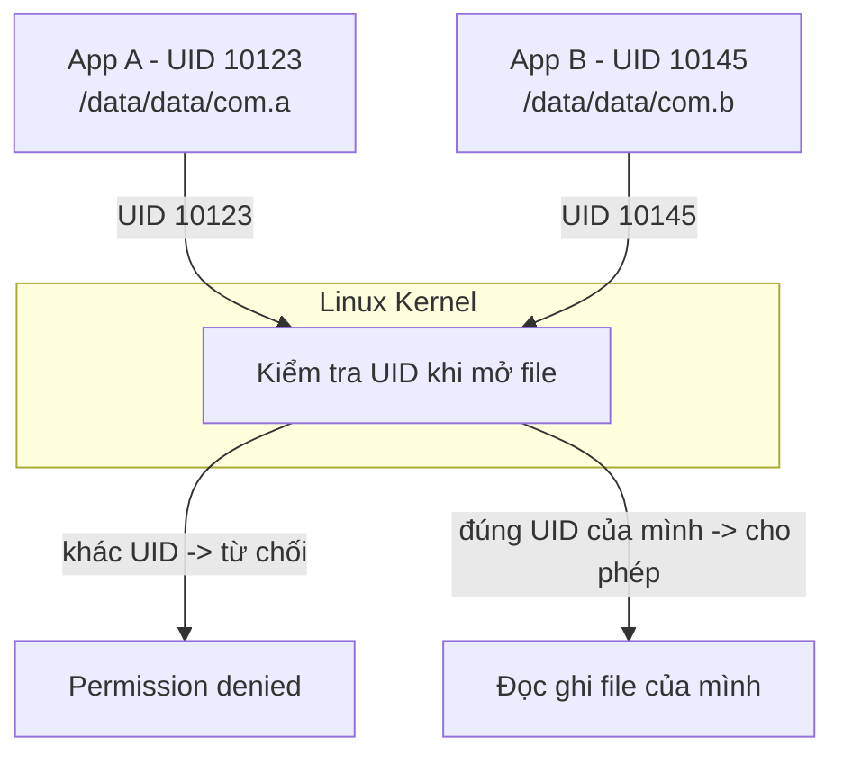
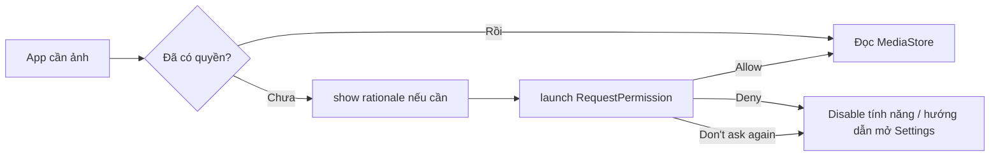
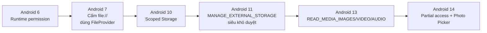
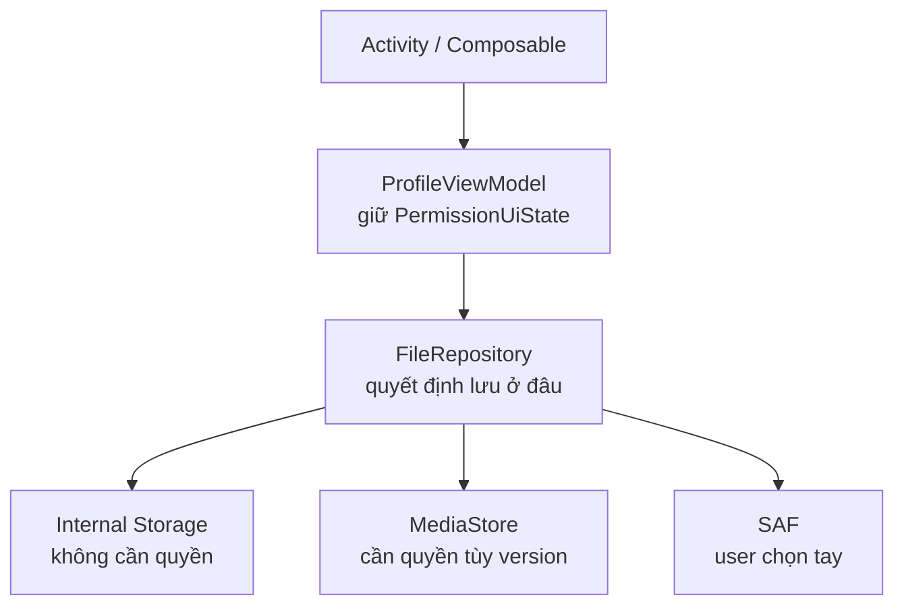
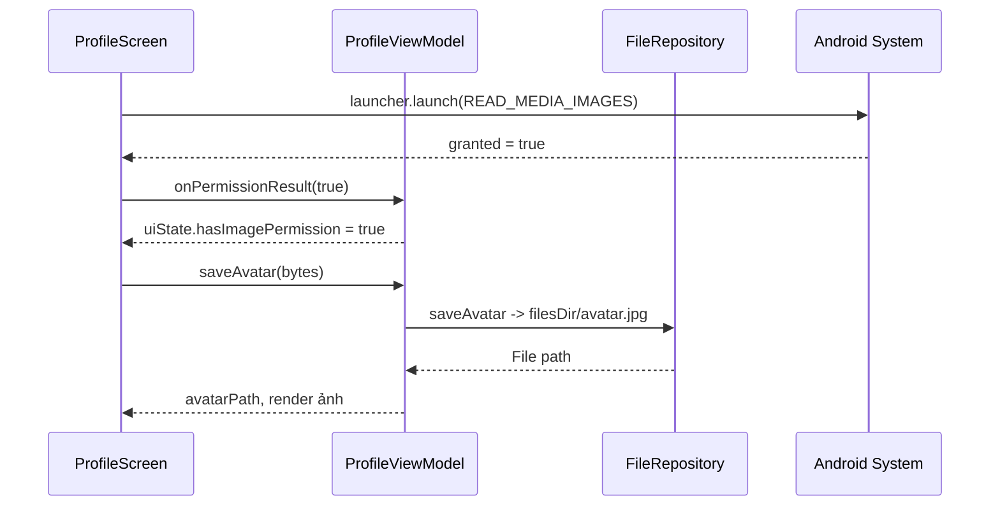
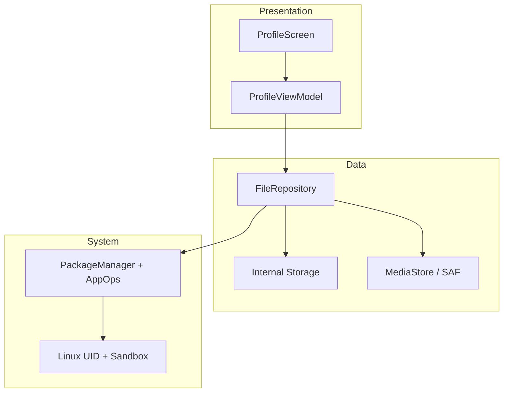

# File Permissions

## Vấn đề cần giải quyết

Bạn làm app profile cho phép user đổi avatar. Trên máy test Android 9 chạy ngon. Lên Android 13 thì crash với `SecurityException: Permission denied`. App khác thì bị Play Store từ chối vì xin `MANAGE_EXTERNAL_STORAGE` trong khi chỉ cần lưu avatar.

Cùng một thao tác "lưu file", nhưng:

- Lưu ở đâu thì không cần xin quyền, lưu ở đâu thì bắt buộc xin?
- Vì sao Android 6 xin lúc chạy, Android 10 lại đổi toàn bộ cách lưu?
- Khi nào dùng Photo Picker thì khỏi xin quyền luôn?

> File Permissions trả lời đúng 3 việc này: app được chạm vào file nào, phải xin phép ra sao, và lưu ở đâu cho đúng khi đi làm.

## File Permissions là gì?

File Permissions là cơ chế quyết định **ai được đọc, ghi, thực thi file nào**.

Android kế thừa nguyên xi từ Linux, rồi thêm một lớp sandbox riêng.

### Gốc Linux tối giản đủ để đi làm

Mỗi file Linux có 3 nhóm quyền:

```text
-rwxr-x---  owner group others
 rwx        r-x        ---
```

- `rwx`: read, write, execute.
- `owner`: người sở hữu file, `group`: nhóm, `others`: còn lại.
- `UID/GID`: định danh user và group sở hữu process đang chạy.

Khi process muốn mở file, kernel so UID của process với owner của file để cho phép hay từ chối.

### Android sandbox: mỗi app là một user Linux



Bản chất:

- Lúc cài app, hệ thống cấp một UID riêng. App A không bao giờ có UID của app B.
- Thư mục `/data/data/<package_name>` chỉ owner mới đọc được. Đây là lý do mặc định các app không đọc trộm nhau.
- Muốn chạm vào file chung của user (ảnh, nhạc, download), app phải đi qua cửa kiểm soát thứ hai: Android permission.

Đây là điểm khác Linux thuần: Linux hỏi "bạn là ai", Android hỏi thêm "user đã đồng ý cho bạn chưa".

## Các loại Storage trong Android

Đây là phần quyết định 80% bug khi đi làm. Chọn sai chỗ lưu là phải xin quyền thừa hoặc bị từ chối.

| Loại | Đường dẫn ví dụ | Cần xin quyền? | Bị xóa khi gỡ app? | Dùng cho |
|---|---|---|---|---|
| Internal app-specific | `/data/data/<pkg>/files/avatar.jpg` | Không | Có | Token file, dữ liệu riêng, nhạy cảm |
| Cache internal | `/data/data/<pkg>/cache/` | Không | Có, hệ thống có thể xóa khi thiếu bộ nhớ | Ảnh thumb tạm, response cache |
| External app-specific | `/sdcard/Android/data/<pkg>/files/` | Không | Có | File lớn riêng của app: video edit dở, offline map |
| Shared Media | `MediaStore.Images / Video / Audio` | Tùy version, xem dưới | Không | Ảnh chụp, video, nhạc muốn hiện trong Gallery |
| Download / Document | `MediaStore.Downloads` hoặc SAF | Tùy cách dùng | Không | PDF export, backup, file user cần giữ |
| Thích bất kỳ chỗ nào | Storage Access Framework | Không cần permission, user chọn tay | Không | Mở / tạo tài liệu ở chỗ user chỉ định |

Nguyên tắc chọn khi đi làm:

- Nên dùng app-specific nếu file chỉ app mình cần. Không xin quyền, không bị Play Store hỏi, không lo Scoped Storage.
- Chỉ dùng Shared khi user cần thấy file ngoài app (ảnh trong Gallery, PDF trong Download).
- Chỉ dùng SAF khi muốn user tự chọn nơi lưu / mở, ví dụ "Export báo cáo ra Download".

> Sai lầm phổ biến nhất của người mới: lưu avatar vào Download rồi đi xin full quyền storage, trong khi lưu vào app-specific thì khỏi xin gì.

## Manifest Permission vs Runtime Permission

Hai lớp khác nhau, phải làm đủ cả hai.

### Manifest: khai báo trước

```xml
<!-- app/src/main/AndroidManifest.xml -->
<manifest>
    <!-- Android 13+ cho ảnh -->
    <uses-permission android:name="android.permission.READ_MEDIA_IMAGES" />
    <uses-permission android:name="android.permission.READ_MEDIA_VIDEO" />
    <!-- Android 12 trở xuống cho file chung -->
    <uses-permission
        android:name="android.permission.READ_EXTERNAL_STORAGE"
        android:maxSdkVersion="32" />
    <!-- Ghi file chung chỉ cần tới Android 9, từ 10 dùng MediaStore -->
    <uses-permission
        android:name="android.permission.WRITE_EXTERNAL_STORAGE"
        android:maxSdkVersion="29" />
</manifest>
```

Khai báo trong Manifest chỉ là "thông báo ý định". Từ Android 6, user còn phải bấm Allow lúc chạy.

### Runtime: xin lúc chạy



### Timeline version bắt buộc nhớ khi đi làm



Ý nghĩa thực tế:

- Đừng xin `READ_EXTERNAL_STORAGE` trên Android 13+, nó không còn tác dụng cho media.
- Đừng xin `MANAGE_EXTERNAL_STORAGE` nếu chỉ lưu avatar hay export PDF, Play Store sẽ từ chối.
- Ưu tiên Photo Picker và SAF vì không cần xin quyền gì cả.

## Triển khai thực tế: Kotlin MVVM

Mục tiêu: code đủ để làm task trong 15 phút, tách đúng tầng UI - ViewModel - Repository.



### 1. Repository: nơi duy nhất biết lưu ở đâu

```kotlin
package com.example.profile.data

import android.content.Context
import android.net.Uri
import java.io.File

class FileRepository(private val context: Context) {

    // Avatar chỉ app mình dùng -> internal, khỏi xin quyền
    fun saveAvatar(bytes: ByteArray): File {
        val file = File(context.filesDir, "avatar.jpg")
        file.writeBytes(bytes)
        return file
    }

    fun readAvatar(): File? {
        val file = File(context.filesDir, "avatar.jpg")
        return file.takeIf { it.exists() }
    }
}
```

Vì sao qua Repository mà không gọi `File` trực tiếp trong ViewModel:

- ViewModel không nên biết file nằm ở `filesDir` hay MediaStore. Đổi chỗ lưu chỉ sửa Repository.
- Dễ test: test ViewModel chỉ cần fake Repository.

### 2. ViewModel: giữ trạng thái quyền

```kotlin
package com.example.profile.ui

import androidx.lifecycle.ViewModel
import androidx.lifecycle.viewModelScope
import com.example.profile.data.FileRepository
import dagger.hilt.android.lifecycle.HiltViewModel
import kotlinx.coroutines.flow.MutableStateFlow
import kotlinx.coroutines.flow.StateFlow
import kotlinx.coroutines.flow.asStateFlow
import kotlinx.coroutines.launch
import javax.inject.Inject

data class PermissionUiState(
    val hasImagePermission: Boolean = false,
    val showRationale: Boolean = false,
    val avatarPath: String? = null
)

@HiltViewModel
class ProfileViewModel @Inject constructor(
    private val repository: FileRepository
) : ViewModel() {

    private val _uiState = MutableStateFlow(PermissionUiState())
    val uiState: StateFlow<PermissionUiState> = _uiState.asStateFlow()

    fun onPermissionResult(granted: Boolean, shouldShowRationale: Boolean) {
        _uiState.value = _uiState.value.copy(
            hasImagePermission = granted,
            showRationale = !granted && shouldShowRationale
        )
    }

    fun saveAvatar(bytes: ByteArray) {
        viewModelScope.launch {
            val file = repository.saveAvatar(bytes)
            _uiState.value = _uiState.value.copy(avatarPath = file.absolutePath)
        }
    }
}
```

### 3. UI: xin quyền bằng ActivityResult API

Cách chuẩn hiện nay, không dùng `requestPermissions` cũ.

```kotlin
// Compose
val viewModel: ProfileViewModel = hiltViewModel()
val permission = if (Build.VERSION.SDK_INT >= 33) {
    android.Manifest.permission.READ_MEDIA_IMAGES
} else {
    android.Manifest.permission.READ_EXTERNAL_STORAGE
}

val launcher = rememberLauncherForActivityResult(
    ActivityResultContracts.RequestPermission()
) { granted ->
    viewModel.onPermissionResult(
        granted = granted,
        shouldShowRationale = activity.shouldShowRequestPermissionRationale(permission)
    )
}

Button(onClick = {
    if (Build.VERSION.SDK_INT >= 33 && !viewModel.uiState.value.hasImagePermission) {
        launcher.launch(permission)
    } else {
        // Đọc avatar internal, khỏi xin
        viewModel.saveAvatar(selectedBytes)
    }
}) {
    Text("Đổi avatar")
}
```

Mô phỏng luồng khi user bấm Allow:



### 4. Không cần xin quyền: Photo Picker và SAF

Khi đi làm, ưu tiên hai cách này vì không cần khai báo quyền gì.

```kotlin
// Photo Picker Android 13+, backport tới Android 4.4 qua AndroidX
// Không cần READ_MEDIA_IMAGES
val pickImage = rememberLauncherForActivityResult(
    ActivityResultContracts.PickVisualMedia()
) { uri: Uri? ->
    uri?.let { viewModel.saveAvatarFromUri(it) }
}

Button(onClick = {
    pickImage.launch(PickVisualMediaRequest(ActivityResultContracts.PickVisualMedia.ImageOnly))
}) {
    Text("Chọn ảnh không cần xin quyền")
}
```

```kotlin
// SAF: user tự chọn nơi tạo PDF export
val createPdf = rememberLauncherForActivityResult(
    ActivityResultContracts.CreateDocument("application/pdf")
) { uri: Uri? ->
    uri?.let { viewModel.exportReport(it) }
}
```

### 5. Share file: bắt buộc dùng FileProvider

Từ Android 7, share `file://` sẽ crash `FileUriExposedException`.

```xml
<!-- AndroidManifest.xml -->
<provider
    android:name="androidx.core.content.FileProvider"
    android:authorities="${applicationId}.provider"
    android:exported="false"
    android:grantUriPermissions="true">
    <meta-data
        android:name="android.support.FILE_PROVIDER_PATHS"
        android:resource="@xml/file_paths" />
</provider>
```

```xml
<!-- res/xml/file_paths.xml -->
<paths>
    <files-path name="avatar" path="." />
    <cache-path name="cache" path="." />
</paths>
```

```kotlin
val file = File(context.filesDir, "avatar.jpg")
val uri: Uri = FileProvider.getUriForFile(
    context, "${context.packageName}.provider", file
)

val intent = Intent(Intent.ACTION_SEND).apply {
    type = "image/jpeg"
    putExtra(Intent.EXTRA_STREAM, uri)
    addFlags(Intent.FLAG_GRANT_READ_URI_PERMISSION)
}
context.startActivity(Intent.createChooser(intent, "Chia sẻ avatar"))
```

## So sánh: MediaStore vs SAF vs Photo Picker

| Tiêu chí | MediaStore | SAF | Photo Picker |
|---|---|---|---|
| Cần permission? | Có, tùy version | Không, user chọn tay | Không |
| Trải nghiệm | Tự động, code đọc trực tiếp | User phải chọn file / thư mục | Picker hệ thống đẹp, quen thuộc |
| Phù hợp | App gallery, camera, nhạc | Export / import tài liệu | Chọn avatar, đính kèm ảnh |
| Duyệt Play Store | Bình thường nếu đúng quyền | Dễ duyệt | Dễ duyệt nhất |
| Khuyên dùng khi đi làm | Khi cần quét toàn bộ media | Khi cần quyền lâu dài một file cụ thể | Mặc định cho chọn ảnh / video |

> Trade-off: càng tiện cho dev (đọc thẳng MediaStore) thì càng phải xin quyền và giải trình. Càng nhường quyền chọn cho user (Picker, SAF) thì càng ít permission, càng dễ qua review.

## Security và Performance ở mức đi làm

Security:

- File riêng luôn để `MODE_PRIVATE`. Không bao giờ lưu token, password ra external.
- External app-specific vẫn app khác có root đọc được, không coi là an toàn.
- Khi share qua FileProvider chỉ grant `FLAG_GRANT_READ_URI_PERMISSION` cho intent đó, không mở public cả thư mục.

Performance:

- Đừng đọc file lớn trên UI thread. Repository nên expose `suspend` hoặc `Flow`.
- Cache ảnh resize trước khi lưu, đừng lưu nguyên ảnh 12MP làm avatar.
- `cacheDir` hệ thống có thể xóa, đừng lưu dữ liệu quan trọng ở đó.

## Sai lầm thường gặp

### 1. Lưu app-specific nhưng vẫn xin full quyền

Lưu avatar vào `filesDir` thì khỏi xin. Xin thừa khiến user sợ và Play Store hỏi.

### 2. Quên `maxSdkVersion` khiến xin quyền chết trên máy mới

```xml
<!-- Đúng: quyền cũ chỉ cần tới Android 12 -->
<uses-permission
    android:name="android.permission.READ_EXTERNAL_STORAGE"
    android:maxSdkVersion="32" />
```

### 3. Dùng đường dẫn cứng `/sdcard/`

```kotlin
// Sai: máy khác nhau mount khác nhau
val file = File("/sdcard/myapp/avatar.jpg")

// Đúng
val file = File(context.filesDir, "avatar.jpg")
```

### 4. Quên handle Deny và Don't ask again

Luôn có nhánh disable tính năng và nút mở Settings. App chỉ hiện màn hình trắng khi bị deny là lỗi UX phổ biến khi review đi làm.

### 5. Test chỉ trên một version

Bug File Permissions 90% chỉ lòi trên version khác. Khi đi làm phải test tối thiểu: Android 9, Android 11, Android 13/14.

## Debug và Testing

Debug trên máy thật:

```text
Device File Explorer trong Android Studio:
data/data/com.example.profile/files/avatar.jpg
data/data/com.example.profile/cache/
sdcard/Android/data/com.example.profile/files/
```

```bash
adb shell dumpsys package com.example.profile | grep permission
adb shell ls -l /data/data/com.example.profile/files
```

Không log đường dẫn tuyệt đối và nội dung file nhạy cảm ra Logcat production.

Testing:

```kotlin
class FakeFileRepository : FileRepository(mockContext) {
    var savedBytes: ByteArray? = null
    override fun saveAvatar(bytes: ByteArray): File {
        savedBytes = bytes
        return File("fake/avatar.jpg")
    }
}

// Test ViewModel không cần thiết bị thật
@Test
fun saveAvatar_updatesUiState() = runTest {
    val vm = ProfileViewModel(FakeFileRepository())
    vm.saveAvatar(byteArrayOf(1, 2, 3))
    assertNotNull(vm.uiState.value.avatarPath)
}
```

## Vị trí trong hệ thống

File Permissions nằm ở Data Layer, dưới ViewModel.



Liên hệ:

- `2.2 Process Management`: mỗi process mang UID, bị giết thì file cache có thể mất.
- `2.4 Multi User OS`: mỗi user máy có sandbox riêng, app user A không thấy file user B.
- `4.1 Manifest`: mọi quyền file đều phải khai báo ở Manifest trước.

## Học tiếp gì?

- `2.2 Process Management`: app sống ở process nào, vì sao bị giết thì mất file tạm.
- `2.4 Multi User OS`: máy nhiều user thì storage tách ra sao.
- `4.1 Manifest Permission tag`: khai báo `provider`, `uses-permission` đầy đủ.
- `Session 05 Data Store + Room`: khi nào lưu file, khi nào lưu database có cấu trúc.
- `Session 08 Local Storage`: cache ảnh, download nền bằng WorkManager.

## Nguồn tham khảo

- [Data and file storage overview — Android Developers](https://developer.android.com/training/data-storage)
- [App-specific storage — Android Developers](https://developer.android.com/training/data-storage/app-specific)
- [Shared media — Android Developers](https://developer.android.com/training/data-storage/shared/media)
- [Storage Access Framework — Android Developers](https://developer.android.com/guide/topics/providers/document-provider)
- [Request runtime permissions — Android Developers](https://developer.android.com/training/permissions/requesting)
- [Behavior changes Scoped Storage Android 10 — Android Developers](https://developer.android.com/about/versions/10/privacy/changes#scoped-storage)
- [Photo Picker — Android Developers](https://developer.android.com/training/data-storage/shared/photopicker)
- [FileProvider — Android Developers](https://developer.android.com/reference/androidx/core/content/FileProvider)
- [Permissions behavior Android 13 — Android Developers](https://developer.android.com/about/versions/13/behavior-changes-13#granular-media-permissions)
- [Partial photo access Android 14 — Android Developers](https://developer.android.com/about/versions/14/changes/partial-photo-video-access)
