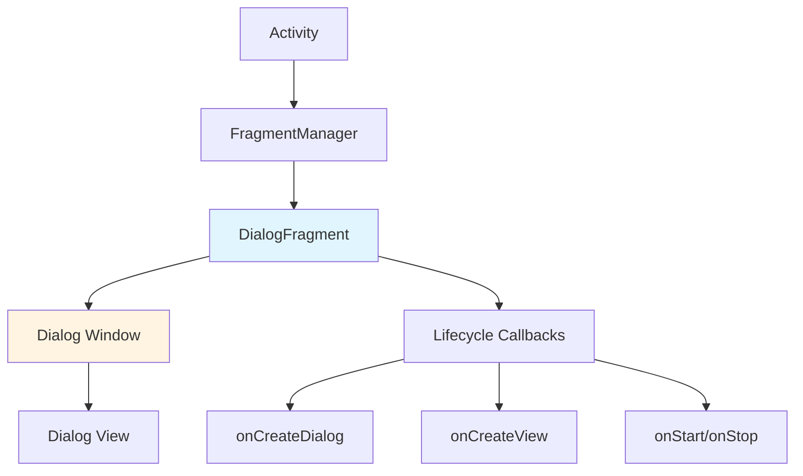
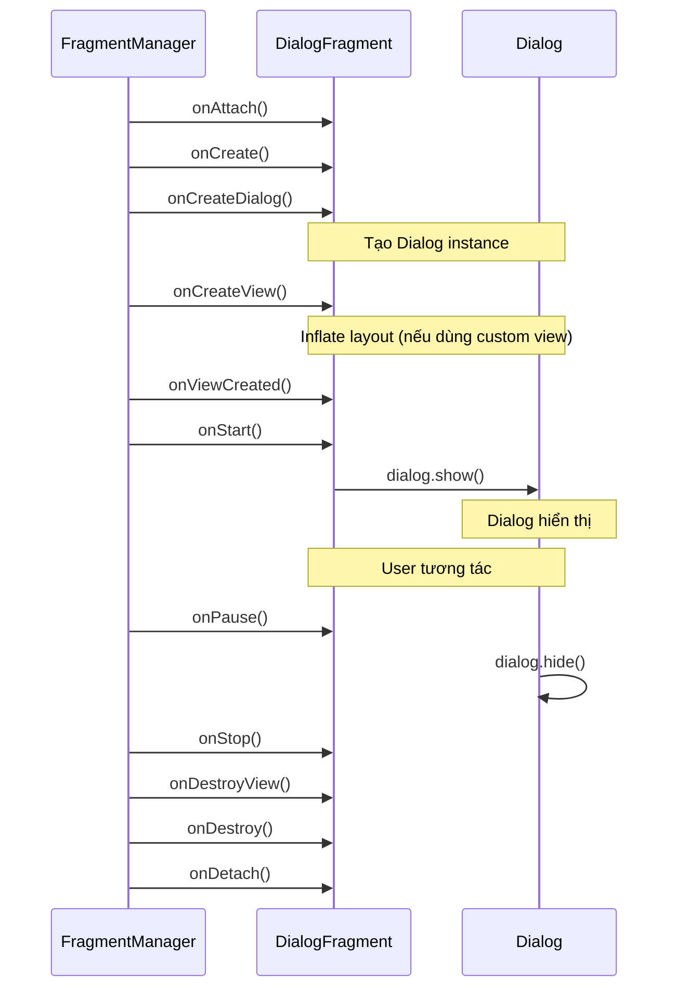
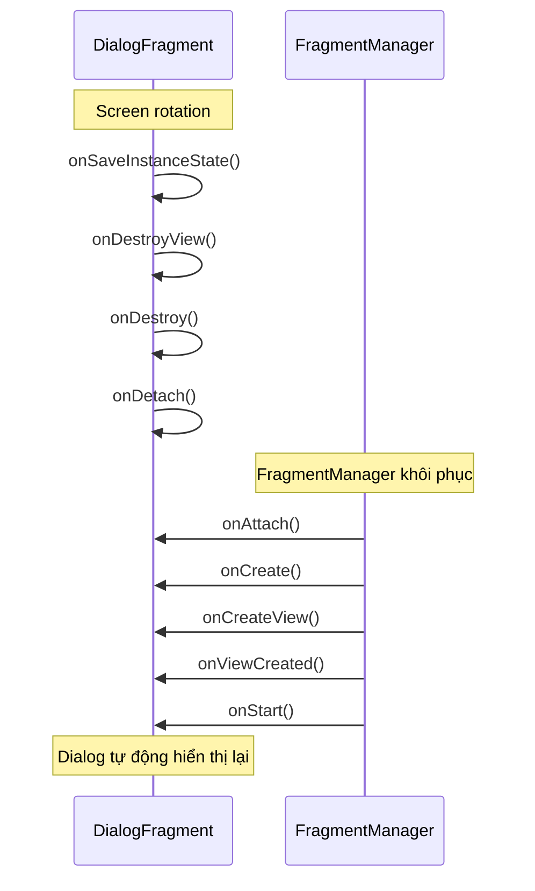
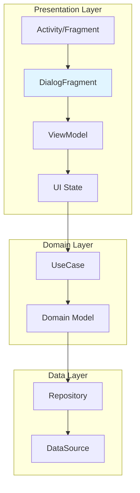

# Dialog and DialogFragment

## Vấn đề cần giải quyết

Dialog là cửa sổ nhỏ xuất hiện phía trước màn hình hiện tại, dùng để:
- Hiển thị thông báo quan trọng.
- Yêu cầu xác nhận từ người dùng.
- Thu thập input ngắn (chọn ngày, chọn thời gian, nhập liệu).
- Hiển thị menu tùy chọn.

### Vấn đề với AlertDialog truyền thống

Trước khi có DialogFragment, lập trình viên thường dùng `AlertDialog` trực tiếp:

```kotlin
// Cách cũ - KHÔNG khuyến nghị
AlertDialog.Builder(this)
    .setTitle("Xác nhận")
    .setMessage("Bạn có chắc chắn muốn xóa?")
    .setPositiveButton("Xóa") { _, _ -> deleteItem() }
    .setNegativeButton("Hủy", null)
    .show()
```

**Vấn đề:**
- **Mất dialog khi rotation**: Activity bị destroy và recreate, dialog biến mất.
- **Không thể khôi phục trạng thái**: Nếu dialog có input (checkbox, text field), dữ liệu bị mất.
- **Khó quản lý lifecycle**: Dialog không có lifecycle rõ ràng, dễ gây memory leak.
- **Không tái sử dụng được**: Mỗi nơi cần dialog phải viết lại code.
- **Crash khi Activity đã destroy**: Nếu callback được gọi sau khi Activity bị destroy.

### DialogFragment ra đời để giải quyết vấn đề gì?

DialogFragment kết hợp **sức mạnh của Fragment** với **giao diện của Dialog**:
- **Tự động xử lý rotation**: FragmentManager tự động khôi phục dialog.
- **Lifecycle rõ ràng**: Có đầy đủ callback vòng đời như Fragment.
- **Tái sử dụng được**: Đóng gói logic dialog vào một class riêng.
- **Giao tiếp an toàn**: Dùng Fragment Result API hoặc Shared ViewModel.
- **Quản lý bởi FragmentManager**: Nhất quán với cách quản lý Fragment khác.

## DialogFragment là gì?

DialogFragment là một **Fragment đặc biệt** được hiển thị dưới dạng dialog. Nó:
- Kế thừa từ `Fragment` (không phải `Dialog`).
- Được quản lý bởi `FragmentManager`.
- Có lifecycle đầy đủ như Fragment.
- Tự động xử lý configuration changes (rotation, dark mode...).

### Kiến trúc tổng thể



DialogFragment tạo ra một **Window riêng** (Dialog Window) nằm trên Window của Activity. Window này chứa View của dialog.

## Lifecycle của DialogFragment

### So sánh với Fragment thông thường



### Các callback quan trọng

**1. onCreateDialog()**
- Được gọi để tạo Dialog instance.
- Trả về `Dialog` (thường là `AlertDialog`).
- Chỉ gọi **một lần** khi DialogFragment được tạo.

```kotlin
override fun onCreateDialog(savedInstanceState: Bundle?): Dialog {
    return AlertDialog.Builder(requireContext())
        .setTitle("Xác nhận")
        .setMessage("Bạn có chắc chắn?")
        .setPositiveButton("OK") { _, _ -> }
        .create()
}
```

**2. onCreateView()**
- Được gọi nếu bạn muốn dùng **custom layout** cho dialog.
- Không cần thiết nếu chỉ dùng `onCreateDialog()`.

```kotlin
override fun onCreateView(
    inflater: LayoutInflater,
    container: ViewGroup?,
    savedInstanceState: Bundle?
): View? {
    return inflater.inflate(R.layout.dialog_custom, container, false)
}
```

**3. onStart() và onStop()**
- `onStart()`: Dialog hiển thị.
- `onStop()`: Dialog ẩn (không phải destroy).
- Dùng để đăng ký/hủy listener.

### Lifecycle khi rotation



FragmentManager **tự động khôi phục** DialogFragment sau rotation. Dialog sẽ hiển thị lại mà không cần code thêm.

## AlertDialog trong DialogFragment

### Cách 1: Dùng onCreateDialog() (Khuyến nghị)

```kotlin
class ConfirmDeleteDialog : DialogFragment() {
    
    override fun onCreateDialog(savedInstanceState: Bundle?): Dialog {
        return AlertDialog.Builder(requireContext())
            .setTitle("Xác nhận xóa")
            .setMessage("Bạn có chắc chắn muốn xóa item này?")
            .setPositiveButton("Xóa") { _, _ ->
                // Xử lý khi nhấn Xóa
                onConfirmDelete()
            }
            .setNegativeButton("Hủy") { dialog, _ ->
                dialog.dismiss()
            }
            .create()
    }
    
    private fun onConfirmDelete() {
        // Logic xóa
        dismiss()
    }
}
```

**Cách hiển thị:**

```kotlin
// Trong Activity hoặc Fragment
ConfirmDeleteDialog().show(supportFragmentManager, "confirm_delete")
```

### Cách 2: Dùng onCreateView() cho custom layout

```kotlin
class CustomInputDialog : DialogFragment() {
    
    private var _binding: DialogCustomInputBinding? = null
    private val binding get() = _binding!!
    
    override fun onCreateView(
        inflater: LayoutInflater,
        container: ViewGroup?,
        savedInstanceState: Bundle?
    ): View {
        _binding = DialogCustomInputBinding.inflate(inflater, container, false)
        return binding.root
    }
    
    override fun onViewCreated(view: View, savedInstanceState: Bundle?) {
        super.onViewCreated(view, savedInstanceState)
        
        binding.btnSubmit.setOnClickListener {
            val input = binding.etInput.text.toString()
            onSubmit(input)
        }
        
        binding.btnCancel.setOnClickListener {
            dismiss()
        }
    }
    
    override fun onDestroyView() {
        super.onDestroyView()
        _binding = null
    }
    
    private fun onSubmit(input: String) {
        // Xử lý input
        dismiss()
    }
}
```

## BottomSheetDialogFragment

### BottomSheetDialogFragment là gì?

BottomSheetDialogFragment là DialogFragment hiển thị dialog **từ dưới lên** (bottom sheet). Phù hợp cho:
- Menu tùy chọn.
- Form nhập liệu.
- Hiển thị chi tiết nhanh.
- Filter, sort options.

### Triển khai BottomSheetDialogFragment

```kotlin
class FilterBottomSheet : BottomSheetDialogFragment() {
    
    private var _binding: BottomSheetFilterBinding? = null
    private val binding get() = _binding!!
    
    override fun onCreateView(
        inflater: LayoutInflater,
        container: ViewGroup?,
        savedInstanceState: Bundle?
    ): View {
        _binding = BottomSheetFilterBinding.inflate(inflater, container, false)
        return binding.root
    }
    
    override fun onViewCreated(view: View, savedInstanceState: Bundle?) {
        super.onViewCreated(view, savedInstanceState)
        
        setupListeners()
    }
    
    private fun setupListeners() {
        binding.btnApply.setOnClickListener {
            val filters = getSelectedFilters()
            onApplyFilters(filters)
            dismiss()
        }
        
        binding.btnCancel.setOnClickListener {
            dismiss()
        }
    }
    
    override fun onDestroyView() {
        super.onDestroyView()
        _binding = null
    }
    
    private fun getSelectedFilters(): Filters {
        // Lấy filter đã chọn
        return Filters()
    }
    
    private fun onApplyFilters(filters: Filters) {
        // Áp dụng filter
    }
}
```

**Cách hiển thị:**

```kotlin
FilterBottomSheet().show(supportFragmentManager, "filter_bottom_sheet")
```

### Customizing BottomSheet behavior

```kotlin
class CustomBottomSheet : BottomSheetDialogFragment() {
    
    override fun onCreateDialog(savedInstanceState: Bundle?): Dialog {
        val dialog = super.onCreateDialog(savedInstanceState) as BottomSheetDialog
        
        dialog.setOnShowListener {
            val bottomSheet = dialog.findViewById<View>(
                com.google.android.material.R.id.design_bottom_sheet
            )
            
            // Set behavior
            val behavior = BottomSheetBehavior.from(bottomSheet as View)
            behavior.peekHeight = 400 // Chiều cao khi peek
            behavior.state = BottomSheetBehavior.STATE_EXPANDED
            
            // Disable drag
            // behavior.isDraggable = false
        }
        
        return dialog
    }
}
```

## Communication - Giao tiếp với Dialog

### Pattern 1: Fragment Result API (Khuyến nghị)

Đây là pattern **hiện đại và an toàn nhất** để dialog trả kết quả cho Fragment/Activity cha.

```kotlin
// ConfirmDeleteDialog.kt
class ConfirmDeleteDialog : DialogFragment() {
    
    companion object {
        const val REQUEST_KEY = "confirm_delete_request"
        const val RESULT_KEY = "confirmed"
    }
    
    override fun onCreateDialog(savedInstanceState: Bundle?): Dialog {
        return AlertDialog.Builder(requireContext())
            .setTitle("Xác nhận xóa")
            .setMessage("Bạn có chắc chắn muốn xóa?")
            .setPositiveButton("Xóa") { _, _ ->
                // Gửi kết quả TRUE
                setFragmentResult(REQUEST_KEY, bundleOf(RESULT_KEY to true))
                dismiss()
            }
            .setNegativeButton("Hủy") { dialog, _ ->
                // Gửi kết quả FALSE
                setFragmentResult(REQUEST_KEY, bundleOf(RESULT_KEY to false))
                dialog.dismiss()
            }
            .create()
    }
}

// Fragment/Activity cha
class ListFragment : Fragment() {
    
    override fun onCreate(savedInstanceState: Bundle?) {
        super.onCreate(savedInstanceState)
        
        // Lắng nghe kết quả từ dialog
        setFragmentResultListener(ConfirmDeleteDialog.REQUEST_KEY) { requestKey, bundle ->
            val confirmed = bundle.getBoolean(ConfirmDeleteDialog.RESULT_KEY)
            if (confirmed) {
                deleteItem()
            }
        }
    }
    
    private fun showDeleteConfirmation() {
        ConfirmDeleteDialog().show(childFragmentManager, "confirm_delete")
    }
    
    private fun deleteItem() {
        // Logic xóa
    }
}
```

**Ưu điểm:**
- Fragment không cần biết về dialog.
- Kết quả được gửi qua Bundle (type-safe).
- Hoạt động đúng ngay cả khi dialog bị dismiss do rotation.
- Không cần interface callback.

### Pattern 2: Shared ViewModel

Dùng khi dialog và Fragment/Activity cha cần **chia sẻ dữ liệu phức tạp**.

```kotlin
// SharedViewModel.kt
class SharedViewModel : ViewModel() {
    private val _dialogResult = MutableStateFlow<DialogResult?>(null)
    val dialogResult: StateFlow<DialogResult?> = _dialogResult
    
    fun setDialogResult(result: DialogResult) {
        _dialogResult.value = result
    }
    
    fun clearResult() {
        _dialogResult.value = null
    }
}

// ConfirmDialog.kt
class ConfirmDialog : DialogFragment() {
    private val viewModel: SharedViewModel by activityViewModels()
    
    override fun onCreateDialog(savedInstanceState: Bundle?): Dialog {
        return AlertDialog.Builder(requireContext())
            .setTitle("Xác nhận")
            .setPositiveButton("OK") { _, _ ->
                viewModel.setDialogResult(DialogResult.Confirmed)
                dismiss()
            }
            .create()
    }
}

// Fragment cha
class ParentFragment : Fragment() {
    private val viewModel: SharedViewModel by activityViewModels()
    
    override fun onViewCreated(view: View, savedInstanceState: Bundle?) {
        viewLifecycleOwner.lifecycleScope.launch {
            viewModel.dialogResult.collect { result ->
                result?.let {
                    handleResult(it)
                    viewModel.clearResult()
                }
            }
        }
    }
    
    private fun handleResult(result: DialogResult) {
        when (result) {
            is DialogResult.Confirmed -> { /* ... */ }
            is DialogResult.Cancelled -> { /* ... */ }
        }
    }
}
```

### Pattern 3: Interface Callback (Legacy)

Pattern cũ, không khuyến nghị trong project mới.

```kotlin
class ConfirmDialog : DialogFragment() {
    
    interface OnConfirmListener {
        fun onConfirm()
        fun onCancel()
    }
    
    private var listener: OnConfirmListener? = null
    
    override fun onAttach(context: Context) {
        super.onAttach(context)
        listener = when {
            parentFragment is OnConfirmListener -> parentFragment as OnConfirmListener
            context is OnConfirmListener -> context as OnConfirmListener
            else -> throw ClassCastException("$context must implement OnConfirmListener")
        }
    }
    
    override fun onCreateDialog(savedInstanceState: Bundle?): Dialog {
        return AlertDialog.Builder(requireContext())
            .setPositiveButton("OK") { _, _ -> listener?.onConfirm() }
            .setNegativeButton("Cancel") { _, _ -> listener?.onCancel() }
            .create()
    }
    
    override fun onDetach() {
        super.onDetach()
        listener = null
    }
}
```

**Nhược điểm:**
- Coupling cao giữa dialog và Activity/Fragment.
- Khó tái sử dụng.
- Khó test.

## Dialog trong Compose

### AlertDialog trong Compose

```kotlin
@Composable
fun ConfirmDeleteDialog(
    onConfirm: () -> Unit,
    onDismiss: () -> Unit
) {
    AlertDialog(
        onDismissRequest = onDismiss,
        title = { Text("Xác nhận xóa") },
        text = { Text("Bạn có chắc chắn muốn xóa item này?") },
        confirmButton = {
            TextButton(onClick = onConfirm) {
                Text("Xóa")
            }
        },
        dismissButton = {
            TextButton(onClick = onDismiss) {
                Text("Hủy")
            }
        }
    )
}

// Cách sử dụng
@Composable
fun ListScreen() {
    var showDialog by remember { mutableStateOf(false) }
    
    if (showDialog) {
        ConfirmDeleteDialog(
            onConfirm = {
                // Xóa item
                showDialog = false
            },
            onDismiss = { showDialog = false }
        )
    }
    
    Button(onClick = { showDialog = true }) {
        Text("Xóa")
    }
}
```

### Custom Dialog trong Compose

```kotlin
@Composable
fun CustomInputDialog(
    onDismiss: () -> Unit,
    onSubmit: (String) -> Unit
) {
    var inputText by remember { mutableStateOf("") }
    
    Dialog(onDismissRequest = onDismiss) {
        Surface(
            shape = RoundedCornerShape(16.dp),
            modifier = Modifier.padding(16.dp)
        ) {
            Column(
                modifier = Modifier.padding(16.dp),
                verticalArrangement = Arrangement.spacedBy(16.dp)
            ) {
                Text(
                    text = "Nhập tên",
                    style = MaterialTheme.typography.titleLarge
                )
                
                OutlinedTextField(
                    value = inputText,
                    onValueChange = { inputText = it },
                    label = { Text("Tên") },
                    modifier = Modifier.fillMaxWidth()
                )
                
                Row(
                    modifier = Modifier.fillMaxWidth(),
                    horizontalArrangement = Arrangement.End
                ) {
                    TextButton(onClick = onDismiss) {
                        Text("Hủy")
                    }
                    Spacer(modifier = Modifier.width(8.dp))
                    Button(onClick = { onSubmit(inputText) }) {
                        Text("Xác nhận")
                    }
                }
            }
        }
    }
}
```

### ModalBottomSheet trong Compose

```kotlin
@OptIn(ExperimentalMaterial3Api::class)
@Composable
fun FilterBottomSheet(
    onDismiss: () -> Unit,
    onApply: (Filters) -> Unit
) {
    ModalBottomSheet(
        onDismissRequest = onDismiss,
        sheetState = rememberModalBottomSheetState()
    ) {
        Column(
            modifier = Modifier
                .fillMaxWidth()
                .padding(16.dp)
        ) {
            Text(
                text = "Bộ lọc",
                style = MaterialTheme.typography.titleLarge
            )
            
            Spacer(modifier = Modifier.height(16.dp))
            
            // Filter options
            // ...
            
            Spacer(modifier = Modifier.height(16.dp))
            
            Row(
                modifier = Modifier.fillMaxWidth(),
                horizontalArrangement = Arrangement.spacedBy(8.dp)
            ) {
                OutlinedButton(
                    onClick = onDismiss,
                    modifier = Modifier.weight(1f)
                ) {
                    Text("Hủy")
                }
                Button(
                    onClick = { onApply(Filters()) },
                    modifier = Modifier.weight(1f)
                ) {
                    Text("Áp dụng")
                }
            }
            
            Spacer(modifier = Modifier.height(16.dp))
        }
    }
}
```

### So sánh Dialog XML vs Compose

| Aspect | XML (DialogFragment) | Compose (Dialog/AlertDialog) |
|--------|---------------------|------------------------------|
| **Đơn vị** | Fragment | Composable function |
| **State management** | Bundle, ViewModel | Compose state |
| **Lifecycle** | Fragment lifecycle | Composition lifecycle |
| **Rotation handling** | Tự động (FragmentManager) | Tự động (rememberSaveable) |
| **Animation** | XML animation | AnimatedVisibility, Crossfade |
| **Customization** | Custom layout | Composable tree |
| **Testing** | FragmentScenario | ComposeTestRule |

## DialogFragment vs Navigation Component Dialog

### Navigation Component Dialog

Navigation Component cung cấp cách hiển thị dialog thông qua NavGraph:

```xml
<!-- nav_graph.xml -->
<dialog
    android:id="@+id/confirmDialog"
    android:name="com.example.ConfirmDialog"
    android:label="ConfirmDialog" />
```

```kotlin
// Điều hướng đến dialog
findNavController().navigate(R.id.confirmDialog)
```

### So sánh chi tiết

| Tiêu chí | DialogFragment | Navigation Dialog |
|----------|---------------|-------------------|
| **Learning curve** | Thấp | Trung bình |
| **Type safety** | Không | Có (Safe Args) |
| **Deep linking** | Tự implement | Hỗ trợ sẵn |
| **Back Stack** | FragmentManager | NavController |
| **Animation** | Thủ công | Hỗ trợ sẵn |
| **Testing** | FragmentScenario | TestNavHostController |
| **Boilerplate** | Nhiều | Ít |
| **Compose support** | Không | Có |

### Khi nào dùng DialogFragment?

- Project nhỏ, ít dialog.
- Cần kiểm soát chi tiết lifecycle.
- Không muốn thêm dependency.
- Đang maintain codebase cũ.

### Khi nào dùng Navigation Dialog?

- Project lớn, nhiều dialog.
- Cần deep linking đến dialog.
- Làm việc với team lớn, cần type safety.
- Dùng Compose.

## Best Practices

### 1. Luôn dùng Fragment Result API cho communication

```kotlin
// Đúng
class MyDialog : DialogFragment() {
    override fun onCreateDialog(savedInstanceState: Bundle?): Dialog {
        return AlertDialog.Builder(requireContext())
            .setPositiveButton("OK") { _, _ ->
                setFragmentResult("request_key", bundleOf("result" to true))
                dismiss()
            }
            .create()
    }
}

// Sai (coupling cao)
class MyDialog : DialogFragment() {
    private lateinit var callback: () -> Unit
    
    fun setCallback(cb: () -> Unit) {
        callback = cb
    }
}
```

### 2. Dùng `requireContext()` thay vì `context` hoặc `activity`

```kotlin
// Đúng
override fun onCreateDialog(savedInstanceState: Bundle?): Dialog {
    return AlertDialog.Builder(requireContext())
        .setTitle("Title")
        .create()
}

// Sai (có thể null)
override fun onCreateDialog(savedInstanceState: Bundle?): Dialog {
    return AlertDialog.Builder(context!!)  // Crash nếu context null
        .setTitle("Title")
        .create()
}
```

### 3. Cleanup binding trong onDestroyView()

```kotlin
class CustomDialog : DialogFragment() {
    private var _binding: DialogCustomBinding? = null
    private val binding get() = _binding!!
    
    override fun onCreateView(
        inflater: LayoutInflater,
        container: ViewGroup?,
        savedInstanceState: Bundle?
    ): View {
        _binding = DialogCustomBinding.inflate(inflater, container, false)
        return binding.root
    }
    
    override fun onDestroyView() {
        super.onDestroyView()
        _binding = null  // Tránh memory leak
    }
}
```

### 4. Set dialog style trong onCreate()

```kotlin
class FullScreenDialog : DialogFragment() {
    
    override fun onCreate(savedInstanceState: Bundle?) {
        super.onCreate(savedInstanceState)
        setStyle(STYLE_NORMAL, R.style.FullScreenDialog)
    }
}
```

### 5. Handle dismiss đúng cách

```kotlin
class MyDialog : DialogFragment() {
    
    override fun onDismiss(dialog: DialogInterface) {
        super.onDismiss(dialog)
        // Cleanup khi dialog bị dismiss
    }
    
    override fun onCancel(dialog: DialogInterface) {
        super.onCancel(dialog)
        // Handle khi user nhấn Back hoặc tap outside
    }
}
```

## Common Mistakes

### Lỗi 1: Memory leak do giữ reference đến Activity

```kotlin
// Sai
class MyDialog : DialogFragment() {
    private var activity: MainActivity? = null
    
    override fun onAttach(context: Context) {
        super.onAttach(context)
        activity = context as MainActivity  // Memory leak!
    }
}

// Đúng
class MyDialog : DialogFragment() {
    // Dùng Fragment Result API hoặc Shared ViewModel
}
```

### Lỗi 2: Crash khi dismiss sau khi Activity đã destroy

```kotlin
// Sai
fun someCallback() {
    dialog.dismiss()  // Crash nếu Activity đã destroy
}

// Đúng
fun someCallback() {
    if (isAdded && !isDetached) {
        dismiss()
    }
}
```

### Lỗi 3: Không handle rotation cho custom view

```kotlin
// Sai
class CustomDialog : DialogFragment() {
    private var inputText = ""
    
    override fun onViewCreated(view: View, savedInstanceState: Bundle?) {
        binding.etInput.setText(inputText)
        binding.etInput.addTextChangedListener {
            inputText = it.toString()  // Không lưu khi rotation
        }
    }
}

// Đúng
class CustomDialog : DialogFragment() {
    private var inputText = ""
    
    override fun onSaveInstanceState(outState: Bundle) {
        super.onSaveInstanceState(outState)
        outState.putString("input_text", inputText)
    }
    
    override fun onViewCreated(view: View, savedInstanceState: Bundle?) {
        savedInstanceState?.let {
            inputText = it.getString("input_text", "")
        }
        binding.etInput.setText(inputText)
    }
}
```

### Lỗi 4: Dùng dialog.show() mà không check state

```kotlin
// Sai
fun showDialog() {
    MyDialog().show(supportFragmentManager, "tag")
}

// Đúng
fun showDialog() {
    if (!isStateSaved) {
        MyDialog().show(supportFragmentManager, "tag")
    }
}
```

## Debug Techniques

### 1. Log lifecycle của DialogFragment

```kotlin
class MyDialog : DialogFragment() {
    
    override fun onAttach(context: Context) {
        super.onAttach(context)
        Log.d("DialogLifecycle", "onAttach")
    }
    
    override fun onCreate(savedInstanceState: Bundle?) {
        super.onCreate(savedInstanceState)
        Log.d("DialogLifecycle", "onCreate")
    }
    
    override fun onCreateDialog(savedInstanceState: Bundle?): Dialog {
        Log.d("DialogLifecycle", "onCreateDialog")
        return super.onCreateDialog(savedInstanceState)
    }
    
    override fun onStart() {
        super.onStart()
        Log.d("DialogLifecycle", "onStart - Dialog visible")
    }
    
    override fun onStop() {
        super.onStop()
        Log.d("DialogLifecycle", "onStop - Dialog hidden")
    }
    
    override fun onDestroyView() {
        super.onDestroyView()
        Log.d("DialogLifecycle", "onDestroyView")
    }
}
```

### 2. Debug dialog stack

```kotlin
fun debugDialogStack() {
    val fragmentManager = supportFragmentManager
    fragmentManager.fragments.forEach { fragment ->
        if (fragment is DialogFragment) {
            Log.d("DialogStack", "Dialog: ${fragment.javaClass.simpleName}")
            Log.d("DialogStack", "  isAdded: ${fragment.isAdded}")
            Log.d("DialogStack", "  isVisible: ${fragment.isVisible}")
            Log.d("DialogStack", "  dialog: ${fragment.dialog}")
        }
    }
}
```

### 3. Dùng Layout Inspector

Mở **Layout Inspector** trong Android Studio để xem:
- Dialog window hierarchy.
- View tree của dialog.
- Properties của từng view.

## Performance Considerations

### 1. Tránh tạo DialogFragment không cần thiết

```kotlin
// Sai: Tạo dialog mới mỗi lần
fun showDialog() {
    MyDialog().show(supportFragmentManager, "tag")
}

// Đúng: Tái sử dụng dialog nếu đã tồn tại
fun showDialog() {
    val existingDialog = supportFragmentManager.findFragmentByTag("tag")
    if (existingDialog == null) {
        MyDialog().show(supportFragmentManager, "tag")
    }
}
```

### 2. Dùng dismissAllowingStateLoss() cho non-critical dialogs

```kotlin
// Dialog không quan trọng, có thể mất nếu Activity bị kill
fun dismissDialog() {
    dismissAllowingStateLoss()
}
```

### 3. Lazy inflate custom view

```kotlin
class CustomDialog : DialogFragment() {
    private var _binding: DialogCustomBinding? = null
    private val binding get() = _binding!!
    
    override fun onCreateView(
        inflater: LayoutInflater,
        container: ViewGroup?,
        savedInstanceState: Bundle?
    ): View {
        // Chỉ inflate khi cần
        _binding = DialogCustomBinding.inflate(inflater, container, false)
        return binding.root
    }
}
```

## System Thinking - Vị trí trong kiến trúc

### DialogFragment trong MVVM + Clean Architecture



**Vai trò của DialogFragment**:
- **Presentation Layer**: Hiển thị dialog, thu thập input từ user.
- **Không thuộc Domain Layer**: DialogFragment không nên xuất hiện trong UseCase.
- **Không thuộc Data Layer**: DialogFragment không nên biết về Repository.

### Nguyên tắc Separation of Concerns

```kotlin
// Đúng: DialogFragment chỉ ở Presentation Layer
class ConfirmDeleteDialog : DialogFragment() {
    private val viewModel: ConfirmDialogViewModel by viewModels()
    
    override fun onCreateDialog(savedInstanceState: Bundle?): Dialog {
        return AlertDialog.Builder(requireContext())
            .setTitle("Xác nhận xóa")
            .setPositiveButton("Xóa") { _, _ ->
                viewModel.confirmDelete(itemId)
                dismiss()
            }
            .create()
    }
}

// Sai: DialogFragment xuất hiện ở Domain Layer
class DeleteItemUseCase(
    private val repository: Repository,
    private val dialog: DialogFragment  // KHÔNG NÊN
) {
    suspend fun execute(itemId: String) {
        dialog.show()  // KHÔNG NÊN
        repository.delete(itemId)
    }
}
```

## References

- [Android Developers - DialogFragment](https://developer.android.com/reference/androidx/fragment/app/DialogFragment)
- [Android Developers - Dialogs](https://developer.android.com/guide/topics/ui/dialogs)
- [Android Developers - BottomSheetDialogFragment](https://developer.android.com/reference/com/google/android/material/bottomsheet/BottomSheetDialogFragment)
- [Material Design - Dialogs](https://m3.material.io/components/dialogs)
- [Jetpack Compose - Dialogs](https://developer.android.com/jetpack/compose/elements#dialogs)
