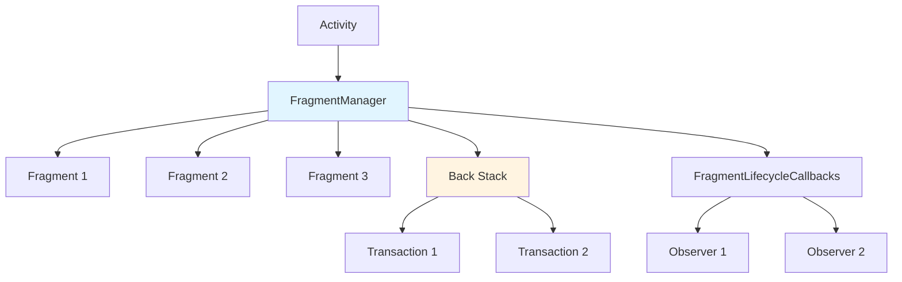
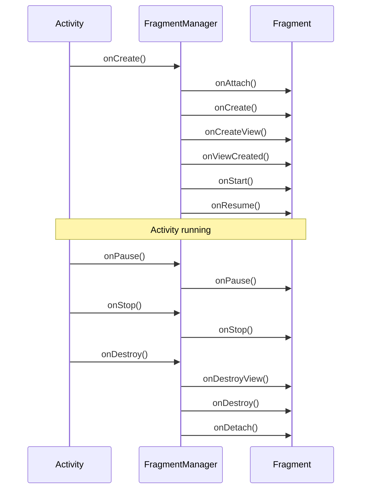
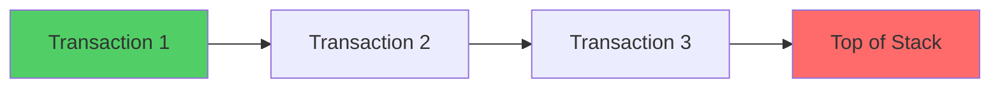
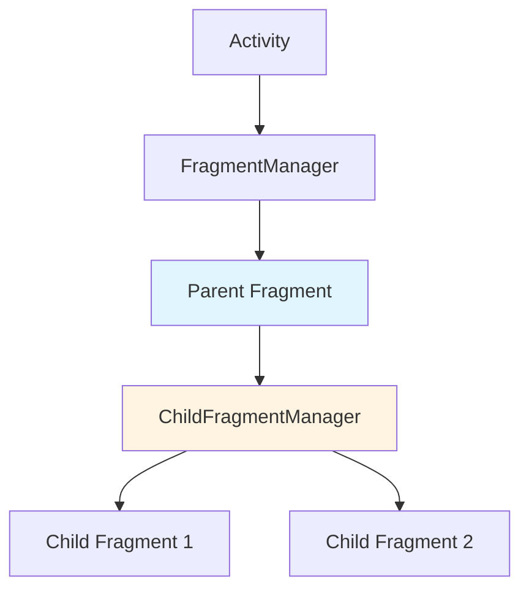
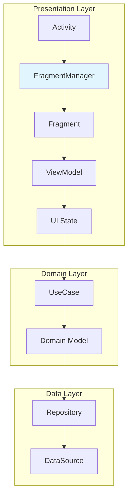

# FragmentManager

## FragmentManager là gì?

FragmentManager là thành phần trung tâm trong hệ thống Fragment của Android, chịu trách nhiệm:

- **Quản lý vòng đời** của tất cả Fragment trong Activity.
- **Thực hiện các thao tác** (thêm, xóa, thay thế, ẩn/hiện) thông qua FragmentTransaction.
- **Quản lý Back Stack** - điều hướng ngược qua các Fragment.
- **Tìm kiếm Fragment** theo ID hoặc tag.
- **Phối hợp với Activity** để đồng bộ trạng thái khi cấu hình thay đổi (rotation, dark mode...).

FragmentManager không phải là một class bạn tự khởi tạo. Nó được cung cấp bởi Activity hoặc Fragment cha thông qua:

```kotlin
// Trong Activity
val fragmentManager = supportFragmentManager

// Trong Fragment (để quản lý Child Fragment)
val childFragmentManager = childFragmentManager

// Trong Fragment (để truy cập FragmentManager của Activity cha)
val parentFragmentManager = parentFragmentManager
```

## Tại sao FragmentManager tồn tại?

### Vấn đề trước khi có FragmentManager

Trước Android 3.0 (API 11), Activity là đơn vị UI duy nhất. Khi cần hiển thị nhiều màn hình trong cùng một Activity, lập trình viên phải:

- Tự quản lý View hierarchy phức tạp.
- Tự xử lý vòng đời của từng phần UI.
- Tự đồng bộ trạng thái khi cấu hình thay đổi.
- Không có cơ chế tái sử dụng UI giữa các Activity.

### FragmentManager giải quyết vấn đề gì?

FragmentManager giải quyết 3 vấn đề cốt lõi:

**1. Tách biệt trách nhiệm quản lý**

Activity không cần biết chi tiết về vòng đời của từng Fragment. FragmentManager đảm nhận vai trò "quản lý vòng đời thay mặt Activity".

**2. Cung cấp API thống nhất cho thao tác UI**

Thay vì thao tác View trực tiếp (addView, removeView), FragmentManager cung cấp FragmentTransaction - một API bậc cao, an toàn hơn, có hỗ trợ Back Stack.

**3. Tự động xử lý cấu hình thay đổi**

FragmentManager tự động lưu trữ và khôi phục trạng thái của Fragment khi Activity bị destroy và recreate (do rotation, dark mode...).

## Cơ chế hoạt động

### Kiến trúc tổng thể



FragmentManager hoạt động như một **trung gian** giữa Activity và các Fragment:

1. **Activity** yêu cầu FragmentManager thực hiện thao tác (thêm Fragment, chuyển Fragment...).
2. **FragmentManager** tạo FragmentTransaction, thực thi thao tác.
3. **FragmentManager** cập nhật Back Stack nếu cần.
4. **FragmentManager** đồng bộ vòng đời của tất cả Fragment với Activity.

### Vòng đời phối hợp

FragmentManager đảm bảo vòng đời của Fragment luôn đồng bộ với Activity:



FragmentManager gọi các callback vòng đời của Fragment **theo đúng thứ tự** và **đồng bộ với Activity**. Nếu Activity ở trạng thái `RESUMED`, Fragment cũng sẽ ở `RESUMED`.

## FragmentTransaction - Thao tác với Fragment

### FragmentTransaction là gì?

FragmentTransaction là một **đối tượng mô tả một loạt thao tác** sẽ thực hiện trên Fragment. Nó tuân theo pattern **Builder** và **Command**.

```kotlin
supportFragmentManager.beginTransaction()
    .add(R.id.container, ProfileFragment())
    .addToBackStack(null)
    .commit()
```

Mỗi FragmentTransaction có thể chứa nhiều thao tác:

- `add()`: Thêm Fragment vào container.
- `replace()`: Xóa Fragment cũ, thêm Fragment mới.
- `remove()`: Xóa Fragment khỏi container.
- `hide()`: Ẩn Fragment (không xóa khỏi bộ nhớ).
- `show()`: Hiển thị Fragment đã ẩn.
- `attach()`: Attach Fragment đã detach.
- `detach()`: Detach Fragment (xóa View, giữ instance).
- `setReorderingAllowed(true)`: Cho phép tối ưu thứ tự thực thi.

### Commit vs CommitAllowingStateLoss

```kotlin
// Cách 1: Commit thông thường
fragmentManager.beginTransaction()
    .replace(R.id.container, fragment)
    .commit()

// Cách 2: Commit cho phép mất trạng thái
fragmentManager.beginTransaction()
    .replace(R.id.container, fragment)
    .commitAllowingStateLoss()

// Cách 3: Commit và chờ kết quả (synchronous)
fragmentManager.beginTransaction()
    .replace(R.id.container, fragment)
    .commitNow()
```

**Khi nào dùng cái nào?**

- `commit()`: Mặc định, an toàn. Thao tác được thực hiện bất đồng bộ trong message queue.
- `commitAllowingStateLoss()`: Dùng khi Activity đã save state (ví dụ: trong `onSaveInstanceState()`). Chấp nhận mất trạng thái nếu Activity bị kill.
- `commitNow()`: Thực thi đồng bộ. Hữu ích khi cần Fragment đã sẵn sàng ngay sau khi commit.

### Animation và Transition

```kotlin
supportFragmentManager.beginTransaction()
    .setCustomAnimations(
        R.anim.slide_in_right,  // enter
        R.anim.slide_out_left,  // exit
        R.anim.slide_in_left,   // popEnter
        R.anim.slide_out_right  // popExit
    )
    .replace(R.id.container, fragment)
    .addToBackStack(null)
    .commit()
```

Animation được áp dụng cho cả 2 chiều:
- **Forward**: Khi thêm Fragment mới (enter/exit).
- **Backward**: Khi pop Fragment khỏi Back Stack (popEnter/popExit).

## Back Stack - Điều hướng ngược

### Back Stack là gì?

Back Stack là một **ngăn xếp các FragmentTransaction**. Khi người dùng nhấn Back, FragmentManager sẽ **pop** transaction gần nhất ra khỏi Back Stack và **đảo ngược** thao tác.



### addToBackStack()

```kotlin
supportFragmentManager.beginTransaction()
    .replace(R.id.container, ProfileFragment())
    .addToBackStack("profile")  // Tag để nhận diện
    .commit()
```

**Quan trọng**: `addToBackStack()` chỉ lưu **transaction**, không lưu **Fragment instance**. Khi pop, FragmentManager sẽ **đảo ngược** thao tác:

- Nếu transaction là `add()` → pop sẽ `remove()`.
- Nếu transaction là `replace()` → pop sẽ khôi phục Fragment cũ.
- Nếu transaction là `remove()` → pop sẽ `add()` lại.

### popBackStack()

```kotlin
// Pop 1 transaction
supportFragmentManager.popBackStack()

// Pop đến tag cụ thể
supportFragmentManager.popBackStack("profile", 0)

// Pop đến tag, bao gồm cả tag đó
supportFragmentManager.popBackStack("profile", POP_BACK_STACK_INCLUSIVE)

// Pop đến ID
supportFragmentManager.popBackStack(transactionId, 0)
```

### Ví dụ thực tế: Bottom Navigation với Back Stack

```kotlin
class MainActivity : AppCompatActivity() {
    
    private var currentFragment: Fragment? = null
    
    fun navigateTo(fragment: Fragment, tag: String) {
        val fragmentManager = supportFragmentManager
        val existingFragment = fragmentManager.findFragmentByTag(tag)
        
        if (existingFragment == null) {
            // Fragment chưa tồn tại → thêm mới
            fragmentManager.beginTransaction()
                .hide(currentFragment!!)
                .add(R.id.container, fragment, tag)
                .commit()
        } else {
            // Fragment đã tồn tại → chỉ hide/show
            fragmentManager.beginTransaction()
                .hide(currentFragment!!)
                .show(existingFragment)
                .commit()
        }
        
        currentFragment = existingFragment ?: fragment
    }
}
```

**Tại sao không dùng `addToBackStack()` trong trường hợp này?**

Vì Bottom Navigation cần **giữ trạng thái** của tất cả tab. Nếu dùng `addToBackStack()`, khi nhấn Back sẽ pop Fragment ra khỏi Back Stack, làm mất trạng thái.

Thay vào đó, ta dùng `hide()`/`show()` để **giữ Fragment trong bộ nhớ** nhưng không hiển thị.

## Communication - Giao tiếp giữa các Fragment

### Pattern 1: Shared ViewModel (Khuyến nghị)

Đây là pattern **chuẩn mực** trong MVVM. Các Fragment chia sẻ cùng một ViewModel thông qua Activity scope.

```kotlin
// SharedViewModel.kt
class SharedViewModel : ViewModel() {
    private val _selectedItem = MutableStateFlow<Item?>(null)
    val selectedItem: StateFlow<Item?> = _selectedItem
    
    fun selectItem(item: Item) {
        _selectedItem.value = item
    }
}

// ListFragment.kt
class ListFragment : Fragment() {
    private val viewModel: SharedViewModel by activityViewModels()
    
    override fun onViewCreated(view: View, savedInstanceState: Bundle?) {
        viewLifecycleOwner.lifecycleScope.launch {
            viewModel.selectedItem.collect { item ->
                // Xử lý khi item được chọn
            }
        }
        
        binding.recyclerView.setOnItemClickListener { item ->
            viewModel.selectItem(item)
        }
    }
}

// DetailFragment.kt
class DetailFragment : Fragment() {
    private val viewModel: SharedViewModel by activityViewModels()
    
    override fun onViewCreated(view: View, savedInstanceState: Bundle?) {
        viewLifecycleOwner.lifecycleScope.launch {
            viewModel.selectedItem.collect { item ->
                item?.let { displayDetail(it) }
            }
        }
    }
}
```

**Ưu điểm**:
- Fragment không cần biết về nhau.
- Dữ liệu được quan sát (observable), tự động cập nhật.
- Dễ test, dễ bảo trì.

### Pattern 2: Fragment Result API (Cho one-time event)

Dùng khi Fragment A cần **gửi kết quả** cho Fragment B (ví dụ: chọn ảnh, chọn file).

```kotlin
// FragmentA.kt - Gửi kết quả
class FragmentA : Fragment() {
    
    fun onItemSelected(item: Item) {
        setFragmentResult("requestKey", bundleOf("item" to item))
        findNavController().popBackStack()
    }
}

// FragmentB.kt - Nhận kết quả
class FragmentB : Fragment() {
    
    override fun onCreate(savedInstanceState: Bundle?) {
        super.onCreate(savedInstanceState)
        
        setFragmentResultListener("requestKey") { requestKey, bundle ->
            val item = bundle.getParcelable<Item>("item")
            // Xử lý kết quả
        }
    }
}
```

**Khi nào dùng?**
- One-time event (chọn ảnh, chọn file, confirm dialog).
- Fragment không cần quan sát liên tục.
- Kết quả được gửi qua Bundle (phải Parcelable/Serializable).

### Pattern 3: Interface Callback (Legacy)

Pattern cũ, không khuyến nghị trong project mới.

```kotlin
// FragmentA.kt
class FragmentA : Fragment() {
    
    interface OnItemSelectedListener {
        fun onItemSelected(item: Item)
    }
    
    private var listener: OnItemSelectedListener? = null
    
    override fun onAttach(context: Context) {
        super.onAttach(context)
        listener = context as? OnItemSelectedListener
            ?: throw ClassCastException("$context must implement OnItemSelectedListener")
    }
    
    fun onItemClick(item: Item) {
        listener?.onItemSelected(item)
    }
}
```

**Nhược điểm**:
- Fragment phụ thuộc vào Activity (coupling cao).
- Không tái sử dụng được.
- Khó test.

## Child Fragment - Fragment lồng nhau

### Child Fragment là gì?

Child Fragment là Fragment được **quản lý bởi Fragment khác** thay vì Activity. FragmentManager của Fragment cha được gọi là `childFragmentManager`.



### Khi nào dùng Child Fragment?

**Trường hợp 1: ViewPager2 với TabLayout**

```kotlin
class ParentFragment : Fragment() {
    
    override fun onViewCreated(view: View, savedInstanceState: Bundle?) {
        val adapter = ViewPagerAdapter(childFragmentManager, lifecycle)
        binding.viewPager.adapter = adapter
        
        TabLayoutMediator(binding.tabLayout, binding.viewPager) { tab, position ->
            tab.text = when (position) {
                0 -> "Tab 1"
                1 -> "Tab 2"
                else -> "Tab 3"
            }
        }.attach()
    }
}
```

**Trường hợp 2: Nested Navigation**

Khi một phần của màn hình có navigation riêng (ví dụ: tab "Profile" có sub-tab "Posts", "Photos", "Videos").

```kotlin
class ProfileFragment : Fragment() {
    
    fun navigateToPosts() {
        childFragmentManager.beginTransaction()
            .replace(R.id.profile_container, PostsFragment())
            .addToBackStack(null)
            .commit()
    }
}
```

### Lưu ý quan trọng

- **Vòng đời**: Child Fragment bị ảnh hưởng bởi vòng đời của Parent Fragment. Khi Parent bị destroy, Child cũng bị destroy.
- **Back Stack**: Child Fragment có Back Stack riêng. Khi nhấn Back, Child Back Stack được pop trước, sau đó mới đến Parent Back Stack.
- **Communication**: Child Fragment nên giao tiếp với Parent Fragment thông qua Shared ViewModel hoặc Fragment Result API.

## So sánh FragmentManager vs Navigation Component

### Navigation Component là gì?

Navigation Component là thư viện của Jetpack, cung cấp API bậc cao để quản lý điều hướng trong ứng dụng. Nó **sử dụng FragmentManager bên dưới**.

### So sánh chi tiết

| Tiêu chí | FragmentManager | Navigation Component |
|----------|----------------|---------------------|
| **Learning curve** | Thấp, API đơn giản | Trung bình, cần hiểu NavGraph, NavHost |
| **Type safety** | Không (dùng tag/id string) | Có (dùng Safe Args plugin) |
| **Deep linking** | Tự implement | Hỗ trợ sẵn |
| **Back Stack management** | Thủ công | Tự động, có thể customize |
| **Animation** | Thủ công | Hỗ trợ sẵn trong XML |
| **Testing** | Khó (phụ thuộc Activity) | Dễ hơn (có TestNavHostController) |
| **Modularization** | Khó | Dễ (dynamic feature module) |
| **Compose support** | Không | Có (Navigation Compose) |
| **Boilerplate** | Nhiều | Ít |

### Khi nào dùng FragmentManager?

- Project nhỏ, ít màn hình.
- Cần kiểm soát chi tiết Back Stack.
- Không muốn thêm dependency.
- Đang maintain codebase cũ.

### Khi nào dùng Navigation Component?

- Project lớn, nhiều màn hình.
- Cần deep linking.
- Làm việc với team lớn, cần type safety.
- Dùng Compose.
- Cần modularization.

### Ví dụ so sánh code

**FragmentManager:**

```kotlin
// Điều hướng
supportFragmentManager.beginTransaction()
    .replace(R.id.container, DetailFragment())
    .addToBackStack(null)
    .commit()

// Truyền dữ liệu
val fragment = DetailFragment().apply {
    arguments = bundleOf("itemId" to itemId)
}
supportFragmentManager.beginTransaction()
    .replace(R.id.container, fragment)
    .addToBackStack(null)
    .commit()
```

**Navigation Component:**

```kotlin
// Điều hướng
findNavController().navigate(R.id.action_to_detail)

// Truyền dữ liệu (với Safe Args)
val action = ListFragmentDirections.actionToDetail(itemId)
findNavController().navigate(action)
```

## FragmentManager trong XML vs Compose

### XML (Traditional View System)

```kotlin
class MainActivity : AppCompatActivity() {
    
    override fun onCreate(savedInstanceState: Bundle?) {
        super.onCreate(savedInstanceState)
        setContentView(R.layout.activity_main)
        
        if (savedInstanceState == null) {
            supportFragmentManager.beginTransaction()
                .add(R.id.container, HomeFragment())
                .commit()
        }
    }
}
```

### Compose (Navigation Compose)

Trong Compose, bạn **không dùng FragmentManager trực tiếp**. Thay vào đó, dùng **Navigation Compose** - một thư viện điều hướng dành riêng cho Compose.

```kotlin
@Composable
fun AppNavigation() {
    val navController = rememberNavController()
    
    NavHost(navController = navController, startDestination = "home") {
        composable("home") {
            HomeScreen(onNavigateToDetail = { itemId ->
                navController.navigate("detail/$itemId")
            })
        }
        
        composable(
            route = "detail/{itemId}",
            arguments = listOf(navArgument("itemId") { type = NavType.StringType })
        ) { backStackEntry ->
            val itemId = backStackEntry.arguments?.getString("itemId")
            DetailScreen(itemId = itemId)
        }
    }
}
```

### Sự khác biệt cốt lõi

| Aspect | XML (FragmentManager) | Compose (Navigation Compose) |
|--------|----------------------|------------------------------|
| **Đơn vị điều hướng** | Fragment | Composable function |
| **Quản lý trạng thái** | Fragment lifecycle | Compose state + SavedStateHandle |
| **Back Stack** | FragmentTransaction | NavBackStackEntry |
| **Animation** | XML animation | AnimatedContent, Crossfade |
| **Type safety** | Bundle (Parcelable) | NavType + Safe Args |

### Chuyển từ XML sang Compose

Nếu đang migrate từ XML sang Compose, bạn có thể **dùng chung Fragment và Compose** trong cùng một Activity:

```kotlin
class MainActivity : AppCompatActivity() {
    
    override fun onCreate(savedInstanceState: Bundle?) {
        super.onCreate(savedInstanceState)
        
        // Fragment XML truyền thống
        supportFragmentManager.beginTransaction()
            .add(R.id.fragment_container, LegacyFragment())
            .commit()
        
        // Compose trong cùng Activity
        setContentView {
            AppNavigation()
        }
    }
}
```

## Best Practices

### 1. Luôn dùng `commit()` thay vì `commitAllowingStateLoss()`

```kotlin
// Đúng
supportFragmentManager.beginTransaction()
    .replace(R.id.container, fragment)
    .commit()

// Sai (trừ khi thật sự cần)
supportFragmentManager.beginTransaction()
    .replace(R.id.container, fragment)
    .commitAllowingStateLoss()
```

`commitAllowingStateLoss()` có thể gây mất trạng thái nếu Activity bị kill. Chỉ dùng khi bạn **chấp nhận rủi ro** (ví dụ: hiển thị dialog không quan trọng).

### 2. Dùng `setReorderingAllowed(true)` cho nhiều thao tác

```kotlin
supportFragmentManager.beginTransaction()
    .setReorderingAllowed(true)
    .hide(currentFragment)
    .add(R.id.container, newFragment)
    .commit()
```

`setReorderingAllowed(true)` cho phép FragmentManager **tối ưu thứ tự thực thi**, tránh việc Fragment bị create/destroy không cần thiết.

### 3. Luôn dùng Shared ViewModel cho communication

```kotlin
// Đúng
class FragmentA : Fragment() {
    private val viewModel: SharedViewModel by activityViewModels()
}

class FragmentB : Fragment() {
    private val viewModel: SharedViewModel by activityViewModels()
}

// Sai (coupling cao)
class FragmentA : Fragment() {
    private lateinit var fragmentB: FragmentB
    
    fun sendData(data: Data) {
        fragmentB.receiveData(data)
    }
}
```

### 4. Dùng `viewLifecycleOwner` thay vì `this` khi observe LiveData/Flow

```kotlin
// Đúng
override fun onViewCreated(view: View, savedInstanceState: Bundle?) {
    viewLifecycleOwner.lifecycleScope.launch {
        viewModel.data.collect { /* ... */ }
    }
}

// Sai (memory leak)
override fun onCreate(savedInstanceState: Bundle?) {
    lifecycleScope.launch {
        viewModel.data.collect { /* ... */ }
    }
}
```

`viewLifecycleOwner` chỉ sống từ `onViewCreated()` đến `onDestroyView()`. Dùng `this` (Fragment lifecycle) sẽ gây **memory leak** vì coroutine sống lâu hơn View.

### 5. Tránh nested Fragment quá sâu

```kotlin
// Tránh
Activity
  └─ Fragment A
      └─ Fragment B
          └─ Fragment C
              └─ Fragment D
```

Nested Fragment quá sâu gây:
- Khó debug.
- Vòng đời phức tạp.
- Back Stack khó kiểm soát.

Nếu cần nested navigation, cân nhắc dùng **Navigation Component** với **nested NavGraph**.

## Common Mistakes

### Lỗi 1: Transaction đã commit sau `onSaveInstanceState()`

```kotlin
// Lỗi
override fun onSaveInstanceState(outState: Bundle) {
    super.onSaveInstanceState(outState)
    
    // Crash: IllegalStateException
    supportFragmentManager.beginTransaction()
        .replace(R.id.container, fragment)
        .commit()
}
```

**Nguyên nhân**: Sau `onSaveInstanceState()`, Activity không cho phép commit transaction vì có thể gây mất trạng thái.

**Giải pháp**:
- Dùng `commitAllowingStateLoss()` nếu chấp nhận mất trạng thái.
- Hoặc delay transaction đến `onResume()`.

### Lỗi 2: Memory leak do retain Fragment

```kotlin
// Lỗi
class MyFragment : Fragment() {
    
    override fun onCreate(savedInstanceState: Bundle?) {
        super.onCreate(savedInstanceState)
        retainInstance = true  // Deprecated, không dùng
    }
}
```

`retainInstance = true` giữ Fragment instance khi Activity bị recreate, gây **memory leak** nếu Fragment giữ reference đến Activity hoặc View.

**Giải pháp**: Dùng `ViewModel` với `SavedStateHandle` để lưu trữ dữ liệu.

### Lỗi 3: Find Fragment bằng ID sai

```kotlin
// Lỗi
val fragment = supportFragmentManager.findFragmentById(R.id.container)
fragment as MyFragment  // ClassCastException nếu không phải MyFragment

// Đúng
val fragment = supportFragmentManager.findFragmentByTag("my_fragment")
if (fragment is MyFragment) {
    // Xử lý
}
```

Luôn dùng `findFragmentByTag()` với tag rõ ràng. Check type trước khi cast.

### Lỗi 4: Không handle Back Stack đúng cách

```kotlin
// Lỗi
override fun onBackPressed() {
    if (supportFragmentManager.backStackEntryCount > 0) {
        supportFragmentManager.popBackStack()
    } else {
        super.onBackPressed()
    }
}
```

Vấn đề: Không handle trường hợp có nhiều Back Stack (ví dụ: Bottom Navigation + nested navigation).

**Giải pháp**: Dùng `OnBackPressedDispatcher` (AndroidX Activity 1.1+):

```kotlin
class MainActivity : AppCompatActivity() {
    
    override fun onCreate(savedInstanceState: Bundle?) {
        super.onCreate(savedInstanceState)
        
        onBackPressedDispatcher.addCallback(this) {
            if (!supportFragmentManager.popBackStackImmediate()) {
                isEnabled = false
                onBackPressedDispatcher.onBackPressed()
            }
        }
    }
}
```

## Debug Techniques

### 1. Log tất cả FragmentTransaction

```kotlin
supportFragmentManager.beginTransaction()
    .replace(R.id.container, fragment)
    .addToBackStack(null)
    .commit()

// Log Back Stack
fun logBackStack() {
    val fragmentManager = supportFragmentManager
    Log.d("BackStack", "Entry count: ${fragmentManager.backStackEntryCount}")
    
    for (i in 0 until fragmentManager.backStackEntryCount) {
        val entry = fragmentManager.getBackStackEntryAt(i)
        Log.d("BackStack", "[$i] ${entry.name} - ${entry.id}")
    }
}
```

### 2. Dùng FragmentLifecycleCallbacks

```kotlin
class MyApplication : Application() {
    
    override fun onCreate() {
        super.onCreate()
        
        registerActivityLifecycleCallbacks(object : ActivityLifecycleCallbacks {
            override fun onActivityCreated(activity: Activity, savedInstanceState: Bundle?) {
                if (activity is AppCompatActivity) {
                    activity.supportFragmentManager.registerFragmentLifecycleCallbacks(
                        object : FragmentManager.FragmentLifecycleCallbacks() {
                            override fun onFragmentCreated(fm: FragmentManager, f: Fragment, savedInstanceState: Bundle?) {
                                Log.d("FragmentLifecycle", "${f.javaClass.simpleName} - onFragmentCreated")
                            }
                            
                            override fun onFragmentResumed(fm: FragmentManager, f: Fragment) {
                                Log.d("FragmentLifecycle", "${f.javaClass.simpleName} - onFragmentResumed")
                            }
                        },
                        true  // true = recursive (bao gồm Child Fragment)
                    )
                }
            }
        })
    }
}
```

### 3. Debug Back Stack với Stetho/Flipper

Dùng **Stetho** hoặc **Flipper** để inspect Fragment Back Stack trong runtime:

```kotlin
// Stetho
class MyApplication : Application() {
    override fun onCreate() {
        super.onCreate()
        Stetho.initializeWithDefaults(this)
    }
}
```

Mở Chrome, truy cập `chrome://inspect` để xem Fragment hierarchy.

## Performance Considerations

### 1. Tránh tạo Fragment không cần thiết

```kotlin
// Sai: Tạo Fragment mới mỗi lần
fun navigateToDetail() {
    supportFragmentManager.beginTransaction()
        .replace(R.id.container, DetailFragment())
        .commit()
}

// Đúng: Tái sử dụng Fragment nếu đã tồn tại
fun navigateToDetail() {
    val fragment = supportFragmentManager.findFragmentByTag("detail")
        ?: DetailFragment()
    
    supportFragmentManager.beginTransaction()
        .replace(R.id.container, fragment, "detail")
        .commit()
}
```

### 2. Dùng `hide()`/`show()` thay vì `replace()` cho Bottom Navigation

```kotlin
// Sai: Replace mỗi lần switch tab
fun switchTab(tab: Int) {
    val fragment = when (tab) {
        0 -> HomeFragment()
        1 -> SearchFragment()
        else -> ProfileFragment()
    }
    supportFragmentManager.beginTransaction()
        .replace(R.id.container, fragment)
        .commit()
}

// Đúng: Hide/Show để giữ trạng thái
fun switchTab(tab: Int) {
    val tag = when (tab) {
        0 -> "home"
        1 -> "search"
        else -> "profile"
    }
    
    val fragmentManager = supportFragmentManager
    val newFragment = fragmentManager.findFragmentByTag(tag)
        ?: createFragment(tab).also {
            fragmentManager.beginTransaction()
                .add(R.id.container, it, tag)
                .hide(currentFragment!!)
                .commit()
        }
    
    fragmentManager.beginTransaction()
        .hide(currentFragment!!)
        .show(newFragment)
        .commit()
    
    currentFragment = newFragment
}
```

### 3. Lazy initialization cho Child Fragment

```kotlin
class ParentFragment : Fragment() {
    
    private var childFragment: ChildFragment? = null
    
    fun showChildFragment() {
        if (childFragment == null) {
            childFragment = ChildFragment()
            childFragmentManager.beginTransaction()
                .add(R.id.child_container, childFragment!!)
                .commit()
        }
    }
}
```

Chỉ tạo Child Fragment khi cần, không tạo sẵn trong `onCreate()`.

## System Thinking - Vị trí trong kiến trúc

### FragmentManager trong MVVM + Clean Architecture



**Vai trò của FragmentManager**:
- **Presentation Layer**: Quản lý vòng đời Fragment, điều hướng Back Stack.
- **Không thuộc Domain Layer**: FragmentManager không nên xuất hiện trong UseCase hay Domain Model.
- **Không thuộc Data Layer**: FragmentManager không nên biết về Repository hay DataSource.

### Nguyên tắc Separation of Concerns

```kotlin
// Đúng: FragmentManager chỉ ở Presentation Layer
class HomeFragment : Fragment() {
    private val viewModel: HomeViewModel by viewModels()
    
    override fun onViewCreated(view: View, savedInstanceState: Bundle?) {
        // FragmentManager ở đây
        viewLifecycleOwner.lifecycleScope.launch {
            viewModel.uiState.collect { state ->
                render(state)
            }
        }
    }
    
    fun navigateToDetail(itemId: String) {
        // FragmentManager điều hướng
        findNavController().navigate(
            HomeFragmentDirections.actionToDetail(itemId)
        )
    }
}

// Sai: FragmentManager xuất hiện ở Domain Layer
class HomeUseCase(
    private val repository: Repository,
    private val fragmentManager: FragmentManager  // KHÔNG NÊN
) {
    suspend fun execute() {
        val data = repository.getData()
        fragmentManager.beginTransaction()  // KHÔNG NÊN
            .replace(R.id.container, DetailFragment())
            .commit()
    }
}
```

### FragmentManager và Dependency Injection

```kotlin
@Module
@InstallIn(ActivityComponent::class)
abstract class FragmentModule {
    
    @Binds
    abstract fun bindFragmentManager(activity: AppCompatActivity): FragmentManager {
        return activity.supportFragmentManager
    }
}

// Trong Fragment
@AndroidEntryPoint
class HomeFragment : Fragment() {
    
    @Inject
    lateinit var fragmentManager: FragmentManager
    
    override fun onViewCreated(view: View, savedInstanceState: Bundle?) {
        // Dùng fragmentManager đã được inject
        fragmentManager.beginTransaction()
            .replace(R.id.container, DetailFragment())
            .commit()
    }
}
```

**Lưu ý**: Chỉ inject `FragmentManager` khi cần thiết. Trong hầu hết trường hợp, dùng `supportFragmentManager` hoặc `childFragmentManager` trực tiếp là đủ.

## References

- [Android Developers - FragmentManager](https://developer.android.com/reference/androidx/fragment/app/FragmentManager)
- [Android Developers - FragmentTransaction](https://developer.android.com/reference/androidx/fragment/app/FragmentTransaction)
- [Android Developers - Navigation Component](https://developer.android.com/guide/navigation)
- [Android Developers - Fragment best practices](https://developer.android.com/guide/fragments)
- [Jetpack Navigation Compose](https://developer.android.com/jetpack/compose/navigation)
