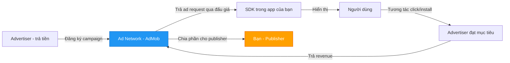
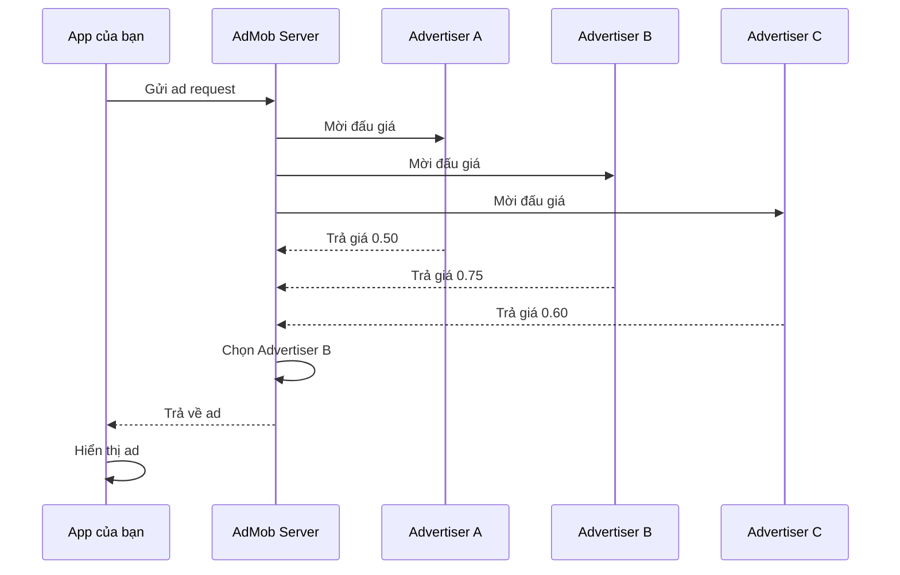
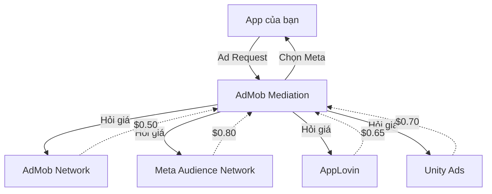
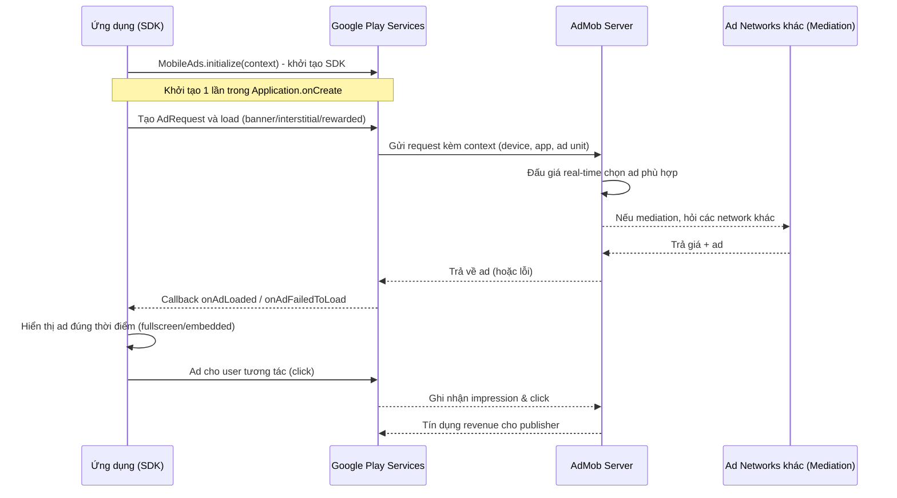
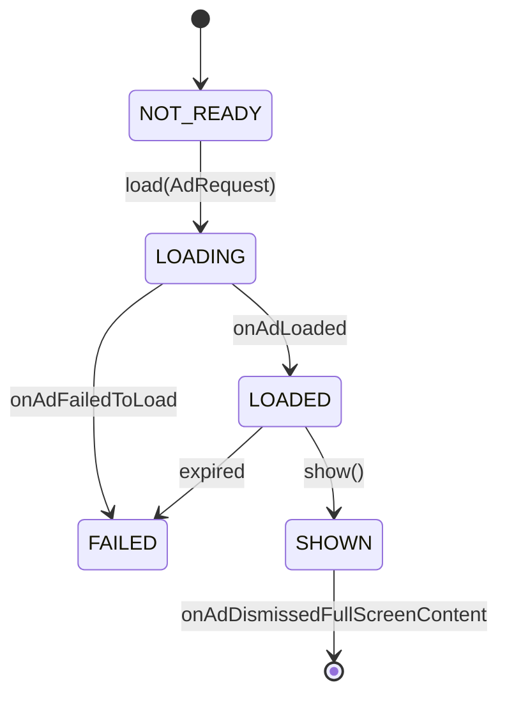

# Advertisements

## Vấn đề cần giải quyết

Người dùng đa số không muốn trả tiền để dùng app. Nhà phát triển cần tiền để duy trì máy chủ, trả lương, phát triển tính năng. Mâu thuẫn này được giải quyết bằng **quảng cáo**: app miễn phí cho user, revenue đến từ advertiser trả tiền cho mỗi lần hiển thị.

Nhưng quảng cáo không đơn giản là "dán một banner lên màn hình". App của bạn chỉ là **một phía** (Publisher). Để có quảng cáo hiển thị, phải có cả một hệ thống gồm:

- **Advertiser** (advertiser) — người trả tiền để quảng bá sản phẩm/dịch vụ.
- **Ad Network** (ad network) — trung gian kết nối advertiser với publisher, vận hành real-time bidding.
- **Publisher** (bạn) — app show ad để kiếm revenue.
- **SDK** — thư viện chạy trong app để yêu cầu và show ad.

Nếu tự xây toàn bộ hệ thống này thì không khả thi. Bài này giúp bạn hiểu và tích hợp **Google Mobile Ads SDK (AdMob)** — ad network lớn nhất của Google — đúng cách, từ bản chất đến code thực tế.

## Sau khi học xong

- Giải thích được bản chất quảng cáo trên Android và vai trò của từng thành phần (Advertiser, Ad Network, Publisher, SDK).
- Phân biệt được Banner, Interstitial, Rewarded, Rewarded Interstitial và Native Ads — khi nào dùng loại nào, ưu nhược điểm từng loại.
- Áp dụng được Google Mobile Ads SDK vào app cả View System (XML) lẫn Jetpack Compose.
- Triển khai được quảng cáo trong MVVM/Clean Architecture ở đúng tầng, không vi phạm kiến trúc.
- Giải thích được các chú thích về lifecycle khi show ad (load/show/destroy đúng thời điểm).
- Nhận diện được các lỗi tích hợp phổ biến và cách debug, test ad an toàn.

## Quảng cáo trên Android là gì?

**Quảng cáo trên Android** là việc một app (Publisher) hiển thị nội dung quảng bá trả phí cho user thông qua một SDK của Ad Network. Phổ biến nhất là **Google AdMob** — nền tảng quản lý quảng cáo của Google, hoạt động dựa trên **Google Mobile Ads SDK**.

```text
Quảng cáo (Ads) = cầu nối giữa advertiser (trả tiền) và app miễn phí (phục vụ user)
```

### Các thành phần tham gia



**Chi tiết từng thành phần:**

**Advertiser (Nhà quảng cáo):**
- Là công ty/cá nhân muốn quảng bá sản phẩm, dịch vụ.
- Trả tiền cho Ad Network theo mô hình:
  - **CPC (Cost Per Click):** trả tiền khi user click vào ad.
  - **CPM (Cost Per Mille):** trả tiền cho mỗi 1000 impression.
  - **CPI (Cost Per Install):** trả tiền khi user cài app qua ad.
- Tạo campaign quảng cáo trên Google Ads, đặt budget, chọn target audience.

**Ad Network (Mạng quảng cáo - AdMob):**
- Trung gian kết nối advertiser với publisher.
- Vận hành **real-time bidding (Real-Time Bidding - RTB)**: mỗi khi có ad request, nhiều advertiser đấu giá, ad trả tiền cao nhất sẽ được hiển thị.
- Quản lý payment, report, fraud detection (invalid traffic).
- Cung cấp SDK cho publisher tích hợp vào app.

**Publisher (Bạn):**
- Tích hợp SDK vào app.
- Hiển thị ad để kiếm revenue.
- Tuân thủ chính sách của Ad Network (không click fraud, không show ad sai cách...).

**SDK (Google Mobile Ads SDK):**
- Thư viện chạy trong app của bạn.
- Gửi ad request đến Ad Network.
- Nhận ad về và hiển thị.
- Theo dõi impression, click, gửi dữ liệu về Ad Network.

**App ID và Ad Unit ID** — hai mã định danh quan trọng:

- **App ID** (`ca-app-pub-XXXX~YYYY`) — định danh **app của bạn** trong AdMob, khai báo trong `AndroidManifest.xml`. Mỗi app chỉ có một App ID.
- **Ad Unit ID** (`ca-app-pub-XXXX/YYYY`) — định danh từng **vị trí show ad** trong app. Một app có thể có nhiều Ad Unit ID:
  - `ca-app-pub-XXXX/1111` — Banner ở màn hình chính.
  - `ca-app-pub-XXXX/2222` — Interstitial sau khi hoàn thành level.
  - `ca-app-pub-XXXX/3333` — Rewarded khi user muốn nhận thưởng.

## Vì sao AdMob tồn tại? Nó giải quyết vấn đề gì?

### Vấn đề khi không có Ad Network

Nếu không có Ad Network, bạn sẽ phải:

- **Tự tìm advertiser** — rất khó, cần đội ngũ sales, hợp đồng pháp lý.
- **Tự xây hệ thống đấu giá** — phức tạp, cần server, thuật toán tối ưu.
- **Tự quản lý payment** — xử lý tiền từ nhiều nguồn, reconciliation, thuế.
- **Tự fraud detection** — phát hiện invalid click, invalid impression.
- **Tự cung cấp nguồn ad** — nếu không có advertiser, app trống trơn.

Tất cả những việc này đòi hỏi nguồn lực khổng lồ, không khả thi với đa số app.

### AdMob giải quyết những gì?

**1. Nguồn quảng cáo khổng lồ**

AdMob kết nối với hàng nghìn advertiser qua Google Ads — nền tảng quảng cáo lớn nhất thế giới. Bạn không cần tìm advertiser, AdMob tự động cung cấp ad phù hợp với ngữ cảnh app của bạn.

**2. Tự động đấu giá (Ad Auction)**

Mỗi lần app yêu cầu ad, AdMob tổ chức real-time bidding:



**3. Mediation — tối đa revenue**

AdMob có thể làm trung gian với các ad network khác (Meta Audience Network, AppLovin, Unity Ads...). Khi app yêu cầu ad, AdMob hỏi nhiều network cùng lúc, chọn ad trả tiền cao nhất:



**4. Thanh toán, report, fraud detection**

- **Thanh toán:** AdMob tự động chuyển tiền vào tài khoản ngân hàng của bạn hàng tháng (khi đạt ngưỡng tối thiểu $100).
- **Báo cáo:** Dashboard chi tiết về impression, click, revenue, eCPM (effective Cost Per Mille — revenue trên 1000 impression).
- **Chống fraud:** Google tự động phát hiện invalid click, invalid impression, bảo vệ advertiser và publisher.

## Cách hoạt động bên trong

### Luồng yêu cầu ad chi tiết



**Chi tiết từng bước:**

**Bước 1: Khởi tạo SDK**

```kotlin
MobileAds.initialize(this) { initializationStatus ->
    // SDK đã sẵn sàng
}
```

- Gọi **một lần** trong `Application.onCreate()`.
- SDK tải cấu hình từ AdMob (ad units, mediation config, A/B testing).
- Không cần chờ xong mới load ad — SDK tự xếp hàng (queue) các request.

**Bước 2: Tạo AdRequest**

```kotlin
val adRequest = AdRequest.Builder()
    .addNetworkExtrasBundle(AdMobAdapter::class.java, bundle)  // tùy chọn
    .build()
```

- AdRequest chứa thông tin về ngữ cảnh: thiết bị, vị trí, nội dung app.
- AdMob dùng thông tin này để chọn ad phù hợp (targeting).

**Bước 3: Load ad**

```kotlin
InterstitialAd.load(context, adUnitId, adRequest) { ad, error ->
    if (error == null) {
        // Ad đã tải xong, có thể show
    } else {
        // Lỗi: no fill, network error, invalid ad unit...
    }
}
```

- Load **asynchronous** — không block UI thread.
- Kết quả trả về qua callback.
- Ad có thể không có sẵn (no fill) nếu không có advertiser phù hợp.

**Bước 4: Hiển thị ad**

```kotlin
ad.show(activity)
```

- Chỉ show khi Activity ở foreground (RESUMED state).
- Fullscreen ad (interstitial, rewarded) chiếm toàn bộ màn hình.
- Banner ad hiển thị trong layout.

**Bước 5: Theo dõi tương tác**

```kotlin
ad.fullScreenContentCallback = object : FullScreenContentCallback() {
    override fun onAdClicked() { /* User click */ }
    override fun onAdDismissedFullScreenContent() { /* Ad đóng */ }
    override fun onAdFailedToShowFullScreenContent(error: AdError) { /* Show lỗi */ }
    override fun onAdImpression() { /* Ad hiển thị */ }
    override fun onAdShowedFullScreenContent() { /* Ad bắt đầu hiển thị */ }
}
```

### Vòng đời của một ad



**Điểm mấu chốt:**

- **Ad tải asynchronous** — SDK không bao giờ block UI thread.
- **Một ad chỉ dùng được một lần** — sau khi show, phải load ad mới.
- **Ad có thể expire** — nếu load xong mà không show trong thời gian dài, ad bị hủy.
- **Callback không synchronous** — `onAdLoaded` có thể gọi sau vài giây hoặc vài phút.

## Các loại quảng cáo

### Bảng so sánh chi tiết

| Tiêu chí | Banner | Interstitial | Rewarded | Rewarded Interstitial | Native |
|----------|--------|--------------|----------|----------------------|--------|
| **Hình thức** | Thanh nhỏ (320x50, 320x100...) | Toàn màn hình | Toàn màn hình | Toàn màn hình | Tùy chỉnh layout |
| **Nơi hiển thị** | Gắn trong layout | Tự động bật lên | Tự chọn (nút xem) | Tự chọn | Nhúng trong list |
| **User tương tác** | Click | Click hoặc đóng | Xem hết để nhận thưởng | Xem + đóng | Click |
| **Doanh thu (eCPM)** | Thấp ($0.5-2) | Trung bình ($5-15) | Cao ($15-30) | Cao ($15-30) | Tùy thuộc |
| **UX impact** | Ít xâm lấn | Xâm lấn vừa | User tự chọn | User tự chọn | Hòa lẫn nội dung |
| **Use case** | App tiện ích, content | Giữa các màn hình | Game: coin, lives | Game level | Feed content |
| **Implementation** | View trong layout | Load trước, show sau | Load trước, show khi user bấm | Tương tự rewarded | Bind từng view |

### Chi tiết từng loại

#### Banner Ads

**Bản chất:** Banner là một View (thực chất là WebView) hiển thị HTML ad. Nó gắn vào layout của app, luôn hiển thị.

**Kích thước chuẩn:**

| Ad Size | Dimensions (WxH) | Use case |
|---------|------------------|----------|
| BANNER | 320x50 | Điện thoại, dưới màn hình |
| LARGE_BANNER | 320x100 | Điện thoại, cao hơn |
| MEDIUM_RECTANGLE | 300x250 | Tablet, giữa nội dung |
| FULL_BANNER | 468x60 | Tablet |
| LEADERBOARD | 728x90 | Tablet, trên cùng |
| ADAPTIVE_BANNER | Tự động | Tự động theo chiều rộng màn hình |

**Khi nào dùng:**
- App cần revenue ổn định, liên tục.
- Không muốn làm phiền user quá nhiều.
- App có màn hình dài, có chỗ trống dưới cùng.

**Khi nào KHÔNG dùng:**
- App có UI chật chội, không có chỗ trống.
- App yêu cầu user tập trung cao (game hành động, đọc sách).
- App có nhiều màn hình nhỏ, banner sẽ chiếm quá nhiều không gian.

#### Interstitial Ads

**Bản chất:** Interstitial là một Activity fullscreen nội bộ của SDK. Nó không phải View của app, mà là một màn hình riêng được SDK quản lý.

**Đặc điểm:**
- Chiếm toàn bộ màn hình.
- User phải đóng (nút X) hoặc tương tác (click) để quay lại app.
- Một instance chỉ show được một lần.

**Khi nào dùng:**
- Ở **natural break point** của flow:
  - Sau khi user hoàn thành level (game).
  - Sau khi user save document (app productivity).
  - Sau khi user xem xong bài viết (app content).
- Giữa các màn hình chính (không nên show quá thường xuyên).

**Khi nào KHÔNG dùng:**
- Ngay khi mở app (user chưa kịp làm gì).
- Khi user đang nhập liệu (đánh máy, điền form).
- Khi user đang chơi game hồi căng thẳng.
- Quá thường xuyên (mỗi 30 giây một lần) — gây khó chịu, bị gỡ app.

#### Rewarded Ads

**Bản chất:** Rewarded là ad mà user **chủ động chọn xem** để đổi lấy thứ gì đó có giá trị trong app (xu, lives, unlock tính năng).

**Đặc điểm:**
- User phải xem hết (hoặc qua thời gian tối thiểu) mới nhận thưởng.
- Doanh thu cao nhất vì user tương tác chủ động.
- Không được ép buộc — user phải tự bấm nút xem.

**Khi nào dùng:**
- Game: xem ad nhận coin, extra lives, unlock skin.
- App productivity: xem ad để mở khóa tính năng premium tạm thời.
- App content: xem ad để đọc bài viết premium.

**Khi nào KHÔNG dùng:**
- Ép buộc user xem ad để dùng tính năng cơ bản (vi phạm policy).
- Thưởng không đủ giá trị (user không muốn xem).
- App không có cơ chế thưởng rõ ràng.

#### Rewarded Interstitial Ads

**Bản chất:** Kết hợp Interstitial và Rewarded — ad fullscreen tự động hiển thị, nhưng user phải xem hết mới nhận thưởng.

**Khác với Rewarded thông thường:**
- Rewarded: user bấm nút để xem.
- Rewarded Interstitial: ad tự động hiển thị ở điểm dừng, user phải xem để nhận thưởng.

**Khi nào dùng:**
- Game: sau khi hoàn thành level, ad tự động hiện, user xem để nhận bonus.
- Flow có nhiều bước, mỗi bước có thưởng.

#### Native Ads

**Bản chất:** Native Ads cho phép customize UI ad để hòa lẫn với UI của app. Bạn tự bind dữ liệu (headline, image, call-to-action) vào layout của mình.

**Đặc điểm:**
- Khó phân biệt với nội dung thật.
- UX tốt nhất vì ad không phá UI.
- Implementation phức tạp nhất — phải tự bind từng view.

**Khi nào dùng:**
- Feed content (news, social media).
- List items (product list, video list).
- Khi muốn ad hòa lẫn tự nhiên.

**Khi nào KHÔNG dùng:**
- App đơn giản, không cần customize.
- Không có thời gian implement (Native phức tạp hơn Banner nhiều).

## Tích hợp Google Mobile Ads SDK

### Bước 1: Khai báo dependency

```kotlin
// app/build.gradle.kts
plugins {
    id("com.android.application")
    // Không cần plugin đặc biệt cho AdMob (khác với Firebase)
}

dependencies {
    implementation("com.google.android.gms:play-services-ads:23.4.0")
}
```

**Lưu ý:**
- Version mới nhất kiểm tra tại: https://developers.google.com/admob/android/quick-start
- Không cần `google-services.json` (khác với Firebase).
- SDK tự động thêm permissions cần thiết (`INTERNET`, `ACCESS_NETWORK_STATE`).

### Bước 2: Khai báo App ID trong Manifest

```xml
<manifest>
    <application>
        <meta-data
            android:name="com.google.android.gms.ads.APPLICATION_ID"
            android:value="ca-app-pub-3940256099942544~3347511713"/>
    </application>
</manifest>
```

**Quan trọng:**
- Thay `ca-app-pub-3940256099942544~3347511713` bằng App ID thật của bạn (lấy từ AdMob Console).
- Nếu quên khai báo → app crash ngay khi khởi tạo SDK với lỗi: `"The Google Mobile Ads SDK was initialized incorrectly"`.
- Dùng test App ID khi develop: `ca-app-pub-3940256099942544~3347511713`.

### Bước 3: Khởi tạo SDK một lần

```kotlin
class MyApplication : Application() {
    override fun onCreate() {
        super.onCreate()
        
        // Khởi tạo SDK
        MobileAds.initialize(this) { initializationStatus ->
            // SDK đã sẵn sàng
            // initializationStatus.adapterStatusMap chứa trạng thái của từng ad network
            initializationStatus.adapterStatusMap.forEach { (adapterClass, status) ->
                Log.d("AdMob", "$adapterClass: ${status.state}, ${status.description}")
            }
        }
        
        // Không cần chờ callback xong mới load ad
        // SDK tự xếp hàng các request
    }
}
```

**Chi tiết:**
- `MobileAds.initialize()` gọi **một lần** trong `Application.onCreate()`.
- Callback `initializationStatus` trả về trạng thái của từng ad network (AdMob, mediation networks...).
- Không cần chờ callback xong mới load ad — SDK tự queue requests.
- Khởi tạo càng sớm càng tốt để giảm latency khi load ad đầu tiên.

### Bước 4: Test ads — bắt buộc dùng

**Tại sao phải dùng test ads?**

- AdMob theo dõi mọi ad request.
- Nếu bạn dùng ad unit ID thật trong lúc develop, AdMob sẽ ghi nhận impression/click từ developer.
- Đây bị coi là **invalid traffic** → tài khoản bị đình chỉ vĩnh viễn.
- Không có cách nào khôi phục tài khoản bị banned vì invalid traffic.

**Test Ad Unit IDs (chính thức từ Google):**

| Loại | Test Ad Unit ID |
|------|-----------------|
| Banner | `ca-app-pub-3940256099942544/6300978111` |
| Interstitial | `ca-app-pub-3940256099942544/1033173712` |
| Rewarded | `ca-app-pub-3940256099942544/5224354917` |
| Rewarded Interstitial | `ca-app-pub-3940256099942544/5354046379` |
| Native | `ca-app-pub-3940256099942544/2247696110` |
| App Open | `ca-app-pub-3940256099942544/9257395921` |

**Test App ID:** `ca-app-pub-3940256099942544~3347511713`

**Cách dùng:**

```kotlin
// Development - dùng test ad unit ID
val AD_UNIT_ID = if (BuildConfig.DEBUG) {
    "ca-app-pub-3940256099942544/6300978111"  // Test
} else {
    "ca-app-pub-XXXXXXXXXXXXXXXX/YYYYYYYYYY"  // Production
}
```

**Hoặc dùng test device:**

```kotlin
val adRequest = AdRequest.Builder()
    .addTestDevice("YOUR_TEST_DEVICE_ID")  // Lấy từ logcat khi chạy app
    .build()
```

- Test device ID hiển thị trong logcat khi bạn chạy app với ad unit ID thật.
- AdMob sẽ trả về test ads cho device này, không tính là invalid traffic.

## Banner Ads

### XML (View System)

**Layout:**

```xml
<com.google.android.gms.ads.AdView
    android:id="@+id/adView"
    android:layout_width="wrap_content"
    android:layout_height="wrap_content"
    android:layout_gravity="bottom|center_horizontal"
    app:adSize="BANNER"
    app:adUnitId="ca-app-pub-3940256099942544/6300978111"/>
```

**Activity:**

```kotlin
class MainActivity : AppCompatActivity() {

    private lateinit var adView: AdView

    override fun onCreate(savedInstanceState: Bundle?) {
        super.onCreate(savedInstanceState)
        setContentView(R.layout.activity_main)
        
        adView = findViewById(R.id.adView)
        adView.loadAd(AdRequest.Builder().build())
    }

    // Quan trọng: phải synchronous lifecycle với Activity
    override fun onPause() {
        adView.pause()  // Dừng load ad, dừng animation/video
        super.onPause()
    }

    override fun onResume() {
        super.onResume()
        adView.resume()  // Tiếp tục load ad
    }

    override fun onDestroy() {
        adView.destroy()  // Giải phóng resource, tránh memory leak
        super.onDestroy()
    }
}
```

**Chi tiết lifecycle:**

- `pause()`: Dừng mọi hoạt động của banner (load ad, animation, video). Gọi khi Activity không còn visible (onPause).
- `resume()`: Tiếp tục hoạt động. Gọi khi Activity trở lại foreground (onResume).
- `destroy()`: Giải phóng resource (WebView, memory). Gọi khi Activity bị destroy. **Bắt buộc** để tránh memory leak.

**Tại sao phải gọi pause/resume/destroy?**

- Banner thực chất là **WebView** hiển thị HTML ad.
- Nếu không pause khi app ở background:
  - WebView vẫn chạy → tốn CPU, battery.
  - Video ad vẫn phát → user nghe tiếng quảng cáo khi app bị ẩn.
  - Vi phạm chính sách Google Play (ad không được chạy ngầm).
- Nếu không destroy khi Activity bị hủy:
  - WebView vẫn giữ reference đến Context → memory leak.
  - Ad vẫn load → tốn network, battery.

### Jetpack Compose

```kotlin
@Composable
fun AdBannerView(
    modifier: Modifier = Modifier,
    adUnitId: String,
    adSize: AdSize = AdSize.BANNER
) {
    AndroidView(
        modifier = modifier,
        factory = { context ->
            AdView(context).apply {
                this.adSize = adSize
                this.adUnitId = adUnitId
                loadAd(AdRequest.Builder().build())
            }
        },
        update = { adView ->
            // Called khi recomposition với tham số mới
            // Thường không cần reload ad trừ khi adUnitId thay đổi
            if (adView.adUnitId != adUnitId) {
                adView.adUnitId = adUnitId
                adView.loadAd(AdRequest.Builder().build())
            }
        },
        onRelease = { adView ->
            // Called khi Composable rời khỏi composition
            adView.destroy()  // Tương đương onDestroy trong View System
        }
    )
}

// Sử dụng
@Composable
fun MainScreen() {
    Box(modifier = Modifier.fillMaxSize()) {
        // Nội dung màn hình
        Column(modifier = Modifier.fillMaxSize()) {
            // ... content ...
        }
        
        // Banner ở dưới cùng
        AdBannerView(
            modifier = Modifier
                .align(Alignment.BottomCenter)
                .padding(8.dp),
            adUnitId = "ca-app-pub-3940256099942544/6300978111"
        )
    }
}
```

**Chi tiết Compose:**

- `AndroidView`: Bridge giữa Compose và View System.
- `factory`: Tạo AdView lần đầu. Chỉ gọi một lần.
- `update`: Gọi khi recomposition với tham số mới. Kiểm tra `adUnitId` thay đổi mới reload.
- `onRelease`: Gọi khi Composable rời khỏi composition. **Phải gọi `destroy()`** để tránh leak.

**Lưu ý:**

- Không nên khởi tạo AdView trong `remember {}` với lambda không ổn định — có thể tạo lại View gây double load.
- Nếu cần pause/resume theo lifecycle, dùng `DisposableEffect` với `LocalLifecycleOwner`:

```kotlin
@Composable
fun AdBannerViewWithLifecycle(
    modifier: Modifier = Modifier,
    adUnitId: String
) {
    val lifecycleOwner = LocalLifecycleOwner.current
    
    AndroidView(
        modifier = modifier,
        factory = { context ->
            AdView(context).apply {
                adSize = AdSize.BANNER
                this.adUnitId = adUnitId
                loadAd(AdRequest.Builder().build())
            }
        },
        onRelease = { it.destroy() }
    )
    
    // Theo dõi lifecycle để pause/resume
    DisposableEffect(lifecycleOwner) {
        val observer = LifecycleEventObserver { _, event ->
            // Access AdView qua remember hoặc state
            // Khi không thể access trực tiếp, AndroidView tự động handle
        }
        lifecycleOwner.lifecycle.addObserver(observer)
        onDispose {
            lifecycleOwner.lifecycle.removeObserver(observer)
        }
    }
}
```

## Interstitial Ads

### Bản chất

Interstitial **không phải View gắn layout** — nó là fullscreen activity nội bộ của SDK, quản lý bởi `InterstitialAd`.

**Đặc điểm:**
- Chiếm toàn bộ màn hình.
- User phải đóng (nút X) hoặc tương tác (click) để quay lại app.
- Một instance chỉ show được một lần.
- Load asynchronous, phải load trước khi cần show.

### Load (tải trước khi cần)

```kotlin
class MainActivity : AppCompatActivity() {

    private var interstitialAd: InterstitialAd? = null
    private val TAG = "Interstitial"

    override fun onCreate(savedInstanceState: Bundle?) {
        super.onCreate(savedInstanceState)
        setContentView(R.layout.activity_main)
        
        // Load ad ngay khi Activity tạo
        loadInterstitial()
    }

    private fun loadInterstitial() {
        InterstitialAd.load(
            this,
            "ca-app-pub-3940256099942544/1033173712",
            AdRequest.Builder().build(),
            object : InterstitialAdLoadCallback() {
                override fun onAdLoaded(ad: InterstitialAd) {
                    interstitialAd = ad
                    Log.d(TAG, "Ad loaded successfully")
                    
                    // Set callback để theo dõi sự kiện
                    interstitialAd?.fullScreenContentCallback = object : FullScreenContentCallback() {
                        override fun onAdClicked() {
                            Log.d(TAG, "Ad clicked")
                        }

                        override fun onAdDismissedFullScreenContent() {
                            Log.d(TAG, "Ad dismissed")
                            // Ad đã đóng → xóa reference và load ad mới
                            interstitialAd = null
                            loadInterstitial()  // Load ad mới cho lần sau
                        }

                        override fun onAdFailedToShowFullScreenContent(error: AdError) {
                            Log.e(TAG, "Ad failed to show: ${error.message}")
                            interstitialAd = null
                        }

                        override fun onAdImpression() {
                            Log.d(TAG, "Ad impression recorded")
                        }

                        override fun onAdShowedFullScreenContent() {
                            Log.d(TAG, "Ad showed fullscreen")
                        }
                    }
                }

                override fun onAdFailedToLoad(error: LoadAdError) {
                    Log.e(TAG, "Ad failed to load: ${error.message}")
                    interstitialAd = null
                    // Không load lại ngay — đợi một thời gian rồi thử lại
                }
            }
        )
    }
}
```

**Chi tiết:**

- `InterstitialAd.load()`: Bắt đầu load ad asynchronous.
- `InterstitialAdLoadCallback`: Callback khi load xong hoặc lỗi.
- `onAdLoaded`: Ad đã sẵn sàng, gán vào variable.
- `onAdFailedToLoad`: Lỗi (no fill, network error, invalid ad unit).
- `fullScreenContentCallback`: Theo dõi sự kiện khi show ad.
- **Quan trọng:** Trong `onAdDismissedFullScreenContent`, phải load ad mới vì ad cũ đã dùng xong.

### Show (đúng thời điểm)

```kotlin
private fun showInterstitial() {
    // Kiểm tra Activity có ở foreground không
    if (lifecycle.currentState.isAtLeast(Lifecycle.State.RESUMED)) {
        interstitialAd?.let { ad ->
            ad.show(this)  // Show ad
        } ?: run {
            // Chưa có ad sẵn sàng → không show
            Log.d(TAG, "Ad not ready yet")
        }
    } else {
        // Activity không ở foreground → không show
        Log.w(TAG, "Cannot show ad: Activity not in foreground")
    }
}
```

**Khi nào gọi `showInterstitial()`?**

- Sau khi user hoàn thành level (game).
- Sau khi user save document (app productivity).
- Sau khi user xem xong bài viết (app content).
- **Không** gọi ngay khi mở app.
- **Không** gọi khi user đang nhập liệu.

**Ví dụ thực tế:**

```kotlin
class GameActivity : AppCompatActivity() {

    private var interstitialAd: InterstitialAd? = null

    override fun onCreate(savedInstanceState: Bundle?) {
        super.onCreate(savedInstanceState)
        setContentView(R.layout.activity_game)
        
        loadInterstitial()
        
        // Nút "Next Level"
        findViewById<Button>(R.id.btnNextLevel).setOnClickListener {
            goToNextLevel()
        }
    }

    private fun goToNextLevel() {
        // Hiển thị interstitial trước khi chuyển level
        if (interstitialAd != null) {
            showInterstitial()
        } else {
            // Không có ad → chuyển level ngay
            startNextLevel()
        }
    }

    private fun startNextLevel() {
        // Logic chuyển level
        Log.d("Game", "Starting next level")
    }
}
```

### Chú thích lifecycle (Interstitial)

**Load trước, show sau:**
- Tải ad khi bắt đầu màn hình/level.
- Hiển thị khi user hoàn thành hành động.
- **Không** vừa load vừa show — ad chưa sẵn sàng sẽ gây lỗi.

**Một ad chỉ dùng một lần:**
- Sau khi show, instance ad "chết".
- Phải load ad mới trong `onAdDismissedFullScreenContent`.

**Chỉ show khi Activity ở RESUMED:**
- Kiểm tra `lifecycle.currentState.isAtLeast(Lifecycle.State.RESUMED)`.
- **Không** show khi Activity đang `onPause`/`onStop` (app về background).
- SDK có thể crash hoặc vi phạm policy nếu show sai thời điểm.

**Không show quá thường xuyên:**
- Mỗi 3-5 phút một lần là hợp lý.
- Show mỗi 30 giây → user chán, gỡ app.
- Google có thể gỡ app nếu phát hiện ad quá nhiều.

**Xử lý lỗi:**

| Error Code | Ý nghĩa | Xử lý |
|------------|---------|-------|
| 0 | ERROR_CODE_INTERNAL_ERROR | Lỗi nội bộ SDK. Thử lại sau. |
| 1 | ERROR_CODE_INVALID_REQUEST | Ad unit ID sai hoặc request invalid. Kiểm tra config. |
| 2 | ERROR_CODE_NETWORK_ERROR | Lỗi mạng. Kiểm tra kết nối. |
| 3 | ERROR_CODE_NO_FILL | Không có ad phù hợp. Bình thường, thử lại sau vài phút. |

```kotlin
override fun onAdFailedToLoad(error: LoadAdError) {
    when (error.code) {
        AdRequest.ERROR_CODE_NO_FILL -> {
            // Không có ad → không làm gì, thử lại sau
            Log.d(TAG, "No fill, will retry later")
        }
        AdRequest.ERROR_CODE_NETWORK_ERROR -> {
            // Lỗi mạng → kiểm tra kết nối
            Log.e(TAG, "Network error")
        }
        else -> {
            Log.e(TAG, "Ad failed: ${error.code}")
        }
    }
}
```

## Rewarded Ads

### Bản chất

Rewarded là ad mà user **chủ động chọn xem** để đổi lấy thứ gì đó có giá trị trong app (xu, lives, unlock tính năng).

**Đặc điểm:**
- User phải xem hết (hoặc qua thời gian tối thiểu) mới nhận thưởng.
- Doanh thu cao nhất vì user tương tác chủ động.
- **Không được ép buộc** — user phải tự bấm nút xem.
- Một instance chỉ show được một lần.

### Triển khai với MVVM

**ViewModel:**

```kotlin
class GameViewModel : ViewModel() {

    private var rewardedAd: RewardedAd? = null

    // State
    private val _coins = MutableStateFlow(100)
    val coins: StateFlow<Int> = _coins.asStateFlow()

    private val _canShowRewardedAd = MutableStateFlow(false)
    val canShowRewardedAd: StateFlow<Boolean> = _canShowRewardedAd.asStateFlow()

    fun loadRewarded(context: Context) {
        RewardedAd.load(
            context,
            "ca-app-pub-3940256099942544/5224354917",
            AdRequest.Builder().build()
        ) { ad, error ->
            if (error == null) {
                rewardedAd = ad
                _canShowRewardedAd.value = true
                
                rewardedAd?.fullScreenContentCallback = object : FullScreenContentCallback() {
                    override fun onAdDismissedFullScreenContent() {
                        rewardedAd = null
                        _canShowRewardedAd.value = false
                        loadRewarded(context)  // Load ad mới
                    }

                    override fun onAdFailedToShowFullScreenContent(error: AdError) {
                        rewardedAd = null
                        _canShowRewardedAd.value = false
                    }
                }
            } else {
                _canShowRewardedAd.value = false
            }
        }
    }

    fun showRewarded(activity: Activity, onReward: (Int) -> Unit) {
        rewardedAd?.let { ad ->
            ad.show(activity) { rewardItem ->
                // User xem xong → trao thưởng
                val rewardAmount = rewardItem.amount
                _coins.value += rewardAmount
                onReward(rewardAmount)
            }
        }
    }
}
```

**Activity:**

```kotlin
class GameActivity : AppCompatActivity() {

    private val viewModel: GameViewModel by viewModels()

    override fun onCreate(savedInstanceState: Bundle?) {
        super.onCreate(savedInstanceState)
        setContentView(R.layout.activity_game)

        // Load ad
        viewModel.loadRewarded(this)

        // Nút "Watch Ad for Coins"
        findViewById<Button>(R.id.btnWatchAd).setOnClickListener {
            if (viewModel.canShowRewardedAd.value) {
                viewModel.showRewarded(this) { coins ->
                    Toast.makeText(this, "Earned $coins coins!", Toast.LENGTH_SHORT).show()
                }
            } else {
                Toast.makeText(this, "Ad not ready yet", Toast.LENGTH_SHORT).show()
            }
        }

        // Observe coins
        lifecycleScope.launch {
            viewModel.coins.collect { coins ->
                findViewById<TextView>(R.id.tvCoins).text = "Coins: $coins"
            }
        }

        // Observe ad availability
        lifecycleScope.launch {
            viewModel.canShowRewardedAd.collect { canShow ->
                findViewById<Button>(R.id.btnWatchAd).isEnabled = canShow
            }
        }
    }
}
```

### Chú thích lifecycle (Rewarded)

**Reward chỉ trao trong callback `onUserEarnedReward`:**
- Không được tưởng thưởng trước khi ad xem xong.
- Callback chỉ gọi khi user xem đủ thời gian yêu cầu.
- Nếu user đóng ad giữa chừng → callback không gọi → không có thưởng.

**Không tái sử dụng RewardedAd:**
- Mỗi ad một lần show.
- Sau khi show, load ad mới trong `onAdDismissedFullScreenContent`.

**Cơ chế bảo vệ revenue:**
- Nếu user đóng ad giữa chừng, callback reward không được gọi.
- Đây là cơ chế bảo vệ advertiser — họ chỉ trả tiền khi user xem đủ.
- Đừng cố hack (ví dụ: tự gọi reward khi user đóng ad) — vi phạm policy, bị banned.

**UX tốt:**
- Hiển thị nút "Watch Ad" rõ ràng.
- Cho biết user sẽ nhận được gì (ví dụ: "Watch ad to get 50 coins").
- Không ép buộc — user phải tự chọn xem.

## Native Ads

### Bản chất

Native Ads cho phép customize UI thông qua template, giúp ad hòa lẫn với UI của app.

**Đặc điểm:**
- Khó phân biệt với nội dung thật.
- UX tốt nhất vì ad không phá UI.
- Implementation phức tạp nhất — phải tự bind từng view.

### Layout XML

```xml
<!-- layout/native_ad_layout.xml -->
<com.google.android.gms.ads.nativead.NativeAdView
    xmlns:android="http://schemas.android.com/apk/res/android"
    android:id="@+id/native_ad_view"
    android:layout_width="match_parent"
    android:layout_height="wrap_content"
    android:padding="16dp">

    <LinearLayout
        android:layout_width="match_parent"
        android:layout_height="wrap_content"
        android:orientation="vertical">

        <!-- Media (image/video) -->
        <com.google.android.gms.ads.nativead.MediaView
            android:id="@+id/ad_media"
            android:layout_width="match_parent"
            android:layout_height="200dp"/>

        <!-- Headline -->
        <TextView
            android:id="@+id/ad_headline"
            android:layout_width="wrap_content"
            android:layout_height="wrap_content"
            android:textSize="16sp"
            android:textStyle="bold"
            android:layout_marginTop="8dp"/>

        <!-- Body -->
        <TextView
            android:id="@+id/ad_body"
            android:layout_width="wrap_content"
            android:layout_height="wrap_content"
            android:textSize="14sp"
            android:layout_marginTop="4dp"/>

        <!-- Call to action -->
        <Button
            android:id="@+id/ad_call_to_action"
            android:layout_width="wrap_content"
            android:layout_height="wrap_content"
            android:layout_marginTop="8dp"/>

    </LinearLayout>
</com.google.android.gms.ads.nativead.NativeAdView>
```

### Load và bind

```kotlin
class MainActivity : AppCompatActivity() {

    override fun onCreate(savedInstanceState: Bundle?) {
        super.onCreate(savedInstanceState)
        setContentView(R.layout.activity_main)

        loadNativeAd()
    }

    private fun loadNativeAd() {
        val adLoader = AdLoader.Builder(this, "ca-app-pub-3940256099942544/2247696110")
            .forNativeAd { nativeAd ->
                // Ad đã load → bind vào layout
                bindNativeAd(nativeAd)
            }
            .withAdListener(object : AdListener() {
                override fun onAdFailedToLoad(error: LoadAdError) {
                    Log.e("NativeAd", "Failed to load: ${error.message}")
                }
            })
            .build()

        adLoader.loadAd(AdRequest.Builder().build())
    }

    private fun bindNativeAd(nativeAd: NativeAd) {
        val adView = layoutInflater.inflate(R.layout.native_ad_layout, null) as NativeAdView

        // Set native ad vào view
        adView.setNativeAd(nativeAd)

        // Bind headline
        adView.headlineView = adView.findViewById(R.id.ad_headline)
        (adView.headlineView as TextView).text = nativeAd.headline

        // Bind body (optional)
        if (nativeAd.body != null) {
            adView.bodyView = adView.findViewById(R.id.ad_body)
            (adView.bodyView as TextView).text = nativeAd.body
            adView.bodyView?.visibility = View.VISIBLE
        } else {
            adView.bodyView?.visibility = View.GONE
        }

        // Bind media
        adView.mediaView = adView.findViewById(R.id.ad_media)

        // Bind call to action
        adView.callToActionView = adView.findViewById(R.id.ad_call_to_action)
        (adView.callToActionView as Button).text = nativeAd.callToAction
        adView.callToActionView?.visibility = View.VISIBLE

        // Add ad view vào layout
        findViewById<LinearLayout>(R.id.adContainer).addView(adView)
    }
}
```

### Chú thích

**Phải bind từng view:**
- `headlineView`, `bodyView`, `mediaView`, `callToActionView`...
- Gọi `adView.setNativeAd(nativeAd)` để SDK gắn đúng dữ liệu.

**Destroy khi không dùng:**
- Native ad giữ reference đến Context.
- Khi Activity bị destroy, phải destroy native ad để tránh leak.

```kotlin
override fun onDestroy() {
    nativeAd?.destroy()
    super.onDestroy()
}
```

## Quảng cáo trong MVVM / Clean Architecture

### Nguyên tắc

Quảng cáo có bản chất **gắn với UI và lifecycle Activity** — nó cần `Activity`/`Context` để show. Vì vậy:

**Tầng Data:**
- AdMob SDK nằm ở Data Layer (hoặc `AdManager`/`AdRepository` riêng).
- Bọc toàn bộ API của Google.
- Trả kết quả thuần (suspend/flow) cho tầng trên.

**Tầng Domain:**
- Hoàn toàn không biết ad tồn tại.
- UseCase chỉ xử lý nghiệp vụ.

**Tầng Presentation:**
- UI quyết định thời điểm show (vì chỉ UI mới biết Activity foreground).
- ViewModel điều phối trạng thái.

### Mẫu triển khai

**Interface:**

```kotlin
interface AdManager {
    suspend fun loadInterstitial(): Boolean
    fun showInterstitial(activity: Activity)
    suspend fun loadRewarded(): Boolean
    fun showRewarded(activity: Activity, onReward: (Int) -> Unit)
}
```

**Implementation:**

```kotlin
class AdMobAdManager @Inject constructor(
    @ApplicationContext private val context: Context
) : AdManager {

    private var interstitialAd: InterstitialAd? = null
    private var rewardedAd: RewardedAd? = null

    override suspend fun loadInterstitial(): Boolean =
        suspendCoroutine { cont ->
            InterstitialAd.load(context, INTERSTITIAL_ID, AdRequest.Builder().build()) { ad, err ->
                if (err == null) {
                    interstitialAd = ad
                    cont.resume(true)
                } else {
                    cont.resume(false)
                }
            }
        }

    override fun showInterstitial(activity: Activity) {
        if (activity.lifecycle.currentState.isAtLeast(Lifecycle.State.RESUMED)) {
            interstitialAd?.show(activity)
            interstitialAd = null
        }
    }

    override suspend fun loadRewarded(): Boolean =
        suspendCoroutine { cont ->
            RewardedAd.load(context, REWARDED_ID, AdRequest.Builder().build()) { ad, err ->
                if (err == null) {
                    rewardedAd = ad
                    cont.resume(true)
                } else {
                    cont.resume(false)
                }
            }
        }

    override fun showRewarded(activity: Activity, onReward: (Int) -> Unit) {
        if (activity.lifecycle.currentState.isAtLeast(Lifecycle.State.RESUMED)) {
            rewardedAd?.show(activity) { rewardItem ->
                onReward(rewardItem.amount)
            }
            rewardedAd = null
        }
    }
}
```

**ViewModel:**

```kotlin
class GameViewModel(
    private val adManager: AdManager
) : ViewModel() {

    private val _showRewardedEvent = MutableSharedFlow<Boolean>(extraBufferCapacity = 1)
    val showRewardedEvent: SharedFlow<Boolean> = _showRewardedEvent.asSharedFlow()

    private val _rewardGranted = MutableStateFlow(0)
    val rewardGranted: StateFlow<Int> = _rewardGranted.asStateFlow()

    fun onWatchAdForCoinsClicked() {
        _showRewardedEvent.tryEmit(true)
    }

    fun onRewardEarned(coins: Int) {
        _rewardGranted.value += coins
    }
}
```

**Activity:**

```kotlin
class GameActivity : AppCompatActivity() {

    @Inject lateinit var adManager: AdManager
    private val viewModel: GameViewModel by viewModels()

    override fun onCreate(savedInstanceState: Bundle?) {
        super.onCreate(savedInstanceState)
        setContentView(R.layout.activity_game)

        lifecycleScope.launch {
            repeatOnLifecycle(Lifecycle.State.RESUMED) {
                viewModel.showRewardedEvent.collect { shouldShow ->
                    if (shouldShow) {
                        adManager.showRewarded(this@GameActivity) { coins ->
                            viewModel.onRewardEarned(coins)
                        }
                    }
                }
            }
        }
    }
}
```

### Tại sao Ad ở Data Layer?

**Lý do:**

1. **AdMob SDK là external dependency** — giống như Firebase, Room, Retrofit.
2. **Dễ thay thế** — nếu đổi sang AppLovin, chỉ cần viết lại `AdMobAdManager`, không đụng UI/Domain.
3. **Dễ test** — mock `AdManager` interface, test ViewModel mà không cần SDK thật.
4. **Tách biệt trách nhiệm** — UI chỉ lo hiển thị, Data lo tích hợp SDK.

**Không đặt Ad ở Presentation Layer:**
- ViewModel không nên biết về AdMob SDK.
- Nếu đặt SDK trong ViewModel → khó test, khó thay đổi network.

**Không đặt Ad ở Domain Layer:**
- Domain không nên biết về external dependencies.
- UseCase chỉ xử lý nghiệp vụ thuần.

## Chú thích hiển thị quảng cáo theo lifecycle app (Lifecycle Guidelines)

Đây là phần các nhà phát triển hay bỏ qua — dẫn đến crash, leak và bị Google phạt. Tổng hợp toàn bộ quy tắc:

### 1. Banner (View gắn layout)

**Quy tắc:**
- Gọi `adView.pause()` trong `onPause`.
- Gọi `adView.resume()` trong `onResume`.
- Gọi `adView.destroy()` trong `onDestroy`.

**Tại sao:**
- Banner là WebView — nếu không pause khi app ở background:
  - WebView vẫn chạy → tốn CPU, battery.
  - Video ad vẫn phát → user nghe tiếng quảng cáo khi app bị ẩn.
  - Vi phạm chính sách Google Play.
- Nếu không destroy khi Activity bị hủy:
  - WebView vẫn giữ reference đến Context → memory leak.
  - Ad vẫn load → tốn network, battery.

**Trong Compose:**
- `onRelease` callback của `AndroidView` chính là nơi gọi `destroy()`.
- AndroidView tự động handle pause/resume theo lifecycle.

**Nếu app có nhiều Activity cùng hiển thị banner:**
- Chỉ một banner duy nhất nên hoạt động tại một thời điểm.
- Khi chuyển Activity, pause banner cũ, resume banner mới.

### 2. Interstitial & Rewarded (Fullscreen)

**Quy tắc:**
- **Chỉ show khi Activity ở `RESUMED`.**
- Kiểm tra bằng `lifecycle.currentState.isAtLeast(Lifecycle.State.RESUMED)`.
- Hoặc dùng `repeatOnLifecycle(Lifecycle.State.RESUMED)`.

**Tại sao:**
- Nếu show khi Activity đang `onPause`/`onStop`:
  - SDK có thể crash.
  - Vi phạm chính sách (ad không được hiển thị khi app không ở foreground).
  - User không thấy ad → không có revenue.

**Không show trong `onCreate`:**
- Màn hình chưa sẵn sàng.
- Activity chưa visible.
- Có thể gây crash hoặc hiển thị sai.

**Không show khi Activity đang bị overlay:**
- Dialog đang mở.
- Notification drawer đang kéo.
- SDK xử lý không chính xác trong các trường hợp này.

**Sau khi đóng fullscreen ad:**
- Hệ thống gọi lại `onPause`/`onResume` của Activity.
- Đừng show ad ngay trong lúc này nếu không cần thiết.
- Đợi user thực hiện hành động khác rồi mới show.

### 3. Tránh hiển thị trùng lặp

**Quy tắc:**
- Chỉ hiển thị **một fullscreen ad tại một thời điểm**.
- Không bao giờ mở interstitial chồng lên rewarded đang hiển thị.

**Tại sao:**
- Gây confuse cho user.
- SDK có thể crash.
- Vi phạm chính sách.

**Cách implement:**

```kotlin
private var isAdShowing = false

private fun showInterstitial() {
    if (isAdShowing) {
        // Đang có ad hiển thị → không show ad mới
        return
    }
    
    interstitialAd?.let { ad ->
        isAdShowing = true
        ad.show(this)
    }
}

// Trong fullScreenContentCallback
override fun onAdDismissedFullScreenContent() {
    isAdShowing = false
    interstitialAd = null
    loadInterstitial()
}
```

### 4. Process life

**Khi app vào background:**
- Fullscreen ad đang hiển thị nên được coi như đã đóng.
- Đừng giữ reference đến ad cũ.
- Không chủ động load ad liên tục ở background.

**Tại sao:**
- Load ad ở background → bị AdMob xem là traffic bất thường.
- Tốn network, battery.
- Ad có thể expire trước khi app trở lại foreground.

**Implement:**

```kotlin
class MyApplication : Application() {

    override fun onCreate() {
        super.onCreate()
        
        ProcessLifecycleOwner.get().lifecycle.addObserver(object : LifecycleEventObserver {
            override fun onStateChanged(source: LifecycleOwner, event: Lifecycle.Event) {
                when (event) {
                    Lifecycle.Event.ON_STOP -> {
                        // App vào background → dừng load ad
                        AdManager.pauseAdLoading()
                    }
                    Lifecycle.Event.ON_START -> {
                        // App trở lại foreground → tiếp tục load ad
                        AdManager.resumeAdLoading()
                    }
                }
            }
        })
    }
}
```

### 5. App Open Ads (tùy chọn nâng cao)

**Bản chất:**
- App Open Ad hiển thị mỗi khi app mở lại từ background.
- Giống như splash screen nhưng có quảng cáo.

**Implement:**

```kotlin
class MyApplication : Application() {

    private var appOpenAd: AppOpenAd? = null
    private var isShowingAd = false

    override fun onCreate() {
        super.onCreate()
        
        ProcessLifecycleOwner.get().lifecycle.addObserver(object : LifecycleEventObserver {
            override fun onStateChanged(source: LifecycleOwner, event: Lifecycle.Event) {
                if (event == Lifecycle.Event.ON_START) {
                    // App vừa về foreground → show app open ad (nếu có)
                    if (appOpenAd != null && !isShowingAd) {
                        showAppOpenAd()
                    } else {
                        loadAppOpenAd()
                    }
                }
            }
        })
    }

    private fun loadAppOpenAd() {
        AppOpenAd.load(this, APP_OPEN_AD_ID, AdRequest.Builder().build()) { ad, error ->
            if (error == null) {
                appOpenAd = ad
            }
        }
    }

    private fun showAppOpenAd() {
        if (appOpenAd != null) {
            isShowingAd = true
            appOpenAd?.show(this)
            appOpenAd?.fullScreenContentCallback = object : FullScreenContentCallback() {
                override fun onAdDismissedFullScreenContent() {
                    isShowingAd = false
                    appOpenAd = null
                    loadAppOpenAd()
                }
            }
        }
    }
}
```

**Cảnh báo:**
- App Open Ads có nhiều quy định riêng.
- Dễ gây khó chịu nếu show quá thường xuyên.
- Chỉ dùng khi thực sự cần và luôn thử nghiệm cẩn thận.
- Không show khi user đang thực hiện tác vụ quan trọng.

## So sánh với công nghệ tương tự

### AdMob so với Ad Networks khác

**Meta Audience Network (Facebook):**

| Tiêu chí | AdMob | Meta Audience Network |
|----------|-------|----------------------|
| **Hệ sinh thái** | Google Ads rộng nhất | Facebook/Instagram |
| **Fill rate** | Cao (90%+) | Trung bình (70-80%) |
| **eCPM** | Trung bình | Cao hơn AdMob 10-20% |
| **Native Ads** | Hỗ trợ tốt | Hỗ trợ tốt |
| **Rewarded** | Tốt | Tốt |
| **Mediation** | Có (làm trung tâm) | Có (qua AdMob) |
| **Phù hợp** | Mọi loại app | App có user Meta nhiều |

**Unity Ads:**

| Tiêu chí | AdMob | Unity Ads |
|----------|-------|-----------|
| **Hệ sinh thái** | Google Ads | Unity Game Engine |
| **Fill rate** | Cao | Cao (cho game Unity) |
| **eCPM** | Trung bình | Cao (cho game) |
| **Rewarded** | Tốt | Rất tốt (game) |
| **Mediation** | Có | Có |
| **Phù hợp** | Mọi loại app | Game Unity |

**AppLovin:**

| Tiêu chí | AdMob | AppLovin |
|----------|-------|----------|
| **Hệ sinh thái** | Google Ads | AppLovin MAX |
| **Fill rate** | Cao | Cao |
| **eCPM** | Trung bình | Cao |
| **Mediation** | Có | MAX (rất mạnh) |
| **Phù hợp** | Mọi loại app | Game, utility |

**Kết luận:**
- **AdMob:** Chuẩn cho hầu hết app, fill rate cao, dễ tích hợp.
- **Meta:** eCPM cao hơn, phù hợp app có user Meta nhiều.
- **Unity:** Tốt cho game Unity.
- **AppLovin:** MAX mediation rất mạnh, eCPM cao.

**Best practice:** Dùng **mediation** để kết hợp nhiều network, tối đa revenue.

### AdMob so với tự xây Ad Server

| Tiêu chí | AdMob | Ad Server tự xây |
|----------|-------|------------------|
| **Chi phí khởi tạo** | Miễn phí | Tốn server + nhân lực |
| **Nguồn advertiser** | Có sẵn (hàng nghìn) | Phải tự tìm |
| **Đấu giá** | Tự động (RTB) | Tự xây thuật toán |
| **Chống fraud** | Google lo | Tự lo |
| **Thanh toán** | Tự động | Tự xử lý |
| **Báo cáo** | Dashboard đầy đủ | Tự xây |
| **Kiểm soát** | Ít (tuân thủ policy Google) | Toàn quyền |
| **Kết luận** | Chuẩn cho 99% app | Chỉ app cực lớn (100M+ users) |

**Khi nào tự xây:**
- App có 100M+ users.
- Có đội ngũ engineering lớn.
- Cần kiểm soát toàn bộ (data, algorithm).
- Ví dụ: TikTok, Instagram tự xây ad server.

**Khi nào dùng AdMob:**
- App dưới 100M users.
- Không muốn đầu tư vào ad infrastructure.
- Muốn tập trung vào product, không phải ad tech.

### AdMob so với In-app Purchase (IAP)

| Tiêu chí | Ad (Quảng cáo) | IAP (Mua trong app) |
|----------|----------------|---------------------|
| **Doanh thu/user** | Thấp ($0.01-0.1/ngày) | Cao ($1-100/lần mua) |
| **Tỷ lệ conversion** | 100% (ai cũng xem ad) | 2-5% (chỉ少数 mua) |
| **UX** | Xâm lấn (phải xem ad) | Tốt (user tự chọn mua) |
| **Implementation** | Dễ (tích hợp SDK) | Phức tạp (Google Play Billing) |
| **Phù hợp** | App miễn phí, user không muốn trả tiền | App có tính năng premium |

**Best practice: Kết hợp cả hai**

- App free có ad → revenue từ đa số user.
- User có thể trả tiền để **tắt quảng cáo** (remove ads) → revenue từ user muốn UX tốt.
- Ví dụ: Spotify free có ad, Spotify Premium không có ad.

**Implement:**

```kotlin
class MainActivity : AppCompatActivity() {

    private val viewModel: MainViewModel by viewModels()

    override fun onCreate(savedInstanceState: Bundle?) {
        super.onCreate(savedInstanceState)
        setContentView(R.layout.activity_main)

        // Check nếu user đã mua remove ads
        lifecycleScope.launch {
            viewModel.hasRemoveAds.collect { hasRemoveAds ->
                if (hasRemoveAds) {
                    // Ẩn banner
                    findViewById<AdView>(R.id.adView).visibility = View.GONE
                } else {
                    // Hiển thị banner
                    findViewById<AdView>(R.id.adView).visibility = View.VISIBLE
                }
            }
        }
    }
}
```

## Các chính sách quan trọng (Privacy & Compliance)

### GDPR (Châu Âu)

**Bản chất:**
- GDPR (General Data Protection Regulation) là luật bảo vệ dữ liệu cá nhân của EU.
- App phải xin sự đồng ý của user trước khi thu thập dữ liệu để quảng cáo cá nhân hóa.

**Implement với UMP SDK:**

```kotlin
// 1. Request consent info
val consentInformation = ConsentInformation.getInstance(context)
val params = ConsentRequestParameters.Builder().build()

consentInformation.requestConsentInfoUpdate(context, params, {
    // Consent info đã cập nhật
    if (consentInformation.canRequestAds()) {
        // User đã đồng ý → có thể request ads
        loadAd()
    } else {
        // User chưa đồng ý → hiển thị consent form
        showConsentForm()
    }
}, { error ->
    // Lỗi
    Log.e("Consent", "Error: ${error.message}")
})

// 2. Hiển thị consent form
private fun showConsentForm() {
    val activity = this
    ConsentForm.loadAndShowConsentFormIfRequired(activity) { error ->
        if (error == null) {
            // Form đã đóng
            if (consentInformation.canRequestAds()) {
                loadAd()
            }
        }
    }
}

// 3. Nếu user không đồng ý → dùng non-personalized ads
val request = AdRequest.Builder()
    .setMaxAdContentRating(AdContentRating.G)  // Rating phù hợp trẻ em
    .build()
```

**Chi tiết:**
- `canRequestAds()`: Trả về true nếu user đã đồng ý hoặc không cần consent.
- `ConsentForm.loadAndShowConsentFormIfRequired()`: Tự động hiển thị form nếu cần.
- Nếu user không đồng ý → chỉ hiển thị non-personalized ads (ad không dựa trên dữ liệu cá nhân).

### COPPA / Đối tượng trẻ em

**Bản chất:**
- COPPA (Children's Online Privacy Protection Act) là luật bảo vệ trẻ em dưới 13 tuổi ở Mỹ.
- Nếu app hướng đến trẻ em, phải tuân thủ COPPA.

**Implement:**

```kotlin
val request = AdRequest.Builder()
    .tagForChildDirectedTreatment(true)  // App hướng đến trẻ em
    .build()
```

**Tác động:**
- Google chỉ phục vụ ad an toàn cho trẻ (không có nội dung nhạy cảm).
- Không thu thập dữ liệu cá nhân của trẻ.
- Doanh thu có thể thấp hơn (ít advertiser target trẻ em).

### Quy tắc Google Play

**Không được:**
- Quảng cáo lừa đảo, nội dung nhạy cảm (sex, bạo lực).
- Ép buộc user xem ad (ví dụ: chặn toàn bộ app trừ khi xem ad).
- Bắt chước UI hệ thống (fake close button, fake notification).

**Hậu quả:**
- App bị từ chối khi submit.
- App bị gỡ nếu đã publish.
- Tài khoản developer bị banned (khó khôi phục).

**Best practice:**
- Đọc kỹ [Google Play Policy](https://support.google.com/googleplay/android-developer/answer/113468).
- Test app với policy checker trước khi submit.
- Nếu không chắc, hỏi Google trước.

## Sai lầm thường gặp (Pitfalls)

### 1. Quên khai báo App ID trong Manifest

**Triệu chứng:**
- App crash ngay khi khởi tạo SDK.
- Logcat: `"The Google Mobile Ads SDK was initialized incorrectly"`.

**Nguyên nhân:**
- Quên thêm `<meta-data>` trong `AndroidManifest.xml`.
- Sai App ID.

**Giải pháp:**

```xml
<manifest>
    <application>
        <meta-data
            android:name="com.google.android.gms.ads.APPLICATION_ID"
            android:value="ca-app-pub-XXXXXXXXXXXXXXXX~YYYYYYYYYY"/>
    </application>
</manifest>
```

### 2. Dùng Ad Unit ID thật khi test

**Triệu chứng:**
- Tài khoản AdMob bị đình chỉ.
- Email từ Google: "Invalid traffic detected".

**Nguyên nhân:**
- Dùng ad unit ID thật trong lúc develop.
- AdMob ghi nhận impression/click từ developer → invalid traffic.

**Giải pháp:**
- Luôn dùng test ad unit ID khi develop.
- Chỉ dùng ad unit ID thật khi release.

```kotlin
val AD_UNIT_ID = if (BuildConfig.DEBUG) {
    "ca-app-pub-3940256099942544/6300978111"  // Test
} else {
    "ca-app-pub-XXXXXXXXXXXXXXXX/YYYYYYYYYY"  // Production
}
```

### 3. Show Interstitial ngay khi vừa load xong

**Triệu chứng:**
- User khó chịu.
- Tỷ lệ uninstall cao.
- Google có thể gỡ app.

**Nguyên nhân:**
- Show ad ngay khi app mở hoặc user chưa kịp làm gì.

**Giải pháp:**
- Show ở **natural break point** của flow:
  - Sau khi user hoàn thành level.
  - Sau khi user save document.
  - Sau khi user xem xong bài viết.

### 4. Không tải lại ad sau khi show

**Triệu chứng:**
- Lần sau user không có ad để xem.
- Mất revenue.

**Nguyên nhân:**
- Một instance ad chỉ dùng được một lần.
- Sau khi show, ad "chết".

**Giải pháp:**

```kotlin
override fun onAdDismissedFullScreenContent() {
    interstitialAd = null  // Xóa reference
    loadInterstitial()     // Load ad mới
}
```

### 5. Memory leak banner

**Triệu chứng:**
- App tốn nhiều memory.
- Crash OOM (Out Of Memory) sau thời gian dài.

**Nguyên nhân:**
- Không gọi `adView.destroy()` khi Activity bị hủy.
- WebView vẫn giữ reference đến Context.

**Giải pháp:**

```kotlin
override fun onDestroy() {
    adView.destroy()  // Bắt buộc
    super.onDestroy()
}
```

### 6. Mã lỗi 3 (No fill) không phải bug

**Triệu chứng:**
- Logcat: `"Ad failed to load: 3"`.
- Developer tưởng là lỗi.

**Nguyên nhân:**
- Error code 3 = `ERROR_CODE_NO_FILL`.
- Không có ad phù hợp vào thời điểm đó.
- Bình thường, không phải bug.

**Giải pháp:**
- Xử lý âm thầm (log nhẹ, thử lại sau).
- Không hiển thị lỗi cho user.

```kotlin
override fun onAdFailedToLoad(error: LoadAdError) {
    if (error.code == AdRequest.ERROR_CODE_NO_FILL) {
        Log.d("AdMob", "No fill, will retry later")
    } else {
        Log.e("AdMob", "Ad failed: ${error.code}")
    }
}
```

## Debug Techniques

### 1. Bật debug mode

```kotlin
// Trước khi initialize SDK
MobileAds.setDebugConfig(
    DebugConfig.Builder()
        .setMediationDebugConfig(MediationDebugConfig.Builder().build())
        .build()
)
```

**Tác dụng:**
- Log chi tiết về ad request, response.
- Hiển thị mediation waterfall.

### 2. Kiểm tra logcat

```bash
adb logcat -s AdMob
```

**Logs quan trọng:**
- `Ad loaded successfully` — ad đã tải.
- `Ad failed to load: 3` — no fill.
- `Ad impression recorded` — ad đã hiển thị.
- `Ad clicked` — user click.

### 3. AdMob Dashboard

- Truy cập: https://apps.admob.com
- Kiểm tra:
  - Impressions, clicks, revenue.
  - Fill rate (tỷ lệ ad request thành công).
  - eCPM (revenue trên 1000 impressions).
  - Ad units performance.

### 4. Test với test device

```kotlin
val adRequest = AdRequest.Builder()
    .addTestDevice("YOUR_TEST_DEVICE_ID")  // Lấy từ logcat
    .build()
```

**Lấy test device ID:**
- Chạy app với ad unit ID thật.
- Logcat sẽ in: `"Use AdRequest.Builder.addTestDevice("XXX") to get test ads"`.
- Copy device ID và thêm vào AdRequest.

## Performance Considerations

### 1. Giảm latency khi load ad

**Vấn đề:**
- Load ad mất thời gian (1-5 giây).
- User phải đợi nếu load khi cần show.

**Giải pháp:**
- Load ad **trước** khi cần show.
- Ví dụ: load interstitial khi bắt đầu level, show khi hoàn thành level.

```kotlin
// Load ad khi Activity tạo
override fun onCreate(savedInstanceState: Bundle?) {
    super.onCreate(savedInstanceState)
    loadInterstitial()  // Load trước
}

// Show ad khi user hoàn thành level
fun onLevelComplete() {
    showInterstitial()  // Show ngay (ad đã sẵn sàng)
}
```

### 2. Tránh load ad quá nhiều

**Vấn đề:**
- Load ad liên tục → tốn network, battery.
- AdMob có thể xem là invalid traffic.

**Giải pháp:**
- Chỉ load ad khi cần.
- Không reload ad nếu ad cũ vẫn còn (chưa expire).

```kotlin
private fun loadInterstitial() {
    // Chỉ load nếu chưa có ad
    if (interstitialAd == null) {
        InterstitialAd.load(...)
    }
}
```

### 3. Optimize banner refresh rate

**Vấn đề:**
- Banner tự động refresh mỗi 60 giây.
- Nếu refresh quá thường xuyên → tốn network.

**Giải pháp:**
- Điều chỉnh refresh rate trong AdMob Console.
- Hoặc disable auto-refresh, tự control refresh.

```xml
<com.google.android.gms.ads.AdView
    ...
    app:adSize="BANNER"
    app:adUnitId="..."
    app:refreshInterval="30"/>  <!-- Refresh mỗi 30 giây -->
```

### 4. Memory optimization

**Vấn đề:**
- Banner (WebView) tốn nhiều memory.
- Native ad giữ reference đến Context.

**Giải pháp:**
- Destroy ad khi không dùng.
- Không giữ reference đến ad cũ.

```kotlin
override fun onDestroy() {
    adView.destroy()
    nativeAd?.destroy()
    interstitialAd = null
    rewardedAd = null
    super.onDestroy()
}
```

## Kết nối hệ thống (System Thinking)

Advertisements nằm ở **Presentation + Data Layer** trong kiến trúc MVVM/Clean:

**Tầng Presentation:**
- Activity/Compose quyết định thời điểm show (chỉ khi foreground).
- Dùng `repeatOnLifecycle` để không show sai lúc.
- UI phải responsive với ad state (loading, loaded, shown).

**Tầng Data:**
- `AdManager`/`AdDataSource` bọc Google Mobile Ads SDK.
- Trả kết quả thuần (suspend/flow) cho tầng trên.
- Xử lý retry, error handling.

**Tầng Domain:**
- Hoàn toàn không biết quảng cáo tồn tại.
- UseCase chỉ xử lý nghiệp vụ.

**Liên hệ với Service:**
- Ad SDK chạy trong process app như một service nội bộ.
- Tương tự Google Service (FCM, Analytics).
- Tải ad qua network, hiển thị qua Activity.

**Liên hệ với Lifecycle:**
- Ad phải synchronous với Activity lifecycle.
- Pause/resume/destroy đúng thời điểm.
- Không show ad khi app ở background.

## Lịch sử phát triển

- **2006:** AdMob ra đời, là nền tảng quảng cáo mobile độc lập.
- **2010:** Google mua lại AdMob với giá $750 triệu.
- **2014:** Google hợp nhất AdMob với Google Ads, tạo thành nền tảng quảng cáo thống nhất.
- **2018:** Google Mobile Ads SDK ra đời, thay thế AdMob SDK cũ.
- **2020:** SDK 20.x+ chuyển sang API callback (`InterstitialAd.load`) thay vì gọi show trực tiếp.
- **2021:** UMP SDK ra đời để tuân thủ GDPR/COPPA.
- **2023:** SDK 23.x với cải thiện performance, mediation.

## Nguồn tham khảo

- [Google AdMob Documentation](https://developers.google.com/admob/android/quick-start) — Official, bắt buộc đọc.
- [Android Developers - AdMob](https://developer.android.com/develop/ui/views/admob)
- [Google Play Policy - Ads](https://support.google.com/googleplay/android-developer/answer/113468)
- [UMP SDK - User Messaging Platform](https://developers.google.com/admob/android/privacy)
- [AdMob Mediation](https://developers.google.com/admob/android/mediation)
- [AdMob Banner](https://developers.google.com/admob/android/banner)
- [AdMob Interstitial](https://developers.google.com/admob/android/interstitial)
- [AdMob Rewarded](https://developers.google.com/admob/android/rewarded)
- [AdMob Native](https://developers.google.com/admob/android/native/start)
