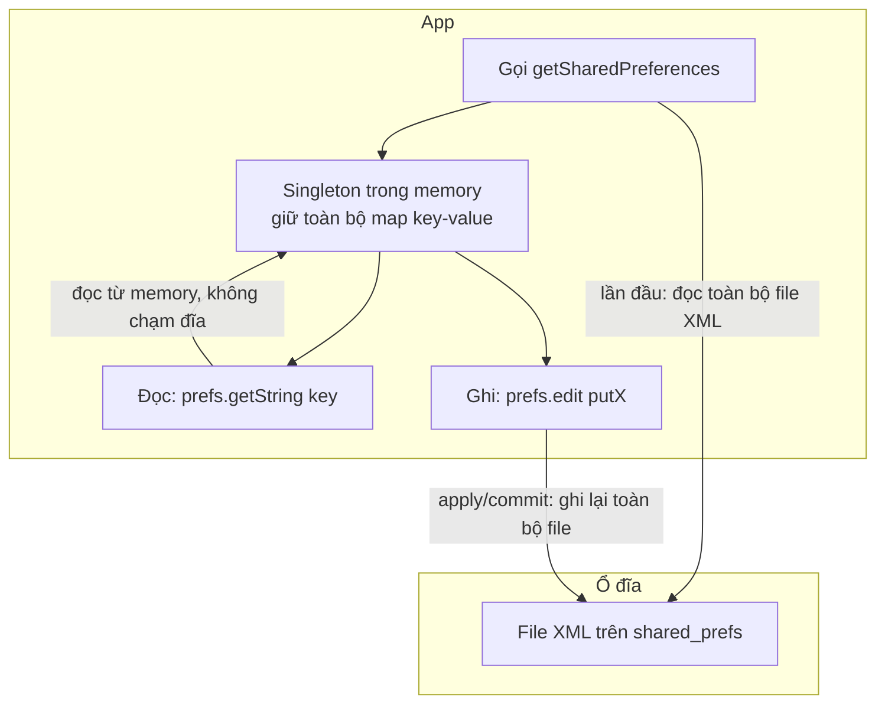
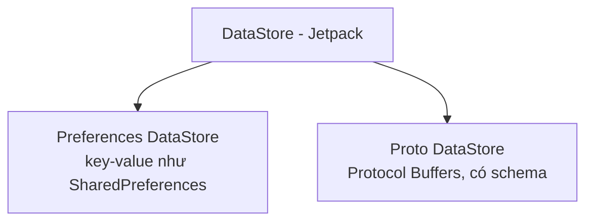
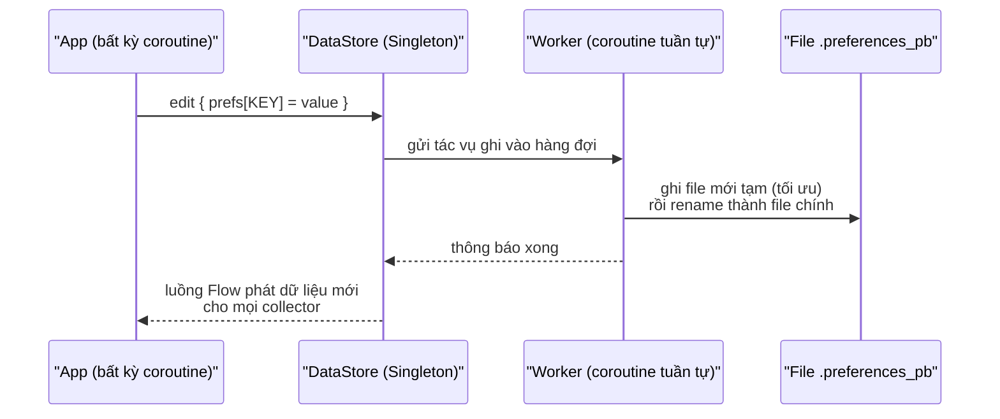
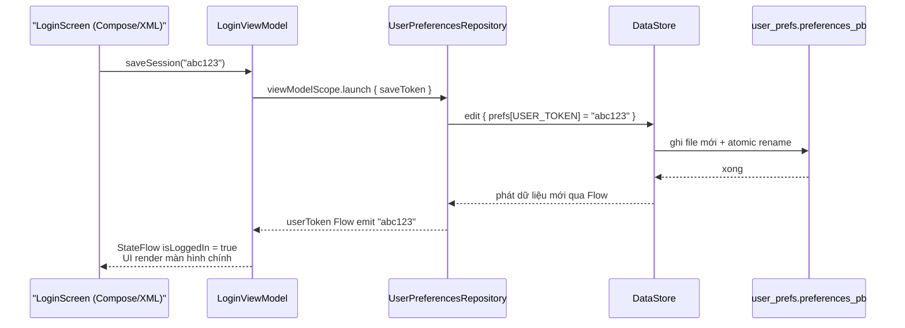
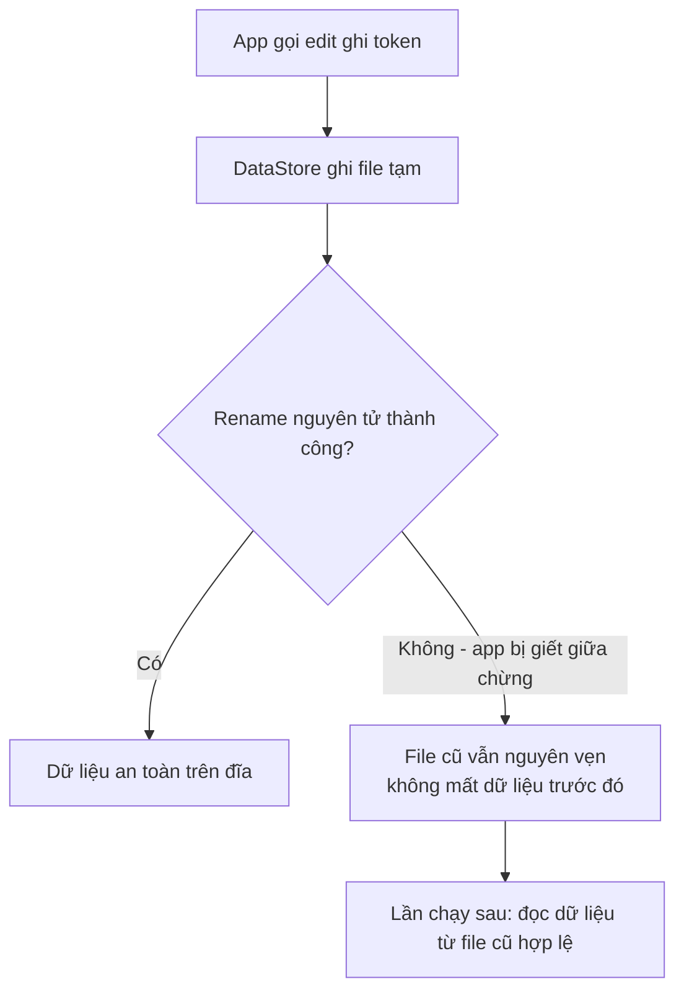
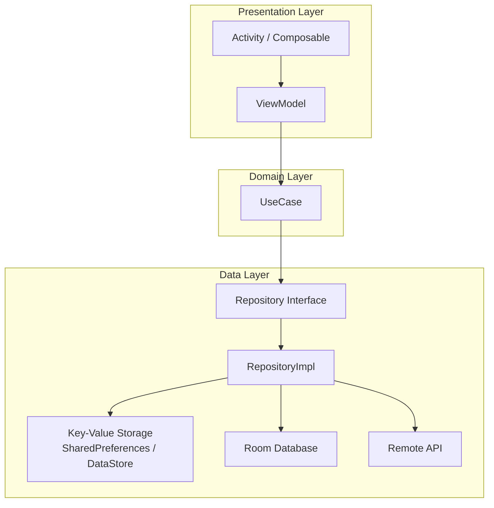

# Key-Value Storage (SharedPreferences & DataStore)

## Vấn đề cần giải quyết

App của bạn có một nhóm dữ liệu rất nhỏ nhưng sống dai: token đăng nhập, username, cờ "đã xem hướng dẫn lần đầu", theme user chọn, số lần mở app, ngôn ngữ hiển thị. Những dữ liệu này:

- **Nhỏ** — vài byte đến vài KB, không phải hàng nghìn dòng.
- **Không cần truy vấn** — không bao giờ cần `WHERE`, `JOIN`, `ORDER BY`.
- **Cần tồn tại sau khi tắt app** — không được mất khi process bị giết.
- **Cần đọc ngay khi app khởi động** — ví dụ biết ngay user đã đăng nhập hay chưa để quyết định hiển thị màn hình nào.

Lưu bằng database (Room) thì quá nặng nề cho việc này. Lưu bằng file thủ công thì phải tự lo serialization, đồng bộ ghi, đọc lại. Lưu bằng biến trong bộ nhớ thì mất khi app bị giết.

> Key-Value Storage giải quyết chính xác bài toán này: lưu **một lượng nhỏ dữ liệu dạng cặp khóa → giá trị (key → value)**, được hệ điều hành/framework lo phần ghi xuống ổ đĩa, tự khôi phục khi mở lại app.

## Key-Value Storage là gì?

Key-Value Storage là mô hình lưu trữ trong đó mỗi dữ liệu được xác định bằng một **key** (khóa, dạng String) duy nhất và lưu một **value** (giá trị) tương ứng:

```text
"user_token"   -> "eyJhbGciOiJIUzI1NiJ9..."
"first_launch" -> true
"theme"        -> "dark"
"launch_count" -> 12
```

Đặc điểm bản chất:

- **Truy cập theo khóa**: muốn đọc dữ liệu phải biết key. Không có khái niệm tìm kiếm, sắp xếp, lọc.
- **Không có cấu trúc quan hệ**: không liên kết giữa các mục với nhau.
- **Giá trị đơn giản**: chỉ phù hợp kiểu dữ liệu nguyên thủy (String, Int, Long, Float, Boolean, Set\<String\>). Không phù hợp object phức tạp (muốn lưu object phải tự serialize sang String/JSON).
- **Toàn bộ được nạp vào bộ nhớ**: mỗi lần đọc, toàn bộ tập key-value được nạp từ đĩa vào RAM một lần, sau đó truy cập trong RAM. Điều này nói lên lý do "không lưu dữ liệu lớn" — xem phần giới hạn.

### Vị trí trong hệ sinh thái lưu trữ Android

| Giải pháp | Loại dữ liệu phù hợp | Có truy vấn? | Async? |
|---|---|---|---|
| Biến trong bộ nhớ (RAM) | Dữ liệu tạm trong phiên chạy | Không | Không |
| SharedPreferences | Key-value nhỏ | Không | Không (blocking) |
| DataStore | Key-value nhỏ | Không | Có (Flow, suspend) |
| Room (SQLite) | Dữ liệu có cấu trúc, quan hệ, số lượng lớn | Có | Có |
| File / CacheDir | Nội dung thô: ảnh, JSON lớn, PDF | Không | Tùy |

Nguyên tắc chọn: **dữ liệu càng có cấu trúc và càng lớn thì càng phải đi xuống phía dưới bảng**. Key-value chỉ thích hợp hàng trên cùng.

## Các giải pháp Key-Value trong Android

Trong hệ sinh thái Android tồn tại ba giải pháp chính cho bài toán key-value:

1. **SharedPreferences** — giải pháp cổ điển, có từ API 1, vẫn hoạt động nhưng có nhiều hạn chế về mặt kỹ thuật.
2. **DataStore** (Preferences DataStore) — giải pháp hiện đại từ Jetpack, được Google khuyến nghị thay thế SharedPreferences, tích hợp sâu với coroutine và Flow.
3. **MMKV (Tencent)** — giải pháp bên thứ ba, hiệu năng rất cao nhờ memory-map, dùng khi cần tốc độ đọc/ghi cực nhanh (game, app nhạy hiệu năng).

Bài này tập trung vào hai cái đầu — là kiến thức chuẩn của lộ trình. MMKV được nhắc để bạn biết nó tồn tại khi gặp trong các dự án thực tế.

## SharedPreferences hoạt động như thế nào?

### Bản chất

SharedPreferences lưu toàn bộ dữ liệu trong **một file XML** nằm trong vùng private của app, tại đường dẫn:

```text
/data/data/<package_name>/shared_prefs/<tên_file>.xml
```

Ví dụ file `user_prefs.xml` thực tế trên đĩa:

```xml
<?xml version='1.0' encoding='utf-8' standalone='yes' ?>
<map>
    <string name="user_token">eyJhbGciOiJIUzI1NiJ9...</string>
    <boolean name="first_launch" value="true" />
    <string name="theme">dark</string>
    <int name="launch_count" value="12" />
</map>
```

### Cơ chế hoạt động



- **Lần đầu truy cập**: file XML được đọc toàn bộ, parse thành một `Map` trong bộ nhớ, giữ nguyên cho tới khi app chết. Mọi thao tác đọc sau đó **không chạm ổ đĩa** — chỉ đọc từ RAM. Đây là lý do đọc SharedPreferences nhanh nhưng **lần đầu tiên có thể chậm** nếu file to.
- **Ghi**: mọi thay đổi chỉ sửa trên bản `Map` trong RAM trước, sau đó mới quyết định ghi xuống đĩa qua `apply()` hoặc `commit()`.

### apply() vs commit()

| Đặc điểm | `apply()` | `commit()` |
|---|---|---|
| Trả về | `void` — ghi không đồng bộ | `Boolean` — kết quả ghi thành công hay không |
| Thread | Ghi xuống đĩa trên background thread (AsyncTask cũ nội bộ) | **Ghi ngay trên thread đang gọi**, chặn đến khi xong |
| Trạng thái bộ nhớ | Cập nhật bộ nhớ **ngay lập tức**, các đọc sau thấy giá trị mới | Cập nhật bộ nhớ ngay |
| Lỗi | Lỗi ghi đĩa không được báo | Trả `false` khi ghi thất bại |
| UI thread | An toàn (ghi đĩa không chặn UI) | **Nguy hiểm** — nếu gọi trên UI thread sẽ block UI khi file lớn |

> **Nguyên tắc thực tế**: luôn dùng `apply()` khi chỉ cần ghi dữ liệu; chỉ dùng `commit()` khi bạn thực sự cần biết kết quả ghi (ví dụ: ghi rồi mới cho phép user thoát, cần chắc chắn dữ liệu đã lên đĩa).

### Ghi mất dữ liệu — vấn đề nghiêm trọng nhất

Với `apply()`, hệ thống ghi file XML trên background. Nếu **process của app bị giết ngay sau khi gọi `apply()`** (user giết app, crash, hệ thống thu hồi process), phần ghi đĩa chưa kịp hoàn thành thì dữ liệu mới **bị mất**, dù bộ nhớ đã có giá trị mới.

Điều này đặc biệt nguy hiểm với dữ liệu quan trọng như token, cờ trạng thái. DataStore ra đời có một trong những mục tiêu quan trọng nhất là loại bỏ rủi ro này — xem phần cơ chế transaction của DataStore.

### Vì sao SharedPreferences "không an toàn" trong thế giới hiện đại

1. **Đọc chặn UI thread**: lần truy cập đầu tiên phải parse toàn bộ file XML trên thread gọi — nếu là UI thread, app giật.
2. **Không có cơ chế theo dõi thay đổi chuẩn**: `OnSharedPreferenceChangeListener` không phân biệt được app process hay app khác (Multi-process) thay đổi, dễ dẫn đến bug phức tạp.
3. **Không an toàn khi nhiều nơi ghi cùng lúc**: hai `Editor` cùng ghi có thể ghi đè nhau.
4. **Không có type safety**: đọc sai kiểu (đọc `String` khi lưu `Int`) trả về default value im lặng — bug khó tìm.
5. **Ghi mất dữ liệu** khi process bị giết giữa chừng.
6. **Không tích hợp coroutine/Flow**: muốn lắng nghe thay đổi phải tự quản lý listener thủ công.

## DataStore là gì?

DataStore là thư viện Jetpack của Google, thay thế SharedPreferences, được xây dựng trên **coroutine và Flow**:

- **Preferences DataStore**: lưu dạng key-value, gần giống SharedPreferences nhưng mạnh hơn.
- **Proto DataStore**: lưu dữ liệu có cấu trúc phức tạp hơn dùng Protocol Buffers (cần học ở bước nâng cao — bài này giới thiệu để bạn biết sự tồn tại).



### Cơ chế hoạt động bên trong

DataStore lưu dữ liệu trong một file nhị phân tên là `*.preferences_pb` (Protocol Buffers), nằm tại:

```text
/data/data/<package_name>/files/datastore/user_prefs.preferences_pb
```

Khác biệt cốt lõi nằm ở cách ghi:



- **Đơn luồng xử lý (single actor)**: mọi tác vụ đọc ghi đều đi qua một coroutine duy nhất xử lý tuần tự. Hai tác vụ ghi đồng thời **không bao giờ** ghi đè nhau — cái sau chờ cái trước hoàn thành. Đây chính là thứ SharedPreferences không làm được.
- **Ghi an toàn (atomic write)**: DataStore ghi nội dung mới vào file tạm, sau đó **rename nguyên tử** (atomic rename) thành file chính. Nếu app bị giết giữa chừng, hoặc file hỏng vì bất kỳ lý do gì, file cũ vẫn nguyên vẹn — **không mất dữ liệu đã ghi trước đó**.
- **Đọc là Flow**: mỗi lần có thay đổi, toàn bộ collector nhận dữ liệu mới tự động. Không cần listener thủ công.
- **Chống hỏng file**: nếu DataStore phát hiện file hỏng khi đọc (corrupted), nó ném `IOException` — bạn bắt lỗi này và quyết định xóa file hỏng (xem phần triển khai).

### Preferences DataStore vs Proto DataStore

| Tiêu chí | Preferences DataStore | Proto DataStore |
|---|---|---|
| Cấu trúc | Key-value tự do, không khai báo schema | Có schema định nghĩa bằng `.proto` file |
| Type safety | Thấp (key tự khai báo, không kiểm tra kiểu toàn cục) | Cao (tự sinh code từ schema, đọc ghi đúng kiểu bắt buộc) |
| Phù hợp | Dữ liệu nhỏ, linh hoạt, ít thay đổi cấu trúc | Dữ liệu có cấu trúc cố định, cần versioning schema |
| Độ phức tạp | Thấp — học nhanh | Cao — phải học Protocol Buffers |
| Thay thế cho | SharedPreferences | Config phức tạp, model nhỏ |

> **Khuyến nghị**: 90% nhu cầu key-value của một app thương mại (token, setting, cờ trạng thái) dùng Preferences DataStore là đủ. Proto DataStore chỉ cân nhắc khi dữ liệu có cấu trúc nghiêm túc cần schema. Bài này đi sâu Preferences DataStore.

## So sánh SharedPreferences vs DataStore

| Tiêu chí | SharedPreferences | DataStore (Preferences) |
|---|---|---|
| Ghi mất dữ liệu | Có thể mất khi process bị giết | Không — atomic write |
| Ghi đồng thời | Không an toàn, dễ ghi đè | An toàn — tuần tự qua actor |
| Async | Blocking (`commit`) hoặc best-effort (`apply`) | Coroutine + Flow |
| Theo dõi thay đổi | Listener thủ công | Flow, UI tự cập nhật |
| Block UI thread | Có thể (lần đọc đầu) | Không |
| Type safety | Không | Một phần (key kiểu rõ ràng) |
| Hỗ trợ Google khuyến nghị | Cũ, không còn khuyến nghị | Hiện đại, được khuyến nghị |
| Hỗ trợ test | Khó (phụ thuộc Android) | Dễ (chạy trong JVM test) |
| File lưu trữ | XML | `.preferences_pb` (nhị phân) |

## Khi nào nên dùng, khi nào không nên dùng

### Nên dùng Key-Value Storage

- Token đăng nhập, refresh token (đã mã hóa — xem phần Security).
- Cài đặt UI: theme sáng/tối, ngôn ngữ, cỡ chữ.
- Cờ trạng thái: đã xem onboarding, đã tặng quà lần đầu.
- Bộ đếm nhỏ: số lần mở app, lần đánh giá gần nhất.
- Cache nhỏ không quan trọng: câu trả lời cuối của một trường nhập.

### Không nên dùng Key-Value Storage

- **Dữ liệu lớn**: file bị nạp toàn bộ vào RAM mỗi lần đọc — lưu 10MB vào DataStore sẽ làm app chậm. > 100KB-1MB nên cân nhắc Room hoặc file.
- **Dữ liệu cần truy vấn**: tìm kiếm, sắp xếp, lọc — đó là việc của Room.
- **Dữ liệu quan hệ**: giỏ hàng, danh sách đơn hàng.
- **Dữ liệu nhạy cảm ở dạng plaintext**: mật khẩu, token không mã hóa — phải dùng EncryptedSharedPreferences hoặc Keystore (xem Security).
- **Dữ liệu chỉ cần trong phiên làm việc**: không cần bền vững thì để RAM (ViewModel, cache layer).

## Triển khai thực tế: MVVM + Hilt + Coroutine/Flow

### 1. Thêm dependency

```kotlin
// app/build.gradle.kts
dependencies {
    implementation("androidx.datastore:datastore-preferences:1.1.1")

    // Đã có trong project dùng MVVM + Hilt:
    implementation("androidx.lifecycle:lifecycle-viewmodel-ktx:2.8.x")
    implementation("com.google.dagger:hilt-android:2.5x")
    kapt("com.google.dagger:hilt-compiler:2.5x")
}
```

> **Lưu ý phiên bản**: kiểm tra phiên bản mới nhất tại [developer.android.com/jetpack/androidx/releases/datastore](https://developer.android.com/jetpack/androidx/releases/datastore). Code trong bài dùng `1.1.1` — là phiên bản ổn định phổ biến tại thời điểm viết.

### 2. Khai báo keys và DataStore

Tạo file `UserPreferences.kt` — nơi duy nhất định nghĩa tên file và toàn bộ keys:

```kotlin
package com.example.app.data.local

import android.content.Context
import androidx.datastore.core.DataStore
import androidx.datastore.preferences.core.Preferences
import androidx.datastore.preferences.core.booleanPreferencesKey
import androidx.datastore.preferences.core.edit
import androidx.datastore.preferences.core.stringPreferencesKey
import androidx.datastore.preferences.preferencesDataStore
import kotlinx.coroutines.flow.Flow
import kotlinx.coroutines.flow.map

// Singleton DataStore cho toàn app — khai báo ở top-level
private val Context.userDataStore: DataStore<Preferences> by preferencesDataStore(
    name = "user_prefs"
)

object PrefsKeys {
    val USER_TOKEN = stringPreferencesKey("user_token")
    val DARK_MODE = booleanPreferencesKey("dark_mode")
    val FIRST_LAUNCH = booleanPreferencesKey("first_launch")
}
```

> **Tip**: tên file `user_prefs` chỉ khai báo **một lần** ở cấp top-level. Khai báo lại `preferencesDataStore` với cùng tên ở nơi khác sẽ gây crash. Đây là lỗi phổ biến đầu tiên — xem phần Sai lầm thường gặp.

### 3. Repository — đọc ghi duy nhất một nơi

```kotlin
package com.example.app.data.repository

import android.content.Context
import androidx.datastore.preferences.core.edit
import com.example.app.data.local.PrefsKeys
import com.example.app.data.local.userDataStore
import kotlinx.coroutines.flow.Flow
import kotlinx.coroutines.flow.map

class UserPreferencesRepository(
    private val context: Context
) {
    // Đọc — Flow: UI sẽ tự cập nhật khi dữ liệu đổi
    val userToken: Flow<String?> = context.userDataStore.data
        .map { prefs -> prefs[PrefsKeys.USER_TOKEN] }

    val isDarkMode: Flow<Boolean> = context.userDataStore.data
        .map { prefs -> prefs[PrefsKeys.DARK_MODE] ?: false }

    // Ghi — suspend, gọi từ coroutine
    suspend fun saveToken(token: String) {
        context.userDataStore.edit { prefs ->
            prefs[PrefsKeys.USER_TOKEN] = token
        }
    }

    suspend fun setDarkMode(enabled: Boolean) {
        context.userDataStore.edit { prefs ->
            prefs[PrefsKeys.DARK_MODE] = enabled
        }
    }

    suspend fun clearSession() {
        context.userDataStore.edit { prefs ->
            prefs.remove(PrefsKeys.USER_TOKEN)
        }
    }
}
```

**Tại sao phải qua Repository mà không gọi DataStore trực tiếp trong ViewModel?**

- ViewModel không nên biết chi tiết "dữ liệu lưu ở đâu" (DataStore, Room, network). Repository là ranh giới này.
- Dễ test: khi test ViewModel, chỉ cần fake Repository, không cần DataStore thật.
- Khi đổi cơ chế lưu (DataStore → nơi khác), chỉ sửa Repository, ViewModel không đổi.

### 4. Hilt module — cung cấp DataStore và Repository

```kotlin
package com.example.app.di

import android.content.Context
import androidx.datastore.core.DataStore
import androidx.datastore.preferences.core.Preferences
import com.example.app.data.local.userDataStore
import com.example.app.data.repository.UserPreferencesRepository
import dagger.Module
import dagger.Provides
import dagger.hilt.InstallIn
import dagger.hilt.android.qualifiers.ApplicationContext
import dagger.hilt.components.SingletonComponent
import javax.inject.Singleton

@Module
@InstallIn(SingletonComponent::class)
object DataModule {

    @Provides
    @Singleton
    fun provideUserDataStore(
        @ApplicationContext context: Context
    ): DataStore<Preferences> = context.userDataStore

    @Provides
    @Singleton
    fun provideUserPreferencesRepository(
        dataStore: DataStore<Preferences>
    ): UserPreferencesRepository = UserPreferencesRepository(dataStore)
}
```

> **Lưu ý**: Repository được sửa để nhận `DataStore<Preferences>` thay vì `Context` — vì Context từ Hilt là `ApplicationContext`, và `preferencesDataStore` cần được truy cập từ một Context đúng nghĩa. Thực tế phổ biến: `provideUserDataStore` trả về `DataStore<Preferences>`, còn Repository chỉ phụ thuộc `DataStore` — giảm phụ thuộc vào Context, dễ test hơn. Sửa lại constructor:

```kotlin
class UserPreferencesRepository(
    private val dataStore: DataStore<Preferences>   // thay cho Context
) {
    val userToken: Flow<String?> = dataStore.data
        .map { prefs -> prefs[PrefsKeys.USER_TOKEN] }
    // ... phần còn lại giống hệt, chỉ đổi context.userDataStore -> dataStore
}
```

### 5. ViewModel — đọc bằng StateFlow, ghi bằng coroutine

```kotlin
package com.example.app.ui.login

import androidx.lifecycle.ViewModel
import androidx.lifecycle.viewModelScope
import com.example.app.data.repository.UserPreferencesRepository
import dagger.hilt.android.lifecycle.HiltViewModel
import kotlinx.coroutines.flow.MutableStateFlow
import kotlinx.coroutines.flow.SharingStarted
import kotlinx.coroutines.flow.StateFlow
import kotlinx.coroutines.flow.asStateFlow
import kotlinx.coroutines.flow.stateIn
import kotlinx.coroutines.launch
import javax.inject.Inject

@HiltViewModel
class LoginViewModel @Inject constructor(
    private val prefsRepository: UserPreferencesRepository
) : ViewModel() {

    // Đọc: Flow từ DataStore -> StateFlow để UI observe
    val userToken: StateFlow<String?> = prefsRepository.userToken
        .stateIn(
            scope = viewModelScope,
            started = SharingStarted.WhileSubscribed(5_000),
            initialValue = null
        )

    private val _isLoggedIn = MutableStateFlow(false)
    val isLoggedIn: StateFlow<Boolean> = _isLoggedIn.asStateFlow()

    fun saveSession(token: String) {
        viewModelScope.launch {
            prefsRepository.saveToken(token)
            _isLoggedIn.value = true
        }
    }

    fun logout() {
        viewModelScope.launch {
            prefsRepository.clearSession()
            _isLoggedIn.value = false
        }
    }
}
```

**Mô phỏng luồng dữ liệu khi đọc — Ghi token → UI cập nhật:**



**Điểm mấu chốt để hiểu**: bạn **không bao giờ tự gọi lại** để lấy dữ liệu sau khi ghi. Ghi xong, DataStore tự đẩy dữ liệu mới qua Flow, Flow qua Repository, `stateIn` cập nhật StateFlow, UI tự render. Đây là sức mạnh của DataStore so với SharedPreferences — với SharedPreferences bạn phải tự đọc lại và tự notify.

### 6. UI — Jetpack Compose

```kotlin
@Composable
fun LoginScreen(viewModel: LoginViewModel = hiltViewModel()) {
    val isLoggedIn by viewModel.isLoggedIn.collectAsStateWithLifecycle()

    if (isLoggedIn) {
        HomeScreen()
    } else {
        LoginForm(
            onLoginClick = { token -> viewModel.saveSession(token) }
        )
    }
}
```

### 7. UI — XML (View hệ thống)

```kotlin
class LoginActivity : AppCompatActivity() {

    private val viewModel: LoginViewModel by viewModels()

    override fun onCreate(savedInstanceState: Bundle?) {
        super.onCreate(savedInstanceState)
        setContentView(R.layout.activity_login)

        // Đọc token ngay khi mở app — quyết định màn hình nào
        lifecycleScope.launch {
            viewModel.userToken.collect { token ->
                if (token != null) {
                    startActivity(Intent(this@LoginActivity, HomeActivity::class.java))
                    finish()
                }
            }
        }
    }

    private fun onLoginClick(token: String) {
        viewModel.saveSession(token)
    }
}
```

> **Chú ý thời điểm đọc**: với kiến trúc chuẩn, việc "mở app thấy màn hình nào" nên được quyết định ngay khi app khởi động (splash/logic trước khi render). Đọc `userToken` trong ViewModel và `collect` trong UI là cách chuẩn — không đọc đồng bộ trong `onCreate` kiểu cũ.

### 8. Chống crash khi file hỏng (IOException)

DataStore ném `IOException` khi file bị hỏng. Trong file dữ liệu key-value, xử lý chuẩn là **xóa file hỏng và đọc lại từ đầu**:

```kotlin
val Context.userDataStore: DataStore<Preferences> by preferencesDataStore(
    name = "user_prefs",
    corruptionHandler = ReplaceFileCorruptionHandler { exception ->
        // File hỏng -> trả Preferences trống, DataStore tự tạo lại
        emptyPreferences()
    }
)
```

Với trường hợp muốn giữ log để điều tra, xem [DataStore corruption handling](https://developer.android.com/topic/libraries/architecture/datastore#handling-corruption).

## Security — token và dữ liệu nhạy cảm

> **Nguyên tắc số một**: không bao giờ lưu **dữ liệu nhạy cảm dạng plaintext** vào SharedPreferences/DataStore thường.

Cấp độ xử lý tùy độ nhạy cảm:

1. **Không nhạy cảm** (theme, ngôn ngữ, cờ): DataStore thường.
2. **Nhạy cảm nhưng không tối mật** (token đăng nhập): mã hóa — dùng `EncryptedSharedPreferences` (thư viện `androidx.security:security-crypto`) hoặc tự mã hóa bằng Android Keystore rồi lưu ciphertext vào DataStore.
3. **Tối mật** (mật khẩu, khóa API, refresh token dài hạn): cân nhắc **không lưu trên thiết bị** hoặc dùng giải pháp bảo mật mạnh hơn (Keystore + mã hóa bất đối xứng, secure element).

Ví dụ cấu hình EncryptedSharedPreferences:

```kotlin
// Cần dependency: androidx.security:security-crypto
val masterKey = MasterKey.Builder(context)
    .setKeyScheme(MasterKey.KeyScheme.AES256_GCM)
    .build()

val encryptedPrefs = EncryptedSharedPreferences.create(
    context,
    "secure_prefs",
    masterKey,
    EncryptedSharedPreferences.PrefKeyEncryptionScheme.AES256_SIV,
    EncryptedSharedPreferences.PrefValueEncryptionScheme.AES256_GCM
)
```

> **Lưu ý về security**: `security-crypto` từng bị Google gắn cờ "not recommended for new projects" vào năm 2024 vì vấn đề bảo trì — hãy đọc [thảo luận chính thức](https://issuetracker.google.com/issues/286337100) trước khi quyết định cho project mới. Hướng thay thế được khuyến nghị: mã hóa bằng Android Keystore trực tiếp, hoặc lưu token trong hệ thống xác thực riêng (ví dụ: credential của các dịch vụ như Firebase Auth).

Ngoài mã hóa, đừng quên: **tên key không nên chứa dữ liệu nhạy cảm** và **không log giá trị token** khi debug.

## Xử lý lỗi ghi khi app bị giết



Đây là lý do DataStore không có vấn đề "ghi mất dữ liệu" như SharedPreferences `apply()` — thiết kế atomic rename đảm bảo hoặc là file mới hoàn chỉnh, hoặc file cũ còn nguyên. Không bao giờ có trạng thái "nửa file".

## Testing

### Unit Test Repository với DataStore thật trên JVM

DataStore chạy được trong JVM test (không cần thiết bị) — đây là lợi thế lớn so với SharedPreferences:

```kotlin
class UserPreferencesRepositoryTest {

    private lateinit var dataStore: DataStore<Preferences>
    private lateinit var repository: UserPreferencesRepository

    @Before
    fun setUp() {
        // DataStore chạy trong test bằng TemporaryFolder — không đụng đĩa thật
        val tempDir = createTempDir()
        dataStore = PreferenceDataStoreFactory.create(
            scope = CoroutineScope(UnconfinedTestDispatcher()),
            produceFile = { tempDir.resolve("test.preferences_pb") }
        )
        repository = UserPreferencesRepository(dataStore)
    }

    @Test
    fun test_saveToken_saveAndReadBack() = runTest {
        repository.saveToken("abc123")

        val token = repository.userToken.first()
        assertEquals("abc123", token)
    }

    @Test
    fun test_clearSession_removesToken() = runTest {
        repository.saveToken("abc123")
        repository.clearSession()

        val token = repository.userToken.first()
        assertNull(token)
    }
}
```

> **Tip test**: `runTest` (từ `kotlinx-coroutines-test`) là cách chuẩn để test suspend function. `UnconfinedTestDispatcher` giúp DataStore chạy trong test scope thay vì scope mặc định.

### Test ViewModel bằng fake Repository

```kotlin
class FakeUserPreferencesRepository : UserPreferencesRepository(/* fake dataStore */) {
    private val _token = MutableStateFlow<String?>(null)
    override val userToken: Flow<String?> = _token

    override suspend fun saveToken(token: String) {
        _token.value = token
    }
    // ...
}

class LoginViewModelTest {
    @Test
    fun test_saveSession_updatesLoginState() = runTest {
        val vm = LoginViewModel(FakeUserPreferencesRepository())
        vm.saveSession("abc123")

        assertEquals(true, vm.isLoggedIn.value)
        assertEquals("abc123", vm.userToken.value)
    }
}
```

## Debug — xem dữ liệu đã lưu

Trên thiết bị/máy ảo, dùng **Device File Explorer** trong Android Studio (View → Tool Windows → Device File Explorer):

```text
data/data/com.example.app/files/datastore/user_prefs.preferences_pb
data/data/com.example.app/shared_prefs/user_prefs.xml   (nếu còn SharedPreferences)
```

File `.preferences_pb` là nhị phân — không đọc được trực tiếp như XML. Cách debug hiệu quả:

- **Log tại nơi đọc**: log giá trị Flow phát ra khi thu thập (đừng log token thật trong production).
- **Bật logging DataStore** trong debug: thêm log trong `edit` block để xem dữ liệu đang ghi gì.
- **Kiểm tra qua app**: viết màn hình debug hiển thị toàn bộ key-value hiện có.

## Sai lầm thường gặp

### 1. Khai báo `preferencesDataStore` nhiều lần với cùng tên file

```kotlin
// SAI — crash: "There are multiple DataStores active for the same file"
private val Context.userDataStore: DataStore<Preferences> by preferencesDataStore(name = "user_prefs")
private val Context.userDataStore2: DataStore<Preferences> by preferencesDataStore(name = "user_prefs")
```

**Đúng**: khai báo một lần duy nhất ở top-level (như phần triển khai), mọi nơi khác inject qua Hilt.

### 2. Gọi `edit` trên UI thread mà không qua coroutine

```kotlin
// SAI — suspend function gọi ngoài coroutine sẽ không compile được
fun save(token: String) {
    dataStore.edit { it[KEY] = token }   // Compile error: suspend function
}

// ĐÚNG — luôn chạy trong viewModelScope / lifecycleScope
fun save(token: String) {
    viewModelScope.launch {
        dataStore.edit { it[KEY] = token }
    }
}
```

### 3. Đọc dữ liệu bằng `.first()` ở nhiều nơi thay vì observe Flow

Nếu bạn cần "đọc một lần", `.first()` là hợp lệ — nhưng nếu bạn dùng nó để đồng bộ UI sau khi ghi, bạn sẽ rơi vào bug "UI không cập nhật". Luôn ưu tiên `collect`/`stateIn`.

### 4. Lưu object lớn vào key-value bằng cách serialize JSON

```kotlin
// SAI — gói nguyên 1 model lớn vào key-value
prefs[USER_PROFILE] = Gson().toJson(largeProfileObject)

// ĐÚNG — dữ liệu có cấu trúc lớn phải dùng Room
```

### 5. Quên xử lý IOException khi đọc

```kotlin
// SAI — không chống crash khi file hỏng
val token = dataStore.data.map { it[KEY] }.first()

// ĐÚNG — bắt IOException (file hỏng) hoặc dùng corruptionHandler
try {
    val token = dataStore.data.map { it[KEY] }.first()
} catch (e: IOException) {
    Log.e(TAG, "DataStore corrupt", e)
}
```

### 6. Lưu mật khẩu/token dạng plaintext

Đã trình bày ở phần Security — lưu plaintext token là lỗ hổng nghiêm trọng, app bị audit bảo mật sẽ bị từ chối.

### 7. Giữ SharedPreferences cũ "chỉ để đỡ phải đổi"

Project mới luôn dùng DataStore. Project cũ: migration dần (xem bên dưới), không xây thêm code mới trên SharedPreferences.

## Migration từ SharedPreferences sang DataStore

Google cung cấp `SharedPreferencesMigration` để chuyển dữ liệu tự động:

```kotlin
val Context.userDataStore by preferencesDataStore(
    name = "user_prefs",
    // Migration: đọc hết dữ liệu từ SharedPreferences cũ vào DataStore
    // rồi xóa file SharedPreferences cũ
    produceMigrations = { context ->
        listOf(
            SharedPreferencesMigration(context, "old_shared_prefs_name")
        )
    }
)
```

**Cách hiểu cơ chế**:

1. Lần đầu DataStore chạy, nó đọc toàn bộ file XML cũ (`old_shared_prefs_name.xml`).
2. Chuyển toàn bộ key-value sang file `.preferences_pb` mới.
3. Xóa file SharedPreferences cũ.
4. Từ đó, code mới đọc ghi hoàn toàn trên DataStore.

> **Tip migration thực tế**: nếu app đã phát hành và user đang có dữ liệu, migration tự động này là cách an toàn nhất — không cần viết code chuyển đổi thủ công. Kiểm tra kỹ trên bản build có dữ liệu cũ trước khi phát hành.

## Vị trí trong hệ thống (System Thinking)

Key-Value Storage không tồn tại độc lập — nó là một phần của **Data Layer** trong kiến trúc MVVM/Clean Architecture:



Vai trò của nó trong tổng thể:

- **Lưu dữ liệu phiên & cấu hình**: token, session, setting — dữ liệu mà mọi UseCase cần biết khi xử lý nghiệp vụ (ví dụ: UseCase gọi API cần kèm token).
- **Cache nhanh**: dữ liệu không quan trọng được đọc nhanh hơn network gấp nhiều lần — giúp app phản hồi ngay cả khi offline.
- **Tách khỏi UI**: ViewModel không bao giờ đụng trực tiếp DataStore — mọi thứ qua Repository. Khi đổi cơ chế lưu trữ, UI và ViewModel không đổi.

Tương tác với các tầng khác: Data Layer cung cấp `Flow` cho ViewModel; ViewModel biến thành `StateFlow` cho UI. Đây là luồng dữ liệu một chiều chuẩn MVVM — điều mà SharedPreferences (callback, thiếu Flow) không hỗ trợ tự nhiên.

## Học tiếp gì?

- **5.1.2 Relational Database (Room)** — khi dữ liệu không còn là key-value mà cần truy vấn.
- **Session 06 — LiveData, ViewModel** — cách quản lý StateFlow/Flow trong vòng đời ViewModel, `stateIn` chi tiết.
- **Session 07 — MVVM, Clean Architecture** — chuẩn hóa Data Layer, Repository pattern sâu hơn.
- **Session 08 — Coroutines, Flow** — hiểu sâu actor, channel, cách Flow hoạt động bên trong.
- **Proto DataStore** — nâng cao khi cần schema nghiêm túc.

## Nguồn tham khảo

- [DataStore — Android Developers](https://developer.android.com/topic/libraries/architecture/datastore)
- [DataStore releases — Android Developers](https://developer.android.com/jetpack/androidx/releases/datastore)
- [Preferences DataStore — Android Developers](https://developer.android.com/topic/libraries/architecture/datastore#preferences-datastore)
- [DataStore corruption handling — Android Developers](https://developer.android.com/topic/libraries/architecture/datastore#handling-corruption)
- [SharedPreferences — Android Developers](https://developer.android.com/reference/android/content/SharedPreferences)
- [Data and file storage overview — Android Developers](https://developer.android.com/training/data-storage)
- [Hilt dependency injection — Android Developers](https://developer.android.com/training/dependency-injection/hilt-android)
- [Testing coroutines — Kotlin](https://kotlinlang.org/api/kotlinx.coroutines/kotlinx-coroutines-test/)
- [security-crypto issue tracker — Google](https://issuetracker.google.com/issues/286337100)
