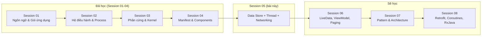
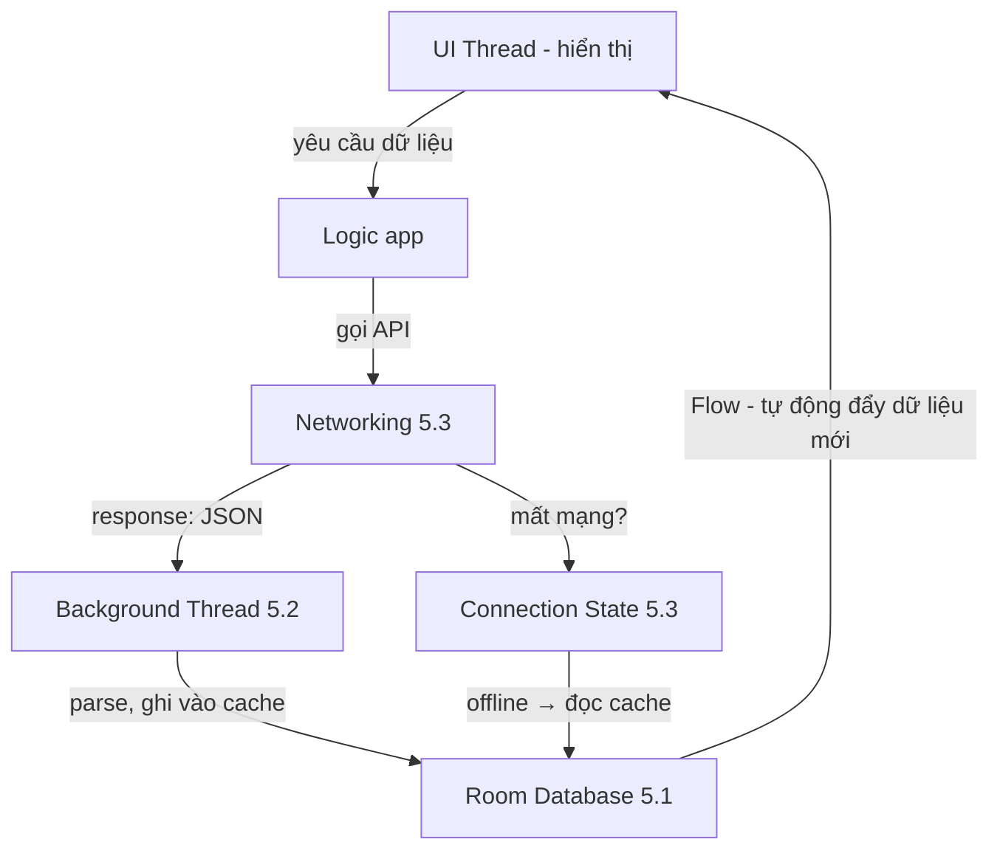
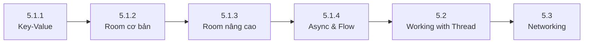

# Session 05 Overview

## Vấn đề cần giải quyết

Sau Session 01-04, bạn đã biết viết một app có UI (Activity, Fragment), khai báo nó trong Manifest và giao tiếp giữa các màn hình bằng Intent. Nhưng app mới chỉ là **vỏ bọc**: màn hình chạy được nhưng chưa có gì để làm.

Một app Android thực tế xoay quanh ba câu hỏi lớn:

1. **Dữ liệu ở đâu?** — Đăng nhập xong, token lưu ở đâu? Danh sách sản phẩm tải về rồi, lần sau mở app có cần tải lại không? Đó là bài toán **Data Store**.
2. **Việc nặng chạy ở đâu?** — Ghi 1.000 dòng vào database, parse JSON lớn, nén ảnh... chạy trên UI thread sẽ đóng băng app. Đó là bài toán **Working with Thread**.
3. **Dữ liệu lấy từ đâu?** — App không thể tự biết giá mới nhất, tin tức mới nhất. Phải gọi lên server qua HTTP. Đó là bài toán **Networking**.

Session 05 trả lời cả ba câu hỏi này. Nó là **trái tim kỹ thuật** của mọi app thương mại thực tế — không có session này, bạn chỉ viết được demo, không viết được product.

```text
Session 05 = Dữ liệu (Data Store) + Xử lý (Thread) + Truyền tải (Networking)
```

Nếu bỏ qua session này, bạn sẽ gặp những lỗi kinh điển của lập trình viên mới: app crash vì chạy việc nặng trên UI thread, mất dữ liệu khi user tắt app, đọc ghi database sai cách làm app chậm dần, và mù mờ về luồng request API.

## Vị trí Session 05 trong lộ trình



Vai trò của Session 05 trong lộ trình:

- **Kế thừa**: dùng Kotlin (Session 01), hiểu app chạy trong process/quyền (Session 02), biết Activity/Fragment là gì (Session 04).
- **Bắc cầu**: đây là session đầu tiên làm việc với **dữ liệu thật** và **tác vụ bất đồng bộ** — hai khái niệm mà mọi session sau (LiveData, ViewModel, Paging, Retrofit, Coroutines, RxJava) đều xây dựng lên trên.
- **Khởi động tư duy async**: lần đầu bạn đối mặt với callback, background thread, và câu hỏi "kết quả trả về khi nào?". Tư duy này được đào sâu ở Session 08 (Coroutines, RxJava).

## Session 05 học những gì?

| Phần | Topic | Câu hỏi trả lời |
|---|---|---|
| 5.1 Data Store | Key-Value Storage | Lưu dữ liệu nhỏ dạng cặp khóa-giá trị bằng gì? |
| 5.1 Data Store | Relational Database (Room) | Lưu dữ liệu có cấu trúc, quan hệ, truy vấn phức tạp bằng gì? |
| 5.1 Data Store | Advanced Room | App đã phát hành mà thay đổi database thì sao? Truy vấn nhanh hơn thế nào? |
| 5.1 Data Store | Async Transactions & Flow | Đọc ghi database trong thread nào cho đúng, và theo dõi dữ liệu tự động như thế nào? |
| 5.2 Working with Thread | Thread | Việc nặng (IO, tính toán) chạy ở đâu để UI không đóng băng? |
| 5.3 Networking | Networking | Gọi API như thế nào, xử lý mất mạng, và theo dõi trạng thái kết nối ra sao? |

### 5.1 Data Store — Dữ liệu ở đâu?

Đây là phần lớn nhất và quan trọng nhất của Session 05, gồm 4 topic đi từ đơn giản đến phức tạp.

#### 5.1.1 Key-Value Storage (SharedPreferences & DataStore)

**Vấn đề cần giải quyết**: lưu một lượng nhỏ dữ liệu đơn giản dạng khóa → giá trị: token đăng nhập, cờ "đã xem hướng dẫn lần đầu", theme đã chọn, số lần mở app. Không cần truy vấn phức tạp.

**Bản chất**: một file XML (SharedPreferences) hoặc file protobuf/Preferences DataStore chứa toàn bộ cặp khóa-giá trị. Đọc toàn bộ vào bộ nhớ khi cần.

**Khi nào dùng**:

- Nên: token, session, cài đặt UI, cache nhỏ, dữ liệu không cần truy vấn.
- Không nên: dữ liệu lớn, dữ liệu cần tìm kiếm/sắp xếp, dữ liệu quan hệ.

**Điểm mấu chốt khi code** (DataStore — bản thay thế hiện đại của SharedPreferences):

```kotlin
// DataStore: an toàn với coroutine, tự theo dõi thay đổi qua Flow
val Context.dataStore by preferencesDataStore(name = "user_prefs")

val USER_TOKEN = stringPreferencesKey("user_token")

// Ghi
suspend fun saveToken(token: String) {
    context.dataStore.edit { prefs ->
        prefs[USER_TOKEN] = token
    }
}

// Đọc — trả về Flow, UI tự cập nhật khi dữ liệu đổi
val tokenFlow: Flow<String?> = context.dataStore.data
    .map { prefs -> prefs[USER_TOKEN] }
```

#### 5.1.2 Relational Database (Room)

**Vấn đề cần giải quyết**: lưu dữ liệu có cấu trúc, số lượng lớn, cần truy vấn theo nhiều điều kiện: danh sách sản phẩm, lịch sử đơn hàng, hồ sơ người dùng. SharedPreferences không làm được.

**Bản chất**: Room là **ORM (Object-Relational Mapping)** bọc trên SQLite — bạn khai báo Entity, DAO, Database, Room tự sinh code SQLite. Kiểm tra lỗi truy vấn ngay lúc **biên dịch** (compile-time) thay vì lúc chạy.

**Khi nào dùng**: dữ liệu có cấu trúc, cần truy vấn (WHERE, JOIN, ORDER BY), dữ liệu offline-first (app chính là database).

**Điểm mấu chốt khi code**:

```kotlin
@Entity(tableName = "products")
data class Product(
    @PrimaryKey val id: Int,
    val name: String,
    val price: Double
)

@Dao
interface ProductDao {
    @Query("SELECT * FROM products WHERE price > :minPrice ORDER BY price DESC")
    suspend fun getExpensiveProducts(minPrice: Double): List<Product>
}

@Database(entities = [Product::class], version = 1)
abstract class AppDatabase : RoomDatabase() {
    abstract fun productDao(): ProductDao
}
```

#### 5.1.3 Advanced Room (Migration & Indexing)

**Vấn đề cần giải quyết**: app đã phát hành, user đã có database cũ (version 1). Bạn thêm cột, thêm bảng cho bản update (version 2). Nếu không xử lý, app của user sẽ **crash** vì schema không khớp. Đồng thời truy vấn chậm dần khi dữ liệu lớn.

**Bản chất**: hai kỹ thuật:

- **Migration**: dạy Room cách chuyển database từ version cũ sang mới, giữ nguyên dữ liệu user.
- **Indexing**: đánh index cho cột hay dùng trong WHERE/JOIN để truy vấn không quét toàn bộ bảng.

**Điểm mấu chốt khi code**:

```kotlin
val MIGRATION_1_2 = object : Migration(1, 2) {
    override fun migrate(db: SupportSQLiteDatabase) {
        db.execSQL("ALTER TABLE products ADD COLUMN stock_count INTEGER NOT NULL DEFAULT 0")
    }
}

// Đăng ký khi build database
Room.databaseBuilder(context, AppDatabase::class.java, "app.db")
    .addMigrations(MIGRATION_1_2)
    .build()

// Index cho cột truy vấn thường xuyên
@Entity(
    tableName = "products",
    indices = [Index(value = ["category_id"])]
)
data class Product(...)
```

#### 5.1.4 Async Transactions & Flow

**Vấn đề cần giải quyết**: database là tài nguyên dùng chung và là điểm chậm. Ghi trên UI thread → app đơ. Ghi cùng lúc từ nhiều nơi → dữ liệu hỏng. Ngoài ra, UI cần **tự cập nhật** khi database thay đổi thay vì phải tự hỏi lại.

**Bản chất**: Room tích hợp sẵn coroutine (suspend, Flow) — đọc ghi luôn chạy trên background thread, và DAO có thể trả về `Flow` để UI nhận dữ liệu mới mỗi khi bảng thay đổi.

**Điểm mấu chốt khi code**:

```kotlin
// Đọc theo dõi tự động — mỗi lần bảng products đổi, Flow emit lại
@Query("SELECT * FROM products")
fun observeAllProducts(): Flow<List<Product>>

// Ghi trong transaction — đảm bảo toàn vẹn khi ghi nhiều bảng
@Transaction
suspend fun checkout(cartItems: List<CartItem>, total: Double) {
    // Các thao tác trong đây chạy trong một transaction
    // Nếu một bước fail, toàn bộ rollback
}
```

### 5.2 Working with Thread — Việc nặng chạy ở đâu?

**Vấn đề cần giải quyết**: UI thread (main thread) chịu trách nhiệm vẽ màn hình. Nếu nó bận xử lý việc khác quá lâu (> 16ms mỗi frame), app đóng băng (jank) và nếu lâu hơn 5 giây thì **ANR (Application Not Responding)** — hệ thống hỏi user "đóng hay chờ?".

**Bản chất**: thread là đơn vị thực thi trong process. App có UI thread (chỉ được cập nhật UI ở đây) và cần các background thread cho việc IO/tính toán nặng.

**Khi nào dùng**:

- Phải dùng background thread: đọc ghi database, gọi API, đọc file, parse JSON, nén ảnh.
- Không dùng background thread: cập nhật View, thao tác nhanh trong bộ nhớ.

**Điểm mấu chốt khi code** (cách truyền thống — Session 08 sẽ thay thế bằng Coroutines):

```kotlin
// Sai: gọi API trên UI thread → ANR
fun loadDataBad() {
    val result = api.fetchData()   // NetworkOnMainThreadException hoặc ANR
    textView.text = result
}

// Đúng: chạy trên background thread, trả kết quả về UI thread
fun loadDataGood() {
    Thread {
        val result = api.fetchData()
        runOnUiThread {
            textView.text = result
        }
    }.start()
}
```

### 5.3 Networking — Dữ liệu lấy từ đâu?

**Vấn đề cần giải quyết**: app cần dữ liệu từ server: danh sách sản phẩm, giá mới, tin tức. Đồng thời mạng không phải lúc nào cũng có — phải xử lý request thất bại, timeout, mất kết nối và biết khi nào mạng khôi phục để gọi lại.

**Bản chất**: Networking trong Session 05 gồm 3 mảng:

1. **Request API** — gửi HTTP request, nhận response (dùng thư viện như Retrofit/OkHttp, được học sâu ở Session 08; ở đây học nguyên lý request-response).
2. **Handle event network** — xử lý thành công/thất bại: retry, timeout, hiển thị lỗi thân thiện.
3. **Handle connection state** — theo dõi trạng thái mạng (Wifi/4G/offline) qua ConnectivityManager, phản hồi UI tương ứng (ví dụ: offline banner).

**Khi nào dùng**: app nào hiển thị dữ liệu không nằm sẵn trong app — gần như mọi app thương mại.

**Điểm mấu chốt khi code** (theo dõi trạng thái mạng):

```kotlin
val connectivityManager = getSystemService(Context.CONNECTIVITY_SERVICE) as ConnectivityManager

// Đăng ký lắng nghe thay đổi kết nối
val networkCallback = object : ConnectivityManager.NetworkCallback() {
    override fun onAvailable(network: Network) {
        // Mạng có — gọi lại API bị fail trước đó
    }

    override fun onLost(network: Network) {
        // Mất mạng — hiển thị offline banner, dừng retry
    }
}

connectivityManager.registerDefaultNetworkCallback(networkCallback)
```

## Mối liên hệ giữa ba phần

Ba phần không tồn tại độc lập — chúng kết hợp thành luồng dữ liệu chuẩn của một app:



Ví dụ thực tế — app thương mại điện tử:

1. User mở app, mạng có → **Networking (5.3)** gọi API lấy danh sách sản phẩm.
2. Response JSON được parse trên **background thread (5.2)** — không block UI.
3. Dữ liệu được lưu vào **Room (5.1)** làm cache offline.
4. UI lắng nghe **Flow từ Room (5.1.4)** — tự cập nhật mỗi khi có dữ liệu mới, kể cả khi đang offline.

## Điều kiện tiên quyết từ Session 01-04

Trước khi bắt đầu Session 05, bạn cần nắm:

- **Kotlin căn bản** (Session 01): class, data class, interface, lambda, extension function. Room và code networking đều viết bằng Kotlin.
- **Manifest & Activity** (Session 04): hiểu được Activity/Fragment là gì — vì bạn sẽ đọc ghi database ngay trong các thành phần này. Đặc biệt nắm lifecycle (onCreate/onDestroy) để biết thời điểm khởi tạo/hủy tài nguyên.
- **Process & app chạy thế nào** (Session 02): hữu ích để hiểu vì sao app bị giết khi ở background — liên quan trực tiếp đến việc dữ liệu có bị mất hay không.

Nếu chưa vững Kotlin, hãy ôn lại `android.languages.kotlin` trước — toàn bộ session này là Kotlin.

## Sau khi học xong Session 05, bạn làm được gì?

- Chọn đúng công cụ lưu trữ: DataStore cho key-value, Room cho dữ liệu có cấu trúc.
- Viết được Entity/DAO/Database, migration an toàn khi nâng version, index cho truy vấn nhanh.
- Đọc ghi database không block UI, theo dõi dữ liệu tự động bằng Flow.
- Hiểu vì sao không được chạy việc nặng trên UI thread và cách chuyển sang background thread.
- Gọi API, xử lý lỗi mạng, và phản ứng với trạng thái kết nối (online/offline).

## Nền tảng cho các session tiếp theo

Session 05 là nền tảng bắt buộc cho những thứ bạn sẽ học sau:

| Session sau | Phụ thuộc vào Session 05 như thế nào |
|---|---|
| Session 06 — LiveData, ViewModel, Paging | Paging tải dữ liệu từ Room từng trang; ViewModel là nơi điều phối đọc ghi. |
| Session 07 — Pattern & Architecture | MVVM/Clean Architecture tổ chức Data Layer — mà Room/DataStore/Network là Data Layer thật sự. |
| Session 08 — Retrofit, Coroutines, RxJava | Retrofit thay lớp Networking thô bằng thư viện chuẩn; Coroutines thay thread thủ công bằng cơ chế hiện đại — khái niệm async đã quen từ 5.2. |

## Thứ tự học đề xuất



Lý do thứ tự này:

1. **5.1.1 → 5.1.2**: đi từ lưu trữ đơn giản đến database thật sự — hiểu vì sao cần Room sau khi chạm trần giới hạn của Key-Value.
2. **5.1.2 → 5.1.3 → 5.1.4**: trong Room, học cách dùng cơ bản trước, rồi mới tới migration/index, cuối cùng là async/Flow — vì 5.1.4 giả định bạn đã biết DAO là gì.
3. **5.1 → 5.2**: hiểu database chậm → mới hiểu vì sao cần thread.
4. **5.2 → 5.3**: networking luôn cần chạy trên background thread — 5.2 cho bạn công cụ đó.

## Lưu ý quan trọng

> **Đừng học thuộc API.** Session 05 có nhiều class, annotation (Entity, Dao, Query, Migration, Index...). Mục tiêu không phải nhớ hết — mục tiêu là hiểu **bản chất**: dữ liệu nên nằm ở đâu, việc nặng chạy ở đâu, dữ liệu đến từ đâu. Cú pháp cụ thể tra cứu khi cần.

> **Đừng bỏ qua phần Thread.** Nhiều người học vội nhảy thẳng vào Room/Networking rồi dính ANR, crash, bug dữ liệu lẫn lộn vì không hiểu thread. 5.2 tuy ngắn nhưng là gốc của mọi vấn đề async sau này.

## Nguồn tham khảo

- [Data and file storage overview — Android Developers](https://developer.android.com/training/data-storage)
- [DataStore — Android Developers](https://developer.android.com/topic/libraries/architecture/datastore)
- [Room persistence library — Android Developers](https://developer.android.com/training/data-storage/room)
- [Room migrations — Android Developers](https://developer.android.com/training/data-storage/room/migrating-db-versions)
- [Processes and threads overview — Android Developers](https://developer.android.com/guide/components/processes-and-threads)
- [ConnectivityManager — Android Developers](https://developer.android.com/reference/android/net/ConnectivityManager)
- [Support for coroutines in Room — Android Developers](https://developer.android.com/training/data-storage/room/async-query)
