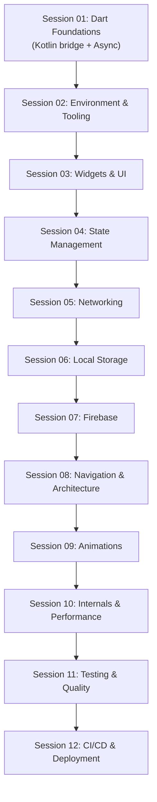

# Flutter Learning Roadmap

Module Flutter của Knowledge OS, tổ chức theo lộ trình học từ nền tảng ngôn ngữ đến triển khai sản phẩm.

## Cấu trúc lộ trình

Lộ trình được tham chiếu từ [roadmap.sh/flutter](https://roadmap.sh/flutter) và điều chỉnh lại theo chuẩn học tập của Knowledge OS:

- **Async trước Networking**: Futures/Streams/Isolates được đưa lên Session 01 thay vì sau Networking - vì gọi API đòi hỏi hiểu bất đồng bộ trước.
- **Bridge Kotlin -> Dart**: Session 01 mở đầu bằng `Dart for Kotlin Developers` dành cho Android Developer chuyển sang.
- **Bổ sung các chủ đề còn thiếu**: Navigation (GoRouter), i18n/l10n, Flavors & Signing, Crashlytics, Codegen (Freezed/json_serializable).
- **GetX/Redux hạ xuống vai trò Alternative**: ưu tiên Riverpod/BLoC như giải pháp chủ lưu.

## Bắt đầu từ đâu?

- Android Developer muốn chuyển sang Flutter: đọc ngay [Dart for Kotlin Developers](session_01/dart/dart_for_kotlin_devs.md).
- Người mới hoàn toàn: đi tuần tự từ Session 01 theo thứ tự trong mục lục.
