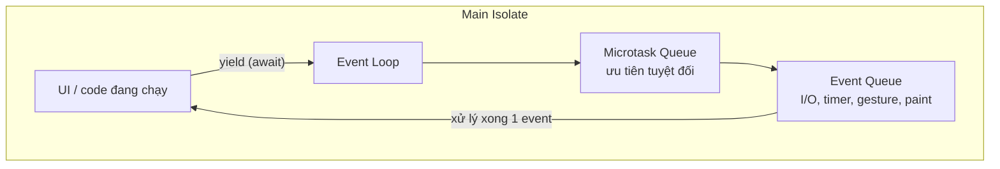
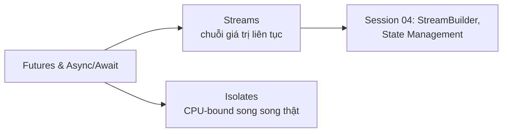

# Futures và Async/Await trong Dart

## Vấn đề cần giải quyết

Ứng dụng phải làm việc bất đồng bộ liên tục: gọi API, đọc file, chờ animation. Câu hỏi bản chất là: *làm sao chờ kết quả mà không đóng băng giao diện?* Nhiều ngôn ngữ trả lời bằng đa luồng. Dart trả lời khác: **một thread duy nhất + hàng đợi sự kiện** - đơn giản hơn về tư duy (không race condition trên state), nhưng đòi hỏi bạn hiểu chính xác cơ chế để không treo UI.

> Nếu đến từ Kotlin: bảng ánh xạ Coroutines -> Dart nằm ở [Dart for Kotlin Developers](../dart/dart_for_kotlin_devs.md). Bài này dạy mô hình Dart thuần.

---

## 1. Event Loop - trái tim của Dart

Mỗi isolate (mặc định là main isolate) có một vòng lặp sự kiện gồm hai hàng đợi:



- **Event queue:** mọi thứ từ bên ngoài - phản hồi network, tap, timer, frame vẽ mới (60fps = mỗi ~16ms một event).
- **Microtask queue:** công việc nội bộ ngắn hạn, ưu tiên **hết sạch trước** khi event kế tiếp được xử lý.

Điều quan trọng nhất: **code đồng bộ dài sẽ chặn cả hai hàng đợi** - frame mới không vẽ được -> jank. `await` là điểm nhường quyền: hàm dừng lại, event loop xử lý việc khác, quay lại khi kết quả sẵn sàng.

---

## 2. Future - lời hứa có kiểu

`Future<T>` đại diện cho một giá trị `T` **chưa có ngay lúc này**, sẽ hoàn thành ở tương lai bằng giá trị hoặc lỗi:

```dart
Future<String> fetchUserName(int id) {
  return Future.delayed(const Duration(seconds: 1), () => 'User#$id');
}
```

Ba trạng thái: *uncompleted* -> *completed with value* hoặc *completed with error*. Một Future chỉ hoàn thành **một lần duy nhất** - muốn chuỗi giá trị liên tục thì đó là Stream.

### Hai phong cách tiêu thụ

```dart
// Phong cách callback (hiếm khi cần)
fetchUserName(7)
    .then((name) => print(name))
    .catchError((e) => print('Lỗi: $e'))
    .whenComplete(() => hideLoading());

// Phong cách async/await - chuẩn hiện đại, đọc như code đồng bộ
Future<void> loadProfile() async {
  try {
    final name = await fetchUserName(7);
    print(name);
  } catch (e) {
    print('Lỗi: $e');
  } finally {
    hideLoading();
  }
}
```

`await` chỉ dùng được bên trong hàm đánh dấu `async`. Hàm `async` luôn trả `Future` (hoặc `void` nếu không trả gì).

---

## 3. Tuần tự vs Song song - bẫy số một

```dart
// ❌ TUẦN TỰ - mất 3 giây: await thứ hai chờ cái đầu xong mới bắt đầu
final user = await fetchUser();
final posts = await fetchPosts(user.id);
final tags = await fetchTags(user.id);

// ✅ SONG SONG - mất 1 giây: cả ba bắt đầu cùng lúc
final results = await Future.wait([
  fetchUser(),
  fetchPosts(user.id),
  fetchTags(user.id),
]);
```

Quy tắc: các tác vụ **độc lập nhau** thì gom vào `Future.wait`; tác vụ sau **phụ thuộc** kết quả trước mới await tuần tự. Lưu ý `Future.wait` ném lỗi ngay khi một Future fail - cần kết quả từng phần riêng lẻ thì giữ list Future rồi await từng cái trong `try/catch`, hoặc dùng `wait` từ package `collection`.

---

## 4. Fire-and-forget và unawaited

Có những tác vụ không cần chờ (log analytics, cache ghi nền):

```dart
import 'dart:async';

void onTap() {
  unawaited(analytics.log('button_tap')); // cam kết không quan tâm kết quả
}
```

Không bọc `unawaited` thì analyzer (`unawaited_futures`) cảnh báo - vì một Future bị bỏ quên nghĩa là **lỗi cũng bị bỏ quên**.

---

## 5. Timeout và Delay

```dart
// Giới hạn thời gian chờ
final data = await api.fetch()
    .timeout(const Duration(seconds: 10));

// Trì hoãn - thay thế delay() của coroutine
await Future.delayed(const Duration(milliseconds: 300));
```

---

## 6. Completer - tự tạo Future thủ công

Khi nguồn phát kết quả không phải hàm async (callback từ SDK cũ, event listener), `Completer` cho bạn tay cầm điều khiển:

```dart
Future<String> waitForTap(html.Element button) {
  final completer = Completer<String>();
  button.onClick.listen((_) => completer.complete('tapped'));
  return completer.future;
}
```

Hoàn thành `completer.complete(value)` hoặc `completeError(e)` - gọi hai lần là lỗi.

---

## Sai lầm thường gặp

1. **Quên `await`:**
   ```dart
   saveToDb(data);          // ❌ Future rơi ra ngoài - lỗi nuốt sạch
   await saveToDb(data);    // ✅
   ```
   Dấu hiệu nhận biết: stack trace không có hàm của bạn, state cập nhật "trễ" một nhịp.
2. **`async` nhưng không có `await` nào** - thường là vô ý; hàm chạy đồng bộ trá hình.
3. **Await trong vòng lặp cho các item độc lập:**
   ```dart
   for (final id in ids) await upload(id);         // tuần tự chậm
   await Future.wait(ids.map(upload));              // song song
   ```
4. **Xử lý song song khi thực ra phụ thuộc** - `Future.wait(fetchA(), fetchB(a))` sai logic vì B cần A.
5. **Chạy CPU-heavy trong async function** tưởng là "nền" - async chỉ nhường event loop, phép tính nặng vẫn block UI. Đó là việc của [Isolates](isolates.md).

---

## Liên kết trong hệ thống



- Chuỗi dữ liệu liên tục: [Streams](streams.md)
- Tách tính toán nặng khỏi UI thread: [Isolates](isolates.md)
