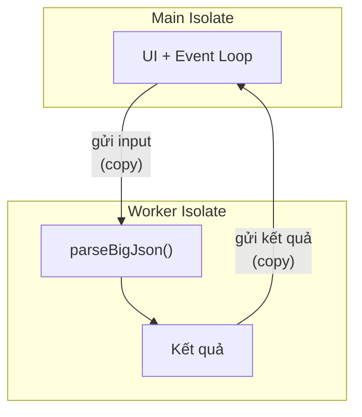
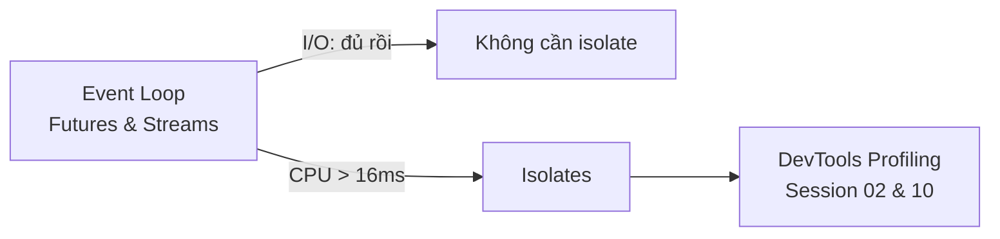

# Isolates trong Dart

## Vấn đề cần giải quyết

`async/await` giải quyết việc **chờ** (I/O), nhưng không giải quyết việc **tính**. Một phép tính CPU-heavy - parse JSON 5MB, resize ảnh, mã hóa file - chạy bao lâu thì UI đơ bấy lâu, vì event loop chỉ có một. Java/Kotlin xử lý bằng thread chia sẻ bộ nhớ (kèm toàn bộ vấn đề race condition). Dart chọn mô hình khác hẳn: **isolate - tiến trình nhẹ có bộ nhớ hoàn toàn riêng biệt, trao đổi qua message passing**.



Không có biến dùng chung -> không có lock, không race condition. Cái giá phải trả: mọi dữ liệu qua lại đều **copy** hoặc phải tuân thủ quy tắc truyền đặc biệt.

---

## 1. Isolate.run - cách đơn giản nhất (Dart 2.19+)

Một dòng tách tính toán sang isolate khác:

```dart
import 'dart:isolate';

Future<Report> analyze(String raw) =>
    Isolate.run(() => parseReport(raw)); // parseReport chạy ở isolate khác
```

- Closure được gửi sang, chạy đến xong, trả kết quả rồi isolate tự đóng.
- Trong Flutter có helper tương đương: `compute(heavyFunction, argument)` từ `package:flutter/foundation.dart`.

Quy tắc chọn việc: **> ~16ms** (một frame) nên cân nhắc isolate; hàng chục ms trở lên thì bắt buộc.

---

## 2. Khi nào KHÔNG cần isolate

| Việc | Có cần isolate? |
|---|---|
| Gọi API, đọc file, query DB | ❌ - I/O vốn non-blocking qua event loop |
| Parse JSON vài KB | ❌ - spawn overhead còn lớn hơn công việc |
| Parse JSON nhiều MB | ✅ |
| Resize/nén ảnh, mã hóa, nén dữ liệu | ✅ |
| Sort danh sách nghìn phần tử | tùy - đo trước khi quyết |

Spawn isolate có chi phí khởi tạo (~vài ms) và chi phí copy dữ liệu hai chiều. Tác vụ nhỏ mà đưa vào isolate còn chậm hơn chạy trực tiếp. **Đo bằng DevTools trước, tối ưu sau.**

---

## 3. Worker dài hạn: SendPort / ReceivePort

`Isolate.run` phù hợp tác vụ one-shot. Worker sống dai - ví dụ decode audio liên tục - cần thiết lập kênh giao tiếp thủ công:

```dart
import 'dart:isolate';

// Worker side
void workerMain(SendPort sendPort) {
  final port = ReceivePort();
  sendPort.send(port.sendPort); // gửi ngược kênh trả lời

  port.listen((String job) {
    final result = heavyProcess(job);
    sendPort.send(result);
  });
}

// Main side
Future<void> start() async {
  final toWorker = ReceivePort();
  await Isolate.spawn(workerMain, toWorker.sendPort);

  // Nhận kênh phản hồi từ worker
  final fromWorker = await toWorker.first as SendPort;
  fromWorker.send('job-1');

  final replyPort = ReceivePort();
  fromWorker.send(replyPort.sendPort); // nếu cần nhận nhiều kết quả
}
```

Điểm mấu chốt: giữa các isolate chỉ đi qua lại được **message** - không tham chiếu object chung được.

---

## 4. Ranh giới Message: gì gửi được, gì không?

| Truyền được | Không truyền được |
|---|---|
| null, bool, int, double, String | Closure / function thường |
| List, Map, Set (chứa phần tử gửi được) | Object chứa native resource (Socket, File) |
| Instance class thường (Dart 2.15+)* | ReceivePort, SendPort của isolate khác |
| TransferableTypedData (buffer lớn, zero-copy) | this, object gắn vòng đời widget |

\* Từ Dart 2.15, instance của class thông thường truyền được qua isolate (được copy sâu), trừ khi chứa field không gửi được. Đây là lý do closure bắt biến cục bộ không bay sang isolate được - hàm gửi sang phải là **static/top-level function hoặc logic tự chứa**:

```dart
// ❌ closure bắt 'this' - lỗi runtime
Isolate.run(() => _parseInternal(raw));

// ✅ hàm static/top-level, tham số tự chứa
static Report parseStatic(String raw) => parseReport(raw);
Isolate.run(() => parseStatic(raw));
```

Với buffer nhị phân khổng lồ (ảnh, audio), tránh copy bằng `TransferableTypedData` - chuyển quyền sở hữu thay vì sao chép.

---

## 5. Isolate và Platform - lưu ý Flutter Web

Mô hình isolate hoạt động đầy đủ trên mobile/desktop. **Trên web**, Dart biên dịch sang JS và isolate trở thành Web Workers - API `Isolate.run` bị hạn chế đáng kể trên nền tảng này. App nhắm cả web nên có chiến lược dự phòng (chunk hóa công việc hoặc chấp nhận xử lý chính).

---

## Sai lầm thường gặp

1. **Đưa I/O vào isolate** - lãng phí; network/file đã non-blocking sẵn.
2. **Gửi task quá nhỏ** - overhead spawn + copy ăn mất lợi ích; gom batch hoặc chạy trực tiếp.
3. **Closure bắt `this` hoặc biến cục bộ** rồi thả vào `Isolate.run` - crash lúc runtime, không phải compile time.
4. **Tưởng kết quả isolate là "shared state"** - mỗi lần gọi là một bản copy độc lập; sửa bên này không thấy bên kia.
5. **Quên đóng ReceivePort** của worker dài hạn - leak isolate và listener.
6. **Dùng isolate cho mọi thứ "cho chắc"** - độ phức tạp tăng, hiệu năng giảm; luôn đo bằng DevTools Performance trước.

---

## Liên kết trong hệ thống



- Nền tảng event loop: [Futures and Async/Await](futures_async_await.md)
- Kết hợp isolate + stream cho pipeline dữ liệu nặng: [Streams](streams.md)
- Đo lường trước/sau tối ưu: Session 10 - Memory Management and Profiling
