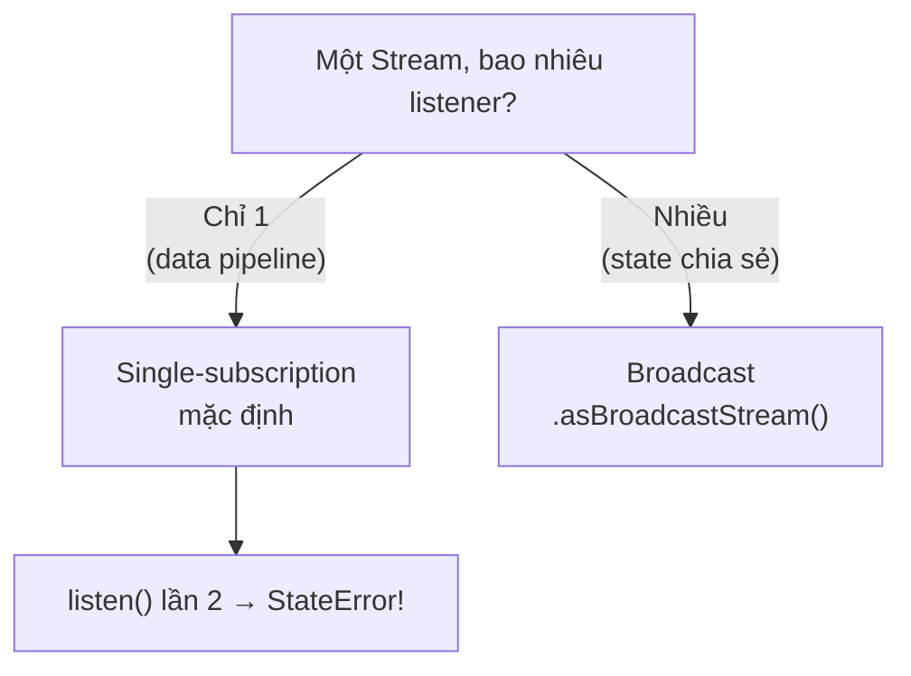
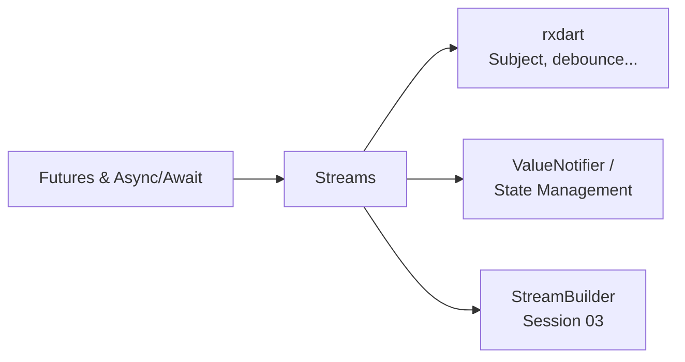

# Streams trong Dart

## Vấn đề cần giải quyết

`Future` trả **một** giá trị. Nhưng rất nhiều thứ trong ứng dụng là **luồng giá trị liên tục**: vị trí GPS cập nhật mỗi giây, tin nhắn socket, input người dùng gõ từng ký tự, trạng thái authentication thay đổi theo phiên. Xử lý dạng này bằng cách gọi API lặp đi lặp lại thì vụng về và trễ. **Stream** là câu trả lời của Dart - cùng họ tư tưởng với `Flow` trong Kotlin coroutines.

> Bảng ánh xạ `Flow/StateFlow -> Stream/ValueNotifier` đã có ở [Dart for Kotlin Developers](../dart/dart_for_kotlin_devs.md).

---

## 1. Bản chất: Iterable của tương lai

| | `Iterable<T>` | `Stream<T>` |
|---|---|---|
| Số phần tử | hữu hạn, đã có sẵn | có thể vô hạn, đến dần |
| Pull hay push | pull (bạn hỏi) | push (dữ liệu tới) |
| Thời điểm | đồng bộ | bất đồng bộ |
| Generator | `sync*` + `yield` | `async*` + `yield` |

```dart
Stream<int> ticker() async* {
  var i = 0;
  while (true) {
    yield i++;                                  // đẩy giá trị ra
    await Future.delayed(const Duration(seconds: 1));
  }
}
```

`async*` + `yield` là cách tạo stream tự nhiên nhất - hàm "tạm dừng" tại yield, tiếp tục khi consumer nhận xong.

---

## 2. Single-subscription vs Broadcast - quyết định đầu tiên



```dart
final source = ticker();

source.listen(print); // ✅
// source.listen(print); // ❌ StateError - single-subscription chỉ nghe 1 lần!

final shared = source.asBroadcastStream();
shared.listen(print); // ✅
shared.listen(print); // ✅ broadcast cho phép nhiều listener
```

Nguyên tắc: stream **pipeline nội bộ** (biến đổi dữ liệu qua nhiều bước) dùng single-subscription; stream **trạng thái chia sẻ cho nhiều widget** dùng broadcast hoặc chuyển hẳn sang `ValueNotifier`/state management (Session 04).

---

## 3. StreamController - nhà sản xuất chủ động

Khi dữ liệu đến từ nhiều nơi (event, callback), `StreamController` là hub trung gian:

```dart
class SearchService {
  final _controller = StreamController<String>.broadcast();

  Stream<String> get results => _controller.stream;

  void submit(String query) => _controller.add(query);   // emit
  void error(Object e) => _controller.addError(e);

  void dispose() => _controller.close();                 // BẮT BUỘC close
}
```

Quên `close()` là leak - controller giữ tài nguyên mãi mãi. Luôn đóng trong `dispose()` của owner.

---

## 4. Biến đổi dữ liệu - pipeline declarative

```dart
searchInput
    .where((q) => q.length >= 3)       // lọc
    .distinct()                         // bỏ giá trị lặp liền kề
    .debounceTime(const Duration(milliseconds: 300)) // rxdart: chờ người dùng ngừng gõ
    .asyncMap((q) => api.search(q))     // map bất đồng bộ - chờ từng request
    .listen(renderResults);
```

Toán tử stdlib: `map`, `where`, `distinct`, `asyncMap`, `asyncExpand`, `take`, `skip`, `timeout`, `handleError`. Các toán tử thời gian mạnh (`debounceTime`, `throttleTime`, `switchMap`, `combineLatest`) thuộc **rxdart** - gần như bắt buộc khi làm stream nghiêm túc.

---

## 5. await for - duyệt stream như list

Trong môi trường async, `await for` đưa stream về dạng vòng lặp quen thuộc:

```dart
Future<void> monitor() async {
  await for (final price in priceUpdates) {
    if (price < 100) break; // thoát vòng = ngừng nghe? KHÔNG!
  }
}
```

Cẩn thận: `break` thoát vòng lặp nhưng **stream vẫn mở** - cần giữ `subscription.cancel()` tường minh khi điều kiện phức tạp.

---

## 6. Subscription - vòng đời phải khép kín

```dart
class PriceWidgetState extends State<PriceWidget> {
  StreamSubscription<double>? _sub;

  @override
  void initState() {
    super.initState();
    _sub = prices.listen(_onPrice);
  }

  @override
  void dispose() {
    _sub?.cancel();     // HỦY - nếu không, callback vẫn bắn vào widget đã chết
    super.dispose();    // -> exception và memory leak
  }
}
```

Mọi nơi bạn `listen()` phải có chỗ `cancel()` đối xứng - đây là quy tắc sống còn, tương đương `[weak self]` trong iOS.

---

## 7. Xử lý lỗi trong stream

Lỗi đi qua stream như một sự kiện đặc biệt - không chặn được bằng try/catch quanh listen:

```dart
controller.stream.listen(
  (data) => render(data),
  onError: (Object e, StackTrace st) => showError(e),
  onDone: () => cleanup(),
);
```

Với pipeline, đặt `handleError` gần nguồn để không làm rơi toàn bộ chuỗi.

---

## Sai lầm thường gặp

1. **Listen stream single-subscription hai lần** - crash. Quyết định broadcast ngay từ thiết kế nếu state dùng chung.
2. **Quên `cancel()` subscription trong `dispose()`** - leak + exception "setState after dispose".
3. **Quên `close()` StreamController** - tài nguyên treo vĩnh viễn.
4. **Dùng stream cho giá trị "hiện tại"** - stream không nhớ giá trị cuối cho listener mới (khác StateFlow). Listener mới chỉ thấy event *sau* nó đăng ký. Giải pháp: `BehaviorSubject` (rxdart) hoặc ValueNotifier.
5. **Ghép nhiều stream bằng tay qua biến tạm** - rxdart có `combineLatest`, `merge`, `zip` làm sẵn và đúng edge case.
6. **Nhầm `map` sync với `asyncMap`:** `map` với hàm async trả về Stream<Future<T>> - phải dùng `asyncMap`.

---

## Liên kết trong hệ thống



- Nền tảng async: [Futures and Async/Await](futures_async_await.md)
- Khi dữ liệu cần CPU-heavy xử lý trước khi vào stream: [Isolates](isolates.md)
