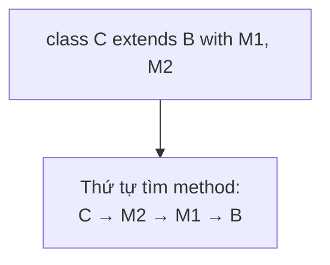

# Classes, Mixins và Sealed Types trong Dart

## Vấn đề cần giải quyết

Flutter framework được xây dựng gần như 100% bằng class Dart: mọi Widget bạn viết là một class, mọi state model nên là sealed type, mọi hành vi tái sử dụng chạy qua mixin hoặc extension. Khác biệt cốt lõi so với Kotlin: **Dart không có `interface` keyword** (mọi class đều là interface ngầm), **class mở mặc định** (Kotlin khóa mặc định), và có hệ thống **mixin linearization** mà Kotlin không có tương đương trực tiếp.

---

## 1. Class cơ bản

```dart
class BankAccount {
  // Field final nếu không cần đổi - mặc định ưu tiên immutable
  final String owner;
  double _balance = 0;

  // Constructor shorthand: this.owner gán thẳng field
  BankAccount({required this.owner, double initial = 0})
    : assert(initial >= 0),        // initializer list: validate trước thân
      _balance = initial;

  // Named constructor
  BankAccount.empty(this.owner);

  // Factory: kiểm soát việc tạo instance (cache, subclass, validation)
  factory BankAccount.fromJson(Map<String, dynamic> json) =>
      BankAccount(owner: json['owner'], initial: json['balance']);

  // Getter / setter
  double get balance => _balance;
  set balance(double value) {
    if (value < 0) throw ArgumentError('Số dư không thể âm');
    _balance = value;
  }

  void deposit(double amount) => _balance += amount;

  @override
  String toString() => 'BankAccount($owner, $_balance)';
}
```

> Chi tiết từng dạng constructor đã phân tích trong [Dart for Kotlin Developers](dart_for_kotlin_devs.md). Bài này tập trung vào quan hệ giữa các class.

---

## 2. Kế thừa: extends, implements, with

Ba từ khóa ba ý nghĩa hoàn toàn khác nhau:

| Từ khóa | Nhận code thừa kế? | Số lượng | Dùng khi |
|---|---|---|---|
| `extends` | ✅ toàn bộ implementation | 1 | "IS-A" thật sự |
| `implements` | ❌ chỉ nhận contract, tự viết hết | ∞ | tuân thủ contract |
| `with` | ✅ nhận body của mixin | ∞ (theo thứ tự) | tái sử dụng hành vi |

```dart
class BaseNotifier {
  void log(String msg) => print('[base] $msg');
}

abstract class Serializable {
  Map<String, dynamic> toJson();
}

mixin Timestamped {
  DateTime createdAt = DateTime.now();
}

// Kết hợp cả ba
class UserNotifier extends BaseNotifier
    with Timestamped
    implements Serializable {
  @override
  Map<String, dynamic> toJson() => {'createdAt': createdAt.toIso8601String()};
}
```

### Implicit Interface - điểm dễ sốc nhất

Trong Dart, **mọi class đều tự động là một interface** kể cả class thường:

```dart
class Greeter {
  String hello(String name) => 'Hi $name';
}

// Hoàn toàn hợp lệ - "implements" một class thường!
class TestGreeter implements Greeter {
  @override
  String hello(String name) => 'Mock: $name'; // PHẢI tự viết lại toàn bộ
}
```

Quên viết lại một member -> lỗi compile ngay. Đây là lý do mock trong test Dart không cần thư viện proxy phức tạp.

---

## 3. Mixin và Linearization Order

Mixin giải quyết đúng vấn đề *tái sử dụng hành vi giữa các class không liên quan huyết thống*.

```dart
mixin Logger {
  void log(String msg) => print('[LOG] $msg');
}

mixin Retryable {
  int attempts = 0;
  bool shouldRetry() => attempts < 3;
}

class ApiClient with Logger, Retryable { ... }
```

### Thứ tự ưu tiên khi trùng method

Khi nhiều nguồn cùng định nghĩa method, Dart chọn theo **linearization**: mixin đứng sau đè mixin đứng trước, mixin đè superclass:



```dart
mixin A { void who() => print('A'); }
mixin B { void who() => print('B'); }

class Base { void who() => print('Base'); }
class C extends Base with A, B {}

C().who(); // "B" - mixin sau cùng thắng
```

### Ràng buộc `on`

Ép mixin chỉ dùng cho loại class nhất định - và nhờ đó gọi được method của class đó:

```dart
mixin AutoDispose<T> on ChangeNotifier {
  // được phép gọi method của ChangeNotifier ở đây
  void autoDispose(void Function() fn) =>
      addListener(() { if (!hasListeners) fn(); });
}
```

---

## 4. Class Modifiers (Dart 3)

Dart 3 bổ sung bộ điều khiển thiết kế API - đảo ngược tình trạng "không ai khóa được class" trước đây:

| Modifier | Ý nghĩa | Tương đương Kotlin |
|---|---|---|
| *(không)* | ai cũng extend/implement được | `open class` |
| `final class` | cấm extend + implement ngoài library | `class` (mặc định Kotlin) |
| `base class` | chỉ được extend (không implement) | - |
| `interface class` | chỉ được implement, không extend | `interface` |
| `sealed class` | hierarchy đóng, exhaustive switch, subclass **cùng file/library** | `sealed class` |
| `abstract` | không khởi tạo trực tiếp; có thể chứa abstract methods | `abstract class` |
| `mixin` | chỉ dành để `with`, không được construct | - |

> Điểm nghịch khác Kotlin: Dart **mở mặc định**, muốn khóa phải chủ động `final`. Khi viết package public, hãy chốt modifier cho mọi class.

---

## 5. Sealed Types - mô hình hóa State chuẩn Flutter

Đây là pattern quan trọng nhất của toàn module:

```dart
sealed class AuthState {
  const AuthState();
}

class AuthIdle extends AuthState { const AuthIdle(); }
class AuthLoading extends AuthState { const AuthLoading(); }
class AuthSuccess extends AuthState {
  const AuthSuccess(this.token);
  final String token;
}
class AuthFailure extends AuthState {
  const AuthFailure(this.message);
  final String message;
}

// Compiler ép xử lý ĐỦ mọi nhánh - thiếu là lỗi compile
Widget build(AuthState state) => switch (state) {
  AuthIdle() => const LoginButton(),
  AuthLoading() => const CircularProgressIndicator(),
  AuthSuccess(:final token) => Dashboard(token),
  AuthFailure(:final message) => ErrorView(message),
};
```

Vì sao mạnh hơn enum: mỗi subtype mang **dữ liệu riêng** (`token`, `message`) - thứ enum không làm được. Vì sao mạnh hơn if-else chain: **exhaustiveness checking** - thêm state mới mà quên xử lý, app không build nổi thay vì sập runtime.

---

## 6. Enhanced Enums

Enum Dart hiện đại hỗ trợ field, constructor, method - đủ dùng cho dữ liệu cố định:

```dart
enum PaymentMethod {
  card('CARD', fee: 0.02),
  bankTransfer('BANK', fee: 0),
  cod('COD', fee: 0.01);

  const PaymentMethod(this.code, {required this.fee});
  final String code;
  final double fee;

  bool get hasFee => fee > 0;
}

PaymentMethod.card.hasFee; // true
```

Quy tắc lựa chọn: **enum khi tập giá trị đóng và đồng nhất cấu trúc; sealed class khi mỗi biến thể mang dữ liệu/hành vi riêng.**

---

## 7. Extension - mở rộng kiểu có sẵn

Thêm method/getter cho class bạn không sở hữu (String, int...), resolve lúc compile theo static type:

```dart
extension PriceX on double {
  String get asVnd => '${toStringAsFixed(0)}đ';
}

99.0.asVnd; // "99đ"
```

Lưu ý: extension không polymorphic - gọi qua reference kiểu `dynamic` sẽ không tìm thấy. Không lạm dụng để "vá" thiết kế sai; ưu tiên method thật trong class khi bạn sở hữu nó.

---

## Sai lầm thường gặp

1. **Nhầm `implements` với `extends`:** implements không nhận code thừa kế - phải tự viết lại mọi member, kể cả có body sẵn.
2. **Đặt subclass ngoài file của sealed class** - lỗi compile; sealed yêu cầu cùng library.
3. **Tin thứ tự mixin ngẫu nhiên:** `with M1, M2` thì M2 đè M1 - đặt mixin quan trọng nhất sau cùng.
4. **Quên `@override`:** không bắt buộc về mặt syntax nhưng analyzer sẽ cảnh báo; thiếu nó, typo tên method tạo method mới im lặng.
5. **Dùng inheritance để tái sử dụng tiện ích nhỏ** - nên là mixin/composition; extends chỉ cho IS-A thật sự.
6. **Factory constructor gọi `this`** - factory không được phép truy cập `this`; nó phải trả instance bằng constructor khác.

---

## Liên kết trong hệ thống

- Pattern matching với sealed: [Control Flow and Patterns](control_flow_patterns.md)
- Áp dụng state management: Session 04 - ChangeNotifier/ValueNotifier
- So sánh nhanh với Kotlin: [Dart for Kotlin Developers](dart_for_kotlin_devs.md)
