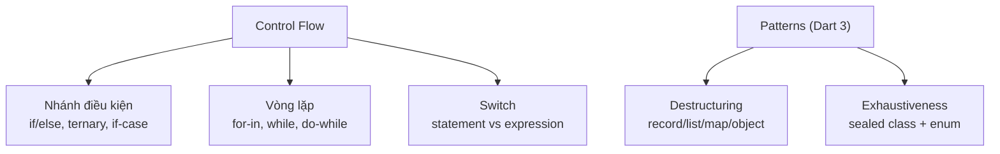

# Control Flow và Pattern Matching trong Dart

## Vấn đề cần giải quyết

Logic ứng dụng là chuỗi các nhánh rẽ: trạng thái loading/success/error, phân loại dữ liệu từ server, xử lý từng phần tử hợp lệ. Trước Dart 3, xử lý các nhánh phức tạp (kiểm tra kiểu + trích field + so giá trị cùng lúc) phải viết chuỗi `if` lồng nhau dài dòng. **Patterns** ra đời để giải quyết đúng vấn đề đó: *một cú pháp duy nhất để vừa kiểm tra hình dạng dữ liệu, vừa trích xuất thành phần bên trong*.



---

## 1. Nhánh điều kiện

### if / else / else-if

Cú pháp quen thuộc; điều kiện phải là `bool` thật (không có truthy):

```dart
final score = 85;
if (score >= 90) {
  print('Xuất sắc');
} else if (score >= 80) {
  print('Giỏi');
} else {
  print('Cần cố gắng');
}
```

### Conditional expression (ternary)

Phù hợp khi chỉ cần chọn giá trị:

```dart
final label = score >= 50 ? 'Đạt' : 'Trượt';
```

### if-case (Dart 3)

Kiểm tra pattern ngay trong `if` - thay thế `is` + cast thủ công:

```dart
if (json case {'user': String name}) {
  print('Xin chào $name');
}

// Kết hợp guard clause `when`
if (response case int code when code >= 400) {
  throw HttpException('Lỗi $code');
}
```

---

## 2. Vòng lặp

```dart
// for-in: chuẩn Dart cho mọi Iterable
for (final user in users) {
  print(user.name);
}

// Duyệt Map kèm cả key-value
for (final entry in scores.entries) {
  print('${entry.key}: ${entry.value}');
}

// Classic for: khi cần index hoặc bước nhảy
for (var i = 0; i < items.length; i += 2) { ... }

// while / do-while
while (!done) { ... }
do { retry(); } while (!success);

// break / continue hoạt động như mọi ngôn ngữ
outer:
for (final row in grid) {
  for (final cell in row) {
    if (cell.isWall) continue;
    if (cell.isExit) break outer; // label thoát nhiều tầng
  }
}
```

---

## 3. Switch Statement vs Switch Expression

Dart tồn tại **hai dạng switch** với ngữ nghĩa khác nhau:

| | Switch statement (cổ điển) | Switch expression (Dart 3) |
|---|---|---|
| Vai trò | Thực thi hành động | Tính toán trả về giá trị |
| Cú pháp case | `case value:` + thân lệnh | `pattern => value` |
| Bắt buộc đủ case | ❌ (trừ enum/sealed sẽ lint cảnh báo) | ✅ nếu subject là sealed/enum |
| Mặc định | `default:` | `_ => ...` |

```dart
// Statement - làm hành động
switch (command) {
  case 'open':
    openFile();
    break;              // statement case phải kết thúc bằng break/return/throw
  case 'close':
    closeFile();
    break;
  default:
    log('unknown');
}

// Expression - chọn giá trị (giống when của Kotlin)
final action = switch (command) {
  'open' => () => openFile(),
  'close' => () => closeFile(),
  _ => () => log('unknown'),
};
action();
```

> Dart switch **không tự fall-through** giữa các case có nội dung - khác C/Java. Chỉ các label rỗng liên tiếp mới chia sẻ một thân.

---

## 4. Patterns - sức mạnh thật của Dart 3

Pattern = mô tả "hình dạng" dữ liệu. Dùng được ở: `case`, `if-case`, destructuring declaration.

### Constant & relational & logical-or

```dart
final size = switch (bytes.length) {
  < 1024          => '${bytes.length} B',      // relational pattern
  < 1048576       => '${bytes.length ~/ 1024} KB',
  0 || _ when false => '',                     // (ví dụ minh họa or)
  _               => '${bytes.length ~/ 1048576} MB',
};
```

### Object pattern - kiểm tra kiểu + trích field cùng lúc

```dart
sealed class Result {}
class Success extends Result {
  Success(this.data);
  final String data;
}
class Failure extends Result {
  Failure(this.code);
  final int code;
}

String render(Result result) => switch (result) {
  Success(:final data) => 'Nội dung: $data',
  Failure(code: 401)   => 'Hết phiên đăng nhập', // match giá trị cụ thể
  Failure(:final code) => 'Lỗi $code',
};
```

Compiler biết `Result` là `sealed` nên **bắt lỗi ngay lúc compile nếu thiếu case** - không còn nhánh sập tiềm ẩn.

### Record / List / Map patterns - destructuring

```dart
// Record destructuring
final (name, age) = ('Hazu', 25);
final (:id, :price) = productRecord;

// List pattern - khớp độ dài và cấu trúc
switch (points) {
  case [var first]:        // đúng 1 phần tử
    print(first);
  case [var a, var b]:     // đúng 2 phần tử
    print('$a, $b');
  case [...rest, var last]: // đuôi gom vào rest
    print(last);
}

// Map pattern
if (payload case {'type': 'ping', :final id}) {
  reply(id);
}

// Duyệt với pattern ngay trong for-in
for (final (:key, :value) in headers.entries) { ... }
```

---

## 5. assert - kiểm tra giả định lúc dev

```dart
void setAge(int age) {
  assert(age >= 0, 'Tuổi không thể âm'); // chỉ chạy ở debug, bỏ qua ở release
}
```

Dùng để bảo vệ contract nội bộ; validation đầu vào của người dùng thì dùng exception thật.

---

## Sai lầm thường gặp

1. **Switch expression thiếu case trên type không phải sealed** - compiler không thể kiểm tra, runtime ném error khi rơi vào nhánh trống. Hãy thiết kế state bằng sealed class.
2. **Quên `_ =>` trong switch expression** - lỗi compile "non-exhaustive", đây là tính năng chứ không phải phiền.
3. **Lạm dụng ternary lồng nhau** - ba tầng ternary trở lên nên chuyển sang switch expression.
4. **Nhầm `if-case` với phép gán** - `if (x case int n)` là *match*, không đổi giá trị `x`.
5. **Dùng classic `for (var i...)` khi chỉ cần duyệt** - `for-in` an toàn hơn (không sai index).

---

## Liên kết trong hệ thống

- Nền tảng: [Variables and Types](variables_and_types.md), [Functions and Operators](functions_operators.md)
- Sealed class định nghĩa ở đâu: [Classes, Mixins and Sealed Types](classes_mixins_sealed.md)
- Áp dụng thực tế: mọi `ViewState` trong Flutter đều là sealed class + switch expression - xem tiếp ở Session State Management.
