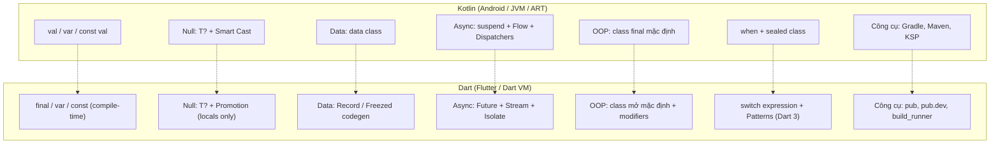
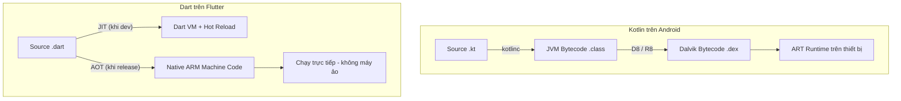
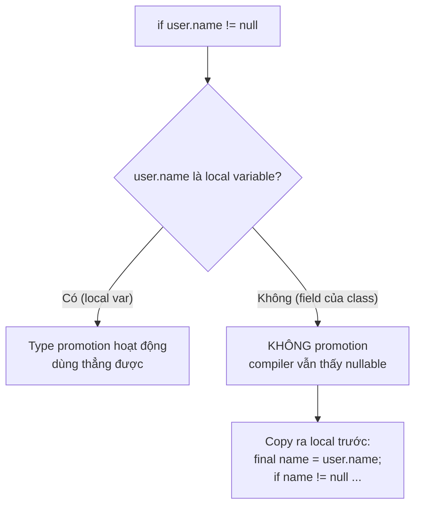
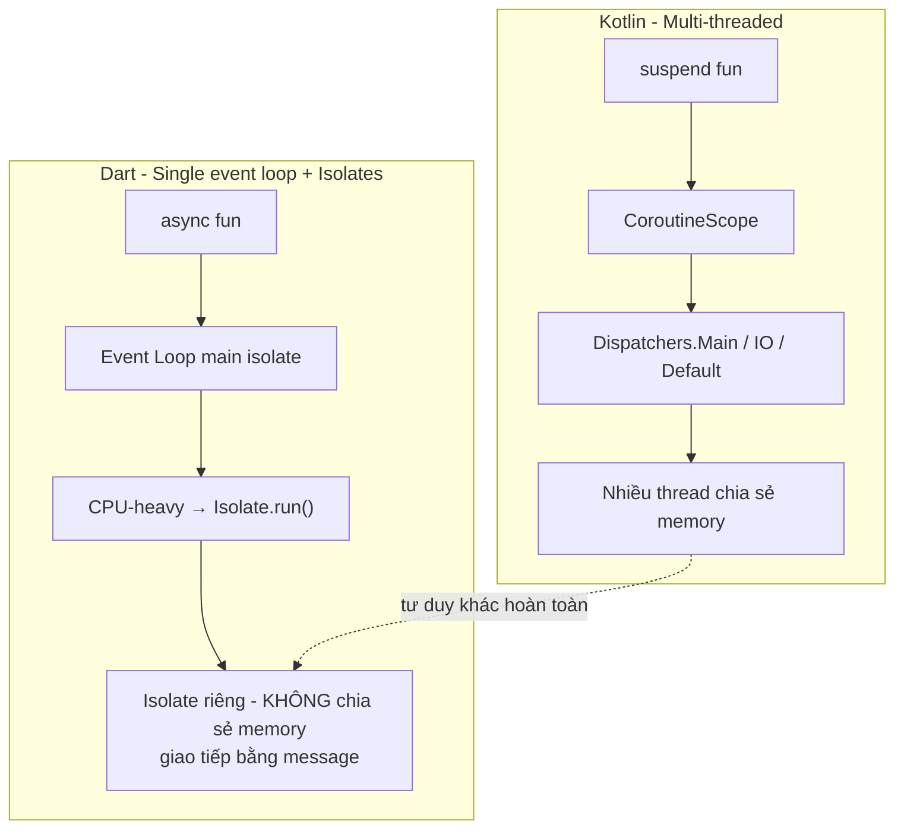
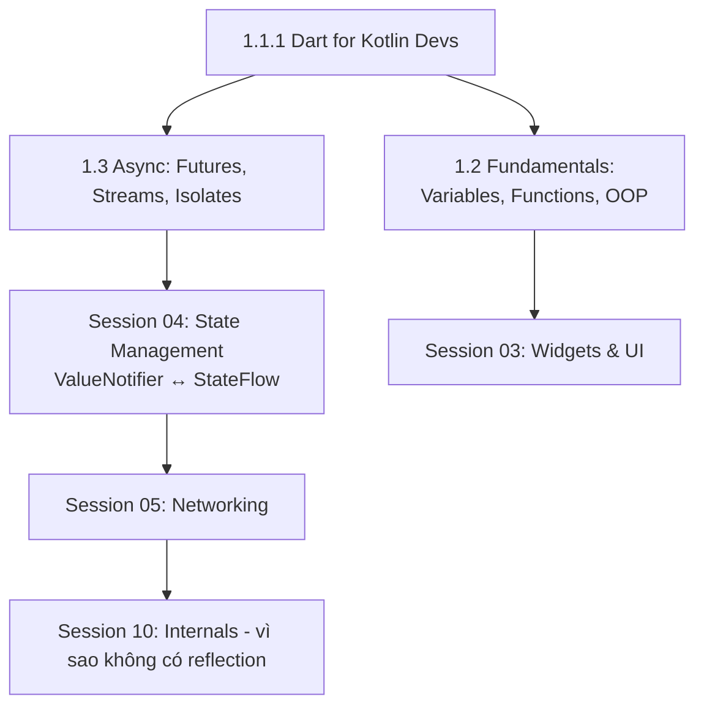

# Dart for Kotlin Developers: Cú pháp & Thực chiến Flutter

## Vấn đề cần giải quyết

Bạn đã thành thạo Kotlin: `val`/`var`, Null Safety `T?`, `data class`, `when`, `suspend fun`. Khi mở Flutter và viết file `.dart` đầu tiên, Dart cho cảm giác "quen thuộc hơn cả Swift" nhưng nếu bạn **dịch 1-1 theo thói quen Kotlin, app sẽ chạy sai hoặc jank ngay**:

1. **Bẫy `final` nông:** `val list = listOf(1)` trong Kotlin là danh sách read-only. `final list = [1]` trong Dart **vẫn `.add()` được** - `final` chỉ khóa reference, không khóa nội dung.
2. **Bẫy Named Parameters ngược chiều:** Kotlin khai báo positional, gọi kèm tên tùy ý. Dart khai báo trong `{}` thì **gọi bắt buộc kèm tên**, và tham số không có `required` có thể **bỏ qua hoàn toàn** khi gọi mà không lỗi.
3. **Bẫy Concurrency:** Kotlin có Dispatchers chia thread. Dart là **single-threaded event loop + Isolates** - chạy code CPU-heavy trên main isolate là app đơ.
4. **Bẫy data class:** Dart không có `data class`. Hai object cùng giá trị nhưng `==` trả về **false** nếu bạn quên override hoặc dùng codegen.
5. **Bẫy Reflection:** Không có `dart:mirrors` trong Flutter - mọi thứ từng dựa vào reflection (JSON parsing, DI như Hilt/Koin) đều phải chuyển sang **codegen** hoặc thủ công.
6. **Bẫy Type Promotion:** `if (user.name != null)` **không promote** field của class như smart cast Kotlin - compiler vẫn coi `user.name` nullable.
7. **Bẫy Stream:** `Stream` mặc định single-subscription - `listen()` lần thứ hai là crash `StateError`.

Bài học này trả lời theo đúng tư duy thực chiến: **Nó là gì -> Vì sao tồn tại -> Khi nào dùng -> Code chuẩn như thế nào**, đối chiếu song song Kotlin <-> Dart.

---

## Mental Model: Bản đồ chuyển đổi tư duy



---

## 1. Bản chất Runtime: ART/JVM vs Dart VM

Khác biệt lớn nhất nằm ở **nền tảng thực thi**, quyết định mọi thứ phía sau: vì sao có Hot Reload, vì sao không có reflection, vì sao phải codegen.



- **Khi dev:** Dart chạy JIT trên Dart VM - đây là lý do Flutter có **Hot Reload** (thay code là UI cập nhật dưới một giây) mà không cần rebuild như Kotlin.
- **Khi release:** Dart compile AOT ra machine code native - hiệu năng gần C++, không phụ thuộc ART/JVM.
- **Hệ quả quan trọng nhất:** AOT loại bỏ reflection (`dart:mirrors` không khả dụng trong Flutter). Mọi việc Kotlin làm bằng reflection - parse JSON, DI runtime như Hilt/Koin - ở Flutter đều chuyển sang **code generation** bằng `build_runner`.

> **Tư duy:** Kotlin sinh ra cho JVM đa năng; Dart sinh ra cho UI. Toàn bộ thiết kế (event loop, const canonicalization, hot reload) đều tối ưu cho trải nghiệm dựng giao diện mượt.

---

## 2. Biến, Hằng, Kiểu & String Interpolation

=== "Kotlin"

```kotlin
val appName = "Knowledge OS"      // read-only reference
const val VERSION = "1.0.0"       // compile-time constant (chỉ top-level/object)
var counter = 0
counter += 1

val anyValue: Any = "text"
val raw = """
    Dòng 1
""".trimIndent()
```

=== "Dart"

```dart
final appName = 'Knowledge OS';   // single assignment (như val)
const version = '1.0.0';          // compile-time constant - mạnh hơn const val
var counter = 0;
counter += 1;

final dynamicValue = 'text';
Object safeAny = 'text';          // ≈ Any - vẫn có static check
dynamic unsafe = 'text';          // TẮT kiểm tra kiểu - hạn chế tối đa!

final raw = '''
    Dòng 1
''';                              // không cần trimIndent
```

### Điểm cần nắm

| | Kotlin | Dart | Lưu ý |
|---|---|---|---|
| Single assignment | `val` | `final` | Khóa reference, **không khóa nội dung** |
| Compile-time constant | `const val` | `const` | Dart sâu hơn: dùng được với constructor |
| Kiểu gốc số | Int, Long, Float... | chỉ `int`, `double`, `num` (= int\|double) | Không có Long/Byte/Short |
| Kiểu động | `Any` | `Object` an toàn, `dynamic` nguy hiểm | Tránh `dynamic` |

**Sức mạnh thật của `const`:** Dart cho phép đánh dấu cả **constructor** là `const`. Các instance const giống nhau được **canonicalize** - chỉ tồn tại một bản duy nhất trong bộ nhớ, và đây là nền tảng tối ưu hiệu năng của Flutter:

```dart
class Point {
  const Point(this.x, this.y);
  final int x, y;
}

const a = Point(1, 2);
const b = Point(1, 2);
print(identical(a, b)); // true - cùng một instance trong memory!
print(a == b);          // true - so sánh giá trị field
```

**String interpolation giống hệt Kotlin:** `'Xin chào $name, năm sau ${age + 1}'`. Raw string dùng tiền tố `r'...'`.

---

## 3. Hàm & Named Parameters - Ngược chiều Kotlin

Cú pháp khai báo gần như Kotlin (bỏ chữ `fun`), triết lý gọi hàm thì **ngược lại**.

=== "Kotlin"

```kotlin
fun sendNotification(userId: String, message: String, isUrgent: Boolean = false) {}

// Gọi: tên tham số tùy ý dùng hay không
sendNotification("user_123", "Họp 9h")
sendNotification(userId = "user_123", message = "Họp 9h", isUrgent = true)
```

=== "Dart"

```dart
void sendNotification({
  required String userId,
  required String message,
  bool isUrgent = false,
}) {}

// Tham số {} BẮT BUỘC gọi kèm tên
sendNotification(userId: 'user_123', message: 'Họp 9h');
sendNotification(
  userId: 'user_123',
  message: 'Báo động',
  isUrgent: true,
);

// Optional positional [ ] - cách duy nhất để gọi không cần tên
void sum(int a, [int b = 0]) {}
sum(10);     // OK - b bị bỏ qua
sum(10, 20); // OK

// Arrow function - giống Kotlin
int square(int x) => x * x;
```

### Quy tắc vàng

1. Tham số trong `{}` (named): **luôn luôn gọi kèm tên**. Không có `required` và không có default => kiểu phải nullable và **có thể bỏ qua khi gọi** - nguồn bug im lặng kinh điển.
2. Muốn bắt buộc phải truyền: thêm `required` (tương đương việc Kotlin bắt buộc đủ tham số).
3. Function là first-class, kiểu hàm viết dạng `void Function(int)` thay vì `(Int) -> Unit`.
4. Không có chữ `suspend` - hàm bất đồng bộ chỉ đơn giản là hàm trả `Future<T>` (xem mục 11).

---

## 4. Null Safety: Gần giống nhau, vài chỗ khác biệt tinh vi

Bảng đối chiếu thao tác:

| Nhu cầu | Kotlin | Dart |
|---|---|---|
| Nullable type | `String?` | `String?` |
| Safe call | `email?.length` | `email?.length` |
| Nil-coalescing | `?:` | `??` |
| Assign nếu null | không có | `name ??= 'guest'` |
| Force unwrap | `!!` | `!` |
| Throw trong elvis | `id ?: throw Err()` | `id ?? (throw Exception())` |
| Deferred init | `lateinit var x: String` | `late String x;` |
| Lazy init | `by lazy { ... }` | `late final x = expensive();` |
| Ép kiểu an toàn | `as? String` | không có - dùng `is` rồi cast |



=== "Kotlin (smart cast)"

```kotlin
fun greet(user: User?) {
    if (user?.name != null) {
        println(user.name.length) // Smart cast hoạt động
    }
}
```

=== "Dart (promotion chỉ với local)"

```dart
void greet(User? user) {
  // ❌ user.name là field - KHÔNG được promote
  // print(user!.name!.length);

  // ✅ Copy ra local variable trước
  final name = user?.name;
  if (name != null) {
    print(name.length); // name là String non-null từ đây
  }
}
```

> Từ Dart 3.2, **private final field** (`_name`) được promotion. Field public thì chưa - giữ thói quen copy ra local là an toàn nhất.

---

## 5. Class & Constructors: Không còn Primary Constructor

Dart gộp khai báo property và khởi tạo qua **constructor shorthand `this.x`**, hỗ trợ **named constructors** và **factory constructors** - thứ Kotlin phải xoay xở bằng `companion object`.

=== "Kotlin"

```kotlin
class User(val name: String, var age: Int = 18) {
    var email: String? = null
    init {
        require(age >= 0)
    }
    constructor(name: String) : this(name, 18)

    companion object {
        fun fromJson(json: Map<String, Any?>): User { /* ... */ }
        val guest = User("guest")
    }
}
```

=== "Dart"

```dart
class User {
  final String name;
  final int age;
  String? email;

  // "Primary constructor": shorthand this.x gán thẳng field
  User({required this.name, this.age = 18}) : assert(age >= 0);

  // Named constructor - thay secondary constructor
  User.guest() : name = 'guest', age = 18;

  // Factory constructor - thay companion object factory
  factory User.fromJson(Map<String, dynamic> json) =>
      User(name: json['name'], age: json['age'] ?? 0);

  // Singleton chuẩn Dart
  static final User guest = User.guest();
}
```

### Trong code Flutter thật, bạn sẽ gặp liên tục

```dart
class CounterScreen extends StatelessWidget {
  const CounterScreen({super.key}); // super.key thay Key? key : super(key: key)

  @override
  Widget build(BuildContext context) => const Text('Hello');
}
```

**Cascade operator `..`** - đặc sản Dart thay thế chuỗi `apply`:

```dart
// Kotlin: builder.apply { width = 100; height = 50 }
final config = Config()
  ..width = 100
  ..height = 50; // mỗi lần trả về chính receiver, nối tiếp được
```

---

## 6. data class -> Records & Codegen

Đây là khoảng trống lớn nhất so với Kotlin. Dart **không có data class** - không tự sinh `equals`/`hashCode`/`toString`/`copy`.

=== "Kotlin"

```kotlin
data class Product(val id: String, val price: double)
val p1 = Product("1", 999.0)
val p2 = p1.copy(price = 899.0)
p1 == p2.copy(id = "1") // true - equals tự sinh
```

=== "Dart - 3 lựa chọn"

```dart
// 1. Records (Dart 3) - nhóm giá trị nhẹ, có equals sẵn
(String, double) product = ('1', 999.0);
var discounted = ('1', 899.0);
print(product == discounted);            // true - structural equality
({String id, double price}) named = (id: '1', price: 999.0); // record có tên field

// 2. Thủ công - khi muốn class thật sự
class ManualProduct {
  const ManualProduct(this.id, this.price);
  final String id;
  final double price;

  @override
  bool operator ==(Object other) =>
      other is ManualProduct && other.id == id && other.price == price;

  @override
  int get hashCode => Object.hash(id, price);
}

// 3. Codegen Freezed/json_serializable - chuẩn production
// pubspec.yaml: freezed_annotation + build_runner
@freezed
sealed class Product with _$Product {
  const factory Product({
    required String id,
    required double price,
  }) = _Product;
}
// chạy: dart run build_runner build
// được miễn phí: ==, hashCode, toString, copyWith, JSON
```

| Tiêu chí | Kotlin `data class` | Dart |
|---|---|---|
| `==` theo giá trị | Tự sinh | Tự làm / Record / Freezed |
| `copy()` | Có sẵn | Freezed sinh / tự viết |
| So sánh reference | `===` | `identical()` |
| Destructuring | `val (a, b) = pair` | `final (a, b) = record;` |

> **Quy tắc thực chiến:** Model nhỏ tạm thời dùng record; model domain dùng Freezed; đừng bao giờ tin `==` mặc định của class thường.

---

## 7. OOP: extends, implements, with & Class Modifiers

Dart đảo ngược một triết lý lớn của Kotlin: **Kotlin khóa thừa kế mặc định (final), Dart mở thừa kế mặc định.**

| Ý định | Kotlin | Dart |
|---|---|---|
| Class mặc định | `final` (không ai kế thừa được) | **Mở** - ai cũng extend/implement được |
| Cho phép kế thừa | `open class` | mặc định, hoặc `base class` |
| Khóa kế thừa | bỏ `open` | `final class` (Dart 3) |
| Sealed | `sealed class` | `sealed class` (giống hệt) |
| Interface | `interface` | không có keyword - **mọi class là implicit interface** |
| Đa kế thừa hành vi | `interface` + default methods, delegation `by` | `mixin` + `with` |

```dart
abstract class Repository {
  Future<User> findUser(String id);
}

// implements: hiện thực hóa interface (không kế thừa code)
class ApiRepository implements Repository {
  @override
  Future<User> findUser(String id) async => User(name: id, age: 1);
}

// mixin: tái sử dụng hành vi - thay default methods của Kotlin
mixin LoggingMixin {
  void log(String msg) => print('[LOG] $msg');
}

class UserService with LoggingMixin {
  void run() => log('running'); // dùng trực tiếp
}
```

**Sealed class + switch - cặp bài trương giống Kotlin:**

```dart
sealed class ViewState {}

class Loading extends ViewState {}
class Success extends ViewState {
  Success(this.items);
  final List<String> items;
}
class Error extends ViewState {
  Error(this.code);
  final int code;
}
```

**Enhanced Enum** tương đương `enum class` Kotlin, nhưng enum Dart không chứa dữ liệu riêng từng case kiểu `data class` - muốn vậy hãy dùng sealed class:

```dart
enum Status {
  idle(0),
  loading(1),
  done(2);

  const Status(this.code);
  final int code;
}
```

---

## 8. Extension Functions: Có, nhưng không có Property Delegation

Tin tốt: Dart có extension gần như y hệt Kotlin, kể cả extension getter và generic extension.

=== "Kotlin"

```kotlin
fun String.isValidEmail() = contains("@") && contains(".")
val String.stripped: String get() = trim()

// Property delegation - đặc sản Kotlin
val config: Config by lazy { loadConfig() }
var observed: Int by Delegates.observable(0) { _, old, new -> log("$old -> $new") }
```

=== "Dart"

```dart
extension EmailX on String {
  bool get isValidEmail => contains('@') && contains('.');
  String get stripped => trim();
}

// Generic extension
extension FirstOrNullX<T> on List<T> {
  T? firstOrNull() => isEmpty ? null : first;
}

' hazu@mail.com '.stripped.isValidEmail; // true
```

**Không có trong Dart:** `by lazy`, `Delegates.observable`, `by map`... Property delegation là concept gắn với Kotlin compiler. Thay thế:

| Kotlin | Dart thay thế |
|---|---|
| `val x by lazy { ... }` | `late final x = computeOnce();` |
| `Delegates.observable` | setter thủ công / `ValueNotifier` |
| `by viewModels()` | package (`flutter_riverpod`, `provider`) |

---

## 9. Collections: Literal mạnh hơn Kotlin, Mutability yếu hơn Kotlin

```dart
final list = <String>['flutter', 'kotlin'];
final set = {'a', 'b'};
final map = {'alice': 25, 'bob': 30};

// Collection-if / collection-for / spread - Dart có, Kotlin KHÔNG
final menu = [
  'Home',
  if (isLoggedIn) 'Profile',
  for (final item in categories) item.label,
  ...extraItems, // spread list khác
];
```

### Bẫy mutability lớn nhất

```dart
final a = [1, 2];
a.add(3);        // ✅ VẪN ĐƯỢC - final chỉ khóa reference!
                 // (Kotlin listOf(1,2).add(3) sẽ throw)

const b = [1, 2];         // compile-time immutable thật sự
final c = List.unmodifiable([1, 2]); // immutable runtime copy
```

Các operation quen thuộc:

| Nhu cầu | Kotlin | Dart |
|---|---|---|
| Transform | `map { }` | `map((x) => ...)` (trả Iterable - nhớ `.toList()`) |
| Filter | `filter { }` | `where((x) => ...)` |
| FlatMap | `flatMap { }` | `expand(...)` |
| First or null | `firstOrNull { }` | `firstWhere(test, orElse: () => null)` |
| Group by | `groupBy { }` (stdlib) | cần `package:collection` |
| Sort mới | `sortedBy { }` (trả list mới) | `list.sort(...)` **mutate tại chỗ!** |
| Lazy sequence | `asSequence().{}` | generator `Iterable<T> f() sync* { yield ... }` |

---

## 10. when -> switch Expression & Patterns (Dart 3)

Từ Dart 3, switch đã trở thành **expression** với full pattern matching - gần như dịch 1-1 được `when`:

=== "Kotlin"

```kotlin
when (state) {
    is Loading -> showLoading()
    is Success -> display(state.items)
    is Error -> if (state.code == 401) login() else showError(state.code)
}
```

=== "Dart 3"

```dart
// Switch expression - trả về giá trị, exhaustive với sealed class
final screen = switch (state) {
  Loading() => const LoadingView(),
  Success(:final items) => ListView(children: items.map(Text.new).toList()),
  Error(code: 401) => const LoginView(),
  Error(:final code) => TextView('Lỗi $code'),
};

// Pattern matching trong statement + destructuring
switch (point) {
  case (0, 0):                       // record pattern
    print('gốc tọa độ');
  case (var x, 0):
    print('trên trục hoành: $x');
}

// Logical-or pattern + guard
switch (value) {
  case int n when n > 100:
  case String s when s.isEmpty:
    print('đặc biệt');
}

// if-case - thay when rút gọn
if (state case Success(:final items)) render(items);
```

**Không có tương đương:** `when` không chủ ngữ (`when { cond1 -> ... cond2 -> ... }`) - dùng chuỗi `if / else if`.

---

## 11. Concurrency: Coroutines -> Event Loop + Isolates

Đây là phần **phải học lại từ đầu**, không thể dịch 1-1.



### Bảng ánh xạ Coroutines -> Dart

| Khái niệm | Kotlin | Dart |
|---|---|---|
| Hàm bất đồng bộ | `suspend fun fetch(): User` | `Future<User> fetch() async` |
| Chờ kết quả | `val u = fetch()` | `final u = await fetch();` |
| Fire-and-forget | `scope.launch { }` | `unawaited(doWork());` |
| Chạy nền CPU-bound | `withContext(Dispatchers.Default)` | `await Isolate.run(() => parse(big))` (Flutter: `compute`) |
| Luồng dữ liệu | `Flow<T>` | `Stream<T>` |
| Builder | `flow { emit(x) }` | `Stream<T> f() async* { yield x; }` |
| State stream | `StateFlow<T>` | `ValueNotifier<T>` / rxdart `BehaviorSubject<T>` |
| Delay | `delay(ms)` | `Future.delayed(Duration(seconds: s))` |
| Timeout | `withTimeout(ms)` | `future.timeout(Duration(...))` |
| Hủy job | `job.cancel()` (cooperative) | `subscription.cancel()` / `CancelToken` (dio) |
| RunBlocking | chặn thread chờ kết quả | **không tồn tại** - sẽ treo UI vĩnh viễn |

=== "Kotlin ViewModel"

```kotlin
class ProfileViewModel : ViewModel() {
    private val _user = MutableStateFlow<User?>(null)
    val user: StateFlow<User?> = _user

    fun load() {
        viewModelScope.launch {
            try {
                _user.value = api.getUser("123")
            } catch (e: Exception) {
                showError(e)
            }
        }
    }
}
```

=== "Dart ViewModel"

```dart
class ProfileViewModel extends ChangeNotifier {
  User? _user;
  User? get user => _user;

  Future<void> load() async {
    try {
      _user = await api.getUser('123'); // await trên main isolate - OK vì IO non-blocking
      notifyListeners();
    } catch (e) {
      showError(e);
    }
  }

  // Parse file JSON lớn - BẮT BUỘC tách isolate nếu CPU-bound
  Future<Report> analyze(String raw) => Isolate.run(() => parseReport(raw));
}
```

### Ba tư duy phải đổi

1. **IO không cần dispatcher:** mọi IO trong Dart vốn là non-blocking qua event loop. `await dio.get(...)` không bao giờ block UI. Chỉ khi gặp **CPU-bound** (parse JSON khổng lồ, mã hóa ảnh) mới nhảy isolate.
2. **Không có structured concurrency:** không có scope tự hủy con khi cha chết. Cancellation phải tự quản lý thủ công qua `CancelToken`/`subscription.cancel()`.
3. **Isolate không chia sẻ memory:** truyền dữ liệu giữa isolates bằng message copy (hoặc `TransferableTypedData`). Không có biến shared nên cũng hầu như không cần Mutex/synchronized.

---

## 12. Error Handling

```dart
enum AppError implements Exception {
  network,
  unauthorized;

  @override
  String toString() => switch (this) {
    AppError.network => 'Lỗi mạng',
    AppError.unauthorized => 'Phiên hết hạn',
  };
}

Future<void> login(String email) async {
  try {
    await api.login(email);
  } on AppError catch (e, stackTrace) { // on + catch + stackTrace
    log(e.toString(), stackTrace);
    rethrow;                             // giống throw lại, giữ stack trace gốc
  } catch (e) {                          // catch-all
    log('unknown: $e');
  } finally {
    hideLoading();
  }
}
```

- Dart **throw được mọi object** (quy ước: `Error` = bug lập trình, không bắt; `Exception` = lỗi nghiệp vụ dự kiến).
- Không checked exception ở cả hai ngôn ngữ.
- Pattern `Result`/`Either` của Kotlin (Arrow) -> `fpdart` / `result_dart` hoặc tự viết sealed class.

---

## 13. Công cụ & Hệ sinh thái

| Vai trò | Kotlin/Android | Flutter/Dart |
|---|---|---|
| Build system | Gradle | Flutter CLI (`flutter build`) |
| Dependency | `build.gradle.kts` + Maven Central | `pubspec.yaml` + pub.dev |
| Annotation processing | kapt / KSP | `build_runner` codegen |
| Lint/Format | ktlint, detekt | `flutter analyze` + `flutter_lints`, `dart format` |
| Unit test | JUnit, MockK, Turbine | `package:test`, `mocktail`, `fake_async` |
| DI framework | Hilt, Koin (reflection/runtime) | `get_it` + injectable, Riverpod (không reflection) |
| HTTP | Retrofit, OkHttp, Ktor | dio, http, chopper |
| Local DB | Room, SQLDelight, DataStore | drift/sqflite, shared_preferences, hive |
| Reactive | coroutines Flow | Stream + rxdart |

Lệnh tương đương cần thuộc:

| Kotlin world | Dart world |
|---|---|
| `./gradlew assembleDebug` | `flutter run --debug` |
| `./gradlew test` | `flutter test` |
| `./gradlew lintKotlin` | `flutter analyze` |
| Clean/Rebuild | `flutter clean && flutter pub get` |
| Generate code (KSP) | `dart run build_runner build --delete-conflicting-outputs` |

---

## 14. Bảng tra cứu nhanh Kotlin -> Dart

| Nhu cầu | Kotlin | Dart |
|---|---|---|
| Hằng compile-time | `const val X = 1` | `const X = 1;` |
| Read-only biến | `val x = 1` | `final x = 1;` |
| Deferred non-null init | `lateinit var x: String` | `late String x;` |
| Lazy | `by lazy { }` | `late final x = compute();` |
| Default value | `fun f(a: Int = 0)` | `f([int a = 0])` / `f({int a = 0})` |
| Named arg bắt buộc | mặc định đủ tham số | `{required int a}` |
| Null coalescing | `?:` | `??` |
| Assign-if-null | không có | `x ??= value;` |
| Force unwrap | `!!` | `!` |
| Safe cast | `as? Type` | `x is Type ? x as Type : null` |
| Not-type check | `!is` | `is!` |
| Reference equal | `===` | `identical(a, b)` |
| Data holder | `data class` | record / Freezed |
| Pair/Triple | `Pair(a,b)` | `(a, b)` record |
| Singleton | `object Foo` | `static final i = Foo._();` + `Foo._()` |
| Companion | `companion object` | `static` members |
| Scope fn apply | `.apply { }` | cascade `..` |
| Scope fn let | `.let { }` | `..` hoặc biến tạm / `if (x case ...)` |
| When expression | `when(x) { is A -> }` | `switch (x) { case A(): }` |
| String in log | `println()` | `print()` / `log()` |
| Range loop | `for (i in 0 until 5)` | `for (var i = 0; i < 5; i++)` / `for (final e in list)` |
| Lambda param | `it` | đặt tên `(x) =>` (Dart không có `it`) |
| Top-level constant | `const val TAG = ""` | `const tag = '';` |
| Checked-style Result | Arrow Either | fpdart / result_dart / sealed class |

---

## 15. 7 Bẫy Kotlin Dev hay mắc phải

1. **Tin `final` là immutable:** `final list = [1]; list.add(2);` hợp lệ. Immutable thật sự chỉ có `const [...]` hoặc `List.unmodifiable`.
2. **Quên `required` ở named param:** thiếu nó, caller có thể bỏ qua tham số mà không báo lỗi - bug phát hiện lúc runtime.
3. **Chạy CPU-heavy trên main isolate:** parse JSON lớn, xử lý ảnh trực tiếp -> app đứng hình. Phải `Isolate.run`/`compute`.
4. **Tin `==` so giá trị:** class thường so identity. Model cần `==` thì dùng record, Freezed, hoặc override tay.
5. **`listen()` Stream hai lần:** Stream mặc định single-subscription - lần hai ném `StateError`. Cần nhiều listener thì `.asBroadcastStream()`.
6. **Mong type promotion trên field:** `if (user.name != null) user.name.length` không biên dịch được - copy ra local variable trước.
7. **Nhập `it`:** Dart không có implicit lambda parameter - phải đặt tên `(item) => ...`, hoặc dùng tear-off `Text.new`.

---

## 16. Tư duy hệ thống (System Thinking)

Topic này nằm ở **Session 01 - Dart Language** - tầng nền tảng duy nhất của module Flutter.



- **Vị trí:** Đây là cửa ngõ cho Android Developer. Không hiểu event loop/isolates thì Session Async và mọi bug jank sau này không giải thích nổi.
- **Tương tác:** `ValueNotifier`/`ChangeNotifier` chính là cây cầu `StateFlow` -> Flutter state management; hiểu `const` ở đây giúp đọc được mọi tối ưu widget ở Session 03 và 10.
- **Mở rộng:** Sau bài này, học tiếp Fundamentals để phủ cú pháp còn lại, rồi đi thẳng vào Async vì đó là điểm khác biệt triết lý sâu nhất.

---

## 17. Bài tập thực hành

> Mục tiêu: Tự code kiểm chứng 4 bẫy lớn nhất của Kotlin Dev khi sang Dart. Mỗi bài có `Yêu cầu` -> `Gợi ý` -> `Tiêu chí pass`. Chạy trên [DartPad](https://dartpad.dev) hoặc project Flutter mới.

### Bài 1 - Immutability: `final` vs `const` (§2, §9)

**Yêu cầu:**
1. Tạo `final list = [1, 2];` rồi gọi `list.add(3);` - chứng minh vẫn chạy được.
2. Tạo `const fixed = [1, 2];` thử `fixed.add(3);` - ghi lại lỗi compile.
3. Dùng `List.unmodifiable` tạo bản immutable runtime từ list mutable.
4. Kiểm chứng `identical(constA, constB)` với hai instance const cùng giá trị.

**Tiêu chí pass:** Giải thích được `final` khóa reference, `const` khóa cả nội dung và canonicalize instance.

### Bài 2 - Named Parameters & `required` (§3)

**Yêu cầu:**
Viết `void createUser({required String username, int age = 18, String? bio})`:
1. Gọi đúng với đủ tham số named.
2. Chứng minh có thể gọi mà **bỏ qua `bio`** không lỗi.
3. Xóa `required` khỏi `username` - ghi lại lỗi compile, suy ra vì sao `required` là bắt buộc với API public.

**Tiêu chí pass:** Nêu được quy tắc: tham số `{}` không required/default phải nullable và được phép bỏ qua khi gọi.

### Bài 3 - Value Equality (§6)

**Yêu cầu:**
1. Viết `class Point { final int x, y; }` - tạo `p1`, `p2` cùng giá trị, in `p1 == p2` (false!), giải thích.
2. Override `==` + `hashCode` cho đúng.
3. Lặp lại với record `(x, y)` - chứng minh `==` structural ngay lập tức.
4. Dùng `identical()` phân biệt identity vs equality.

**Tiêu chí pass:** Chỉ ra đúng dòng nào so identity, dòng nào so giá trị, và khi nào chọn record thay vì class.

### Bài 4 - Coroutines -> Dart Concurrency (§11)

**Yêu cầu:**
Chuyển đoạn Kotlin sau sang Dart:

```kotlin
class CartViewModel : ViewModel() {
    val items = MutableStateFlow<List<String>>(emptyList())
    fun add(item: String) {
        viewModelScope.launch { items.emit(items.value + item) }
    }
}
```

1. Viết `CartViewModel extends ChangeNotifier` với `Future<void> add(String item)`.
2. Thêm phương thức `Future<Summary> summarize()` chạy parse CPU-heavy bằng `Isolate.run`.
3. Chứng minh UI không block khi gọi `summarize()` với dữ liệu lớn (đo bằng Stopwatch).

**Tiêu chí pass:** Giải thích được vì sao `await api.call()` không cần dispatcher, còn `parse(json)` thì cần isolate.

---

## Nguồn tham khảo

- [Dart Language Documentation](https://dart.dev/language) - language tour chính thức
- [Effective Dart](https://dart.dev/effective-dart) - style guide chuẩn
- [Dart Patterns & Records](https://dart.dev/language/patterns) - Dart 3 pattern matching
- [Asynchronous Programming: Streams](https://dart.dev/libraries/async/using-streams)
- [Isolates](https://dart.dev/language/isolates) - concurrency model
- [Flutter codelab: Dart basics](https://codelabs.developers.google.com/codelabs/dart-codelab-first)
- [Kotlin vs Dart Cheatsheet](https://nilhcem.github.io/kotlin-is-like-dart/) - so sánh trực quan
