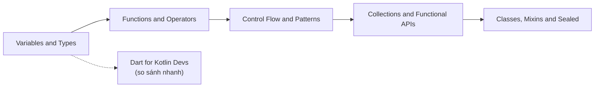

# Biến và Kiểu dữ liệu trong Dart

## Vấn đề cần giải quyết

Khi bắt đầu một ngôn ngữ mới, câu hỏi đầu tiên luôn là: *khai báo biến bằng gì, và kiểu dữ liệu được xử lý ra sao?*. Chọn sai cách khai báo trong Dart không chỉ gây lỗi compile - nó ảnh hưởng trực tiếp tới **hiệu năng render** và **tính đúng đắn của state** trong Flutter: một biến nên là `const` mà khai báo `var` khiến widget rebuild thừa; một biến nên nullable mà khai báo non-null buộc bạn lách bằng `!` và crash lúc runtime.

Dart chọn con đường: **kiểu tĩnh mạnh (strongly typed)** kết hợp **type inference**, cộng **sound null safety** - tức compiler đảm bảo toán học rằng một biến non-null sẽ không bao giờ chứa null.

---

## 1. Bốn cách khai báo: var, final, const, late

| Khai báo | Ý nghĩa | Được gán lại | Xác định giá trị lúc |
|---|---|---|---|
| `var x = ...` / `Type x = ...` | Biến thường | ✅ | runtime |
| `final x = ...` | Gán một lần duy nhất | ❌ | runtime |
| `const x = ...` | Hằng compile-time, immutable sâu | ❌ | **compile time** |
| `late` (kết hợp final/var) | Trì hoãn khởi tạo non-null | tùy | runtime, khi truy cập |

```dart
var counter = 0;
counter++; // OK

final createdAt = DateTime.now(); // giá trị tính lúc runtime, gán 1 lần
// createdAt = DateTime.now();   // ❌ lỗi

const secondsPerDay = 86400;      // compiler nhét thẳng vào bytecode
// const now = DateTime.now();    // ❌ lỗi - DateTime.now() không xác định lúc compile

late final config = loadConfig(); // trì hoãn tới lần truy cập đầu tiên
```

### Vì sao `const` quan trọng với Flutter

- `const` hoạt động với cả **constructor**: `const Point(1, 2)` - instance được **canonicalize**, hai biểu thức const cùng giá trị trỏ về một object duy nhất trong bộ nhớ.
- Widget tree dùng `const` để đánh dấu "cây con này không bao giờ đổi" -> framework **bỏ qua rebuild** phần đó.
- Quy tắc thực chiến: mọi thứ có thể là `const` hãy để `const`; analyzer (`prefer_const_constructors`) sẽ nhắc bạn.

> `final` chỉ khóa **reference** - `final list = [1]; list.add(2);` vẫn hợp lệ. Immutable thật sự cần `const [...]` hoặc `List.unmodifiable(...)`.

---

## 2. Các kiểu dựng sẵn

Trong Dart **mọi thứ đều là object** - kể cả số. Không có "primitive" như Java/Kotlin.

### Số: int, double, num

```dart
int count = 42;        // số nguyên 64-bit
double price = 99.5;   // số thực 64-bit (IEEE 754)
num flexible = 10;     // supertype của int và double
flexible = 10.5;       // OK

// Không có Long/Short/Byte/Float - chỉ int và double
final parsed = int.parse('42');
final ratio = double.parse('0.75');

print(7 / 2);  // 3.5  - chia thực
print(7 ~/ 2); // 3    - chia nguyên (integer division)
```

### String

```dart
final name = 'Flutter';
final greeting = 'Xin chào $name, ${2 + 3} điểm'; // interpolation giống Kotlin
final raw = r'C:\path\to\file';                    // raw string, không escape
final multi = '''
  Dòng 1
  Dòng 2
''';
```

### bool

Chỉ có đúng hai giá trị `true`/`false`. Dart **không có khái niệm truthy/falsy** - điều kiện phải là `bool` thật sự:

```dart
final name = '';
// if (name) {}          // ❌ lỗi compile
if (name.isEmpty) {}     // ✅ phải kiểm tra tường minh
```

---

## 3. Type Inference và Annotation

Compiler tự suy kiểu khi có giá trị khởi tạo; khai báo kiểu tường minh khi chưa có hoặc khi muốn chốt contract API public:

```dart
var items = <String>[];            // inferred: List<String>
final Map<String, int> scores = {}; // annotation rõ ràng cho API
late List<User> cachedUsers;        // chưa khởi tạo - bắt buộc annotation
```

Ưu tiên: **inference trong thân hàm, annotation ở biên giới (API, field của class)**.

---

## 4. Null Safety - nền tảng của mọi code Flutter hiện đại

Từ Dart 2.12, kiểu mặc định là **non-nullable**. Muốn chứa null phải thêm `?`:

```dart
String name = 'Hazu';   // không bao giờ null
String? nickname;        // nullable - mặc định null

// Toán tử làm việc với null
final length = nickname?.length;     // int? - safe call
final display = nickname ?? 'No';    // fallback nếu null
nickname ??= 'default';              // gán nếu đang null
final forced = nickname!.length;     // ép cam kết - crash nếu null!

if (nickname != null) {
  print(nickname.length);            // promotion: local variable được nâng kiểu
}
```

`late` dành cho trường hợp "biết chắc sẽ init trước khi dùng" - phổ biến nhất là field được inject sau constructor:

```dart
class Service {
  late final HttpClient client; // init trong onInit(), không thể set ở constructor
}
```

Chi tiết về promotion trên field và các bẫy liên quan xem [Dart for Kotlin Developers](dart_for_kotlin_devs.md).

---

## 5. dynamic vs Object vs Object?

Ba kiểu dễ nhầm - khác nhau ở **mức độ an toàn**:

| | `Object` | `Object?` | `dynamic` |
|---|---|---|---|
| Có chứa null | ❌ | ✅ | ✅ |
| Gọi method bất kỳ | ❌ phải cast | ❌ phải cast | ✅ bỏ qua kiểm tra |
| Lỗi phát hiện | compile time | compile time | **runtime** |

```dart
Object value = 'hello';
// print(value.length);        // ❌ Object không có length
print((value as String).length); // ✅ cast tường minh

dynamic loose = 'hello';
print(loose.length);           // chạy OK... đến ngày nó là số thì CRASH
```

> **Quy tắc:** `dynamic` chỉ chấp nhận ở biên giới hệ thống (decode JSON thô, callback từ platform channel). Trong logic nghiệp vụ, dùng `Object` + pattern matching hoặc model cụ thể.

---

## 6. Records - nhóm giá trị nhẹ (Dart 3)

Khi cần trả về nhiều giá trị mà chưa đáng tạo class:

```dart
(String, int) fetchUser() => ('Hazu', 25);
final (name, age) = fetchUser(); // destructuring

({String id, double price}) item = (id: 'p1', price: 9.9);
```

Records có structural equality sẵn - so sánh [Control Flow and Patterns](control_flow_patterns.md) để thấy cách dùng với pattern matching.

---

## Sai lầm thường gặp

1. **Lạm dụng `dynamic`** thay vì thiết kế kiểu đúng - mất toàn bộ bảo vệ của compiler.
2. **Dùng `!` để "tắt" cảnh báo nullable** thay vì xử lý gốc - chuyển lỗi compile thành crash runtime.
3. **Nhầm `final` với immutable** - collection bên trong vẫn đổi được.
4. **Quên rằng `int` không tự chuyển thành `double`:** `double d = 10;` lỗi - phải viết `10.0` hoặc `10.toDouble()`.
5. **So sánh chuỗi/số bằng `identical()`** - chỉ đúng với literal do canonicalization; so giá trị luôn dùng `==`.

---

## Liên kết trong hệ thống



- Tiếp theo: [Functions and Operators](functions_operators.md)
- Nếu bạn đến từ Kotlin: [Dart for Kotlin Developers](dart_for_kotlin_devs.md)
