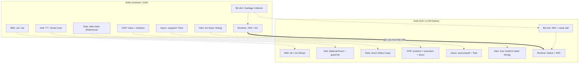
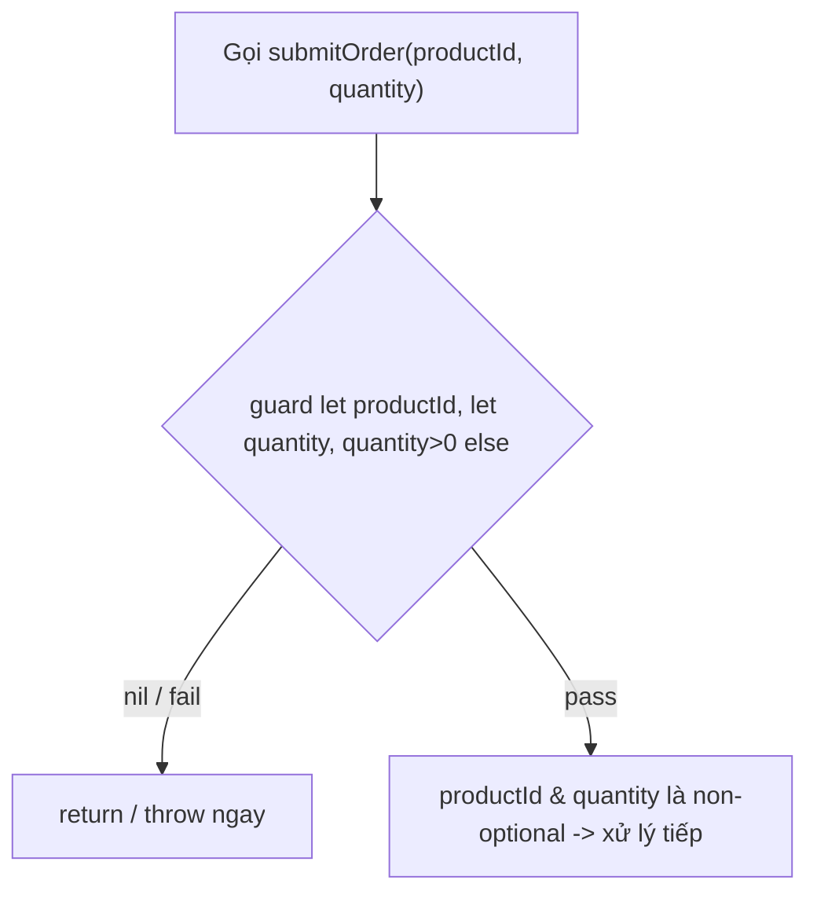
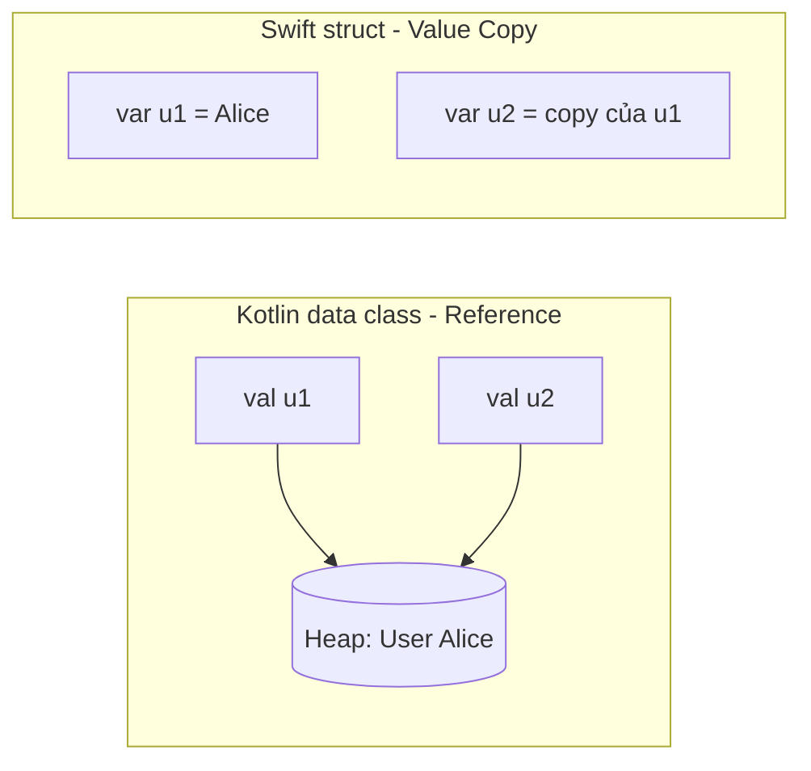
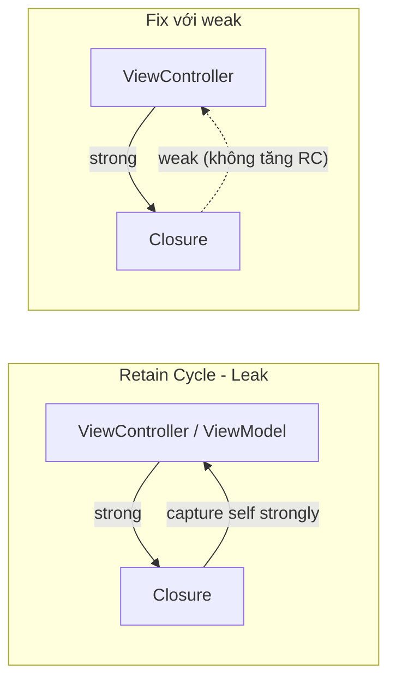
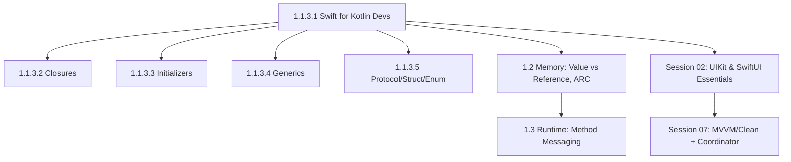

# Swift for Kotlin Developers: Cú pháp & Thực chiến iOS

## Vấn đề cần giải quyết

Bạn đã thành thạo Kotlin: `val`/`var`, Null Safety `T?`, `data class`, `when`, `suspend fun`. Khi mở Xcode và tạo project SwiftUI đầu tiên, Swift cho cảm giác "quen thuộc" - nhưng nếu **dịch 1-1 theo thói quen Kotlin, app sẽ crash hoặc leak ngay**:

1. **Bẫy `let` sâu (Deep Immutability):** `val user` trong Kotlin vẫn cho phép `user.name = "..."` nếu `name` là `var`. `let user` với `struct` trong Swift khóa toàn bộ object. **Gốc rễ:** Kotlin `val` khóa reference vì mọi object nằm trên Heap; Swift `let` + `struct` khóa cả value vì assignment là copy toàn bộ giá trị.
2. **Bẫy ARC:** Kotlin có Garbage Collector tự cắt vòng tham chiếu. Swift dùng ARC đếm tham chiếu - quên `[weak self]` trong closure async là `ViewModel`/`ViewController` không bao giờ được giải phóng. **Gốc rễ:** GC quét đồ thị tham chiếu lúc runtime nên cycle tự hủy; ARC chèn retain/release lúc compile time nên cycle làm refcount không bao giờ về 0.
3. **Bẫy Optional:** Kotlin có Smart Cast (`if (x != null) x.length`). Swift bắt buộc `guard let`/`if let` tường minh. **Gốc rễ:** Kotlin null là trạng thái đặc biệt của con trỏ mà runtime kiểm tra - NPE vẫn còn sót; Swift Optional là một giá trị enum bình thường, compiler ép xử lý case `none` trước khi dùng.
4. **Bẫy Argument Labels:** Kotlin gọi `login("a","b")`, Swift bắt buộc `login(username: "a", password: "b")` hoặc báo lỗi compile. **Gốc rễ:** đây là **quyết định thiết kế API**, không phải hệ quả kỹ thuật của native compile - Swift API Design Guidelines yêu cầu call site phải đọc như câu tiếng Anh (tên hàm + label tạo thành ngữ pháp, §2); Kotlin giải quyết cùng vấn đề đó bằng cách đọc tên hàm dài (`sendNotificationToUser`).
5. **Bẫy Value Type:** `data class` là Reference Type (copy reference). `struct` là Value Type (copy giá trị) - gán `var b = a; b.name = "Bob"` sẽ không ảnh hưởng `a`. **Gốc rễ:** Kotlin mọi object trên Heap nên gán là copy reference; Swift đặt struct làm mặc định nên gán là copy giá trị.

### Vì sao hai ngôn ngữ khác nhau đến vậy?

5 bẫy trên không phải ngẫu nhiên - chúng đều suy ra từ **nơi sinh ra** của hai ngôn ngữ.

- **Kotlin sinh ra trên JVM:** mọi object nằm trên Heap, Garbage Collector quản lý vòng đời, và ngôn ngữ được tối ưu cho interop với Java. Vì runtime luôn đứng sau lưng, Kotlin có thể chọn cách làm "thả": object mặc định là reference, null là con trỏ đặc biệt do runtime kiểm tra, GC tự cắt vòng tham chiếu.
- **Swift sinh ra cho native LLVM:** biên dịch thẳng ra mã máy, **không có GC**. Toàn bộ thiết kế xoay quanh khoảng trống đó: Value Type được đặt làm mặc định (giá trị nằm trên Stack, không cần GC), ARC thay GC cho `class`, và **compiler chịu trách nhiệm an toàn thay vì runtime** - Optional, `let` deep immutability, `guard let` đều là hợp đồng compiler ép bạn ký lúc build.

**Hệ quả:** khác biệt cú pháp chỉ là **bề mặt**; 4/5 bẫy trên (1, 2, 3, 5) có gốc rễ là khác biệt **memory model/runtime** giữa hai nền tảng. Bẫy 4 (Argument Labels) là ngoại lệ - gốc rễ là **quyết định thiết kế API**, sẽ thấy rõ ở §2. Đây là câu chủ đề xuyên suốt bài học này - **mỗi section dưới đây sẽ chỉ ra cơ chế bộ nhớ đứng sau cú pháp.**

Bài học này trả lời theo đúng tư duy thực chiến: **Nó là gì -> Vì sao tồn tại -> Khi nào dùng -> Code chuẩn Apple như thế nào**, đối chiếu song song Kotlin <-> Swift cho từng phần cú pháp nền tảng.

---

## Mental Model: Bản đồ chuyển đổi tư duy



> **Đọc diagram:** mỗi cặp `K → S` cùng hàng là một "bản dịch" trực tiếp khi chuyển đổi tư duy - ví dụ `K2` (Smart Cast) dịch sang `S2` (`guard let`). Dòng dày `K0 → S0` là **nền móng**: JVM + GC đối lập Native + ARC, và mọi khác biệt phía trên đều suy ra từ đó.

---

## 1. Biến, Hằng, Kiểu & String Interpolation

### Cơ chế bên dưới

Vì sao cùng là "hằng số" mà `let` khóa được cả property còn `val` thì không? Câu trả lời nằm ở cơ chế gán (assignment), không phải cú pháp. Trong Swift, gán một `struct` là **copy toàn bộ value** - hai biến là hai ô nhớ độc lập, nên khóa biến cũng là khóa cả giá trị bên trong. Kotlin xử lý điểm này thế nào? Mọi object đều nằm trên Heap và biến chỉ giữ reference, nên `val` chỉ có thể khóa reference - object bên trong vẫn mutable nếu có `var`. Với `class`, Swift cũng chỉ copy con trỏ 8 byte nên `let` quay về hành vi của `val`. Về mặt lưu trữ: `Int` là platform-width (64-bit trên mọi thiết bị iOS hiện đại - `Int` chính là `Int64`), `Bool` chiếm 1 byte trong layout. `String` là struct mã hóa UTF-8; chuỗi ngắn được tối ưu bằng **Small String Optimization** - lưu trực tiếp trong 16 byte của struct, không cấp phát Heap; chuỗi dài mới nằm trên Heap với Copy-on-Write (sẽ quay lại ở §6 và §10). Kotlin đối chiếu: `String` là immutable reference object trên Heap, mọi chuỗi đều truy cập qua một con trỏ.

### 1.1 `val` vs `let` và `var` vs `var`

Câu hỏi đúng không phải "`val` hay `let`?" mà là **khóa của cái gì**. Có hai loại khóa: khóa **binding** (không gán lại được biến) và khóa **value** (không sửa được property bên trong). Bảng 4 trường hợp:

| Khai báo | Khóa **binding**? (gán lại biến) | Khóa **value**? (sửa property) |
|---|---|---|
| Kotlin `val user = User(var name)` (data class - Reference) | ✅ Không gán lại được | ❌ `user.name = "New"` vẫn hợp lệ |
| Kotlin `val user: UserClass` | ✅ | ❌ `val` chỉ khóa reference - giống dòng trên |
| Swift `let user = User(name)` (struct - Value) | ✅ | ✅ **Deep immutability** - khóa cả property |
| Swift `let user: UserClass` | ✅ | ❌ chỉ khóa reference - giống hệt `val` Kotlin |

Quy tắc dùng: mặc định ưu tiên `val` (Kotlin) / `let` (Swift) - chỉ `var` khi thực sự cần mutation.

> **Value Semantics (ngữ nghĩa giá trị)** - khái niệm nền của cả bài: sau phép gán, hai biến là **hai thế giới độc lập** - sửa biến này không bao giờ ảnh hưởng biến kia. Chỉ đúng với Value Type (struct/enum); `class` không có tính chất này. Đây là nền cho §6 (struct vs class) và §10 (collections) - chúng ta sẽ quay lại ở §6.

=== "Kotlin"

```kotlin
val appName: String = "Knowledge OS"
var counter: Int = 0
counter += 1
val score = 9.5 // Double - Type Inference

// val + class: chỉ khóa reference
class UserClass(var name: String)
val u = UserClass("Hazu")
u.name = "Bob" // ✅ OK - object bên trong vẫn mutable
```

=== "Swift"

```swift
let appName: String = "Knowledge OS" // immutable
var counter: Int = 0
counter += 1
let score = 9.5 // Double - Type Inference

// let với struct: khóa toàn bộ value
struct User { var name: String }
let user = User(name: "Hazu")
// user.name = "Bob" // ❌ Compile error: Cannot assign to property
var user2 = User(name: "Hazu")
user2.name = "Bob" // ✅ OK vì var

// let với class: chỉ khóa reference - giống val Kotlin
class UserClass {
    var name: String
    init(name: String) { self.name = name } // class KHÔNG tự sinh memberwise init
}
let userC = UserClass(name: "Hazu")
userC.name = "Bob" // ✅ OK vì class là Reference Type
```

> **Điểm dạy từ ví dụ trên:** `struct User` dùng được `User(name:)` ngay - compiler tự sinh **memberwise init**. `class UserClass` thì không: phải tự viết `init(name:)`. Kotlin dễ gây nhầm vì primary constructor (`class UserClass(var name: String)`) sinh sẵn khởi tạo - Swift chỉ dành ưu đãi đó cho `struct`, một phần để giữ `struct` làm mặc định khi tạo model. Chi tiết init ở §15.

> **Vì sao `let` + `struct` khóa được cả property?** Không phải compiler "đặt luật riêng" - mà vì **gán là copy**: `let user = User(...)` giữ toàn bộ value ngay trong biến, không có ô nhớ nào của object bị tham chiếu ra ngoài để sửa. Muốn đổi property phải ghi đè biến - mà `let` cấm ghi đè. Với `class`, value của biến chỉ là con trỏ nên `let` chỉ khóa được con trỏ. Model mặc định của Swift là `struct` - khóa `let` là khóa cả value, loại bỏ cả một lớp bug mutation mà Kotlin phải tự kỷ luật bằng `val` + immutable properties.

### 1.2 Type Annotation & Type Inference

Cả hai ngôn ngữ đều suy luận kiểu, nhưng Swift yêu cầu tường minh khi compiler không suy ra được (biến chưa khởi tạo, kiểu số nguyên dãy số lớn...).

```swift
let name: String = "Hazu" // Annotation
let age = 25              // Inference -> Int
let price: Double = 99.0  // 99.0 mặc định là Double, muốn Float phải khai báo
var isActive = true       // Bool
// var value // ❌ Error: cần giá trị khởi tạo hoặc kiểu khai báo
```

**Khác biệt inference thật sự mà dev Kotlin cần biết:**

- `9.5` ở Swift **luôn là `Double`** - không có kiểu mặc định `Float`, muốn `Float` phải khai báo tường minh (Kotlin phải viết `9.5f` mới là Float).
- `Int` là platform-width: 64-bit trên mọi thiết bị iOS hiện đại (`Int` chính là `Int64`).
- **Arithmetic overflow: Swift TRAP, Kotlin WRAP.** Kotlin `Int.MAX_VALUE + 1` âm thầm quay vòng (wrap-around); Swift crash runtime - compiler coi kết quả sai còn nguy hiểm hơn crash có kiểm soát. Muốn wrap phải dùng toán tử `&+`, tức là khai báo chủ đích ngay tại dòng code.

=== "Kotlin"

```kotlin
val x = Int.MAX_VALUE + 1 // ✅ Wrap-around im lặng: -9223372036854775808
```

=== "Swift"

```swift
let x = Int.max + 1  // ❌ Runtime crash: "Arithmetic overflow"
let y = Int.max &+ 1 // ✅ Wrap có chủ đích: ra Int.min
```

### 1.3 String Interpolation

Cú pháp khác nhau ngay từ dòng đầu tiên bạn `print`.

=== "Kotlin"

```kotlin
val name = "Hazu"
val age = 25
val greeting = "Xin chào $name, năm sau ${age + 1} tuổi"
val raw = """
    Dòng 1
    Dòng 2
""".trimIndent()
```

=== "Swift"

```swift
let name = "Hazu"
let age = 25
let greeting = "Xin chào \(name), năm sau bạn \(age + 1) tuổi" // \(expr)
let multiline = """
    Dòng 1
    Dòng 2
    """
```

> **Lưu ý thực chiến:** Swift không có `"value: $var"` - luôn phải `\(var)`. Quên dấu `\` là tạo ra chuỗi literal thay vì lỗi compile, bug rất khó phát hiện.

**Bản chất `String` khác nhau ở mức nào?** Swift `String` là **Value Type** (struct): gán là copy - với Copy-on-Write nên vẫn rẻ, chi tiết ở §10; Kotlin `String` là immutable reference object trên Heap: gán chỉ copy con trỏ, hai biến trỏ chung một chuỗi. Về interpolation: `\(expr)` gọi property `description` của giá trị - tương đương gọi `toString()` trong template của Kotlin. Vì vậy type nào conform `CustomStringConvertible` là in đẹp được, như override `toString()` trong Kotlin.

---

## 2. Hàm & Argument Labels - Đặc sản Swift

Swift tách **Argument Label** (tên khi gọi) và **Parameter Name** (tên trong thân hàm) để câu lệnh đọc như tiếng Anh tự nhiên. Đây là khác biệt lớn nhất khiến dev Kotlin "khó chịu" nhất khi chuyển sang.

### 2.1 Ba dạng khai báo

=== "Kotlin"

```kotlin
fun sendNotification(userId: String, message: String, isUrgent: Boolean = false) {}
sendNotification("user_123", "Họp 9h")
sendNotification("user_123", "Báo động", isUrgent = true)
```

=== "Swift"

```swift
// 1. Label mặc định = tên parameter
func sendNotification(userId: String, message: String, isUrgent: Bool = false) {
    print("Gửi tới \(userId): \(message)")
}
sendNotification(userId: "user_123", message: "Họp 9h") // BẮT BUỘC có label
sendNotification(userId: "user_123", message: "Báo động", isUrgent: true)

// 2. Label khác parameter - đọc như văn xuôi
func downloadImage(from urlString: String, into imageView: UIImageView) {}
// Gọi: downloadImage(from: "https://...", into: avatarView)

// 3. Ẩn label bằng `_` - giống Kotlin/C
func sum(_ a: Int, _ b: Int) -> Int { a + b }
let total = sum(10, 20) // Không cần label

// 4. Variadic + Default
func log(_ message: String, level: String = "INFO", tags: String...) {
    print("[\(level)] \(message) \(tags)")
}
log("App started")
log("Error", level: "ERROR", tags: "network", "retry")
```

> **Khi nào dùng gì?**
> - Dùng `from`/`into`/`with` khi hàm mô tả hành động tự nhiên (Apple API toàn dùng dạng này: `move(from:to:)`, `insert(_:at:)`).
> - Dùng `_` khi hàm là phép toán/công thức toán học (`sum`, `max`).

### 2.2 `inout` - Sửa biến gốc

Trong cả Kotlin lẫn Swift, parameter mặc định là immutable. Kotlin không có cơ chế này (phải return giá trị mới); Swift dùng `inout` + tiền tố `&` khi gọi.

```swift
func swapNumbers(_ a: inout Int, _ b: inout Int) {
    let temp = a
    a = b
    b = temp
}
var x = 10, y = 20
swapNumbers(&x, &y) // x: 20, y: 10
```

> **Khi nào không nên dùng?** `inout` chỉ hợp cho biến cục bộ/Stack. Tránh dùng với property của class vì dễ tạo side effect khó theo dõi - ưu tiên return value như Kotlin.

---

## 3. Tuples, Range, Control Flow & `defer`

### 3.1 Tuples - Không có trong Kotlin

Tuple là nhóm giá trị nhẹ, không cần tạo `data class` chỉ để return 2 giá trị.

```swift
func fetchUser() -> (name: String, age: Int, isActive: Bool) {
    return ("Hazu", 25, true)
}
let user = fetchUser()
print(user.name) // Hazu - truy cập bằng label
print(user.0)    // Hazu - truy cập bằng index

// Destructuring
let (name, age, _) = fetchUser()
```

> **Giới hạn:** Tuple không conform `Codable`, không có method, không dùng làm API public phức tạp. Return quá 3 giá trị nên dùng `struct`.

### 3.2 Range Operators

| Kotlin | Swift | Ý nghĩa |
|---|---|---|
| `0 until 5` (0..4) | `0..<5` | Half-open |
| `0..5` (0..5) | `0...5` | Closed |
| `for (i in 0 until 5)` | `for i in 0..<5` | Loop |

```swift
for i in 0..<3 { print(i) } // 0,1,2
for i in 0...3 { print(i) } // 0,1,2,3
let range = 1...5
if range.contains(3) { print("Có 3") }
```

### 3.3 Control Flow: `for-in`, `while`, `guard`, `where`

```swift
// for-in với where - lọc ngay trong loop
let scores = [80, 95, 60, 88]
for score in scores where score >= 80 {
    print("Giỏi: \(score)")
}

// while / repeat-while (do-while của Kotlin)
var n = 3
while n > 0 { n -= 1 }
repeat { n += 1 } while n < 3

// guard: Early Exit - chuẩn Apple để làm phẳng Pyramid of Doom
func validate(email: String?, age: Int?) {
    guard let email = email, !email.isEmpty,
          let age = age, age >= 18 else {
        print("Không hợp lệ")
        return
    }
    // email, age là non-optional từ đây
    print("\(email) đủ tuổi")
}
```

### 3.4 `defer` - Dọn dẹp khi thoát scope

Kotlin dùng `try/finally` để đảm bảo dọn dẹp. Swift dùng `defer`: khối code chạy **khi thoát scope**, bất kể return sớm hay throw, và khai báo **ngay sau khi acquire resource**.

=== "Kotlin"

```kotlin
fun process() {
    val file = openFile()
    try {
        parse(file)
    } finally {
        file.close() // dọn dẹp ở cuối, xa nơi mở file
    }
}
```

=== "Swift"

```swift
func process() throws {
    let file = openFile()
    defer { file.close() } // chạy khi thoát scope, kể cả throw
    try parse(file)        // nhiều defer chạy ngược thứ tự khai báo
}
```

> **Khi nào dùng?** Mọi cặp acquire/release (mở file, lock/unlock, begin/end animation) nên viết `defer` ngay cạnh nhau để không quên đường thoát.

---

## 4. Properties: Stored, Computed, `lazy`, `willSet/didSet`

Kotlin dùng `get()`/`set()` inline. Swift tách rõ hơn và có Property Observers - đặc sản UIKit.

```swift
struct ProductCard {
    var name: String
    var price: Double
    var quantity: Int

    // 1. Computed Property - tính toán mỗi khi truy cập
    var totalPrice: Double {
        price * Double(quantity)
    }
    // Với setter
    var discountPrice: Double {
        get { price * 0.9 }
        set { price = newValue / 0.9 } // newValue là keyword
    }

    // 2. lazy - chỉ khởi tạo khi dùng lần đầu (như Kotlin `by lazy`)
    lazy var formatter: NumberFormatter = {
        let f = NumberFormatter()
        f.numberStyle = .currency
        return f
    }()

    // 3. Property Observers - đặc sản UIKit
    var stock: Int = 10 {
        willSet { print("Sắp đổi từ \(stock) sang \(newValue)") }
        didSet {
            if stock == 0 { print("Hết hàng!") }
            if stock < oldValue { print("Đã bán \(oldValue - stock)") }
        }
    }
}

// UIKit thực chiến:
class ProductCell: UITableViewCell {
    var product: ProductCard? {
        didSet {
            guard let p = product else { return }
            textLabel?.text = p.name
            detailTextLabel?.text = "\(p.totalPrice)"
        }
    }
}
```

> **Khi nào dùng?**
> - Computed property khi giá trị suy ra từ stored property (không tốn bộ nhớ).
> - `lazy` cho object khởi tạo đắt (formatter, pipeline) - như `by lazy` của Kotlin.
> - `didSet` cực nhiều trong UIKit để auto update UI khi model đổi, thay cho `Delegates.observable` của Kotlin. Trong SwiftUI, vai trò này thuộc về `@State`/`@Published`.

---

## 5. Optionals: Bỏ Smart Cast, Làm chủ `guard let`

`Optional` trong Swift là `enum` với 2 case `none`/`some` - không có `null` như Kotlin.

```swift
enum Optional<Wrapped> {
    case none
    case some(Wrapped)
}
```

### 5.1 Đối chiếu Unwrapping

=== "Kotlin"

```kotlin
var email: String? = "dev@example.com"
val length: Int? = email?.length
val nonNull = email ?: "no-email"
if (email != null) println(email.length) // Smart Cast
val forced = email!!.length
```

=== "Swift"

```swift
var email: String? = "dev@example.com"
let length: Int? = email?.count          // Optional Chaining
let nonNull = email ?? "no-email"        // Nil-Coalescing
if let email = email {                   // Optional Binding
    print(email.count) // email là String
}
// Swift 5.7+: if let email { print(email.count) }
let forced = email!.count // ❌ Tránh! Crash nếu nil
```

### 5.2 `guard let` - Early Exit chuẩn Apple



```swift
func submitOrder(productId: String?, quantity: Int?) {
    guard let productId = productId,
          let quantity = quantity, quantity > 0 else {
        print("Dữ liệu không hợp lệ")
        return // BẮT BUỘC thoát scope
    }
    print("Đặt \(productId) x\(quantity)")
}

// Unwrap nhiều giá trị + điều kiện
func login(token: String?, user: User?) {
    guard let token = token, !token.isEmpty,
          let user = user else { return }
    // dùng token, user an toàn
}
```

### 5.3 Failable Initializer: `init?`

Thay vì Kotlin trả `null` từ factory function, Swift cho phép **initializer trả `nil`** - hợp nhất "khởi tạo" và "validate" thành một bước.

```swift
struct User {
    let name: String
    let age: Int

    init?(dict: [String: Any]) {
        guard let name = dict["name"] as? String,
              let age = dict["age"] as? Int, age >= 0 else {
            return nil // dữ liệu không hợp lệ -> init thất bại
        }
        self.name = name
        self.age = age
    }
}
let u1 = User(dict: ["name": "Hazu", "age": 25]) // Optional<User>
let u2 = User(dict: ["name": "Bob"])             // nil

// Đi kèm: init! (không khuyến nghị) và throwing init - xem §15
```

> **Quy tắc:** Dùng `init?` khi dữ liệu đầu vào không đáng tin (parse dictionary, khởi tạo từ ID không tồn tại). Dùng `throws` khi cần báo lý do lỗi cụ thể.

---

## 6. Models: `data class` vs `struct` (Value Type)

Đây là khác biệt kiến trúc lớn nhất giữa hai ngôn ngữ.

| Tiêu chí | Kotlin `data class` | Swift `struct` |
|---|---|---|
| Loại | Reference Type (Heap) | **Value Type** (Stack/Copy-on-Write) |
| Gán `val b = a` | Cùng trỏ 1 vùng nhớ | **Copy độc lập** |
| `==` | Tự sinh `equals()` | Cần `: Equatable` (compiler tự sinh) |
| `hashCode` | Tự sinh `hashCode()` | Cần `: Hashable` (compiler tự sinh) |
| Tạo bản sao | `copy(price=...)` | `var b = a; b.price = ...` hoặc `mutating func` |



=== "Kotlin"

```kotlin
data class Product(val id: String, val name: String, var price: Double)
val p1 = Product("1", "iPhone", 999.0)
val p2 = p1.copy(price = 899.0)
// p1 == p2 so sánh value - có sẵn
```

=== "Swift"

```swift
struct Product: Equatable, Hashable, Identifiable {
    let id: String
    var name: String
    var price: Double
    mutating func applyDiscount(_ percent: Double) {
        price *= (1 - percent / 100) // mutating bắt buộc khi sửa struct
    }
}
var p1 = Product(id: "1", name: "iPhone", price: 999)
var p2 = p1 // copy
p2.applyDiscount(10)
print(p1.price) // 999 - không ảnh hưởng
print(p2.price) // 899.1

// Equatable & Hashable: compiler tự sinh == và hash(into:)
// từ TẤT CẢ stored properties - không cần viết tay
let products: Set<Product> = [p1, p2] // Hashable cho phép dùng làm Set key
```

> **Quy tắc Apple:** Luôn bắt đầu model bằng `struct`. Chỉ đổi sang `class` khi cần **identity chia sẻ** (ViewModel, Service, Manager, Repository). Chi tiết sâu về Value vs Reference ở Topic [1.2.2 Value and Reference Type](../../memory_management/value_reference_type.md).

---

## 7. Singleton, `static`/`class` Members & `companion object`

Kotlin không có `static` - dùng `companion object`. Swift không có `companion object` - dùng `static`/`class` trực tiếp trong type.

| Kotlin | Swift | Ý nghĩa |
|---|---|---|
| `companion object { val x }` | `static let/var x` | Thuộc về type, không thuộc instance |
| `companion object { fun f() }` | `static func f()` | Method tĩnh |
| - | `class func f()` | Method tĩnh **có thể override** ở subclass |
| `object Singleton` | `static let shared` + `private init()` | Singleton |

=== "Kotlin"

```kotlin
class AppConfig {
    companion object {
        const val VERSION = "1.0"
        fun reload() { /* ... */ }
    }
}
AppConfig.VERSION
AppConfig.reload()

object ApiClient {
    val shared = ApiClient()
    private fun setup() {}
}
```

=== "Swift"

```swift
class AppConfig {
    static let version = "1.0"   // constant tĩnh
    static func reload() {}      // không override được
    class func refresh() {}      // override được ở subclass
}
AppConfig.version
AppConfig.reload()

// Singleton chuẩn Apple:
final class ApiClient {
    static let shared = ApiClient() // lazy, thread-safe tự động
    private init() {}               // chặn tạo instance ngoài
}
ApiClient.shared
```

> **Lưu ý:** `static let shared` trong Swift là **lazy và thread-safe** (đảm bảo bởi runtime) - tương đương `object` trong Kotlin. Không cần viết double-checked locking như Java.

---

## 8. Scope Functions: `let`/`apply`/`run`/`also` → Swift

Kotlin có 5 scope functions cực phổ biến. Swift **không có equivalent trực tiếp** - mỗi pattern được thay bằng một cú pháp riêng.

| Kotlin | Mục đích | Swift thay thế |
|---|---|---|
| `x?.let { }` | Xử lý khi non-null | `if let` / `guard let` / Optional Chaining |
| `x.apply { }` | Configure object | Khởi tạo với tham số hoặc `var` + gán |
| `x.run { }` | Transform / tính toán | IIFE `{ }()` hoặc method/computed property |
| `x.also { }` | Side effect giữa chừng | Câu lệnh thường hoặc closure riêng |
| `with(x) { }` | Nhóm thao tác trên object | IIFE hoặc method trong type |

=== "Kotlin"

```kotlin
// let: null check + transform
email?.let { sendTo(it) }

// apply: configure object
val label = UILabel().apply {
    text = "Hello"
    textColor = .red
}

// run: tính toán trong scope
val fullName = user.run { "$firstName $lastName" }

// also: side effect
val list = mutableListOf("a").also { log("Created: $it") }
```

=== "Swift"

```swift
// let -> Optional Binding (mục 5)
if let email = email { sendTo(email) }

// apply -> configure ngay khi khởi tạo, hoặc var + gán
let label: UILabel = {
    let l = UILabel()      // IIFE - closure tự chạy
    l.text = "Hello"
    l.textColor = .red
    return l
}()

// run -> computed property hoặc method
var fullName: String { "\(firstName) \(lastName)" }

// also -> câu lệnh thường, Swift ưu tiên tường minh
var list = ["a"]
log("Created: \(list)")
```

> **Tư duy khác:** Kotlin hướng chức năng (biến đổi qua chain scope functions). Swift ưu tiên **tường minh**: unwrap bằng `guard let`, configure bằng init parameter, tính toán bằng computed property. Đừng tìm cách "nhái" scope functions - hãy viết theo phong cách Swift.

---

## 9. `Codable` vs `kotlinx.serialization` - Việc đầu tiên khi nhận API

Mỗi dev Android chuyển sang iOS đều gặp ngay: parse JSON. Kotlin dùng `@Serializable` + `kotlinx.serialization`; Swift dùng `Codable` + `JSONDecoder` - **built-in, không cần thư viện**.

| Khái niệm | Kotlin | Swift |
|---|---|---|
| Protocol/Annotation | `@Serializable` | `Codable` (= `Encodable` + `Decodable`) |
| Decode | `Json.decodeFromString<T>(json)` | `JSONDecoder().decode(T.self, from: data)` |
| Encode | `Json.encodeToString(value)` | `JSONEncoder().encode(value)` |
| Đổi tên field | `@SerialName("user_name")` | `CodingKeys` enum + `String` raw value |
| Ngày tháng | Custom serializer | `dateDecodingStrategy` |

=== "Kotlin"

```kotlin
@Serializable
data class User(
    val id: String,
    val name: String,
    @SerialName("avatar_url") val avatarUrl: String? = null
)

val user = Json { ignoreUnknownKeys = true }
    .decodeFromString<User>(jsonString)
```

=== "Swift"

```swift
struct User: Codable {
    let id: String
    let name: String
    let avatarUrl: String?

    // Map tên field JSON khác tên property
    enum CodingKeys: String, CodingKey {
        case id, name
        case avatarUrl = "avatar_url"
    }
}

let user = try JSONDecoder().decode(User.self, from: jsonData)
let json = try JSONEncoder().encode(user)
```

```swift
// Cấu hình decoder - tương đương Json { } builder của Kotlin
let decoder = JSONDecoder()
decoder.keyDecodingStrategy = .convertFromSnakeCase // user_name -> userName
decoder.dateDecodingStrategy = .iso8601
// Lưu ý: JSONDecoder bỏ qua JSON field dư thừa (không khai báo trong struct),
// nhưng sẽ throw nếu JSON THIẾU field non-optional - khác ignoreUnknownKeys của Kotlin
// (ignoreUnknownKeys của kotlinx.serialization cũng chỉ bỏ field dư, không điền field thiếu)

let user = try decoder.decode(User.self, from: jsonData)
```

> **Khác biệt quan trọng:**
> - `Codable` **không có ignoreUnknownKeys mặc định** - JSON dư field không sao, nhưng JSON **thiếu** field non-optional sẽ throw. Dùng property optional hoặc giá trị mặc định qua custom `init(from:)`.
> - Kotlin cần plugin `kotlinx.serialization` trong build config; Swift có sẵn trong standard library.

---

## 10. Collections: `Array`, `Dictionary`, `Set`

Swift không có `List` vs `MutableList` - `let` = immutable, `var` = mutable. Bản thân collection cũng là Value Type.

=== "Kotlin"

```kotlin
val list = listOf("Swift", "Kotlin")
val mutable = mutableListOf("Swift", "Kotlin")
mutable.add("Dart")

val numbers = listOf(1, 2, 3, 4, 5)
val doubled = numbers.map { it * 2 }
val map = mapOf("Alice" to 25)
val age = map["Alice"] // Int?
```

=== "Swift"

```swift
let list: [String] = ["Swift", "Kotlin"] // immutable
var mutable = ["Swift", "Kotlin"]
mutable.append("Dart")

let numbers = [1, 2, 3, 4, 5]
let doubled = numbers.map { $0 * 2 }      // $0 = it
let evens = numbers.filter { $0 % 2 == 0 }
let sum = numbers.reduce(0) { $0 + $1 }
let validInts = ["1", "2", "three", "4"].compactMap { Int($0) } // [1,2,4] - lọc nil
let sorted = numbers.sorted(by: >)        // giống sortedDescending

let userMap: [String: Int] = ["Alice": 25, "Bob": 30]
let age = userMap["Alice"]                // Int? - Dictionary lookup luôn Optional
if let age = userMap["Alice"] { print(age) }
```

> **Khác biệt tinh tế:** Truy cập `map["key"]` ở Kotlin trả `Int?`, ở Swift trả `Int?` - giống nhau. Nhưng **mutation** của `Dictionary`/`Array` trong Swift là copy-on-write: gán cho biến mới rồi sửa biến mới không ảnh hưởng biến cũ (khác hẳn `MutableList`).

---

## 11. Rẽ nhánh & Pattern Matching: `when` vs `switch`

`switch` Swift là **exhaustive** (phải đủ mọi case), không cần `break`, hỗ trợ unwrap associated value và `where`.

=== "Kotlin"

```kotlin
sealed class ViewState {
    object Loading : ViewState()
    data class Success(val items: List<String>) : ViewState()
    data class Error(val code: Int, val msg: String) : ViewState()
}
when (state) {
    is ViewState.Loading -> showLoading()
    is ViewState.Success -> display(state.items)
    is ViewState.Error -> if (state.code == 401) login() else error(state.msg)
}
```

=== "Swift"

```swift
enum ViewState {
    case loading
    case success(items: [String])
    case error(code: Int, message: String)
}
func render(state: ViewState) {
    switch state {
    case .loading:
        showLoading(true)
    case .success(let items):
        displayList(items)
    case .error(let code, let msg) where code == 401:
        redirectToLogin()
    case .error(let code, let msg) where code >= 500:
        showServerError(msg)
    case .error(_, let message):
        showError(message)
    }
}
```

> **Khác biệt then chốt:** Kotlin cần `sealed class` + `is` để pattern matching; Swift dùng `enum` + associated values - gọn hơn, compiler tự hiểu và ép switch phải exhaustive. Đây là nền tảng của SwiftUI State (`.loading`, `.success`...).

---

## 12. Enum, Generics, Access Control & `typealias`

### 12.1 Enum với Associated Values

Mạnh hơn `enum class` Kotlin rất nhiều - mỗi case có thể mang dữ liệu riêng.

```swift
enum NetworkResult<T> {
    case success(T)
    case failure(code: Int, message: String)
    case loading
}
let result: NetworkResult<[String]> = .success(["a", "b"])

// Lấy dữ liệu: switch hoặc if case
if case .success(let items) = result { print(items) }
```

### 12.2 Generics

Cú pháp gần giống Kotlin, dùng `where` để ràng buộc.

=== "Kotlin"

```kotlin
fun <T> first(items: List<T>): T? = items.firstOrNull()
fun <T> save(value: T, key: String) where T : Comparable<T> { /* ... */ }
```

=== "Swift"

```swift
func first<T>(_ items: [T]) -> T? { items.first }
func save<T: Codable>(_ value: T, key: String) where T: Equatable {}

// Generic struct
struct Box<T> { var value: T }
let intBox = Box(value: 10)
```

Chi tiết sâu ở Topic [1.1.3.4 Generics](generics.md).

### 12.3 Access Control

| Swift | Ý nghĩa | Tương đương Kotlin |
|---|---|---|
| `private` | Trong **declaration và extension cùng file** | `private` |
| `fileprivate` | Trong cùng file | - |
| `internal` (default) | Trong module (app/target) | `internal` |
| `public` | Ngoài module, không override/subclass ngoài module | `public` |
| `open` | Ngoài module, được override/subclass | `open` (Kotlin class mặc định final) |

```swift
struct NetworkClient {
    private var session = URLSession() // chỉ NetworkClient thấy được
    fileprivate func logRequest() {}   // mọi code cùng file thấy
    internal func fetch() {}           // mặc định - cả app thấy
}

// private cho phép access từ extension cùng file:
extension NetworkClient {
    func reset() { session = URLSession() } // ✅ OK vì cùng file
}
```

> **Lưu ý:** Khác với Kotlin, `private` của Swift **không** giới hạn theo file (đó là `fileprivate`). Và `public` của Swift chặn override ngoài module - muốn cho subclass ngoài module phải dùng `open`.

### 12.4 `typealias`

```swift
typealias UserID = String
typealias Completion = (Result<User, Error>) -> Void
func fetchUser(id: UserID, completion: Completion) {}
```

---

## 13. Error Handling: `throws`/`try`/`try?`/`try!` & `Result`

Kotlin dùng `try/catch` với `Exception` unchecked. Swift dùng `Error` protocol + `throws` - **checked ngay tại signature**: hàm nào throw phải khai báo, caller bắt buộc xử lý.

```swift
enum AppError: Error, LocalizedError {
    case network(code: Int)
    case invalidEmail
    var errorDescription: String? {
        switch self {
        case .network(let c): return "Lỗi mạng \(c)"
        case .invalidEmail: return "Email không hợp lệ"
        }
    }
}
func login(email: String) throws -> User {
    guard email.contains("@") else { throw AppError.invalidEmail }
    // ...
    return User(name: "Hazu", age: 25)
}

// Gọi
do {
    let user = try login(email: "hazu@example.com")
    print(user)
} catch AppError.invalidEmail {
    print("Sai email")
} catch {
    print(error.localizedDescription) // catch-all
}

// try? -> trả Optional, nuốt lỗi (dùng khi không quan tâm lỗi)
let userOrNil = try? login(email: "bad")

// try! -> crash nếu lỗi (chỉ dùng khi chắc chắn không lỗi)
let userForced = try! login(email: "hazu@example.com")
```

### 13.1 `Result` - Cho API callback (trước async/await)

Tương đương `Result`/`Either` trong Kotlin, phổ biến trong API cũ của UIKit.

```swift
func fetchProfile(completion: @escaping (Result<User, AppError>) -> Void) {
    // ...
    completion(.success(user))
    // hoặc completion(.failure(.network(code: 500)))
}
fetchProfile { result in
    switch result {
    case .success(let user): display(user)
    case .failure(let error): showError(error)
    }
}
```

> **Thực chiến:** Code mới ưu tiên `async throws` (§14). `Result` chủ yếu gặp khi đọc code cũ hoặc API callback. Dùng `do/catch` cho flow chính, `try?` cho decode JSON optional, **tránh `try!`** trong production.

---

## 14. Closures & Bẫy ARC `[weak self]` (Tổng quan)

Closure = Lambda Kotlin. Chi tiết sâu (syntax đầy đủ, escaping, capture list) ở Topic [1.1.3.2 Closures](closures.md) - phần này chỉ đủ để đọc code và tránh leak.

```swift
let numbers = [1, 2, 3, 4, 5]
numbers.map { $0 * 2 }        // $0 = it
numbers.map { number in number * 2 } // đặt tên rõ ràng

// Trailing Closure chuẩn Apple - closure cuối cùng đặt ngoài ngoặc
func loadData(completion: (Result<User, Error>) -> Void) {}
loadData { result in
    print(result)
}
```

**Khác biệt cốt lõi là bộ nhớ** - Kotlin có GC, Swift có ARC:



=== "Kotlin (GC - không lo cycle)"

```kotlin
class UserViewModel : ViewModel() {
    val userName = MutableStateFlow("")
    fun fetchProfile() {
        viewModelScope.launch {
            val user = api.getUser()
            userName.value = user.name
        }
    }
}
```

=== "Swift (ARC - bắt buộc weak)"

```swift
class UserViewModel {
    var onStateChanged: ((String) -> Void)?
    var userName = ""
    func fetchProfile() {
        ApiService.shared.getUser { [weak self] result in
            guard let self = self else { return } // self đã nil -> thoát
            switch result {
            case .success(let user):
                self.userName = user.name
                self.onStateChanged?(self.userName)
            case .failure(let error): print(error)
            }
        }
    }
    deinit { print("ViewModel deinit - không leak!") }
}
```

> **Rule:** Bất cứ closure nào mà `self` giữ closure và closure capture `self` (callback, `URLSession`, `Timer`, `NotificationCenter`) -> luôn `[weak self]`.

---

## 15. Initializers: Memberwise & `init` (Tổng quan)

Chi tiết sâu (designated, convenience, inheritance rules) ở Topic [1.1.3.3 Initializers](initializers.md) - phần này chỉ những gì cần để bắt đầu.

Swift không có Primary Constructor như Kotlin. Mọi `class`/`struct` đều dùng `init`.

=== "Kotlin"

```kotlin
class User(val name: String, var age: Int) {
    var email: String? = null
    constructor(name: String, age: Int, email: String) : this(name, age) {
        this.email = email
    }
}
```

=== "Swift"

```swift
struct Product: Identifiable { // Struct: Memberwise Init miễn phí
    let id: String
    var name: String
    var price: Double
    // Swift tự sinh: init(id:name:price:)
}
let p = Product(id: "1", name: "iPhone 15", price: 999)

class User {
    let name: String
    var age: Int
    var email: String?

    init(name: String, age: Int) {   // Designated Initializer
        self.name = name // self = this trong Kotlin
        self.age = age
    }
    convenience init(name: String, age: Int, email: String) { // delegating
        self.init(name: name, age: age)
        self.email = email
    }
    deinit {
        print("\(name) được giải phóng") // Không có trong Kotlin/JVM
    }
}
```

> `deinit` chỉ có ở `class` (ARC), là nơi kiểm chứng leak: nếu không in ra khi dismiss màn hình, bạn đang bị retain cycle (§14).

---

## 16. Swift Concurrency: `async/await` vs Coroutines

Từ Swift 5.5, mô hình gần như 1-1 với Kotlin Coroutines.

| Khái niệm | Kotlin | Swift |
|---|---|---|
| Hàm async | `suspend fun fetch(): User` | `func fetch() async throws -> User` |
| Chờ kết quả | `val u = fetch()` trong coroutine | `let u = try await fetch()` |
| Scope | `viewModelScope.launch {}` | `Task {}` |
| Về Main | `withContext(Dispatchers.Main)` | `@MainActor` / `Task { @MainActor in }` |
| Cancellable | `Job.cancel()` | `Task.cancel()` |
| Stream | `Flow` | `AsyncSequence` |

=== "Kotlin"

```kotlin
suspend fun loadUserData(userId: String): User = api.getUser(userId)
viewModelScope.launch {
    try {
        val user = loadUserData("123")
        updateUI(user)
    } catch (e: Exception) {
        showError(e.message)
    }
}
```

=== "Swift"

```swift
func loadUserData(userId: String) async throws -> User {
    let (data, _) = try await URLSession.shared
        .data(from: URL(string: "https://api.com/users/\(userId)")!)
    return try JSONDecoder().decode(User.self, from: data)
}
// Gọi trong SwiftUI/UIKit
Task { @MainActor in
    do {
        let user = try await loadUserData(userId: "123")
        updateUI(with: user)
    } catch { showError(error.localizedDescription) }
}

// Trong ViewModel chuẩn Apple:
@MainActor
class ProfileViewModel: ObservableObject {
    @Published var user: User?
    func load() async {
        do { user = try await loadUserData(userId: "123") }
        catch { print(error) }
    }
}
```

> **Khác biệt cần nhớ:** Swift không có `Dispatchers` chọn thread tùy ý như Kotlin - dùng `@MainActor` cho main thread, compiler quản lý context của `async` function. Closure callback cũ vẫn gặp nhiều, nhưng code mới viết `async/await` hết.

---

## 17. Bảng tra cứu nhanh Kotlin -> Swift

| Nhu cầu | Kotlin | Swift |
|---|---|---|
| Hằng số | `val x = 10` | `let x = 10` |
| Biến | `var x = 10` | `var x = 10` |
| Ép kiểu an toàn | `obj as? String` | `obj as? String` |
| Ép kiểu crash | `obj as String` | `obj as! String` |
| Kiểm tra kiểu | `if (obj is String)` | `if obj is String` |
| Default value | `str ?: "default"` | `str ?? "default"` |
| Early return | `val id = id ?: return` | `guard let id = id else { return }` |
| Dọn dẹp | `try { } finally { }` | `defer { }` |
| Range | `0 until 5` / `0..5` | `0..<5` / `0...5` |
| Vòng lặp | `for (i in list)` | `for i in list` |
| Khi rỗng | `list.isEmpty()` | `list.isEmpty` |
| In log | `println()` | `print()` |
| Lambda param | `it` | `$0` |
| Null check + xử lý | `x?.let { }` | `if let x = x { }` |
| Configure object | `obj.apply { }` | Init parameter / IIFE |
| Constructor | `class User(val name: String)` | `init(name: String) { self.name = name }` |
| Companion | `companion object { fun f() }` | `static func f()` |
| Singleton | `object AppManager` | `static let shared` + `private init()` |
| Serializable | `@Serializable` + `@SerialName` | `Codable` + `CodingKeys` |
| Kiểu bất kỳ | `Any` | `Any` / `AnyObject` (chỉ class) |
| Tuple | `Pair("a", 1)` | `("a", 1)` |
| Lazy | `by lazy {}` | `lazy var` |
| Switch | `when` + `is` | `switch` + associated values |

---

## 18. 10 Bẫy Kotlin Dev hay mắc phải

1. **Quên Argument Label:** `login("a","b")` -> phải `login(username: "a", password: "b")`.
2. **Dùng `class` cho Model:** Luôn bắt đầu bằng `struct`, chỉ dùng `class` cho ViewModel/Service/Manager.
3. **Quên `[weak self]`:** Mọi closure async trong ViewController/ViewModel phải `[weak self]`.
4. **Lạm dụng `!`:** Thay bằng `guard let` / `if let` / `??` để không crash.
5. **Quên `mutating`:** Sửa property trong `struct` phải thêm `mutating func`.
6. **Quên `Equatable`/`Hashable`:** Muốn `p1 == p2` hoặc dùng làm `Set` key phải khai báo conformance.
7. **Dùng `try!` bừa bãi:** Chỉ dùng khi chắc chắn không lỗi (bundle file), còn lại dùng `do/catch` hoặc `try?`.
8. **Nhái scope functions:** Không có `apply`/`let` trong Swift - configure bằng init, null check bằng `guard let`. Ép theo kiểu Kotlin chỉ tạo code lạ.
9. **Dùng `companion object`:** Swift dùng `static`/`class` trực tiếp - không có khối `companion`.
10. **Quên `Codable` với snake_case:** JSON `avatar_url` vs property `avatarUrl` - phải khai báo `CodingKeys` hoặc bật `.convertFromSnakeCase`.

---

## 19. Tư duy hệ thống (System Thinking)

Topic này nằm ở **Session 01 - Languages** - tầng nền tảng nhất của iOS.



- **Vị trí:** Đây là cửa ngõ - không nắm vững `struct`/`ARC`/`Optional` thì các bài sau (GCD, Memory Leaks, SwiftUI State) sẽ không hiểu sâu.
- **Tương tác:** `struct` + `protocol` (POP) thay thế `class inheritance` trong Clean Architecture iOS; `async/await` thay thế `DispatchQueue` cũ; `Codable` thay thế Retrofit + Moshi/Gson.
- **Mở rộng:** Sau bài này, học tiếp `Closures` (1.1.3.2) để hiểu `[weak self]` sâu hơn, rồi `Initializers` (1.1.3.3) để làm chủ designated/convenience init.

---

## 20. Bài tập thực hành

> Mục tiêu: Tự code kiểm chứng các bẫy lớn nhất của Kotlin Dev khi sang Swift. Mỗi bài có `Yêu cầu` -> `Gợi ý` -> `Tiêu chí pass`. Chạy trên Xcode Playground hoặc SwiftUI project mới.

### Bài 1 — `let` Deep Immutability & `mutating` (§1, §6)

**Yêu cầu:**
1. Tạo `struct User { var name: String }` và `let user = User(name: "Hazu")`, thử `user.name = "Bob"` — ghi lại lỗi compiler.
2. Sửa thành `var user2` và đổi tên thành công.
3. Viết `mutating func rename(to:)` trong `struct`, gọi từ `var` và `let` để thấy khác biệt.
4. So sánh với `class UserClass` dùng `let instance = UserClass(...)` vẫn đổi được `instance.name`.

**Gợi ý:** `let` với `struct` khóa toàn bộ value (copy), với `class` chỉ khóa reference.

**Tiêu chí pass:**
- Giải thích được vì sao `let struct` báo `Cannot assign to property` còn `let class` thì không.
- `mutating` chỉ compile với `var`.

```swift
// Gợi ý khung
struct User {
    var name: String
    mutating func rename(to newName: String) { name = newName }
}
let a = User(name: "Hazu")
// a.rename(to: "Bob") // ❌
var b = User(name: "Hazu")
b.rename(to: "Bob") // ✅
```

### Bài 2 — `guard let` & Failable Init (§5)

**Yêu cầu:**
1. Viết `func login(token: String?, userId: String?, age: Int?)` chỉ in `"Đăng nhập: \(userId)"` khi cả 3 non-nil, `token` non-empty và `age >= 18`. Nếu fail thì `return` sớm. Không dùng `!`, không dùng pyramid `if let`.
2. Viết `init?(dict: [String: Any])` cho `struct Session` gồm `token: String`, `expiresAt: Int`. Không hợp lệ thì trả `nil`.

**Gợi ý:** Dùng 1 `guard let` duy nhất kết hợp nhiều điều kiện bằng `,`:

```swift
guard let token = token, !token.isEmpty,
      let userId = userId,
      let age = age, age >= 18 else { return }
```

**Tiêu chí pass:**
- `login(token: nil, userId: "u1", age: 20)` không crash.
- `login(token: "", userId: "u1", age: 20)` return sớm.
- `Session(dict: [:])` trả `nil` không crash; dùng `??` để cung cấp default khi cần.

### Bài 3 — Retain Cycle & `[weak self]` (§14)

**Yêu cầu:**
1. Tạo `class ProfileViewModel { var onUpdate: ((String) -> Void)?; func fetch() }` mô phỏng `ApiService.shared.getUser(completion:)` bằng `DispatchQueue.global().asyncAfter(deadline: .now() + 1)`.
2. Trong `fetch`, capture `self` mạnh (không `weak`) để tạo retain cycle: `self` -> `onUpdate` closure -> `self`.
3. Chứng minh leak bằng `deinit { print("deinit") }` không được gọi khi `viewModel = nil`.
4. Fix bằng `[weak self]` + `guard let self else { return }` và xác nhận `deinit` in ra.

**Gợi ý:** Dùng Playground với `weak var` hoặc `ViewController` chứa `viewModel`.

**Tiêu chí pass:**
- Bản lỗi: `deinit` không in.
- Bản fix: `deinit` in ngay sau `viewModel = nil`.
- Giải thích được `ARC` vs Kotlin `GC`.

```swift
// Khung fix
func fetch() {
    ApiService.shared.getUser { [weak self] result in
        guard let self = self else { return }
        self.onUpdate?("done")
    }
}
```

### Bài 4 — Value vs Reference & `Equatable` (§6)

**Yêu cầu:**
1. Tạo `struct Product: Equatable, Hashable { let id: String; var price: Double }`, tạo `var p1 = Product(id: "1", price: 999)`, `var p2 = p1`, đổi `p2.price = 100`, in `p1.price` — phải vẫn `999`.
2. Lặp lại với `class ProductClass`, chứng minh `p1.price` cũng đổi thành `100`.
3. Thêm `mutating func applyDiscount(_ percent: Double)` cho `struct` và thử `let p3 = Product(...)` gọi `applyDiscount` — ghi lại lỗi.
4. Tạo `Set<Product>` từ `p1`, `p2` — xác nhận cần `Hashable`; thử xóa conformance để thấy lỗi.

**Tiêu chí pass:**
- Giải thích được diagram copy vs reference (§6).
- Nêu quy tắc: Model bắt đầu bằng `struct`, chỉ đổi `class` khi cần identity chia sẻ (ViewModel/Service).

### Bài 5 — `Codable` & API thực chiến (§9)

**Yêu cầu:**
1. Cho JSON: `{"id":"1","full_name":"Hazu Nguyen","avatar_url":"https://...","extra_field":true}`.
2. Tạo `struct Profile: Codable` với property `id`, `fullName`, `avatarUrl` — xử lý snake_case bằng `CodingKeys` hoặc `.convertFromSnakeCase`.
3. Xử lý `extra_field` không có trong struct — xác nhận decode vẫn thành công.
4. Thử xóa `avatarUrl` khỏi JSON — quan sát hành vi nếu property là non-optional vs optional.

**Tiêu chí pass:**
- Decode thành công với JSON dư field.
- Giải thích được khi nào cần `CodingKeys`, khi nào `.convertFromSnakeCase` đủ.
- Biết `avatarUrl: String?` vs `avatarUrl: String` khác nhau thế nào khi JSON thiếu field.

> **Cách tự chấm:** Chạy từng bài trong Xcode Playground, bật Debug Memory Graph để quan sát retain cycle Bài 3. Đáp án tham khảo nằm trong chính các ví dụ §1, §5, §6, §9, §14 của bài học.

---

## Nguồn tham khảo

- [Apple - The Swift Programming Language](https://docs.swift.org/swift-book/)
- [Apple - Swift API Design Guidelines](https://www.swift.org/documentation/api-design-guidelines/)
- [Apple - Automatic Reference Counting](https://docs.swift.org/swift-book/documentation/the-swift-programming-language/automaticreferencecounting/)
- [Apple - Swift Concurrency](https://docs.swift.org/swift-book/documentation/the-swift-programming-language/concurrency/)
- [Apple - Encoding and Decoding Custom Types](https://developer.apple.com/documentation/foundation/encoding-and-decoding-custom-types)
- [Kotlin vs Swift Cheatsheet](https://nilhcem.github.io/swift-is-like-kotlin/)
