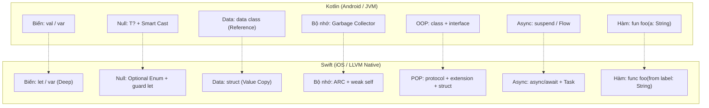
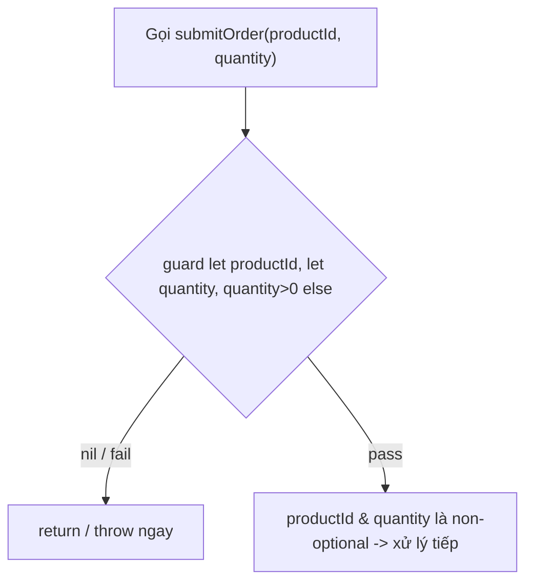
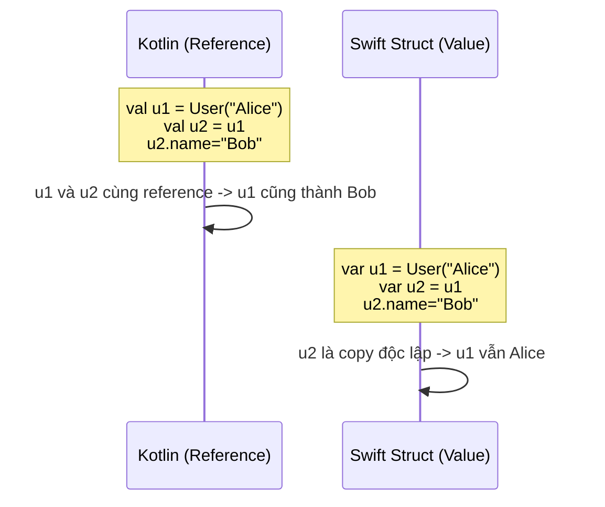
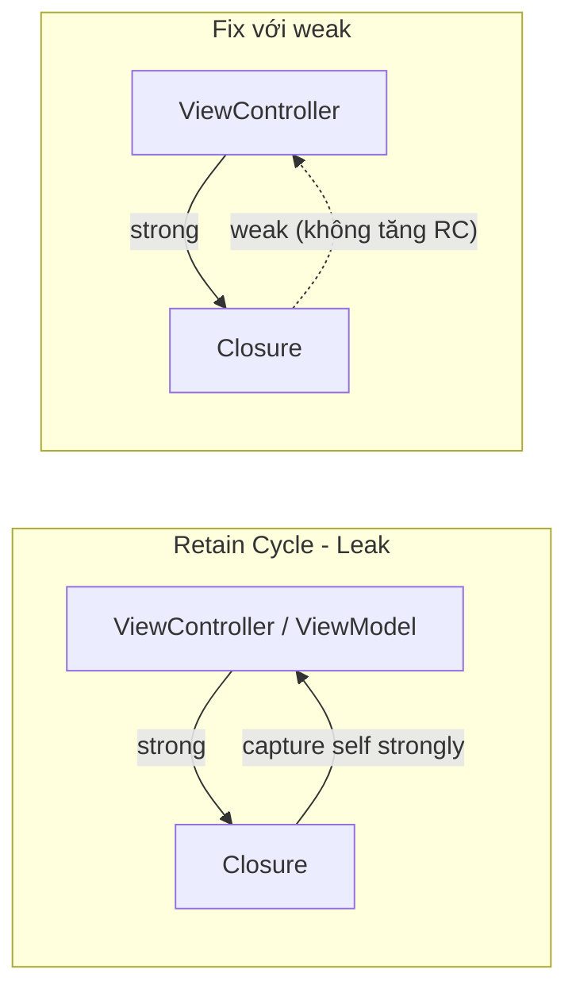
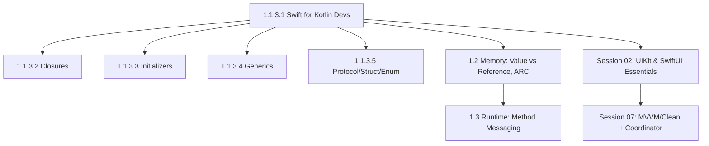

# Swift for Kotlin Developers: Cú pháp & Thực chiến iOS

## Vấn đề cần giải quyết

Bạn đã thành thạo Kotlin: `val`/`var`, Null Safety `T?`, `data class`, `when`, `suspend fun`. Khi mở Xcode và tạo project SwiftUI đầu tiên, Swift cho cảm giác "quen thuộc" nhưng nếu bạn **dịch 1-1 theo thói quen Kotlin, app sẽ crash hoặc leak ngay**:

1. **Bẫy `let` sâu (Deep Immutability):** `val user` trong Kotlin vẫn cho phép `user.name = "..."` nếu `name` là `var`. `let user` với `struct` trong Swift sẽ khóa toàn bộ object.
2. **Bẫy ARC:** Kotlin có Garbage Collector tự cắt vòng tham chiếu. Swift dùng ARC đếm tham chiếu - quên `[weak self]` trong closure async là `ViewModel`/`ViewController` không bao giờ được giải phóng.
3. **Bẫy Optional:** Kotlin có Smart Cast (`if (x != null) x.length`). Swift bắt buộc `guard let`/`if let` tường minh.
4. **Bẫy Argument Labels:** Kotlin gọi `login("a","b")`, Swift bắt buộc `login(username: "a", password: "b")` hoặc báo lỗi compile.
5. **Bẫy Value Type:** `data class` là Reference Type (copy reference). `struct` là Value Type (copy giá trị) - gán `var b = a; b.name = "Bob"` sẽ không ảnh hưởng `a`.

Bài học này trả lời theo đúng tư duy thực chiến: **Nó là gì -> Vì sao tồn tại -> Khi nào dùng -> Code chuẩn Apple như thế nào**, đối chiếu song song Kotlin <-> Swift.

---

## Mental Model: Bản đồ chuyển đổi tư duy



---

## 1. Biến, Hằng, Kiểu & String Interpolation

### 1.1 `val` vs `let` và `var` vs `var`

| | Kotlin `val` | Swift `let` |
|---|---|---|
| **Bản chất** | Read-only reference (object bên trong vẫn mutable) | **Deep immutability** với `struct` |
| `val user = User(var name)` -> `user.name = "New"` | Cho phép | **Không cho phép** nếu `user` là `let` + `struct` |
| Khi nào dùng | Mặc định ưu tiên `val` | Mặc định ưu tiên `let` |

=== "Kotlin"
```kotlin
val appName: String = "Knowledge OS"
var counter: Int = 0
counter += 1
val score = 9.5 // Double - Type Inference
```

=== "Swift"
```swift
let appName: String = "Knowledge OS" // immutable
var counter: Int = 0
counter += 1
let score = 9.5 // Double - Type Inference

// let với struct: khóa toàn bộ
struct User { var name: String }
let user = User(name: "Hazu")
// user.name = "Bob" // ❌ Compile error: Cannot assign to property
var user2 = User(name: "Hazu")
user2.name = "Bob" // ✅ OK vì var
```

### 1.2 Type Annotation & Type Inference

Cả hai ngôn ngữ đều suy luận kiểu, nhưng Swift yêu cầu tường minh hơn khi compiler không suy ra được.

```swift
let name: String = "Hazu" // Annotation
let age = 25              // Inference -> Int
let price: Double = 99.0
var isActive = true       // Bool
// var value // ❌ Error: cần giá trị khởi tạo hoặc kiểu
```

### 1.3 String Interpolation

=== "Kotlin"
```kotlin
val name = "Hazu"
val greeting = "Xin chào $name, năm sau ${age + 1} tuổi"
val raw = """
    Dòng 1
    Dòng 2
""".trimIndent()
```

=== "Swift"
```swift
let name = "Hazu"
let age = 25
let greeting = "Xin chào \(name), năm sau bạn \(age + 1) tuổi" // \(expr)
let multiline = """
    Dòng 1
    Dòng 2
    """
```

---

## 2. Hàm & Argument Labels - Đặc sản Swift

Swift tách **Argument Label** (tên khi gọi) và **Parameter Name** (tên trong thân hàm) để câu lệnh đọc như tiếng Anh tự nhiên. Đây là khác biệt lớn nhất khi bạn chuyển từ Kotlin.

### 2.1 Ba dạng khai báo

=== "Kotlin"
```kotlin
fun sendNotification(userId: String, message: String, isUrgent: Boolean = false) {}
sendNotification("user_123", "Họp 9h")
sendNotification("user_123", "Báo động", isUrgent = true)
```

=== "Swift"
```swift
// 1. Label mặc định = tên parameter
func sendNotification(userId: String, message: String, isUrgent: Bool = false) {
    print("Gửi tới \(userId): \(message)")
}
sendNotification(userId: "user_123", message: "Họp 9h") // BẮT BUỘC có label
sendNotification(userId: "user_123", message: "Báo động", isUrgent: true)

// 2. Label khác parameter - đọc như văn xuôi
func downloadImage(from urlString: String, into imageView: UIImageView) {}
// Gọi: downloadImage(from: "https://...", into: avatarView)

// 3. Ẩn label bằng `_` - giống Kotlin/C
func sum(_ a: Int, _ b: Int) -> Int { a + b }
let total = sum(10, 20) // Không cần label

// 4. Variadic + Default
func log(_ message: String, level: String = "INFO", tags: String...) {
    print("[\(level)] \(message) \(tags)")
}
log("App started")
log("Error", level: "ERROR", tags: "network", "retry")
```

> **Khi nào dùng gì?**
> - Dùng `from`/`into`/`with` khi hàm mô tả hành động tự nhiên (Apple API toàn dùng dạng này: `move(from:to:)`, `insert(_:at:)`).
> - Dùng `_` khi hàm là phép toán/công thức toán học (`sum`, `max`).

### 2.2 `inout` - Sửa biến gốc (Pass-by-reference)

Trong Kotlin/Swift, parameter mặc định là `let`/`val`. Muốn sửa trực tiếp biến truyền vào, Swift dùng `inout` + tiền tố `&` khi gọi.

```swift
func swapNumbers(_ a: inout Int, _ b: inout Int) {
    let temp = a; a = b; b = temp
}
var x = 10, y = 20
swapNumbers(&x, &y) // x: 20, y: 10
```

---

## 3. Tuples, Range & Control Flow

### 3.1 Tuples - Không có trong Kotlin

Tuple là nhóm giá trị nhẹ, không cần tạo `data class` chỉ để return 2 giá trị.

```swift
func fetchUser() -> (name: String, age: Int, isActive: Bool) {
    return ("Hazu", 25, true)
}
let user = fetchUser()
print(user.name) // Hazu
print(user.0)    // Hazu - truy cập bằng index

// Destructuring
let (name, age, _) = fetchUser()
```

### 3.2 Range Operators

| Kotlin | Swift | Ý nghĩa |
|---|---|---|
| `0 until 5` (0..4) | `0..<5` | Half-open |
| `0..5` (0..5) | `0...5` | Closed |
| `for (i in 0 until 5)` | `for i in 0..<5` | Loop |

```swift
for i in 0..<3 { print(i) } // 0,1,2
for i in 0...3 { print(i) } // 0,1,2,3
let range = 1...5
if range.contains(3) { print("Có 3") }
```

### 3.3 Control Flow: `for-in`, `while`, `guard`, `where`

```swift
// for-in với where - lọc ngay trong loop
let scores = [80, 95, 60, 88]
for score in scores where score >= 80 {
    print("Giỏi: \(score)")
}

// while / repeat-while (do-while của Kotlin)
var n = 3
while n > 0 { n -= 1 }
repeat { n += 1 } while n < 3

// guard: Early Exit - chuẩn Apple để làm phẳng Pyramid of Doom
func validate(email: String?, age: Int?) {
    guard let email = email, !email.isEmpty,
          let age = age, age >= 18 else {
        print("Không hợp lệ"); return
    }
    // email, age là non-optional từ đây
    print("\(email) đủ tuổi")
}
```

---

## 4. Properties: Stored, Computed, `lazy`, `willSet/didSet`

Kotlin dùng `get()`/`set()` inline. Swift tách rõ hơn.

```swift
struct ProductCard {
    var name: String
    var price: Double
    var quantity: Int

    // 1. Computed Property - tính toán mỗi khi truy cập
    var totalPrice: Double {
        price * Double(quantity)
    }
    // Với setter
    var discountPrice: Double {
        get { price * 0.9 }
        set { price = newValue / 0.9 } // newValue là keyword
    }

    // 2. lazy - chỉ khởi tạo khi dùng lần đầu (như Kotlin `by lazy`)
    lazy var formatter: NumberFormatter = {
        let f = NumberFormatter()
        f.numberStyle = .currency
        return f
    }()

    // 3. Property Observers - đặc sản UIKit
    var stock: Int = 10 {
        willSet { print("Sắp đổi từ \(stock) sang \(newValue)") }
        didSet {
            if stock == 0 { print("Hết hàng!") }
            if stock < oldValue { print("Đã bán \(oldValue - stock)") }
        }
    }
}

// UIKit thực chiến:
class ProductCell: UITableViewCell {
    var product: ProductCard? {
        didSet {
            guard let p = product else { return }
            textLabel?.text = p.name
            detailTextLabel?.text = "\(p.totalPrice)"
        }
    }
}
```

> **Khi nào dùng?** `didSet` dùng cực nhiều trong UIKit/`UIView` để auto update UI khi model đổi, thay cho `Delegates.observable` của Kotlin.

---

## 5. Initializers, `self` & `deinit`

Swift không có Primary Constructor như Kotlin. Mọi `class`/`struct` đều dùng `init`.

### 5.1 Struct: Memberwise Init miễn phí

```swift
struct Product: Equatable, Identifiable {
    let id: String
    var name: String
    var price: Double
    // Swift tự sinh: init(id:name:price:)
    mutating func applyDiscount(_ percent: Double) {
        price *= (1 - percent/100) // mutating bắt buộc khi sửa struct
    }
}
var p = Product(id: "1", name: "iPhone 15", price: 999)
p.applyDiscount(10) // 899.1
```

### 5.2 Class: `init` + `deinit`

=== "Kotlin"
```kotlin
class User(val name: String, var age: Int) {
    var email: String? = null
    constructor(name: String, age: Int, email: String): this(name, age) {
        this.email = email
    }
}
```

=== "Swift"
```swift
class User {
    let name: String
    var age: Int
    var email: String?

    // Designated Initializer
    init(name: String, age: Int) {
        self.name = name // self = this trong Kotlin
        self.age = age
    }
    // Convenience
    convenience init(name: String, age: Int, email: String) {
        self.init(name: name, age: age)
        self.email = email
    }
    deinit {
        print("\(name) được giải phóng") // Không có trong Kotlin/JVM
    }
}
```

> `deinit` chỉ có ở `class` (ARC), là nơi kiểm chứng leak: nếu không in ra, bạn đang bị retain cycle.

---

## 6. Optionals: Bỏ Smart Cast, Làm chủ `guard let`

`Optional` là `enum` với 2 case `none`/`some`. Không có `null` như Kotlin.

```swift
enum Optional<Wrapped> {
    case none
    case some(Wrapped)
}
```

### 6.1 Đối chiếu Unwrapping

=== "Kotlin"
```kotlin
var email: String? = "dev@example.com"
val length: Int? = email?.length
val nonNull = email ?: "no-email"
if (email != null) println(email.length) // Smart Cast
val forced = email!!.length
```

=== "Swift"
```swift
var email: String? = "dev@example.com"
let length: Int? = email?.count          // Optional Chaining
let nonNull = email ?? "no-email"        // Nil-Coalescing
if let email = email {                   // Optional Binding
    print(email.count) // email là String
}
// Swift 5.7+: if let email { print(email.count) }
let forced = email!.count // ❌ Tránh! Crash nếu nil
```

### 6.2 `guard let` - Early Exit chuẩn Apple



```swift
func submitOrder(productId: String?, quantity: Int?) {
    guard let productId = productId,
          let quantity = quantity, quantity > 0 else {
        print("Dữ liệu không hợp lệ"); return // BẮT BUỘC thoát scope
    }
    print("Đặt \(productId) x\(quantity)")
}

// Unwrap nhiều giá trị + điều kiện
func login(token: String?, user: User?) {
    guard let token = token, !token.isEmpty,
          let user = user else { return }
    // dùng token, user an toàn
}
```

---

## 7. Models: `data class` vs `struct` (Value Type)

Đây là khác biệt kiến trúc lớn nhất.

| Tiêu chí | Kotlin `data class` | Swift `struct` |
|---|---|---|
| Loại | Reference Type (Heap) | **Value Type** (Stack/Copy-on-Write) |
| Gán `val b = a` | Cùng trỏ 1 vùng nhớ | **Copy độc lập** |
| `==` | Tự sinh `equals()` | Cần `: Equatable` |
| Tạo bản sao | `copy(price=...)` | `var b = a; b.price = ...` hoặc `mutating func` |



=== "Kotlin"
```kotlin
data class Product(val id: String, val name: String, var price: Double)
val p1 = Product("1","iPhone",999.0)
val p2 = p1.copy(price=899.0)
```

=== "Swift"
```swift
struct Product: Equatable, Identifiable {
    let id: String; var name: String; var price: Double
    mutating func applyDiscount(_ p: Double) { price *= (1 - p/100) }
}
var p1 = Product(id:"1", name:"iPhone", price:999)
var p2 = p1 // copy
p2.applyDiscount(10)
print(p1.price) // 999 - không ảnh hưởng
print(p2.price) // 899.1
// p1 == p2 cần Equatable
```

> **Quy tắc Apple:** Luôn bắt đầu model bằng `struct`. Chỉ đổi sang `class` khi cần **identity chia sẻ** (ViewModel, Service, Manager, Repository).

---

## 8. Collections: `Array`, `Dictionary`, `Set`

Swift không có `List` vs `MutableList` - `let` = immutable, `var` = mutable.

=== "Kotlin"
```kotlin
val list = listOf("Swift","Kotlin")
val mutable = mutableListOf("Swift","Kotlin")
mutable.add("Dart")
val doubled = numbers.map { it * 2 }
val map = mapOf("Alice" to 25)
```

=== "Swift"
```swift
let list: [String] = ["Swift","Kotlin"] // immutable
var mutable = ["Swift","Kotlin"]
mutable.append("Dart")

let numbers = [1,2,3,4,5]
let doubled = numbers.map { $0 * 2 }      // $0 = it
let evens = numbers.filter { $0 % 2 == 0 }
let sum = numbers.reduce(0) { $0 + $1 }
let validInts = ["1","2","three","4"].compactMap { Int($0) } // [1,2,4] - lọc nil

let userMap: [String:Int] = ["Alice":25, "Bob":30]
if let age = userMap["Alice"] { print(age) } // Dictionary lookup luôn trả Optional
```

---

## 9. Rẽ nhánh & Pattern Matching: `when` vs `switch`

`switch` Swift là **exhaustive**, không cần `break`, hỗ trợ unwrap associated value và `where`.

=== "Kotlin"
```kotlin
sealed class ViewState {
    object Loading: ViewState()
    data class Success(val items: List<String>): ViewState()
    data class Error(val code:Int, val msg:String): ViewState()
}
when(state) {
    is ViewState.Loading -> showLoading()
    is ViewState.Success -> display(state.items)
    is ViewState.Error -> if(state.code==401) login() else error(state.msg)
}
```

=== "Swift"
```swift
enum ViewState {
    case loading
    case success(items: [String])
    case error(code: Int, message: String)
}
func render(state: ViewState) {
    switch state {
    case .loading: showLoading(true)
    case .success(let items): displayList(items)
    case .error(code: 401, _): redirectToLogin() // match pattern cụ thể
    case .error(let code, let msg) where code >= 500: showServerError(msg)
    case .error(_, let message): showError(message)
    }
}
```

---

## 10. Closures & Bẫy ARC `[weak self]`

Closure = Lambda. Khác biệt cốt lõi là **bộ nhớ**.



=== "Kotlin (GC - không lo cycle)"
```kotlin
class UserViewModel: ViewModel() {
    val userName = MutableStateFlow("")
    fun fetchProfile() {
        viewModelScope.launch {
            val user = api.getUser()
            userName.value = user.name
        }
    }
}
```

=== "Swift (ARC - bắt buộc weak)"
```swift
class UserViewModel {
    var onStateChanged: ((String) -> Void)?
    var userName = ""
    func fetchProfile() {
        ApiService.shared.getUser { [weak self] result in
            guard let self = self else { return } // self đã nil -> thoát
            switch result {
            case .success(let user):
                self.userName = user.name
                self.onStateChanged?(self.userName)
            case .failure(let error): print(error)
            }
        }
    }
    deinit { print("ViewModel deinit - không leak!") }
}

// Trailing Closure chuẩn Apple:
func loadData(completion: (Result<User, Error>) -> Void) {}
loadData { result in // trailing closure - không cần ngoặc
    print(result)
}
numbers.map { $0 * 2 } // $0 là shorthand
```

> **Rule:** Bất cứ closure nào `self` giữ closure và closure capture `self` (callback, `URLSession`, `Timer`, `NotificationCenter`) -> luôn `[weak self]`.

---

## 11. Protocol-Oriented Programming & Extensions

`protocol` = `interface` Kotlin, nhưng kết hợp `extension` để có default implementation và mở rộng kiểu có sẵn.

```swift
// 1. Protocol + Default Implementation
protocol BaseViewProtocol: AnyObject {
    func showLoading(); func hideLoading(); func showError(_ message: String)
}
extension BaseViewProtocol {
    func showError(_ message: String) { print("Alert: \(message)") } // default
}
class HomeVC: BaseViewProtocol {
    func showLoading() { /* custom */ }
    func hideLoading() {}
    // showError dùng default
}

// 2. Mở rộng kiểu có sẵn - như extension function Kotlin
extension String {
    var isValidEmail: Bool { contains("@") && contains(".") }
    func trimmed() -> String { trimmingCharacters(in: .whitespaces) }
}
"  hazu@example.com  ".trimmed().isValidEmail // true

// 3. POP với struct
protocol Identifiable { var id: String { get } }
extension Identifiable where Self: Equatable {
    static func == (lhs: Self, rhs: Self) -> Bool { lhs.id == rhs.id }
}
```

---

## 12. Enum, Generics, Access Control & `typealias`

### 12.1 Enum với Associated Values

Mạnh hơn `enum class` Kotlin rất nhiều.

```swift
enum NetworkResult<T> {
    case success(T)
    case failure(code: Int, message: String)
    case loading
}
let result: NetworkResult<[String]> = .success(["a","b"])
```

### 12.2 Generics

Cú pháp gần giống Kotlin, dùng `where` để ràng buộc.

=== "Kotlin"
```kotlin
fun <T> first(items: List<T>): T? = items.firstOrNull()
```

=== "Swift"
```swift
func first<T>(_ items: [T]) -> T? { items.first }
func save<T: Codable>(_ value: T, key: String) where T: Equatable {}

// Generic struct
struct Box<T> { var value: T }
let intBox = Box(value: 10)
```

### 12.3 Access Control & `typealias`

| Swift | Ý nghĩa | Tương đương Kotlin |
|---|---|---|
| `private` | Chỉ trong file + scope | `private` |
| `fileprivate` | Trong file | - |
| `internal` (default) | Trong module (app/target) | `internal` |
| `public` | Ngoài module, không override | `public` |
| `open` | Ngoài module, được override | `open` |

```swift
typealias UserID = String
typealias Completion = (Result<User, Error>) -> Void
func fetchUser(id: UserID, completion: Completion) {}
```

---

## 13. Error Handling: `throws` / `try` / `try?` / `try!`

Kotlin dùng `try/catch` với `Exception`. Swift dùng `Error` protocol + `throws`.

```swift
enum AppError: Error, LocalizedError {
    case network(code: Int)
    case invalidEmail
    var errorDescription: String? {
        switch self {
        case .network(let c): return "Lỗi mạng \(c)"
        case .invalidEmail: return "Email không hợp lệ"
        }
    }
}
func login(email: String) throws -> User {
    guard email.isValidEmail else { throw AppError.invalidEmail }
    // ...
    return User(name: "Hazu", age: 25)
}

// Gọi
do {
    let user = try login(email: "hazu@example.com")
    print(user)
} catch AppError.invalidEmail {
    print("Sai email")
} catch {
    print(error.localizedDescription)
}

// try? -> trả Optional, nuốt lỗi (dùng khi không quan tâm lỗi)
let userOrNil = try? login(email: "bad")

// try! -> crash nếu lỗi (chỉ dùng khi chắc chắn không lỗi, như parse file bundle)
let userForced = try! login(email: "hazu@example.com")
```

> **Thực chiến:** Dùng `do/catch` cho flow chính, `try?` cho decode JSON optional, **tránh `try!`** trong production.

---

## 14. Swift Concurrency: `async/await` vs Coroutines

Từ Swift 5.5, mô hình gần như 1-1 với Kotlin Coroutines.

| Khái niệm | Kotlin | Swift |
|---|---|---|
| Hàm async | `suspend fun fetch(): User` | `func fetch() async throws -> User` |
| Chờ kết quả | `val u = fetch()` trong coroutine | `let u = try await fetch()` |
| Scope | `viewModelScope.launch {}` | `Task {}` |
| Về Main | `withContext(Dispatchers.Main)` | `@MainActor` / `Task { @MainActor in }` |
| Cancellable | `Job.cancel()` | `Task.cancel()` |

=== "Kotlin"
```kotlin
suspend fun loadUserData(userId: String): User = api.getUser(userId)
viewModelScope.launch {
    try { val user = loadUserData("123"); updateUI(user) }
    catch(e: Exception) { showError(e.message) }
}
```

=== "Swift"
```swift
func loadUserData(userId: String) async throws -> User {
    let (data, _) = try await URLSession.shared.data(from: URL(string: "https://api.com/users/\(userId)")!)
    return try JSONDecoder().decode(User.self, from: data)
}
// Gọi trong SwiftUI/UIKit
Task { @MainActor in
    do {
        let user = try await loadUserData(userId: "123")
        updateUI(with: user)
    } catch { showError(error.localizedDescription) }
}

// Trong ViewModel chuẩn Apple:
@MainActor
class ProfileViewModel: ObservableObject {
    @Published var user: User?
    func load() async {
        do { user = try await loadUserData(userId: "123") }
        catch { print(error) }
    }
}
```

---

## 15. Bảng tra cứu nhanh Kotlin -> Swift

| Nhu cầu | Kotlin | Swift |
|---|---|---|
| Hằng số | `val x = 10` | `let x = 10` |
| Biến | `var x = 10` | `var x = 10` |
| Ép kiểu an toàn | `obj as? String` | `obj as? String` |
| Ép kiểu crash | `obj as String` | `obj as! String` |
| Kiểm tra kiểu | `if (obj is String)` | `if obj is String` |
| Default value | `str ?: "default"` | `str ?? "default"` |
| Early return | `val id = id ?: return` | `guard let id = id else { return }` |
| Range | `0 until 5` / `0..5` | `0..<5` / `0...5` |
| Vòng lặp | `for (i in list)` | `for i in list` |
| Khi rỗng | `list.isEmpty()` | `list.isEmpty` |
| In log | `println()` | `print()` |
| Lambda param | `it` | `$0` |
| Constructor | `class User(val name: String)` | `init(name: String) { self.name = name }` |
| Singleton | `object AppManager` | `static let shared = AppManager(); private init() {}` |
| Kiểu bất kỳ | `Any` | `Any` / `AnyObject` (chỉ class) |
| Tuple | `Pair("a",1)` | `("a", 1)` |
| Lazy | `by lazy {}` | `lazy var` |

---

## 16. 7 Bẫy Kotlin Dev hay mắc phải

1. **Quên Argument Label:** `login("a","b")` -> phải `login(username: "a", password: "b")`.
2. **Dùng `class` cho Model:** Luôn bắt đầu bằng `struct`, chỉ dùng `class` cho ViewModel/Service/Manager.
3. **Quên `[weak self]`:** Mọi closure async trong ViewController/ViewModel phải `[weak self]`.
4. **Lạm dụng `!`:** Thay bằng `guard let` / `if let` / `??` để không crash.
5. **Quên `mutating`:** Sửa property trong `struct` phải thêm `mutating func`.
6. **Quên `Equatable`:** Muốn `p1 == p2` với struct phải `: Equatable`.
7. **Dùng `try!` bừa bãi:** Chỉ dùng khi chắc chắn không lỗi (bundle file), còn lại dùng `do/catch` hoặc `try?`.

---

## 17. Tư duy hệ thống (System Thinking)

Topic này nằm ở **Session 01 - Languages** - tầng nền tảng nhất của iOS.



- **Vị trí:** Đây là cửa ngõ - không nắm vững `struct`/`ARC`/`Optional` thì các bài sau (GCD, Memory Leaks, SwiftUI State) sẽ không hiểu sâu.
- **Tương tác:** `struct` + `protocol` (POP) thay thế `class inheritance` trong Clean Architecture iOS; `async/await` thay thế `DispatchQueue` cũ.
- **Mở rộng:** Sau bài này, học tiếp `Closures` để hiểu `[weak self]` sâu hơn, rồi `SwiftUI Essentials (9.1)` để áp dụng `@State`/`@ObservedObject`.

---

## 18. Bài tập thực hành

> Mục tiêu: Tự code kiểm chứng 4 bẫy lớn nhất của Kotlin Dev khi sang Swift. Mỗi bài có `Yêu cầu` -> `Gợi ý` -> `Tiêu chí pass`. Chạy trên Xcode Playground hoặc SwiftUI project mới.

### Bài 1 — `let` Deep Immutability & `mutating` (§1.1, §5)

**Yêu cầu:**
1. Tạo `struct User { var name: String }` và `let user = User(name: "Hazu")`, thử `user.name = "Bob"` — ghi lại lỗi compiler.
2. Sửa thành `var user2` và đổi tên thành công.
3. Viết `mutating func rename(to:)` trong `struct`, gọi từ `var` và `let` để thấy khác biệt.
4. So sánh với `class UserClass` dùng `let instance = UserClass(...)` vẫn đổi được `instance.name`.

**Gợi ý:** `let` với `struct` khóa toàn bộ value (copy), với `class` chỉ khóa reference.

**Tiêu chí pass:**
- Giải thích được vì sao `let struct` báo `Cannot assign to property` còn `let class` thì không.
- `mutating` chỉ compile với `var`.

```swift
// Gợi ý khung
struct User { var name: String; mutating func rename(to newName: String) { name = newName } }
let a = User(name: "Hazu")
// a.rename(to: "Bob") // ❌
var b = User(name: "Hazu")
b.rename(to: "Bob") // ✅
```

### Bài 2 — `guard let` & Optional Chaining (§6)

**Yêu cầu:**
Viết `func login(token: String?, userId: String?, age: Int?)` chỉ in `"Đăng nhập: \(userId)"` khi cả 3 non-nil, `token` non-empty và `age >= 18`. Nếu fail thì `return` sớm. Không dùng `!`, không dùng pyramid `if let`.

**Gợi ý:** Dùng 1 `guard let` duy nhất kết hợp `where`/`,`:
```swift
guard let token = token, !token.isEmpty,
      let userId = userId,
      let age = age, age >= 18 else { return }
```

**Tiêu chí pass:**
- `login(token: nil, userId: "u1", age: 20)` không crash.
- `login(token: "", userId: "u1", age: 20)` return sớm.
- Dùng `??` để cung cấp default khi cần.

### Bài 3 — Retain Cycle & `[weak self]` (§10)

**Yêu cầu:**
1. Tạo `class ProfileViewModel { var onUpdate: ((String)->Void)?; func fetch() }` mô phỏng `ApiService.shared.getUser(completion:)` bằng `DispatchQueue.global().asyncAfter(deadline: .now()+1)`.
2. Trong `fetch`, capture `self` mạnh (không `weak`) để tạo retain cycle: `self` -> `onUpdate` closure -> `self`.
3. Chứng minh leak bằng `deinit { print("deinit") }` không được gọi khi `viewModel = nil`.
4. Fix bằng `[weak self]` + `guard let self else { return }` và xác nhận `deinit` in ra.

**Gợi ý:** Dùng Playground với `weak var` hoặc `ViewController` chứa `viewModel`.

**Tiêu chí pass:**
- Bản lỗi: `deinit` không in.
- Bản fix: `deinit` in ngay sau `viewModel = nil`.
- Giải thích được `ARC` vs Kotlin `GC`.

```swift
// Khung fix
func fetch() {
    ApiService.shared.getUser { [weak self] result in
        guard let self = self else { return }
        self.onUpdate?("done")
    }
}
```

### Bài 4 — Value vs Reference & `Equatable` (§7, §12)

**Yêu cầu:**
1. Tạo `struct Product: Equatable { let id: String; var price: Double }`, tạo `var p1 = Product(id:"1", price:999)`, `var p2 = p1`, đổi `p2.price = 100`, in `p1.price` — phải vẫn `999`.
2. Lặp lại với `class ProductClass`, chứng minh `p1.price` cũng đổi thành `100`.
3. Thêm `mutating func applyDiscount(_ percent: Double)` cho `struct` và thử `let p3 = Product(...)` gọi `applyDiscount` — ghi lại lỗi.
4. Kiểm tra `p1 == p2` cần `: Equatable`, thử xóa conformance để thấy lỗi.

**Tiêu chí pass:**
- Giải thích bằng diagram copy vs reference `swift_for_kotlin_devs.md:442`.
- Nêu quy tắc: Model bắt đầu bằng `struct`, chỉ đổi `class` khi cần identity chia sẻ (ViewModel/Service).

> **Cách tự chấm:** Chạy từng bài trong Xcode Playground, bật Debug Memory Graph để quan sát retain cycle Bài 3. Đáp án tham khảo nằm trong chính các ví dụ §1, §6, §7, §10 của bài học.

---

## Nguồn tham khảo

- [Apple - The Swift Programming Language](https://docs.swift.org/swift-book/)
- [Apple - Swift API Design Guidelines](https://www.swift.org/documentation/api-design-guidelines/)
- [Apple - Automatic Reference Counting](https://docs.swift.org/swift-book/documentation/the-swift-programming-language/automaticreferencecounting/)
- [Apple - Swift Concurrency](https://docs.swift.org/swift-book/documentation/the-swift-programming-language/concurrency/)
- [Kotlin vs Swift Cheatsheet](https://nilhcem.github.io/swift-is-like-kotlin/)
