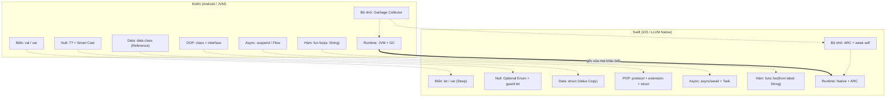
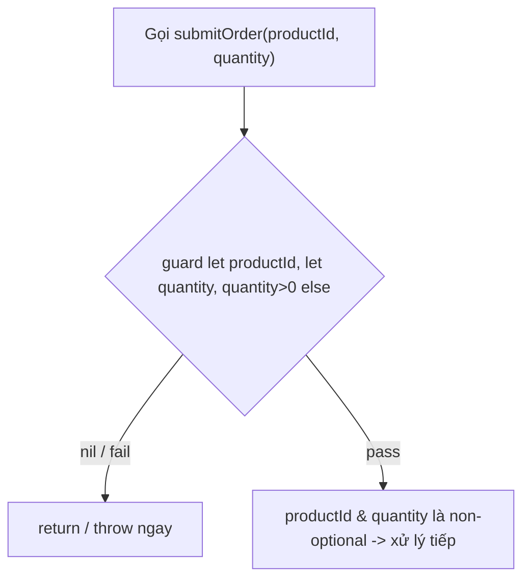
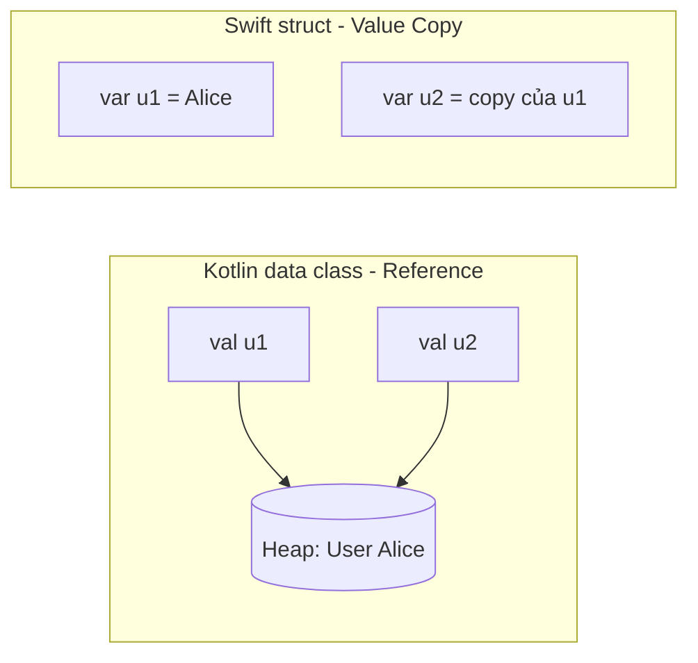
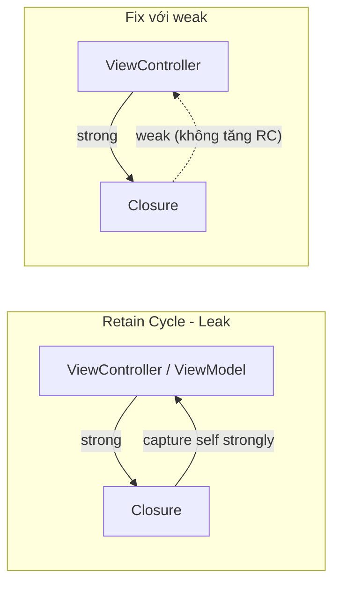
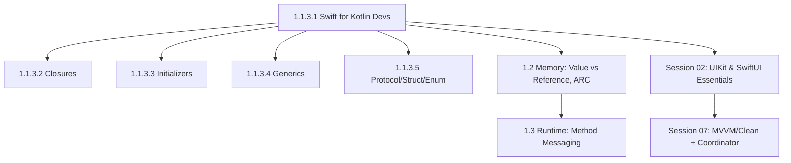

# Swift for Kotlin Developers: Cú pháp & Thực chiến iOS

## Vấn đề cần giải quyết

Bạn đã thành thạo Kotlin: `val`/`var`, Null Safety `T?`, `data class`, `when`, `suspend fun`. Khi mở Xcode và tạo project SwiftUI đầu tiên, Swift cho cảm giác "quen thuộc" - nhưng nếu **dịch 1-1 theo thói quen Kotlin, app sẽ crash hoặc leak ngay**:

1. **Bẫy `let` sâu (Deep Immutability):** `val user` trong Kotlin vẫn cho phép `user.name = "..."` nếu `name` là `var`. `let user` với `struct` trong Swift khóa toàn bộ object. **Gốc rễ:** Kotlin `val` khóa reference vì mọi object nằm trên Heap; Swift `let` + `struct` khóa cả value vì assignment là copy toàn bộ giá trị.
2. **Bẫy ARC:** Kotlin có Garbage Collector tự cắt vòng tham chiếu. Swift dùng ARC đếm tham chiếu - quên `[weak self]` trong closure async là `ViewModel`/`ViewController` không bao giờ được giải phóng. **Gốc rễ:** GC quét đồ thị tham chiếu lúc runtime nên cycle tự hủy; ARC chèn retain/release lúc compile time nên cycle làm refcount không bao giờ về 0.
3. **Bẫy Optional:** Kotlin có Smart Cast (`if (x != null) x.length`). Swift bắt buộc `guard let`/`if let` tường minh. **Gốc rễ:** Kotlin null là trạng thái đặc biệt của con trỏ mà runtime kiểm tra - NPE vẫn còn sót; Swift Optional là một giá trị enum bình thường, compiler ép xử lý case `none` trước khi dùng.
4. **Bẫy Argument Labels:** Kotlin gọi `login("a","b")`, Swift bắt buộc `login(username: "a", password: "b")` hoặc báo lỗi compile. **Gốc rễ:** đây là **quyết định thiết kế API**, không phải hệ quả kỹ thuật của native compile - Swift API Design Guidelines yêu cầu call site phải đọc như câu tiếng Anh (tên hàm + label tạo thành ngữ pháp, §2); Kotlin giải quyết cùng vấn đề đó bằng cách đọc tên hàm dài (`sendNotificationToUser`).
5. **Bẫy Value Type:** `data class` là Reference Type (copy reference). `struct` là Value Type (copy giá trị) - gán `var b = a; b.name = "Bob"` sẽ không ảnh hưởng `a`. **Gốc rễ:** Kotlin mọi object trên Heap nên gán là copy reference; Swift đặt struct làm mặc định nên gán là copy giá trị.

### Vì sao hai ngôn ngữ khác nhau đến vậy?

5 bẫy trên không phải ngẫu nhiên - chúng đều suy ra từ **nơi sinh ra** của hai ngôn ngữ.

- **Kotlin sinh ra trên JVM:** mọi object nằm trên Heap, Garbage Collector quản lý vòng đời, và ngôn ngữ được tối ưu cho interop với Java. Vì runtime luôn đứng sau lưng, Kotlin có thể chọn cách làm "thả": object mặc định là reference, null là con trỏ đặc biệt do runtime kiểm tra, GC tự cắt vòng tham chiếu.
- **Swift sinh ra cho native LLVM:** biên dịch thẳng ra mã máy, **không có GC**. Toàn bộ thiết kế xoay quanh khoảng trống đó: Value Type được đặt làm mặc định (giá trị nằm trên Stack, không cần GC), ARC thay GC cho `class`, và **compiler chịu trách nhiệm an toàn thay vì runtime** - Optional, `let` deep immutability, `guard let` đều là hợp đồng compiler ép bạn ký lúc build.

**Hệ quả:** khác biệt cú pháp chỉ là **bề mặt**; 4/5 bẫy trên (1, 2, 3, 5) có gốc rễ là khác biệt **memory model/runtime** giữa hai nền tảng. Bẫy 4 (Argument Labels) là ngoại lệ - gốc rễ là **quyết định thiết kế API**, sẽ thấy rõ ở §2. Đây là câu chủ đề xuyên suốt bài học này - **mỗi section dưới đây sẽ chỉ ra cơ chế bộ nhớ đứng sau cú pháp.**

Bài học này trả lời theo đúng tư duy thực chiến: **Nó là gì -> Vì sao tồn tại -> Khi nào dùng -> Code chuẩn Apple như thế nào**, đối chiếu song song Kotlin <-> Swift cho từng phần cú pháp nền tảng.

---

## Mental Model: Bản đồ chuyển đổi tư duy



> **Đọc diagram:** mỗi cặp `K → S` cùng hàng là một "bản dịch" trực tiếp khi chuyển đổi tư duy - ví dụ `K2` (Smart Cast) dịch sang `S2` (`guard let`). Dòng dày `K0 → S0` là **nền móng**: JVM + GC đối lập Native + ARC, và mọi khác biệt phía trên đều suy ra từ đó.

---

## 1. Biến, Hằng, Kiểu & String Interpolation

### Cơ chế bên dưới

Vì sao cùng là "hằng số" mà `let` khóa được cả property còn `val` thì không? Câu trả lời nằm ở cơ chế gán (assignment), không phải cú pháp. Trong Swift, gán một `struct` là **copy toàn bộ value** - hai biến là hai ô nhớ độc lập, nên khóa biến cũng là khóa cả giá trị bên trong. Kotlin xử lý điểm này thế nào? Mọi object đều nằm trên Heap và biến chỉ giữ reference, nên `val` chỉ có thể khóa reference - object bên trong vẫn mutable nếu có `var`. Với `class`, Swift cũng chỉ copy con trỏ 8 byte nên `let` quay về hành vi của `val`. Về mặt lưu trữ: `Int` là platform-width (64-bit trên mọi thiết bị iOS hiện đại - `Int` chính là `Int64`), `Bool` chiếm 1 byte trong layout. `String` là struct mã hóa UTF-8; chuỗi ngắn được tối ưu bằng **Small String Optimization** - lưu trực tiếp trong 16 byte của struct, không cấp phát Heap; chuỗi dài mới nằm trên Heap với Copy-on-Write (sẽ quay lại ở §6 và §10). Kotlin đối chiếu: `String` là immutable reference object trên Heap, mọi chuỗi đều truy cập qua một con trỏ.

### 1.1 `val` vs `let` và `var` vs `var`

Câu hỏi đúng không phải "`val` hay `let`?" mà là **khóa của cái gì**. Có hai loại khóa: khóa **binding** (không gán lại được biến) và khóa **value** (không sửa được property bên trong). Bảng 4 trường hợp:

| Khai báo | Khóa **binding**? (gán lại biến) | Khóa **value**? (sửa property) |
|---|---|---|
| Kotlin `val user = User(var name)` (data class - Reference) | ✅ Không gán lại được | ❌ `user.name = "New"` vẫn hợp lệ |
| Kotlin `val user: UserClass` | ✅ | ❌ `val` chỉ khóa reference - giống dòng trên |
| Swift `let user = User(name)` (struct - Value) | ✅ | ✅ **Deep immutability** - khóa cả property |
| Swift `let user: UserClass` | ✅ | ❌ chỉ khóa reference - giống hệt `val` Kotlin |

Quy tắc dùng: mặc định ưu tiên `val` (Kotlin) / `let` (Swift) - chỉ `var` khi thực sự cần mutation.

> **Value Semantics (ngữ nghĩa giá trị)** - khái niệm nền của cả bài: sau phép gán, hai biến là **hai thế giới độc lập** - sửa biến này không bao giờ ảnh hưởng biến kia. Chỉ đúng với Value Type (struct/enum); `class` không có tính chất này. Đây là nền cho §6 (struct vs class) và §10 (collections) - chúng ta sẽ quay lại ở §6.

=== "Kotlin"

```kotlin
val appName: String = "Knowledge OS"
var counter: Int = 0
counter += 1
val score = 9.5 // Double - Type Inference

// val + class: chỉ khóa reference
class UserClass(var name: String)
val u = UserClass("Hazu")
u.name = "Bob" // ✅ OK - object bên trong vẫn mutable
```

=== "Swift"

```swift
let appName: String = "Knowledge OS" // immutable
var counter: Int = 0
counter += 1
let score = 9.5 // Double - Type Inference

// let với struct: khóa toàn bộ value
struct User { var name: String }
let user = User(name: "Hazu")
// user.name = "Bob" // ❌ Compile error: Cannot assign to property
var user2 = User(name: "Hazu")
user2.name = "Bob" // ✅ OK vì var

// let với class: chỉ khóa reference - giống val Kotlin
class UserClass {
    var name: String
    init(name: String) { self.name = name } // class KHÔNG tự sinh memberwise init
}
let userC = UserClass(name: "Hazu")
userC.name = "Bob" // ✅ OK vì class là Reference Type
```

> **Điểm dạy từ ví dụ trên:** `struct User` dùng được `User(name:)` ngay - compiler tự sinh **memberwise init**. `class UserClass` thì không: phải tự viết `init(name:)`. Kotlin dễ gây nhầm vì primary constructor (`class UserClass(var name: String)`) sinh sẵn khởi tạo - Swift chỉ dành ưu đãi đó cho `struct`, một phần để giữ `struct` làm mặc định khi tạo model. Chi tiết init ở §15.

> **Vì sao `let` + `struct` khóa được cả property?** Không phải compiler "đặt luật riêng" - mà vì **gán là copy**: `let user = User(...)` giữ toàn bộ value ngay trong biến, không có ô nhớ nào của object bị tham chiếu ra ngoài để sửa. Muốn đổi property phải ghi đè biến - mà `let` cấm ghi đè. Với `class`, value của biến chỉ là con trỏ nên `let` chỉ khóa được con trỏ. Model mặc định của Swift là `struct` - khóa `let` là khóa cả value, loại bỏ cả một lớp bug mutation mà Kotlin phải tự kỷ luật bằng `val` + immutable properties.

### 1.2 Type Annotation & Type Inference

Cả hai ngôn ngữ đều suy luận kiểu, nhưng Swift yêu cầu tường minh khi compiler không suy ra được (biến chưa khởi tạo, kiểu số nguyên dãy số lớn...).

```swift
let name: String = "Hazu" // Annotation
let age = 25              // Inference -> Int
let price: Double = 99.0  // 99.0 mặc định là Double, muốn Float phải khai báo
var isActive = true       // Bool
// var value // ❌ Error: cần giá trị khởi tạo hoặc kiểu khai báo
```

**Khác biệt inference thật sự mà dev Kotlin cần biết:**

- `9.5` ở Swift **luôn là `Double`** - không có kiểu mặc định `Float`, muốn `Float` phải khai báo tường minh (Kotlin phải viết `9.5f` mới là Float).
- `Int` là platform-width: 64-bit trên mọi thiết bị iOS hiện đại (`Int` chính là `Int64`).
- **Arithmetic overflow: Swift TRAP, Kotlin WRAP.** Kotlin `Int.MAX_VALUE + 1` âm thầm quay vòng (wrap-around); Swift crash runtime - compiler coi kết quả sai còn nguy hiểm hơn crash có kiểm soát. Muốn wrap phải dùng toán tử `&+`, tức là khai báo chủ đích ngay tại dòng code.

=== "Kotlin"

```kotlin
val x = Int.MAX_VALUE + 1 // ✅ Wrap-around im lặng: -9223372036854775808
```

=== "Swift"

```swift
let x = Int.max + 1  // ❌ Runtime crash: "Arithmetic overflow"
let y = Int.max &+ 1 // ✅ Wrap có chủ đích: ra Int.min
```

### 1.3 String Interpolation

Cú pháp khác nhau ngay từ dòng đầu tiên bạn `print`.

=== "Kotlin"

```kotlin
val name = "Hazu"
val age = 25
val greeting = "Xin chào $name, năm sau ${age + 1} tuổi"
val raw = """
    Dòng 1
    Dòng 2
""".trimIndent()
```

=== "Swift"

```swift
let name = "Hazu"
let age = 25
let greeting = "Xin chào \(name), năm sau bạn \(age + 1) tuổi" // \(expr)
let multiline = """
    Dòng 1
    Dòng 2
    """
```

> **Lưu ý thực chiến:** Swift không có `"value: $var"` - luôn phải `\(var)`. Quên dấu `\` là tạo ra chuỗi literal thay vì lỗi compile, bug rất khó phát hiện.

**Bản chất `String` khác nhau ở mức nào?** Swift `String` là **Value Type** (struct): gán là copy - với Copy-on-Write nên vẫn rẻ, chi tiết ở §10; Kotlin `String` là immutable reference object trên Heap: gán chỉ copy con trỏ, hai biến trỏ chung một chuỗi. Về interpolation: `\(expr)` gọi property `description` của giá trị - tương đương gọi `toString()` trong template của Kotlin. Vì vậy type nào conform `CustomStringConvertible` là in đẹp được, như override `toString()` trong Kotlin.

---

## 2. Hàm & Argument Labels - Đặc sản Swift

Swift tách **Argument Label** (tên khi gọi) và **Parameter Name** (tên trong thân hàm) để câu lệnh đọc như tiếng Anh tự nhiên. Đây là khác biệt lớn nhất khiến dev Kotlin "khó chịu" nhất khi chuyển sang.

### Cơ chế bên dưới

Argument label không chỉ là "cách đặt tên đẹp" - nó là **một phần của định danh hàm** trong hệ thống kiểu Swift: `move(from:to:)` và `move(from:)` là hai hàm hoàn toàn khác nhau, có thể overload trên chính label. Toàn bộ việc "ghép label vào call site" được giải quyết lúc compile time, nên gọi hàm không tốn thêm chi phí runtime nào. Kotlin xử lý điểm này thế nào? Kotlin chỉ có **một** thành phần định danh là tên hàm - hai hàm overload được nếu khác kiểu tham số, còn "khác tên tham số" không tạo được overload vì label không tồn tại trong signature. Vì vậy cùng một nhu cầu "call site tự giải thích được", Kotlin phải giải quyết ở tầng naming (kéo dài tên hàm - xem 2.1 bên dưới), còn Swift giải quyết ở tầng type system.

### 2.1 Ba dạng khai báo

=== "Kotlin"

```kotlin
fun sendNotification(userId: String, message: String, isUrgent: Boolean = false) {}
sendNotification("user_123", "Họp 9h")
sendNotification("user_123", "Báo động", isUrgent = true)
```

=== "Swift"

```swift
// 1. Label mặc định = tên parameter
func sendNotification(userId: String, message: String, isUrgent: Bool = false) {
    print("Gửi tới \(userId): \(message)")
}
sendNotification(userId: "user_123", message: "Họp 9h") // BẮT BUỘC có label
sendNotification(userId: "user_123", message: "Báo động", isUrgent: true)

// 2. Label khác parameter - đọc như văn xuôi
func downloadImage(from urlString: String, into imageView: UIImageView) {}
// Gọi: downloadImage(from: "https://...", into: avatarView)

// 3. Ẩn label bằng `_` - giống Kotlin/C
func sum(_ a: Int, _ b: Int) -> Int { a + b }
let total = sum(10, 20) // Không cần label

// 4. Variadic + Default
func log(_ message: String, level: String = "INFO", tags: String...) {
    print("[\(level)] \(message) \(tags)")
}
log("App started")
log("Error", level: "ERROR", tags: "network", "retry")
```

**Vì sao Swift tách label?** [Swift API Design Guidelines](https://www.swift.org/documentation/api-design-guidelines/) đặt nguyên tắc số một: **call site phải đọc như một câu tiếng Anh** - tên hàm + label kết hợp thành ngữ pháp hoàn chỉnh, `move(from:to:)` đọc lên đúng nghĩa "move from ... to ..." mà không cần mở định nghĩa hàm. Kotlin xử lý điểm này thế nào? Cùng một mục tiêu đó, Kotlin giải quyết bằng cách kéo dài **tên hàm** - `sendNotificationToUser(userId, message)` - vì named argument chỉ là công cụ tùy chọn để tăng khả năng đọc, không phải hợp đồng bắt buộc. Swift biến nó thành hợp đồng compile: thiếu label là lỗi, gọi sai label là lỗi - call site không bao giờ "lạc ngữ pháp".

> **Khi nào dùng gì?**
> - Dùng `from`/`into`/`with` khi hàm mô tả hành động tự nhiên (Apple API toàn dùng dạng này: `move(from:to:)`, `insert(_:at:)`).
> - Dùng `_` khi hàm là phép toán/công thức toán học (`sum`, `max`).

### 2.2 `inout` - Sửa biến gốc

Trong cả Kotlin lẫn Swift, parameter mặc định là immutable. Kotlin không có cơ chế này (phải return giá trị mới); Swift dùng `inout` + tiền tố `&` khi gọi.

**Cơ chế copy-in copy-out:** `inout` **không phải** pass-by-reference như con trỏ C. Khi gọi hàm, compiler copy giá trị của biến gốc **vào** parameter (copy-in); khi hàm return, nó copy giá trị cuối cùng **ra** ghi đè lên biến gốc (copy-out). Với một biến cục bộ, kết quả quan sát giống hệt "sửa trực tiếp" - nhưng bản chất là copy. Hệ quả: parameter `inout` **không thể** được capture bởi closure async/@escaping (giá trị gốc có thể đã đổi trước khi copy-out kịp chạy), và dấu `&` chính là tín hiệu compiler bật **kiểm tra exclusivity** - cùng một vùng bộ nhớ không được truy cập đồng thời từ hai nơi: vi phạm ở trường hợp đơn giản (truyền chung một biến: `swap(&x, &x)`) là lỗi ngay lúc compile, trường hợp phức tạp (property của class, subscript, hai thread) compiler chèn **runtime trap**. Kotlin xử lý điểm này thế nào? Kotlin không có cơ chế tương đương - tham số luôn là `val` readonly, mọi "sửa biến gốc" phải qua return giá trị mới hoặc mutation trên class.

```swift
func swapNumbers(_ a: inout Int, _ b: inout Int) {
    let temp = a
    a = b
    b = temp
}
var x = 10, y = 20
swapNumbers(&x, &y) // x: 20, y: 10
// Cơ chế: x, y được copy vào hàm khi gọi (copy-in),
// kết quả cuối được copy ra ghi đè biến gốc khi return (copy-out)
```

> **Khi nào không nên dùng?** `inout` chỉ hợp cho biến cục bộ/Stack. Tránh dùng với property của class vì dễ tạo side effect khó theo dõi - ưu tiên return value như Kotlin.

### 2.3 Function Type là First-Class & Nested Function

Cả hai ngôn ngữ đều coi hàm là **first-class citizen** - gán được vào biến, truyền làm tham số, return từ hàm khác. Kiểu của hàm là function type `(Int, Int) -> Int`, cú pháp hai bên gần như trùng khớp:

=== "Kotlin"

```kotlin
val operation: (Int, Int) -> Int = { a, b -> a + b }
println(operation(3, 4)) // 7
```

=== "Swift"

```swift
let operation: (Int, Int) -> Int = { $0 + $1 }
print(operation(3, 4)) // 7
```

Hàm cũng có thể khai báo **lồng trong hàm khác** và truy cập biến cục bộ của hàm cha - khả năng "capture" này chính là cầu nối sang Closure (§14):

```swift
func processData() {
    var attempts = 0
    func retry() { attempts += 1 } // hàm con truy cập biến cục bộ của hàm cha
    retry()
    print(attempts) // 1
}
```

> **Nền tảng cho §14:** tham số closure mặc định là **non-escaping** - được đảm bảo sống không quá lời gọi hàm, nhờ đó compiler có thể **inline toàn bộ closure** vào call site: abstraction **zero-cost**. Kotlin xử lý điểm này thế nào? Lambda Kotlin mà capture biến cục bộ thì luôn được đóng gói thành object cấp phát trên Heap; Swift giữ non-escaping làm mặc định để phần lớn closure không phải cấp phát gì cả. Khi closure cần sống lâu hơn (lưu vào property, chạy async) mới phải khai báo `@escaping` - và lúc đó câu chuyện bộ nhớ ARC bắt đầu (§14).

---

## 3. Tuples, Range, Control Flow & `defer`

### Cơ chế bên dưới

Tuple và Range trong Swift không phải cú pháp đường - chúng là những **type thật** trong hệ thống kiểu. Tuple là **Product Type** không có identity: nó không có tên type, nên hai tuple cùng cấu trúc là cùng một kiểu bất kể khai báo ở đâu (**structural typing**), và vì không có tên nên nó không thể conform `Codable`/`Equatable` qua conformance. Kotlin xử lý điểm này thế nào? Kotlin không có tuple built-in - dev dùng `Pair<A, B>`/`Triple`, tức là class có tên type thật, đổi lại bị đóng khung cứng số lượng trường. Range cũng là type thật: `0..<5` tạo `Range<Int>`, `0...5` tạo `ClosedRange<Int>` - hai kiểu khác nhau, mỗi kiểu có method riêng, không phải toán tử "đường" chỉ phục vụ vòng lặp.

### 3.1 Tuples - Không có trong Kotlin

Tuple là nhóm giá trị nhẹ, không cần tạo `data class` chỉ để return 2 giá trị.

```swift
func fetchUser() -> (name: String, age: Int, isActive: Bool) {
    return ("Hazu", 25, true)
}
let user = fetchUser()
print(user.name) // Hazu - truy cập bằng label
print(user.0)    // Hazu - truy cập bằng index

// Destructuring
let (name, age, _) = fetchUser()
```

> **Giới hạn:** Tuple không conform `Codable`, không có method, không dùng làm API public phức tạp. Return quá 3 giá trị nên dùng `struct` - không chỉ vì khó đọc: **tuple không có tên type** (structural typing), nên API trả tuple rất khó tái sử dụng - không thể thêm extension, không thể conform thêm protocol, không thể gọi tên trong tài liệu. Kotlin đối chiếu: `Pair<A, B>`/`Triple` là class có tên type thật, nhưng bị đóng khung cứng số lượng trường.

### 3.2 Range Operators

| Kotlin | Swift | Ý nghĩa |
|---|---|---|
| `0 until 5` (0..4) | `0..<5` | Half-open |
| `0..5` (0..5) | `0...5` | Closed |
| `for (i in 0 until 5)` | `for i in 0..<5` | Loop |

```swift
for i in 0..<3 { print(i) } // 0,1,2
for i in 0...3 { print(i) } // 0,1,2,3
let range = 1...5
if range.contains(3) { print("Có 3") }
```

**Vì sao half-open là mặc định?** `0..<arr.count` đếm đúng số phần tử và **không bao giờ truy cập `upperBound`**, nên dùng làm index của Array (0-based) luôn an toàn - trong khi `0...arr.count` vượt quá index cuối cùng. Half-open còn biểu thị được range rỗng (`5..<5`) - điều closed range không làm được. Toán tử `~=` được định nghĩa trên Range nên range dùng được trong case pattern (gặp ở §12). Kotlin xử lý điểm này thế nào? Kotlin cũng có `IntRange` là type thật và tách `..` với `until`, nhưng Swift đi xa hơn khi chọn half-open làm **mặc định** trong hầu hết API (`indices`, `prefix`, `dropLast`...).

### 3.3 Control Flow: `for-in`, `while`, `guard`, `where`

```swift
// for-in với where - lọc ngay trong loop
let scores = [80, 95, 60, 88]
for score in scores where score >= 80 {
    print("Giỏi: \(score)")
}

// while / repeat-while (do-while của Kotlin)
var n = 3
while n > 0 { n -= 1 }
repeat { n += 1 } while n < 3

// guard: Early Exit - chuẩn Apple để làm phẳng Pyramid of Doom
func validate(email: String?, age: Int?) {
    guard let email = email, !email.isEmpty,
          let age = age, age >= 18 else {
        print("Không hợp lệ")
        return
    }
    // email, age là non-optional từ đây
    print("\(email) đủ tuổi")
}
```

**`guard` là hợp đồng scope, không chỉ là style "đẹp hơn":** cú pháp ép block `else` **phải** thoát scope (`return`, `throw`, `continue`, `break`) - thiếu một trong các lệnh đó là lỗi compile. Chính nhờ hợp đồng này, compiler **biết chắc** rằng đoạn code bên dưới `guard` chỉ chạy khi mọi điều kiện đã pass, nên các biến được unwrap sẵn sàng dùng luôn mà không tạo scope mới. Ngược lại `if let` chỉ unwrap biến **trong block** của nó - mọi logic xử lý phải thụt vào trong, dồn thành pyramid. Kotlin xử lý điểm này thế nào? Kotlin có `val email = email ?: return` (Elvis + return sớm) đạt hiệu quả tương tự cho từng biến, nhưng không gộp được nhiều unwrap + điều kiện phụ trong một câu như `guard let a = a, !a.isEmpty, ...`. Vì vậy "guard làm phẳng code" không phải cảm tính thẩm mỹ - nó là hệ quả trực tiếp của hợp đồng exit-scope mà compiler kiểm tra.

### 3.4 `defer` - Dọn dẹp khi thoát scope

Kotlin dùng `try/finally` để đảm bảo dọn dẹp. Swift dùng `defer`: khối code chạy **khi thoát scope**, bất kể return sớm hay throw, và khai báo **ngay sau khi acquire resource**.

=== "Kotlin"

```kotlin
fun process() {
    val file = openFile()
    try {
        parse(file)
    } finally {
        file.close() // dọn dẹp ở cuối, xa nơi mở file
    }
}
```

=== "Swift"

```swift
func process() throws {
    let file = openFile()
    defer { file.close() } // chạy khi thoát scope, kể cả throw
    try parse(file)        // nhiều defer chạy ngược thứ tự khai báo
}
```

**Cơ chế:** mỗi `defer` push khối lệnh vào một stack của scope hiện tại; khi scope thoát - bất kể bằng `return`, `break` hay `throw` - các khối được pop và chạy **ngược thứ tự khai báo (LIFO)**. Thứ tự ngược là chủ đích: resource mở sau phải được đóng trước, đúng thứ tự lồng nhau tự nhiên. Compiler cấm `return`, `break`, `continue`, `throw` bên trong `defer` - defer vốn đã là đường thoát, không được thay đổi luồng thêm lần nữa. Kotlin xử lý điểm này thế nào? `try/finally` gắn với block `try` chứ không gắn với scope: bạn phải nhớ bao trọn đoạn code có đường thoát vào `try`, còn `defer` bảo vệ **mọi đường thoát của scope** kể từ dòng nó xuất hiện.

```swift
// defer chạy LIFO - như stack dọn dẹp:
func demo() {
    defer { print("1") }
    defer { print("2") }
    print("3")
} // in: 3, 2, 1
```

| Tiêu chí | Kotlin `try/finally` | Swift `defer` |
|---|---|---|
| Vị trí khai báo | Ở cuối block - xa nơi acquire resource | Ngay cạnh nơi acquire |
| Đường thoát được bảo vệ | Chỉ các đường thoát nằm trong block `try` | Mọi đường thoát của scope (return sớm, throw) |
| Nguy cơ quên | Cao - thêm đường return mới sau này dễ quên cập nhật `finally` | Thấp - viết ngay lúc acquire |
| Nhiều resource | Nhiều tầng `try` lồng nhau | Nhiều `defer` tuần tự, tự sắp LIFO |

> **Khi nào dùng?** Mọi cặp acquire/release (mở file, lock/unlock, begin/end animation) nên viết `defer` ngay cạnh nhau để không quên đường thoát.

---

## 4. Properties: Stored, Computed, `lazy`, `willSet/didSet`

Kotlin dùng `get()`/`set()` inline và `Delegates.observable`. Swift phân loại property theo **cơ chế lưu trữ** và có Property Observers - đặc sản UIKit.

### Cơ chế bên dưới

Property trong Swift được phân loại theo **cách có giá trị**, không phải theo cú pháp. **Stored property** có ô nhớ riêng và chiếm một **offset cố định trong layout** của instance - compiler xếp field theo thứ tự khai báo, tương tự cách JVM xếp field trong object. **Computed property** không có ô nhớ nào: compiler biên dịch nó thành cặp method get/set, gọi mỗi lần truy cập và **không cache** - vì vậy computed property đắt mà bị đọc trong vòng lặp nóng sẽ tính lại từng lần; khi đó hãy cache kết quả vào một stored property. **Type property (`static`)** có đúng một ô nhớ thuộc về type chứ không thuộc instance. Kotlin xử lý điểm này thế nào? Tương tự ở tầng accessor - `val name` có backing field, `val total get() = ...` cũng tính mỗi lần đọc - nhưng Swift đặt ranh giới bộ nhớ rõ ràng hơn, và chính ranh giới đó giải thích mọi quy tắc bên dưới: `lazy` bắt buộc `var` vì giá trị chuyển từ placeholder sang giá trị thật (cần ô nhớ để ghi), còn observers gắn với stored property vì cần ô nhớ để gán vào.

### 4.1 Ba loại property

| Loại | Ví dụ | Có ô nhớ? | Kotlin đối chiếu |
|---|---|---|---|
| Stored | `var price: Double` | ✅ offset cố định trong layout | `val/var` thường |
| Computed | `var totalPrice: Double { ... }` | ❌ tính lại mỗi lần truy cập | `val total get() = ...` |
| Type property | `static let shared = ...` | ✅ 1 ô nhớ cho cả type | `companion object` |

```swift
struct ProductCard {
    var name: String
    var price: Double
    var quantity: Int

    // 1. Computed Property - tính toán mỗi khi truy cập, KHÔNG cache
    var totalPrice: Double {
        price * Double(quantity)
    }
    // Computed với setter
    var discountPrice: Double {
        get { price * 0.9 }
        set { price = newValue / 0.9 } // newValue là keyword ẩn do compiler cung cấp
    }

    // 2. lazy - chỉ khởi tạo khi dùng lần đầu (như Kotlin `by lazy`)
    lazy var formatter: NumberFormatter = {
        let f = NumberFormatter()
        f.numberStyle = .currency
        return f
    }()

    // 3. Property Observers - đặc sản UIKit
    var stock: Int = 10 {
        willSet { print("Sắp đổi từ \(stock) sang \(newValue)") }
        didSet {
            if stock == 0 { print("Hết hàng!") }
            if stock < oldValue { print("Đã bán \(oldValue - stock)") }
        }
    }
}

var card = ProductCard(name: "iPhone", price: 999, quantity: 2)
card.stock = 0 // in 2 dòng: willSet rồi didSet ("Hết hàng!")
card.stock = 0 // observers VẪN chạy - dù giá trị mới == giá trị cũ
```

> **Khi nào dùng?**
> - Computed property khi giá trị suy ra từ stored property (không tốn bộ nhớ); nếu phép tính đắt và bị đọc lặp nhiều lần, cache vào stored property thay vì để tính lại.
> - `lazy` cho object khởi tạo đắt (formatter, pipeline) - như `by lazy` của Kotlin.
> - `didSet` cực nhiều trong UIKit để auto update UI khi model đổi, thay cho `Delegates.observable` của Kotlin. Trong SwiftUI, vai trò này thuộc về `@State`/`@Published`.

### 4.2 `lazy var` vs `by lazy` - bẫy thread-safe

Hai ngôn ngữ giống nhau về mục đích nhưng **khác nhau hoàn toàn ở thread-safety** - đây là bẫy thật khi chuyển đổi:

- Kotlin `by lazy` **mặc định là `SYNCHRONIZED`**: dùng khóa nội bộ, thread đầu tiên chạy initializer, các thread khác chờ và nhận cùng kết quả.
- Swift `lazy` **KHÔNG thread-safe**: truy cập từ nhiều thread lần đầu có thể chạy initializer 2 lần - hai thread nhận 2 instance khác nhau, bug rất khó tái hiện.
- `lazy` bắt buộc `var`, không dùng được với `let`: về cơ chế, stored property bắt đầu là một placeholder rỗng và được ghi giá trị thật vào ô nhớ ở lần truy cập đầu - ghi là mutation, mà `let` cấm mutation.

=== "Kotlin"

```kotlin
// ✅ Mặc định SYNCHRONIZED - thread-safe
val parser: Parser by lazy { Parser() }

// Muốn bỏ khóa: by lazy(LazyThreadSafetyMode.NONE) { Parser() }
```

=== "Swift"

```swift
final class Parser { let name = "heavy" }

final class Document {
    // ❌ KHÔNG thread-safe: 2 thread truy cập lần đầu
    // có thể chạy closure đồng thời 2 lần -> 2 instance khác nhau
    lazy var parser = Parser()

    // ✅ Lazy + thread-safe: runtime đảm bảo chạy đúng 1 lần
    // (kế thừa cơ chế dispatch_once cũ - chi tiết ở §7)
    static let sharedParser = Parser()
}
```

> **Quy tắc thực chiến:** `lazy var` của instance chỉ dùng khi truy cập từ 1 thread (thuộc tính của ViewController). Cần lazy mà dùng đa thread → `static let` (nếu phù hợp thuộc về type) hoặc inject qua init.

### 4.3 Property Observers: `willSet` / `didSet`

Observers chạy code mỗi khi stored property **được gán**. Hai quy tắc mà dev Kotlin thường bất ngờ:

1. **KHÔNG chạy trong `init`** (kể cả gán giá trị mặc định lúc khai báo): lúc khởi tạo, property chưa tính là "đang được quan sát" - observers chỉ bắt đầu sống từ lần gán sau đó (từ ngoài hoặc sau init).
2. **Chạy cả khi gán giá trị bằng nhau**: `stock = 10` khi `stock` đã là 10 vẫn kích hoạt willSet/didSet - observer quan sát **phép gán**, không quan sát sự thay đổi giá trị.

`newValue` và `oldValue` là **keyword ẩn** do compiler cung cấp bên trong closure observer - không cần (và không được) khai báo.

**Cơ chế:** observers là **syntactic sugar cho setter**. Compiler biến stored property có observer thành một setter hoàn chỉnh: chạy khối `willSet`, ghi giá trị mới vào ô nhớ, rồi chạy khối `didSet`. Vì vậy observer không tốn thêm ô nhớ nào và chỉ tồn tại ở tầng cú pháp; computed property thì tự kiểm soát luồng ghi qua `set` của riêng nó. Kotlin xử lý điểm này thế nào? Kotlin đạt cùng hiệu quả bằng `Delegates.observable` - một delegate object bọc quanh property, tốn thêm một cấp chuyển hướng lúc runtime; Swift nhúng observer thẳng vào setter nên callsite nhìn như gán property thường.

```swift
// import UIKit - pattern didSet phổ biến nhất trong UITableViewCell:
// model đổi -> UI tự đồng bộ, không cần gọi reload thủ công
class ProductCell: UITableViewCell {
    var product: ProductCard? {
        didSet {
            guard let p = product else { return }
            textLabel?.text = p.name
            detailTextLabel?.text = "\(p.totalPrice)"
        }
    }
}
```

### 4.4 `static let` - lazy + thread-safe tự động

Khác `lazy var` của instance, `static let` được **runtime đảm bảo**: khởi tạo đúng một lần ở lần truy cập đầu tiên (lazy) và an toàn đa thread - kế thừa cơ chế `dispatch_once` cũ, không cần double-checked locking. Đây là nền của Singleton chuẩn Apple, chi tiết ở §7. Lưu ý: đảm bảo one-shot là việc của runtime với `static let`; còn mutation sau đó qua `static var` thì bản thân nó không thread-safe.

---

## 5. Optionals: Optional là Enum, Không phải `null`

`Optional` trong Swift là `enum` với 2 case `none`/`some` - không có `null` như Kotlin.

### Cơ chế bên dưới

Vì Optional là enum 2 case nên về mặt mô hình nó là một **Sum Type (tagged union)**: một giá trị kiểu `String?` hoặc là `none` hoặc là `some(String)` - không có trạng thái thứ ba. Về **memory layout**, Optional bọc giá trị trực tiếp trong **payload** kèm một tag phân biệt case - **không boxing, không cấp phát Heap**: compiler tận dụng **spare bits** (các bit thừa trong payload) làm tag khi có thể, nên với nhiều kiểu nhỏ Optional **không tốn thêm byte nào** so với `Wrapped` - ví dụ `Optional<String>` có kích thước y hệt `String` vì con trỏ reference luôn còn bit dư để gắn tag; chỉ khi payload dùng hết mọi bit (như `Int`, `Double`) compiler mới thêm một tag byte riêng. Vì vậy nói chung "Optional đắt hơn 1 byte" là khẳng định thiếu chính xác - chi phí nằm giữa 0 và 1 byte tùy kiểu. Kotlin xử lý điểm này thế nào? `String?` của Kotlin là một reference có thể nil - null nằm ở tầng con trỏ và do runtime kiểm tra; Swift Optional là một giá trị enum bình thường nằm ngay trong biến, nên mọi công cụ của enum (switch, map, flatMap) dùng được trên nó và compiler ép xử lý case `none` trước khi dùng - lớp bug NPE được đẩy từ runtime về compile time.

### 5.1 Optional = Sum Type - khác `null` ở mức mô hình

```swift
enum Optional<Wrapped> {
    case none
    case some(Wrapped)
}
```

Hai hệ quả trực tiếp của việc Optional là enum:

- **Optional là giá trị bình thường**: map được, switch được, return từ hàm được - `email.map { $0.count }` biến `String?` thành `Int?` mà không cần unwrap tay. Với `null` của Kotlin, các phép biến đổi này phải qua scope function (`?.let { }`).
- **Compiler ép xử lý case `none`**: truy cập giá trị bên trong bắt buộc qua một trong các công cụ unwrap bên dưới - không còn đường nào "quên check" mà vẫn compile được.

### 5.2 Sáu công cụ unwrap - chọn đúng cho từng tình huống

| # | Tool | Cú pháp | Kết quả | Khi nào dùng |
|---|---|---|---|---|
| 1 | Optional Binding | `if let email = email { }` | non-optional trong block | Kiểm tra đơn giản, xử lý trong scope nhỏ |
| 2 | `guard let` | `guard let email = email else { return }` | non-optional cho mọi code bên dưới | Chuẩn Apple cho hàm - early exit (§3.3) |
| 3 | Nil-Coalescing | `email ?? "default"` | Giá trị fallback | Có mặc định hợp lệ |
| 4 | Optional Chaining | `user?.address?.city` | Optional của kết quả cuối | Đi xuống chuỗi property, chấp nhận nil lặng lẽ |
| 5 | Force Unwrap | `email!` | non-optional hoặc crash | Hạn chế tối đa - chỉ khi invariant đảm bảo non-nil (test, fixture) |
| 6 | `map` / `flatMap` | `email.map { $0.count }` | Optional mới | Transform giá trị bên trong theo kiểu functional |

=== "Kotlin"

```kotlin
var email: String? = "dev@example.com"
val length: Int? = email?.length
val nonNull = email ?: "no-email"
if (email != null) println(email.length) // Smart Cast
val forced = email!!.length
```

=== "Swift"

```swift
var email: String? = "dev@example.com"
let length: Int? = email?.count          // 4. Optional Chaining
let nonNull = email ?? "no-email"        // 3. Nil-Coalescing
if let email = email {                   // 1. Optional Binding
    print(email.count) // email là String
}
// Swift 5.7+: if let email { print(email.count) }
let forced = email!.count                // 5. Force - ❌ Tránh! Crash nếu nil
let digitCount = email.map { $0.count }  // 6. map -> Int?
```

### 5.3 `guard let` - Early Exit chuẩn Apple



```swift
func submitOrder(productId: String?, quantity: Int?) {
    guard let productId = productId,
          let quantity = quantity, quantity > 0 else {
        print("Dữ liệu không hợp lệ")
        return // BẮT BUỘC thoát scope
    }
    print("Đặt \(productId) x\(quantity)")
}

// Unwrap nhiều giá trị + điều kiện
func login(token: String?, user: User?) {
    guard let token = token, !token.isEmpty,
          let user = user else { return }
    // dùng token, user an toàn
}
```

### 5.4 Nested Optional `Int??` - bẫy kinh điển

Các công cụ trên dễ lồng Optional vào Optional (`Int??` = `Optional<Optional<Int>>`). Lưu ý: subscript của Dictionary **đã phẳng sẵn** - `["key": 1]["key"]` trả `Int?`, không bao giờ `Int??`. Lớp lồng xuất hiện khi một phép biến đổi lại trả thêm một Optional nữa, kinh điển nhất là `map` trên Optional:

```swift
// Nested Optional - Optional bọc Optional
let d: [String: Int]? = ["a": 1]   // dict có thể nil (từ cache/API)
let v = d.map { $0["a"] }          // Int?? - Optional(Optional(1))
let flat = d.flatMap { $0["a"] }   // Int?   - flatMap "phẳng" bớt 1 lớp
```

`v` có 3 trạng thái chứ không phải 2 - switch với pattern lồng nhau cho thấy rõ:

```swift
switch v {
case .some(.some(let value)): print("Có dict, có key: \(value)")
case .some(.none):            print("Có dict nhưng thiếu key")
case .none:                   print("Dict là nil")
}
```

Cách phẳng thực chiến: dùng `flatMap` (tool 6 ở bảng trên) hoặc unwrap từng lớp bằng `guard let`:

```swift
func readValue(_ d: [String: Int]?) -> Int? {
    guard let dict = d, let value = dict["a"] else { return nil }
    return value
}
```

### 5.5 Vì sao Swift không có Smart Cast như Kotlin

Lý do là an toàn đa luồng, không phải cú pháp. Property của class nằm trên Heap: giữa **lúc check** và **lúc dùng**, một thread khác có thể set property về nil - nếu compiler tự ngầm promotion theo phép so sánh, phép check đó sẽ trở thành lời nói dối. Vì vậy Swift chỉ promotion khi **chứng minh được giá trị bất biến**: biến **`let` cục bộ**, và trong phạm vi hạn chế, property `let` truy cập trong cùng file (extension cùng file vẫn được tính - compiler nhìn thấy mọi code có khả năng mutation của file đó); `var` property thì không bao giờ. Từ **Swift 5.7**, cú pháp `if let email { }` rút gọn binding cho biến cùng tên - vẫn là binding tường minh, không phải promotion ngầm sau phép so sánh. Kotlin xử lý điểm này thế nào? Cùng giới hạn: smart cast chỉ áp dụng với `val`/immutable local; `var` property của class không smart cast được - compiler Kotlin cũng lo thread khác đổi giá trị giữa chừng, dev phải copy vào local trước. Khác biệt còn lại: Kotlin promotion sau `!= null`, Swift đòi binding `if let` - hợp đồng rõ ràng hơn nhưng phải gõ thêm một dòng.

### 5.6 IUO - Implicitly Unwrapped Optional (`T!`)

IUO là Optional mà compiler **tự động force unwrap** mỗi lần truy cập, khai báo bằng `T!`. Gặp nhiều nhất ở: IBOutlet nối XIB/Storyboard (lifecycle của nib đảm bảo non-nil trước khi dùng) và bridge từ API ObjC cũ chưa chú thích nullability.

```swift
// import UIKit - IUO kinh điển trong ViewController:
class LoginViewController: UIViewController {
    @IBOutlet weak var titleLabel: UILabel! // nib connect đảm bảo non-nil khi dùng
}
```

Vì sao nguy hiểm: mất toàn bộ bảo vệ của Optional - truy cập khi outlet chưa connect là **crash runtime** không có cảnh báo trước, và signature `T!` che mất khả năng nil khỏi người đọc API. **Quy tắc:** chỉ dùng `T!` khi lifecycle đảm bảo non-nil tại mọi thời điểm truy cập; code mới ưu tiên `T?` + `guard let`, hoặc non-optional được gán trong init.

### 5.7 `init?` vs `throws` init - chọn dạng thất bại

Thay vì Kotlin trả `null` từ factory function, Swift cho phép **initializer trả `nil`** - hợp nhất "khởi tạo" và "validate" thành một bước.

```swift
struct User {
    let name: String
    let age: Int

    init?(dict: [String: Any]) {
        guard let name = dict["name"] as? String,
              let age = dict["age"] as? Int, age >= 0 else {
            return nil // dữ liệu không hợp lệ -> init thất bại
        }
        self.name = name
        self.age = age
    }
}
let u1 = User(dict: ["name": "Hazu", "age": 25]) // Optional<User>
let u2 = User(dict: ["name": "Bob"])             // nil

// Đi kèm: init! (không khuyến nghị) và throwing init - xem §15
```

| Tiêu chí | `init?` (Failable) | `throws` init |
|---|---|---|
| Thông tin lỗi | Binary: nil / không nil | Đầy đủ: Error cụ thể kèm ngữ cảnh |
| Call site | `if let` / `guard let` / `??` | `try` + `do/catch` (§13) |
| Khi nào dùng | Đầu vào đơn giản, nil tự giải thích (parse dict, lookup ID) | Lỗi cần phân nhánh xử lý / hiển thị cho người dùng |
| Ví dụ chuẩn | `User(dict:)`, `Int("42")` | `init(from: Decoder) throws` trong Codable (§9) |

> **Quy tắc:** Dùng `init?` khi dữ liệu đầu vào không đáng tin và nil tự giải thích được. Chuyển sang `throws` ngay khi cần báo lý do lỗi cụ thể.

---

## 6. Models: `data class` vs `struct` (Value Type)

Đây là khác biệt kiến trúc lớn nhất giữa hai ngôn ngữ.

| Tiêu chí | Kotlin `data class` | Swift `struct` |
|---|---|---|
| Loại | Reference Type (Heap) | **Value Type** (Stack/Copy-on-Write) |
| Gán `val b = a` | Cùng trỏ 1 vùng nhớ | **Copy độc lập** |
| Copy mỗi lần gán có đắt không? | Rẻ - chỉ copy reference | Struct nhỏ rẻ (memcpy); collection lớn có COW |
| `==` | Tự sinh `equals()` | Cần `: Equatable` (compiler tự sinh) |
| `hashCode` | Tự sinh `hashCode()` | Cần `: Hashable` (compiler tự sinh) |
| Tạo bản sao | `copy(price=...)` | `var b = a; b.price = ...` hoặc `mutating func` |



### Cơ chế bên dưới

**Struct nhỏ nằm trên Stack (inline), class luôn nằm trên Heap.** Struct nhỏ có các field nằm trực tiếp trong ô nhớ của biến, nên gán `var b = a` là **memcpy** - copy từng byte, chi phí tỉ lệ với tổng kích thước field, struct nhỏ thì gần như miễn phí. `class` có layout trên Heap gồm **isa pointer + refcount + các field**, còn biến chỉ giữ một con trỏ 8 byte - gán là copy con trỏ, hai biến từ đó trỏ chung một instance. Collection (`Array`/`Dictionary`/`String`) là struct nhưng dữ liệu lớn nằm trên Heap kèm cơ chế **Copy-on-Write (COW)**: phép gán chỉ copy phần struct "đầu" và hai biến tạm thời chia sẻ buffer phía sau; **chỉ khi có ai đó viết** (mutate) một trong hai biến, buffer mới được copy thật - vì vậy gán mảng một triệu phần tử vẫn gần như miễn phí. Chi tiết COW ở §10 và Topic [1.2.2 Value and Reference Type](../../memory_management/value_reference_type.md). Kotlin xử lý điểm này thế nào? Mọi object đều nằm trên Heap nên gán luôn là copy reference - không bao giờ có "copy giá trị" tự động, muốn copy phải gọi tường minh `copy()` của data class.

```swift
// COW minh họa
var a = Array(repeating: 0, count: 1_000_000)
var b = a        // rẻ: chưa copy (chỉ tăng ref count nội bộ)
b[0] = 1         // LÚC NÀY mới copy thật - a không đổi
```

**Witness table vs vtable** - cơ chế dispatch cũng khác nhau giữa struct và class. Struct conform protocol dùng **witness table**: compiler sinh một bảng tĩnh chứa con trỏ tới đúng implementation của type đó, lời gọi được phân giải tĩnh và có thể **specialization/inline** vì compiler biết chính xác type tại compile time. `class` dispatch method qua **vtable** trỏ từ isa pointer - mỗi class một bảng method, lời gọi đi qua một bước gián tiếp và không specialization tự do được vì subclass có thể override. Đây là lý do kiến trúc POP (protocol + struct) thường nhanh hơn inheritance - sẽ quay lại ở §12 và Topic 1.1.3.5.

=== "Kotlin"

```kotlin
data class Product(val id: String, val name: String, var price: Double)
val p1 = Product("1", "iPhone", 999.0)
val p2 = p1.copy(price = 899.0)
// p1 == p2 so sánh value - có sẵn
```

=== "Swift"

```swift
struct Product: Equatable, Hashable, Identifiable {
    let id: String
    var name: String
    var price: Double
    mutating func applyDiscount(_ percent: Double) {
        price *= (1 - percent / 100) // mutating bắt buộc khi sửa struct
    }
}
var p1 = Product(id: "1", name: "iPhone", price: 999)
var p2 = p1 // copy
p2.applyDiscount(10)
print(p1.price) // 999 - không ảnh hưởng
print(p2.price) // 899.1

// Equatable & Hashable: compiler tự sinh == và hash(into:)
// từ TẤT CẢ stored properties - không cần viết tay
let products: Set<Product> = [p1, p2] // Hashable cho phép dùng làm Set key
```

### 6.1 Identity: `===` chỉ có nghĩa với class

`===` so sánh **identity** - hai biến có trỏ cùng một instance trên Heap hay không. `struct` không có identity: hai struct cùng giá trị là một, khái niệm "cùng một object" đơn giản không tồn tại với value type. Đây chính là tiêu chí chọn loại model: cần identity chia sẻ (ViewModel, Service, Cache) → `class`; cần độc lập giá trị → `struct`. Kotlin xử lý điểm này thế nào? Mọi object đều có identity nên `===` dùng được cả với `data class` - object Kotlin đồng thời mang value equality (`==`) và reference equality (`===`), còn struct Swift chỉ có giá trị, không có định danh.

```swift
final class Session {
    let id: String
    init(id: String) { self.id = id }
}
let s1 = Session(id: "a")
let s2 = s1
print(s1 === s2) // true - cùng một instance trên Heap
let s3 = Session(id: "a")
print(s1 === s3) // false - 2 instance khác nhau dù cùng giá trị

struct Point { var x: Int }
let p1 = Point(x: 1)
let p2 = p1
// p1 === p2 // ❌ Compile error: struct không có identity
```

### 6.2 `Equatable`/`Hashable`: cơ chế synthesis và bẫy mất synthesis

Khai báo `: Equatable` khi **tất cả stored properties đều conform `Equatable`** là đủ: compiler tự sinh `==` so từng property theo thứ tự khai báo - giống hệt `equals()` tự sinh của `data class`. Với `Hashable`, compiler sinh `hash(into:)` gộp hasher của từng property. **Bẫy:** chỉ cần tự khai báo `static func ==` là compiler **ngừng synthesis ngay** - nó coi bạn chịu trách nhiệm toàn bộ, nên tự viết mà sót property thì `==` sai logic mà không một cảnh báo nào. Kotlin xử lý điểm này thế nào? `data class` sinh `equals()`/`hashCode()` từ primary constructor và không thể tự sửa một nửa - không có đường "mất synthesis".

```swift
struct Tag: Equatable, Hashable {
    let id: String
    var name: String
    // Mọi stored properties đều Equatable/Hashable
    // -> compiler tự sinh == (so từng property) và hash(into:)
}
print(Tag(id: "1", name: "ios") == Tag(id: "1", name: "ios")) // true

// ❌ Bẫy: tự viết == là MẤT synthesis - compiler không báo lỗi nếu sót trường
struct Version: Equatable {
    let major: Int
    let minor: Int
    static func == (lhs: Version, rhs: Version) -> Bool {
        lhs.major == rhs.major // sót minor - bug khó phát hiện
    }
}
print(Version(major: 1, minor: 0) == Version(major: 1, minor: 9)) // true - sai logic
```

### 6.3 `mutating`: thay self bằng bản mới, không phải "mở khóa"

`mutating` không phải là "mở khóa để được sửa". Về cơ chế, compiler biên dịch mutating func thành một hàm nhận **`inout self`**: mọi phép gán property bên trong ghi đè lên vùng nhớ của self - về ngữ nghĩa value type, mỗi mutation là **thay self bằng một giá trị mới tại chỗ**. Hệ quả thứ nhất: mutating func không gọi được trên `let` - mutation là ghi, mà `let` cấm ghi. Hệ quả thứ hai: **bên trong method của struct**, `self` mutating không capture được vào closure `@escaping` - closure escaping có thể sống lâu hơn lần gọi method, trong khi `inout self` chỉ tồn tại trong suốt lời gọi, nên compiler cấm ngay ("escaping closure captures mutating 'self'"). Lưu ý phân biệt: capture **biến cục bộ** `var` trong closure là by-reference nên mutate được bình thường (chi tiết ở §14) - giới hạn này chỉ áp dụng cho `self` của struct. Kotlin xử lý điểm này thế nào? `data class` là reference nên method nào cũng sửa được instance chung, mutation không cần keyword và không có khái niệm "cấm mutation qua binding val" bên trong method.

```swift
var p = Product(id: "1", name: "iPhone", price: 999)
p.applyDiscount(10) // ✅ p là var - mutation được phép

let locked = p
// locked.applyDiscount(10) // ❌ mutating member không gọi được trên let

// Bên trong method của struct - self mutating không escape được:
struct Cart {
    var items: [String] = []
    mutating func reload(_ work: @escaping () -> Void) {
        // work = { items = [] } // ❌ escaping closure captures mutating 'self'
    }
}
```

> **Quy tắc Apple:** Luôn bắt đầu model bằng `struct`. Chỉ đổi sang `class` khi cần **identity chia sẻ** (ViewModel, Service, Manager, Repository) - đúng tiêu chí `===` ở 6.1. Chi tiết sâu về Value vs Reference ở Topic [1.2.2 Value and Reference Type](../../memory_management/value_reference_type.md).

---

## 7. Singleton, `static`/`class` Members & `companion object`

Kotlin không có `static` - dùng `companion object`. Swift không có `companion object` - dùng `static`/`class` trực tiếp trong type.

| Kotlin | Swift | Ý nghĩa |
|---|---|---|
| `companion object { val x }` | `static let/var x` | Thuộc về type, không thuộc instance |
| `companion object { fun f() }` | `static func f()` | Method tĩnh |
| - | `class func f()` | Method tĩnh **có thể override** ở subclass |
| `object Singleton` | `static let shared` + `private init()` | Singleton |

### Cơ chế bên dưới

`static` trong Swift là property/method của **METATYPE** - mỗi type có một không gian member riêng, truy cập qua tên type chứ không qua instance nào. Cơ chế quan trọng nhất: **cả `static let` lẫn `static var` đều được khởi tạo lazy và thread-safe** - Swift Book quy định type properties được khởi tạo đúng một lần ở lần truy cập đầu tiên và điều này được **runtime đảm bảo** (kế thừa cơ chế `dispatch_once`), không cần double-checked locking; khác biệt duy nhất của `var` nằm ở sau khởi tạo: nhiều thread **ghi** đồng thời vào `static var` vẫn là data race. Kotlin xử lý điểm này thế nào? `companion object` không phải "member tĩnh" mà là **một object instance thật** - một singleton lồng trong class, có tên, implement interface được và truyền được như object thường; nó cũng lazy (khởi tạo khi lần đầu chạm class) nhưng bản chất là một instance, trong khi Swift `static` chỉ là member của metatype.

=== "Kotlin"

```kotlin
class AppConfig {
    companion object {
        const val VERSION = "1.0"
        fun reload() { /* ... */ }
    }
}
AppConfig.VERSION
AppConfig.reload()

object ApiClient {
    val shared = ApiClient()
    private fun setup() {}
}
```

=== "Swift"

```swift
class AppConfig {
    static let version = "1.0"   // constant tĩnh
    static func reload() {}      // không override được
    class func refresh() {}      // override được ở subclass
}
AppConfig.version
AppConfig.reload()

// Singleton chuẩn Apple:
final class ApiClient {
    static let shared = ApiClient() // lazy, thread-safe tự động
    private init() {}               // chặn tạo instance ngoài
}
ApiClient.shared
```

### 7.1 `static` vs `class` - khác nhau ở khả năng override

`class func` (chỉ có nghĩa trên class) cho phép subclass **override**; `static` chính là `class final` - chặn override. Kotlin xử lý điểm này thế nào? Mọi method trong companion object đều không override được, vì vậy Kotlin dev có thể mặc định dùng `static` và chỉ chuyển sang `class` khi thiết kế có kế thừa ở tầng type:

```swift
class Handler { class func kind() -> String { "base" } }
class HttpHandler: Handler { override class func kind() -> String { "http" } }

Handler.kind()     // "base"
HttpHandler.kind() // "http" - override được vì khai báo `class func`
// Nếu Handler dùng `static func` thì `override` là lỗi compile ngay
```

### 7.2 `companion object` là instance thật - `static` không phải instance

`companion object` có thể implement interface, có tên riêng, và được truyền như một object bình thường - đó là năng lực polymorphism ở tầng "static" mà Kotlin có sẵn. Swift `static` không phải instance nào cả; khi cần tương đương, gán một instance vào member của metatype: `static let shared = SomeImplementation()`.

```kotlin
interface ParserFactory { fun create(): String }

class Api {
    companion object Default : ParserFactory { // có tên + implement interface
        override fun create() = "default"
    }
}
fun boot(factory: ParserFactory) = factory.create()
// Api.Default là một object thật - truyền được như object thường
boot(Api.Default)
```

```swift
protocol ParserFactory { func create() -> String }
struct DefaultParserFactory: ParserFactory {
    func create() -> String { "default" }
}

// static là member của metatype - không implement interface được.
// Cần polymorphism ở tầng tĩnh: gán một instance vào static let
enum ParserModule {
    static let factory: ParserFactory = DefaultParserFactory()
}
print(ParserModule.factory.create()) // "default"
```

### 7.3 Singleton: lazy + thread-safe là việc của runtime

Singleton chuẩn Apple là `static let shared` + `private init()` (ví dụ `ApiClient` ở tabs trên): `private init()` chặn mọi đường tạo instance khác, còn `static let` nhận lazy + thread-safe từ runtime như đã giải thích ở phần Cơ chế bên dưới - không cần double-checked locking như Java, không cần khóa tay nào. Kotlin `object` tương đương về kết quả: runtime cũng khởi tạo đúng một lần khi lần đầu chạm class; khác biệt chỉ nằm ở mô hình bên dưới - companion/instance thật đối lập metatype member.

**Trade-off cần biết trước khi dùng:** singleton là global state - mọi test chia sẻ cùng một instance nên khó reset giữa các test case, và dependency bị ẩn vì nhìn signature không thấy hàm nào phụ thuộc `ApiClient.shared`. Với code mới, ưu tiên inject qua init; chỉ dùng singleton cho stateless utility thực sự toàn cục (logging, analytics).

> **Lưu ý:** `static let shared` trong Swift là **lazy và thread-safe** (đảm bảo bởi runtime) - tương đương `object` trong Kotlin. Không cần viết double-checked locking như Java.

---

## 8. Scope Functions: `let`/`apply`/`run`/`also` → Swift

Kotlin có 5 scope functions cực phổ biến. Swift **không có equivalent trực tiếp** - và đây là **quyết định thiết kế**, không phải thiếu sót. Mỗi scope function của Kotlin mang 2-3 ngữ nghĩa chồng lấn: `let` đồng thời là null-check + transform + kênh side-effect, người đọc phải đoán ý định từ ngữ cảnh. Swift tách từng nhu cầu thành một công cụ riêng **có tên nói rõ mục đích**: unwrap bằng Optional Binding, configure bằng IIFE, transform bằng computed property, side-effect bằng câu lệnh thường. Khung tư duy: **Kotlin tối ưu viết nhanh, Swift tối ưu đọc lại sau 6 tháng.**

### Cơ chế bên dưới

Về bản chất, 5 scope function của Kotlin không có phép màu gì: chúng chỉ là các **inline higher-order function** - `apply`/`also` nhận lambda rồi trả về receiver, `let`/`run`/`with` trả về kết quả lambda; khác biệt duy nhất là lambda nhận đối tượng qua `it` hay gán đè `this`. Kotlin xử lý điểm này thế nào? Nhờ `inline` lambda không tốn cấp phát Heap, và quan trọng hơn Kotlin cho phép lambda **gán đè `this`** (`apply`, `with`) - rebinding receiver ngay trong block, một năng lực không có sẵn ở chỗ khác trong ngôn ngữ. Swift closure thì không "mượn this" được: `self` bên trong closure vẫn là `self` của context bao ngoài, nên ngữ pháp của `apply` không thể dựng lại - Swift thay bằng **IIFE (Immediately Invoked Function Expression)**: closure được định nghĩa và gọi ngay tại chỗ, trả về instance đã configure (chi tiết ở 8.2). Về triết lý function composition (tổng hợp hàm): Swift khuyến khích **pipeline dữ liệu đọc từ trái sang phải** qua method chain và free functions - `arr.map(f).filter(g).sorted()` - thay vì scope-nesting: đọc `with(with(x) { }) { }` phải đọc từ trong ra ngoài, còn đọc pipeline chỉ cần đọc xuôi. Đây là lý do Swift chọn "tách công cụ có tên" thay vì "gom 5 hàm đa dụng".

### 8.1 Bảng mapping - mỗi nhu cầu một công cụ

| Kotlin | Mục đích | Swift thay thế | Bản chất Swift equivalent |
|---|---|---|---|
| `x?.let { }` | Xử lý khi non-null | `if let` / `guard let` / Optional Chaining | Optional Binding - hợp đồng compiler ép xử lý case `none` |
| `x.apply { }` | Configure object | Khởi tạo với tham số hoặc IIFE | init + IIFE - closure tự gọi, trả instance đã configure |
| `x.run { }` | Transform / tính toán | IIFE `{ }()` hoặc computed property | Computed property - giá trị tính từ state hiện có |
| `x.also { }` | Side effect giữa chừng | Câu lệnh thường hoặc closure riêng | Câu lệnh tuần tự - mỗi side effect một dòng tường minh |
| `with(x) { }` | Nhóm thao tác trên object | Method trong type hoặc IIFE | Method - thao tác "thuộc về" type thay vì scope tạm |

=== "Kotlin"

```kotlin
// let: null check + transform
email?.let { sendTo(it) }

// apply: configure object
val label = UILabel().apply {
    text = "Hello"
    textColor = .red
}

// run: tính toán trong scope
val fullName = user.run { "$firstName $lastName" }

// also: side effect
val list = mutableListOf("a").also { log("Created: $it") }
```

=== "Swift"

```swift
// let -> Optional Binding (mục 5)
if let email = email { sendTo(email) }

// apply -> configure ngay khi khởi tạo, hoặc var + gán
let label: UILabel = {
    let l = UILabel()      // IIFE - closure tự chạy
    l.text = "Hello"
    l.textColor = .red
    return l
}()

// run -> computed property hoặc method
var fullName: String { "\(firstName) \(lastName)" }

// also -> câu lệnh thường, Swift ưu tiên tường minh
var list = ["a"]
log("Created: \(list)")
```

### 8.2 IIFE - pattern chính thức thay `apply`

IIFE là closure được định nghĩa xong **gọi ngay** bằng cặp `()` cuối. Đây là pattern chính thức của Apple để configure object ngay tại nơi khai báo - bạn sẽ gặp nó trong hầu hết codebase UIKit và SwiftUI:

```swift
// import UIKit
private let spinner: UIActivityIndicatorView = {
    let s = UIActivityIndicatorView(style: .large)
    s.hidesWhenStopped = true
    return s
}()
```

Nhược điểm cần biết: closure IIFE **vô danh** - không hover xem tài liệu, không rename/refactor như method có tên, và logic configure khó tái sử dụng cho instance thứ hai. Vì vậy IIFE hợp cho configure một-lần; configure lặp lại thì viết init parameter hoặc method.

**`with(x) { }` của Kotlin** chuyển thành **method của type** - nhóm thao tác nên là hành vi của type, không phải scope tạm thời:

```swift
// Kotlin: with(cart) { addItem(a); addItem(b); return total() }
// Swift: đặt hành vi vào chính type
let total = cart.addAndTotal(a, b) // mutating func addAndTotal trong struct Cart
```

Swift vẫn có vài "scope function" đúng nghĩa trong standard library - `withAnimation { }`, `withCheckedContinuation { }` - nhưng đó là free function đặt tên rõ **một mục đích cụ thể**, không phải method đa dụng trên mọi object.

> **Tư duy khác:** Kotlin hướng chức năng (biến đổi qua chain scope functions). Swift ưu tiên **tường minh**: unwrap bằng `guard let`, configure bằng init parameter hoặc IIFE, tính toán bằng computed property, side-effect bằng câu lệnh. **Đừng tự nhái scope functions bằng extension** (`func apply(_:)`, `func let(_:)`) - ép cú pháp Kotlin vào Swift tạo ra code mà cả hai cộng đồng đều đọc không quen; hãy viết theo phong cách Swift.

---

## 9. `Codable` vs `kotlinx.serialization` - Việc đầu tiên khi nhận API

Mỗi dev Android chuyển sang iOS đều gặp ngay: parse JSON. Kotlin dùng `@Serializable` + `kotlinx.serialization`; Swift dùng `Codable` + `JSONDecoder` - **built-in, không cần thư viện**.

| Khái niệm | Kotlin | Swift |
|---|---|---|
| Protocol/Annotation | `@Serializable` | `Codable` (= `Encodable` + `Decodable`) |
| Decode | `Json.decodeFromString<T>(json)` | `JSONDecoder().decode(T.self, from: data)` |
| Encode | `Json.encodeToString(value)` | `JSONEncoder().encode(value)` |
| Đổi tên field | `@SerialName("user_name")` | `CodingKeys` enum + `String` raw value |
| Ngày tháng | Custom serializer | `dateDecodingStrategy` |

### Cơ chế bên dưới

`Codable` là protocol rỗng - chỉ là typealias của `Encodable & Decodable` - và tự nó không decode/encode gì cả. Toàn bộ công việc thuộc về **compiler**: type khai báo `Codable` mà không viết tay `init(from:)`/`encode(to:)` thì compiler **synthesize** (tự sinh) hai implementation đó ngay lúc build, đọc trực tiếp danh sách stored properties và `CodingKeys` để biết key nào nạp vào field nào. Đây là **codegen tĩnh**: code được sinh ra tại compile time, runtime không cần metadata nào và không có reflection. Hệ quả: decode chỉ là code thường nên nhanh, và sai kiểu/thiếu key là **throw ngay tại dòng decode** với lỗi chính xác (`keyNotFound`, `typeMismatch` kèm đường path tới key lỗi). Kotlin xử lý điểm này thế nào? `kotlinx.serialization` chọn cùng mô hình - compiler plugin sinh serializer lúc build - nên dev Kotlin nhận ra sự quen thuộc ngay; đối lập là **Gson** dùng runtime reflection đọc field lúc chạy: chậm hơn và lỗi kiểu chỉ nổ ra khi chương trình đi đúng đường code đó.

=== "Kotlin"

```kotlin
@Serializable
data class User(
    val id: String,
    val name: String,
    @SerialName("avatar_url") val avatarUrl: String? = null
)

val user = Json { ignoreUnknownKeys = true }
    .decodeFromString<User>(jsonString)
```

=== "Swift"

```swift
struct User: Codable {
    let id: String
    let name: String
    let avatarUrl: String?

    // Map tên field JSON khác tên property
    enum CodingKeys: String, CodingKey {
        case id, name
        case avatarUrl = "avatar_url"
    }
}

let user = try JSONDecoder().decode(User.self, from: jsonData)
let json = try JSONEncoder().encode(user)
```

### 9.1 Vấn đề default value - 3 cách xử lý

Kotlin xử lý default value ngay tại property - `val theme: String = "light"`: JSON thiếu key là dùng default. Swift synthesized `init(from:)` **đòi đủ mọi field non-optional**: JSON thiếu bất kỳ key nào là throw `keyNotFound`, không có khái niệm default. Ba cách xử lý:

1. **Property Optional** (`var theme: String?`): thiếu key → `nil`. Hợp khi nil tự giải thích được, nhưng ép mọi nơi đọc property phải unwrap (§5).
2. **Custom `init(from:)`** tự xử lý từng field: toàn quyền, nhưng phải viết tay mọi field.
3. **Custom `init(from:)` + `decodeIfPresent ?? default`** - pattern phổ biến nhất: property giữ non-optional, phần còn lại của app không phải unwrap gì cả:

```swift
// Default value - pattern phổ biến nhất
struct Settings: Codable {
    var theme: String
    var notifications: Bool

    enum CodingKeys: String, CodingKey { case theme, notifications }

    init(from decoder: Decoder) throws {
        let c = try decoder.container(keyedBy: CodingKeys.self)
        theme = try c.decodeIfPresent(String.self, forKey: .theme) ?? "light"
        notifications = try c.decodeIfPresent(Bool.self, forKey: .notifications) ?? true
    }
}
```

> Khi viết custom `init(from:)`, bạn **đảm nhận** phần Decodable của type - compiler ngừng synthesize init đó (phần `encode(to:)` vẫn được sinh nếu bạn không đụng tới).

### 9.2 `CodingKeys` khi nào cần

Hai trường hợp chính:

- **Tên field lệch**: JSON `avatar_url` vs property `avatarUrl` - map qua raw value của case (ví dụ `User` ở tabs trên).
- **Ẩn property khỏi JSON**: bỏ property khỏi `CodingKeys` là nó không được decode lẫn encode (ví dụ field cache nội bộ). Lưu ý: property bị bỏ phải là Optional hoặc được gán giá trị mặc định ngay khi khai báo, nếu không compiler không synthesize được conformance.

### 9.3 Decoder strategies - bảng trường hợp thật

```swift
// Cấu hình decoder - tương đương Json { } builder của Kotlin
let decoder = JSONDecoder()
decoder.keyDecodingStrategy = .convertFromSnakeCase // user_name -> userName
decoder.dateDecodingStrategy = .iso8601
// Lưu ý: JSONDecoder bỏ qua JSON field dư thừa (không khai báo trong struct),
// nhưng sẽ throw nếu JSON THIẾU field non-optional - khác ignoreUnknownKeys của Kotlin
// (ignoreUnknownKeys của kotlinx.serialization cũng chỉ bỏ field dư, không điền field thiếu)

let user = try decoder.decode(User.self, from: jsonData)
```

> **Bẫy double-conversion:** đừng dùng `.convertFromSnakeCase` cùng `CodingKeys` raw value snake_case cho cùng một field. Cơ chế: strategy convert `"avatar_url"` → `"avatarUrl"` trước khi lookup, nhưng decoder tìm theo raw value `"avatar_url"` của CodingKey → không khớp → field Optional sẽ **silently nil** thay vì báo lỗi. Chọn **một** trong hai cách: với `User` ở tabs trên (đã có `CodingKeys`) thì **không** bật strategy; nếu bật strategy thì bỏ `CodingKeys` cho các field snake_case.

| Strategy | Giá trị phổ biến | Trường hợp thật |
|---|---|---|
| `keyDecodingStrategy` | `.convertFromSnakeCase` | Backend Python/Rails trả `avatar_url`, `created_at` - khỏi viết CodingKeys cho từng field |
| `dateDecodingStrategy` | `.iso8601` | API REST chuẩn trả `"2026-08-27T10:00:00Z"` |
| `dateDecodingStrategy` | `.secondsSince1970` | API nội bộ cũ trả timestamp số `1756272000` |
| `dataDecodingStrategy` | `.base64` | Field ảnh/chữ ký trả chuỗi base64 - decode thẳng thành `Data` |

> Strategy áp dụng cho **toàn bộ** decoder. Nếu cùng một API lẫn nhiều format ngày tháng, không set strategy được - phải decode thủ công từng field.

### 9.4 Giới hạn cần biết

- **Không decode `[String: Any]`:** `Any` không mang thông tin kiểu nên `Codable` không làm việc được với nó - Codable đòi type tĩnh. Dùng struct mô hình hóa JSON, hoặc `JSONSerialization` khi JSON thật sự động.
- **Enum decode bằng RawRepresentable:** `enum Theme: String, Codable` decode theo raw value tự động, không cần viết tay.
- **Nested container** (`nestedContainer`) chỉ cần khi JSON lồng sâu nhiều tầng key - hiếm gặp; thường tách struct con là đủ.

> **Khác biệt quan trọng:**
> - JSON dư field không sao - JSON **thiếu** field non-optional sẽ throw; cần default value thì dùng pattern `decodeIfPresent ?? default` ở 9.1.
> - Kotlin cần plugin `kotlinx.serialization` trong build config; Swift có sẵn trong standard library.

---

## 10. Collections: `Array`, `Dictionary`, `Set`

Swift không có `List` vs `MutableList` - `let` = immutable, `var` = mutable. Bản thân collection cũng là Value Type.

### Cơ chế bên dưới

`Array`, `Dictionary`, `Set`, `String` đều là **struct + Copy-on-Write (COW)** - mở rộng cơ chế đã thấy ở §6: phần struct chỉ là descriptor nhỏ, buffer dữ liệu thật nằm trên Heap và được chia sẻ qua refcount. Gán hay pass vào hàm chỉ copy descriptor - **gần như miễn phí**; chỉ khi có mutation, Swift mới kiểm tra `isKnownUniquelyReferenced` (cơ chế nội bộ trả lời câu hỏi "chỉ mình ta đang giữ buffer này?") và chỉ copy buffer thật khi có người chia sẻ. Hệ quả hiệu năng: truyền `let` mảng vào hàm không tốn chi phí đáng kể, và vì `let` cấm mutation nên hoàn toàn không kích hoạt copy. Kotlin xử lý điểm này thế nào? `listOf` cũng chia sẻ an toàn vì immutable, nhưng `MutableList` khi pass vào hàm là **chia sẻ reference thật** - hàm sửa thì data của caller đổi theo, muốn an toàn phải copy tường minh (`toList()`). Về mô hình duyệt, Swift tách hai protocol: **Sequence** = duyệt được một lần (có thể lazy, không đảm bảo duyệt lại được), **Collection** = Sequence + index + duyệt lại được nhiều lần - `map`/`filter` được định nghĩa trên Sequence, còn subscript/index trên Collection; phân biệt này cần khi đọc signature chuẩn của stdlib.

=== "Kotlin"

```kotlin
val list = listOf("Swift", "Kotlin")
val mutable = mutableListOf("Swift", "Kotlin")
mutable.add("Dart")

val numbers = listOf(1, 2, 3, 4, 5)
val doubled = numbers.map { it * 2 }
val map = mapOf("Alice" to 25)
val age = map["Alice"] // Int?
```

=== "Swift"

```swift
let list: [String] = ["Swift", "Kotlin"] // immutable
var mutable = ["Swift", "Kotlin"]
mutable.append("Dart")

let numbers = [1, 2, 3, 4, 5]
let doubled = numbers.map { $0 * 2 }      // $0 = it
let evens = numbers.filter { $0 % 2 == 0 }
let sum = numbers.reduce(0) { $0 + $1 }
let validInts = ["1", "2", "three", "4"].compactMap { Int($0) } // [1,2,4] - lọc nil
let sorted = numbers.sorted(by: >)        // giống sortedDescending

let userMap: [String: Int] = ["Alice": 25, "Bob": 30]
let age = userMap["Alice"]                // Int? - Dictionary lookup luôn Optional
if let age = userMap["Alice"] { print(age) }
```

> **Khác biệt tinh tế:** Truy cập `map["key"]` ở Kotlin trả `Int?`, ở Swift trả `Int?` - giống nhau. Nhưng **mutation** của `Dictionary`/`Array` trong Swift là copy-on-write: gán cho biến mới rồi sửa biến mới không ảnh hưởng biến cũ (khác hẳn `MutableList`).

### 10.1 Bẫy index invalidation - xóa phần tử khi đang duyệt

Xóa phần tử giữa chừng làm các phần tử phía sau **dồn index về trước**; vòng lặp vẫn tăng `i` nên sẽ bỏ sót phần tử đứng ngay sau vị trí vừa xóa. Bẫy này Kotlin cũng có (`for (i in 0 until list.size) list.removeAt(i)` cùng lỗi), nhưng Swift có công cụ idiom giải quyết gọn:

```swift
// Bẫy xóa trong loop
var nums = [1, 2, 3, 4]
// for i in 0..<nums.count { nums.remove(at: i) } // ❌ skip phần tử - index dồn sau mỗi lần xóa
nums.removeAll(where: { $0 % 2 == 0 }) // ✅ [1, 3]

// Cách đúng thứ hai: duyệt ngược - xóa cuối không ảnh hưởng index chưa duyệt
var scores = [10, 20, 30, 40]
for i in scores.indices.reversed() where scores[i] >= 30 {
    scores.remove(at: i)
}
print(scores) // [10, 20]
```

> **Quy tắc:** mutate collection khi đang duyệt theo index là lỗi thiết kế - dùng `removeAll(where:)`, hoặc duyệt ngược, hoặc `filter` tạo collection mới (giống Kotlin `removeIf`/`filterNot`).

### 10.2 Dictionary: subscript, `default:` và `updateValue`

=== "Kotlin"

```kotlin
val scores = mutableMapOf("Alice" to 85)
val a = scores["Bob"]                  // Int? - lookup trả nullable
val b = scores.getOrDefault("Bob", 0)  // Int  - fallback khi thiếu key
scores.put("Alice", 90)
```

=== "Swift"

```swift
var scores = ["Alice": 85]

let a = scores["Bob"]                  // Int? - lookup luôn Optional
let b = scores["Bob", default: 0]      // Int  - tương đương getOrDefault

scores["Bob", default: 0] += 10        // ✅ tăng giá trị kể cả khi key chưa tồn tại
let old = scores.updateValue(90, forKey: "Alice") // trả giá trị CŨ (Int?) rồi mới ghi

let c = scores["Alice"]!               // ✅ chỉ khi CHẮC CHẮN key tồn tại - không thì crash
```

> **Khác biệt tiện dụng:** subscript với `default:` vừa đọc vừa **ghi được** (`+= 10`) - Kotlin phải `scores["Bob"] = (scores["Bob"] ?: 0) + 10`. `updateValue` trả giá trị cũ trước khi ghi - hữu ích khi cần biết giá trị bị thay thế.

### 10.3 `compactMap` vs `flatMap` - hai tên cho một ý của Kotlin

Kotlin dùng **một** tên `flatMap` cho cả hai ngữ nghĩa: transform rồi flatten, và transform rồi bỏ nil (thường kết hợp `mapNotNull`). Swift tách thành **hai** tên riêng:

- `compactMap` = `mapNotNull` của Kotlin: transform từng phần tử, **bỏ** kết quả nil.
- `flatMap` chỉ còn nghĩa **flatten**: transform trả về một Sequence rồi ghép phẳng lại.

```swift
let rows = [[1, 2, 3], [4, 5]]
let flattened = rows.flatMap { $0 }                 // [1, 2, 3, 4, 5] - flatten

let parsed = ["1", "x", "3"].compactMap { Int($0) } // [1, 3] - transform rồi bỏ nil
// ["1", "x"].flatMap { Int($0) } // ❌ compiler bắt đổi thành compactMap (SE-0187)
```

Vì sao tách tên: trước Swift 4.1, `flatMap` làm cả hai việc - dev lạm dụng nó cho ngữ nghĩa bỏ nil, che mất ý định thật. Đổi tên là quyết định API design: tên gọi nói rõ ngữ nghĩa, đúng tinh thần "tường minh" của Swift (§8).

---

## 11. Rẽ nhánh & Pattern Matching: `when` vs `switch`

`switch` Swift là **exhaustive** (phải đủ mọi case), không cần `break`, hỗ trợ unwrap associated value và `where`.

### Cơ chế bên dưới

`switch` trên enum được compiler biên dịch thành phép match trên **discriminant** của giá trị (tag byte - chi tiết layout ở §12). Mỗi case là một scope tự kết thúc: **không implicit fallthrough** như Java/C - muốn rơi xuống case sau phải viết `fallthrough` tường minh, và vì `fallthrough` **bỏ qua kiểm tra pattern** của case phía dưới (nhảy thẳng vào thân case) nên gần như luôn là dấu hiệu thiết kế sai. Mạnh hơn nữa, pattern matching là **một hệ thống pattern** dùng được ở nhiều vị trí, không chỉ trong switch: value binding (`let`), điều kiện phụ (`where`), tuple pattern `(0, 0)`, `if case` (switch 1 nhánh không cần viết cả hàm), `for case` (lọc + destructure ngay trong loop). Kotlin xử lý điểm này thế nào? Kotlin gói cùng năng lực vào `when` + `sealed class` + smart cast `is` - nhưng "match" chỉ tồn tại trong cú pháp `when` riêng, không có `if case`/`for case` tương đương để dùng rải rác. Về mô hình, enum + associated values chính là **Sum Type** (đã định nghĩa ở §5): cùng năng lực `sealed class`, nhưng Swift enum là **value type** - copy rẻ, an toàn khi làm state trong SwiftUI - và compiler ép switch **exhaustive**: thêm case mới là mọi switch thiếu case đều lỗi compile. Associated value "ẩn" bên trong case - khi destructure phải tự đặt tên (`let code, let msg`), không có tên field sẵn như constructor của `data class`.

=== "Kotlin"

```kotlin
sealed class ViewState {
    object Loading : ViewState()
    data class Success(val items: List<String>) : ViewState()
    data class Error(val code: Int, val msg: String) : ViewState()
}
when (state) {
    is ViewState.Loading -> showLoading()
    is ViewState.Success -> display(state.items)
    is ViewState.Error -> if (state.code == 401) login() else error(state.msg)
}
```

=== "Swift"

```swift
enum ViewState {
    case loading
    case success(items: [String])
    case error(code: Int, message: String)
}
func render(state: ViewState) {
    switch state {
    case .loading:
        showLoading(true)
    case .success(let items):
        displayList(items)
    case .error(let code, let msg) where code == 401:
        redirectToLogin()
    case .error(let code, let msg) where code >= 500:
        showServerError(msg)
    case .error(_, let message):
        showError(message)
    }
}
```

> **Khác biệt then chốt:** Kotlin cần `sealed class` + `is` để pattern matching; Swift dùng `enum` + associated values - gọn hơn, compiler tự hiểu và ép switch phải exhaustive. Đây là nền tảng của SwiftUI State (`.loading`, `.success`...).

### 11.1 Hệ thống pattern - `switch` chỉ là một trong các nơi dùng

```swift
// if case - switch 1 nhánh, không cần viết cả hàm
let state: ViewState = .success(items: ["a", "b"])
if case .success(let items) = state { displayList(items) }

// for case - destructure + lọc ngay trong loop
let events: [ViewState] = [
    .error(code: 500, message: "Internal"),
    .success(items: []),
    .error(code: 503, message: "Service Down")
]
for case .error(let code, _) in events where code >= 500 { showServerError("HTTP \(code)") }

// Tuple pattern - match theo cấu trúc dữ liệu
let (dx, dy) = (0, 3)
switch (dx, dy) {
case (0, 0): print("đứng yên")
case (0, _): print("di chuyển dọc")
case (_, 0): print("di chuyển ngang")
default:     print("di chuyển chéo")
}
```

> **Tư duy chuyển đổi:** đừng dịch `when` của Kotlin thành chỉ `switch` - hãy xem `when` là một "case" của hệ thống pattern. Cùng một pattern (`let`, `where`, destructure) dùng được trong `switch`, `if case`, `for case`, `while case` và thậm chí catch clause (§13).

---

## 12. Enum, Generics, Access Control & `typealias`

### Cơ chế bên dưới

**Enum layout:** một enum Swift là một vùng nhớ liền khối gồm **discriminant (tag byte)** phân biệt case + **payload** chứa associated value. Compiler cấp phát đủ chỗ cho case lớn nhất - kích thước enum = max(payload các case) + tag, không phải tổng của mọi case - nên enum có nhiều case vẫn rất rẻ, và case không mang associated value không tốn thêm gì. Kotlin xử lý điểm này thế nào? `sealed class` là N class riêng trên Heap, mỗi instance một lần cấp phát; Swift enum là một giá trị nằm ngay trong biến, copy là memcpy - một trong những lý do SwiftUI chọn enum làm state. Hệ quả của layout: payload có thể chứa reference (con trỏ Heap) nên enum **đệ quy** - case chứa chính nó - khiến compiler không tính được kích thước lúc compile; phải khai báo `indirect`, khi đó compiler bọc case đó vào một box cấp phát trên Heap (ví dụ ở 12.1).

**Generics - monomorphization vs erasure:** Swift biên dịch generic bằng **compile-time specialization (monomorphization)** - compiler sinh bản code thật cho từng kiểu cụ thể được dùng, nên kiểu giữ nguyên tại runtime. Kotlin xử lý điểm này thế nào? JVM áp **type erasure**: `List<Int>` trở thành `List` lúc runtime nên `obj is List<Int>` không kiểm tra được; Kotlin phải dùng `inline fun` + `reified` để "chống xóa kiểu" - Swift không cần cơ chế đó vì không có erasure ngay từ đầu.

### 12.1 Enum với Associated Values

Mạnh hơn `enum class` Kotlin rất nhiều - mỗi case có thể mang dữ liệu riêng.

```swift
enum NetworkResult<T> {
    case success(T)
    case failure(code: Int, message: String)
    case loading
}
let result: NetworkResult<[String]> = .success(["a", "b"])

// Lấy dữ liệu: switch hoặc if case
if case .success(let items) = result { print(items) }
```

**Ba mở rộng Kotlin không có trọn vẹn:**

```swift
// 1. Raw value - mỗi case mang giá trị cố định; init(rawValue:) trả Optional
enum Planet: Int, CaseIterable {
    case mercury = 1, venus, earth
}
let earth = Planet(rawValue: 3)   // Optional<Planet> - nil nếu không khớp case nào
let all = Planet.allCases         // [mercury, venus, earth] - tương đương values()
// (enum không có raw value vẫn conform CaseIterable được)

// 2. indirect - enum đệ quy: case chứa chính nó phải nằm trong Heap box
indirect enum Node {
    case value(Int, next: Node)
    case end
}
let list = Node.value(1, next: .value(2, next: .end))
```

> **Đối chiếu Kotlin:** `enum class` có sẵn `values()` nhưng không mang dữ liệu riêng mỗi case; `sealed class` mang dữ liệu nhưng không có raw value. Swift enum gộp cả ba: associated values + raw value + `allCases` - vì thế nó thay thế được cả `enum class` lẫn `sealed class`.

### 12.2 Generics

Cú pháp gần giống Kotlin, dùng `where` để ràng buộc.

=== "Kotlin"

```kotlin
fun <T> first(items: List<T>): T? = items.firstOrNull()
fun <T> save(value: T, key: String) where T : Comparable<T> { /* ... */ }
```

=== "Swift"

```swift
func first<T>(_ items: [T]) -> T? { items.first }
func save<T: Codable>(_ value: T, key: String) where T: Equatable {}

// Generic struct
struct Box<T> { var value: T }
let intBox = Box(value: 10)
```

**Monomorphization vs erasure - đối chiếu trực tiếp:**

=== "Kotlin"

```kotlin
// Kotlin generics bị erasure trên JVM
fun check(obj: Any) = obj is List<Int> // ❌ compile error: cannot check for instance of erased type
// List<Int>::class cũng không tồn tại - runtime chỉ còn List::class
```

=== "Swift"

```swift
// Swift giữ nguyên kiểu tại runtime
let ok = [1, 2] is Array<Int> // ✅ true - không erasure
print(ok)
```

**Protocol với associatedtype (PAT - Protocol with Associated Types):** `associatedtype` là cách Swift làm "generic protocol" - Kotlin phải viết generic interface (`interface Container<T>`), còn Swift để protocol tự khai báo kiểu của nó và dùng `Item` như một type thật bên trong:

```swift
protocol Container {
    associatedtype Item
    mutating func append(_ item: Item)
    var count: Int { get }
}

struct IntStack: Container {
    private var items: [Int] = []
    mutating func append(_ item: Int) { items.append(item) } // compiler suy ra Item = Int
    var count: Int { items.count }
}
```

PAT kết hợp với witness table (§6): struct conform protocol được dispatch tĩnh qua bảng sinh lúc compile, cho phép specialization - đây là một trụ cột của kiến trúc POP. Chi tiết sâu ở Topic [1.1.3.4 Generics](generics.md) và [1.1.3.5 Protocol, Struct, Enum & Extension](protocol_struct_enum_extension.md).

### 12.3 Access Control

**Rationale:** Swift đặt `internal` làm mặc định vì mô hình **"một app = một module"** - mọi code trong target thấy nhau là chuyện bình thường, chỉ cần che khỏi bên ngoài module. Và Swift `class` **mặc định final**: compiler tự do dispatch tĩnh/inline cho tới khi bạn khai báo `open` (mở kế thừa qua module) hoặc `final class` (khóa cứng). Kotlin xử lý điểm này thế nào? Kotlin cũng final class mặc định nhưng không có từ khóa phân tầng `public`/`open` - một `class` trong Kotlin vừa là "public" vừa final; Swift tách hai ý đó thành hai từ khóa riêng.

| Swift | Ý nghĩa | Tương đương Kotlin |
|---|---|---|
| `private` | Trong **declaration và extension cùng file** | `private` |
| `fileprivate` | Trong cùng file | - |
| `internal` (default) | Trong module (app/target) | `internal` |
| `public` | Ngoài module, không override/subclass ngoài module | `public` |
| `open` | Ngoài module, được override/subclass | `open` |
| `final class` | Cấm subclass ở **mọi nơi** - compiler dispatch tĩnh tối đa | `class` (Kotlin class mặc định final) |

```swift
struct NetworkClient {
    private var session = URLSession() // chỉ NetworkClient thấy được
    fileprivate func logRequest() {}   // mọi code cùng file thấy
    internal func fetch() {}           // mặc định - cả app thấy
}

// private cho phép access từ extension cùng file:
extension NetworkClient {
    func reset() { session = URLSession() } // ✅ OK vì cùng file
}
```

> **Lưu ý:** Khác với Kotlin, `private` của Swift **không** giới hạn theo file (đó là `fileprivate`). Và `public` của Swift chặn override ngoài module - muốn cho subclass ngoài module phải dùng `open`.

### 12.4 `typealias`

```swift
typealias UserID = String
typealias Completion = (Result<User, Error>) -> Void
func fetchUser(id: UserID, completion: Completion) {}
```

---

## 13. Error Handling: `throws`/`try`/`try?`/`try!` & `Result`

Kotlin dùng `try/catch` với `Exception` unchecked. Swift dùng `Error` protocol + `throws` - **checked ngay tại signature**: hàm nào throw phải khai báo, caller bắt buộc xử lý. Swift không chọn theo Kotlin (unchecked hết) cũng không theo Java (checked mọi loại) mà lấy điểm trung gian: **compiler bắt buộc khai báo và bắt buộc `try`, nhưng caller được chọn 1 trong 3 mức xử lý**.

### Cơ chế bên dưới

**`throws` không phải exception.** Cơ chế thật: hàm Swift throw thực chất **return một giá trị đặc biệt** - error được mang theo trên **register/return path** của lệnh gọi hàm, **không unwinding stack** như Java/Kotlin. Hệ quả hai chiều: happy path không có lỗi thì **zero-cost** (không chèn code dọn dẹp như try/catch), còn khi có lỗi chi phí cũng thấp vì Swift **không capture stack trace lúc throw**. Kotlin xử lý điểm này thế nào? `Exception` là object thật và **stack trace được capture ngay lúc exception được construct** - kể cả khi nó bị nuốt, chi phí điền stack vẫn đã trả; vì vậy "throw làm control flow" ở Kotlin đắt thật sự, còn ở Swift thì rẻ.

**Checked - middle ground.** Java checked exception quá mức (ai cũng `catch` cho xong hoặc `throws` lan cả hệ thống) nên Kotlin bỏ hẳn; nhưng unchecked khiến lỗi tiềm ẩn không thấy trên signature. Swift chọn: compiler ghi nhớ hàm nào throw, còn caller có **3 lựa chọn** với hệ quả khác nhau:

| Cách gọi | Kết quả | Hệ quả | Khi nào dùng |
|---|---|---|---|
| `do { try f() } catch {}` | Bắt và xử lý lỗi | Compiler ép xử lý mọi đường lỗi | Flow chính của business logic |
| `try? f()` | Lỗi → `nil` (trả `Optional`) | Mất thông tin lỗi - chỉ biết thất bại | Lỗi không quan trọng (cache, decode phụ) |
| `try! f()` | Lỗi → **crash runtime** | Vô hiệu hóa an toàn - lỗi nghĩa là bug | Logic chứng minh không thể lỗi (test, fixture) |

```swift
enum AppError: Error, LocalizedError {
    case network(code: Int)
    case invalidEmail
    var errorDescription: String? {
        switch self {
        case .network(let c): return "Lỗi mạng \(c)"
        case .invalidEmail: return "Email không hợp lệ"
        }
    }
}
func login(email: String) throws -> User {
    guard email.contains("@") else { throw AppError.invalidEmail }
    // ...
    return User(name: "Hazu", age: 25)
}

// Gọi
do {
    let user = try login(email: "hazu@example.com")
    print(user)
} catch AppError.invalidEmail {
    print("Sai email")
} catch {
    print(error.localizedDescription) // catch-all
}

// try? -> trả Optional, nuốt lỗi (dùng khi không quan tâm lỗi)
let userOrNil = try? login(email: "bad")

// try! -> crash nếu lỗi (chỉ dùng khi chắc chắn không lỗi)
let userForced = try! login(email: "hazu@example.com")
```

### 13.1 `rethrows` - hàm chỉ throw khi closure throw

`rethrows` là lời hứa của API nhận closure: hàm nhận closure `throws` nhưng **chỉ throw nếu chính closure đó throw**. Nếu caller truyền closure không throw, hàm được coi như không throw - caller **không cần `try`**. Kotlin xử lý điểm này thế nào? Không có khái niệm tương ứng: vì mọi exception đều unchecked, `map` của Kotlin có thể ném lỗi bất cứ lúc nào mà signature không nói gì - Swift nói rõ hơn trên chính signature.

```swift
func customMap<T>(_ array: [Int], _ transform: (Int) throws -> T) rethrows -> [T] {
    var result: [T] = []
    for element in array {
        result.append(try transform(element))
    }
    return result
}

// 1. Closure không throw -> customMap coi như hàm thường, không cần try
let doubled = customMap([1, 2, 3]) { $0 * 2 }   // [2, 4, 6]

// 2. Closure throw -> customMap trở thành throwing, caller bắt buộc try
enum MapError: Error { case negativeInput(Int) }
let validated = try customMap([1, -2, 3]) { value in
    guard value >= 0 else { throw MapError.negativeInput(value) }
    return value
}
```

Đây là lý do `map`, `filter`, `compactMap` của Swift "đôi khi cần `try` đôi khi không" - signature không đổi, compiler tự quyết theo closure bạn truyền.

### 13.2 `Result` - Cho API callback (trước async/await)

Tương đương `Result`/`Either` trong Kotlin, phổ biến trong API cũ của UIKit.

**Quy tắc chọn `Result` vs `do/catch`:** `do/catch` cho **flow tuyến tính** - lỗi dừng dòng chảy, caller xử lý ngay tại chỗ; `Result` khi cần **model hóa kết quả như một value** - lưu vào property, chuyển qua callback, gom nhiều kết quả rồi xử lý một lần. Với `async/await`, vai trò của `Result` thu hẹp: flow chính dùng `async throws` (§16), chỉ khi cần kiểm soát error path thủ công (API callback cũ, gom lỗi batch) mới dùng `Result`.

```swift
func fetchProfile(completion: @escaping (Result<User, AppError>) -> Void) {
    // ...
    completion(.success(user))
    // hoặc completion(.failure(.network(code: 500)))
}
fetchProfile { result in
    switch result {
    case .success(let user): display(user)
    case .failure(let error): showError(error)
    }
}
```

> **Thực chiến:** Code mới ưu tiên `async throws` (§14). `Result` chủ yếu gặp khi đọc code cũ hoặc API callback. Dùng `do/catch` cho flow chính, `try?` cho decode JSON optional, **tránh `try!`** trong production.

---

## 14. Closures & Bẫy ARC `[weak self]` (Tổng quan)

Closure = Lambda Kotlin. Chi tiết sâu (syntax đầy đủ, escaping, capture list) ở Topic [1.1.3.2 Closures](closures.md) - phần này chỉ đủ để đọc code và tránh leak.

```swift
let numbers = [1, 2, 3, 4, 5]
numbers.map { $0 * 2 }        // $0 = it
numbers.map { number in number * 2 } // đặt tên rõ ràng

// Trailing Closure chuẩn Apple - closure cuối cùng đặt ngoài ngoặc
func loadData(completion: (Result<User, Error>) -> Void) {}
loadData { result in
    print(result)
}
```

### Cơ chế bên dưới

**Capture là by-reference.** Swift closure **capture biến chứ không copy giá trị** - closure và scope bên ngoài cùng nhìn vào một biến; sửa trong closure thì bên ngoài thấy ngay. Kotlin xử lý điểm này thế nào? Kotlin lambda cũng capture by-reference (biến mutable bị bọc vào một `Ref` cell trên Heap), Java thì cứng nhắc hơn - biến phải effectively final. Điểm cần nhớ: closure **kéo dài vòng đời** của biến nó capture - biến cục bộ bị closure nắm giữ sẽ không chết khi ra khỏi scope.

```swift
// Capture by reference - closure viết thẳng vào biến bên ngoài
var count = 0
let inc = { count += 1 }
inc()
inc()
print(count) // 2 - biến `count` thật bị tăng, không phải bản copy
```

**Quy tắc nhận diện retain cycle:** cycle chỉ xảy ra khi **2 bên đều reference type**. `self` (class) giữ closure + closure capture `self` strongly → cycle. Capture `let` của struct/enum chỉ là copy value - không bao giờ tạo cycle. Vì thế `[weak self]` chỉ có ý nghĩa khi self là **class**.

**`@escaping` là mấu chốt của bẫy:**

| | non-escaping (mặc định) | `@escaping` |
|---|---|---|
| Vòng đời | Không sống quá lời gọi hàm | Sống lâu hơn lời gọi (lưu property, async) |
| Capture `self` (class) | Chạy xong giải phóng - không tạo cycle | Capture strongly sẽ tạo cycle → cần `[weak self]` |
| Compiler | Có thể inline tại call site - zero-cost | Được bọc vào object trên Heap |
| Gặp ở đâu | `map`, `filter`, hàm sync | Completion handler, stored property, `Task {}` |

```swift
// non-escaping - mặc định: closure phải "chết" trước khi hàm return
func now(_ work: () -> Void) { work() }

// @escaping - closure sống sau khi hàm return -> mới có nguy cơ cycle
func later(_ work: @escaping () -> Void) {
    DispatchQueue.main.asyncAfter(deadline: .now() + 1, execute: work)
}
```

**Khác biệt cốt lõi là bộ nhớ** - Kotlin có GC, Swift có ARC:



=== "Kotlin (GC - không lo cycle)"

```kotlin
class UserViewModel : ViewModel() {
    val userName = MutableStateFlow("")
    fun fetchProfile() {
        viewModelScope.launch {
            val user = api.getUser()
            userName.value = user.name
        }
    }
}
```

=== "Swift (ARC - bắt buộc weak)"

```swift
class UserViewModel {
    var onStateChanged: ((String) -> Void)?
    var userName = ""
    func fetchProfile() {
        ApiService.shared.getUser { [weak self] result in
            guard let self = self else { return } // self đã nil -> thoát
            switch result {
            case .success(let user):
                self.userName = user.name
                self.onStateChanged?(self.userName)
            case .failure(let error): print(error)
            }
        }
    }
    deinit { print("ViewModel deinit - không leak!") }
}
```

> **Rule:** Bất cứ closure nào mà `self` giữ closure và closure capture `self` (callback, `URLSession`, `Timer`, `NotificationCenter`) -> luôn `[weak self]`.

---

## 15. Initializers: Memberwise & `init` (Tổng quan)

Chi tiết sâu (designated, convenience, inheritance rules) ở Topic [1.1.3.3 Initializers](initializers.md) - phần này chỉ những gì cần để bắt đầu.

Swift không có Primary Constructor như Kotlin. Mọi `class`/`struct` đều dùng `init`.

=== "Kotlin"

```kotlin
class User(val name: String, var age: Int) {
    var email: String? = null
    constructor(name: String, age: Int, email: String) : this(name, age) {
        this.email = email
    }
}
```

=== "Swift"

```swift
struct Product: Identifiable { // Struct: Memberwise Init miễn phí
    let id: String
    var name: String
    var price: Double
    // Swift tự sinh: init(id:name:price:)
}
let p = Product(id: "1", name: "iPhone 15", price: 999)

class User {
    let name: String
    var age: Int
    var email: String?

    init(name: String, age: Int) {   // Designated Initializer
        self.name = name // self = this trong Kotlin
        self.age = age
    }
    convenience init(name: String, age: Int, email: String) { // delegating
        self.init(name: name, age: age)
        self.email = email
    }
    deinit {
        print("\(name) được giải phóng") // Không có trong Kotlin/JVM
    }
}
```

> `deinit` chỉ có ở `class` (ARC), là nơi kiểm chứng leak: nếu không in ra khi dismiss màn hình, bạn đang bị retain cycle (§14).

### Cơ chế bên dưới

**Two-phase initialization.** Khởi tạo class diễn ra 2 pha: **Phase 1** - mọi stored property phải được gán giá trị; **Phase 2** - tùy chỉnh sau khi tất cả đã có giá trị. Vì pha 1 chưa xong thì object "chưa đủ dữ liệu", compiler chặn mọi truy cập tới `self` trước khi toàn bộ property có giá trị - và đó là nguồn của lỗi kinh điển *"Return from initializer without initializing all stored properties"*: bạn quên gán một property, compiler không cho phép một object nửa vời tồn tại. Kotlin xử lý điểm này thế nào? Không có pha tường minh - primary constructor gán property ngay tại khai báo, init block chạy theo thứ tự khai báo; cùng nguyên tắc "chưa đủ dữ liệu thì chưa dùng được" nhưng Swift ép thành 2 pha bắt buộc.

**Bẫy mất memberwise init:** chỉ cần tự viết **một** `init` trong body của struct là memberwise init tự sinh **biến mất ngay**. Kotlin xử lý điểm này thế nào? Primary constructor của Kotlin luôn tồn tại, không bao giờ mất. Fix của Swift: đặt init bổ sung vào `extension` - memberwise init được giữ nguyên.

```swift
struct Tag {
    let id: String
    var label: String
}

// ❌ Tự viết init trong body -> memberwise init biến mất
struct TagDraft {
    let id: String
    var label: String
    init(label: String) {
        self.id = UUID().uuidString
        self.label = label
    }
}
// let t = TagDraft(id: "x", label: "new") // ❌ compile error - init này không còn

// ✅ Fix: đặt init bổ sung vào extension - memberwise init được giữ nguyên
extension Tag {
    init(randomLabel: String) {
        self.init(id: UUID().uuidString, label: randomLabel)
    }
}
let a = Tag(id: "x", label: "new") // memberwise vẫn sống
let b = Tag(randomLabel: "new")    // init extension cũng có
```

---

## 16. Swift Concurrency: `async/await` vs Coroutines

Từ Swift 5.5, mô hình gần như 1-1 với Kotlin Coroutines.

### Cơ chế bên dưới

Code `async` không chạy trên "thread tùy ý" mà chạy trên một **cooperative thread pool** có độ rộng bằng **số lõi CPU** - thiết kế giống `Dispatchers.Default` của Kotlin (cũng size = cores). Thread trong pool chỉ được "buông ra" tại **suspension point** (`await`), vì vậy **blocking là độc**: một lệnh blocking (I/O đồng bộ, `Thread.sleep`, vòng tính toán nặng không qua `await`) không làm treo thread hệ thống nhưng **chiếm một slot của pool**, khiến các Task khác phải xếp hàng chờ. Kotlin xử lý điểm này thế nào? Cùng nguyên tắc: blocking trên `Dispatchers.Default` là lỗi thiết kế, phải đẩy sang `Dispatchers.IO`; Swift không có pool IO riêng - cần blocking thì chuyển sang GCD cũ hoặc chọn API async. Mỗi Task mang một **priority** (`userInitiated`, `utility`, `background`) mà runtime dùng để sắp thứ tự chạy - vai trò gần với việc chọn Dispatcher + priority bên Kotlin, nhưng **priority không phải thread**: nó chỉ là gợi ý lập lịch, không cam kết chạy trên thread nào.

| Khái niệm | Kotlin | Swift |
|---|---|---|
| Hàm async | `suspend fun fetch(): User` | `func fetch() async throws -> User` |
| Chờ kết quả | `val u = fetch()` trong coroutine | `let u = try await fetch()` |
| Scope | `viewModelScope.launch {}` | `Task {}` |
| Chạy song song | `coroutineScope { async { } }` | `async let` |
| Hủy lan truyền | Hủy scope hủy mọi Job con | Hủy Task cha hủy mọi Task con |
| Về Main | `withContext(Dispatchers.Main)` | `@MainActor` / `Task { @MainActor in }` |
| Cancellable | `Job.cancel()` | `Task.cancel()` |
| Stream | `Flow` | `AsyncSequence` |

=== "Kotlin"

```kotlin
suspend fun loadUserData(userId: String): User = api.getUser(userId)
viewModelScope.launch {
    try {
        val user = loadUserData("123")
        updateUI(user)
    } catch (e: Exception) {
        showError(e.message)
    }
}
```

=== "Swift"

```swift
func loadUserData(userId: String) async throws -> User {
    let (data, _) = try await URLSession.shared
        .data(from: URL(string: "https://api.com/users/\(userId)")!)
    return try JSONDecoder().decode(User.self, from: data)
}
// Gọi trong SwiftUI/UIKit
Task { @MainActor in
    do {
        let user = try await loadUserData(userId: "123")
        updateUI(with: user)
    } catch { showError(error.localizedDescription) }
}
```

### 16.1 Structured Concurrency: Task cha - con

Mỗi `Task {}` hoặc `async let` là một **Task con** thuộc scope chứa nó - tạo thành cây cha-con. Hủy Task cha tự hủy mọi Task con; Task cha `throws` khi một Task con ném lỗi (các Task con còn lại bị hủy theo). Đây là **structured concurrency** (đồng thời có cấu trúc) - Kotlin xử lý điểm này thế nào? Tương đương `coroutineScope`/`viewModelScope`: coroutine không sống ngoài scope, hủy scope là hủy hết. Khác biệt lớn nằm ở thế hệ trước: GCD (`DispatchQueue.global().async { }`) là **fire-and-forget** - không có quan hệ cha-con, không hủy lan truyền, không ai theo dõi kết quả; `async/await` sinh ra để thay triệt để cách viết đó.

```swift
// async let: 2 request chạy SONG SONG, là Task con của loadDashboard
func loadDashboard(userId: String) async throws -> (User, [Post]) {
    async let user = loadUserData(userId: userId) // Task con 1
    async let posts = fetchPosts()                // Task con 2
    return try await (user, posts)                // chờ cả hai tại đây
}
```

### 16.2 Cancellation là hợp tác - không ngắt cứng

`Task.cancel()` **không ngắt code giữa chừng** - nó chỉ "bật cờ" cancelled lên Task đó. Code bên trong phải **tự kiểm tra** qua `Task.isCancelled` hoặc `try Task.checkCancellation()` (ném `CancellationError` nếu đã bị hủy); các API chuẩn (URLSession...) tự kiểm tra tại mỗi suspension point `await`. Kotlin xử lý điểm này thế nào? **Cùng mô hình hợp tác**: `Job.cancel()` cũng chỉ đánh dấu trạng thái - coroutine chỉ dừng tại suspension point (vốn là cancellation point), không bao giờ bị "bắn" giữa dòng code. Điểm cần khắc cống khi chuyển đổi: đừng mong `cancel()` ngắt cứng như kill thread - vòng lặp nặng không có `await` lẫn `checkCancellation()` sẽ chạy đến hết dù đã bị hủy.

```swift
func processOrders(_ ids: [String]) async throws {
    for id in ids {
        try Task.checkCancellation() // cancel() chỉ BẬT CỜ - phải tự check
        // hoặc: if Task.isCancelled { /* dọn dẹp rồi thoát */ }
        _ = try await fetchOrder(id: id) // API chuẩn tự check tại await
    }
}
```

### 16.3 Actor & `@MainActor`: isolation do compiler kiểm tra

`actor` là **reference type có hàng đợi serial nội bộ**: mọi truy cập state nội bộ từ bên ngoài đều phải vào hàng đợi và chạy tuần tự - data race bị loại bỏ mà không cần lock. Kotlin xử lý điểm này thế nào? Kotlin phải tự bảo vệ mutable state bằng `Mutex`, `synchronized` hoặc dispatcher đơn luồng - đều là kỷ luật runtime dễ quên; Swift đưa cơ chế vào ngôn ngữ và **compiler ép gõ `await`** ở mỗi lần chạm state từ ngoài actor, nhắc bạn rằng đây là lần xếp hàng.

```swift
actor Counter {
    private var value = 0
    func increment() { value += 1 }
}

let counter = Counter()
Task {
    await counter.increment()   // từ ngoài actor: mọi lời gọi đều phải await - xếp hàng đợi
    let v = await counter.value // đọc state nội bộ cũng qua hàng đợi
}
```

`@MainActor` là actor của main thread - nơi duy nhất được đụng UI. So với `Dispatchers.Main` + `withContext` của Kotlin: Kotlin phải **tự nhớ** chuyển context trước khi update UI, quên là crash; Swift đảo ngược trách nhiệm - **compiler kiểm tra isolation**: code không thuộc `@MainActor` mà đụng property UI là lỗi compile, không thể "quên chuyển thread".

```swift
// Trong ViewModel chuẩn Apple:
@MainActor
class ProfileViewModel: ObservableObject {
    @Published var user: User?
    func load() async {
        do { user = try await loadUserData(userId: "123") }
        catch { print(error) }
    }
}
```

### 16.4 `Sendable`: an toàn ở ranh giới concurrency

`Sendable` là protocol đánh dấu một type được coi là an toàn khi **di chuyển qua ranh giới concurrency**; khi capture một class mutable không conform `Sendable` vào Task hoặc closure của actor, compiler sẽ cảnh báo (Swift 6 siết thành lỗi). Kotlin không có cơ chế kiểm tra tương đương - việc truyền state qua coroutine chỉ dựa vào kỷ luật; ở đây chỉ cần nhận diện được warning khi gặp, chi tiết thuộc Topic Concurrency riêng.

> **Khác biệt cần nhớ:** Swift không có `Dispatchers` chọn thread tùy ý như Kotlin - dùng `@MainActor` cho main thread, compiler quản lý context của `async` function. Closure callback cũ vẫn gặp nhiều, nhưng code mới viết `async/await` hết.

---

## 17. Bảng tra cứu nhanh Kotlin -> Swift

| Nhu cầu | Kotlin | Swift |
|---|---|---|
| Hằng số | `val x = 10` | `let x = 10` |
| Biến | `var x = 10` | `var x = 10` |
| Ép kiểu an toàn | `obj as? String` | `obj as? String` |
| Ép kiểu crash | `obj as String` | `obj as! String` |
| Kiểm tra kiểu | `if (obj is String)` | `if obj is String` |
| Default value | `str ?: "default"` | `str ?? "default"` |
| Early return | `val id = id ?: return` | `guard let id = id else { return }` |
| Dọn dẹp | `try { } finally { }` | `defer { }` |
| Range | `0 until 5` / `0..5` | `0..<5` / `0...5` |
| Vòng lặp | `for (i in list)` | `for i in list` |
| Khi rỗng | `list.isEmpty()` | `list.isEmpty` |
| In log | `println()` | `print()` |
| Lambda param | `it` | `$0` |
| Null check + xử lý | `x?.let { }` | `if let x = x { }` |
| Configure object | `obj.apply { }` | Init parameter / IIFE |
| Constructor | `class User(val name: String)` | `init(name: String) { self.name = name }` |
| Companion | `companion object { fun f() }` | `static func f()` |
| Singleton | `object AppManager` | `static let shared` + `private init()` |
| Serializable | `@Serializable` + `@SerialName` | `Codable` + `CodingKeys` |
| Kiểu bất kỳ | `Any` | `Any` / `AnyObject` (chỉ class) |
| Tuple | `Pair("a", 1)` | `("a", 1)` |
| Lazy | `by lazy {}` | `lazy var` |
| Switch | `when` + `is` | `switch` + associated values |
| Overflow số học | `Int.MAX_VALUE + 1` (wrap im lặng) | `Int.max + 1` (crash) / `&+` (wrap có chủ đích) |
| Default khi thiếu key | `map.getOrDefault("k", 0)` | `dict["k", default: 0]` |
| Xóa theo điều kiện | `list.removeAll { ... }` | `list.removeAll(where: { ... })` |
| Tất cả case của enum | `Color.entries` (trước đây `values()`) | `: CaseIterable` + `Color.allCases` |
| Bảo vệ state đa luồng | `synchronized` / `Mutex` | `actor` (isolation do compiler kiểm tra) |
| Optional ngầm unwrap | `lateinit var` (chỉ với `var` của class) | `T!` (IUO - §5.6) |

---

## 18. 12 Bẫy Kotlin Dev hay mắc phải

Mỗi bẫy kèm **cơ chế gốc** - vì sao ngôn ngữ hành xử như vậy - để bạn phòng ngừa thay vì học thuộc.

1. **Quên Argument Label:** `login("a","b")` -> phải `login(username: "a", password: "b")`. **Cơ chế gốc:** label là một phần của định danh hàm trong signature (§2) - gọi thiếu label là gọi một hàm không tồn tại.
2. **Dùng `class` cho Model:** Luôn bắt đầu bằng `struct`, chỉ dùng `class` cho ViewModel/Service/Manager. **Cơ chế gốc:** class nằm trên Heap qua reference - mất Value Semantics (§1), mutation lan sang mọi biến đang giữ reference; struct copy nên mutation bị chặn tại nguồn.
3. **Quên `[weak self]`:** Mọi closure async trong ViewController/ViewModel phải `[weak self]`. **Cơ chế gốc:** closure capture self **by reference** (§14) - self giữ closure, closure giữ self, refcount không bao giờ về 0.
4. **Lạm dụng `!`:** Thay bằng `guard let` / `if let` / `??` để không crash. **Cơ chế gốc:** `!` là ép Optional enum về case `.some` - giá trị đang là `.none` thì crash runtime thay vì báo lỗi compile.
5. **Quên `mutating`:** Sửa property trong `struct` phải thêm `mutating func`. **Cơ chế gốc:** mutation của struct là thay self bằng bản copy mới (§6) - không khai báo `mutating` thì method không được phép ghi vào self.
6. **Quên `Equatable`/`Hashable`:** Muốn `p1 == p2` hoặc dùng làm `Set` key phải khai báo conformance. **Cơ chế gốc:** compiler chỉ tự sinh `==`/`hash` khi type khai báo conformance (§6) - không khai báo là không tồn tại hàm so sánh nào để gọi.
7. **Dùng `try!` bừa bãi:** Chỉ dùng khi chắc chắn không lỗi (bundle file), còn lại dùng `do/catch` hoặc `try?`. **Cơ chế gốc:** hàm throw thực chất **return** giá trị error (§13) - `try!` là khẳng định "không có error để return", sai là crash ngay chỗ assert.
8. **Nhái scope functions:** Không có `apply`/`let` trong Swift - configure bằng init, null check bằng `guard let`. Ép theo kiểu Kotlin chỉ tạo code lạ. **Cơ chế gốc:** Swift tách mỗi nhu cầu thành công cụ riêng có tên rõ (§8) - nhái scope-nesting là đi ngược thiết kế ngôn ngữ.
9. **Dùng `companion object`:** Swift dùng `static`/`class` trực tiếp - không có khối `companion`. **Cơ chế gốc:** `static` là member của **metatype** (định danh của type, §7), không phải instance - Swift không có object kèm theo class như companion.
10. **Quên `Codable` với snake_case:** JSON `avatar_url` vs property `avatarUrl` - phải khai báo `CodingKeys` hoặc bật `.convertFromSnakeCase`. **Cơ chế gốc:** `CodingKeys` là bảng ánh xạ compile-time (§9) - thiếu ánh xạ thì decoder không tìm được key khớp và decode fail lúc runtime.
11. **Nhầm `@escaping` / non-escaping:** Tham số closure mặc định là **non-escaping** - sống không quá lời gọi hàm (§14); lưu vào property hoặc chạy async mà không khai báo `@escaping` là lỗi compile. Ngược lại, closure đã `@escaping` mà tưởng mình non-escaping (quên `[weak self]`) là retain cycle.
12. **Mutate collection khi đang duyệt:** Xóa/thêm phần tử trong vòng lặp làm skip phần tử. **Cơ chế gốc:** Array duyệt qua **index nội bộ** (§10) - mutation làm index trượt và index cũ bị invalidate khi buffer đổi; dùng `removeAll(where:)` hoặc duyệt ngược.

---

## 19. Tư duy hệ thống (System Thinking)

Topic này nằm ở **Session 01 - Languages** - tầng nền tảng nhất của iOS.



- **Vị trí:** Đây là cửa ngõ - không nắm vững `struct`/`ARC`/`Optional` thì các bài sau (GCD, Memory Leaks, SwiftUI State) sẽ không hiểu sâu.
- **Tương tác:** `struct` + `protocol` (POP) thay thế `class inheritance` trong Clean Architecture iOS; `async/await` thay thế `DispatchQueue` cũ; `Codable` thay thế Retrofit + Moshi/Gson.
- **Mở rộng:** Sau bài này, học tiếp `Closures` (§14, Topic 1.1.3.2) để hiểu capture, `@escaping` và `[weak self]` sâu hơn, rồi `Initializers` (§15, Topic 1.1.3.3) để làm chủ designated/convenience init; nền tảng bộ nhớ (Value vs Reference, ARC) nằm ở Topic 1.2 Memory.

---

## 20. Bài tập thực hành

> Mục tiêu: Tự code kiểm chứng các bẫy lớn nhất của Kotlin Dev khi sang Swift. Mỗi bài có `Yêu cầu` -> `Gợi ý` -> `Tiêu chí pass`. Chạy trên Xcode Playground hoặc SwiftUI project mới.

### Bài 1 — `let` Deep Immutability & `mutating` (§1, §6)

**Yêu cầu:**
1. Tạo `struct User { var name: String }` và `let user = User(name: "Hazu")`, thử `user.name = "Bob"` — ghi lại lỗi compiler.
2. Sửa thành `var user2` và đổi tên thành công.
3. Viết `mutating func rename(to:)` trong `struct`, gọi từ `var` và `let` để thấy khác biệt.
4. So sánh với `class UserClass` dùng `let instance = UserClass(...)` vẫn đổi được `instance.name`.

**Gợi ý:** `let` với `struct` khóa toàn bộ value (copy), với `class` chỉ khóa reference.

**Tiêu chí pass:**
- Giải thích được vì sao `let struct` báo `Cannot assign to property` còn `let class` thì không.
- `mutating` chỉ compile với `var`.

```swift
// Gợi ý khung
struct User {
    var name: String
    mutating func rename(to newName: String) { name = newName }
}
let a = User(name: "Hazu")
// a.rename(to: "Bob") // ❌
var b = User(name: "Hazu")
b.rename(to: "Bob") // ✅
```

### Bài 2 — `guard let` & Failable Init (§5)

**Yêu cầu:**
1. Viết `func login(token: String?, userId: String?, age: Int?)` chỉ in `"Đăng nhập: \(userId)"` khi cả 3 non-nil, `token` non-empty và `age >= 18`. Nếu fail thì `return` sớm. Không dùng `!`, không dùng pyramid `if let`.
2. Viết `init?(dict: [String: Any])` cho `struct Session` gồm `token: String`, `expiresAt: Int`. Không hợp lệ thì trả `nil`.

**Gợi ý:** Dùng 1 `guard let` duy nhất kết hợp nhiều điều kiện bằng `,`:

```swift
guard let token = token, !token.isEmpty,
      let userId = userId,
      let age = age, age >= 18 else { return }
```

**Tiêu chí pass:**
- `login(token: nil, userId: "u1", age: 20)` không crash.
- `login(token: "", userId: "u1", age: 20)` return sớm.
- `Session(dict: [:])` trả `nil` không crash; dùng `??` để cung cấp default khi cần.

### Bài 3 — Retain Cycle & `[weak self]` (§14)

**Yêu cầu:**
1. Tạo `class ProfileViewModel { var onUpdate: ((String) -> Void)?; func fetch() }` mô phỏng `ApiService.shared.getUser(completion:)` bằng `DispatchQueue.global().asyncAfter(deadline: .now() + 1)`.
2. Trong `fetch`, capture `self` mạnh (không `weak`) để tạo retain cycle: `self` -> `onUpdate` closure -> `self`.
3. Chứng minh leak bằng `deinit { print("deinit") }` không được gọi khi `viewModel = nil`.
4. Fix bằng `[weak self]` + `guard let self else { return }` và xác nhận `deinit` in ra.

**Gợi ý:** Dùng Playground với `weak var` hoặc `ViewController` chứa `viewModel`.

**Tiêu chí pass:**
- Bản lỗi: `deinit` không in.
- Bản fix: `deinit` in ngay sau `viewModel = nil`.
- Giải thích được `ARC` vs Kotlin `GC`.

```swift
// Khung fix
func fetch() {
    ApiService.shared.getUser { [weak self] result in
        guard let self = self else { return }
        self.onUpdate?("done")
    }
}
```

### Bài 4 — Value vs Reference & `Equatable` (§6)

**Yêu cầu:**
1. Tạo `struct Product: Equatable, Hashable { let id: String; var price: Double }`, tạo `var p1 = Product(id: "1", price: 999)`, `var p2 = p1`, đổi `p2.price = 100`, in `p1.price` — phải vẫn `999`.
2. Lặp lại với `class ProductClass`, chứng minh `p1.price` cũng đổi thành `100`.
3. Thêm `mutating func applyDiscount(_ percent: Double)` cho `struct` và thử `let p3 = Product(...)` gọi `applyDiscount` — ghi lại lỗi.
4. Tạo `Set<Product>` từ `p1`, `p2` — xác nhận cần `Hashable`; thử xóa conformance để thấy lỗi.

**Tiêu chí pass:**
- Giải thích được diagram copy vs reference (§6).
- Nêu quy tắc: Model bắt đầu bằng `struct`, chỉ đổi `class` khi cần identity chia sẻ (ViewModel/Service).

### Bài 5 — `Codable` & API thực chiến (§9)

**Yêu cầu:**
1. Cho JSON: `{"id":"1","full_name":"Hazu Nguyen","avatar_url":"https://...","extra_field":true}`.
2. Tạo `struct Profile: Codable` với property `id`, `fullName`, `avatarUrl` — xử lý snake_case bằng `CodingKeys` hoặc `.convertFromSnakeCase`.
3. Xử lý `extra_field` không có trong struct — xác nhận decode vẫn thành công.
4. Thử xóa `avatarUrl` khỏi JSON — quan sát hành vi nếu property là non-optional vs optional.

**Tiêu chí pass:**
- Decode thành công với JSON dư field.
- Giải thích được khi nào cần `CodingKeys`, khi nào `.convertFromSnakeCase` đủ.
- Biết `avatarUrl: String?` vs `avatarUrl: String` khác nhau thế nào khi JSON thiếu field.

> **Cách tự chấm:** Chạy từng bài trong Xcode Playground, bật Debug Memory Graph để quan sát retain cycle Bài 3. Đáp án tham khảo nằm trong chính các ví dụ §1, §5, §6, §9, §14 của bài học.

---

## Nguồn tham khảo

- [Apple - The Swift Programming Language](https://docs.swift.org/swift-book/)
- [Apple - Swift API Design Guidelines](https://www.swift.org/documentation/api-design-guidelines/)
- [Apple - Automatic Reference Counting](https://docs.swift.org/swift-book/documentation/the-swift-programming-language/automaticreferencecounting/)
- [Apple - Swift Concurrency](https://docs.swift.org/swift-book/documentation/the-swift-programming-language/concurrency/)
- [Apple - Encoding and Decoding Custom Types](https://developer.apple.com/documentation/foundation/encoding-and-decoding-custom-types)
- [Kotlin vs Swift Cheatsheet](https://nilhcem.github.io/swift-is-like-kotlin/)
