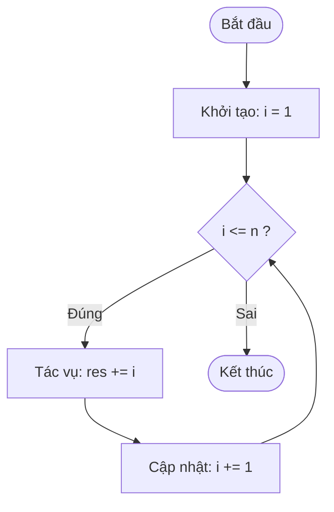
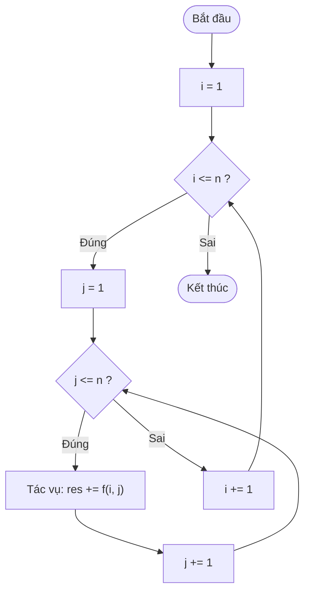
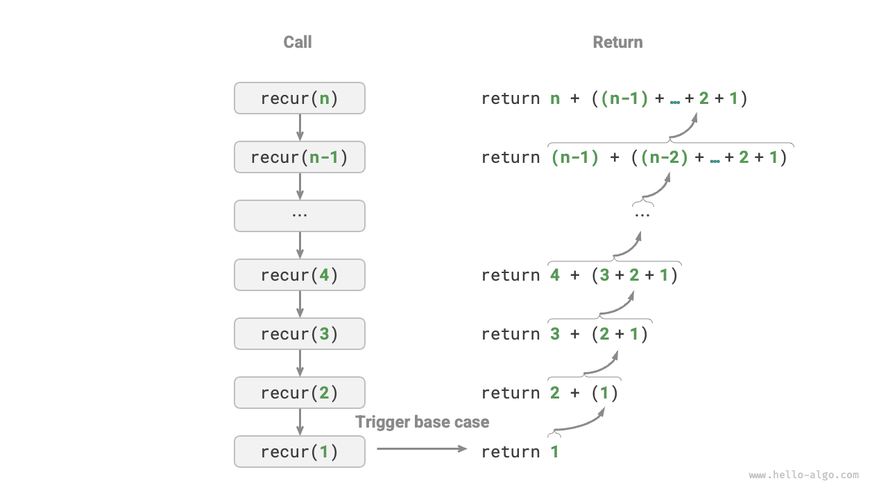
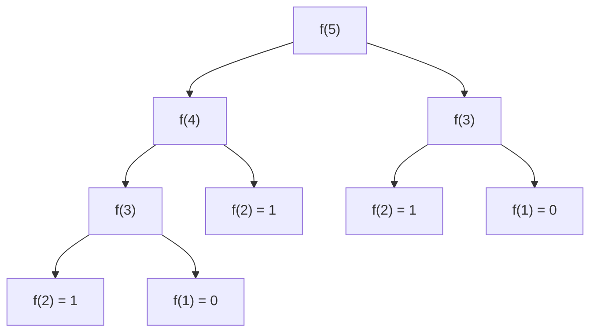

## Khái niệm cơ bản

Trong giải thuật, việc thực hiện lặp đi lặp lại một tác vụ là rất phổ biến. Có hai cấu trúc điều khiển cơ bản để lập trình hành vi lặp lại này: **Iteration (Vòng lặp)** và **Recursion (Đệ quy)**.

## Vòng lặp (Iteration)

**Iteration (Vòng lặp)** là cấu trúc lặp đi lặp lại một đoạn mã nguồn dưới một điều kiện nhất định cho đến khi điều kiện đó không còn thỏa mãn.

### Vòng lặp For (For Loop)

Vòng lặp `for` phù hợp nhất khi chúng ta đã biết trước số lần lặp.

Hàm sau tính tổng $1 + 2 + \dots + n$ bằng vòng lặp `for`:

=== "Python"

    ```python
    def for_loop(n: int) -> int:
        """for loop"""
        res = 0
        # Sum 1, 2, ..., n-1, n
        for i in range(1, n + 1):
            res += i
        return res
    ```

=== "C++"

    ```cpp
    int forLoop(int n) {
        int res = 0;
        // Sum 1, 2, ..., n-1, n
        for (int i = 1; i <= n; ++i) {
            res += i;
        }
        return res;
    }
    ```

=== "Java"

    ```java
    static int forLoop(int n) {
            int res = 0;
            // Sum 1, 2, ..., n-1, n
            for (int i = 1; i <= n; i++) {
                res += i;
            }
            return res;
        }
    ```

=== "C#"

    ```csharp
    int ForLoop(int n) {
            int res = 0;
            // Sum 1, 2, ..., n-1, n
            for (int i = 1; i <= n; i++) {
                res += i;
            }
            return res;
        }
    ```

=== "Go"

    ```go
    func forLoop(n int) int {
    	res := 0
    	// Sum 1, 2, ..., n-1, n
    	for i := 1; i <= n; i++ {
    		res += i
    	}
    	return res
    }
    ```

=== "Swift"

    ```swift
    func forLoop(n: Int) -> Int {
        var res = 0
        // Sum 1, 2, ..., n-1, n
        for i in 1 ... n {
            res += i
        }
        return res
    }
    ```

=== "JavaScript"

    ```javascript
    function forLoop(n) {
        let res = 0;
        // Sum 1, 2, ..., n-1, n
        for (let i = 1; i <= n; i++) {
            res += i;
        }
        return res;
    }
    ```

=== "TypeScript"

    ```typescript
    function forLoop(n: number): number {
        let res = 0;
        // Sum 1, 2, ..., n-1, n
        for (let i = 1; i <= n; i++) {
            res += i;
        }
        return res;
    }
    ```

=== "Dart"

    ```dart
    int forLoop(int n) {
      int res = 0;
      // Sum 1, 2, ..., n-1, n
      for (int i = 1; i <= n; i++) {
        res += i;
      }
      return res;
    }
    ```

=== "Rust"

    ```rust
    fn for_loop(n: i32) -> i32 {
        let mut res = 0;
        // Sum 1, 2, ..., n-1, n
        for i in 1..=n {
            res += i;
        }
        res
    }
    ```

=== "C"

    ```c
    int forLoop(int n) {
        int res = 0;
        // Sum 1, 2, ..., n-1, n
        for (int i = 1; i <= n; i++) {
            res += i;
        }
        return res;
    }
    ```

=== "Kotlin"

    ```kotlin
    fun forLoop(n: Int): Int {
        var res = 0
        // Sum 1, 2, ..., n-1, n
        for (i in 1..n) {
            res += i
        }
        return res
    }
    ```

=== "Ruby"

    ```ruby
    def for_loop(n)
      res = 0
    
      # Sum 1, 2, ..., n-1, n
      for i in 1..n
        res += i
      end
    
      res
    end
    ```



### Vòng lặp While (While Loop)

Vòng lặp `while` có tính linh hoạt cao hơn vòng lặp `for` vì điều kiện lặp có thể được tùy biến phức tạp hơn ở mỗi bước lặp.

Hàm tính tổng $1 + 2 + \dots + n$ bằng vòng lặp `while`:

=== "Python"

    ```python
    def while_loop(n: int) -> int:
        """while loop"""
        res = 0
        i = 1  # Initialize condition variable
        # Sum 1, 2, ..., n-1, n
        while i <= n:
            res += i
            i += 1  # Update condition variable
        return res
    ```

=== "C++"

    ```cpp
    int whileLoop(int n) {
        int res = 0;
        int i = 1; // Initialize condition variable
        // Sum 1, 2, ..., n-1, n
        while (i <= n) {
            res += i;
            i++; // Update condition variable
        }
        return res;
    }
    ```

=== "Java"

    ```java
    static int whileLoop(int n) {
            int res = 0;
            int i = 1; // Initialize condition variable
            // Sum 1, 2, ..., n-1, n
            while (i <= n) {
                res += i;
                i++; // Update condition variable
            }
            return res;
        }
    ```

=== "C#"

    ```csharp
    int WhileLoop(int n) {
            int res = 0;
            int i = 1; // Initialize condition variable
            // Sum 1, 2, ..., n-1, n
            while (i <= n) {
                res += i;
                i += 1; // Update condition variable
            }
            return res;
        }
    ```

=== "Go"

    ```go
    func whileLoop(n int) int {
    	res := 0
    	// Initialize condition variable
    	i := 1
    	// Sum 1, 2, ..., n-1, n
    	for i <= n {
    		res += i
    		// Update condition variable
    		i++
    	}
    	return res
    }
    ```

=== "Swift"

    ```swift
    func whileLoop(n: Int) -> Int {
        var res = 0
        var i = 1 // Initialize condition variable
        // Sum 1, 2, ..., n-1, n
        while i <= n {
            res += i
            i += 1 // Update condition variable
        }
        return res
    }
    ```

=== "JavaScript"

    ```javascript
    function whileLoop(n) {
        let res = 0;
        let i = 1; // Initialize condition variable
        // Sum 1, 2, ..., n-1, n
        while (i <= n) {
            res += i;
            i++; // Update condition variable
        }
        return res;
    }
    ```

=== "TypeScript"

    ```typescript
    function whileLoop(n: number): number {
        let res = 0;
        let i = 1; // Initialize condition variable
        // Sum 1, 2, ..., n-1, n
        while (i <= n) {
            res += i;
            i++; // Update condition variable
        }
        return res;
    }
    ```

=== "Dart"

    ```dart
    int whileLoop(int n) {
      int res = 0;
      int i = 1; // Initialize condition variable
      // Sum 1, 2, ..., n-1, n
      while (i <= n) {
        res += i;
        i++; // Update condition variable
      }
      return res;
    }
    ```

=== "Rust"

    ```rust
    fn while_loop(n: i32) -> i32 {
        let mut res = 0;
        let mut i = 1; // Initialize condition variable
    
        // Sum 1, 2, ..., n-1, n
        while i <= n {
            res += i;
            i += 1; // Update condition variable
        }
        res
    }
    ```

=== "C"

    ```c
    int whileLoop(int n) {
        int res = 0;
        int i = 1; // Initialize condition variable
        // Sum 1, 2, ..., n-1, n
        while (i <= n) {
            res += i;
            i++; // Update condition variable
        }
        return res;
    }
    ```

=== "Kotlin"

    ```kotlin
    fun whileLoop(n: Int): Int {
        var res = 0
        var i = 1 // Initialize condition variable
        // Sum 1, 2, ..., n-1, n
        while (i <= n) {
            res += i
            i++ // Update condition variable
        }
        return res
    }
    ```

=== "Ruby"

    ```ruby
    def while_loop(n)
      res = 0
      i = 1 # Initialize condition variable
    
      # Sum 1, 2, ..., n-1, n
      while i <= n
        res += i
        i += 1 # Update condition variable
      end
    
      res
    end
    ```

Ví dụ sau đây cập nhật biến điều kiện $i$ hai lần mỗi vòng lặp, việc này khó thực hiện thuận tiện bằng vòng lặp `for`:

=== "Python"

    ```python
    def while_loop_ii(n: int) -> int:
        """while loop (two updates)"""
        res = 0
        i = 1  # Initialize condition variable
        # Sum 1, 4, 10, ...
        while i <= n:
            res += i
            # Update condition variable
            i += 1
            i *= 2
        return res
    ```

=== "C++"

    ```cpp
    int whileLoopII(int n) {
        int res = 0;
        int i = 1; // Initialize condition variable
        // Sum 1, 4, 10, ...
        while (i <= n) {
            res += i;
            // Update condition variable
            i++;
            i *= 2;
        }
        return res;
    }
    ```

=== "Java"

    ```java
    static int whileLoopII(int n) {
            int res = 0;
            int i = 1; // Initialize condition variable
            // Sum 1, 4, 10, ...
            while (i <= n) {
                res += i;
                // Update condition variable
                i++;
                i *= 2;
            }
            return res;
        }
    ```

=== "C#"

    ```csharp
    int WhileLoopII(int n) {
            int res = 0;
            int i = 1; // Initialize condition variable
            // Sum 1, 4, 10, ...
            while (i <= n) {
                res += i;
                // Update condition variable
                i += 1; 
                i *= 2;
            }
            return res;
        }
    ```

=== "Go"

    ```go
    func whileLoopII(n int) int {
    	res := 0
    	// Initialize condition variable
    	i := 1
    	// Sum 1, 4, 10, ...
    	for i <= n {
    		res += i
    		// Update condition variable
    		i++
    		i *= 2
    	}
    	return res
    }
    ```

=== "Swift"

    ```swift
    func whileLoopII(n: Int) -> Int {
        var res = 0
        var i = 1 // Initialize condition variable
        // Sum 1, 4, 10, ...
        while i <= n {
            res += i
            // Update condition variable
            i += 1
            i *= 2
        }
        return res
    }
    ```

=== "JavaScript"

    ```javascript
    function whileLoopII(n) {
        let res = 0;
        let i = 1; // Initialize condition variable
        // Sum 1, 4, 10, ...
        while (i <= n) {
            res += i;
            // Update condition variable
            i++;
            i *= 2;
        }
        return res;
    }
    ```

=== "TypeScript"

    ```typescript
    function whileLoopII(n: number): number {
        let res = 0;
        let i = 1; // Initialize condition variable
        // Sum 1, 4, 10, ...
        while (i <= n) {
            res += i;
            // Update condition variable
            i++;
            i *= 2;
        }
        return res;
    }
    ```

=== "Dart"

    ```dart
    int whileLoopII(int n) {
      int res = 0;
      int i = 1; // Initialize condition variable
      // Sum 1, 4, 10, ...
      while (i <= n) {
        res += i;
        // Update condition variable
        i++;
        i *= 2;
      }
      return res;
    }
    ```

=== "Rust"

    ```rust
    fn while_loop_ii(n: i32) -> i32 {
        let mut res = 0;
        let mut i = 1; // Initialize condition variable
    
        // Sum 1, 4, 10, ...
        while i <= n {
            res += i;
            // Update condition variable
            i += 1;
            i *= 2;
        }
        res
    }
    ```

=== "C"

    ```c
    int whileLoopII(int n) {
        int res = 0;
        int i = 1; // Initialize condition variable
        // Sum 1, 4, 10, ...
        while (i <= n) {
            res += i;
            // Update condition variable
            i++;
            i *= 2;
        }
        return res;
    }
    ```

=== "Kotlin"

    ```kotlin
    fun whileLoopII(n: Int): Int {
        var res = 0
        var i = 1 // Initialize condition variable
        // Sum 1, 4, 10, ...
        while (i <= n) {
            res += i
            // Update condition variable
            i++
            i *= 2
        }
        return res
    }
    ```

=== "Ruby"

    ```ruby
    def while_loop_ii(n)
      res = 0
      i = 1 # Initialize condition variable
    
      # Sum 1, 4, 10, ...
      while i <= n
        res += i
        # Update condition variable
        i += 1
        i *= 2
      end
    
      res
    end
    ```

## Vòng lặp lồng nhau (Nested Loop)

Chúng ta có thể lồng một vòng lặp này bên trong một vòng lặp khác. Khi lồng hai vòng lặp `for`, số lần thực thi các phép toán sẽ tỷ lệ thuận với $n^2$ (quan hệ bình phương):

=== "Python"

    ```python
    def nested_for_loop(n: int) -> str:
        """Nested for loop"""
        res = ""
        # Loop i = 1, 2, ..., n-1, n
        for i in range(1, n + 1):
            # Loop j = 1, 2, ..., n-1, n
            for j in range(1, n + 1):
                res += f"({i}, {j}), "
        return res
    ```

=== "C++"

    ```cpp
    string nestedForLoop(int n) {
        ostringstream res;
        // Loop i = 1, 2, ..., n-1, n
        for (int i = 1; i <= n; ++i) {
            // Loop j = 1, 2, ..., n-1, n
            for (int j = 1; j <= n; ++j) {
                res << "(" << i << ", " << j << "), ";
            }
        }
        return res.str();
    }
    ```

=== "Java"

    ```java
        static String nestedForLoop(int n) {
            StringBuilder res = new StringBuilder();
            // Loop i = 1, 2, ..., n-1, n
            for (int i = 1; i <= n; i++) {
                // Loop j = 1, 2, ..., n-1, n
                for (int j = 1; j <= n; j++) {
                    res.append("(" + i + ", " + j + "), ");
                }
            }
            return res.toString();
        }
    ```

=== "C#"

    ```csharp
        string NestedForLoop(int n) {
            StringBuilder res = new();
            // Loop i = 1, 2, ..., n-1, n
            for (int i = 1; i <= n; i++) {
                // Loop j = 1, 2, ..., n-1, n
                for (int j = 1; j <= n; j++) {
                    res.Append($"({i}, {j}), ");
                }
            }
            return res.ToString();
        }
    ```

=== "Go"

    ```go
    func nestedForLoop(n int) string {
    	res := ""
    	// Loop i = 1, 2, ..., n-1, n
    	for i := 1; i <= n; i++ {
    		for j := 1; j <= n; j++ {
    			// Loop j = 1, 2, ..., n-1, n
    			res += fmt.Sprintf("(%d, %d), ", i, j)
    		}
    	}
    	return res
    }
    ```

=== "Swift"

    ```swift
    func nestedForLoop(n: Int) -> String {
        var res = ""
        // Loop i = 1, 2, ..., n-1, n
        for i in 1 ... n {
            // Loop j = 1, 2, ..., n-1, n
            for j in 1 ... n {
                res.append("(\(i), \(j)), ")
            }
        }
        return res
    }
    ```

=== "JavaScript"

    ```javascript
    function nestedForLoop(n) {
        let res = '';
        // Loop i = 1, 2, ..., n-1, n
        for (let i = 1; i <= n; i++) {
            // Loop j = 1, 2, ..., n-1, n
            for (let j = 1; j <= n; j++) {
                res += `(${i}, ${j}), `;
            }
        }
        return res;
    }
    ```

=== "TypeScript"

    ```typescript
    function nestedForLoop(n: number): string {
        let res = '';
        // Loop i = 1, 2, ..., n-1, n
        for (let i = 1; i <= n; i++) {
            // Loop j = 1, 2, ..., n-1, n
            for (let j = 1; j <= n; j++) {
                res += `(${i}, ${j}), `;
            }
        }
        return res;
    }
    ```

=== "Dart"

    ```dart
    String nestedForLoop(int n) {
      String res = "";
      // Loop i = 1, 2, ..., n-1, n
      for (int i = 1; i <= n; i++) {
        // Loop j = 1, 2, ..., n-1, n
        for (int j = 1; j <= n; j++) {
          res += "($i, $j), ";
        }
      }
      return res;
    }
    ```

=== "Rust"

    ```rust
    fn nested_for_loop(n: i32) -> String {
        let mut res = vec![];
        // Loop i = 1, 2, ..., n-1, n
        for i in 1..=n {
            // Loop j = 1, 2, ..., n-1, n
            for j in 1..=n {
                res.push(format!("({}, {}), ", i, j));
            }
        }
        res.join("")
    }
    ```

=== "C"

    ```c
    char *nestedForLoop(int n) {
        // n * n is the number of points, "(i, j), " string max length is 6+10*2, plus extra space for null character \0
        int size = n * n * 26 + 1;
        char *res = malloc(size * sizeof(char));
        // Loop i = 1, 2, ..., n-1, n
        for (int i = 1; i <= n; i++) {
            // Loop j = 1, 2, ..., n-1, n
            for (int j = 1; j <= n; j++) {
                char tmp[26];
                snprintf(tmp, sizeof(tmp), "(%d, %d), ", i, j);
                strncat(res, tmp, size - strlen(res) - 1);
            }
        }
        return res;
    }
    ```

=== "Kotlin"

    ```kotlin
    fun nestedForLoop(n: Int): String {
        val res = StringBuilder()
        // Loop i = 1, 2, ..., n-1, n
        for (i in 1..n) {
            // Loop j = 1, 2, ..., n-1, n
            for (j in 1..n) {
                res.append(" ($i, $j), ")
            }
        }
        return res.toString()
    }
    ```



## Đệ quy (Recursion)

**Recursion (Đệ quy)** là một chiến lược giải thuật giải quyết bài toán bằng cách gọi lại chính hàm đó. Quá trình đệ quy gồm hai pha:

1. **Descend (Đi xuống / Gọi đệ quy)**: Chương trình liên tục gọi chính nó sâu hơn với các tham số nhỏ hơn hoặc đơn giản hơn, cho đến khi đạt "điều kiện dừng".
2. **Ascend (Đi lên / Quay lui thu kết quả)**: Sau khi chạm điều kiện dừng, chương trình trả về từng tầng để tích lũy kết quả thu được.

Mã nguồn đệ quy cơ bản có 3 yếu tố:

- **Termination Condition (Điều kiện dừng)**: Quyết định khi nào dừng pha "đi xuống" để bắt đầu pha "đi lên".
- **Recursive Call (Gọi đệ quy)**: Gọi lại chính hàm đó với tham số nhỏ hơn.
- **Return Value (Giá trị trả về)**: Trả kết quả của tầng hiện tại lên tầng cha.

Hàm tính tổng $1 + 2 + \dots + n$ bằng đệ quy:

=== "Python"

    ```python
    def recur(n: int) -> int:
        """Recursion"""
        # Termination condition
        if n == 1:
            return 1
        # Recurse: recursive call
        res = recur(n - 1)
        # Return: return result
        return n + res
    ```

=== "C++"

    ```cpp
    int recur(int n) {
        // Termination condition
        if (n == 1)
            return 1;
        // Recurse: recursive call
        int res = recur(n - 1);
        // Return: return result
        return n + res;
    }
    ```

=== "Java"

    ```java
        static int recur(int n) {
            // Termination condition
            if (n == 1)
                return 1;
            // Recurse: recursive call
            int res = recur(n - 1);
            // Return: return result
            return n + res;
        }
    ```

=== "C#"

    ```csharp
        int Recur(int n) {
            // Termination condition
            if (n == 1)
                return 1;
            // Recurse: recursive call
            int res = Recur(n - 1);
            // Return: return result
            return n + res;
        }
    ```

=== "Go"

    ```go
    func recur(n int) int {
    	// Termination condition
    	if n == 1 {
    		return 1
    	}
    	// Recurse: recursive call
    	res := recur(n - 1)
    	// Return: return result
    	return n + res
    }
    ```

=== "Swift"

    ```swift
    func recur(n: Int) -> Int {
        // Termination condition
        if n == 1 {
            return 1
        }
        // Recurse: recursive call
        let res = recur(n: n - 1)
        // Return: return result
        return n + res
    }
    ```

=== "JavaScript"

    ```javascript
    function recur(n) {
        // Termination condition
        if (n === 1) return 1;
        // Recurse: recursive call
        const res = recur(n - 1);
        // Return: return result
        return n + res;
    }
    ```

=== "TypeScript"

    ```typescript
    function recur(n: number): number {
        // Termination condition
        if (n === 1) return 1;
        // Recurse: recursive call
        const res = recur(n - 1);
        // Return: return result
        return n + res;
    }
    ```

=== "Dart"

    ```dart
    int recur(int n) {
      // Termination condition
      if (n == 1) return 1;
      // Recurse: recursive call
      int res = recur(n - 1);
      // Return: return result
      return n + res;
    }
    ```

=== "Rust"

    ```rust
    fn recur(n: i32) -> i32 {
        // Termination condition
        if n == 1 {
            return 1;
        }
        // Recurse: recursive call
        let res = recur(n - 1);
        // Return: return result
        n + res
    }
    ```

=== "C"

    ```c
    int recur(int n) {
        // Termination condition
        if (n == 1)
            return 1;
        // Recurse: recursive call
        int res = recur(n - 1);
        // Return: return result
        return n + res;
    }
    ```

=== "Kotlin"

    ```kotlin
    fun recur(n: Int): Int {
        // Termination condition
        if (n == 1)
            return 1
        // Descend: recursive call
        val res = recur(n - 1)
        // Return: return result
        return n + res
    }
    ```



Mặc dù xét về mặt tính toán, **Iteration (Vòng lặp)** và **Recursion (Đệ quy)** có thể cho ra cùng một kết quả, nhưng chúng đại diện cho hai hệ tư duy hoàn toàn khác nhau trong cách tiếp cận và giải quyết vấn đề.

- **Iteration (Vòng lặp)**: Giải quyết bài toán theo hướng "từ dưới lên" (bottom-up). Bắt đầu từ các bước cơ bản nhất, các bước này được thực thi hoặc tích lũy lặp đi lặp lại cho đến khi hoàn thành nhiệm vụ.
- **Recursion (Đệ quy)**: Giải quyết bài toán theo hướng "từ trên xuống" (top-down). Bài toán gốc được phân rã thành các bài toán con nhỏ hơn có cùng dạng với bài toán gốc. Các bài toán con này tiếp tục được phân rã thành các bài toán con nhỏ hơn nữa cho đến khi chạm tới trường hợp cơ sở (nơi lời giải đã được biết).

Lấy lại ví dụ hàm tính tổng ở trên, đặt bài toán là $f(n) = 1 + 2 + \dots + n$.

- **Iteration (Vòng lặp)**: Mô phỏng quá trình cộng tổng bằng vòng lặp, duyệt từ $1$ đến $n$, thực hiện phép cộng tổng ở mỗi vòng để thu được $f(n)$.
- **Recursion (Đệ quy)**: Phân rã bài toán thành bài toán con $f(n) = n + f(n-1)$, tiếp tục phân rã (đệ quy) cho đến khi kết thúc tại trường hợp cơ sở $f(1) = 1$.

### Ngăn xếp cuộc gọi (Call Stack)

Mỗi khi một hàm đệ quy gọi lại chính nó, hệ thống sẽ cấp phát bộ nhớ cho lần gọi hàm mới để lưu trữ các biến cục bộ, địa chỉ gọi hàm và các thông tin khác. Điều này dẫn đến hai hệ quả:

- Dữ liệu ngữ cảnh của hàm được lưu trong một vùng nhớ gọi là **không gian khung ngăn xếp (stack frame space)**, vùng này chỉ được giải phóng sau khi hàm trả về. Do đó, **đệ quy thường tiêu tốn nhiều bộ nhớ hơn vòng lặp**.
- Việc gọi hàm đệ quy phát sinh thêm chi phí xử lý. Do đó, **đệ quy thường kém hiệu quả về thời gian hơn vòng lặp**.

Như minh họa trong hình dưới đây, trước khi điều kiện dừng được kích hoạt, có $n$ hàm đệ quy chưa trả về tồn tại đồng thời, với **độ sâu đệ quy là $n$**.


Trong thực tế, độ sâu đệ quy cho phép của các ngôn ngữ lập trình thường bị giới hạn, và đệ quy quá sâu có thể dẫn đến lỗi tràn ngăn xếp (stack overflow).

### Đệ quy đuôi (Tail Recursion)

Nếu lời gọi đệ quy là thao tác cuối cùng trước khi hàm trả về, nó được gọi là **Tail Recursion (Đệ quy đuôi)**. Nhiều compiler có thể tối ưu hóa đệ quy đuôi thành vòng lặp thông thường để tiết kiệm không gian ngăn xếp bộ nhớ (stack frame):

- **Đệ quy thông thường**: Khi hàm trả về tầng trước đó, nó cần tiếp tục thực thi mã lệnh, do đó hệ thống cần lưu lại ngữ cảnh gọi hàm của tầng trước.
- **Đệ quy đuôi**: Lời gọi đệ quy là thao tác cuối cùng trước khi hàm trả về, nghĩa là sau khi quay về tầng trước, không cần thực thi thêm thao tác nào khác, nên hệ thống không cần lưu lại ngữ cảnh của hàm ở tầng trước.

=== "Python"

    ```python
    def tail_recur(n, res):
        """Tail recursion"""
        # Termination condition
        if n == 0:
            return res
        # Tail recursive call
        return tail_recur(n - 1, res + n)
    ```

=== "C++"

    ```cpp
    int tailRecur(int n, int res) {
        // Termination condition
        if (n == 0)
            return res;
        // Tail recursive call
        return tailRecur(n - 1, res + n);
    }
    ```

=== "Java"

    ```java
        static int tailRecur(int n, int res) {
            // Termination condition
            if (n == 0)
                return res;
            // Tail recursive call
            return tailRecur(n - 1, res + n);
        }
    ```

=== "C#"

    ```csharp
        int TailRecur(int n, int res) {
            // Termination condition
            if (n == 0)
                return res;
            // Tail recursive call
            return TailRecur(n - 1, res + n);
        }
    ```

=== "Go"

    ```go
    func tailRecur(n int, res int) int {
    	// Termination condition
    	if n == 0 {
    		return res
    	}
    	// Tail recursive call
    	return tailRecur(n-1, res+n)
    }
    ```

=== "Swift"

    ```swift
    func tailRecur(n: Int, res: Int) -> Int {
        // Termination condition
        if n == 0 {
            return res
        }
        // Tail recursive call
        return tailRecur(n: n - 1, res: res + n)
    }
    ```

=== "JavaScript"

    ```javascript
    function tailRecur(n, res) {
        // Termination condition
        if (n === 0) return res;
        // Tail recursive call
        return tailRecur(n - 1, res + n);
    }
    ```

=== "TypeScript"

    ```typescript
    function tailRecur(n: number, res: number): number {
        // Termination condition
        if (n === 0) return res;
        // Tail recursive call
        return tailRecur(n - 1, res + n);
    }
    ```

=== "Dart"

    ```dart
    int tailRecur(int n, int res) {
      // Termination condition
      if (n == 0) return res;
      // Tail recursive call
      return tailRecur(n - 1, res + n);
    }
    ```

=== "Rust"

    ```rust
    fn tail_recur(n: i32, res: i32) -> i32 {
        // Termination condition
        if n == 0 {
            return res;
        }
        // Tail recursive call
        tail_recur(n - 1, res + n)
    }
    ```

=== "C"

    ```c
    int tailRecur(int n, int res) {
        // Termination condition
        if (n == 0)
            return res;
        // Tail recursive call
        return tailRecur(n - 1, res + n);
    }
    ```

=== "Kotlin"

    ```kotlin
    tailrec fun tailRecur(n: Int, res: Int): Int {
        // Add tailrec keyword to enable tail recursion optimization
        // Termination condition
        if (n == 0)
            return res
        // Tail recursive call
        return tailRecur(n - 1, res + n)
    }
    ```

Quá trình thực thi của đệ quy đuôi được minh họa trong hình dưới đây. So sánh đệ quy thông thường và đệ quy đuôi, ta thấy phép cộng tổng được thực hiện ở những thời điểm khác nhau.

- **Đệ quy thông thường**: Phép cộng tổng được thực hiện trong quá trình "đi lên" (ascending), cần thêm một phép cộng sau mỗi lần một tầng trả về.
- **Đệ quy đuôi**: Phép cộng tổng được thực hiện trong quá trình "đi xuống" (descending); quá trình "đi lên" chỉ cần trả về tuần tự qua từng tầng.


> 💡 **Tip**: Nhiều trình biên dịch hoặc trình thông dịch không hỗ trợ tối ưu hóa đệ quy đuôi. Ví dụ, Python mặc định không hỗ trợ tối ưu hóa đệ quy đuôi, vì vậy dù một hàm được viết ở dạng đệ quy đuôi, nó vẫn có thể gặp lỗi tràn ngăn xếp.

### Cây đệ quy (Recursion Tree)

Khi xử lý các bài toán giải thuật liên quan đến "chia để trị" (divide and conquer), đệ quy thường mang lại cách tiếp cận trực quan hơn và mã nguồn dễ đọc hơn so với vòng lặp. Hãy lấy "dãy số Fibonacci" làm ví dụ.

> ❓ **Câu hỏi**: Cho một dãy số Fibonacci $0, 1, 1, 2, 3, 5, 8, 13, \dots$, hãy tìm số thứ $n$ trong dãy.

Gọi số thứ $n$ của dãy Fibonacci là $f(n)$. Ta có thể dễ dàng rút ra hai kết luận:

- Hai số đầu tiên của dãy là $f(1) = 0$ và $f(2) = 1$.
- Mỗi số trong dãy bằng tổng hai số liền trước nó, tức là $f(n) = f(n - 1) + f(n - 2)$.

Dựa theo công thức truy hồi để thực hiện các lời gọi đệ quy, với hai số đầu tiên làm điều kiện dừng, ta có thể viết mã đệ quy như sau. Gọi `fib(n)` sẽ cho ta số thứ $n$ của dãy Fibonacci:

=== "Python"

    ```python
    def fib(n: int) -> int:
        """Fibonacci sequence: recursion"""
        # Termination condition f(1) = 0, f(2) = 1
        if n == 1 or n == 2:
            return n - 1
        # Recursive call f(n) = f(n-1) + f(n-2)
        res = fib(n - 1) + fib(n - 2)
        # Return result f(n)
        return res
    ```

=== "C++"

    ```cpp
    int fib(int n) {
        // Termination condition f(1) = 0, f(2) = 1
        if (n == 1 || n == 2)
            return n - 1;
        // Recursive call f(n) = f(n-1) + f(n-2)
        int res = fib(n - 1) + fib(n - 2);
        // Return result f(n)
        return res;
    }
    ```

=== "Java"

    ```java
        static int fib(int n) {
            // Termination condition f(1) = 0, f(2) = 1
            if (n == 1 || n == 2)
                return n - 1;
            // Recursive call f(n) = f(n-1) + f(n-2)
            int res = fib(n - 1) + fib(n - 2);
            // Return result f(n)
            return res;
        }
    ```

=== "C#"

    ```csharp
        int Fib(int n) {
            // Termination condition f(1) = 0, f(2) = 1
            if (n == 1 || n == 2)
                return n - 1;
            // Recursive call f(n) = f(n-1) + f(n-2)
            int res = Fib(n - 1) + Fib(n - 2);
            // Return result f(n)
            return res;
        }
    ```

=== "Go"

    ```go
    func fib(n int) int {
    	// Termination condition f(1) = 0, f(2) = 1
    	if n == 1 || n == 2 {
    		return n - 1
    	}
    	// Recursive call f(n) = f(n-1) + f(n-2)
    	res := fib(n-1) + fib(n-2)
    	// Return result f(n)
    	return res
    }
    ```

=== "Swift"

    ```swift
    func fib(n: Int) -> Int {
        // Termination condition f(1) = 0, f(2) = 1
        if n == 1 || n == 2 {
            return n - 1
        }
        // Recursive call f(n) = f(n-1) + f(n-2)
        let res = fib(n: n - 1) + fib(n: n - 2)
        // Return result f(n)
        return res
    }
    ```

=== "JavaScript"

    ```javascript
    function fib(n) {
        // Termination condition f(1) = 0, f(2) = 1
        if (n === 1 || n === 2) return n - 1;
        // Recursive call f(n) = f(n-1) + f(n-2)
        const res = fib(n - 1) + fib(n - 2);
        // Return result f(n)
        return res;
    }
    ```

=== "TypeScript"

    ```typescript
    function fib(n: number): number {
        // Termination condition f(1) = 0, f(2) = 1
        if (n === 1 || n === 2) return n - 1;
        // Recursive call f(n) = f(n-1) + f(n-2)
        const res = fib(n - 1) + fib(n - 2);
        // Return result f(n)
        return res;
    }
    ```

=== "Dart"

    ```dart
    int fib(int n) {
      // Termination condition f(1) = 0, f(2) = 1
      if (n == 1 || n == 2) return n - 1;
      // Recursive call f(n) = f(n-1) + f(n-2)
      int res = fib(n - 1) + fib(n - 2);
      // Return result f(n)
      return res;
    }
    ```

=== "Rust"

    ```rust
    fn fib(n: i32) -> i32 {
        // Termination condition f(1) = 0, f(2) = 1
        if n == 1 || n == 2 {
            return n - 1;
        }
        // Recursive call f(n) = f(n-1) + f(n-2)
        let res = fib(n - 1) + fib(n - 2);
        // Return result
        res
    }
    ```

=== "C"

    ```c
    int fib(int n) {
        // Termination condition f(1) = 0, f(2) = 1
        if (n == 1 || n == 2)
            return n - 1;
        // Recursive call f(n) = f(n-1) + f(n-2)
        int res = fib(n - 1) + fib(n - 2);
        // Return result f(n)
        return res;
    }
    ```

=== "Kotlin"

    ```kotlin
    fun fib(n: Int): Int {
        // Termination condition f(1) = 0, f(2) = 1
        if (n == 1 || n == 2)
            return n - 1
        // Recursive call f(n) = f(n-1) + f(n-2)
        val res = fib(n - 1) + fib(n - 2)
        // Return result f(n)
        return res
    }
    ```

Quan sát đoạn mã trên, hàm thực hiện hai lời gọi đệ quy trong một lượt, **nghĩa là một lời gọi sẽ sinh ra hai nhánh gọi con**. Việc gọi đệ quy lặp đi lặp lại này cuối cùng tạo ra một **cây đệ quy (recursion tree)** với $n$ tầng:



Về bản chất, đệ quy thể hiện tư duy "phân rã bài toán thành các bài toán con nhỏ hơn", và chiến lược chia để trị này đóng vai trò then chốt.

- Ở góc độ giải thuật, nhiều chiến lược giải thuật quan trọng như tìm kiếm, sắp xếp, quay lui, chia để trị và quy hoạch động đều áp dụng trực tiếp hoặc gián tiếp lối tư duy này.
- Ở góc độ cấu trúc dữ liệu, đệ quy đặc biệt phù hợp để xử lý các bài toán liên quan đến danh sách liên kết, cây và đồ thị, vì chúng rất thích hợp để phân tích bằng tư duy chia để trị.

## So sánh hai phương pháp

Tổng kết lại nội dung trên, như bảng dưới đây, vòng lặp và đệ quy khác nhau về cách triển khai, hiệu năng và khả năng ứng dụng.

|                    | Iteration (Vòng lặp)                                           | Recursion (Đệ quy)                                                                          |
| ------------------ | -------------------------------------------------------------- | ------------------------------------------------------------------------------------------- |
| Cách triển khai    | Cấu trúc vòng lặp                                              | Hàm tự gọi lại chính nó                                                                     |
| Hiệu quả thời gian | Thường hiệu quả hơn, không có chi phí gọi hàm                  | Mỗi lời gọi hàm phát sinh thêm chi phí                                                      |
| Sử dụng bộ nhớ     | Thường sử dụng lượng bộ nhớ cố định                            | Các lời gọi hàm tích lũy có thể chiếm nhiều không gian khung ngăn xếp                       |
| Bài toán phù hợp   | Phù hợp với các tác vụ lặp đơn giản, mã nguồn trực quan, dễ đọc | Phù hợp phân rã bài toán con, như cây, đồ thị, chia để trị, quay lui..., mã nguồn ngắn gọn   |

> 💡 **Tip**: Nếu bạn thấy nội dung tiếp theo khó hiểu, có thể quay lại đọc sau khi đã học chương "Ngăn xếp (Stack)".

Mối quan hệ nội tại giữa vòng lặp và đệ quy là gì? Lấy lại ví dụ hàm đệ quy ở trên, phép cộng tổng được thực hiện trong giai đoạn "đi lên" của đệ quy. Điều này có nghĩa là hàm được gọi trước lại là hàm hoàn thành phép cộng tổng sau cùng, **và cơ chế hoạt động này tương tự với nguyên lý "vào sau ra trước" (LIFO) của ngăn xếp (stack)**.

Trên thực tế, các thuật ngữ đệ quy như "ngăn xếp cuộc gọi" (call stack) và "không gian khung ngăn xếp" (stack frame space) đã ngầm gợi ý mối quan hệ mật thiết giữa đệ quy và ngăn xếp.

1. **Đi xuống (Descend)**: Khi một hàm được gọi, hệ thống cấp phát một khung ngăn xếp mới trên "ngăn xếp cuộc gọi" cho hàm đó để lưu trữ các biến cục bộ, tham số, địa chỉ trả về và các dữ liệu khác của hàm.
2. **Đi lên (Ascend)**: Khi hàm hoàn tất thực thi và trả về, khung ngăn xếp tương ứng sẽ bị loại bỏ khỏi "ngăn xếp cuộc gọi", khôi phục lại môi trường thực thi của hàm trước đó.

Do đó, **chúng ta có thể dùng một ngăn xếp tường minh (explicit stack) để mô phỏng hành vi của ngăn xếp cuộc gọi**, từ đó chuyển đổi đệ quy thành dạng vòng lặp:

=== "Python"

    ```python
    def for_loop_recur(n: int) -> int:
        """Simulate recursion using iteration"""
        # Use an explicit stack to simulate the system call stack
        stack = []
        res = 0
        # Recurse: recursive call
        for i in range(n, 0, -1):
            # Simulate "recurse" with "push"
            stack.append(i)
        # Return: return result
        while stack:
            # Simulate "return" with "pop"
            res += stack.pop()
        # res = 1+2+3+...+n
        return res
    ```

=== "C++"

    ```cpp
    int forLoopRecur(int n) {
        // Use an explicit stack to simulate the system call stack
        stack<int> stack;
        int res = 0;
        // Recurse: recursive call
        for (int i = n; i > 0; i--) {
            // Simulate "recurse" with "push"
            stack.push(i);
        }
        // Return: return result
        while (!stack.empty()) {
            // Simulate "return" with "pop"
            res += stack.top();
            stack.pop();
        }
        // res = 1+2+3+...+n
        return res;
    }
    ```

=== "Java"

    ```java
        static int forLoopRecur(int n) {
            // Use an explicit stack to simulate the system call stack
            Stack<Integer> stack = new Stack<>();
            int res = 0;
            // Recurse: recursive call
            for (int i = n; i > 0; i--) {
                // Simulate "recurse" with "push"
                stack.push(i);
            }
            // Return: return result
            while (!stack.isEmpty()) {
                // Simulate "return" with "pop"
                res += stack.pop();
            }
            // res = 1+2+3+...+n
            return res;
        }
    ```

=== "C#"

    ```csharp
        int ForLoopRecur(int n) {
            // Use an explicit stack to simulate the system call stack
            Stack<int> stack = new();
            int res = 0;
            // Recurse: recursive call
            for (int i = n; i > 0; i--) {
                // Simulate "recurse" with "push"
                stack.Push(i);
            }
            // Return: return result
            while (stack.Count > 0) {
                // Simulate "return" with "pop"
                res += stack.Pop();
            }
            // res = 1+2+3+...+n
            return res;
        }
    ```

=== "Go"

    ```go
    func forLoopRecur(n int) int {
    	// Use an explicit stack to simulate the system call stack
    	stack := list.New()
    	res := 0
    	// Recurse: recursive call
    	for i := n; i > 0; i-- {
    		// Simulate "recurse" with "push"
    		stack.PushBack(i)
    	}
    	// Return: return result
    	for stack.Len() != 0 {
    		// Simulate "return" with "pop"
    		res += stack.Back().Value.(int)
    		stack.Remove(stack.Back())
    	}
    	// res = 1+2+3+...+n
    	return res
    }
    ```

=== "Swift"

    ```swift
    func forLoopRecur(n: Int) -> Int {
        // Use an explicit stack to simulate the system call stack
        var stack: [Int] = []
        var res = 0
        // Recurse: recursive call
        for i in (1 ... n).reversed() {
            // Simulate "recurse" with "push"
            stack.append(i)
        }
        // Return: return result
        while !stack.isEmpty {
            // Simulate "return" with "pop"
            res += stack.removeLast()
        }
        // res = 1+2+3+...+n
        return res
    }
    ```

=== "JavaScript"

    ```javascript
    function forLoopRecur(n) {
        // Use an explicit stack to simulate the system call stack
        const stack = [];
        let res = 0;
        // Recurse: recursive call
        for (let i = n; i > 0; i--) {
            // Simulate "recurse" with "push"
            stack.push(i);
        }
        // Return: return result
        while (stack.length) {
            // Simulate "return" with "pop"
            res += stack.pop();
        }
        // res = 1+2+3+...+n
        return res;
    }
    ```

=== "TypeScript"

    ```typescript
    function forLoopRecur(n: number): number {
        // Use an explicit stack to simulate the system call stack
        const stack: number[] = [];
        let res: number = 0;
        // Recurse: recursive call
        for (let i = n; i > 0; i--) {
            // Simulate "recurse" with "push"
            stack.push(i);
        }
        // Return: return result
        while (stack.length) {
            // Simulate "return" with "pop"
            res += stack.pop();
        }
        // res = 1+2+3+...+n
        return res;
    }
    ```

=== "Dart"

    ```dart
    int forLoopRecur(int n) {
      // Use an explicit stack to simulate the system call stack
      List<int> stack = [];
      int res = 0;
      // Recurse: recursive call
      for (int i = n; i > 0; i--) {
        // Simulate "recurse" with "push"
        stack.add(i);
      }
      // Return: return result
      while (!stack.isEmpty) {
        // Simulate "return" with "pop"
        res += stack.removeLast();
      }
      // res = 1+2+3+...+n
      return res;
    }
    ```

=== "Rust"

    ```rust
    fn for_loop_recur(n: i32) -> i32 {
        // Use an explicit stack to simulate the system call stack
        let mut stack = Vec::new();
        let mut res = 0;
        // Recurse: recursive call
        for i in (1..=n).rev() {
            // Simulate "recurse" with "push"
            stack.push(i);
        }
        // Return: return result
        while !stack.is_empty() {
            // Simulate "return" with "pop"
            res += stack.pop().unwrap();
        }
        // res = 1+2+3+...+n
        res
    }
    ```

=== "C"

    ```c
    int forLoopRecur(int n) {
        int stack[1000]; // Use a large array to simulate the stack
        int top = -1;    // Stack top index
        int res = 0;
        // Recurse: recursive call
        for (int i = n; i > 0; i--) {
            // Simulate "recurse" with "push"
            stack[1 + top++] = i;
        }
        // Return: return result
        while (top >= 0) {
            // Simulate "return" with "pop"
            res += stack[top--];
        }
        // res = 1+2+3+...+n
        return res;
    }
    ```

=== "Kotlin"

    ```kotlin
    fun forLoopRecur(n: Int): Int {
        // Use an explicit stack to simulate the system call stack
        val stack = Stack<Int>()
        var res = 0
        // Recurse: recursive call
        for (i in n downTo 0) {
            // Simulate "recurse" with "push"
            stack.push(i)
        }
        // Return: return result
        while (stack.isNotEmpty()) {
            // Simulate "return" with "pop"
            res += stack.pop()
        }
        // res = 1+2+3+...+n
        return res
    }
    ```

Quan sát đoạn mã trên, khi đệ quy được chuyển thành vòng lặp, mã nguồn trở nên phức tạp hơn. Mặc dù vòng lặp và đệ quy có thể chuyển đổi qua lại lẫn nhau trong nhiều trường hợp, nhưng việc này có thể không đáng để thực hiện vì hai lý do sau:

- Mã nguồn sau khi chuyển đổi có thể khó hiểu hơn và kém dễ đọc hơn.
- Đối với một số bài toán phức tạp, việc mô phỏng hành vi ngăn xếp cuộc gọi của hệ thống có thể rất khó khăn.

Tóm lại, **việc lựa chọn giữa vòng lặp và đệ quy phụ thuộc vào bản chất của từng bài toán cụ thể**. Trong thực hành lập trình, việc cân nhắc ưu và nhược điểm của cả hai để chọn ra phương pháp phù hợp theo từng ngữ cảnh là vô cùng quan trọng.

