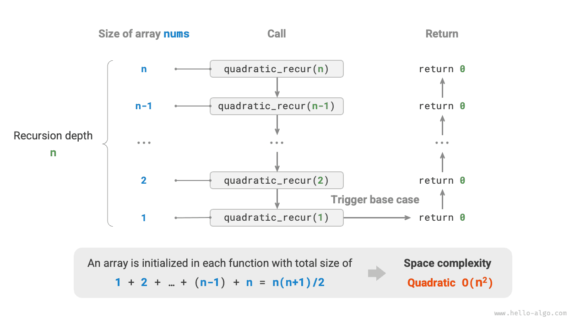

## Giới thiệu về Space Complexity

**Space Complexity (Độ phức tạp không gian)** đo lường xu hướng tăng trưởng của lượng bộ nhớ mà thuật toán chiếm dụng khi kích thước dữ liệu $n$ tăng lên. Khái niệm này rất giống với độ phức tạp thời gian, ngoại trừ việc "thời gian chạy" được thay bằng "dung lượng bộ nhớ chiếm dụng".

Bộ nhớ được thuật toán sử dụng trong quá trình thực thi chủ yếu gồm các loại sau:

- **Input Space (Không gian đầu vào)**: Dùng để lưu trữ dữ liệu đầu vào của thuật toán.
- **Temporary Space (Không gian tạm thời)**: Dùng để lưu trữ biến, đối tượng, ngữ cảnh hàm và các dữ liệu khác trong quá trình thực thi thuật toán.
- **Output Space (Không gian đầu ra)**: Dùng để lưu trữ dữ liệu đầu ra của thuật toán.

Nhìn chung, phạm vi thống kê độ phức tạp không gian là "không gian tạm thời" cộng với "không gian đầu ra".

Không gian tạm thời có thể được chia nhỏ hơn thành ba phần:

- **Temporary Data (Dữ liệu tạm thời)**: Dùng để lưu các hằng số, biến, đối tượng, v.v. trong quá trình thực thi thuật toán.
- **Stack Frame Space (Không gian khung ngăn xếp)**: Dùng để lưu ngữ cảnh dữ liệu của các hàm được gọi. Hệ thống tạo một khung ngăn xếp ở đỉnh ngăn xếp mỗi khi một hàm được gọi, và không gian khung ngăn xếp này được giải phóng sau khi hàm trả về.
- **Instruction Space (Không gian lệnh)**: Dùng để lưu các lệnh chương trình đã biên dịch, thường bị bỏ qua trong thống kê thực tế.

Khi phân tích độ phức tạp không gian của một chương trình, **chúng ta thường xét ba phần: dữ liệu tạm thời, không gian khung ngăn xếp, và dữ liệu đầu ra**, như minh họa trong hình dưới đây.


Đoạn mã liên quan như sau:

=== "Python"

    ```python
    class Node:
        """Class"""
        def __init__(self, x: int):
            self.val: int = x              # Node value
            self.next: Node | None = None  # Reference to the next node
    
    def function() -> int:
        """Function"""
        # Perform some operations...
        return 0
    
    def algorithm(n) -> int:  # Input data
        A = 0                 # Temporary data (constant, usually represented by uppercase letters)
        b = 0                 # Temporary data (variable)
        node = Node(0)        # Temporary data (object)
        c = function()        # Stack frame space (function call)
        return A + b + c      # Output data
    ```

=== "C++"

    ```cpp
    /* Structure */
    struct Node {
        int val;
        Node *next;
        Node(int x) : val(x), next(nullptr) {}
    };
    
    /* Function */
    int func() {
        // Perform some operations...
        return 0;
    }
    
    int algorithm(int n) {        // Input data
        const int a = 0;          // Temporary data (constant)
        int b = 0;                // Temporary data (variable)
        Node* node = new Node(0); // Temporary data (object)
        int c = func();           // Stack frame space (function call)
        return a + b + c;         // Output data
    }
    ```

=== "Java"

    ```java
    /* Class */
    class Node {
        int val;
        Node next;
        Node(int x) { val = x; }
    }
    
    /* Function */
    int function() {
        // Perform some operations...
        return 0;
    }
    
    int algorithm(int n) {        // Input data
        final int a = 0;          // Temporary data (constant)
        int b = 0;                // Temporary data (variable)
        Node node = new Node(0);  // Temporary data (object)
        int c = function();       // Stack frame space (function call)
        return a + b + c;         // Output data
    }
    ```

=== "C#"

    ```csharp
    /* Class */
    class Node(int x) {
        int val = x;
        Node next;
    }
    
    /* Function */
    int Function() {
        // Perform some operations...
        return 0;
    }
    
    int Algorithm(int n) {        // Input data
        const int a = 0;          // Temporary data (constant)
        int b = 0;                // Temporary data (variable)
        Node node = new(0);       // Temporary data (object)
        int c = Function();       // Stack frame space (function call)
        return a + b + c;         // Output data
    }
    ```

=== "Go"

    ```go
    /* Structure */
    type node struct {
        val  int
        next *node
    }
    
    /* Create node structure */
    func newNode(val int) *node {
        return &node{val: val}
    }
    
    /* Function */
    func function() int {
        // Perform some operations...
        return 0
    }
    
    func algorithm(n int) int { // Input data
        const a = 0             // Temporary data (constant)
        b := 0                  // Temporary data (variable)
        newNode(0)              // Temporary data (object)
        c := function()         // Stack frame space (function call)
        return a + b + c        // Output data
    }
    ```

=== "Swift"

    ```swift
    /* Class */
    class Node {
        var val: Int
        var next: Node?
    
        init(x: Int) {
            val = x
        }
    }
    
    /* Function */
    func function() -> Int {
        // Perform some operations...
        return 0
    }
    
    func algorithm(n: Int) -> Int { // Input data
        let a = 0             // Temporary data (constant)
        var b = 0             // Temporary data (variable)
        let node = Node(x: 0) // Temporary data (object)
        let c = function()    // Stack frame space (function call)
        return a + b + c      // Output data
    }
    ```

=== "JavaScript"

    ```javascript
    /* Class */
    class Node {
        val;
        next;
        constructor(val) {
            this.val = val === undefined ? 0 : val; // Node value
            this.next = null;                       // Reference to the next node
        }
    }
    
    /* Function */
    function constFunc() {
        // Perform some operations
        return 0;
    }
    
    function algorithm(n) {       // Input data
        const a = 0;              // Temporary data (constant)
        let b = 0;                // Temporary data (variable)
        const node = new Node(0); // Temporary data (object)
        const c = constFunc();    // Stack frame space (function call)
        return a + b + c;         // Output data
    }
    ```

=== "TypeScript"

    ```typescript
    /* Class */
    class Node {
        val: number;
        next: Node | null;
        constructor(val?: number) {
            this.val = val === undefined ? 0 : val; // Node value
            this.next = null;                       // Reference to the next node
        }
    }
    
    /* Function */
    function constFunc(): number {
        // Perform some operations
        return 0;
    }
    
    function algorithm(n: number): number { // Input data
        const a = 0;                        // Temporary data (constant)
        let b = 0;                          // Temporary data (variable)
        const node = new Node(0);           // Temporary data (object)
        const c = constFunc();              // Stack frame space (function call)
        return a + b + c;                   // Output data
    }
    ```

=== "Dart"

    ```dart
    /* Class */
    class Node {
      int val;
      Node next;
      Node(this.val, [this.next]);
    }
    
    /* Function */
    int function() {
      // Perform some operations...
      return 0;
    }
    
    int algorithm(int n) {  // Input data
      const int a = 0;      // Temporary data (constant)
      int b = 0;            // Temporary data (variable)
      Node node = Node(0);  // Temporary data (object)
      int c = function();   // Stack frame space (function call)
      return a + b + c;     // Output data
    }
    ```

=== "Rust"

    ```rust
    use std::rc::Rc;
    use std::cell::RefCell;
    
    /* Structure */
    struct Node {
        val: i32,
        next: Option<Rc<RefCell<Node>>>,
    }
    
    /* Create Node structure */
    impl Node {
        fn new(val: i32) -> Self {
            Self { val: val, next: None }
        }
    }
    
    /* Function */
    fn function() -> i32 {
        // Perform some operations...
        return 0;
    }
    
    fn algorithm(n: i32) -> i32 {       // Input data
        const a: i32 = 0;               // Temporary data (constant)
        let mut b = 0;                  // Temporary data (variable)
        let node = Node::new(0);        // Temporary data (object)
        let c = function();             // Stack frame space (function call)
        return a + b + c;               // Output data
    }
    ```

=== "C"

    ```c
    /* Function */
    int func() {
        // Perform some operations...
        return 0;
    }
    
    int algorithm(int n) { // Input data
        const int a = 0;   // Temporary data (constant)
        int b = 0;         // Temporary data (variable)
        int c = func();    // Stack frame space (function call)
        return a + b + c;  // Output data
    }
    ```

=== "Kotlin"

    ```kotlin
    /* Class */
    class Node(var _val: Int) {
        var next: Node? = null
    }
    
    /* Function */
    fun function(): Int {
        // Perform some operations...
        return 0
    }
    
    fun algorithm(n: Int): Int { // Input data
        val a = 0                // Temporary data (constant)
        var b = 0                // Temporary data (variable)
        val node = Node(0)       // Temporary data (object)
        val c = function()       // Stack frame space (function call)
        return a + b + c         // Output data
    }
    ```

=== "Ruby"

    ```ruby
    ### Class ###
    class Node
        attr_accessor :val      # Node value
        attr_accessor :next     # Reference to the next node
    
        def initialize(x)
            @val = x
        end
    end
    
    ### Function ###
    def function
        # Perform some operations...
        0
    end
    
    ### Algorithm ###
    def algorithm(n)        # Input data
        a = 0               # Temporary data (constant)
        b = 0               # Temporary data (variable)
        node = Node.new(0)  # Temporary data (object)
        c = function        # Stack frame space (function call)
        a + b + c           # Output data
    end
    ```

## Phương pháp tính toán

Phương pháp tính độ phức tạp không gian nhìn chung tương tự như độ phức tạp thời gian, chỉ khác ở chỗ đại lượng đo lường chuyển từ "số lượng phép toán" sang "dung lượng không gian sử dụng".

Khác với độ phức tạp thời gian, **chúng ta thường chỉ tập trung vào độ phức tạp không gian trong trường hợp xấu nhất**. Điều này là vì bộ nhớ là một yêu cầu cứng, và chúng ta phải đảm bảo có đủ bộ nhớ dự phòng cho mọi dữ liệu đầu vào.

Quan sát đoạn mã dưới đây. Ở đây, "trường hợp xấu nhất" trong độ phức tạp không gian trường hợp xấu nhất mang hai ý nghĩa.

1. **Dựa trên dữ liệu đầu vào tệ nhất**: Khi $n < 10$, độ phức tạp không gian là $O(1)$; nhưng khi $n > 10$, mảng `nums` được khởi tạo chiếm $O(n)$ không gian, nên độ phức tạp không gian trường hợp xấu nhất là $O(n)$.
2. **Dựa trên mức đỉnh bộ nhớ trong quá trình thực thi giải thuật**: Ví dụ, trước khi thực thi dòng cuối cùng, chương trình chiếm $O(1)$ không gian; khi khởi tạo mảng `nums`, chương trình chiếm $O(n)$ không gian, nên độ phức tạp không gian trường hợp xấu nhất là $O(n)$.

=== "Python"

    ```python
    def algorithm(n: int):
        a = 0               # O(1)
        b = [0] * 10000     # O(1)
        if n > 10:
            nums = [0] * n  # O(n)
    ```

=== "C++"

    ```cpp
    void algorithm(int n) {
        int a = 0;               // O(1)
        vector<int> b(10000);    // O(1)
        if (n > 10)
            vector<int> nums(n); // O(n)
    }
    ```

=== "Java"

    ```java
    void algorithm(int n) {
        int a = 0;                   // O(1)
        int[] b = new int[10000];    // O(1)
        if (n > 10)
            int[] nums = new int[n]; // O(n)
    }
    ```

=== "C#"

    ```csharp
    void Algorithm(int n) {
        int a = 0;                   // O(1)
        int[] b = new int[10000];    // O(1)
        if (n > 10) {
            int[] nums = new int[n]; // O(n)
        }
    }
    ```

=== "Go"

    ```go
    func algorithm(n int) {
        a := 0                      // O(1)
        b := make([]int, 10000)     // O(1)
        var nums []int
        if n > 10 {
            nums := make([]int, n)  // O(n)
        }
        fmt.Println(a, b, nums)
    }
    ```

=== "Swift"

    ```swift
    func algorithm(n: Int) {
        let a = 0 // O(1)
        let b = Array(repeating: 0, count: 10000) // O(1)
        if n > 10 {
            let nums = Array(repeating: 0, count: n) // O(n)
        }
    }
    ```

=== "JavaScript"

    ```javascript
    function algorithm(n) {
        const a = 0;                   // O(1)
        const b = new Array(10000);    // O(1)
        if (n > 10) {
            const nums = new Array(n); // O(n)
        }
    }
    ```

=== "TypeScript"

    ```typescript
    function algorithm(n: number): void {
        const a = 0;                   // O(1)
        const b = new Array(10000);    // O(1)
        if (n > 10) {
            const nums = new Array(n); // O(n)
        }
    }
    ```

=== "Dart"

    ```dart
    void algorithm(int n) {
      int a = 0;                            // O(1)
      List<int> b = List.filled(10000, 0);  // O(1)
      if (n > 10) {
        List<int> nums = List.filled(n, 0); // O(n)
      }
    }
    ```

=== "Rust"

    ```rust
    fn algorithm(n: i32) {
        let a = 0;                              // O(1)
        let b = [0; 10000];                     // O(1)
        if n > 10 {
            let nums = vec![0; n as usize];     // O(n)
        }
    }
    ```

=== "C"

    ```c
    void algorithm(int n) {
        int a = 0;               // O(1)
        int b[10000];            // O(1)
        if (n > 10)
            int nums[n] = {0};   // O(n)
    }
    ```

=== "Kotlin"

    ```kotlin
    fun algorithm(n: Int) {
        val a = 0                    // O(1)
        val b = IntArray(10000)      // O(1)
        if (n > 10) {
            val nums = IntArray(n)   // O(n)
        }
    }
    ```

=== "Ruby"

    ```ruby
    def algorithm(n)
        a = 0                           # O(1)
        b = Array.new(10000)            # O(1)
        nums = Array.new(n) if n > 10   # O(n)
    end
    ```

**Đối với các hàm đệ quy, cần phải tính cả không gian khung ngăn xếp**. Quan sát đoạn mã dưới đây:

=== "Python"

    ```python
    def function() -> int:
        # Perform some operations
        return 0
    
    def loop(n: int):
        """Loop has space complexity of O(1)"""
        for _ in range(n):
            function()
    
    def recur(n: int):
        """Recursion has space complexity of O(n)"""
        if n == 1:
            return
        return recur(n - 1)
    ```

=== "C++"

    ```cpp
    int func() {
        // Perform some operations
        return 0;
    }
    /* Loop has space complexity of O(1) */
    void loop(int n) {
        for (int i = 0; i < n; i++) {
            func();
        }
    }
    /* Recursion has space complexity of O(n) */
    void recur(int n) {
        if (n == 1) return;
        recur(n - 1);
    }
    ```

=== "Java"

    ```java
    int function() {
        // Perform some operations
        return 0;
    }
    /* Loop has space complexity of O(1) */
    void loop(int n) {
        for (int i = 0; i < n; i++) {
            function();
        }
    }
    /* Recursion has space complexity of O(n) */
    void recur(int n) {
        if (n == 1) return;
        recur(n - 1);
    }
    ```

=== "C#"

    ```csharp
    int Function() {
        // Perform some operations
        return 0;
    }
    /* Loop has space complexity of O(1) */
    void Loop(int n) {
        for (int i = 0; i < n; i++) {
            Function();
        }
    }
    /* Recursion has space complexity of O(n) */
    int Recur(int n) {
        if (n == 1) return 1;
        return Recur(n - 1);
    }
    ```

=== "Go"

    ```go
    func function() int {
        // Perform some operations
        return 0
    }
    
    /* Loop has space complexity of O(1) */
    func loop(n int) {
        for i := 0; i < n; i++ {
            function()
        }
    }
    
    /* Recursion has space complexity of O(n) */
    func recur(n int) {
        if n == 1 {
            return
        }
        recur(n - 1)
    }
    ```

=== "Swift"

    ```swift
    @discardableResult
    func function() -> Int {
        // Perform some operations
        return 0
    }
    
    /* Loop has space complexity of O(1) */
    func loop(n: Int) {
        for _ in 0 ..< n {
            function()
        }
    }
    
    /* Recursion has space complexity of O(n) */
    func recur(n: Int) {
        if n == 1 {
            return
        }
        recur(n: n - 1)
    }
    ```

=== "JavaScript"

    ```javascript
    function constFunc() {
        // Perform some operations
        return 0;
    }
    /* Loop has space complexity of O(1) */
    function loop(n) {
        for (let i = 0; i < n; i++) {
            constFunc();
        }
    }
    /* Recursion has space complexity of O(n) */
    function recur(n) {
        if (n === 1) return;
        return recur(n - 1);
    }
    ```

=== "TypeScript"

    ```typescript
    function constFunc(): number {
        // Perform some operations
        return 0;
    }
    /* Loop has space complexity of O(1) */
    function loop(n: number): void {
        for (let i = 0; i < n; i++) {
            constFunc();
        }
    }
    /* Recursion has space complexity of O(n) */
    function recur(n: number): void {
        if (n === 1) return;
        return recur(n - 1);
    }
    ```

=== "Dart"

    ```dart
    int function() {
      // Perform some operations
      return 0;
    }
    /* Loop has space complexity of O(1) */
    void loop(int n) {
      for (int i = 0; i < n; i++) {
        function();
      }
    }
    /* Recursion has space complexity of O(n) */
    void recur(int n) {
      if (n == 1) return;
      recur(n - 1);
    }
    ```

=== "Rust"

    ```rust
    fn function() -> i32 {
        // Perform some operations
        return 0;
    }
    /* Loop has space complexity of O(1) */
    fn loop_(n: i32) {
        for _ in 0..n {
            function();
        }
    }
    /* Recursion has space complexity of O(n) */
    fn recur(n: i32) {
        if n == 1 {
            return;
        }
        recur(n - 1);
    }
    ```

=== "C"

    ```c
    int func() {
        // Perform some operations
        return 0;
    }
    /* Loop has space complexity of O(1) */
    void loop(int n) {
        for (int i = 0; i < n; i++) {
            func();
        }
    }
    /* Recursion has space complexity of O(n) */
    void recur(int n) {
        if (n == 1) return;
        recur(n - 1);
    }
    ```

=== "Kotlin"

    ```kotlin
    fun function(): Int {
        // Perform some operations
        return 0
    }
    /* Loop has space complexity of O(1) */
    fun loop(n: Int) {
        for (i in 0..<n) {
            function()
        }
    }
    /* Recursion has space complexity of O(n) */
    fun recur(n: Int) {
        if (n == 1) return
        return recur(n - 1)
    }
    ```

=== "Ruby"

    ```ruby
    def function
        # Perform some operations
        0
    end
    
    ### Loop has space complexity of O(1) ###
    def loop(n)
        (0...n).each { function }
    end
    
    ### Recursion has space complexity of O(n) ###
    def recur(n)
        return if n == 1
        recur(n - 1)
    end
    ```

Độ phức tạp thời gian của cả hai hàm `loop()` và `recur()` đều là $O(n)$, nhưng độ phức tạp không gian của chúng khác nhau.

- Hàm `loop()` gọi `function()` $n$ lần trong một vòng lặp. Ở mỗi lần lặp, `function()` trả về và giải phóng không gian khung ngăn xếp của nó, nên độ phức tạp không gian vẫn là $O(1)$.
- Hàm đệ quy `recur()` có $n$ thực thể `recur()` chưa trả về tồn tại đồng thời trong quá trình thực thi, do đó chiếm dụng $O(n)$ không gian khung ngăn xếp.

## Các cấp độ phức tạp không gian phổ biến

Giả sử kích thước dữ liệu đầu vào là $n$, hình dưới đây thể hiện các cấp độ phức tạp không gian phổ biến (sắp xếp theo thứ tự từ thấp đến cao):

$$
\begin{aligned}
& O(1) < O(\log n) < O(n) < O(n^2) < O(2^n) \newline
& \text{Hằng số} < \text{Logarit} < \text{Tuyến tính} < \text{Bình phương} < \text{Lũy thừa}
\end{aligned}
$$


### Không gian hằng số $O(1)$

Thuật toán chỉ sử dụng một số lượng biến cố định độc lập với kích thước dữ liệu đầu vào $n$:

=== "Python"

    ```python
    def constant(n: int):
        """Constant order"""
        # Constants, variables, objects occupy O(1) space
        a = 0
        nums = [0] * 10000
        node = ListNode(0)
        # Variables in the loop occupy O(1) space
        for _ in range(n):
            c = 0
        # Functions in the loop occupy O(1) space
        for _ in range(n):
            function()
    ```

=== "C++"

    ```cpp
    void constant(int n) {
        // Constants, variables, objects occupy O(1) space
        const int a = 0;
        int b = 0;
        vector<int> nums(10000);
        ListNode node(0);
        // Variables in the loop occupy O(1) space
        for (int i = 0; i < n; i++) {
            int c = 0;
        }
        // Functions in the loop occupy O(1) space
        for (int i = 0; i < n; i++) {
            func();
        }
    }
    ```

=== "Java"

    ```java
        static void constant(int n) {
            // Constants, variables, objects occupy O(1) space
            final int a = 0;
            int b = 0;
            int[] nums = new int[10000];
            ListNode node = new ListNode(0);
            // Variables in the loop occupy O(1) space
            for (int i = 0; i < n; i++) {
                int c = 0;
            }
            // Functions in the loop occupy O(1) space
            for (int i = 0; i < n; i++) {
                function();
            }
        }
    ```

=== "C#"

    ```csharp
        void Constant(int n) {
            // Constants, variables, objects occupy O(1) space
            int a = 0;
            int b = 0;
            int[] nums = new int[10000];
            ListNode node = new(0);
            // Variables in the loop occupy O(1) space
            for (int i = 0; i < n; i++) {
                int c = 0;
            }
            // Functions in the loop occupy O(1) space
            for (int i = 0; i < n; i++) {
                Function();
            }
        }
    ```

=== "Go"

    ```go
    func constant(n int) {
        // Constants, variables, objects occupy O(1) space
        const a = 0
        b := 0
        nums := make([]int, 10000)
        node := newNode(0)
        // Variables in the loop occupy O(1) space
        var c int
        for i := 0; i < n; i++ {
            c = 0
        }
        // Functions in the loop occupy O(1) space
        for i := 0; i < n; i++ {
            function()
        }
        b += 0
        c += 0
        nums[0] = 0
        node.val = 0
    }
    ```

=== "Swift"

    ```swift
    func constant(n: Int) {
        // Constants, variables, objects occupy O(1) space
        let a = 0
        var b = 0
        let nums = Array(repeating: 0, count: 10000)
        let node = ListNode(x: 0)
        // Variables in the loop occupy O(1) space
        for _ in 0 ..< n {
            let c = 0
        }
        // Functions in the loop occupy O(1) space
        for _ in 0 ..< n {
            function()
        }
    }
    ```

=== "JavaScript"

    ```javascript
    function constant(n) {
        // Constants, variables, objects occupy O(1) space
        const a = 0;
        const b = 0;
        const nums = new Array(10000);
        const node = new ListNode(0);
        // Variables in the loop occupy O(1) space
        for (let i = 0; i < n; i++) {
            const c = 0;
        }
        // Functions in the loop occupy O(1) space
        for (let i = 0; i < n; i++) {
            constFunc();
        }
    }
    ```

=== "TypeScript"

    ```typescript
    function constant(n: number): void {
        // Constants, variables, objects occupy O(1) space
        const a = 0;
        const b = 0;
        const nums = new Array(10000);
        const node = new ListNode(0);
        // Variables in the loop occupy O(1) space
        for (let i = 0; i < n; i++) {
            const c = 0;
        }
        // Functions in the loop occupy O(1) space
        for (let i = 0; i < n; i++) {
            constFunc();
        }
    }
    ```

=== "Dart"

    ```dart
    void constant(int n) {
      // Constants, variables, objects occupy O(1) space
      final int a = 0;
      int b = 0;
      List<int> nums = List.filled(10000, 0);
      ListNode node = ListNode(0);
      // Variables in the loop occupy O(1) space
      for (var i = 0; i < n; i++) {
        int c = 0;
      }
      // Functions in the loop occupy O(1) space
      for (var i = 0; i < n; i++) {
        function();
      }
    }
    ```

=== "Rust"

    ```rust
    fn constant(n: i32) {
        // Constants, variables, objects occupy O(1) space
        const A: i32 = 0;
        let b = 0;
        let nums = vec![0; 10000];
        let node = ListNode::new(0);
        // Variables in the loop occupy O(1) space
        for i in 0..n {
            let c = 0;
        }
        // Functions in the loop occupy O(1) space
        for i in 0..n {
            function();
        }
    }
    ```

=== "C"

    ```c
    void constant(int n) {
        // Constants, variables, objects occupy O(1) space
        const int a = 0;
        int b = 0;
        int nums[1000];
        ListNode *node = newListNode(0);
        free(node);
        // Variables in the loop occupy O(1) space
        for (int i = 0; i < n; i++) {
            int c = 0;
        }
        // Functions in the loop occupy O(1) space
        for (int i = 0; i < n; i++) {
            func();
        }
    }
    ```

=== "Kotlin"

    ```kotlin
    fun constant(n: Int) {
        // Constants, variables, objects occupy O(1) space
        val a = 0
        var b = 0
        val nums = Array(10000) { 0 }
        val node = ListNode(0)
        // Variables in the loop occupy O(1) space
        for (i in 0..<n) {
            val c = 0
        }
        // Functions in the loop occupy O(1) space
        for (i in 0..<n) {
            function()
        }
    }
    ```

### Không gian tuyến tính $O(n)$

Thuật toán khởi tạo các mảng hoặc danh sách có kích thước tỷ lệ thuận với dữ liệu đầu vào, hoặc có độ sâu đệ quy gọi hàm tỷ lệ thuận với $n$:

=== "Python"

    ```python
    def linear(n: int):
        """Linear order"""
        # A list of length n occupies O(n) space
        nums = [0] * n
        # A hash table of length n occupies O(n) space
        hmap = dict[int, str]()
        for i in range(n):
            hmap[i] = str(i)
    ```

=== "C++"

    ```cpp
    void linear(int n) {
        // Array of length n uses O(n) space
        vector<int> nums(n);
        // A list of length n occupies O(n) space
        vector<ListNode> nodes;
        for (int i = 0; i < n; i++) {
            nodes.push_back(ListNode(i));
        }
        // A hash table of length n occupies O(n) space
        unordered_map<int, string> map;
        for (int i = 0; i < n; i++) {
            map[i] = to_string(i);
        }
    }
    ```

=== "Java"

    ```java
        static void linear(int n) {
            // Array of length n uses O(n) space
            int[] nums = new int[n];
            // A list of length n occupies O(n) space
            List<ListNode> nodes = new ArrayList<>();
            for (int i = 0; i < n; i++) {
                nodes.add(new ListNode(i));
            }
            // A hash table of length n occupies O(n) space
            Map<Integer, String> map = new HashMap<>();
            for (int i = 0; i < n; i++) {
                map.put(i, String.valueOf(i));
            }
        }
    ```

=== "C#"

    ```csharp
        void Linear(int n) {
            // Array of length n uses O(n) space
            int[] nums = new int[n];
            // A list of length n occupies O(n) space
            List<ListNode> nodes = [];
            for (int i = 0; i < n; i++) {
                nodes.Add(new ListNode(i));
            }
            // A hash table of length n occupies O(n) space
            Dictionary<int, string> map = [];
            for (int i = 0; i < n; i++) {
                map.Add(i, i.ToString());
            }
        }
    ```

=== "Go"

    ```go
    func linear(n int) {
        // Array of length n uses O(n) space
        _ = make([]int, n)
        // A list of length n occupies O(n) space
        var nodes []*node
        for i := 0; i < n; i++ {
            nodes = append(nodes, newNode(i))
        }
        // A hash table of length n occupies O(n) space
        m := make(map[int]string, n)
        for i := 0; i < n; i++ {
            m[i] = strconv.Itoa(i)
        }
    }
    ```

=== "Swift"

    ```swift
    func linear(n: Int) {
        // Array of length n uses O(n) space
        let nums = Array(repeating: 0, count: n)
        // A list of length n occupies O(n) space
        let nodes = (0 ..< n).map { ListNode(x: $0) }
        // A hash table of length n occupies O(n) space
        let map = Dictionary(uniqueKeysWithValues: (0 ..< n).map { ($0, "\($0)") })
    }
    ```

=== "JavaScript"

    ```javascript
    function linear(n) {
        // Array of length n uses O(n) space
        const nums = new Array(n);
        // A list of length n occupies O(n) space
        const nodes = [];
        for (let i = 0; i < n; i++) {
            nodes.push(new ListNode(i));
        }
        // A hash table of length n occupies O(n) space
        const map = new Map();
        for (let i = 0; i < n; i++) {
            map.set(i, i.toString());
        }
    }
    ```

=== "TypeScript"

    ```typescript
    function linear(n: number): void {
        // Array of length n uses O(n) space
        const nums = new Array(n);
        // A list of length n occupies O(n) space
        const nodes: ListNode[] = [];
        for (let i = 0; i < n; i++) {
            nodes.push(new ListNode(i));
        }
        // A hash table of length n occupies O(n) space
        const map = new Map();
        for (let i = 0; i < n; i++) {
            map.set(i, i.toString());
        }
    }
    ```

=== "Dart"

    ```dart
    void linear(int n) {
      // Array of length n uses O(n) space
      List<int> nums = List.filled(n, 0);
      // A list of length n occupies O(n) space
      List<ListNode> nodes = [];
      for (var i = 0; i < n; i++) {
        nodes.add(ListNode(i));
      }
      // A hash table of length n occupies O(n) space
      Map<int, String> map = HashMap();
      for (var i = 0; i < n; i++) {
        map.putIfAbsent(i, () => i.toString());
      }
    }
    ```

=== "Rust"

    ```rust
    fn linear(n: i32) {
        // Array of length n uses O(n) space
        let mut nums = vec![0; n as usize];
        // A list of length n occupies O(n) space
        let mut nodes = Vec::new();
        for i in 0..n {
            nodes.push(ListNode::new(i))
        }
        // A hash table of length n occupies O(n) space
        let mut map = HashMap::new();
        for i in 0..n {
            map.insert(i, i.to_string());
        }
    }
    ```

=== "C"

    ```c
    void linear(int n) {
        // Array of length n uses O(n) space
        int *nums = malloc(sizeof(int) * n);
        free(nums);
    
        // A list of length n occupies O(n) space
        ListNode **nodes = malloc(sizeof(ListNode *) * n);
        for (int i = 0; i < n; i++) {
            nodes[i] = newListNode(i);
        }
        // Memory release
        for (int i = 0; i < n; i++) {
            free(nodes[i]);
        }
        free(nodes);
    
        // A hash table of length n occupies O(n) space
        HashTable *h = NULL;
        for (int i = 0; i < n; i++) {
            HashTable *tmp = malloc(sizeof(HashTable));
            tmp->key = i;
            tmp->val = i;
            HASH_ADD_INT(h, key, tmp);
        }
    
        // Memory release
        HashTable *curr, *tmp;
        HASH_ITER(hh, h, curr, tmp) {
            HASH_DEL(h, curr);
            free(curr);
        }
    }
    ```

=== "Kotlin"

    ```kotlin
    fun linear(n: Int) {
        // Array of length n uses O(n) space
        val nums = Array(n) { 0 }
        // A list of length n occupies O(n) space
        val nodes = mutableListOf<ListNode>()
        for (i in 0..<n) {
            nodes.add(ListNode(i))
        }
        // A hash table of length n occupies O(n) space
        val map = mutableMapOf<Int, String>()
        for (i in 0..<n) {
            map[i] = i.toString()
        }
    }
    ```

Ví dụ đệ quy tuyến tính sử dụng không gian ngăn xếp $O(n)$:

=== "Python"

    ```python
    def linear_recur(n: int):
        """Linear order (recursive implementation)"""
        print("Recursion n =", n)
        if n == 1:
            return
        linear_recur(n - 1)
    ```

=== "C++"

    ```cpp
    void linearRecur(int n) {
        cout << "Recursion n = " << n << endl;
        if (n == 1)
            return;
        linearRecur(n - 1);
    }
    ```

=== "Java"

    ```java
        static void linearRecur(int n) {
            System.out.println("Recursion n = " + n);
            if (n == 1)
                return;
            linearRecur(n - 1);
        }
    ```

=== "C#"

    ```csharp
        void LinearRecur(int n) {
            Console.WriteLine("Recursion n = " + n);
            if (n == 1) return;
            LinearRecur(n - 1);
        }
    ```

=== "Go"

    ```go
    func spaceLinearRecur(n int) {
    	fmt.Println("Recursion n =", n)
    	if n == 1 {
    		return
    	}
    	spaceLinearRecur(n - 1)
    }
    ```

=== "Swift"

    ```swift
    func linearRecur(n: Int) {
        print("Recursion n = \(n)")
        if n == 1 {
            return
        }
        linearRecur(n: n - 1)
    }
    ```

=== "JavaScript"

    ```javascript
    function linearRecur(n) {
        console.log(`Recursion n = ${n}`);
        if (n === 1) return;
        linearRecur(n - 1);
    }
    ```

=== "TypeScript"

    ```typescript
    function linearRecur(n: number): void {
        console.log(`Recursion n = ${n}`);
        if (n === 1) return;
        linearRecur(n - 1);
    }
    ```

=== "Dart"

    ```dart
    void linearRecur(int n) {
      print('Recursion n = $n');
      if (n == 1) return;
      linearRecur(n - 1);
    }
    ```

=== "Rust"

    ```rust
    fn linear_recur(n: i32) {
        println!("Recursion n = {}", n);
        if n == 1 {
            return;
        };
        linear_recur(n - 1);
    }
    ```

=== "C"

    ```c
    void linearRecur(int n) {
        printf("Recursion n = %d\r\n", n);
        if (n == 1)
            return;
        linearRecur(n - 1);
    }
    ```

=== "Kotlin"

    ```kotlin
    fun linearRecur(n: Int) {
        println("Recursion n = $n")
        if (n == 1)
            return
        linearRecur(n - 1)
    }
    ```

Như minh họa trong hình dưới đây, độ sâu đệ quy của hàm này là $n$, nghĩa là có $n$ hàm `linear_recur()` chưa trả về tồn tại đồng thời tại một thời điểm, sử dụng $O(n)$ không gian khung ngăn xếp:


### Không gian bình phương $O(n^2)$

Thuật toán khởi tạo ma trận hai chiều có kích thước $n \times n$ để lưu trữ dữ liệu tính toán:

=== "Python"

    ```python
    def quadratic(n: int):
        """Quadratic order"""
        # A 2D list occupies O(n^2) space
        num_matrix = [[0] * n for _ in range(n)]
    ```

=== "C++"

    ```cpp
    void quadratic(int n) {
        // 2D list uses O(n^2) space
        vector<vector<int>> numMatrix;
        for (int i = 0; i < n; i++) {
            vector<int> tmp;
            for (int j = 0; j < n; j++) {
                tmp.push_back(0);
            }
            numMatrix.push_back(tmp);
        }
    }
    ```

=== "Java"

    ```java
        static void quadratic(int n) {
            // Matrix uses O(n^2) space
            int[][] numMatrix = new int[n][n];
            // 2D list uses O(n^2) space
            List<List<Integer>> numList = new ArrayList<>();
            for (int i = 0; i < n; i++) {
                List<Integer> tmp = new ArrayList<>();
                for (int j = 0; j < n; j++) {
                    tmp.add(0);
                }
                numList.add(tmp);
            }
        }
    ```

=== "C#"

    ```csharp
        void Quadratic(int n) {
            // Matrix uses O(n^2) space
            int[,] numMatrix = new int[n, n];
            // 2D list uses O(n^2) space
            List<List<int>> numList = [];
            for (int i = 0; i < n; i++) {
                List<int> tmp = [];
                for (int j = 0; j < n; j++) {
                    tmp.Add(0);
                }
                numList.Add(tmp);
            }
        }
    ```

=== "Go"

    ```go
    func quadratic(n int) {
        // Matrix uses O(n^2) space
        numMatrix := make([][]int, n)
        for i := 0; i < n; i++ {
            numMatrix[i] = make([]int, n)
        }
    }
    ```

=== "Swift"

    ```swift
    func quadratic(n: Int) {
        // 2D list uses O(n^2) space
        let numList = Array(repeating: Array(repeating: 0, count: n), count: n)
    }
    ```

=== "JavaScript"

    ```javascript
    function quadratic(n) {
        // Matrix uses O(n^2) space
        const numMatrix = Array(n)
            .fill(null)
            .map(() => Array(n).fill(null));
        // 2D list uses O(n^2) space
        const numList = [];
        for (let i = 0; i < n; i++) {
            const tmp = [];
            for (let j = 0; j < n; j++) {
                tmp.push(0);
            }
            numList.push(tmp);
        }
    }
    ```

=== "TypeScript"

    ```typescript
    function quadratic(n: number): void {
        // Matrix uses O(n^2) space
        const numMatrix = Array(n)
            .fill(null)
            .map(() => Array(n).fill(null));
        // 2D list uses O(n^2) space
        const numList = [];
        for (let i = 0; i < n; i++) {
            const tmp = [];
            for (let j = 0; j < n; j++) {
                tmp.push(0);
            }
            numList.push(tmp);
        }
    }
    ```

=== "Dart"

    ```dart
    void quadratic(int n) {
      // Matrix uses O(n^2) space
      List<List<int>> numMatrix = List.generate(n, (_) => List.filled(n, 0));
      // 2D list uses O(n^2) space
      List<List<int>> numList = [];
      for (var i = 0; i < n; i++) {
        List<int> tmp = [];
        for (int j = 0; j < n; j++) {
          tmp.add(0);
        }
        numList.add(tmp);
      }
    }
    ```

=== "Rust"

    ```rust
    fn quadratic(n: i32) {
        // Matrix uses O(n^2) space
        let num_matrix = vec![vec![0; n as usize]; n as usize];
        // 2D list uses O(n^2) space
        let mut num_list = Vec::new();
        for i in 0..n {
            let mut tmp = Vec::new();
            for j in 0..n {
                tmp.push(0);
            }
            num_list.push(tmp);
        }
    }
    ```

=== "C"

    ```c
    void quadratic(int n) {
        // 2D list uses O(n^2) space
        int **numMatrix = malloc(sizeof(int *) * n);
        for (int i = 0; i < n; i++) {
            int *tmp = malloc(sizeof(int) * n);
            for (int j = 0; j < n; j++) {
                tmp[j] = 0;
            }
            numMatrix[i] = tmp;
        }
    
        // Memory release
        for (int i = 0; i < n; i++) {
            free(numMatrix[i]);
        }
        free(numMatrix);
    }
    ```

=== "Kotlin"

    ```kotlin
    fun quadratic(n: Int) {
        // Matrix uses O(n^2) space
        val numMatrix = arrayOfNulls<Array<Int>?>(n)
        // 2D list uses O(n^2) space
        val numList = mutableListOf<MutableList<Int>>()
        for (i in 0..<n) {
            val tmp = mutableListOf<Int>()
            for (j in 0..<n) {
                tmp.add(0)
            }
            numList.add(tmp)
        }
    }
    ```

Bên cạnh đó, đệ quy bình phương cũng phổ biến không kém. Như minh họa trong hình dưới đây, độ sâu đệ quy của hàm này là $n$, nghĩa là có $n$ hàm `quadratic_recur()` chưa trả về tồn tại đồng thời, và một mảng được khởi tạo trong mỗi lần gọi đệ quy với độ dài lần lượt là $n$, $n-1$, $\dots$, $2$, $1$, độ dài trung bình là $n / 2$, do đó tổng thể chiếm dụng $O(n^2)$ không gian:

=== "Python"

    ```python
    def quadratic_recur(n: int) -> int:
        """Quadratic order (recursive implementation)"""
        if n <= 0:
            return 0
        # Array nums has lengths n, n-1, ..., 2, 1
        nums = [0] * n
        return quadratic_recur(n - 1)
    ```

=== "C++"

    ```cpp
    int quadraticRecur(int n) {
        if (n <= 0)
            return 0;
        vector<int> nums(n);
        cout << "Recursion n = " << n << ", nums length = " << nums.size() << endl;
        return quadraticRecur(n - 1);
    }
    ```

=== "Java"

    ```java
        static int quadraticRecur(int n) {
            if (n <= 0)
                return 0;
            // Array nums has lengths n, n-1, ..., 2, 1
            int[] nums = new int[n];
            System.out.println("Recursion n = " + n + ", nums length = " + nums.length);
            return quadraticRecur(n - 1);
        }
    ```

=== "C#"

    ```csharp
        int QuadraticRecur(int n) {
            if (n <= 0) return 0;
            int[] nums = new int[n];
            Console.WriteLine("Recursion n = " + n + ", nums length = " + nums.Length);
            return QuadraticRecur(n - 1);
        }
    ```

=== "Go"

    ```go
    func spaceQuadraticRecur(n int) int {
        if n <= 0 {
            return 0
        }
        nums := make([]int, n)
        fmt.Printf("Recursion n = %d, nums length = %d \n", n, len(nums))
        return spaceQuadraticRecur(n - 1)
    }
    ```

=== "Swift"

    ```swift
    func quadraticRecur(n: Int) -> Int {
        if n <= 0 {
            return 0
        }
        // Array nums has lengths n, n-1, ..., 2, 1
        let nums = Array(repeating: 0, count: n)
        print("Recursion n = \(n), nums length = \(nums.count)")
        return quadraticRecur(n: n - 1)
    }
    ```

=== "JavaScript"

    ```javascript
    function quadraticRecur(n) {
        if (n <= 0) return 0;
        const nums = new Array(n);
        console.log(`Recursion n = ${n}, nums length = ${nums.length}`);
        return quadraticRecur(n - 1);
    }
    ```

=== "TypeScript"

    ```typescript
    function quadraticRecur(n: number): number {
        if (n <= 0) return 0;
        const nums = new Array(n);
        console.log(`Recursion n = ${n}, nums length = ${nums.length}`);
        return quadraticRecur(n - 1);
    }
    ```

=== "Dart"

    ```dart
    int quadraticRecur(int n) {
      if (n <= 0) return 0;
      List<int> nums = List.filled(n, 0);
      print('Recursion n = $n, nums length = ${nums.length}');
      return quadraticRecur(n - 1);
    }
    ```

=== "Rust"

    ```rust
    fn quadratic_recur(n: i32) -> i32 {
        if n <= 0 {
            return 0;
        };
        // Array nums has lengths n, n-1, ..., 2, 1
        let nums = vec![0; n as usize];
        println!("Recursion n = {}, nums length = {}", n, nums.len());
        return quadratic_recur(n - 1);
    }
    ```

=== "C"

    ```c
    int quadraticRecur(int n) {
        if (n <= 0)
            return 0;
        int *nums = malloc(sizeof(int) * n);
        printf("Recursion n = %d, nums length = %d\r\n", n, n);
        int res = quadraticRecur(n - 1);
        free(nums);
        return res;
    }
    ```

=== "Kotlin"

    ```kotlin
    tailrec fun quadraticRecur(n: Int): Int {
        if (n <= 0)
            return 0
        // Array nums has lengths n, n-1, ..., 2, 1
        val nums = Array(n) { 0 }
        println("Recursion n = $n, nums length = ${nums.size}")
        return quadraticRecur(n - 1)
    }
    ```



### Không gian lũy thừa $O(2^n)$

Cấp độ lũy thừa thường xuất hiện trong cây nhị phân. Hãy quan sát hình dưới đây: một "cây nhị phân đầy đủ" (full binary tree) với $n$ tầng có $2^n - 1$ nút, chiếm dụng $O(2^n)$ không gian:

=== "Python"

    ```python
    def build_tree(n: int) -> TreeNode | None:
        """Exponential order (build a full binary tree)"""
        if n == 0:
            return None
        root = TreeNode(0)
        root.left = build_tree(n - 1)
        root.right = build_tree(n - 1)
        return root
    ```

=== "C++"

    ```cpp
    TreeNode *buildTree(int n) {
        if (n == 0)
            return nullptr;
        TreeNode *root = new TreeNode(0);
        root->left = buildTree(n - 1);
        root->right = buildTree(n - 1);
        return root;
    }
    ```

=== "Java"

    ```java
        static TreeNode buildTree(int n) {
            if (n == 0)
                return null;
            TreeNode root = new TreeNode(0);
            root.left = buildTree(n - 1);
            root.right = buildTree(n - 1);
            return root;
        }
    ```

=== "C#"

    ```csharp
        TreeNode? BuildTree(int n) {
            if (n == 0) return null;
            TreeNode root = new(0) {
                left = BuildTree(n - 1),
                right = BuildTree(n - 1)
            };
            return root;
        }
    ```

=== "Go"

    ```go
    func buildTree(n int) *TreeNode {
        if n == 0 {
            return nil
        }
        root := NewTreeNode(0)
        root.Left = buildTree(n - 1)
        root.Right = buildTree(n - 1)
        return root
    }
    ```

=== "Swift"

    ```swift
    func buildTree(n: Int) -> TreeNode? {
        if n == 0 {
            return nil
        }
        let root = TreeNode(x: 0)
        root.left = buildTree(n: n - 1)
        root.right = buildTree(n: n - 1)
        return root
    }
    ```

=== "JavaScript"

    ```javascript
    function buildTree(n) {
        if (n === 0) return null;
        const root = new TreeNode(0);
        root.left = buildTree(n - 1);
        root.right = buildTree(n - 1);
        return root;
    }
    ```

=== "TypeScript"

    ```typescript
    function buildTree(n: number): TreeNode | null {
        if (n === 0) return null;
        const root = new TreeNode(0);
        root.left = buildTree(n - 1);
        root.right = buildTree(n - 1);
        return root;
    }
    ```

=== "Dart"

    ```dart
    TreeNode? buildTree(int n) {
      if (n == 0) return null;
      TreeNode root = TreeNode(0);
      root.left = buildTree(n - 1);
      root.right = buildTree(n - 1);
      return root;
    }
    ```

=== "Rust"

    ```rust
    fn build_tree(n: i32) -> Option<Rc<RefCell<TreeNode>>> {
        if n == 0 {
            return None;
        };
        let root = TreeNode::new(0);
        root.borrow_mut().left = build_tree(n - 1);
        root.borrow_mut().right = build_tree(n - 1);
        return Some(root);
    }
    ```

=== "C"

    ```c
    TreeNode *buildTree(int n) {
        if (n == 0)
            return NULL;
        TreeNode *root = newTreeNode(0);
        root->left = buildTree(n - 1);
        root->right = buildTree(n - 1);
        return root;
    }
    ```

=== "Kotlin"

    ```kotlin
    fun buildTree(n: Int): TreeNode? {
        if (n == 0)
            return null
        val root = TreeNode(0)
        root.left = buildTree(n - 1)
        root.right = buildTree(n - 1)
        return root
    }
    ```


### Không gian logarit $O(\log n)$

Cấp độ logarit thường xuất hiện trong các giải thuật chia để trị (divide and conquer). Ví dụ, với sắp xếp trộn (Merge Sort): cho một mảng đầu vào có độ dài $n$, mỗi lần đệ quy sẽ chia đôi mảng từ điểm giữa, tạo thành một cây đệ quy có chiều cao $\log n$, sử dụng $O(\log n)$ không gian khung ngăn xếp.

Một ví dụ khác là chuyển đổi một số thành chuỗi. Cho một số nguyên dương $n$, nó có $\lfloor \log_{10} n \rfloor + 1$ chữ số, tức là độ dài chuỗi tương ứng là $\lfloor \log_{10} n \rfloor + 1$, do đó độ phức tạp không gian là $O(\log_{10} n + 1) = O(\log n)$.

## Đánh đổi Thời gian lấy Không gian

Trong điều kiện lý tưởng, chúng ta mong muốn cả độ phức tạp thời gian và độ phức tạp không gian của một giải thuật đều đạt mức tối ưu. Tuy nhiên trong thực tế, việc tối ưu hóa đồng thời cả độ phức tạp thời gian và độ phức tạp không gian thường rất khó khăn.

**Việc giảm độ phức tạp thời gian thường phải đánh đổi bằng việc tăng độ phức tạp không gian, và ngược lại**. Hy sinh không gian bộ nhớ để cải thiện tốc độ thực thi được gọi là "đánh đổi không gian lấy thời gian" (trading space for time); ngược lại được gọi là "đánh đổi thời gian lấy không gian" (trading time for space).

Việc lựa chọn cách tiếp cận nào phụ thuộc vào khía cạnh nào chúng ta coi trọng hơn. Trong phần lớn trường hợp, thời gian quý giá hơn không gian, nên "đánh đổi không gian lấy thời gian" thường là chiến lược phổ biến hơn. Tất nhiên, khi khối lượng dữ liệu rất lớn, việc kiểm soát độ phức tạp không gian cũng rất quan trọng.

