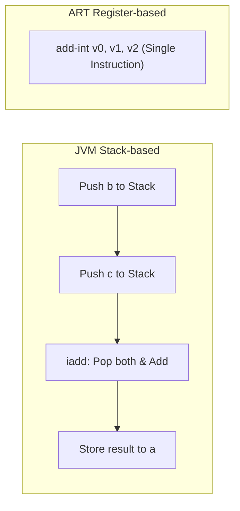
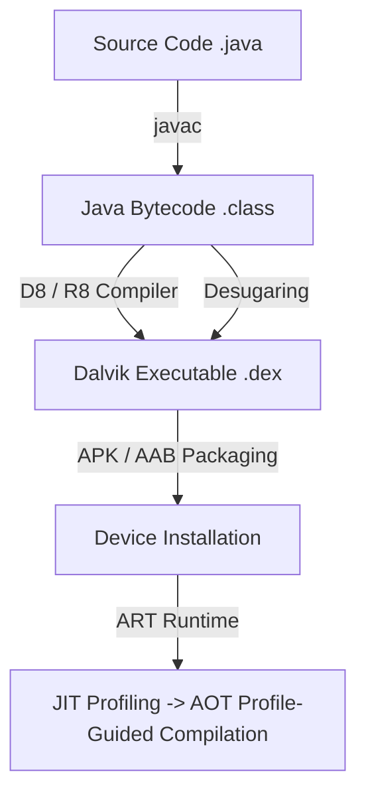
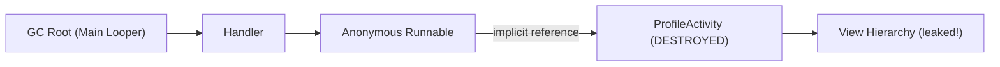
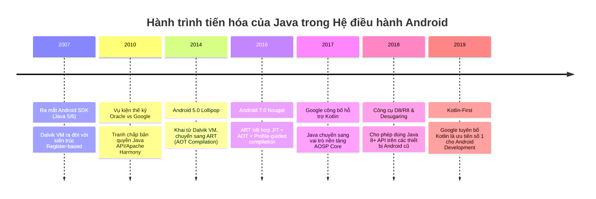

# Java Android trong Hệ sinh thái Android

## Vấn đề cần giải quyết

Khi Andy Rubin và nhóm sáng lập khởi chạy dự án Android năm 2003 (sau đó được Google mua lại năm 2005), hệ điều hành di động đối mặt với thách thức sinh tử: **Làm sao thu hút hàng triệu lập trình viên xây dựng ứng dụng trên một phần cứng cực kỳ giới hạn về RAM (16MB - 64MB) và CPU (200MHz)?**

Nếu Android chọn C/C++ làm ngôn ngữ ứng dụng chính:

- Tốc độ phát triển cực chậm, lập trình viên phải tự quản lý bộ nhớ (`malloc`/`free`), dẫn đến rủi ro crash ứng dụng tràn RAM (`Segmentation Fault`) liên tục.
- Ứng dụng phải biên dịch lại cho từng kiến trúc CPU (ARM, x86, MIPS), phá vỡ mục tiêu hệ sinh thái mở.

Năm 2007, Google chọn Java. Tuy nhiên, thay vì sử dụng tiêu chuẩn Java SE với Java Virtual Machine (JVM) của Sun Microsystems, Google đã tự thiết kế lại toàn bộ Execution Runtime bằng cách tạo ra **Dalvik VM** (sau này là **ART**).

Nếu không nắm vững Java Android bản chất:

- **Không thể đọc mã nguồn Android Framework (AOSP)**: 80% tầng Android OS Framework (`ActivityManagerService`, `WindowManagerService`, `PackageManagerService`) được viết bằng Java và C++.
- **Gặp thảm họa Rò rỉ bộ nhớ (Memory Leak)**: Các lớp ẩn danh (Anonymous Inner Class) và `Handler` trong Java tự động giữ một tham chiếu ngầm (`implicit reference`) tới Outer Class (Activity/Fragment), khiến Garbage Collector không thể thu hồi Activity khi đã destroyed.
- **Rủi ro Crash NullPointerException (NPE) khi Java-Kotlin Interop**: Khi Kotlin gọi code Java không có annotation `@Nullable`/`@NonNull`, Kotlin Compiler sẽ gán kiểu **Platform Type** (`T!`), vô hiệu hóa cơ chế Null Safety compile-time.

---

## Sau khi học xong

- Giải thích được luồng biên dịch Java từ bytecode `.class` qua D8/R8 sang register-based opcode `.dex` chạy trên ART.
- Phân biệt được sự khác biệt bản chất giữa Stack-based JVM và Register-based Dalvik/ART Virtual Machine.
- Xử lý được rò rỉ bộ nhớ (Memory Leak) tạo ra bởi Anonymous Inner Classes và Handler trong Java.
- Biết khi nào dùng Java Desugaring (`coreLibraryDesugaring`) để backport tính năng Java 8+ trên Android OS đời cũ.
- Phân biệt được Platform Types trong Java-Kotlin Interop để phòng tránh NullPointerException ở runtime.
- Cấu hình đúng Gradle `compileOptions` và `coreLibraryDesugaring` cho Java Android project.

---

## Java Android là gì?

**Java Android** là việc sử dụng ngôn ngữ lập trình Java kết hợp với **Android SDK (Software Development Kit)** để xây dựng ứng dụng di động chạy trên nền tảng Android.

Điểm mấu chốt cần hiểu: Java Android **không phải** Java SE (Standard Edition) chạy trên JVM thông thường.

### Mental Model: Java SE vs Java Android

| Đặc tính | Java SE (Desktop/Server) | Java Android |
| :--- | :--- | :--- |
| **Runtime** | JVM (Java Virtual Machine) | ART (Android Runtime) / Dalvik VM |
| **Kiến trúc VM** | Stack-based | Register-based |
| **Executable** | `.class` → `.jar` / `.war` | `.class` → `.dex` → `.apk` / `.aab` |
| **UI Framework** | `java.awt.*`, `javax.swing.*` | `android.widget.*`, `android.view.*` |
| **Thư viện chuẩn** | Full Java SE API | Subset của Java SE + Android SDK API |
| **Garbage Collector** | G1 GC, ZGC (high throughput) | Concurrent Copying GC (low latency, mobile-optimized) |

> **Lưu ý:** Khi nói "viết Java cho Android", thực chất bạn viết Java syntax, nhưng code sẽ chạy trên một runtime engine hoàn toàn khác biệt so với JVM trên máy tính.

---

## Cách hoạt động

### 1. Bản chất sự khác biệt: JVM (Stack-based) vs ART/Dalvik (Register-based)

Mô hình ảo hóa của Java Standard Edition (JVM) và Android Virtual Machine (ART/Dalvik) hoàn toàn khác biệt ở cấp độ kiến trúc phần cứng giả lập:

| Đặc tính | JVM (Java SE) | Dalvik / ART (Android) |
| :--- | :--- | :--- |
| **Kiến trúc VM** | **Stack-based** (Dựa trên Operand Stack) | **Register-based** (Dựa trên thanh ghi ảo) |
| **Định dạng Executable** | Nhiều tập tin `.class` phân tán | Một tập tin hợp nhất `classes.dex` |
| **Kích thước Opcode** | 1 Byte (256 instructions) | 16-bit / 32-bit variable length |
| **Số lượng lệnh thực thi** | Nhiều lệnh hơn (phải push/pop liên tục) | Ít hơn 30-50% số lệnh so với JVM |
| **Mức độ tiêu thụ RAM** | Cao (nhiều stack frame overhead) | Thấp (tối ưu cấu trúc dữ liệu cho Mobile) |

#### Tại sao Register-based nhanh hơn trên Mobile?

CPU thật sự trên điện thoại (ARM) sử dụng kiến trúc register. Khi Virtual Machine cũng dùng register-based instructions, việc mapping từ virtual register sang physical register sẽ hiệu quả hơn, giảm số lần truy cập bộ nhớ stack.

#### So sánh Bytecode cấp độ Assembly: Phép cộng `a = b + c`

- **JVM (Stack-based Execution)**:

```bytecode
iload_1          ; Push giá trị b vào Operand Stack
iload_2          ; Push giá trị c vào Operand Stack
iadd             ; Pop 2 giá trị, cộng lại, push kết quả vào Stack
istore_3         ; Pop kết quả từ Stack lưu vào biến a (slot 3)
```

*(Cần 4 câu lệnh và 4 lần truy cập bộ nhớ stack)*

- **Dalvik / ART (Register-based Execution)**:

```bytecode
add-int v0, v1, v2   ; Lấy thanh ghi v1 + v2, ghi trực tiếp kết quả vào thanh ghi v0
```

*(Chỉ cần 1 câu lệnh đơn duy nhất — tiết kiệm CPU cycles và băng thông bộ nhớ)*



---

### 2. Luồng biên dịch Android Java: Từ `.java` đến `.dex`

Quá trình dịch code Java trên Android không dừng lại ở tệp `.class` như trên máy tính thông thường:



1. **`javac` (Java Compiler)**: Biên dịch mã nguồn `.java` thành Java Bytecode tiêu chuẩn `.class`. Bước này giống hệt Java SE.
2. **D8 / R8 Compiler**:
   - **D8**: Đọc các tệp `.class`, gộp toàn bộ Constant Pools trùng lặp từ hàng trăm class thành một Constant Pool duy nhất. Chuyển đổi từ Stack-based instructions sang Register-based Dalvik Bytecode (`.dex`).
   - **R8**: Thay thế ProGuard, thực hiện toàn bộ chức năng của D8 cộng thêm code shrinking (loại bỏ code không dùng), obfuscation (đổi tên class/method) và optimization.
3. **Desugaring**: Chuyển đổi các tính năng cú pháp Java 8+ thành bytecode tương thích với các Android OS cũ hơn. Xem chi tiết phần bên dưới.

---

### 3. Java Desugaring — Backport Java 8+ cho Android cũ

#### Vấn đề: API Level Fragmentation

Android có hàng trăm phiên bản OS đang hoạt động đồng thời. Thiết bị chạy Android 5.0 (API 21) không có sẵn các class như `java.time.LocalDate` hay `java.util.stream.Stream` — những API chỉ tồn tại trên JVM 8+ nhưng chưa được đưa vào Android runtime cũ.

#### Hai tầng Desugaring

**Tầng 1 — Syntactic Desugaring (D8 tự xử lý):**

Chuyển đổi cú pháp Java 8 thành bytecode tương đương mà Android runtime cũ hiểu được:

| Tính năng Java 8+ | Cách D8 desugar |
| :--- | :--- |
| Lambda expressions | Sinh ra anonymous inner class tương đương |
| Method references | Chuyển thành static method call |
| Default interface methods | Copy method body vào implementing class |
| `try-with-resources` | Chuyển thành `try-finally` block |

**Tầng 2 — Core Library Desugaring (cần cấu hình thêm):**

Backport toàn bộ **Java 8+ API** (`java.time.*`, `java.util.stream.*`, `java.util.Optional`) cho thiết bị cũ bằng cách nhúng một thư viện hỗ trợ vào APK:

```groovy
// build.gradle (Module: app)
android {
    compileOptions {
        // Cho phép dùng cú pháp Java 8 trong source code
        sourceCompatibility JavaVersion.VERSION_1_8
        targetCompatibility JavaVersion.VERSION_1_8
        // BẬT Core Library Desugaring
        coreLibraryDesugaringEnabled true
    }
}

dependencies {
    // Thư viện backport java.time, java.util.stream cho API < 26
    coreLibraryDesugaring 'com.android.tools:desugar_jdk_libs:2.1.4'
}
```

> **Cảnh báo:** Nếu không bật `coreLibraryDesugaringEnabled` mà gọi `java.time.LocalDate.now()` trên thiết bị Android 7.0 (API 24) trở xuống, ứng dụng sẽ crash với `NoClassDefFoundError` ngay khi runtime cố tìm class `LocalDate`.

---

### 4. ART Runtime Execution

Khi ứng dụng được cài đặt và chạy trên thiết bị, ART thực thi `.dex` bytecode qua cơ chế kết hợp:

#### Dalvik VM (Android 1.0 — 4.4): JIT thuần túy

- **JIT (Just-In-Time)**: Mỗi lần chạy, Dalvik VM biên dịch bytecode `.dex` sang mã máy (native code) ngay tại thời điểm thực thi.
- **Nhược điểm**: Tốn CPU và pin mỗi lần khởi chạy app. App mở chậm.

#### ART (Android 5.0+): AOT + JIT + Profile-Guided

- **AOT (Ahead-Of-Time)**: Khi cài đặt app, ART biên dịch toàn bộ `.dex` thành mã máy (`.oat` / `.art` files). App mở nhanh hơn vì code đã sẵn sàng.
- **JIT (Android 7.0+)**: ART kết hợp lại JIT để giảm thời gian cài đặt. JIT biên dịch các đoạn code "hot" (chạy thường xuyên) và ghi lại **profile**.
- **Profile-Guided Compilation**: Dựa trên profile thu thập từ JIT, ART biên dịch AOT chỉ những method thực sự được dùng (khi thiết bị idle và đang sạc). Kết quả: app mở nhanh mà không tốn bộ nhớ cho code không bao giờ chạy.

#### ART Garbage Collector

ART sử dụng **Concurrent Copying GC** được thiết kế riêng cho mobile:

- **Concurrent**: GC chạy song song với application threads, giảm thiểu Stop-The-World pause (thường < 1ms).
- **Generational**: Chia Heap thành Young Generation (đối tượng mới, thu hồi thường xuyên) và Old Generation (đối tượng sống lâu, thu hồi ít hơn).
- **Compacting**: Sau khi thu hồi, GC dồn các object lại gần nhau để giảm memory fragmentation — quan trọng trên thiết bị có RAM hạn chế.

---

## Ví dụ thực tế

### 1. Thảm họa Memory Leak với Implicit Outer Reference trong Java

Trong Java, mọi **Non-Static Inner Class** và **Anonymous Inner Class** luôn âm thầm giữ một pointer `OuterClass.this`.

```java
// ❌ BAD PRACTICE: Gây rò rỉ bộ nhớ Activity nghiêm trọng!
public class ProfileActivity extends AppCompatActivity {

    @Override
    protected void onCreate(Bundle savedInstanceState) {
        super.onCreate(savedInstanceState);
        setContentView(R.layout.activity_profile);

        // Anonymous Runnable giữ ngầm định tham chiếu đến ProfileActivity.this
        new Handler(Looper.getMainLooper()).postDelayed(new Runnable() {
            @Override
            public void run() {
                // Giả định tác vụ chạy sau 10 giây
                updateUI();
            }
        }, 10000);
    }

    private void updateUI() {
        // ...
    }
}
```

#### Điều gì xảy ra dưới bộ nhớ khi người dùng xoay màn hình?

1. Người dùng bấm Back hoặc xoay màn hình sau 1 giây.
2. Android OS gọi `onDestroy()` trên `ProfileActivity`.
3. Tuy nhiên, `Handler` trong `Looper` vẫn giữ `Runnable`. `Runnable` lại giữ ngầm `ProfileActivity.this`.
4. **Garbage Collector (GC)** duyệt cây đối tượng (GC Root) → Thấy `ProfileActivity` vẫn được tham chiếu → **Không thể thu hồi memory!**
5. Kết quả: Toàn bộ View Hierarchy (RAM vài MB đến vài chục MB) bị kẹt lại trong bộ nhớ.



#### Giải pháp chuẩn: Static Inner Class + WeakReference

```java
// ✅ GOOD PRACTICE: Giải phóng hoàn toàn Memory Leak
public class ProfileActivity extends AppCompatActivity {

    private final MyHandler mHandler = new MyHandler(this);

    @Override
    protected void onDestroy() {
        super.onDestroy();
        // Hủy toàn bộ pending messages khi Activity bị destroy
        mHandler.removeCallbacksAndMessages(null);
    }

    // Static Inner Class KHÔNG giữ implicit reference tới Outer Class
    private static class MyHandler extends Handler {
        private final WeakReference<ProfileActivity> mActivityRef;

        MyHandler(ProfileActivity activity) {
            super(Looper.getMainLooper());
            mActivityRef = new WeakReference<>(activity);
        }

        @Override
        public void handleMessage(Message msg) {
            ProfileActivity activity = mActivityRef.get();
            if (activity != null && !activity.isFinishing() && !activity.isDestroyed()) {
                activity.updateUI();
            }
        }
    }

    private void updateUI() {
        // Safe UI Update
    }
}
```

**Tại sao giải pháp này hoạt động:**

- `static class` không giữ implicit reference tới `ProfileActivity`.
- `WeakReference` cho phép GC thu hồi `ProfileActivity` bất kỳ lúc nào.
- `removeCallbacksAndMessages(null)` dọn dẹp message queue khi Activity bị destroy.

---

### 2. Cạm bẫy Java-Kotlin Interop: Platform Types & Nullability

Khi gọi mã Java từ Kotlin, nếu mã Java không được đánh dấu Annotation Nullability:

```java
// Java Repository (Legacy) — KHÔNG CÓ ANNOTATION
public class UserRepository {
    public String getUserName(int userId) {
        if (userId <= 0) return null;
        return "Alex";
    }
}
```

```kotlin
// Kotlin Code
val repo = UserRepository()
// Kotlin gán kiểu cho name là "String!" (Platform Type)
val name = repo.getUserName(-1)

// Kotlin Compiler KHÔNG bắt buộc check null compile-time!
// Runtime crash lập tức với NullPointerException tại line này!
println(name.length)
```

#### Tại sao Platform Type nguy hiểm?

Khi Kotlin nhìn thấy `String!` (Platform Type), nó **không biết** giá trị có thể null hay không. Kotlin Compiler sẽ:

- Không báo lỗi compile-time.
- Không ép bạn check null.
- Âm thầm cho bạn gọi `.length` như thể biến đó không bao giờ null.

Kết quả: `NullPointerException` xảy ra ở runtime — đúng cái thảm họa mà Kotlin hứa hẹn giúp bạn tránh.

#### Giải pháp khắc phục tại tầng Java

Bắt buộc bổ sung Nullability Annotations (`@Nullable` / `@NonNull` từ `androidx.annotation`):

```java
import androidx.annotation.NonNull;
import androidx.annotation.Nullable;

public class UserRepository {
    @Nullable // Giúp Kotlin Compiler hiểu chính xác kiểu dữ liệu là String?
    public String getUserName(int userId) {
        if (userId <= 0) return null;
        return "Alex";
    }

    @NonNull // Kotlin hiểu đây là String (không nullable)
    public String getDefaultName() {
        return "Guest";
    }
}
```

Sau khi thêm annotation, Kotlin sẽ hiểu:
- `getUserName()` → trả về `String?` → buộc check null.
- `getDefaultName()` → trả về `String` → an toàn.

---

### 3. Cấu hình Gradle cho Java Android Project

```groovy
// build.gradle (Module: app)
plugins {
    id 'com.android.application'
}

android {
    namespace 'com.example.myapp'
    compileSdk 34

    defaultConfig {
        applicationId "com.example.myapp"
        minSdk 21
        targetSdk 34
        // Bật Multidex nếu app lớn (> 64K methods)
        multiDexEnabled true
    }

    compileOptions {
        // Java 8 source/target (bắt buộc cho Lambda, Method Reference)
        sourceCompatibility JavaVersion.VERSION_1_8
        targetCompatibility JavaVersion.VERSION_1_8
        // Backport java.time, java.util.stream cho API < 26
        coreLibraryDesugaringEnabled true
    }
}

dependencies {
    coreLibraryDesugaring 'com.android.tools:desugar_jdk_libs:2.1.4'

    implementation 'androidx.appcompat:appcompat:1.7.0'
    // Nullability Annotations cho Java-Kotlin Interop
    implementation 'androidx.annotation:annotation:1.9.1'
}
```

---

## Sai lầm thường gặp

1. **Cho rằng Java trên Android giống hệt Java SE trên PC**:
   - Android Java **không có** thư viện GUI AWT/Swing.
   - Android Java **không chạy** tập tin `.jar` trực tiếp mà phải chuyển đổi qua bytecode `.dex`.
   - Android Runtime sử dụng cơ chế Garbage Collection riêng (Concurrent Copying GC) được tinh chỉnh cho độ trễ di động.

2. **Lạm dụng Anonymous Callbacks cho Network/Async Tasks**:
   - Sử dụng Java `Thread` hoặc `AsyncTask` (đã bị deprecated từ API 30) bằng anonymous class trong Activity dẫn tới Memory Leak và Crash khi Activity bị recreate.

3. **Bỏ qua Java Desugaring khi cấu hình Gradle**:
   - Không bật `coreLibraryDesugaringEnabled` trong `build.gradle` khiến ứng dụng bị crash `NoClassDefFoundError` khi gọi các hàm Java 8+ (`java.time.LocalDate`) trên các thiết bị Android 7.0 (API 24) trở xuống.

4. **Không thêm Nullability Annotations khi viết Java API**:
   - Gây Platform Types khi Kotlin gọi vào, dẫn đến `NullPointerException` ở runtime — đặc biệt nguy hiểm trong dự án mixed Java/Kotlin.

5. **Sử dụng Java `Serializable` thay vì `Parcelable`**:
   - `Serializable` dùng reflection, chậm gấp 10 lần so với `Parcelable` trên Android. Trong truyền dữ liệu qua `Intent` hoặc `Bundle`, luôn ưu tiên `Parcelable`.

6. **Giữ reference tới Context trong Singleton hoặc static field**:
   - Lưu `Activity` context vào `static` variable sẽ giữ toàn bộ Activity trong bộ nhớ vĩnh viễn. Luôn dùng `applicationContext` khi cần context trong singleton.

---

## Trade-offs khi chọn Java cho Android

### Ưu điểm

- **Tốc độ biên dịch nhanh**: Java compiler đơn giản hơn Kotlin compiler (ít bước static analysis và metadata generation hơn). Trong các dự án lớn, incremental build Java có thể nhanh hơn.
- **Tương thích 100% với AOSP**: Toàn bộ Android SDK, System Services và mã nguồn mở AOSP đều viết bằng Java. Đọc và debug framework code rất tự nhiên.
- **Tài nguyên học tập phong phú**: Hàng triệu hướng dẫn, ví dụ, và thư viện Java Android tích lũy từ 2007.
- **Không cần migration cost**: Các dự án legacy Java lớn không cần chi phí chuyển đổi sang Kotlin.

### Nhược điểm

- **Cú pháp dài dòng (Boilerplate)**: Phải viết Getters, Setters, `equals()`, `hashCode()`, `toString()` thủ công. Kotlin giải quyết bằng `data class`.
- **Thiếu tính năng hiện đại**: Không có Coroutines, Extension Functions, Smart Casts, Sealed Classes, hay Immutable Data Classes.
- **Null Safety hoàn toàn không có**: Mọi reference type đều có thể null. Phải tự kiểm tra `if (obj != null)` thủ công.
- **Không còn là ưu tiên của Google**: Từ 2019, tài liệu chính thức, Jetpack libraries, và code samples đều ưu tiên Kotlin. Compose chỉ hỗ trợ Kotlin.

### So sánh nhanh Java vs Kotlin trên Android

| Tiêu chí | Java | Kotlin |
| :--- | :--- | :--- |
| **Null Safety** | Không có (mọi biến có thể null) | Có (`String` vs `String?`) |
| **Coroutines** | Không (phải dùng Thread/RxJava) | Có (structured concurrency) |
| **Data Class** | Viết thủ công 50+ dòng | 1 dòng `data class User(...)` |
| **Extension Functions** | Không | Có |
| **Jetpack Compose** | Không hỗ trợ | Hỗ trợ đầy đủ |
| **Google khuyến nghị** | Legacy support | First-class, Kotlin-first |
| **Build Speed** | Nhanh hơn | Chậm hơn (do KAPT/KSP) |
| **AOSP Compatibility** | 100% | 100% (interop) |

---

## Lịch sử phát triển



| Phiên bản Android | Java hỗ trợ | Runtime Engine | Đặc điểm nổi bật |
| :--- | :--- | :--- | :--- |
| Android 1.0 — 4.4 | Java 5 / 6 | Dalvik VM | JIT Compilation, kiến trúc Bytecode `.dex` |
| Android 5.0 — 6.0 | Java 7 | ART | Giới thiệu ART với AOT Ahead-Of-Time compilation |
| Android 7.0 — 11 | Java 8 (Desugaring) | ART (JIT + AOT) | Hỗ trợ Lambda, Stream API qua D8 desugaring |
| Android 12 — 15+ | Java 11 / 17 | ART Core Modularized | Cập nhật ART độc lập qua Google Play System Updates |

---

## Edge Cases

### Multidex: Giới hạn 64K Methods

Mỗi file `.dex` chỉ có thể tham chiếu tối đa 65,536 methods (bao gồm cả mã ứng dụng và thư viện Java). Khi vượt quá:

- Build tool tự động tách ra nhiều file `.dex` (`classes.dex`, `classes2.dex`, `classes3.dex`).
- Trên Android 5.0+ (ART): Multidex được hỗ trợ native, không cần cấu hình thêm.
- Trên Android 4.4 trở xuống (Dalvik): Cần thêm `androidx.multidex:multidex` và extends `MultiDexApplication`. App khởi động chậm hơn do phải load nhiều `.dex` files.

### ProGuard/R8 loại bỏ quá nhiều code

Khi bật minification bằng R8, nếu không cấu hình `proguard-rules.pro` đúng cách, R8 có thể xóa các class/method được gọi qua reflection (như JSON serialization, JNI calls), gây crash `ClassNotFoundException` ở runtime.

---

## Kết nối hệ thống

- **Prerequisites**: Cấu trúc hệ điều hành máy tính cơ bản (Stack vs Heap memory, Process, Thread).
- **Related Topics**:
  - `android.languages.kotlin`: Ngôn ngữ First-Class kế thừa và tương tác trực tiếp với Java.
  - `android.languages.jni`: Cầu nối giữa Java/ART với mã nguồn C/C++.
  - `android.output_packages.apk_files`: Nơi chứa tập tin `classes.dex` sau khi biên dịch Java.
- **Downstream Topics**:
  - `android.component.activity.lifecycle`: Nơi các sự kiện vắng bóng Java Object references cần được dọn dẹp để tránh Memory Leak.

---

## Developer Curiosity Checklist

1. **Why was this created?** Để mang lại ngôn ngữ hướng đối tượng an toàn bộ nhớ, đa nền tảng cho hệ điều hành di động mở đầu tiên năm 2007.
2. **What problem does it solve?** Giải quyết rủi ro Memory Leak thủ công (`malloc`/`free`) của C/C++ và khả năng portable trên nhiều phần cứng.
3. **What happens if it doesn't exist?** Android Framework (AOSP) không có tầng ngôn ngữ cấp cao để kết nối các driver C/C++ kernel với ứng dụng người dùng.
4. **How does Android implement it internally?** Biên dịch qua `javac` → `.class` → `D8/R8` → `.dex` (Register-based instructions) → Chạy trên ART với JIT/AOT profile compilation.
5. **What misconceptions do developers have?** Nghĩ Java Android chạy trên JVM tiêu chuẩn và giống hệt Java SE.
6. **What trade-offs does it introduce?** Tốn tài nguyên RAM cho Garbage Collector so với Native C/C++, nhưng phát triển nhanh hơn. Kotlin hiện đại hơn nhưng Java vẫn cần cho AOSP và legacy code.
7. **What are the edge cases?** Chạm ngưỡng 64K Method Limit trong file `.dex` và lỗi `NoClassDefFoundError` do thiếu Desugaring.
8. **What are the real-world problems developers encounter?** Rò rỉ bộ nhớ Activity qua Anonymous Handlers và NullPointerExceptions khi interop với Kotlin.
9. **How is it connected to the Android system?** Là ngôn ngữ gốc của toàn bộ AOSP System Services (`AMS`, `WMS`, `PMS`).
10. **What should developers learn next?** Chuyển dịch lên `android.languages.kotlin` để khai thác Null Safety và Coroutines.
