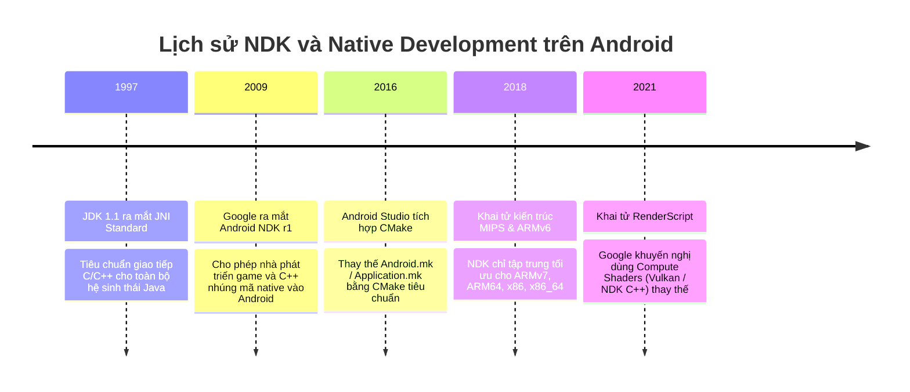

# JNI & C/C++ Native Code trong Android

## Vấn đề cần giải quyết

Mặc dù Kotlin và Java giải quyết 95% nhu cầu phát triển ứng dụng di động thông thường, Android vẫn phải xử lý những bài toán kỹ thuật cận kề phần cứng:

1. **Xử lý tính toán cực nặng (High-Performance Computing)**: Xử lý video/hình ảnh thời gian thực (OpenCV, FFmpeg), Game Engines 3D (Unreal Engine, Unity, Custom C++ Engine), AI/ML Inference (TensorFlow Lite C++ API, ONNX Runtime). Nếu chạy các tác vụ này trên Managed Runtime (ART), Garbage Collector (GC) sẽ bị quá tải, gây ra hiện tượng khựng khung hình (UI Jank / Frame Drops).
2. **Tái sử dụng Thư viện C/C++ Legacy khổng lồ**: Hàng ngàn thư viện mã nguồn mở C/C++ chuẩn ngành đã được tối ưu hóa qua hàng chục năm (OpenSSL, SQLite, WebRTC, FFmpeg). Việc viết lại toàn bộ bằng Kotlin/Java là bất khả thi và lãng phí.
3. **Bảo vệ Sở hữu Trí tuệ (IP Protection)**: Java/Kotlin Bytecode trong file `.dex` rất dễ bị decompile ngược thành mã nguồn gần như nguyên bản bằng các công cụ như `jadx`. Mã C/C++ được biên dịch trực tiếp ra **Native Machine Code** (`.so` shared library) cực kỳ khó bị Reverse Engineering.

Nếu không nắm vững JNI:
- **Crash ngắt ngập Production (Signal 11 / SIGSEGV)**: Lỗi truy cập bộ nhớ sai trong C/C++ sẽ giết chết toàn bộ Linux Process của Android ngay lập tức. Cơ chế `try-catch` của Java/Kotlin hoàn toàn bất lực.
- **Tràn Local Reference Table (Crash 512 entries limit)**: Gọi hàm Native trong vòng lặp tạo ra hàng ngàn `jobject` mà không giải phóng thủ công sẽ làm tràn bảng tham chiếu cục bộ JNI.

---

## Sau khi học xong

- Giải thích được kiến trúc Java Native Interface (JNI) và chi phí chuyển đổi ngữ cảnh (Context Switching Overhead) giữa Managed Heap và Native Heap.
- Phân biệt được cơ chế đăng ký hàm Native tĩnh (Name Mangling) và đăng ký hàm động (RegisterNatives).
- Xử lý được rò rỉ bộ nhớ JNI Reference Leaks (Local Reference Table limit 512 entries vs Global Reference).
- Triển khai được liên kết mã nguồn C/C++ với Android NDK và CMake trong môi trường Android Studio.

---

## Lịch sử phát triển



---

## Cách hoạt động

### 1. Kiến trúc phân tách bộ nhớ: Managed Heap vs Native Heap

Ứng dụng Android chạy mã Native tồn tại hai vùng bộ nhớ hoàn toàn độc lập:

```mermaid
flowchart TD
    subgraph ManagedHeap [MANAGED HEAP (ART / JVM)]
        direction TB
        A[Kotlin / Java Objects]
        B[Managed Garbage Collector]
    end

    subgraph JNIBoundary [JNI BOUNDARY - Java Native Interface]
        direction TB
        C["JNIEnv* Dispatch Table (Per-Thread)"]
        D["Local / Global Reference Tables"]
    end

    subgraph NativeHeap [NATIVE HEAP (C / C++)]
        direction TB
        E[C/C++ Shared Objects .so]
        F[Manual Memory: malloc/free, new/delete]
    end

    ManagedHeap <--> JNIBoundary <--> NativeHeap
```

- **Managed Heap**: Do ART quản lý. Garbage Collector tự động di chuyển đối tượng để dọn dẹp phân mảnh bộ nhớ (Compacting GC).
- **Native Heap**: Do C/C++ quản lý trực tiếp thông qua hệ thống `malloc()` / `free()`. ART GC không thể can thiệp hay thu hồi vùng nhớ này!

---

### 2. Chi phí JNI Call Overhead (Trampoline Effect)

Gọi một hàm Native qua JNI **KHÔNG KHÁC GÌ** gọi một System Call đắt đỏ. 

Khi thực thi `external fun nativeMethod()`:
1. ART phải dừng thực thi Dalvik Bytecode, lưu lại các thanh ghi CPU hiện tại của thread Java.
2. Chuyển đổi tham số Java (`jstring`, `jobjectArray`) sang dạng con trỏ C/C++ JNI (`jstring`, `jobject`).
3. Chuyển trạng thái Thread sang **Native State** (để GC biết không quét thread này khi thực thi GC).
4. Nhảy tới địa chỉ bộ nhớ của C++ function.
5. Khi C++ hoàn thành, thực hiện luồng ngược lại để quay về Managed State.

> **Chi phí thực tế**: Một cuộc gọi JNI đắt gấp **10 - 50 lần** so với một hàm gọi nội bộ trong Java/Kotlin! Nếu bạn gọi hàm JNI $10,000$ lần bên trong một vòng lặp `for`, ứng dụng sẽ bị khựng UI ngay lập tức.

---

### 3. Đăng ký hàm Native: Tĩnh (Name Mangling) vs Động (`RegisterNatives`)

#### Cách 1: Đăng ký Tĩnh (Name Mangling Rules)
ART tự động tìm kiếm hàm C++ theo quy tắc tên dài ngoằng:
`Java_<full_package_name>_<class_name>_<method_name>`

```cpp
// C++ Code (Tĩnh)
extern "C" JNIEXPORT jstring JNICALL
Java_com_example_app_MainActivity_stringFromJNI(JNIEnv* env, jobject thiz) {
    return env->NewStringUTF("Hello from C++");
}
```
*Nhược điểm*: Tên hàm cực kỳ dài, dễ lộ cấu trúc package khi bị reverse engineering, và ART phải mất thời gian tra cứu chuỗi (`dlsym`) trong lần gọi đầu tiên.

#### Cách 2: Đăng ký Động với `RegisterNatives` (Tối ưu sản xuất)
Đăng ký trực tiếp con trỏ hàm C++ với ART khi thư viện `.so` được load (`JNI_OnLoad`):

```cpp
// C++ Code (Động - Sản xuất)
static jstring native_getMessage(JNIEnv* env, jobject thiz) {
    return env->NewStringUTF("Dynamic Registered Native String");
}

static JNINativeMethod gMethods[] = {
    {"getMessageFromNative", "()Ljava/lang/String;", (void*)native_getMessage}
};

JNIEXPORT jint JNICALL JNI_OnLoad(JavaVM* vm, void* reserved) {
    JNIEnv* env;
    if (vm->GetEnv((void**)&env, JNI_VERSION_1_6) != JNI_OK) return JNI_ERR;
    
    jclass clazz = env->FindClass("com/example/app/MainActivity");
    env->RegisterNatives(clazz, gMethods, 1); // Đăng ký trực tiếp con trỏ hàm
    return JNI_VERSION_1_6;
}
```
*Ưu điểm*: Tốc độ thực thi cực nhanh, tên hàm C++ tùy ý, bảo mật tối đa.

---

## Ví dụ thực tế

### Thảm họa Tràn Bảng Tham Chiếu Cục Bộ (Local Reference Table Leak)

Khi C++ tạo ra một đối tượng Java (ví dụ: `env->NewStringUTF()`), ART sẽ lưu đối tượng đó vào **Local Reference Table** của thread hiện tại.

Bảng này có giới hạn cứng **512 entries** trên Android!

```cpp
// BAD PRACTICE: Tràn Local Reference Table làm Crash App!
extern "C" JNIEXPORT void JNICALL
Java_com_example_app_ImageProcessor_processBatch(JNIEnv* env, jobject thiz, jobjectArray images) {
    for (int i = 0; i < 1000; i++) {
        // Mỗi vòng lặp tạo 1 jstring mới trong Local Ref Table
        jstring str = env->NewStringUTF("Processing frame...");
        
        // Làm gì đó với str...

        // KHÔNG GIẢI PHÓNG!
        // Đến vòng lặp thứ 512 -> CRASH: JNI ERROR (app bug): local reference table overflow (max=512)
    }
}
```

#### Giải pháp chuẩn: Giải phóng `DeleteLocalRef` thủ công trong vòng lặp

```cpp
// GOOD PRACTICE: Tối ưu bộ nhớ JNI Reference
extern "C" JNIEXPORT void JNICALL
Java_com_example_app_ImageProcessor_processBatch(JNIEnv* env, jobject thiz, jobjectArray images) {
    for (int i = 0; i < 1000; i++) {
        jstring str = env->NewStringUTF("Processing frame...");
        
        // Thao tác với str...

        // GIẢI PHÓNG NGAY LẬP TỨC TRONG VÒNG LẶP
        env->DeleteLocalRef(str);
    }
}
```

---

## Sai lầm thường gặp

1. **Nghĩ rằng viết C/C++ luôn làm app chạy nhanh hơn**:
   - Viết thuật toán đơn giản bằng C++ rồi gọi liên tục qua JNI sẽ **chậm hơn** viết 100% bằng Kotlin do chi phí JNI Call Overhead quá lớn.

2. **Dùng chung con trỏ `JNIEnv*` trên nhiều Threads**:
   - `JNIEnv*` chỉ có hiệu lực trên **đúng Thread mà nó được tạo ra**. Nếu truyền `JNIEnv*` từ Thread A sang Thread B để gọi Java method -> App crash ngay lập tức!
   - *Giải pháp*: Dùng `JavaVM*` (thread-safe toàn cục) để gọi `AttachCurrentThread()` trên Thread B.

3. **Quên giải phóng bộ nhớ `malloc` / `new` trong C++**:
   - GC của Android **hoàn toàn vô hình** với Native Heap. Nếu C++ cấp phát bộ nhớ mà không `free()`, RAM của thiết bị sẽ phình to cho đến khi bị hệ điều hành Android gõ đầu tiêu diệt (`OOM Killer`).

---

## Trade-offs và Edge Cases

### Trade-offs
- **Độ phức tạp dự án**: Phải duy trì toolchain NDK, CMake, hỗ trợ nhiều ABI (`arm64-v8a`, `armeabi-v7a`, `x86_64`), khiến thời gian build app tăng lên rõ rệt.
- **Kích thước APK**: Mỗi tập tin thư viện chia sẻ `.so` biên dịch cho 4 kiến trúc CPU sẽ làm phình dung lượng APK đáng kể (nếu không dùng Android App Bundle - AAB).

### Edge Cases
- **Signal 11 / SIGSEGV Crash**: Lỗi Dangling Pointer hoặc Null Pointer trong C++ sẽ bắn ra Signal `SIGSEGV`. Lỗi này bypass hoàn toàn tầng Exception của JVM/ART. Bạn phải dùng công cụ như `ndk-stack` hoặc `addr2line` đọc file Tombstone trong `/data/tombstones` để debug.

---

## Kết nối hệ thống

- **Prerequisites**: `android.languages.java_android`, `android.languages.kotlin` (Hiểu về Managed Memory và ClassLoader).
- **Related Topics**:
  - `android.output_packages.apk_files`: Nơi lưu trữ các thư viện `.so` trong thư mục `lib/<abi>/`.
  - `android.output_packages.aab_files`: Cơ chế ABI Splits tự động lọc đúng file `.so` phù hợp cho thiết bị.
- **Downstream Topics**:
  - `android.system.hardware_architecture`: Tương tác với CPU Architectures (ARMv8 Neon instructions, Vulkan Graphics API).

---

## Developer Curiosity Checklist

1. **Why was this created?** Để cho phép Java/Kotlin ứng dụng gọi trực tiếp các thư viện C/C++ native hiệu năng cao và tương tác với phần cứng.
2. **What problem does it solve?** Giải quyết giới hạn tốc độ tính toán xử lý ảnh/video/AI và khả năng tái sử dụng kho mã nguồn C/C++ của nhân loại.
3. **What happens if it doesn't exist?** Android không thể chạy được các Game Engine 3D phức tạp (Unreal/Unity) hay các ứng dụng xử lý media nặng.
4. **How does Android implement it internally?** Thông qua bảng con trỏ `JNIEnv*` per-thread, chuyển đổi state thread Managed/Native và liên kết động qua `dlopen`/`dlsym`.
5. **What misconceptions do developers have?** Tưởng mã Native C++ luôn nhanh hơn Kotlin (bỏ qua chi phí JNI Overhead rất lớn).
6. **What trade-offs does it introduce?** Tăng độ phức tạp build, tăng dung lượng APK và rủi ro crash đứt đoạn process do SIGSEGV.
7. **What are the edge cases?** Tràn bảng Local Reference Table 512 entries và lỗi truyền `JNIEnv*` giữa các threads khác nhau.
8. **What are the real-world problems developers encounter?** Rò rỉ bộ nhớ Native Heap và không thể catch lỗi crash Native bằng Java try-catch.
9. **How is it connected to the Android system?** Toàn bộ thư viện Android Core Runtime (`libart.so`, `libgui.so`, `libmedia.so`) được viết bằng C/C++ và kết nối qua JNI.
10. **What should developers learn next?** Chuyển sang `android.output_packages.apk_files` để hiểu cách đóng gói các tệp `.so` và `.dex` vào ứng dụng.
