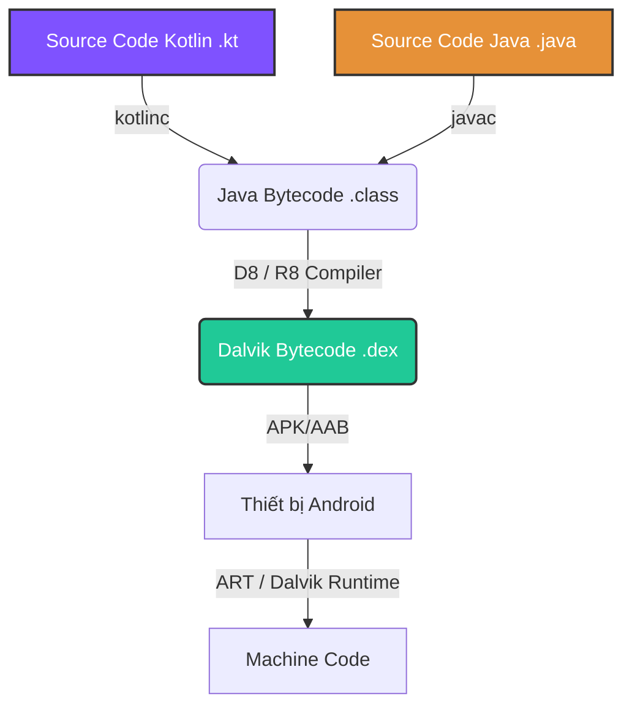

# Kotlin trong Android

Kotlin hiện tại là ngôn ngữ ưu tiên số một (Kotlin-First) để phát triển ứng dụng Android. Nó giải quyết những hạn chế của Java (NullPointerException, Boilerplate code, Concurrency phức tạp) trong khi vẫn tương thích 100% với hệ sinh thái Java cũ.

Tuy nhiên, với tư cách là một Android Developer, bạn không chỉ cần học cú pháp, mà cần hiểu **Kotlin thực sự chạy như thế nào trong môi trường Android**, tại sao nó an toàn hơn, và nó đánh đổi điều gì.

---

## 1. Bản chất: Kotlin chạy như thế nào trên Android?

Một trong những lầm tưởng phổ biến nhất là: *"Kotlin chạy trên một máy ảo Kotlin riêng"* hoặc *"Android có một hệ điều hành mới dành cho Kotlin"*. 

Thực tế: **Không hề có máy ảo Kotlin riêng biệt trên Android**. Kotlin (trên Android) chia sẻ chung nền tảng Runtime (ART) hoàn toàn giống như Java.

### Trình biên dịch (Kotlinc) là chìa khóa

Sự khác biệt lớn nhất giữa Kotlin và Java nằm ở **Trình biên dịch (Compiler)**. Trình biên dịch `kotlinc` đóng vai trò chuyển mã nguồn Kotlin (`.kt`) thành mã Bytecode tiêu chuẩn của Java (`.class`).



**Tại sao điều này quan trọng?**
Bởi vì `kotlinc` biên dịch ra mã tương thích với JVM, nên Android (Dalvik/ART) không cần biết mã gốc được viết bằng Kotlin hay Java. ART chỉ đọc và chạy file `.dex`. Nhờ thiết kế này:
1. Bạn có thể sử dụng tất cả các thư viện viết bằng Java trong project Kotlin.
2. Không cần thiết bị người dùng phải cập nhật Android OS mới nhất để chạy được Kotlin.
3. Kích thước APK không bị đội lên quá lớn (chỉ tăng một chút do kèm theo Kotlin Standard Library).

---

## 2. Kotlin giải quyết vấn đề gì của Java?

### 2.1. Null Safety (Loại bỏ Billion Dollar Mistake)

Lỗi phổ biến nhất làm crash app Android viết bằng Java là `NullPointerException` (NPE). Trong Java, bất kỳ Object nào cũng có thể là `null`.

**Kotlin giải quyết bằng cách nào?**
Kotlin bắt buộc bạn phải khai báo rõ ràng một biến có thể `null` hay không ngay ở cấp độ ngôn ngữ. Nếu một biến không được đánh dấu `?`, **Compiler sẽ không cho phép bạn gán `null` vào nó**.

```kotlin
var name: String = "John"
// name = null // Compiler Error: Null can not be a value of a non-null type String

var nullableName: String? = "John"
nullableName = null // Hợp lệ
```

> [!NOTE] Cơ chế đằng sau Null Safety
> Khi biên dịch sang Java Bytecode, biến Kotlin không-thể-null (`String`) sẽ được `kotlinc` dịch thành biến Java bình thường kèm theo Annotation `@NotNull`. Còn biến có-thể-null (`String?`) được dịch thành `@Nullable`. 
> Đồng thời, compiler sẽ tự động chèn các câu lệnh kiểm tra (ví dụ: `Intrinsics.checkNotNullParameter(...)`) vào đầu hàm để ném ra ngoại lệ `IllegalArgumentException` sớm nếu một thư viện Java nào đó cố tình truyền `null` vào biến không-thể-null của Kotlin.

### 2.2. Boilerplate Code (Giảm thiểu mã dư thừa)

Java yêu cầu quá nhiều mã để định nghĩa cấu trúc dữ liệu cơ bản (Getters, Setters, `equals()`, `hashCode()`, `toString()`). Kotlin cung cấp **Data Classes**.

```kotlin
// Chỉ 1 dòng code trong Kotlin
data class User(val id: Int, val name: String)
```

**Điều gì xảy ra ở phía sau?**
Khi bạn dùng từ khóa `data`, trình biên dịch `kotlinc` sẽ **tự động sinh ra** toàn bộ các hàm getter, setter, `equals`, `hashCode`, `toString` và `copy` ở mã Bytecode. Bạn viết ít code hơn, nhưng số lượng mã máy được sinh ra (và số lượng method) tương đương với Java.

### 2.3. Bất đồng bộ (Concurrency) với Coroutines

Xử lý luồng (Threading) trong Java bằng `AsyncTask` (đã deprecated) hay `RxJava` đòi hỏi nhiều code phức tạp (Callbacks hell) hoặc vòng đời học tập (learning curve) quá dốc.

Kotlin giới thiệu **Coroutines** - lập trình bất đồng bộ viết như mã đồng bộ (sequential-style). 

> [!TIP]
> **Coroutines không phải là một Thread mới.** Chúng chạy *bên trên* các Thread hiện có, giống như những tác vụ siêu nhẹ. Hàng ngàn coroutines có thể chạy trên một Thread mà không làm tràn bộ nhớ (OOM). Chi tiết sâu hơn sẽ được học ở **Session 08: Coroutines**.

---

## 3. Khả năng tương tác chéo (Interoperability)

Một trong những lý do Google chọn Kotlin là vì nó tương tác 100% hai chiều với Java (100% Interoperability). Bạn có thể có cả file `.java` và `.kt` trong cùng một project.

### 3.1. Gọi Java từ Kotlin
Hoạt động gần như tự nhiên, vì Kotlin xem Getter/Setter của Java như là Property.

```java
// User.java
public class User {
    private String name;
    public String getName() { return name; }
    public void setName(String name) { this.name = name; }
}
```

```kotlin
// MainActivity.kt
val user = User()
user.name = "Android" // Kotlin tự động gọi setName() và getName() của Java
```

### 3.2. Gọi Kotlin từ Java
Kotlin biên dịch ra Bytecode nên Java có thể gọi nó. Tuy nhiên, một số tính năng đặc thù của Kotlin (như Default parameters, hay hàm nằm ngoài class) cần các Annotation đặc biệt để Java gọi dễ dàng hơn.

```kotlin
// Utils.kt (File name)
fun doSomething(id: Int, name: String = "Default") { ... }
```

```java
// Java code gọi Kotlin code
UtilsKt.doSomething(1, "Text"); 
// Nếu muốn Java gọi được hàm có tham số mặc định, 
// bên Kotlin phải thêm @JvmOverloads trước hàm doSomething.
```

---

## 4. Annotation Processing: Từ KAPT đến KSP

Trong Android, các thư viện như Room, Dagger/Hilt, Glide sử dụng Annotation Processing để tự động sinh code.
- Trong Java: Sử dụng **APT** (Annotation Processing Tool).
- Trong Kotlin: APT của Java không hiểu được mã Kotlin. Do đó Kotlin tạo ra **KAPT** (Kotlin Annotation Processing Tool).

**Vấn đề của KAPT:** 
KAPT hoạt động bằng cách sinh ra các lớp Java Stub (các lớp vỏ rỗng) từ mã Kotlin, sau đó đưa cho APT của Java xử lý. Việc phải tạo ra Stubs làm cho quá trình Build bị chậm đi đáng kể (tăng Build Time).

**Giải pháp KSP (Kotlin Symbol Processing):**
KSP được Google ra mắt để thay thế KAPT. KSP chạy trực tiếp trên mã Kotlin, không cần phải tạo ra các Java Stubs. Nó nhanh hơn KAPT tới 2 lần.

> [!IMPORTANT]
> Khi setup dự án mới (có dùng Room, Hilt, Moshi...), **luôn ưu tiên sử dụng KSP thay vì KAPT** để tối ưu hóa thời gian build.

---

## 5. Những nhược điểm (Trade-offs) cần lưu ý

Không có giải pháp nào là hoàn hảo. Khi chọn Kotlin thay vì Java, bạn chấp nhận các đánh đổi:

1. **Build Time (Thời gian biên dịch):** Trình biên dịch `kotlinc` thực hiện rất nhiều việc (kiểm tra kiểu, suy luận kiểu, sinh code cho inline functions, data classes), điều này làm Clean Build của Kotlin chậm hơn Java thuần từ 15-20%.
2. **Kích thước APK:** Việc sử dụng Kotlin sẽ nhúng thêm `kotlin-stdlib` vào APK của bạn. Mặc dù R8 làm rất tốt việc loại bỏ code dư thừa (Dead code elimination), APK/AAB xuất ra vẫn có thể nhỉnh hơn một chút.
3. **Overhead của tính năng ngầm định:** Các tính năng như `Delegated Properties` (ví dụ `by lazy`) hoặc `High-order functions` có thể sinh ra thêm các đối tượng trung gian ở Bytecode nếu bạn không sử dụng chúng kèm theo từ khóa `inline`. Điều này có thể ảnh hưởng nhỏ đến bộ nhớ nếu lạm dụng trong các vòng lặp lớn.

---

## 6. Tổng kết: Bạn cần học những gì ở Kotlin cho Android?

Nếu chuyển từ Java hoặc ngôn ngữ khác sang Kotlin để làm Android, đây là **Checklist cốt lõi** bạn phải nắm vững thay vì học lan man:

- [ ] **Variable & Null Safety:** `val`, `var`, `?`, `!!`, `?.`, `?:` (Elvis operator).
- [ ] **Functions & Lambdas:** Higher-Order Functions, Inline Functions (cách nó giảm overhead).
- [ ] **Classes & Types:** Data Classes, Sealed Classes / Sealed Interfaces (để quản lý State trong UI), Enum.
- [ ] **Extensions:** Extension Functions (Cách thêm hàm vào một Class mà không cần kế thừa - Ví dụ thêm hàm `dpToPx()` vào class `Int`).
- [ ] **Delegation:** `by lazy` (Khởi tạo muộn), `by viewModels()` trong Fragment/Activity.
- [ ] **Collections API:** `map`, `filter`, `reduce`, `flatMap` (làm việc với danh sách mạnh mẽ hơn Java Streams).
- [ ] **Coroutines & Flow:** `suspend`, `Dispatchers`, `StateFlow`, `SharedFlow`. (Bắt buộc phải nắm để thao tác Network/Database).

> [!TIP] Học tiếp ở đâu?
> Khác với Java Write-Once-Run-Anywhere (Viết một lần chạy mọi nơi thông qua JVM), Kotlin hiện đang tiến tới **Kotlin Multiplatform (KMP)** - cho phép chia sẻ Business Logic giữa Android, iOS, Desktop và Web (sử dụng Kotlin/Native và Kotlin/JS). Nếu bạn đã thành thạo Kotlin trên Android, KMP là bước đi tự nhiên tiếp theo.
