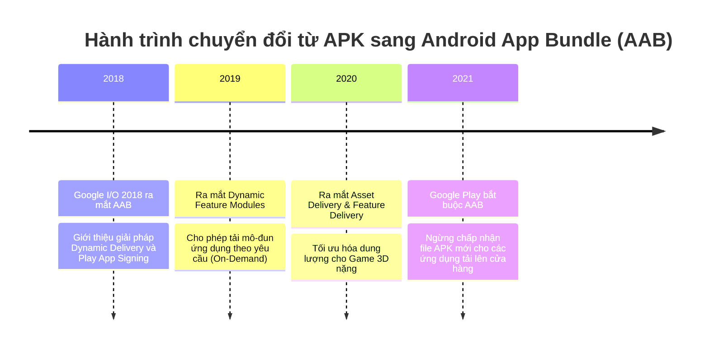
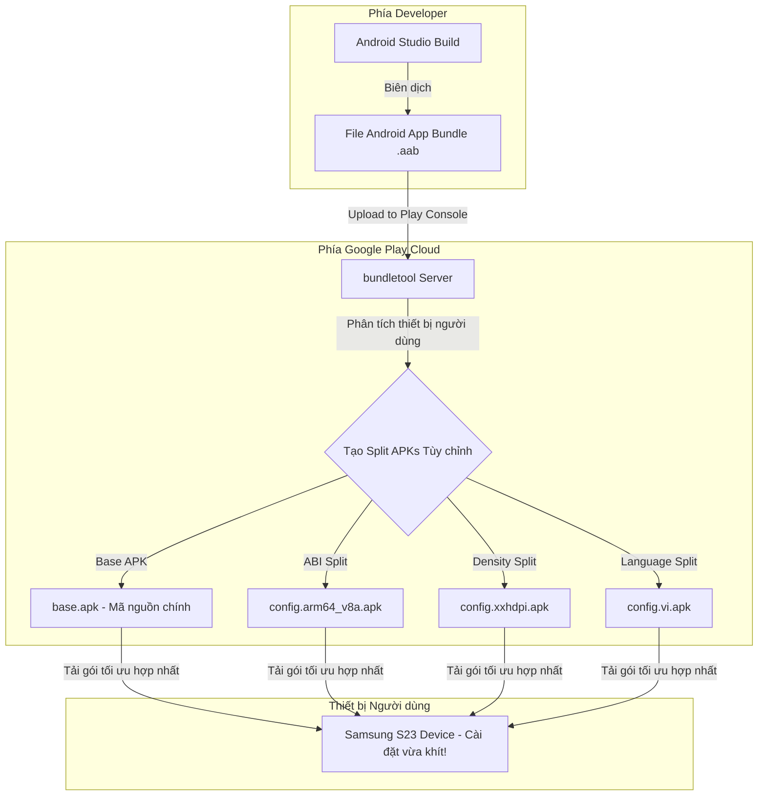
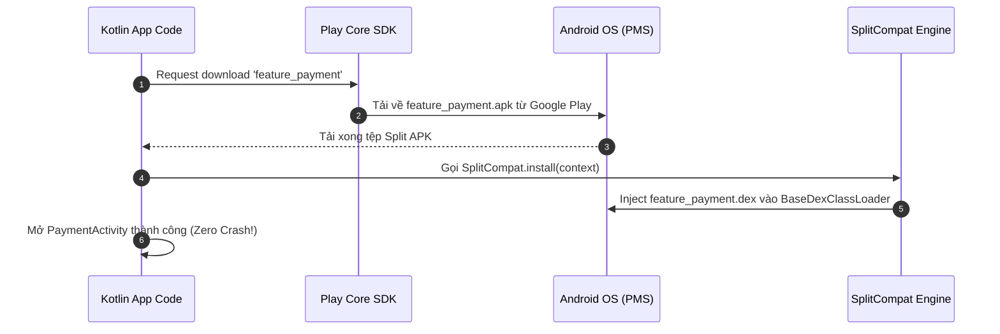

# Android App Bundle (AAB) & Dynamic Delivery

## Vấn đề cần giải quyết

Trong nhiều năm, định dạng APK nguyên khối (Monolithic APK) bộc lộ nhược điểm chí mạng về dung lượng:

1. **Phấn lãng phí dung lượng vô ích**: Một người dùng sở hữu điện thoại Samsung màn hình $1080p$ (xxhdpi), chạy CPU ARM64, chỉ nói tiếng Việt vẫn phải tải về một tệp APK nén sẵn hình ảnh $4K$ (xxxhdpi), thư viện Native C++ x86/x86_64, và dịch chuỗi của $50$ ngôn ngữ khác nhau trên thế giới!
2. **Suy giảm tỷ lệ chuyển đổi (Conversion Rate Drop)**: Theo số liệu của Google, cứ mỗi $6MB$ tăng thêm trong dung lượng tải ứng dụng, **tỷ lệ cài đặt thành công sẽ giảm đi 1%**. Các ứng dụng phình to trên $100MB$ bị người dùng bỏ qua ngay lập tức.
3. **Không thể tách rời tính năng theo nhu cầu**: Mọi tính năng (ví dụ: tính năng Quét Căn cước công dân / Xác thực sinh trắc học chỉ dùng 1 lần khi đăng ký) đều bắt buộc phải nằm sẵn trong APK chính, làm tăng nát dung lượng bộ nhớ ban đầu.

Tháng 5/2018, Google giới thiệu **Android App Bundle (AAB)**. Từ tháng 8/2021, Google Play chính thức **bắt buộc** tất cả ứng dụng mới xuất bản phải sử dụng định dạng AAB thay thế hoàn toàn cho APK nguyên khối.

---

## Sau khi học xong

- Giải thích được sự khác biệt bản chất giữa định dạng APK nguyên khối và Android App Bundle (AAB).
- Giải thích được cơ chế tạo Split APKs của bundletool (Language, Density, ABI splits) để giảm 35% dung lượng tải app.
- Triển khai được kiến trúc Dynamic Feature Modules (DFM) và nạp module thời điểm chạy (Runtime Loading) với SplitCompat.
- Xử lý được luồng kiểm thử ứng dụng AAB cục bộ sử dụng công cụ bundletool CLI.

---

## Lịch sử phát triển



---

## Cách hoạt động

### 1. Sự khác biệt cốt lõi: AAB vs APK

> **QUY TRẮC VÀNG**: Android OS **KHÔNG THỂ** cài đặt trực tiếp tập tin `.aab`! 
> AAB không phải là một gói cài đặt cho thiết bị. AAB là một **định dạng xuất bản nhị phân (Publishing Format)** dành riêng cho cửa hàng ứng dụng (Google Play).



| Đặc tính | APK Nguyên Khối (Monolithic APK) | Android App Bundle (AAB) |
| :--- | :--- | :--- |
| **Mục đích** | Gói cài đặt trực tiếp trên Android OS | Định dạng xuất bản lên Google Play |
| **Nội dung mã nguồn** | Chứa tất cả ABI, Density, Languages | Chứa các module phân tách dưới dạng Proto-format |
| **Cơ chế Ký chữ ký số** | Ký trực tiếp tại máy lập trình viên | Ký thông qua Play App Signing trên Cloud |
| **Tải về thiết bị** | Người dùng tải 100% dung lượng thô | Người dùng chỉ tải đúng phần thiết bị mình cần |
| **Tối ưu dung lượng** | Không tối ưu | Giảm trung bình 15% - 50% dung lượng |

---

### 2. Cấu trúc bên trong file AAB (Proto-buffer Format)

Khác với APK chứa `AndroidManifest.xml` và `resources.arsc` đã đóng gói dạng binary Dalvik, file AAB lưu trữ dữ liệu tài nguyên dưới dạng **Protocol Buffers (protobuf)**.

```
MyApp.aab (ZIP Archive)
├── base/                      # Module cơ sở chính của ứng dụng
│   ├── dex/                   # Các tập tin classes.dex
│   ├── res/                   # Tài nguyên lưu ở dạng Proto-format
│   ├── manifest/              # AndroidManifest.xml (Proto-format)
│   ├── native/                # Thư viện C/C++ (.so) phân chia theo ABI
│   └── resources.pb           # Bảng tài nguyên dạng Protocol Buffer (Thay cho resources.arsc)
├── feature_payment/           # Dynamic Feature Module 1 (Tải khi cần)
│   ├── dex/
│   └── manifest/
└── BUNDLE-METADATA/          # Metadata của bundletool dành cho Google Play
```

Công cụ **`bundletool`** của Google sẽ đọc cấu trúc `resources.pb` này để trích xuất và lắp ghép thành các tập tin **Split APKs** tối ưu cho từng cấu hình phần cứng thiết bị.

---

### 3. Kiến trúc Dynamic Feature Modules (DFM) & `SplitCompat` Runtime Loading

Dynamic Feature Modules (DFM) cho phép bạn tách các tính năng ít dùng ra thành các module riêng biệt và chỉ tải về khi người dùng thực sự kích hoạt tính năng đó.

#### Cơ chế hoạt động của `SplitCompat` trong Android OS:
Bình thường, `ClassLoader` của Android OS chỉ nạp mã nguồn từ `base.apk` khi ứng dụng khởi động. Khi một Split APK mới (ví dụ: `feature_payment.apk`) được tải về từ Google Play ở runtime:
1. File APK mới được lưu vào bộ nhớ trong của ứng dụng (`/data/app/...`).
2. Mã nguồn Kotlin/Java chưa thể thực thi ngay lập tức vì `ClassLoader` chính chưa biết sự tồn tại của file APK mới này.
3. Thư viện `SplitCompat.install(context)` được gọi -> Nó can thiệp vào `BaseDexClassLoader` của Android Runtime, tiêm (inject) đường dẫn file `.dex` mới vào cây tra cứu class (`dexPathList`).



---

## Ví dụ thực tế

### 1. Kỹ thuật cài đặt `SplitCompat` trong Application Class

Để sử dụng mã nguồn và tài nguyên từ Dynamic Feature Module mà không bị crash `ClassNotFoundException` hay `Resources.NotFoundException`:

```kotlin
class MyApplication : Application() {

    override fun attachBaseContext(base: Context) {
        super.attachBaseContext(base)
        // Kích hoạt SplitCompat để nạp mã nguồn từ các Split APKs đã tải về
        SplitCompat.install(this)
    }
}

// Đối với Activity nằm bên trong Dynamic Feature Module:
class DynamicPaymentActivity : AppCompatActivity() {

    override fun attachBaseContext(newBase: Context) {
        super.attachBaseContext(newBase)
        // Bắt buộc cài đặt SplitCompat cho Activity thuộc DFM
        SplitCompat.installActivity(this)
    }
}
```

---

### 2. Quy trình Kiểm thử (Testing) AAB Cục bộ với `bundletool` CLI

Vì không thể `adb install app.aab` trực tiếp, bạn bắt buộc phải dùng công cụ `bundletool` của Google để kiểm thử luồng cài đặt AAB trên thiết bị thật:

#### Bước 1: Sinh tập tin APKS từ AAB
```bash
java -jar bundletool.jar build-apks \
    --bundle=app-release.aab \
    --output=app.apks \
    --ks=my-release-key.jks \
    --ks-pass=pass:password123 \
    --ks-key-alias=my-alias \
    --key-pass=pass:password123
```

#### Bước 2: Cài đặt trực tiếp gói APKs phù hợp lên thiết bị đang cắm ADB
```bash
java -jar bundletool.jar install-apks --apks=app.apks
```
*(Công cụ `bundletool` sẽ tự động phát hiện ABI, Mật độ màn hình và Ngôn ngữ của thiết bị Android đang kết nối, sau đó trích xuất đúng các bản Split APKs tương thích để cài đặt!)*

---

## Sai lầm thường gặp

1. **Cố gắng dùng `adb install` trực tiếp file `.aab`**:
   - `adb install` sẽ báo lỗi `INSTALL_FAILED_INVALID_APK` lập tức vì AAB là tệp Proto-format dành cho Cloud, không phải APK thực thi.

2. **Quên tích hợp `SplitCompat` cho Custom Application hoặc Service**:
   - Tải Dynamic Feature thành công nhưng ứng dụng bị crash ngay khi mở Activity thuộc DFM do `ClassLoader` không tìm thấy Class.

3. **Mất tập tin Keystore gốc khi dùng Play App Signing**:
   - Với AAB, Google Play chịu trách nhiệm ký chữ ký cuối cùng (Deployment Key). Tuy nhiên, bạn vẫn cần bảo vệ **Upload Key** (dùng để upload file AAB lên Play Console). Nếu mất Upload Key, bạn phải thực hiện quy trình xin khôi phục lại qua Google Support.

---

## Trade-offs và Edge Cases

### Trade-offs
- **Phụ thuộc vào Google Play Ecosystem**: Cơ chế On-Demand Dynamic Delivery phụ thuộc vào Google Play Services. Nếu phân phối ứng dụng trên các cửa hàng bên thứ ba (như Huawei AppGallery hay Amazon Appstore) hoặc cài đặt nội bộ (Internal Sideloading), bạn phải tự xây dựng hạ tầng phục vụ APKs riêng bằng `bundletool`.

### Edge Cases
- **Lỗi truy cập Resource trong Custom Context**: Khi gọi `LayoutInflater.from(context)` từ một Context chưa được `SplitCompat` xử lý, ứng dụng sẽ bị crash `Resources$NotFoundException` khi cố truy cập các file layout/drawable thuộc Dynamic Feature Module.

---

## Kết nối hệ thống

- **Prerequisites**: `android.output_packages.apk_files` (Hiểu sâu về cấu trúc APK và Signature Schemes).
- **Related Topics**:
  - `android.languages.jni`: Tách riêng các file `.so` thành ABI Split APKs.
- **Downstream Topics**:
  - `android.system.multi_user_os`: Hệ điều hành quản lý không gian cài đặt Split APKs cho từng người dùng.

---

## Developer Curiosity Checklist

1. **Why was this created?** Loại bỏ sự lãng phí dung lượng của APK nguyên khối bằng cách cá nhân hóa gói cài đặt theo thiết bị người dùng.
2. **What problem does it solve?** Giảm 15%-50% dung lượng app tải về, tăng tỷ lệ cài đặt thành công và hỗ trợ tải tính năng theo yêu cầu (On-Demand).
3. **What happens if it doesn't exist?** Người dùng tiếp tục phải tải hàng chục MB tài nguyên và thư viện Native dư thừa mà thiết bị mình không dùng tới.
4. **How does Android implement it internally?** Định dạng Proto-buffer `resources.pb`, công cụ Cloud `bundletool` tự động xé nhỏ thành các Split APKs (Base, ABI, Density, Language).
5. **What misconceptions do developers have?** Nghĩ rằng file `.aab` có thể cài trực tiếp qua `adb install` trên điện thoại.
6. **What trade-offs does it introduce?** Phụ thuộc vào hạ tầng Google Play Services cho tính năng On-Demand Delivery và phức tạp hóa quy trình test local.
7. **What are the edge cases?** Crash `ClassNotFoundException` do quên `SplitCompat.install()` trên Custom Application hoặc Service background.
8. **What are the real-world problems developers encounter?** Lúng túng trong việc test AAB cục bộ và quản lý Chữ ký số với Play App Signing.
9. **How is it connected to the Android system?** Tận dụng tính năng Split APKs nguyên bản được Linux Kernel và Package Manager của Android OS hỗ trợ từ Android 5.0 (API 21).
10. **What should developers learn next?** Chuyển sang **Session 02: Android OS System Architecture & Permissions** để tìm hiểu cách hệ điều hành bảo vệ tệp tin và tiến trình.
