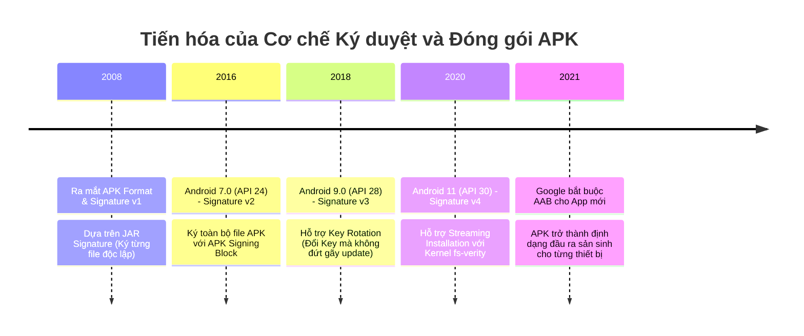
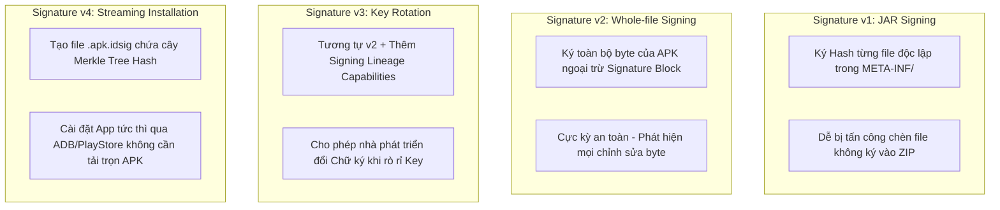
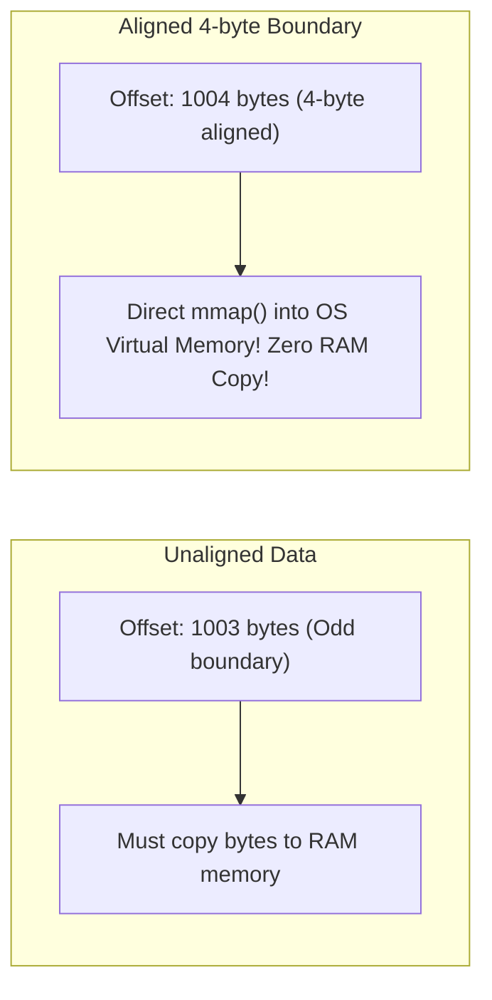

# Gói ứng dụng APK (Android Package)

## Vấn đề cần giải quyết

Khi bạn hoàn tất lập trình một ứng dụng Android, hàng trăm tệp mã nguồn Java/Kotlin (`.kt`, `.java`), tệp giao diện XML (`layout.xml`), hình ảnh (`.png`, `.svg`), thư viện Native C++ (`.so`) và tệp cấu hình phải được nén lại thành **một tệp thực thi duy nhất** để phân phối đến thiết bị người dùng.

Tệp nén đó chính là **APK (Android Package)** - có định dạng thực chất là một lưu trữ ZIP tùy chỉnh.

Tuy nhiên, nếu chỉ nén ZIP thông thường như trên máy tính:
1. **Thiết bị Android sẽ kiệt quệ RAM**: Hệ điều hành phải giải nén toàn bộ hình ảnh và tài nguyên từ ZIP vào RAM trước khi hiển thị.
2. **Nguy cơ độc hại (Malware & Tampering)**: Kẻ xấu có thể dễ dàng giải nén APK, chèn mã độc vào file thực thi `.dex` rồi nén lại để lừa người dùng cài đặt.
3. **Phân giải tài nguyên chậm chạp**: Đọc các tệp XML văn bản (`String.xml`) ở runtime tiêu tốn rất nhiều CPU cycle để parse chuỗi văn bản.

Vì vậy, Google đã tạo ra định dạng APK với cấu trúc binary đặc thù, hệ thống ký duyệt bảo mật nghiêm ngặt (Signature Schemes v1-v4) và công cụ căn chỉnh bộ nhớ `zipalign`.

---

## Sau khi học xong

- Giải thích được cấu trúc giải nén của một file APK tiêu chuẩn và vai trò của từng thành phần (classes.dex, resources.arsc, Binary XML).
- Phân biệt được sự tiến hóa của APK Signature Schemes từ v1 (JAR signing), v2 (Signing Block), v3 (Key Rotation) đến v4 (fs-verity).
- Giải thích được cơ chế tối ưu bộ nhớ RAM của zipalign dựa trên kỹ thuật Memory Mapping (mmap) 4-byte boundary alignment.
- Xử lý được các sự cố biên dịch APK common như INSTALL_FAILED_INVALID_APK hay INSTALL_PARSE_FAILED_NO_CERTIFICATES.

---

## Lịch sử phát triển



---

## Cách hoạt động

### 1. Cấu trúc Giải nén bên trong một File APK

Khi bạn đổi đuôi tập tin `.apk` thành `.zip` và giải nén, bạn sẽ thấy cấu trúc tiêu chuẩn sau:

```
MyApp.apk (ZIP Archive)
├── classes.dex                # Dalvik Bytecode được biên dịch từ Java/Kotlin
├── classes2.dex               # File DEX thứ 2 (Nếu vượt quá 64K Method Limit)
├── res/                       # Vùng chứa tài nguyên (Images, Compiled Layouts)
│   ├── drawable/
│   └── layout/
├── resources.arsc             # Bảng tra cứu tài nguyên đã biên dịch nhị phân (Resource Table)
├── AndroidManifest.xml        # Binary XML chứa thông tin Permission, Components
├── lib/                       # Thư viện C/C++ Native (.so) phân chia theo ABI
│   ├── arm64-v8a/
│   └── armeabi-v7a/
├── assets/                    # Tài nguyên thô không biên dịch (Fonts, Database, Media)
└── META-INF/                  # Thông tin Chữ ký v1 (CERT.SF, CERT.RSA, MANIFEST.MF)
```

#### Bí mật của `resources.arsc` và Binary XML
- **Binary XML**: Android không lưu file `AndroidManifest.xml` hay `layout.xml` dưới dạng văn bản thuần (`UTF-8 text`). Công cụ `aapt2` chuyển toàn bộ các thẻ XML (`<Activity>`, `<TextView>`) thành các mã Id dạng số nguyên (`Integer Tokens`). Điều này giúp Android OS parse layout với tốc độ ánh sáng ở runtime mà không tốn CPU parse string.
- **`resources.arsc`**: Bảng chỉ mục liên kết giữa Resource ID dạng hex (`0x7f010002`) với đường dẫn file thực tế trong APK. Mỗi Resource ID luôn có cấu trúc $32$-bit: `0xPPTTEEEE`
  - `PP` (Package ID): `0x7f` đại diện cho ứng dụng, `0x01` đại diện cho Android System Framework.
  - `TT` (Type ID): Định danh loại tài nguyên (`drawable`, `layout`, `string`, `color`).
  - `EEEE` (Entry ID): Chỉ số vị trí phần tử trong mảng tài nguyên.

---

### 2. Sự tiến hóa của APK Signature Schemes (v1 đến v4)

Ký duyệt APK là bước bắt buộc để Android xác thực nguồn gốc ứng dụng và đảm bảo tập tin không bị chỉnh sửa bất hợp pháp:



- **Signature v1 (JAR Signing)**: Chỉ ký checksum từng file riêng lẻ. Nhược điểm: Tốc độ kiểm tra chữ ký khi cài đặt rất chậm vì phải giải nén toàn bộ zip để hash từng file, đồng thời lỗ hổng bảo mật Janus từng cho phép kẻ xấu sửa đổi zip header mà không đổi hash file.
- **Signature v2 (Android 7.0+)**: Chèn một **APK Signing Block** vào ngay trước khu vực Central Directory của file ZIP. Hệ thống hash toàn bộ byte của file APK. Nếu đổi dù chỉ 1 bit trong APK -> Chữ ký lập tức không hợp lệ! Thời gian xác thực siêu nhanh vì không cần đọc từng file inside ZIP.
- **Signature v3 (Android 9.0+)**: Cho phép nhà phát triển thực hiện **Key Rotation** (Xoay chuyển Chữ ký). Bạn có thể đổi sang Key mới mà các thiết bị cũ vẫn chấp nhận bản cập nhật dựa trên Chữ ký gốc thông qua bằng chứng `Signing Lineage`.
- **Signature v4 (Android 11+)**: Lưu chữ ký trong một file riêng biệt `app.apk.idsig`. Sử dụng cấu trúc **Merkle Tree** tích hợp trực tiếp với tính năng `fs-verity` của Linux Kernel, cho phép tải và chạy app dưới dạng **Streaming** (ứng dụng có thể mở chạy ngay cả khi chưa tải xong 100% dung lượng từ Google Play).

---

### 3. Cơ chế tối ưu RAM của `zipalign`: Kỹ thuật `mmap` 4-byte Alignment

Nếu không có `zipalign`, khi ứng dụng cần đọc một hình ảnh `bg.png` hoặc file `.dex` từ trong APK:
- Android OS phải cấp phát bộ nhớ RAM tạm, đọc dữ liệu nén/không nén từ ổ đĩa storage, copy dữ liệu đó vào RAM (`RAM Copy Inflation`).

`zipalign` giải quyết triệt me vấn đề này bằng cách căn chỉnh tất cả các tài nguyên **không nén** (uncompressed data) trong file ZIP sao cho địa chỉ bắt đầu của chúng trùng với **bội số của 4 Bytes** (32-bit alignment).



#### Tại sao lại là 4 Bytes (32 bits)?
Đa số kiến trúc CPU di động (ARMv7, ARM64) đọc dữ liệu từ bộ nhớ hiệu quả nhất theo các khối từ nhớ 32-bit (4 Bytes) hoặc 64-bit (8 Bytes).

Khi tài nguyên được căn chỉnh 4-byte boundary, Android OS có thể sử dụng câu lệnh kernel **`mmap()`** để ánh xạ trực tiếp tập tin APK từ ổ nạp flash storage vào bộ nhớ ảo (`Virtual Memory`) của ứng dụng. **Hệ thống không tốn bất kỳ 1 byte RAM nào để copy dữ liệu tạm!**

---

## Ví dụ thực tế

### Phân tích và Debug lỗi Biên dịch / Cài đặt APK

#### 1. Lỗi `INSTALL_PARSE_FAILED_NO_CERTIFICATES`
- **Nguyên nhân**: Bạn build APK nhưng chưa ký chữ ký (Unsigned APK), hoặc thiết bị chạy Android 11+ bắt buộc Signature v2/v3 nhưng bạn chỉ ký Signature v1.
- **Khắc phục trong `build.gradle`**:
```groovy
android {
    signingConfigs {
        release {
            storeFile file("my-release-key.jks")
            storePassword "password123"
            keyAlias "my-alias"
            keyPassword "password123"
            
            // BẮT BUỘC BẬT CẢ V1 VÀ V2 SIGNATURE
            v1SigningEnabled true
            v2SigningEnabled true
        }
    }
}
```

#### 2. Lỗi `INSTALL_FAILED_INVALID_APK`: `zipalign` verification failed
- **Nguyên nhân**: Bạn đã ký lại Chữ ký (Re-sign) **SAU KHI** chạy `zipalign`.
- **QUY TRẮC VÀNG**: Luôn luôn thực hiện theo đúng thứ tự:
  1. Biên dịch ứng dụng -> `app-unaligned.apk`
  2. Căn chỉnh bộ nhớ -> **`zipalign`** -> `app-aligned.apk`
  3. Ký chữ ký số -> **`apksigner`** -> `app-release.apk`
  *(Nếu ký v2/v3 trước rồi mới `zipalign` -> `zipalign` sẽ làm biến đổi byte của file APK -> Vô hiệu hóa chữ ký v2!)*

---

## Sai lầm thường gặp

1. **Sử dụng `jarsigner` thay vì `apksigner`**:
   - `jarsigner` là công cụ legacy của Java SDK, nó **chỉ hỗ trợ Signature v1**. Để ứng dụng tương thích và bảo mật trên Android modern (Android 7.0+), bắt buộc dùng công cụ **`apksigner`** thuộc Android SDK Build-Tools.

2. **Quên cấu hình Multidex khi vượt quá 64K Methods**:
   - Thêm quá nhiều thư viện làm tổng số phương thức vượt quá $65,536$. Nếu không bật `multiDexEnabled true`, công cụ biên dịch D8 sẽ báo lỗi build thất bại.

3. **Để lọt tài nguyên dư thừa không dùng trong `res/`**:
   - Không bật `shrinkResources true` và `minifyEnabled true` khiến APK chứa vô số hình ảnh drawable trùng lặp và chuỗi đa ngôn ngữ không dùng đến.

---

## Trade-offs và Edge Cases

### Trade-offs
- **Kích thước APK Monolithic**: Một file APK tiêu chuẩn phải chứa đầy đủ toàn bộ thư viện Native `.so` của tất cả kiến trúc CPU (`arm64-v8a`, `armeabi-v7a`, `x86`), cùng hình ảnh ở tất cả mật độ màn hình (`mdpi`, `hdpi`, `xxhdpi`). Điều này khiến ứng dụng bị phình dung lượng vô ích đối với thiết bị của từng người dùng cụ thể.

### Edge Cases
- **Lỗi Signature Alignment trên Android 11 (API 30)**: Từ Android 11, hệ thống bắt buộc các tệp `.so` trong APK phải được căn chỉnh theo **4096-byte boundary** (4KB page alignment) để phục vụ cơ chế `mmap` thực thi trực tiếp từ storage. Nếu tệp `.so` không căn chỉnh 4KB, hệ thống sẽ từ chối cài đặt ứng dụng.

---

## Kết nối hệ thống

- **Prerequisites**: `android.languages.java_android`, `android.languages.kotlin` (Hiểu sâu về luồng biên dịch ra file `.dex`).
- **Related Topics**:
  - `android.output_packages.aab_files`: Định dạng đóng gói thế hệ mới giải quyết nhược điểm phình dung lượng của APK.
  - `android.languages.jni`: Nơi cung cấp các tệp thư viện `.so` nằm trong thư mục `lib/` của APK.
- **Downstream Topics**:
  - `android.system.process_management`: Hệ điều hành đọc file APK để khởi tạo Process và nạp class vào bộ nhớ.

---

## Developer Curiosity Checklist

1. **Why was this created?** Để đóng gói toàn bộ mã thực thi, tài nguyên và cấu hình thành một gói thực thi duy nhất an toàn cho Android OS.
2. **What problem does it solve?** Giải quyết bài toán phân phối ứng dụng, bảo vệ chống sửa đổi mã nguồn và tối ưu tốc độ đọc tài nguyên.
3. **What happens if it doesn't exist?** Android OS không thể kiểm tra tính toàn vẹn ứng dụng và người dùng phải cài đặt ứng dụng qua hàng trăm file phân tán thủ công.
4. **How does Android implement it internally?** Định dạng ZIP tùy chỉnh chứa `classes.dex`, `resources.arsc` (Binary XML), xác thực qua Signing Block v1-v4 và `mmap` qua `zipalign`.
5. **What misconceptions do developers have?** Tưởng APK chỉ là file zip bình thường và dùng `jarsigner` thay vì `apksigner`.
6. **What trade-offs does it introduce?** APK nguyên khối chứa tài nguyên dư thừa của mọi thiết bị làm phình dung lượng tải về.
7. **What are the edge cases?** Lỗi vi phạm 4KB page alignment của file `.so` trên Android 11+ và thứ tự đảo ngược giữa `zipalign` và `apksigner`.
8. **What are the real-world problems developers encounter?** Lỗi `INSTALL_PARSE_FAILED_NO_CERTIFICATES` do thiếu v2 signature và tràn 64K Method limit.
9. **How is it connected to the Android system?** Là đơn vị cài đặt cơ sở cho `PackageManagerService` (PMS) trên Android OS.
10. **What should developers learn next?** Chuyển sang `android.output_packages.aab_files` để hiểu cách Google Play tự động xé nhỏ APK theo cấu hình thiết bị.
