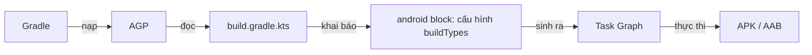
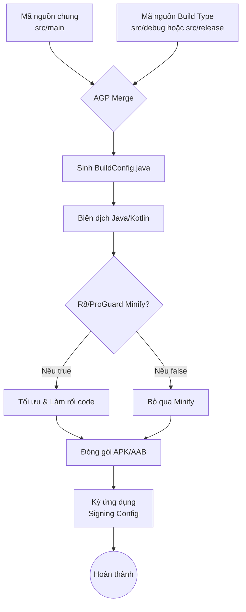

# Build Types

## Vấn đề cần giải quyết

Trong quá trình phát triển một ứng dụng Android, bạn không chỉ tạo ra một phiên bản duy nhất. Bạn cần:

- Một phiên bản để Developer lập trình, có thể debug, build nhanh, log lỗi chi tiết.
- Một phiên bản để QA/Tester kiểm thử nội bộ trên môi trường server giả lập (Staging/QA).
- Một phiên bản hoàn chỉnh để phát hành lên Google Play (Production) — phiên bản này cần được mã hóa, nén code, loại bỏ log để bảo mật và tối ưu dung lượng.

Nếu không có một cơ chế quản lý, bạn sẽ phải liên tục thay đổi code (ví dụ: đổi URL server, bật/tắt biến `DEBUG`, thay đổi chữ ký chứng chỉ - signing config) mỗi khi muốn tạo ra một phiên bản khác nhau. Điều này rất dễ dẫn đến sai sót (ví dụ: quên tắt log khi release app).

Android cung cấp **Build Types** để giải quyết bài toán này.

## Nền tảng cần biết trước: Gradle, AGP và build.gradle.kts

Trước khi đi sâu vào Build Type, cần hiểu rõ bốn khái niệm nền tảng mà bài viết này sử dụng xuyên suốt.

### Gradle là gì?

**Gradle** là một hệ thống build (build system) tổng quát, viết bằng Groovy/Kotlin, dùng để tự động hóa quá trình biên dịch, đóng gói và triển khai phần mềm. Nó không chỉ dành cho Android — bạn có thể dùng Gradle để build bất kỳ dự án nào.

Gradle hoạt động dựa trên **Task Graph** (đồ thị nhiệm vụ): mỗi công việc là một Task, các Task có quan hệ phụ thuộc nhau. Khi bạn chạy `./gradlew assembleDebug`, Gradle sẽ tính toán thứ tự các Task cần chạy dựa trên graph này.

### AGP (Android Gradle Plugin) là gì?

**AGP** là một plugin của Gradle dành riêng cho Android. Nó mở rộng Gradle để hiểu được:

- Cấu trúc dự án Android (source sets, manifest, resources...).
- Cách biên dịch Kotlin/Java thành APK/AAB.
- Cách ký (signing) và tối ưu hóa (R8/ProGuard).

Nói cách khác: **Gradle là "bộ máy", AGP là "bộ chuyển đổi" giúp bộ máy đó hiểu cách build Android.**

### build.gradle.kts là gì?

`build.gradle.kts` là file cấu hình của dự án, viết bằng **Kotlin DSL** (Domain-Specific Language). Có hai cấp:

- `build.gradle.kts` ở **project root**: khai báo plugin, dependency, version.
- `build.gradle.kts` ở **module app**: nơi khai báo `android { }` block — đây là nơi cấu hình Build Types.

### Mối quan hệ giữa chúng



> [!NOTE]
> Nếu bạn đã biết Kotlin + Java nhưng chưa biết Gradle, hãy hiểu đơn giản: Gradle là "máy build", AGP là "bộ hướng dẫn Android cho Gradle", và `build.gradle.kts` là "bản thiết kế" mà bạn viết.

## Build Type là gì?

**Build Type** (Loại bản dựng) là các cấu hình xây dựng ứng dụng ở các **giai đoạn khác nhau trong vòng đời phát triển** (development lifecycle) của ứng dụng.

Build Type định nghĩa **cách thức** mà ứng dụng được build và đóng gói: có cho phép debug không, sử dụng khóa ký (signing key) nào, có tối ưu hóa mã nguồn (minify) không, hay có gắn thêm hậu tố vào tên gói (application ID suffix) hay không.

Theo mặc định, khi tạo một project Android mới, Gradle sẽ tự động cấu hình sẵn hai Build Type:

1. `debug`: Dành cho lúc lập trình. Không minify code, được ký bằng debug key mặc định, hỗ trợ debug đầy đủ.
2. `release`: Dành cho lúc phát hành. Thường được minify (ProGuard/R8), ký bằng release key của riêng bạn, không cho phép debug.

## Build Type hoạt động như thế nào (Build Flow)?

Khi bạn nhấn nút "Run" hoặc thực thi một lệnh Gradle (ví dụ: `./gradlew assembleDebug`), Gradle và Android Gradle Plugin (AGP) sẽ thực hiện một luồng công việc (Build Flow):

1. **Khởi tạo và cấu hình:** Đọc `build.gradle` (hoặc `build.gradle.kts`) để thu thập thông tin về Build Type được chọn.
2. **Hợp nhất mã nguồn và tài nguyên (Merge Source Sets):** AGP tự động kết hợp mã nguồn (`src/main`) với mã nguồn cụ thể của Build Type (`src/debug` hoặc `src/release`). Cấu hình của Build Type sẽ ghi đè lên cấu hình ở `main`.
3. **Sinh code tự động (Code Generation):** Sinh ra file `BuildConfig.java` (nếu cấu hình) dựa trên các `buildConfigField` tương ứng.
4. **Biên dịch (Compilation):** Biên dịch Kotlin/Java thành bytecode.
5. **Tối ưu hóa (Minification - R8/ProGuard):** (Thường chỉ áp dụng cho `release` hoặc `staging`) Tối ưu code, obfuscate (làm rối), loại bỏ code thừa dựa trên các rules (quy tắc) áp dụng riêng cho Build Type đó.
6. **Đóng gói và Ký (Packaging & Signing):** Đóng gói thành APK/AAB và ký bằng `signingConfig` được chỉ định.



## Phân biệt Build Types và Product Flavors

Đây là sự nhầm lẫn phổ biến nhất đối với Android Developers.

- **Build Types (Cách build):** Đại diện cho các **giai đoạn phát triển** (Debug, Staging, QA, Release). Nó quyết định *cách* ứng dụng được tạo ra (có debug không, proguard không, ký khóa nào).
- **Product Flavors (Cái gì được build):** Đại diện cho các **phiên bản sản phẩm** khác nhau phát hành cho người dùng (Free, Paid, Enterprise). Nó quyết định *nội dung* ứng dụng (tính năng, tài nguyên UI, màu sắc thương hiệu).

> [!TIP]
> **Quy tắc ngón tay cái:** Nếu thay đổi cấu hình mà người dùng cuối không (hoặc không nên) quan tâm (ví dụ: khóa ký, R8, log debug), đó là **Build Type**. Nếu thay đổi tính năng, icon, server URL cho đối tượng khách hàng khác nhau, đó thường là **Flavor**. Mặc dù URL server có thể được đổi theo Build Type (Staging vs Prod), nhưng đổi URL theo khách hàng là Flavor.

## Các thuộc tính quan trọng của một Build Type

Trước khi cấu hình, cần nắm các thuộc tính hay dùng nhất:

| Thuộc tính | Ý nghĩa |
|---|---|
| `isDebuggable` | Cho phép debug (true/false). Bản `release` phải là `false`. |
| `isMinifyEnabled` | Bật R8/ProGuard để làm rối, rút gọn code. |
| `isShrinkResources` | Loại bỏ tài nguyên không dùng tới. Thường bật cùng minify. |
| `applicationIdSuffix` | Thêm hậu tố vào application ID (ví dụ `.dev`). Giúp cài nhiều bản cùng lúc. |
| `versionNameSuffix` | Thêm hậu tố vào version name hiển thị. |
| `signingConfig` | Khóa ký cho bản build. |
| `proguardFiles` | Danh sách file rules cho R8/ProGuard. |
| `buildConfigField` | Khai báo biến tĩnh trong `BuildConfig.java`. |
| `manifestPlaceholders` | Truyền biến vào AndroidManifest.xml. |
| `initWith` | Kế thừa toàn bộ cấu hình từ một Build Type khác. |

## buildConfigField: Vì sao nên khai báo biến môi trường ở đây?

**buildConfigField** là cách để bạn khai báo một biến tĩnh trong file `BuildConfig.java` được sinh tự động bởi AGP. Sau khi build, bạn có thể đọc biến này trong code như `BuildConfig.BASE_URL`.

### Vì sao nên dùng buildConfigField thay vì hardcode?

| Tiêu chí | Hardcode trong source | buildConfigField |
|---|---|---|
| Đổi URL theo môi trường | Phải sửa code, build lại | Tự động đổi theo Build Type |
| Lọt secret ra ngoài | Có thể bị đọc trong APK | Vẫn có thể bị đọc (xem lưu ý) |
| Tách biệt config | Không | Có, tập trung ở 1 nơi |
| Build nhanh | Không đổi được nếu không sửa code | Đổi được khi chọn Build Type |

### Lưu ý quan trọng về bảo mật

> [!WARNING]
> `BuildConfigField` **không phải** là nơi lưu secret thật sự an toàn. Mọi giá trị trong `BuildConfig` đều nằm trong APK và có thể bị đọc ngược (decompile). Chỉ đặt ở đây các cấu hình "không nhạy cảm" như BASE_URL, endpoint, feature flag. Mật khẩu, API key nhạy cảm phải nằm ở phía server hoặc qua kiến trúc bảo mật riêng (ví dụ Backend proxy, Play Integrity).

### Cách khai báo và sử dụng

Trong `build.gradle.kts`:

```kotlin
buildTypes {
    getByName("debug") {
        buildConfigField("String", "BASE_URL", "\"https://dev.api.example.com/\"")
        buildConfigField("boolean", "IS_LOGGING_ENABLED", "true")
    }
    getByName("release") {
        buildConfigField("String", "BASE_URL", "\"https://api.example.com/\"")
        buildConfigField("boolean", "IS_LOGGING_ENABLED", "false")
    }
}
```

Trong code Kotlin:

```kotlin
object AppConfig {
    val baseUrl: String = BuildConfig.BASE_URL
    val isLoggingEnabled: Boolean = BuildConfig.IS_LOGGING_ENABLED
}
```

> [!TIP]
> Từ AGP 8.0 trở đi, `BuildConfig` **mặc định bị tắt** để tăng tốc build. Bạn phải bật lại bằng cách thêm vào `android { }` block:
> ```kotlin
> buildFeatures {
>     buildConfig = true
> }
> ```

## initWith: Kế thừa cấu hình giữa các Build Type

**initWith** cho phép một Build Type kế thừa toàn bộ cấu hình từ một Build Type khác, sau đó ghi đè các thuộc tính cần thiết.

Ví dụ điển hình: Build Type `staging` cần giống hệt `release` (bật R8, dùng proguard, ký release) nhưng khác URL server.

```kotlin
buildTypes {
    getByName("release") {
        isMinifyEnabled = true
        isShrinkResources = true
        proguardFiles(...)
        signingConfig = signingConfigs.getByName("release")
    }
    create("staging") {
        // Kế thừa toàn bộ cấu hình từ release
        initWith(getByName("release"))
        // Sau đó ghi đè những gì cần khác
        applicationIdSuffix = ".staging"
        buildConfigField("String", "BASE_URL", "\"https://staging.api.example.com/\"")
        signingConfig = signingConfigs.getByName("staging")
        isDebuggable = true
    }
}
```

> [!NOTE]
> `initWith` giúp tránh lặp lại code. Nhưng lưu ý: thứ tự khai báo quan trọng — `initWith` phải gọi **trước** khi ghi đè các thuộc tính khác, vì mỗi dòng sau sẽ thay thế giá trị đã kế thừa.

## Ứng dụng thực tế: Cấu hình 3 môi trường Dev / Staging / Production

Trong thực tế dự án lớn, `debug` và `release` là không đủ. Đội ngũ QA cần một môi trường giống `release` nhất có thể để test (tức là có Minify/ProGuard) nhưng ứng dụng vẫn trỏ về máy chủ Staging/Dev, và có thể cài song song với app Production trên cùng một điện thoại.

Đây là cách khai báo các môi trường bằng Build Type trong `build.gradle.kts`:

```kotlin
android {
    // 1. Cấu hình Signing (Bảo mật)
    signingConfigs {
        create("staging") {
            storeFile = file("staging-keystore.jks")
            storePassword = "staging_password"
            keyAlias = "staging_key"
            keyPassword = "staging_password"
        }
        create("release") {
            storeFile = file("release-keystore.jks")
            storePassword = System.getenv("RELEASE_STORE_PASSWORD")
            keyAlias = System.getenv("RELEASE_KEY_ALIAS")
            keyPassword = System.getenv("RELEASE_KEY_PASSWORD")
        }
    }

    // 2. Bật BuildConfig để dùng buildConfigField
    buildFeatures {
        buildConfig = true
    }

    buildTypes {
        // Build Type mặc định cho Dev
        getByName("debug") {
            applicationIdSuffix = ".dev"
            versionNameSuffix = "-DEV"
            buildConfigField("String", "BASE_URL", "\"https://dev.api.example.com/\"")
            isDebuggable = true
        }
        
        // Build Type cho môi trường Staging/QA
        create("staging") {
            // Giúp cài song song bản Staging và Prod trên cùng 1 máy
            applicationIdSuffix = ".staging" 
            versionNameSuffix = "-STG"
            
            // Kế thừa thuộc tính từ release để test giống thật nhất
            initWith(getByName("release")) 
            
            buildConfigField("String", "BASE_URL", "\"https://staging.api.example.com/\"")
            
            // Gán signing config riêng để nhận diện
            signingConfig = signingConfigs.getByName("staging")
            
            // Có thể muốn vẫn cho phép debug trên staging đôi chút (tuỳ team)
            isDebuggable = true 
        }

        // Build Type cho Production
        getByName("release") {
            buildConfigField("String", "BASE_URL", "\"https://api.example.com/\"")
            isMinifyEnabled = true // Bật R8/ProGuard
            isShrinkResources = true // Loại bỏ resource thừa
            
            proguardFiles(
                getDefaultProguardFile("proguard-android-optimize.txt"),
                "proguard-rules.pro"
            )
            signingConfig = signingConfigs.getByName("release")
        }
    }
}
```

> [!NOTE]
> Bằng cách cấu hình `applicationIdSuffix`, bạn có thể cài cả 3 app: `com.example.app.dev`, `com.example.app.staging`, và `com.example.app` lên cùng một thiết bị!

### Đặt tên file output theo môi trường

Mặc định, file APK/AAB sẽ có tên kiểu `app-debug.apk`, `app-staging-release.apk`... Muốn đặt tên rõ ràng hơn theo môi trường, dùng `setProperty("archivesBaseName", ...)` hoặc chỉnh `applicationVariants`:

Cách 1 — Đặt tên gốc trong `defaultConfig`:

```kotlin
android {
    defaultConfig {
        // Tên file output sẽ là: MyApp-dev.apk, MyApp-staging.apk, MyApp-release.apk
        setProperty("archivesBaseName", "MyApp")
    }
}
```

Cách 2 — Tùy biến hoàn toàn tên file theo từng variant:

```kotlin
android {
    applicationVariants.all {
        val variant = this
        outputs.all {
            val output = this as com.android.build.gradle.internal.api.BaseVariantOutputImpl
            output.outputFileName = "MyApp-${variant.name}-${variant.versionName}.apk"
        }
    }
}
```

> [!NOTE]
> Tên `variant.name` sẽ là `debug`, `staging` hoặc `release` (hoặc `stagingRelease`... khi kết hợp Flavor + Build Type). Kết quả với cách 2: `MyApp-staging-1.0.0-STG.apk`.

## Quản lý ProGuard và R8 Rule cho từng môi trường

Khi bật `isMinifyEnabled = true`, R8 (công cụ biên dịch thế hệ mới của Android thay thế ProGuard) sẽ tiến hành làm rối mã (obfuscate) và loại bỏ các class/method không dùng tới.

Đôi khi, bạn muốn sử dụng các rules riêng biệt cho `staging` (để giữ lại một số log crash nội bộ hoặc SDK tracking ẩn) và `release`.

### Cách 1: Sử dụng thư mục Source Sets

Android tự động liên kết các file có trong thư mục mang tên Build Type.
Bạn có thể tổ chức thư mục như sau:

```text
app/
 ├── src/
 │   ├── main/
 │   ├── staging/
 │   │   └── proguard-rules-staging.pro  <-- Rules riêng cho staging
 │   └── release/
```

Trong `build.gradle.kts`:

```kotlin
buildTypes {
    create("staging") {
        isMinifyEnabled = true
        // Thêm rule riêng cho staging
        proguardFiles(
            getDefaultProguardFile("proguard-android-optimize.txt"), 
            "proguard-rules.pro", // Rule chung ở gốc
            "src/staging/proguard-rules-staging.pro" // Rule cụ thể
        )
    }
    
    getByName("release") {
        isMinifyEnabled = true
        proguardFiles(
            getDefaultProguardFile("proguard-android-optimize.txt"), 
            "proguard-rules.pro" // Chỉ dùng rule chung
        )
    }
}
```

### Cách 2: Quản lý R8 Rules theo Library

Nếu bạn viết thư viện (Android Library Module), thay vì bắt app module phải định nghĩa proguard rule, bạn nên gói kèm `consumerProguardFiles` vào trong thư viện. Rule này sẽ tự động được truyền lên (propagate) mọi Build Type đang sử dụng thư viện đó.

```kotlin
android {
    defaultConfig {
        consumerProguardFiles("consumer-rules.pro")
    }
}
```

## Kết hợp Build Type với CI/CD

Build Type là nền tảng để tự động hóa quá trình build trong pipeline CI/CD (Continuous Integration / Continuous Delivery). Ý tưởng chính: CI đọc cùng một `build.gradle.kts` và chạy lệnh Gradle tương ứng với môi trường.

Ví dụ với **GitHub Actions**:

```yaml
name: Android CI

on:
  push:
    branches: [main, staging, dev]

jobs:
  build:
    runs-on: ubuntu-latest
    steps:
      - uses: actions/checkout@v4
      - name: Set up JDK 17
        uses: actions/setup-java@v4
        with:
          distribution: temurin
          java-version: '17'
      - name: Grant execute permission for gradlew
        run: chmod +x gradlew
      - name: Build Staging APK
        run: ./gradlew assembleStaging
      - name: Upload APK artifact
        uses: actions/upload-artifact@v4
        with:
          name: staging-apk
          path: app/build/outputs/apk/staging/*.apk
```

> [!NOTE]
> Lệnh build tương ứng từng Build Type:
> - `./gradlew assembleDebug` → bản debug
> - `./gradlew assembleStaging` → bản staging
> - `./gradlew assembleRelease` → bản release
>
> Nếu bạn đã khai báo **Flavor + Build Type** thì tên task có dạng `assembleFreeRelease`, `assemblePaidStaging`...

## Phân phối bản build cho QA bằng Firebase App Distribution

**Firebase App Distribution** (trước đây là Firebase App Tester) cho phép bạn đẩy file APK/AAB lên Firebase để tester tải về trực tiếp trên điện thoại — rất hợp khi cần giao bản staging cho QA.

### Bước 1: Thêm plugin Firebase App Distribution

Trong `build.gradle.kts` (project root — block `plugins`):

```kotlin
plugins {
    id("com.android.application") version "8.x" apply false
    id("com.google.firebase.appdistribution") version "4.x" apply false
}
```

Trong `build.gradle.kts` (module app):

```kotlin
plugins {
    id("com.android.application")
    id("com.google.firebase.appdistribution")
}
```

### Bước 2: Cấu hình nhóm tester cho từng Build Type

```kotlin
buildTypes {
    getByName("debug") {
        // Không cần đẩy lên Firebase
    }
    create("staging") {
        // ... cấu hình signing, minify như trên ...
        
        firebaseAppDistribution {
            groups = "qa-team"          // Nhóm tester nhận bản staging
            releaseNotes = "Bản staging mới - cập nhật API"
            serviceCredentialsFile = System.getenv("FIREBASE_CREDENTIALS_FILE")
        }
    }
    getByName("release") {
        firebaseAppDistribution {
            groups = "release-reviewers"
            releaseNotes = "Bản release chuẩn bị phát hành"
            serviceCredentialsFile = System.getenv("FIREBASE_CREDENTIALS_FILE")
        }
    }
}
```

### Bước 3: Đẩy bản build lên Firebase

Chạy lệnh:

```bash
# Build staging và đẩy lên Firebase cho nhóm qa-team
./gradlew assembleStaging appDistributionUploadStaging
```

> [!NOTE]
> `serviceCredentialsFile` nên đọc từ **biến môi trường** (như ví dụ trên) chứ không hardcode đường dẫn, để tránh lộ credential khi commit lên Git. File credential thường là JSON của Service Account từ Firebase Console.

> [!TIP]
> Kết hợp CI/CD + Firebase App Distribution: thay vì chạy tay, bạn có thể để pipeline CI (GitHub Actions, GitLab CI, Jenkins...) tự động chạy `appDistributionUploadStaging` mỗi khi có commit mới trên nhánh `staging`. Đây là pattern phổ biến để QA luôn có bản mới nhất mà không cần developer build thủ công.

## Trade-offs và Common Mistakes (Những sai lầm thường gặp)

1. **Test QA trên bản `debug`:** Đội QA test trên bản `debug`, nhưng khi release người dùng lại chạy bản `release` có chạy R8 làm rối mã. Kết quả: App crash ngay trên Production vì lỗi Not Found Method do R8 xóa nhầm (thường xảy ra với Reflection hoặc Gson/Moshi). **Giải pháp:** Phải có một môi trường (ví dụ `staging`) bật R8 `isMinifyEnabled = true` để QA test.
2. **Hardcode cấu hình bảo mật vào file Gradle:** Chèn cứng password keystore trực tiếp vào `build.gradle.kts`. **Giải pháp:** Sử dụng Biến môi trường (Environment Variables) hoặc file `local.properties` (được đưa vào `.gitignore`) để đọc key, giống như ví dụ ở phần Staging bên trên.
3. **Quá nhiều Build Types dư thừa:** Sử dụng Build Type để định nghĩa giao diện (ví dụ `redTheme`, `blueTheme`). Việc này làm chậm quá trình Gradle Sync và sai mục đích. **Giải pháp:** Dùng Product Flavors cho các biến thể về mặt nội dung/giao diện sản phẩm.
4. **Quên bật `buildConfig = true`:** Với AGP 8+, dùng `BuildConfig.BASE_URL` mà quên khai báo `buildFeatures { buildConfig = true }` sẽ báo lỗi không tìm thấy field. **Giải pháp:** Bật `buildConfig` khi dùng `buildConfigField`.
5. **Đặt secret thật sự vào `buildConfigField`:** Dù không hiển thị trên UI, mọi giá trị BuildConfig vẫn nằm trong APK và có thể bị decompile. **Giải pháp:** Chỉ đặt config không nhạy cảm; secret phải nằm ở server.

## Tổng kết

Build Type giúp hệ thống hóa quy trình từ lúc viết code đến lúc ra mắt sản phẩm. Việc thiết lập đúng đắn các biến môi trường, khóa ký, cấu hình minification không chỉ giúp tự động hóa qua hệ thống CI/CD, mà còn cứu lập trình viên khỏi vô số lỗi ngớ ngẩn do "quên đổi URL" hay "quên tắt Log" trước khi tung app lên store.

### Lộ trình học tiếp

- **Product Flavors** — để quản lý các phiên bản sản phẩm (Free/Paid/Enterprise) kết hợp cùng Build Type.
- **Gradle Plugin** — hiểu cách AGP và các plugin khác được khai báo và nạp.
- **APK / AAB** — hiểu định dạng output mà Build Type tạo ra.

## Nguồn tham khảo

- [Android Developers — Configure build variants](https://developer.android.com/build/build-variants)
- [Android Developers — Configure build types](https://developer.android.com/build/build-types)
- [Android Developers — BuildConfig](https://developer.android.com/build/releases/gradle-plugin#build-config)
- [Gradle Documentation — Build System](https://docs.gradle.org/current/userguide/what_is_gradle.html)
- [Firebase App Distribution](https://firebase.google.com/docs/app-distribution)
- [Android Developers — Shrink your code and resources](https://developer.android.com/build/shrink-code)
