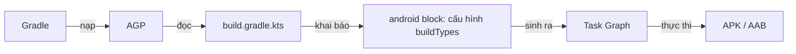
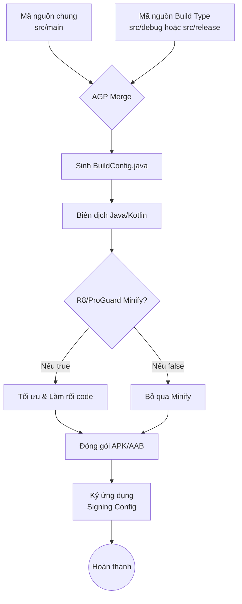

# Build Types

## Vấn đề cần giải quyết

Trong quá trình phát triển một ứng dụng Android, bạn không chỉ tạo ra một phiên bản duy nhất. Bạn cần:

- Một phiên bản để Developer lập trình, có thể debug, build nhanh, log lỗi chi tiết.
- Một phiên bản để QA/Tester kiểm thử nội bộ trên môi trường server giả lập (Staging/QA).
- Một phiên bản hoàn chỉnh để phát hành lên Google Play (Production) — phiên bản này cần được rút gọn và làm rối code (minify/obfuscate bằng R8/ProGuard), loại bỏ log để bảo mật và tối ưu dung lượng.

Nếu không có một cơ chế quản lý, bạn sẽ phải liên tục thay đổi code (ví dụ: đổi URL server, bật/tắt biến `DEBUG`, thay đổi chữ ký chứng chỉ - signing config) mỗi khi muốn tạo ra một phiên bản khác nhau. Điều này rất dễ dẫn đến sai sót (ví dụ: quên tắt log khi release app).

Android cung cấp **Build Types** để giải quyết bài toán này.

## Nền tảng cần biết trước: Gradle, AGP và build.gradle.kts

Trước khi đi sâu vào Build Type, cần hiểu rõ bốn khái niệm nền tảng mà bài viết này sử dụng xuyên suốt.

### Gradle là gì?

**Gradle** là một hệ thống build (build system) tổng quát, viết bằng Java/Groovy, dùng để tự động hóa quá trình biên dịch, đóng gói và triển khai phần mềm. Ngôn ngữ viết *build script* là Groovy (`build.gradle`) hoặc Kotlin (`build.gradle.kts`). Nó không chỉ dành cho Android — bạn có thể dùng Gradle để build bất kỳ dự án nào.

Gradle hoạt động dựa trên **Task Graph** (đồ thị nhiệm vụ): mỗi công việc là một Task, các Task có quan hệ phụ thuộc nhau. Khi bạn chạy `./gradlew assembleDebug`, Gradle sẽ tính toán thứ tự các Task cần chạy dựa trên graph này.

### AGP (Android Gradle Plugin) là gì?

**AGP** là một plugin của Gradle dành riêng cho Android. Nó mở rộng Gradle để hiểu được:

- Cấu trúc dự án Android (source sets, manifest, resources...).
- Cách biên dịch Kotlin/Java thành APK/AAB.
- Cách ký (signing) và tối ưu hóa (R8/ProGuard).

Nói cách khác: **Gradle là "bộ máy", AGP là "bộ chuyển đổi" giúp bộ máy đó hiểu cách build Android.**

### build.gradle.kts là gì?

`build.gradle.kts` là file cấu hình của dự án, viết bằng **Kotlin DSL** (Domain-Specific Language). Có hai cấp:

- `build.gradle.kts` ở **project root**: khai báo plugin, dependency, version.
- `build.gradle.kts` ở **module app**: nơi khai báo `android { }` block — đây là nơi cấu hình Build Types.

### Mối quan hệ giữa chúng



> [!NOTE]
> Nếu bạn đã biết Kotlin + Java nhưng chưa biết Gradle, hãy hiểu đơn giản: Gradle là "máy build", AGP là "bộ hướng dẫn Android cho Gradle", và `build.gradle.kts` là "bản thiết kế" mà bạn viết.

## Build Type là gì?

**Build Type** (Loại bản dựng) là các cấu hình xây dựng ứng dụng ở các **giai đoạn khác nhau trong vòng đời phát triển** (development lifecycle) của ứng dụng.

Build Type định nghĩa **cách thức** mà ứng dụng được build và đóng gói: có cho phép debug không, sử dụng khóa ký (signing key) nào, có tối ưu hóa mã nguồn (minify) không, hay có gắn thêm hậu tố vào tên gói (application ID suffix) hay không.

Theo mặc định, khi tạo một project Android mới, Gradle sẽ tự động cấu hình sẵn hai Build Type:

1. `debug`: Dành cho lúc lập trình. Không minify code, được ký bằng debug key mặc định, hỗ trợ debug đầy đủ.
2. `release`: Dành cho lúc phát hành. Thường được minify (ProGuard/R8), ký bằng release key của riêng bạn, không cho phép debug.

## Build Type hoạt động như thế nào (Build Flow)?

Khi bạn nhấn nút "Run" hoặc thực thi một lệnh Gradle (ví dụ: `./gradlew assembleDebug`), Gradle và Android Gradle Plugin (AGP) sẽ thực hiện một luồng công việc (Build Flow):

1. **Khởi tạo và cấu hình:** Đọc `build.gradle` (hoặc `build.gradle.kts`) để thu thập thông tin về Build Type được chọn.
2. **Hợp nhất mã nguồn và tài nguyên (Merge Source Sets):** AGP tự động kết hợp mã nguồn (`src/main`) với mã nguồn cụ thể của Build Type (`src/debug` hoặc `src/release`). Cấu hình của Build Type sẽ ghi đè lên cấu hình ở `main`.
3. **Sinh code tự động (Code Generation):** Sinh ra file `BuildConfig.java` (nếu cấu hình) dựa trên các `buildConfigField` tương ứng.
4. **Biên dịch (Compilation):** Biên dịch Kotlin/Java thành bytecode.
5. **Tối ưu hóa (Minification - R8/ProGuard):** (Thường chỉ áp dụng cho `release` hoặc `staging`) Tối ưu code, obfuscate (làm rối), loại bỏ code thừa dựa trên các rules (quy tắc) áp dụng riêng cho Build Type đó.
6. **Đóng gói và Ký (Packaging & Signing):** Đóng gói thành APK/AAB và ký bằng `signingConfig` được chỉ định.



## Phân biệt Build Types và Product Flavors

Đây là sự nhầm lẫn phổ biến nhất đối với Android Developers.

- **Build Types (Cách build):** Đại diện cho các **giai đoạn phát triển** (Debug, Staging, QA, Release). Nó quyết định *cách* ứng dụng được tạo ra (có debug không, proguard không, ký khóa nào).
- **Product Flavors (Cái gì được build):** Đại diện cho các **phiên bản sản phẩm** khác nhau phát hành cho người dùng (Free, Paid, Enterprise). Nó quyết định *nội dung* ứng dụng (tính năng, tài nguyên UI, màu sắc thương hiệu).

> [!TIP]
> **Quy tắc ngón tay cái:** Nếu thay đổi cấu hình mà người dùng cuối không (hoặc không nên) quan tâm (ví dụ: khóa ký, R8, log debug), đó là **Build Type**. Nếu thay đổi tính năng, icon, server URL cho đối tượng khách hàng khác nhau, đó thường là **Flavor**. Mặc dù URL server có thể được đổi theo Build Type (Staging vs Prod), nhưng đổi URL theo khách hàng là Flavor.

> [!WARNING]
> **Khi nào KHÔNG tạo Build Type mới:** cần biến thể về nội dung, khách hàng hoặc giao diện (free/paid, màu sắc, icon, server theo từng khách hàng) thì dùng **Product Flavors**, đừng đẻ thêm Build Type. Build Type chỉ dành cho debug/signing/minify theo giai đoạn. Mỗi Build Type mới làm tăng thời gian Gradle Sync và số variant phải kiểm thử.

**Build Variant** là kết quả kết hợp một Flavor với một Build Type:

```
Build Variant = Product Flavor × Build Type
```

Ví dụ: 2 flavor (`free`, `paid`) × 3 build type (`debug`, `staging`, `release`) = 6 variant (`freeDebug`, `freeStaging`, `paidRelease`...). Chi tiết xem thêm ở topic Product Flavors.

## Các thuộc tính quan trọng của một Build Type

Trước khi cấu hình, cần nắm các thuộc tính hay dùng nhất:

| Thuộc tính | Ý nghĩa |
|---|---|
| `isDebuggable` | Cho phép debug (true/false). Bản `release` phải là `false`. |
| `isMinifyEnabled` | Bật R8/ProGuard để làm rối, rút gọn code. |
| `isShrinkResources` | Loại bỏ tài nguyên không dùng tới. Thường bật cùng minify. |
| `applicationIdSuffix` | Thêm hậu tố vào application ID (ví dụ `.dev`). Giúp cài nhiều bản cùng lúc. |
| `versionNameSuffix` | Thêm hậu tố vào version name hiển thị. |
| `signingConfig` | Khóa ký cho bản build. |
| `proguardFiles` | Danh sách file rules cho R8/ProGuard. |
| `buildConfigField` | Khai báo biến tĩnh trong `BuildConfig.java`. |
| `manifestPlaceholders` | Truyền biến vào AndroidManifest.xml. |
| `initWith` | Kế thừa toàn bộ cấu hình từ một Build Type khác. |

## buildConfigField: Vì sao nên khai báo biến môi trường ở đây?

**buildConfigField** là cách để bạn khai báo một biến tĩnh trong file `BuildConfig.java` được sinh tự động bởi AGP. Sau khi build, bạn có thể đọc biến này trong code như `BuildConfig.BASE_URL`.

### Vì sao nên dùng buildConfigField thay vì hardcode?

| Tiêu chí | Hardcode trong source | buildConfigField |
|---|---|---|
| Đổi URL theo môi trường | Phải sửa code, build lại | Tự động đổi theo Build Type |
| Lọt secret ra ngoài | Có thể bị đọc trong APK | Vẫn có thể bị đọc (xem lưu ý) |
| Tách biệt config | Không | Có, tập trung ở 1 nơi |
| Đổi giá trị theo variant | Sửa code + commit lại | Chọn variant rồi build, không sửa code |

### Lưu ý quan trọng về bảo mật

> [!WARNING]
> `BuildConfigField` **không phải** là nơi lưu secret thật sự an toàn. Mọi giá trị trong `BuildConfig` đều nằm trong APK và có thể bị đọc ngược (decompile). Chỉ đặt ở đây các cấu hình "không nhạy cảm" như BASE_URL, endpoint, feature flag. Mật khẩu, API key nhạy cảm phải nằm ở phía server hoặc qua kiến trúc bảo mật riêng (ví dụ Backend proxy, Play Integrity).

### Cách khai báo và sử dụng

Trong `build.gradle.kts`:

```kotlin
buildTypes {
    getByName("debug") {
        buildConfigField("String", "BASE_URL", "\"https://dev.api.example.com/\"")
        buildConfigField("boolean", "IS_LOGGING_ENABLED", "true")
    }
    getByName("release") {
        buildConfigField("String", "BASE_URL", "\"https://api.example.com/\"")
        buildConfigField("boolean", "IS_LOGGING_ENABLED", "false")
    }
}
```

Trong code Kotlin:

```kotlin
object AppConfig {
    val baseUrl: String = BuildConfig.BASE_URL
    val isLoggingEnabled: Boolean = BuildConfig.IS_LOGGING_ENABLED
}
```

> [!TIP]
> Từ AGP 8.0 trở đi, `BuildConfig` **mặc định bị tắt** để tăng tốc build. Bạn phải bật lại bằng cách thêm vào `android { }` block:
> ```kotlin
> buildFeatures {
>     buildConfig = true
> }
> ```

### manifestPlaceholders: đưa biến vào AndroidManifest

Cùng pattern như `BASE_URL` ở trên, nhưng biến được chèn vào `AndroidManifest.xml` thay vì `BuildConfig`:

```kotlin
buildTypes {
    getByName("debug") {
        manifestPlaceholders["deepLinkHost"] = "staging.example.com"
    }
    getByName("release") {
        manifestPlaceholders["deepLinkHost"] = "api.example.com"
    }
}
```

```xml
<data android:host="${deepLinkHost}" android:scheme="https" />
```

Chi tiết tách `manifestPlaceholders` theo từng Flavor (free/paid, dev/prod) xem thêm ở topic Product Flavors.

> [!NOTE]
> `buildConfigField` top-level trong `buildTypes` như các ví dụ trên vẫn chạy ở AGP 8/9, nhưng là eager API đã deprecated theo migration roadmap. API lazy thay thế là `variant.buildConfigFields.put(...)` qua `androidComponents` — bài này giữ cú pháp cũ để dễ đọc, khi nào cần tối ưu Configuration Cache hãy migrate.

## initWith: Kế thừa cấu hình giữa các Build Type

**initWith** cho phép một Build Type kế thừa toàn bộ cấu hình từ một Build Type khác, sau đó ghi đè các thuộc tính cần thiết.

Ví dụ điển hình: Build Type `staging` cần giống hệt `release` (bật R8, dùng proguard, ký release) nhưng khác URL server.

```kotlin
buildTypes {
    getByName("release") {
        isMinifyEnabled = true
        isShrinkResources = true
        proguardFiles(...)
        signingConfig = signingConfigs.getByName("release")
    }
    create("staging") {
        // Kế thừa toàn bộ cấu hình từ release
        initWith(getByName("release"))
        // Sau đó ghi đè những gì cần khác
        applicationIdSuffix = ".staging"
        buildConfigField("String", "BASE_URL", "\"https://staging.api.example.com/\"")
        signingConfig = signingConfigs.getByName("staging")
        isDebuggable = true
    }
}
```

> [!NOTE]
> `initWith` giúp tránh lặp lại code. Nhưng lưu ý: thứ tự khai báo quan trọng — `initWith` phải gọi **trước** khi ghi đè các thuộc tính khác, vì mỗi dòng sau sẽ thay thế giá trị đã kế thừa.

## Ứng dụng thực tế: Cấu hình 3 môi trường Dev / Staging / Production

Trong thực tế dự án lớn, `debug` và `release` là không đủ. Đội ngũ QA cần một môi trường giống `release` nhất có thể để test (tức là có Minify/ProGuard) nhưng ứng dụng vẫn trỏ về máy chủ Staging/Dev, và có thể cài song song với app Production trên cùng một điện thoại.

Đây là cách khai báo các môi trường bằng Build Type trong `build.gradle.kts`:

```kotlin
android {
    // 1. Cấu hình Signing (Bảo mật)
    // Không hardcode password. Đọc từ biến môi trường hoặc local.properties (đã gitignore).
    signingConfigs {
        create("staging") {
            storeFile = file("staging-keystore.jks")
            storePassword = System.getenv("STAGING_STORE_PASSWORD")
            keyAlias = System.getenv("STAGING_KEY_ALIAS")
            keyPassword = System.getenv("STAGING_KEY_PASSWORD")
        }
        create("release") {
            storeFile = file("release-keystore.jks")
            storePassword = System.getenv("RELEASE_STORE_PASSWORD")
            keyAlias = System.getenv("RELEASE_KEY_ALIAS")
            keyPassword = System.getenv("RELEASE_KEY_PASSWORD")
        }
    }

    // 2. Bật BuildConfig để dùng buildConfigField
    buildFeatures {
        buildConfig = true
    }

    buildTypes {
        // Build Type mặc định cho Dev
        getByName("debug") {
            applicationIdSuffix = ".dev"
            versionNameSuffix = "-DEV"
            buildConfigField("String", "BASE_URL", "\"https://dev.api.example.com/\"")
            isDebuggable = true
        }

        // Build Type cho Production — khai báo TRƯỚC để staging kế thừa đúng minify/proguard/signing
        getByName("release") {
            buildConfigField("String", "BASE_URL", "\"https://api.example.com/\"")
            isMinifyEnabled = true // Bật R8/ProGuard
            isShrinkResources = true // Loại bỏ resource thừa

            proguardFiles(
                getDefaultProguardFile("proguard-android-optimize.txt"),
                "proguard-rules.pro"
            )
            signingConfig = signingConfigs.getByName("release")
        }

        // Build Type cho môi trường Staging/QA
        create("staging") {
            // QUAN TRỌNG: initWith phải gọi TRƯỚC khi ghi đè.
            // Mọi dòng sau initWith sẽ thay thế giá trị đã kế thừa.
            // Kế thừa thuộc tính từ release để test giống thật nhất (minify/proguard/signing)
            initWith(getByName("release"))

            // Giúp cài song song bản Staging và Prod trên cùng 1 máy
            applicationIdSuffix = ".staging"
            versionNameSuffix = "-STG"

            buildConfigField("String", "BASE_URL", "\"https://staging.api.example.com/\"")

            // Gán signing config riêng để nhận diện
            signingConfig = signingConfigs.getByName("staging")

            // Có thể muốn vẫn cho phép debug trên staging đôi chút (tuỳ team)
            isDebuggable = true
        }
    }
}
```

> [!NOTE]
> Bằng cách cấu hình `applicationIdSuffix`, bạn có thể cài cả 3 app: `com.example.app.dev`, `com.example.app.staging`, và `com.example.app` lên cùng một thiết bị!

> [!WARNING]
> Staging bật đồng thời `isMinifyEnabled = true` và `isDebuggable = true` chỉ dùng nội bộ cho QA. Bản `debuggable` bị Google Play từ chối khi upload, và R8 + debuggable làm stacktrace khó đọc hơn bản release thật.

> [!NOTE]
> File `*-keystore.jks` thật không commit lên Git. Tên file trong ví dụ chỉ minh họa; password đọc từ biến môi trường hoặc CI secrets như đoạn code trên.

Ngoài `buildConfigField`, AGP còn tự động merge Source Set theo Build Type: file trong `src/staging/` ghi đè file cùng đường dẫn trong `src/main` (đúng Build Flow ở trên). Ví dụ đổi tên app của bản staging mà không đụng bản release:

```xml
<!-- app/src/staging/res/values/strings.xml -->
<resources>
    <string name="app_name">App STG</string>
</resources>
```

### Đặt tên file output theo môi trường

Mặc định, file APK/AAB sẽ có tên kiểu `app-debug.apk`, `app-staging.apk`... Muốn đặt tên rõ ràng hơn theo môi trường, ưu tiên đổi tên gốc (Cách 1). Chỉ khi cần tùy biến hoàn toàn tên file theo từng variant mới dùng Variant API (Cách 2 mới). Cách dùng `applicationVariants` (Cách cũ) đã deprecated từ AGP 4.2 và bị xóa khỏi AGP 9 nên không còn được gợi ý trong Android Studio mới.

Cách 1 — Đổi tên gốc (chỉ đổi phần base name, AGP vẫn ghép thêm `-debug` / `-staging` / `-release` phía sau):

| Gradle | Cú pháp | Ghi chú |
|---|---|---|
| Gradle 8 trở xuống | `setProperty("archivesBaseName", ...)` trong `defaultConfig` | Vẫn chạy nhưng đã deprecated |
| Gradle 9+ (AGP 9) | `base { archivesName = ... }` ngoài `android { }` | Bắt buộc, `archivesBaseName` đã bị xóa |

Gradle 9+ (AGP 9, khuyến nghị):

```kotlin
// app/build.gradle.kts — nằm NGOÀI và NGANG CẤP với android { }
base {
    // Tên file output sẽ là: MyApp-debug.apk, MyApp-staging.apk, MyApp-release.apk
    archivesName = "MyApp"
}
```

> [!WARNING]
> Từ Gradle 9, `archivesBaseName` đã bị xóa. Viết `setProperty("archivesBaseName", ...)` sẽ lỗi:
> `Could not set unknown property 'archivesBaseName' for project ':app'`.
> Lỗi này nghĩa là bạn đang set property lên `Project` nhưng property đó không còn tồn tại — hãy chuyển sang `base { archivesName = ... }` như trên. Check version trong `gradle/wrapper/gradle-wrapper.properties`.

<details>
<summary>Gradle 8 trở xuống — `archivesBaseName` (Legacy, chỉ để bảo trì project cũ)</summary>

```kotlin
android {
    defaultConfig {
        // Tên file output sẽ là: MyApp-debug.apk, MyApp-staging.apk, MyApp-release.apk
        setProperty("archivesBaseName", "MyApp")
    }
}
```

</details>

Cách 2 mới — Tùy biến hoàn toàn tên file với Variant API (AGP 8/9, khuyến nghị khi cần custom):

```kotlin
// Lưu ý: androidComponents nằm NGOÀI và NGANG CẤP với android { }, không nằm trong đó.
androidComponents {
    onVariants(selector().all()) { variant ->
        variant.outputs.forEach { output ->
            output.outputFileName.set("MyApp-${variant.name}-${variant.versionName.getOrElse("1.0")}.apk")
        }
    }
}
```

Chỉ đổi tên một Build Type cụ thể:

```kotlin
androidComponents {
    onVariants(selector().withBuildType("staging")) { variant ->
        variant.outputs.forEach { output ->
            output.outputFileName.set("MyApp-${variant.name}-${variant.versionName.getOrElse("1.0")}.apk")
        }
    }
}
```

> [!NOTE]
> - `outputFileName` là `Property<String>` nên phải dùng `.set(...)`, không gán `=` như API cũ.
> - `variant.name` sẽ là `debug`, `staging` hoặc `release` (hoặc `freeStaging`, `paidRelease`... khi kết hợp Flavor + Build Type). Kết quả: `MyApp-staging-1.0.0-STG.apk`. Dùng `getOrElse` để không crash khi variant chưa set versionName.
> - Cách này tương thích Configuration Cache và Gradle 9, trong khi API cũ thì không. Rename này áp dụng cho cả APK/AAB; tên file AAB khi upload Play dùng cơ chế khác, kiểm tra Play Console nếu cần.

<details>
<summary>Cách cũ — `applicationVariants` (Legacy, chỉ AGP &lt; 8, không nên dùng mới)</summary>

> [!WARNING]
> `applicationVariants` là Legacy Variant API. Từ AGP 7 đã deprecated, từ AGP 8.13 cần opt-in, từ AGP 9 bị xóa hẳn (`android.newDsl=true` mặc định). Đó là lý do Android Studio mới không gợi ý `applicationVariants`. Đoạn code dưới chỉ để tham khảo khi bảo trì project cũ, và dùng internal API `BaseVariantOutputImpl` vốn đã bị Google cấm.

```kotlin
android {
    applicationVariants.all {
        val variant = this
        outputs.all {
            val output = this as com.android.build.gradle.api.ApkVariantOutput
            output.outputFileName = "MyApp-${variant.name}-${variant.versionName}.apk"
        }
    }
}
```

</details>

## Quản lý ProGuard và R8 Rule cho từng môi trường

Khi bật `isMinifyEnabled = true`, R8 (công cụ biên dịch thế hệ mới của Android thay thế ProGuard) sẽ tiến hành làm rối mã (obfuscate) và loại bỏ các class/method không dùng tới.

Vấn đề R8 giải quyết: APK release không xử lý vừa **to** (dead code, thư viện thừa làm tăng dung lượng tải) vừa **dễ bị decompile đọc gần như nguyên code** (lộ logic nghiệp vụ, endpoint, cách xử lý dữ liệu). R8 xử cả hai trong một lần chạy: gói nhỏ lại + khó đọc ngược.

### R8 làm gì trong bản build của bạn

R8 chạy đúng bước minify trong Build Flow ở trên: **sau biên dịch, trước đóng gói**. Một lần chạy làm 3 việc:

1. **Shrink (lược bỏ):** xóa class/method không ai gọi tới (tree-shaking) cho APK nhẹ đi. `isShrinkResources = true` dọn tiếp phần resource thừa đi kèm.
2. **Optimize (tối ưu):** viết lại bytecode cho gọn (inline hàm, gộp code...), app chạy nhanh hơn.
3. **Obfuscate (làm rối):** đổi tên `com.example.LoginManager` thành `a.b.c` để decompile khó đọc. Đây **không phải mã hóa** — app vẫn chạy bình thường, chỉ khó đọc ngược.

Điểm gãy duy nhất: R8 chỉ nhìn thấy lời gọi **trực tiếp**. Code gọi qua **Reflection** — Gson/Moshi parse JSON, Retrofit tạo implementation, Hilt/Navigation sinh code lúc chạy — R8 tưởng không ai dùng nên xóa nhầm. Kết quả: app **chỉ crash ở bản release/staging** (`ClassNotFoundException`, `NoSuchMethodError`) trong khi bản debug chạy ngon. Đó chính là lý do đội QA phải test trên bản staging bật R8 thay vì bản debug.

### Đọc crash bản release: mapping.txt

Mỗi lần build có minify, AGP sinh file `app/build/outputs/mapping/<variant>/mapping.txt` — bảng tra cứu tên thật ↔ tên rối. Không có file này, stacktrace crash toàn `a.b.c` và vô dụng. Quy tắc:

- Lưu `mapping.txt` của **mỗi** bản release/staging (đúng variant, đúng versionCode).
- Upload lên Play Console / Crashlytics để tự động giải mã crash.
- Hoặc giải tay trong Android Studio bằng Analyze Stack Trace với đúng file mapping đó.

### Cú pháp rule tối thiểu

Rule là file `.pro` nói cho R8 biết "đừng đụng vào chỗ này". Chỉ cần 4 câu lệnh là đủ dùng hàng ngày:

| Cú pháp | Ý nghĩa | Khi nào dùng |
|---|---|---|
| `-keep class com.example.model.** { *; }` | Giữ nguyên cả class + member | Model parse JSON (Gson), API interface |
| `-keepnames class com.example.api.**` | Giữ tên class, cho tối ưu bên trong | Ít dùng, khi chỉ cần stacktrace đọc được |
| `-keepclassmembers class * extends ... { <fields>; }` | Chỉ giữ member, không giữ cả class | Message protobuf (xem ví dụ Proto DataStore ở dưới) |
| `-dontwarn org.conscrypt.**` | Bỏ qua warning của thư viện | Thư viện lớn báo warning không liên quan; không dùng để che lỗi thật |

Mặc định AGP đã kèm `proguard-android-optimize.txt` (rule chuẩn của Google), nên file của bạn chỉ chứa rule cho **code của mình**.

### Quy trình dùng R8 cho bản release/staging

1. **Bật R8:** `isMinifyEnabled = true` (+ `isShrinkResources = true`) trong `release`, `staging` kế thừa qua `initWith` — như ví dụ 3 môi trường ở trên.
2. **Viết rule:** thêm rule cho chỗ dùng Reflection của mình (model Gson, message Proto — xem mục rule mẫu ở dưới). Thư viện Jetpack hiện đại tự kèm rule nên không viết thừa.
3. **Kiểm chứng mỗi bản build:**
   - File `app/build/outputs/mapping/<variant>/mapping.txt` có sinh ra không — không có nghĩa là R8 chưa chạy thật.
   - Cài bản staging/release lên máy, đi qua các màn hình dùng API, database, parse JSON. Crash `ClassNotFoundException` / `NoSuchMethodError` mà bản debug không bị = thiếu `-keep`, thêm rule rồi build lại.

> [!WARNING]
> 3 sai lầm phổ biến: viết `-keep ** { *; }` giữ hết cho "chắc ăn" (R8 thành vô dụng, APK không nhỏ đi — giữ hẹp từng package); copy rule Stack Overflow cũ có `-dontoptimize` / `-dontobfuscate` vào bản release (tắt luôn tác dụng R8); test R8 bằng bản debug (vô nghĩa vì R8 chỉ chạy khi `isMinifyEnabled = true`).

Đôi khi, bạn muốn sử dụng các rules riêng biệt cho `staging` (để giữ lại một số log crash nội bộ hoặc SDK tracking ẩn) và `release`.

### Cách 1: Sử dụng thư mục Source Sets

Android tự động liên kết các file có trong thư mục mang tên Build Type.
Bạn có thể tổ chức thư mục như sau:

```text
app/
 ├── src/
 │   ├── main/
 │   ├── staging/
 │   │   └── proguard-rules-staging.pro  <-- Rules riêng cho staging
 │   └── release/
```

Trong `build.gradle.kts`:

```kotlin
buildTypes {
    create("staging") {
        isMinifyEnabled = true
        // Thêm rule riêng cho staging
        proguardFiles(
            getDefaultProguardFile("proguard-android-optimize.txt"), 
            "proguard-rules.pro", // Rule chung ở gốc
            "src/staging/proguard-rules-staging.pro" // Rule cụ thể
        )
    }
    
    getByName("release") {
        isMinifyEnabled = true
        proguardFiles(
            getDefaultProguardFile("proguard-android-optimize.txt"), 
            "proguard-rules.pro" // Chỉ dùng rule chung
        )
    }
}
```

### Cách 2: Quản lý R8 Rules theo Library

Nếu bạn viết thư viện (Android Library Module), thay vì bắt app module phải định nghĩa proguard rule, bạn nên gói kèm `consumerProguardFiles` vào trong thư viện. Rule này sẽ tự động được truyền lên (propagate) mọi Build Type đang sử dụng thư viện đó.

```kotlin
android {
    defaultConfig {
        consumerProguardFiles("consumer-rules.pro")
    }
}
```

### Rule mẫu cho stack Lifecycle + Room + Retrofit + Hilt + DataStore

Nguyên tắc: thư viện Jetpack hiện đại (2024+) tự kèm rule qua `consumerProguardFiles`, nên **chỉ viết rule cho code của mình**. Bảng tra nhanh:

| Thư viện | Cần rule tay? | Vì sao |
|---|---|---|
| Lifecycle, Room, Hilt, Preferences DataStore, Navigation, WorkManager | Không | Tự kèm consumer rules; code sinh (generated) không dùng Reflection |
| Retrofit (interface, suspend) | Không | Retrofit tự kèm rule giữ `Signature`/`InnerClasses` |
| Gson models (dùng kèm Retrofit) | **Có** | Gson đọc field qua Reflection, R8 không thấy ai gọi nên xóa nhầm |
| Proto DataStore | **Có** | Message protobuf cần giữ schema/parser |
| Moshi codegen (KSP) | Không | Code sinh sẵn; chỉ Moshi reflection mới cần keep model như Gson |

`proguard-rules.pro` dùng chung cho cả staging và release:

```pro
# Gson: giữ model parse JSON (đổi com.example.data.model thành package model của bạn)
-keepattributes Signature, *Annotation*
-keep class com.example.data.model.** { *; }

# Proto DataStore: giữ message protobuf (Preferences DataStore không cần dòng này)
-keepclassmembers class * extends com.google.protobuf.GeneratedMessageLite {
  <fields>;
}

# Bỏ warning của thư viện, không che lỗi thật
-dontwarn org.conscrypt.**
```

`src/staging/proguard-rules-staging.pro` — staging giữ log để QA gửi logcat kèm crash, release strip log cho nhẹ và sạch:

```pro
# Staging: KHÔNG strip Log.
# File release thêm các dòng dưới để xóa log d/v/i khỏi APK:
# -assumenosideeffects class android.util.Log {
#     public static *** d(...);
#     public static *** v(...);
#     public static *** i(...);
# }
```

> [!WARNING]
> `-assumenosideeffects` chỉ dùng cho hàm không có side effect. Đừng strip `Log.e/wtf` (cần khi đọc crash), và đừng viết `Log.d(TAG, expensiveCall())` — R8 xóa cả lời gọi hàm lẫn đối số, hành vi sẽ khác nhau giữa các variant.

## Kết hợp Build Type với CI/CD

Build Type là nền tảng để tự động hóa quá trình build trong pipeline CI/CD (Continuous Integration / Continuous Delivery). Ý tưởng chính: CI đọc cùng một `build.gradle.kts` và chạy lệnh Gradle tương ứng với môi trường.

Ví dụ với **GitHub Actions**:

```yaml
name: Android CI

on:
  push:
    branches: [main, staging, dev]

jobs:
  build:
    runs-on: ubuntu-latest
    steps:
      - uses: actions/checkout@v4
      - name: Set up JDK 17
        uses: actions/setup-java@v4
        with:
          distribution: temurin
          java-version: '17'
      - name: Grant execute permission for gradlew
        run: chmod +x gradlew
      - name: Build Staging APK
        run: ./gradlew assembleStaging
      - name: Upload APK artifact
        uses: actions/upload-artifact@v4
        with:
          name: staging-apk
          path: app/build/outputs/apk/staging/*.apk
```

> [!NOTE]
> Lệnh build tương ứng từng Build Type:
> - `./gradlew assembleDebug` → bản debug
> - `./gradlew assembleStaging` → bản staging
> - `./gradlew assembleRelease` → bản release
>
> Nếu bạn đã khai báo **Flavor + Build Type** thì tên task có dạng `assembleFreeRelease`, `assemblePaidStaging`...

## Phân phối bản build cho QA bằng Firebase App Distribution

**Firebase App Distribution** (trước đây là Firebase App Tester) cho phép bạn đẩy file APK/AAB lên Firebase để tester tải về trực tiếp trên điện thoại — rất hợp khi cần giao bản staging cho QA.

### Bước 1: Thêm plugin Firebase App Distribution

Trong `build.gradle.kts` (project root — block `plugins`):

```kotlin
plugins {
    id("com.android.application") version "8.x" apply false
    id("com.google.firebase.appdistribution") version "5.3.0" apply false
}
```

Trong `build.gradle.kts` (module app):

```kotlin
plugins {
    id("com.android.application")
    id("com.google.firebase.appdistribution")
}
```

### Bước 2: Cấu hình nhóm tester cho từng Build Type

Bắt buộc import extension từ plugin 5.x, nếu không Gradle dùng nhầm receiver và nhận sai credentials theo build type:

```kotlin
import com.google.firebase.appdistribution.gradle.firebaseAppDistribution

buildTypes {
    getByName("debug") {
        // Không cần đẩy lên Firebase
    }
    create("staging") {
        // ... cấu hình signing, minify như trên ...
        
        firebaseAppDistribution {
            groups = "qa-team"          // Nhóm tester nhận bản staging
            releaseNotes = "Bản staging mới - cập nhật API"
            serviceCredentialsFile = System.getenv("FIREBASE_CREDENTIALS_FILE")
        }
    }
    getByName("release") {
        firebaseAppDistribution {
            groups = "release-reviewers"
            releaseNotes = "Bản release chuẩn bị phát hành"
            serviceCredentialsFile = System.getenv("FIREBASE_CREDENTIALS_FILE")
        }
    }
}
```

### Bước 3: Đẩy bản build lên Firebase

Chạy lệnh:

```bash
# Build staging và đẩy lên Firebase cho nhóm qa-team
./gradlew assembleStaging appDistributionUploadStaging
```

> [!NOTE]
> `serviceCredentialsFile` nên đọc từ **biến môi trường** (như ví dụ trên) chứ không hardcode đường dẫn, để tránh lộ credential khi commit lên Git. File credential thường là JSON của Service Account từ Firebase Console.

> [!NOTE]
> Plugin 5.2.0 đã fix lỗi nhận sai credentials theo build type. Nếu vẫn gặp (đặc biệt khi kết hợp Flavor), dùng `configure<AppDistributionExtension>` thay cho block `firebaseAppDistribution` trong `buildTypes`.

> [!TIP]
> Kết hợp CI/CD + Firebase App Distribution: thay vì chạy tay, bạn có thể để pipeline CI (GitHub Actions, GitLab CI, Jenkins...) tự động chạy `appDistributionUploadStaging` mỗi khi có commit mới trên nhánh `staging`. Đây là pattern phổ biến để QA luôn có bản mới nhất mà không cần developer build thủ công.

## Trade-offs và Common Mistakes (Những sai lầm thường gặp)

1. **Test QA trên bản `debug`:** Đội QA test trên bản `debug`, nhưng khi release người dùng lại chạy bản `release` có chạy R8 làm rối mã. Kết quả: App crash ngay trên Production vì lỗi Not Found Method do R8 xóa nhầm (thường xảy ra với Reflection hoặc Gson/Moshi). **Giải pháp:** Phải có một môi trường (ví dụ `staging`) bật R8 `isMinifyEnabled = true` để QA test.
2. **Hardcode cấu hình bảo mật vào file Gradle:** Chèn cứng password keystore trực tiếp vào `build.gradle.kts`. **Giải pháp:** Sử dụng Biến môi trường (Environment Variables) hoặc file `local.properties` (được đưa vào `.gitignore`) để đọc key, giống như ví dụ ở phần Staging bên trên.
3. **Quá nhiều Build Types dư thừa:** Sử dụng Build Type để định nghĩa giao diện (ví dụ `redTheme`, `blueTheme`). Việc này làm chậm quá trình Gradle Sync và sai mục đích. **Giải pháp:** Dùng Product Flavors cho các biến thể về mặt nội dung/giao diện sản phẩm.
4. **Quên bật `buildConfig = true`:** Với AGP 8+, dùng `BuildConfig.BASE_URL` mà quên khai báo `buildFeatures { buildConfig = true }` sẽ báo lỗi không tìm thấy field. **Giải pháp:** Bật `buildConfig` khi dùng `buildConfigField`.
5. **Đặt secret thật sự vào `buildConfigField`:** Dù không hiển thị trên UI, mọi giá trị BuildConfig vẫn nằm trong APK và có thể bị decompile. **Giải pháp:** Chỉ đặt config không nhạy cảm; secret phải nằm ở server.
6. **Quên `applicationIdSuffix`:** Bản staging đè mất bản production trên máy QA vì cùng application ID. **Giải pháp:** Luôn set `applicationIdSuffix` (`.staging`, `.dev`) như ví dụ ở trên để cài song song.
7. **Trùng `versionCode` giữa các variant:** Cài bản staging đè bản release nhưng versionCode bằng nhau gây lỗi update hoặc nhầm bản khi đối chiếu crash. **Giải pháp:** Kết hợp `versionNameSuffix` và quản `versionCode` riêng theo variant khi cần phân biệt.
8. **Quên upload `mapping.txt`:** Bật R8 mà không lưu/upload file mapping thì crash bản release không giải được stacktrace. **Giải pháp:** Lưu `app/build/outputs/mapping/<variant>/mapping.txt` mỗi bản release và upload lên Play Console / Crashlytics.

## Tổng kết

Build Type giúp hệ thống hóa quy trình từ lúc viết code đến lúc ra mắt sản phẩm. Việc thiết lập đúng đắn các biến môi trường, khóa ký, cấu hình minification không chỉ giúp tự động hóa qua hệ thống CI/CD, mà còn cứu lập trình viên khỏi vô số lỗi ngớ ngẩn do "quên đổi URL" hay "quên tắt Log" trước khi tung app lên store.

### Lộ trình học tiếp

- **Product Flavors** — để quản lý các phiên bản sản phẩm (Free/Paid/Enterprise) kết hợp cùng Build Type.
- **Gradle Plugin** — hiểu cách AGP và các plugin khác được khai báo và nạp.
- **APK / AAB** — hiểu định dạng output mà Build Type tạo ra.

## Nguồn tham khảo

- [Android Developers — Configure build variants](https://developer.android.com/build/build-variants)
- [Android Developers — Configure build types](https://developer.android.com/build/build-types)
- [Android Developers — AGP DSL/API migration timeline (applicationVariants → androidComponents)](https://developer.android.com/build/releases/gradle-plugin-roadmap)
- [Android Developers — Gradle recipes (rename APK với AGP 9)](https://developer.android.com/agents/skills/build/agp/agp-9-upgrade/references/recipes)
- [Android Developers — BuildConfig](https://developer.android.com/build/releases/gradle-plugin#build-config)
- [Gradle Documentation — Build System](https://docs.gradle.org/current/userguide/what_is_gradle.html)
- [Firebase App Distribution](https://firebase.google.com/docs/app-distribution)
- [Android Developers — Shrink your code and resources](https://developer.android.com/build/shrink-code)
