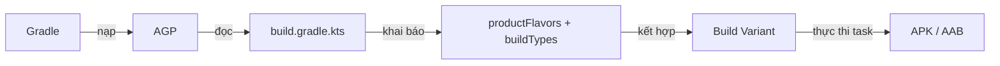
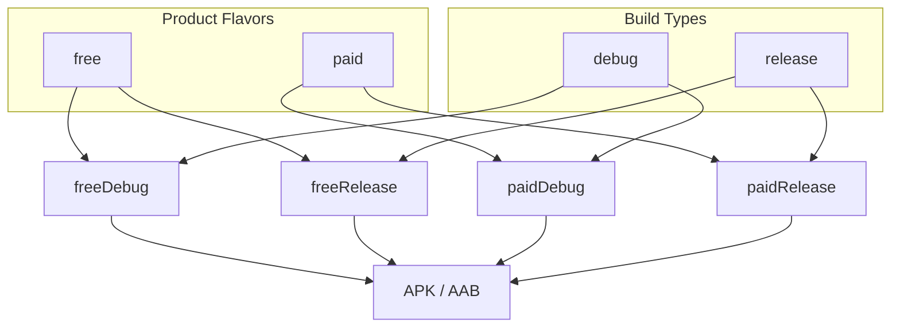
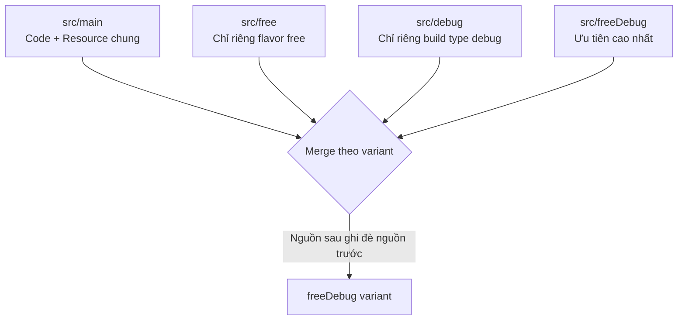

# Flavor

## Vấn đề cần giải quyết

Trong một dự án Android thực tế, rất hiếm khi bạn chỉ phát hành **một** sản phẩm duy nhất. Cùng một mã nguồn, bạn thường phải tạo ra nhiều phiên bản khác nhau:

- **Theo giai đoạn phát triển:** bản cho Developer (dev), bản cho QA test (staging), bản phát hành (production).
- **Theo nội dung sản phẩm:** bản miễn phí (free) và bản trả phí (paid), bản cho đối tác (white-label) có logo và màu sắc riêng.
- **Theo kênh phân phối:** bản Google Play, bản Samsung Store, bản dành cho thị trường Trung Quốc.

Nếu chỉ dùng **Build Types** (đã học ở topic `4.1.1.1`), bạn mới giải quyết được phần "cách build" (debug/release, có minify hay không, ký khóa nào). Nhưng bạn **không thể** tách nội dung như: bản free không có màn hình nâng cấp, bản trả phí có tất cả tính năng, mỗi khách hàng một màu sắc riêng.

Nếu bạn cứ copy nguyên một project để làm phiên bản thứ hai, bạn sẽ gặp thảm họa bảo trì:

- Sửa một bug phải sửa ở 3 project khác nhau.
- Các phiên bản dần dần lệch nhau không thể gộp lại.
- Khó nâng cấp, khó theo dõi, build chậm.

**Android cung cấp Product Flavor để giải quyết bài toán "nhiều phiên bản sản phẩm từ một mã nguồn duy nhất".**

## Sau khi học xong

- Giải thích được Product Flavor là gì và vì sao nó tồn tại.
- Phân biệt được Build Types và Product Flavors cùng lúc nào dùng loại nào.
- Mô tả được cơ chế Build Variant, flavorDimensions và thứ tự merge Source Set.
- Cấu hình được productFlavors, flavorDimensions, applicationId, versionName theo Kotlin DSL.
- Tách được code và resources (strings, colors, icon) theo từng flavor.
- Sử dụng được buildConfigField và BuildConfig.FLAVOR để phân biệt flavor trong code.
- Áp dụng được matchingFallbacks khi kết hợp app module với library module.
- Kết hợp được Flavor với CI/CD và đa cửa hàng (multi-store).

## Nền tảng cần biết trước: Gradle, AGP và Build Types

Bài này giả định bạn đã nắm các khái niệm từ topic **Build Types**:

- **Gradle** là hệ thống build dựa trên Task Graph.
- **AGP** (Android Gradle Plugin) là plugin giúp Gradle hiểu cách build Android.
- **Build Type** định nghĩa *cách* ứng dụng được build ở từng giai đoạn (debug, release, staging).

Nếu cần ôn lại, hãy đọc topic `4.1.1.1 Build Types`. Dưới đây chỉ tóm tắt mối quan hệ nền tảng:



## Product Flavor là gì?

**Product Flavor** (Loại sản phẩm) là một **biến thể của ứng dụng** mà bạn định nghĩa trong `productFlavors` block của `build.gradle.kts`. Mỗi flavor đại diện cho một "phiên bản sản phẩm" riêng biệt với cùng mã nguồn gốc.

Mỗi flavor có thể định nghĩa lại:

- `applicationId` (tên gói) — giúp cài song song hai phiên bản trên cùng một máy.
- `versionName` / `versionCode`.
- `buildConfigField` — biến môi trường, cờ bật/tắt tính năng.
- `manifestPlaceholders` — biến chèn vào `AndroidManifest.xml`.
- Source Set riêng: code, resources, assets, manifest riêng.

> [!TIP]
> **Mental model đơn giản:** Build Type trả lời câu hỏi *"Ứng dụng được build ở giai đoạn nào?"* (debug/release). Product Flavor trả lời câu hỏi *"Phiên bản sản phẩm này dành cho ai, chứa những gì?"* (free/paid/enterprise/dev/prod).

## Vì sao cần Product Flavor?

Product Flavor tồn tại vì một lý do duy nhất: **tạo nhiều phiên bản sản phẩm từ một mã nguồn duy nhất**, giúp:

- **Giảm chi phí bảo trì:** sửa một chỗ, tất cả flavor đều có thay đổi.
- **Tách nội dung hợp lý:** code chung đặt ở `src/main`, code riêng đặt ở `src/<flavor>`.
- **Phát hành độc lập:** mỗi flavor có applicationId riêng nên có thể lên store độc lập hoặc cài song song để QA.
- **Tự động hóa:** CI/CD có thể build hàng loạt flavor bằng lệnh `assemble` tương ứng.

## Phân biệt Build Types và Product Flavors

| Tiêu chí | Build Types | Product Flavors |
|---|---|---|
| Câu hỏi | *Cách* build ra sao? | *Cái gì* được build? |
| Ví dụ | `debug`, `release`, `staging` | `free`, `paid`, `dev`, `prod` |
| Thay đổi gì | Minify, signing, log, khả năng debug | applicationId, tính năng, icon, màu sắc, server |
| Người dùng có thấy không | Không (không nên thấy) | Có (đây là sản phẩm họ dùng) |
| Vai trò trong variant | Kết hợp cùng flavor tạo variant | Kết hợp cùng build type tạo variant |

> [!TIP]
> **Quy tắc ngón tay cái:** Nếu thay đổi mà người dùng cuối **không nên quan tâm** (có debug không, ký khóa nào) → **Build Type**. Nếu thay đổi mà người dùng **sẽ thấy và so sánh** (tên app, icon, tính năng, server cho từng khách hàng) → **Flavor**.

## Cơ chế hoạt động: Build Variant

**Build Variant** là kết quả kết hợp của **một Product Flavor** với **một Build Type**.

Công thức:

```
Build Variant = Product Flavor × Build Type
```

Ví dụ với 2 flavor (`free`, `paid`) và 2 build type (`debug`, `release`), bạn có **4 build variant**:

```text
freeDebug     → bản miễn phí, cho dev chạy debug
freeRelease   → bản miễn phí, phát hành
paidDebug     → bản trả phí, cho dev chạy debug
paidRelease   → bản trả phí, phát hành
```

Mỗi variant có **tên task build riêng**: `assembleFreeDebug`, `assembleFreeRelease`, `assemblePaidDebug`, `assemblePaidRelease`.



## flavorDimensions: Vì sao cần khai báo dimension?

Khi bạn chỉ có **một nhóm flavor** (ví dụ free/paid), bạn không cần `flavorDimensions`. Nhưng khi bạn có **nhiều chiều phân loại cùng lúc**, Gradle bắt buộc bạn khai báo `flavorDimensions`.

Ví dụ: app vừa phân loại theo **môi trường** (dev/prod), vừa phân loại theo **kênh phân phối** (gplay/samsung). Mỗi chiều là một `flavorDimension`:

```kotlin
android {
    flavorDimensions += listOf("environment", "store")

    productFlavors {
        create("dev") { dimension = "environment" }
        create("prod") { dimension = "environment" }
        create("gplay") { dimension = "store" }
        create("samsung") { dimension = "store" }
    }
}
```

Số variant bây giờ = số flavor của mỗi dimension nhân với nhau, rồi nhân với build type:

```text
2 (environment) × 2 (store) × 2 (build type) = 8 variant
```

> [!WARNING]
> **Cảnh báo:** số lượng variant tăng theo cấp số nhân (`n_dim1 × n_dim2 × n_buildtype`). Càng nhiều dimension, Gradle Sync càng lâu và thời gian build toàn bộ càng tăng. Chỉ thêm dimension khi thật sự cần tách độc lập hai trục phân loại.

## Khai báo Product Flavor cơ bản trong build.gradle.kts

Đây là cấu hình tối thiểu — tách 2 phiên bản sản phẩm `free` và `paid`:

```kotlin
android {
    productFlavors {
        create("free") {
            applicationId = "com.example.myapp.free"
            versionName = "1.0.0-free"
            buildConfigField("String", "PRODUCT", "\"free\"")
        }
        create("paid") {
            applicationId = "com.example.myapp.paid"
            versionName = "1.0.0-paid"
            buildConfigField("String", "PRODUCT", "\"paid\"")
        }
    }
}
```

> [!NOTE]
> `applicationId` của từng flavor thường kế thừa `applicationId` trong `defaultConfig`, sau đó ghi đè bằng hậu tố `.free`, `.paid`. Nhờ đó hai bản có thể cài song song trên cùng một máy để QA so sánh.

## Source Sets theo Flavor

Một trong những sức mạnh lớn nhất của Flavor là **Source Set riêng**.

Mặc định, mọi code/resource chung nằm ở `src/main/`. Mỗi flavor có thư mục riêng tên theo flavor:

```text
app/
 ├── src/
 │   ├── main/            ← code + resource chung cho mọi flavor
 │   │   ├── java/com/example/myapp/
 │   │   └── res/
 │   ├── free/            ← chỉ dành cho flavor free
 │   │   ├── java/com/example/myapp/
 │   │   └── res/
 │   ├── paid/            ← chỉ dành cho flavor paid
 │   │   ├── java/com/example/myapp/
 │   │   └── res/
 │   ├── debug/           ← source set theo build type (đã học ở Build Types)
 │   └── release/
```

### Thứ tự merge Source Set (quan trọng!)

Khi build một variant, AGP gộp nhiều source set lại. **Nguồn sau ghi đè nguồn trước.** Thứ tự ưu tiên từ cao đến thấp:

```text
src/<flavor><BuildType>/     (cao nhất — ví dụ freeDebug/)
src/<BuildType>/             (ví dụ debug/)
src/<flavor>/                (ví dụ free/)
src/<flavorDimension>/       (chỉ khi có dimension)
src/main/                    (thấp nhất — nền tảng chung)
```



> [!WARNING]
> Nếu cùng một file resource tồn tại ở `src/main` và `src/free`, AGP sẽ ưu tiên file ở `src/free`. Nhưng **không được** để *cùng một tên class* (ví dụ cùng package `MainActivity.kt`) xuất hiện ở nhiều source set cùng lúc — bạn sẽ gặp lỗi duplicate class. Một file code chỉ được tồn tại ở một source set.

## Tách Code theo Flavor

Khi bạn muốn mỗi flavor có logic riêng, đặt file code vào source set của flavor đó.

Ví dụ: flavor `free` hiển thị quảng cáo, flavor `paid` thì không. Tạo interface chung trong `main`, hai triển khai riêng:

```kotlin
// src/main/java/com/example/myapp/feature/AdsProvider.kt (chung)
interface AdsProvider {
    fun showBanner()
}
```

```kotlin
// src/free/java/com/example/myapp/feature/AdsProvider.kt (chỉ có trong flavor free)
class FreeAdsProvider : AdsProvider {
    override fun showBanner() {
        // Hiển thị banner quảng cáo
    }
}
```

```kotlin
// src/paid/java/com/example/myapp/feature/AdsProvider.kt (chỉ có trong flavor paid)
class PaidAdsProvider : AdsProvider {
    override fun showBanner() {
        // Không có quảng cáo
    }
}
```

> [!NOTE]
> Class nằm trong source set của flavor nào chỉ được biên dịch khi build flavor đó. Đây là cách sạch nhất để "có/không có" tính năng theo từng phiên bản sản phẩm, thay vì rải rác câu `if (BuildConfig.FLAVOR == "free")`.

## Tách Resources theo Flavor

### strings.xml theo từng flavor

Đặt file `strings.xml` cùng tên ở cả `src/main` và `src/free`, `src/paid`:

```text
src/main/res/values/strings.xml   → app_name = "MyApp"
src/free/res/values/strings.xml   → app_name = "MyApp Free"
src/paid/res/values/strings.xml   → app_name = "MyApp Pro"
```

Khi build flavor `free`, tên app hiển thị là **MyApp Free**. Resource này không cần viết thêm code — AGP tự chọn theo quy tắc merge ở trên.

### Icon, màu sắc, logo riêng

Cũng tương tự: đặt `mipmap`, `drawable`, `values/colors.xml` vào thư mục resource của từng flavor để mỗi phiên bản sản phẩm có giao diện riêng (white-label).

## buildConfigField theo Flavor

Bên cạnh build type, bạn có thể khai báo `buildConfigField` theo flavor. Đây là nơi lý tưởng để đặt **server URL theo từng phiên bản sản phẩm** — kết hợp hai chiều lại rất mạnh:

```kotlin
android {
    productFlavors {
        create("dev") {
            buildConfigField("String", "API_BASE_URL", "\"https://dev.api.example.com/\"")
            buildConfigField("boolean", "ENABLE_ANALYTICS", "false")
        }
        create("prod") {
            buildConfigField("String", "API_BASE_URL", "\"https://api.example.com/\"")
            buildConfigField("boolean", "ENABLE_ANALYTICS", "true")
        }
    }
}
```

Trong code:

```kotlin
object AppConfig {
    val apiBaseUrl: String = BuildConfig.API_BASE_URL
    val isAnalyticsEnabled: Boolean = BuildConfig.ENABLE_ANALYTICS
}
```

> [!WARNING]
> Như Build Types đã nhấn mạnh: `buildConfigField` **không phải** nơi an toàn để chứa secret. Mọi giá trị trong `BuildConfig` đều có thể bị decompile từ APK. Chỉ đặt config không nhạy cảm (URL, feature flag).

## BuildConfig.FLAVOR: Đọc tên flavor trong code

AGP tự sinh hằng số `BuildConfig.FLAVOR` chứa tên flavor hiện tại:

```kotlin
Log.d("Flavor", "Đang chạy bản: ${BuildConfig.FLAVOR}")
```

Khi bạn có nhiều dimension, mỗi dimension được sinh một hằng số riêng theo tên dimension:

```kotlin
// flavorDimensions = ["environment", "store"]
// flavor dev + gplay
BuildConfig.FLAVOR_environment  // "dev"
BuildConfig.FLAVOR_store        // "gplay"
```

> [!TIP]
> Ưu tiên dùng `buildConfigField` hoặc source set riêng thay vì rải rác `if (BuildConfig.FLAVOR == ...)` trong code chính. Kiểm tra `FLAVOR` chỉ phù hợp cho các tình huống nhỏ, tạm thời, không nằm trong luồng nghiệp vụ chính.

## Ứng dụng thực tế 1: Tách môi trường setup bằng Flavor

Đây là bài toán bạn đặt ra: **tạo nhiều bản build dựa trên môi trường setup**. 

Có hai cách tiếp cận phổ biến:

| Cách | Mô tả | Phù hợp khi |
|---|---|---|
| Dùng Build Type cho môi trường | `debug`/`staging`/`release` là môi trường | Mọi phiên bản sản phẩm đều dùng chung môi trường |
| Dùng Flavor cho môi trường | `dev`/`staging`/`prod` là flavor | Cần mỗi môi trường có applicationId riêng, cài song song, hoặc kết hợp với trục sản phẩm |

Khi bạn cần QA cài đồng thời bản **dev** và bản **prod** trên cùng một máy (mỗi bản một `applicationId`), Flavor là lựa chọn phù hợp.

```kotlin
android {
    // Bật BuildConfig để dùng buildConfigField
    buildFeatures {
        buildConfig = true
    }

    flavorDimensions += "environment"

    productFlavors {
        create("dev") {
            dimension = "environment"
            applicationId = "com.example.myapp.dev"
            versionNameSuffix = "-DEV"
            buildConfigField("String", "API_BASE_URL", "\"https://dev.api.example.com/\"")
            buildConfigField("String", "API_KEY", "\"dev_key_not_secret\"")
        }
        create("staging") {
            dimension = "environment"
            applicationId = "com.example.myapp.staging"
            versionNameSuffix = "-STG"
            buildConfigField("String", "API_BASE_URL", "\"https://staging.api.example.com/\"")
            buildConfigField("String", "API_KEY", "\"staging_key_not_secret\"")
        }
        create("prod") {
            dimension = "environment"
            applicationId = "com.example.myapp"
            buildConfigField("String", "API_BASE_URL", "\"https://api.example.com/\"")
            buildConfigField("String", "API_KEY", "\"prod_key_not_secret\"")
        }
    }
}
```

> [!TIP]
> API key "không nhạy cảm" ở trên chỉ là config. Key thật phải lấy từ server hoặc qua kiến trúc bảo mật riêng (Backend proxy, Play Integrity) — không bao giờ đặt secret trong `buildConfigField`.

## Ứng dụng thực tế 2: Kết hợp Flavor môi trường + Flavor sản phẩm + Build Type

Khi dự án vừa cần tách môi trường vừa cần tách sản phẩm (free/paid), ta dùng **2 dimension + build types**:

```kotlin
android {
    flavorDimensions += listOf("environment", "version")

    productFlavors {
        // Trục môi trường
        create("dev") { dimension = "environment" }
        create("prod") { dimension = "environment" }

        // Trục phiên bản sản phẩm
        create("free") {
            dimension = "version"
            applicationId = "com.example.myapp.free"
        }
        create("paid") {
            dimension = "version"
            applicationId = "com.example.myapp.paid"
        }
    }
}
```

Số variant:

```text
dev × free × debug  = devFreeDebug
dev × free × release = devFreeRelease
dev × paid × debug  = devPaidDebug
dev × paid × release = devPaidRelease
prod × free × debug = prodFreeDebug
prod × free × release = prodFreeRelease
prod × paid × debug = prodPaidDebug
prod × paid × release = prodPaidRelease
```

Tên task build tương ứng: `./gradlew assembleProdPaidRelease`, `./gradlew assembleDevFreeDebug`...

## matchingFallbacks: Khi app module kết hợp với library module

Khi project của bạn có **library module** (Android Library) và library đó cũng định nghĩa flavor riêng, app phải khai báo **`matchingFallbacks`** để Gradle biết flavor của app tương ứng với flavor nào của library.

Ví dụ: library có flavor `minimal`/`full`, app có flavor `free`/`paid`. App khai báo:

```kotlin
android {
    productFlavors {
        create("free") {
            matchingFallbacks += listOf("minimal")
        }
        create("paid") {
            matchingFallbacks += listOf("full")
        }
    }
}
```

> [!NOTE]
> Nếu không có `matchingFallbacks`, Gradle báo lỗi tương tự *"Flavor 'free' doesn't match flavors of module :library"* khi build. `matchingFallbacks` cũng dùng để map flavor app với flavor của một app khác trong cùng build.

## Kết hợp Flavor với CI/CD

Flavor là nền tảng để CI tự động build nhiều phiên bản. Với **GitHub Actions**, bạn có thể dùng matrix build để chạy song song các flavor:

```yaml
name: Android Build Flavors

on:
  push:
    branches: [main]

jobs:
  build:
    runs-on: ubuntu-latest
    strategy:
      matrix:
        flavor: [dev, staging, prod]
    steps:
      - uses: actions/checkout@v4
      - name: Set up JDK 17
        uses: actions/setup-java@v4
        with:
          distribution: temurin
          java-version: '17'
      - name: Grant execute permission
        run: chmod +x gradlew
      - name: Build APK
        run: ./gradlew assemble${{ matrix.flavor }}Release
      - name: Upload artifact
        uses: actions/upload-artifact@v4
        with:
          name: apk-${{ matrix.flavor }}
          path: app/build/outputs/apk/${{ matrix.flavor }}/release/*.apk
```

> [!TIP]
> Lệnh build tương ứng:
> - `./gradlew assembleDevRelease` → bản dev release
> - `./gradlew assembleProdDebug` → bản prod debug
> - `./gradlew assembleProdPaidRelease` → bản prod paid release
>
> Với 2 dimension, tên task là `assemble<Dimension1><Dimension2><BuildType>` — ví dụ `assembleProdPaidRelease`.

## Kết hợp Flavor với đa cửa hàng (Multi-store)

Khi phát hành app trên nhiều cửa hàng (Google Play, Samsung Store, Huawei AppGallery), mỗi nơi có thể yêu cầu applicationId hoặc SDK riêng. Dùng dimension `store`:

```kotlin
android {
    flavorDimensions += "store"

    productFlavors {
        create("gplay") {
            dimension = "store"
            // Google Play: có thể dùng Dynamic Delivery / Play Billing
        }
        create("samsung") {
            dimension = "store"
            applicationId = "com.example.myapp.samsung"
            // Samsung: có thể thêm Galaxy Store SDK qua source set samsung
        }
    }
}
```

Kết hợp với CI/CD, pipeline có thể build và upload từng flavor về đúng store:

```yaml
- name: Build & Deploy gplay
  run: ./gradlew assembleGplayRelease
- name: Build & Deploy samsung
  run: ./gradlew assembleSamsungRelease
```

> [!NOTE]
> Mỗi store thường yêu cầu một keystore / signing config riêng. Có thể gán `signingConfig` khác nhau trong từng flavor, hoặc trong từng build type release.

## Trade-offs và Common Mistakes (Những sai lầm thường gặp)

1. **Dùng Build Type để tách nội dung sản phẩm:** Định nghĩa `buildTypes { create("free")... }`, `create("paid")...` để đổi icon/màu. Đây là dùng sai mục đích — Build Type quyết định *cách build*, Flavor mới quyết định *nội dung*. Hậu quả: không tách được source set theo sản phẩm, variant lộn xộn.
2. **Quên khai báo `flavorDimensions` khi có nhiều trục flavor:** Gradle báo lỗi cấu hình ngay khi sync. Luôn khai báo dimension khi có từ 2 nhóm flavor trở lên.
3. **Tạo quá nhiều dimension:** Mỗi dimension nhân số variant lên. 3 dimension × 3 flavor mỗi cái × 2 build type = 18 variant → build toàn bộ rất lâu. Chỉ thêm dimension khi thật sự cần.
4. **Đặt cùng một class vào nhiều source set:** Ví dụ đặt `MainActivity.kt` cả ở `main` và `free` → lỗi duplicate class khi merge. Một class chỉ thuộc một source set.
5. **Quên `matchingFallbacks` khi dùng library có flavor:** Build fail với lỗi flavor mismatch. Khai báo `matchingFallbacks` trong từng flavor của app.
6. **Đặt secret vào `buildConfigField`:** API key, mật khẩu bị decompile từ APK. Chỉ đặt config không nhạy cảm.
7. **Quên bật `buildConfig = true`:** Với AGP 8+, dùng `BuildConfig.API_BASE_URL` mà chưa bật `buildFeatures { buildConfig = true }` sẽ báo lỗi không tìm thấy field.
8. **Nhầm tên task build:** Tên task là `assemble<Flavor><BuildType>` (ghi hoa chữ cái đầu, không có dấu phân cách). `assemblefreeRelease` sai → phải `assembleFreeRelease`.

## Tổng kết

Product Flavor cho phép bạn tạo **nhiều phiên bản sản phẩm từ một mã nguồn duy nhất**: tách code, resources, applicationId, biến môi trường theo từng flavor. Kết hợp với Build Type, bạn có **Build Variant** — mỗi variant là một sản phẩm build hoàn chỉnh, có task build riêng, dễ tự động hóa trong CI/CD và đa cửa hàng.

Nắm được `flavorDimensions`, thứ tự merge source set và `matchingFallbacks` là đủ để bạn xử lý mọi tình huống thực tế: từ tách môi trường dev/staging/prod đến tách sản phẩm free/paid và phân phối đa store.

### Lộ trình học tiếp

- **Gradle Plugin** — hiểu cách AGP và các plugin được khai báo, nạp và ảnh hưởng tới build.
- **APK / AAB** — hiểu định dạng output mà mỗi build variant tạo ra và cách đóng gói.

## Kết nối hệ thống

Trong kiến trúc dự án Android thực tế (MVVM/Clean Architecture), Flavor nằm ở tầng **build configuration** — ngoài mã nguồn nghiệp vụ:

- **UI layer** (Activity, Compose): đọc cấu hình từ `BuildConfig` hoặc DI container (Hilt/Koin) mà không quan tâm flavor nào.
- **Domain layer** (UseCase, Model): hoàn toàn độc lập, không bao giờ chạm `BuildConfig`.
- **Data layer** (Repository, API): nhận `API_BASE_URL` từ config do flavor/build type sinh ra — nơi duy nhất biết flavor.

Tách biệt này giúp việc đổi flavor không phá vỡ logic nghiệp vụ: bạn chỉ cần chọn đúng variant để build, phần còn lại của hệ thống tự hoạt động với đúng cấu hình.

## Nguồn tham khảo

- [Android Developers — Configure build variants](https://developer.android.com/build/build-variants)
- [Android Developers — Configure product flavors](https://developer.android.com/build/gradle-configure)
- [Android Developers — Build types](https://developer.android.com/build/build-types)
- [Android Developers — BuildConfig](https://developer.android.com/build/releases/gradle-plugin#build-config)
- [Android Developers — Dependency configuration (matchingFallbacks)](https://developer.android.com/build/dependencies)
- [Gradle Documentation — Product flavors](https://docs.gradle.org/current/userguide/working_with_flavors.html)
- [Android Developers — Shrink your code and resources](https://developer.android.com/build/shrink-code)
