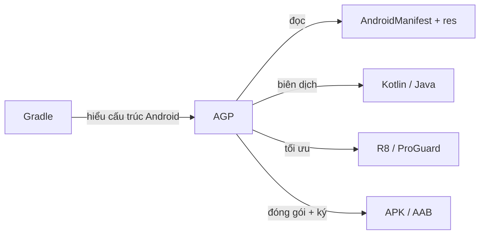
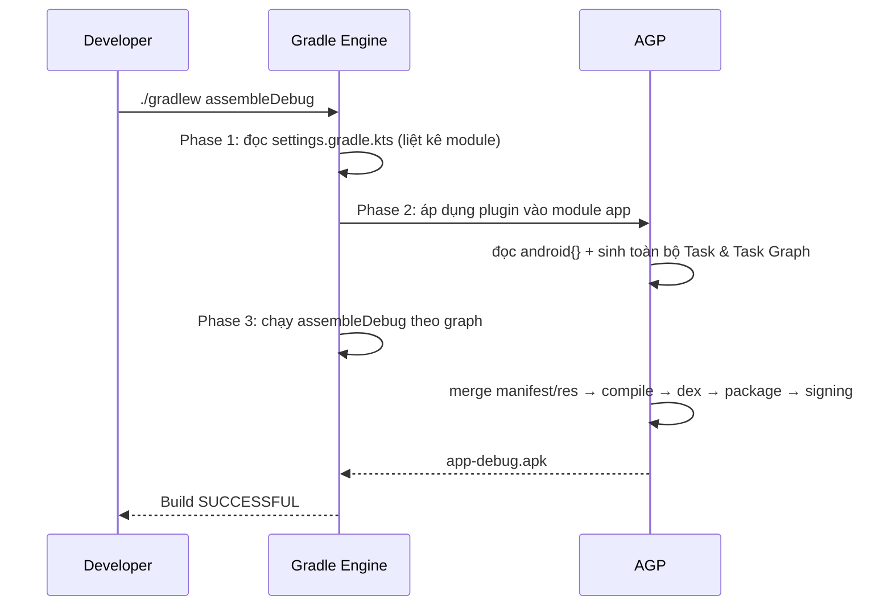

# Plugin

## Vấn đề cần giải quyết

Khi mở một dự án Android lên, bạn thấy hàng loạt file cấu hình: `settings.gradle.kts`, `build.gradle.kts` ở root, `build.gradle.kts` ở module `app`, cùng khối khai báo `android { ... }` trông như "ma thuật". Nhưng nếu tự dựng một dự án từ đầu hoặc gặp lỗi build, bạn sẽ nhận ra một câu hỏi lớn:

> Gradle vốn chỉ biết biên dịch code Java/Kotlin thông thường. Vậy ai dạy Gradle biết cách biên dịch **Android** — đọc `AndroidManifest.xml`, gộp resources, sinh file `R.java`, đóng gói thành APK/AAB, ký số, làm rối code với R8?

Câu trả lời nằm ở **Plugin**, và cụ thể với Android là **AGP (Android Gradle Plugin)**.

Nếu không hiểu Plugin và AGP, bạn sẽ gặp những vấn đề thực tế:

- Không biết sửa lỗi khi Gradle báo *"Plugin with id 'com.android.application' not found"*.
- Khai báo plugin ở sai file (root thay vì module, hoặc ngược lại) khiến plugin không được áp dụng.
- Trong project **multi-module**, khai báo plugin trùng lặp hoặc thiếu `apply false` làm build chậm hoặc lỗi.
- Hardcode phiên bản AGP rải rác, khi nâng cấp thì mỗi nơi một version dẫn đến lỗi khó chịu.
- Không tách được logic build dùng chung cho nhiều module khi dự án lớn dần.

## Sau khi học xong

- Giải thích được Plugin trong Gradle là gì và vì sao cần plugin để build Android.
- Phân biệt được các loại plugin Android của AGP (application, library, test, dynamic-feature).
- Giải thích được cơ chế hoạt động của AGP trong 3 phase của Gradle.
- Triển khai được cách khai báo và nạp plugin theo chuẩn (plugins block, apply false, version catalog).
- Áp dụng được AGP cho đơn module, multi-module và library cùng so sánh với Maven.
- Nhận diện được khi nào cần viết custom Gradle plugin và triển khai được một convention plugin cơ bản.

## Nền tảng cần biết trước

Bài này giả định bạn đã nắm các khái niệm từ topic **`4.1.1.1 Build Types`**:

- **Gradle** là một hệ thống build tổng quát dựa trên **Task Graph** (đồ thị nhiệm vụ).
- **AGP** là plugin giúp Gradle hiểu cách build Android.
- **build.gradle.kts** là file cấu hình viết bằng **Kotlin DSL**.

Nếu cần ôn lại, hãy đọc topic Build Types. Trong bài này chúng ta đi sâu vào chính AGP — thứ đứng giữa Gradle và code Android.

## Plugin trong Gradle là gì?

**Plugin** (thành phần bổ trợ) là một gói logic có thể tái sử dụng, đóng gói những công việc lặp lại của quá trình build thành các đơn vị độc lập.

Một plugin Gradle có thể:

- **Thêm Task mới** vào task graph (ví dụ `assembleRelease`, `lint`, `test`).
- **Thêm extension (DSL block)** để bạn cấu hình trong build script (ví dụ `android { ... }`).
- **Thêm dependency** mặc định hoặc cấu hình source set.
- **Mở rộng** hành vi của các plugin khác đã được áp dụng.

Nói đơn giản: **plugin là "kiến thức build" được đóng gói lại.** Gradle cung cấp bộ máy (execution engine), còn các plugin mang tri thức chuyên ngành.


> [!NOTE]
> Gradle có plugin **core** (đi kèm sẵn, ví dụ `java`, `maven-publish`) và plugin **cộng đồng / thứ ba** (phải khai báo mới nạp). AGP thuộc nhóm thứ ba — nó không nằm trong Gradle, mà do Google phát hành riêng.

## AGP là gì?

**AGP (Android Gradle Plugin)** là plugin chính thức của Google, giúp Gradle hiểu và build được dự án Android. AGP chịu trách nhiệm toàn bộ chuỗi công việc Android:

- Đọc và merge **AndroidManifest.xml**.
- Xử lý **resources** (thư mục `res/`) qua AAPT2, sinh file **`R.java`**.
- Biên dịch Kotlin/Java thành DEX cho máy ảo Android.
- Hợp nhất source set theo Build Type / Flavor (đã học ở 2 topic trước).
- Sinh **BuildConfig**, hỗ trợ **ViewBinding / DataBinding**.
- Chạy **R8/ProGuard** để rút gọn và làm rối code.
- **Đóng gói** APK / AAB và **ký số** (signing).



> [!TIP]
> **Mental model:** Gradle giống "cỗ máy chạy task", AGP giống "bộ hướng dẫn Android" cắm vào cỗ máy đó. Bạn cấu hình qua `android { ... }` — đây chính là extension mà AGP đăng ký vào build script.

## Có những loại plugin Android nào?

AGP cung cấp nhiều plugin khác nhau tùy theo loại module. Mỗi module trong project khai báo **đúng một** plugin AGP tương ứng:

| Plugin ID | Loại module | Sinh output | Dùng khi |
|---|---|---|---|
| `com.android.application` | App | APK / AAB | Module là ứng dụng cài lên thiết bị |
| `com.android.library` | Thư viện | AAR | Module là thư viện để app hoặc module khác dùng |
| `com.android.test` | Test | APK test | Module chuyên chạy test cho một module khác |
| `com.android.dynamic-feature` | Tính năng động | APK feature | Module tính năng theo mô hình Dynamic Delivery |

```kotlin
// app/build.gradle.kts — module ứng dụng
plugins {
    id("com.android.application")
    id("org.jetbrains.kotlin.android")
}
```

```kotlin
// library/build.gradle.kts — module thư viện
plugins {
    id("com.android.library")
    id("org.jetbrains.kotlin.android")
}
```

> [!WARNING]
> Một module **không được** áp dụng đồng thời `com.android.application` và `com.android.library` — Gradle sẽ báo lỗi conflict. Chọn đúng plugin theo vai trò của module.

## Cách hoạt động: AGP trong 3 phase của Gradle

Gradle chia quá trình build thành **3 phase**, và AGP tham gia chủ yếu ở phase 2:

### 1. Initialization (Khởi tạo)

Gradle đọc `settings.gradle.kts` để biết có những project/module nào (root + các module được `include`). Giai đoạn này quyết định **cấu trúc cây project**.

### 2. Configuration (Cấu hình)

Gradle đọc `build.gradle.kts` của **từng module**, và tại đây **AGP được áp dụng**: đăng ký extension `android { }`, đọc toàn bộ cấu hình (buildTypes, flavors, dependencies...), rồi **sinh ra toàn bộ Task và Task Graph** cho module đó. Phase này không biên dịch gì cả — chỉ "lập kế hoạch".

### 3. Execution (Thực thi)

Gradle nhận lệnh (ví dụ `./gradlew assembleDebug`), chọn đúng Task trong graph và chạy theo thứ tự phụ thuộc. AGP điều phối các Task Android: merge resources → biên dịch → dex → package → signing.



> [!NOTE]
> Điểm cốt lõi để gỡ lỗi: **lỗi ở phase Configuration** thường là lỗi cấu hình (sai DSL, thiếu plugin, sai phiên bản) và xuất hiện gần như ngay khi chạy lệnh. **Lỗi ở phase Execution** là lỗi trong lúc build (biên dịch fail, trùng resource, thiếu dependency).

## Khai báo và nạp plugin đúng chuẩn

### plugins block — cách hiện đại

Từ Gradle 4.10+, cách chuẩn là khai báo plugin trong block `plugins`. Gradle sẽ tự **resolve** (tải về) plugin từ repository được cấu hình ở `settings.gradle.kts`.

```kotlin
// app/build.gradle.kts
plugins {
    id("com.android.application")
    id("org.jetbrains.kotlin.android")
}
```

### apply false ở root — dùng cho multi-module

Khi project có **nhiều module** cùng dùng một plugin (ví dụ `com.android.library`), bạn nên khai báo plugin ở **root** với `apply false`. Nghĩa là: Gradle tải plugin về (để các module con dùng chung phiên bản), nhưng **không áp dụng** vào root project.

```kotlin
// build.gradle.kts (root)
plugins {
    id("com.android.application") version "8.5.2" apply false
    id("com.android.library") version "8.5.2" apply false
    id("org.jetbrains.kotlin.android") version "2.0.20" apply false
}
```

Sau đó mỗi module con chỉ khai báo `id(...)` **không kèm version**:

```kotlin
// feature:cart/build.gradle.kts
plugins {
    id("com.android.library")
    id("org.jetbrains.kotlin.android")
}
```

> [!TIP]
> Nhờ `apply false`, tất cả module dùng **cùng một phiên bản plugin**, tránh cảnh "module A dùng AGP 8.5, module B dùng AGP 8.4" gây lỗi ngầm. Đây là quy tắc vàng của multi-module.

### Version Catalog (libs.versions.toml) — quản lý phiên bản tập trung

Thay vì rải version trong từng module, Gradle cho phép tập trung vào file `gradle/libs.versions.toml`:

```toml
# gradle/libs.versions.toml
[versions]
agp = "8.5.2"
kotlin = "2.0.20"

[libraries]
# ... các dependency ...

[plugins]
android-application = { id = "com.android.application", version.ref = "agp" }
kotlin-android = { id = "org.jetbrains.kotlin.android", version.ref = "kotlin" }
```

```kotlin
// root build.gradle.kts
plugins {
    alias(libs.plugins.android.application) apply false
    alias(libs.plugins.kotlin.android) apply false
}
```

```kotlin
// app/build.gradle.kts
plugins {
    alias(libs.plugins.android.application)
    alias(libs.plugins.kotlin.android)
}
```

> [!NOTE]
> Version Catalog là chuẩn được Google khuyến nghị từ AGP 7+. Khi nâng cấp phiên bản, bạn chỉ cần sửa **một chỗ** trong `libs.versions.toml`.

### settings.gradle.kts — nơi cấu hình plugin repository

`settings.gradle.kts` khai báo nơi Gradle tìm plugin (plugin repositories):

```kotlin
// settings.gradle.kts
pluginManagement {
    repositories {
        google()   // AGP và các plugin của Google
        mavenCentral()
        gradlePluginPortal() // plugin cộng đồng
    }
}

dependencyResolutionManagement {
    repositories {
        google()
        mavenCentral()
    }
}

rootProject.name = "MyShop"
include(":app")
include(":core:network")
include(":core:designsystem")
include(":feature:cart")
```

> [!WARNING]
> Lỗi *"Plugin with id 'com.android.application' not found"* hầu hết là do quên khai báo repository `google()` trong `pluginManagement`, hoặc khai báo phiên bản sai vị trí (không có trong `plugins` block).

## AGP so với Maven

Khi nhắc đến build tool, nhiều lập trình viên từng làm Java sẽ so sánh với **Maven**. Đây là hai triết lý khác nhau, và Android chọn Gradle vì lý do rõ ràng:

| Tiêu chí | Maven | Gradle (+ AGP) |
|---|---|---|
| Cấu hình | XML (`pom.xml`) — cứng nhắc | Build script (Groovy/Kotlin DSL) — chạy được code |
| Mô hình build | **Vòng đời cố định** (lifecycle: compile → test → package) | **Task Graph** — tự do, chỉ chạy task cần thiết |
| Plugin | Đóng gói bằng Maven plugin | Plugin Gradle (script / binary) |
| Tính năng Android | Không có plugin chính thức mạnh (dựa cộng đồng, lỗi thời) | **AGP chính thức** từ Google, cập nhật liên tục |
| Tăng tốc build | Hạn chế | **Incremental build**, caching, configuration cache |
| Hỗ trợ đa ngôn ngữ | Chủ yếu Java | Java, Kotlin, Android, Kotlin Multiplatform... |

**Vì sao Android không dùng Maven?** Android cần một build tool linh hoạt để xử lý: hàng loạt build variant (Flavor × Build Type), nhiều module tách nhau, tối ưu tài nguyên, ký số linh hoạt. Maven với vòng đời cứng nhắc và thiếu plugin Android chính thức không đáp ứng được. Google đã chọn Gradle ngay từ đầu và duy trì cho đến nay.

> [!NOTE]
> Nếu bạn từng quen Maven: khái niệm gần nhất của "lifecycle" trong Gradle là **task graph** — bạn vẫn có các task tương đương (`compileDebugKotlin`, `packageDebug`) nhưng Gradle tự tính thứ tự chạy và chỉ chạy phần đã thay đổi.

## Phiên bản AGP tương thích Gradle và JDK

Mỗi phiên bản AGP yêu cầu một phiên bản **Gradle** và **JDK** tối thiểu tương ứng. Google duy trì bảng tương thích chính thức — bạn không cần nhớ, chỉ cần tra cứu khi nâng cấp:

- Bảng tương thích **AGP ↔ Gradle ↔ JDK**: [Android Developers — Android Gradle plugin release notes](https://developer.android.com/build/releases/gradle-plugin)
- Phiên bản Gradle đang dùng: chạy `./gradlew --version`
- Phiên bản AGP: xem khai báo trong `build.gradle.kts` root hoặc `libs.versions.toml`

> [!WARNING]
> Khi nâng cấp Android Studio lên bản mới, Studio thường **nhắc** nâng AGP kèm theo. Nâng AGP mà không nâng Gradle/JDK tương ứng sẽ gặp lỗi *"AGP X requires Gradle Y"* khi sync. Luôn kiểm tra bảng tương thích trước khi nâng cấp.

## Ví dụ thực tế: Cấu hình AGP cho đơn module, multi-module và library

### Đơn module (single module)

Cấu trúc đơn giản nhất: một module `app` duy nhất. Toàn bộ cấu hình Android nằm trong `app/build.gradle.kts`:

```kotlin
// app/build.gradle.kts
plugins {
    id("com.android.application")
    id("org.jetbrains.kotlin.android")
}

android {
    namespace = "com.example.myapp"
    compileSdk = 34

    defaultConfig {
        applicationId = "com.example.myapp"
        minSdk = 24
        targetSdk = 34
        versionCode = 1
        versionName = "1.0"
    }

    buildTypes {
        release {
            isMinifyEnabled = true
            proguardFiles(getDefaultProguardFile("proguard-android-optimize.txt"), "proguard-rules.pro")
        }
    }
}
```

### Multi-module

Project tách thành nhiều module, mỗi module một `build.gradle.kts`. Module app `implementation` phụ thuộc module khác:

```kotlin
// app/build.gradle.kts
dependencies {
    implementation(project(":core:network"))
    implementation(project(":feature:cart"))
}
```

```kotlin
// core/network/build.gradle.kts
plugins {
    id("com.android.library")
    id("org.jetbrains.kotlin.android")
}

android {
    namespace = "com.example.core.network"
    compileSdk = 34

    defaultConfig {
        minSdk = 24
        // library KHÔNG có applicationId
    }
}
```

> [!NOTE]
> Module `com.android.library` **không có** `applicationId` (vì không phải app độc lập), và output là file **`.aar`** (Android Archive) thay vì APK.

### Library được tái sử dụng ngoài project (AAR + publish)

Nếu library của bạn được nhiều dự án khác dùng, bạn publish nó lên repository (Maven Central, private repo...). Cấu hình cơ bản:

```kotlin
// core/network/build.gradle.kts
plugins {
    id("com.android.library")
    id("org.jetbrains.kotlin.android")
    id("maven-publish")
}

publishing {
    publications {
        register<MavenPublication>("release") {
            afterEvaluate {
                from(components["release"])
            }
        }
    }
}
```

> [!TIP]
> Trong thực tế, module `:core:designsystem` (UI kit), `:core:data`, `:feature:*` đều là `com.android.library`. Chỉ module `:app` là `com.android.application`.

## Khi nào cần tự viết custom Gradle plugin?

Bạn **không nên** vội viết custom plugin. Hãy viết khi có **nhu cầu thực tế** lặp lại giữa nhiều module hoặc nhiều dự án:

**Nên viết khi:**
- Nhiều module lặp lại cùng một khối cấu hình `android { }` (compileSdk, minSdk, signing, proguard) → dùng **Convention Plugin**.
- Nhiều dự án dùng chung logic build (sinh version, publish, chạy task kiểm tra) → đóng gói thành plugin.
- Cần thêm task tùy chỉnh vào build (sinh mã, tải file, generate config).

**Chưa nên viết khi:**
- Mới 1 module, logic build ít — thêm lớp abstraction sẽ làm build khó đọc hơn.
- Chưa chắc logic có tái sử dụng hay không — hãy đợi đến lần lặp lại thứ hai.

### Convention Plugin — pattern phổ biến nhất

Convention Plugin là cách gói toàn bộ cấu hình dùng chung vào một plugin, giúp module chỉ cần một dòng:

```kotlin
// build-logic/src/main/kotlin/AndroidLibraryConventionPlugin.kt
import com.android.build.gradle.LibraryExtension
import org.gradle.api.Plugin
import org.gradle.api.Project
import org.gradle.kotlin.dsl.configure

class AndroidLibraryConventionPlugin : Plugin<Project> {
    override fun apply(target: Project) {
        with(target) {
            pluginManager.apply("com.android.library")
            pluginManager.apply("org.jetbrains.kotlin.android")

            extensions.configure<LibraryExtension>("android") {
                compileSdk = 34
                defaultConfig {
                    minSdk = 24
                }
            }
        }
    }
}
```

Trong `build-logic`, đăng ký plugin qua file đặc tả:

```kotlin
// build-logic/build.gradle.kts
plugins {
    `kotlin-dsl`
    `java-gradle-plugin`
}

gradlePlugin {
    plugins {
        create("androidLibraryConvention") {
            id = "myconvention.android.library"
            implementationClass = "AndroidLibraryConventionPlugin"
        }
    }
}
```

Module thư viện chỉ cần:

```kotlin
// core/network/build.gradle.kts
plugins {
    id("myconvention.android.library")
}
```

> [!NOTE]
> `build-logic` thường được khai báo như một module trong `settings.gradle.kts` bằng cách `includeBuild("build-logic")`. Cách này đơn giản hơn việc publish plugin ra ngoài, và là chuẩn mà Google khuyến nghị cho multi-module lớn.

## Trade-offs và Common Mistakes (Những sai lầm thường gặp)

1. **Hardcode phiên bản plugin rải rác nhiều file:** Khi nâng cấp phải sửa nhiều nơi, dễ sót dẫn đến lỗi ngầm. **Giải pháp:** dùng `apply false` ở root + Version Catalog (`libs.versions.toml`).
2. **Khai báo plugin sai file:** Khai báo `com.android.application` ở root mà quên `apply false` → plugin áp dụng vào cả root project, hoặc module con khai báo version riêng gây xung đột. **Giải pháp:** root khai báo có version + `apply false`, module con khai báo không version.
3. **Quên `google()` trong pluginManagement:** Gradle không tìm thấy AGP → lỗi *"Plugin with id 'com.android.application' not found"*. **Giải pháp:** khai báo `google()` trong `pluginManagement.repositories`.
4. **Nâng AGP mà quên nâng Gradle/JDK:** Lỗi yêu cầu phiên bản khi sync. **Giải pháp:** tra bảng tương thích trên trang release notes của AGP trước khi nâng.
5. **Áp dụng cả application lẫn library cho một module:** Gradle báo conflict. **Giải pháp:** mỗi module chỉ dùng một plugin AGP đúng vai trò.
6. **Multi-module mà không dùng convention plugin:** Mỗi module copy-paste khối `android { }` → sửa một chỗ phải sửa tất cả, dễ lệch nhau. **Giải pháp:** trích xuất Convention Plugin khi gặp nhu cầu lặp lại thực sự.
7. **Dùng cách cũ `apply plugin: 'com.android.application'`:** Vẫn chạy nhưng không được hưởng phiên bản tập trung, dễ thiếu version. **Giải pháp:** chuyển sang `plugins { id(...) }`.

## Kết nối hệ thống

Trong kiến trúc dự án Android thực tế (multi-module, Clean Architecture), AGP và Plugin nằm ở tầng **build configuration** — bên ngoài mã nguồn nghiệp vụ:

- **UI / Domain / Data layer** (module `:feature:*`, `:core:*`): hoàn toàn không quan tâm build bằng plugin nào. Chúng chỉ khai báo plugin trong `build.gradle.kts` để module biên dịch đúng loại (app hay library).
- **Build layer** (root, `build-logic`, `libs.versions.toml`): nơi duy nhất quyết định AGP version, convention, task build, signing. Đây là nơi bạn làm việc khi nói "cấu hình build".
- **CI/CD** (GitHub Actions, Jenkins): gọi các task do AGP sinh ra (`assembleRelease`, `bundleRelease`) — nếu bạn nắm plugin, bạn biết chính xác task nào tồn tại.

Tách biệt này giúp việc nâng cấp build tool không chạm vào logic nghiệp vụ: bạn sửa AGP version, convention plugin, còn các module vẫn giữ nguyên code.

## Lịch sử phát triển

AGP được phát hành song song với Gradle từ năm 2013. Điểm mốc quan trọng nhất gần đây:

- **AGP 7.0 (2021):** bắt đầu đòi **JDK 11**, Kotlin DSL là lựa chọn ưu tiên.
- **AGP 8.0 (2023):** yêu cầu **Gradle 8.0+ và JDK 17**; `BuildConfig` mặc định **tắt** (phải bật `buildFeatures { buildConfig = true }`); tăng tốc build, cải thiện configuration cache.
- **AGP 8.x hiện tại:** tiếp tục siết yêu cầu toolchain, khuyến nghị Version Catalog và convention plugin.

Bạn không cần nhớ bảng phiên bản — hãy tra cứu trang [AGP release notes](https://developer.android.com/build/releases/gradle-plugin) mỗi khi nâng cấp để biết AGP ↔ Gradle ↔ JDK tương ứng.

## Tổng kết

Plugin là cách Gradle đóng gói "kiến thức build". Với Android, **AGP** chính là plugin quan trọng nhất: nó dạy Gradle hiểu manifest, resources, biên dịch Kotlin/Java thành DEX, tối ưu R8 và đóng gói APK/AAB.

Ba điều cốt lõi để làm việc tốt với AGP:

1. **Khai báo đúng nơi:** root khai báo có version + `apply false`, module con khai báo không version. Dùng Version Catalog để tập trung phiên bản.
2. **Hiểu 3 phase của Gradle:** Configuration phase sinh task graph (đây là nơi lỗi cấu hình xuất hiện), Execution phase chạy build thật.
3. **Chọn đúng plugin AGP:** `com.android.application` cho app, `com.android.library` cho thư viện. Khi build logic lặp lại giữa nhiều module, trích xuất thành Convention Plugin.

Nắm được AGP, bạn đọc được build script như đọc code bình thường — và gỡ lỗi build không còn là "ma thuật".

### Lộ trình học tiếp

- **`4.1.1.2 Flavor`** — kết hợp với Build Type tạo Build Variant, và hiểu cách AGP merge source set theo flavor.
- **`4.1.1.1 Build Types`** — cách AGP quản lý debug/release, signing, minify qua buildTypes.
- **Version Catalog & convention plugin** — nếu bạn làm multi-module lớn, đây là nâng cấp tự nhiên tiếp theo.
- **CI/CD (Session 11)** — tận dụng các task AGP trong pipeline build.

## Nguồn tham khảo

- [Android Developers — Android Gradle plugin release notes (bảng tương thích AGP/Gradle/JDK)](https://developer.android.com/build/releases/gradle-plugin)
- [Android Developers — Configure your build](https://developer.android.com/build)
- [Android Developers — Multi-module projects](https://developer.android.com/build/multi-module)
- [Android Developers — Custom Gradle plugin / build logic](https://developer.android.com/build/customizing-components)
- [Android Developers — Version Catalog & plugins](https://developer.android.com/build/migrate-to-catalog)
- [Gradle Documentation — Introduction to Gradle plugins](https://docs.gradle.org/current/userguide/plugins.html)
- [Gradle Documentation — Writing custom Gradle plugins](https://docs.gradle.org/current/userguide/custom_plugins.html)
- [Gradle Documentation — Version catalogs](https://docs.gradle.org/current/userguide/version_catalogs.html)
