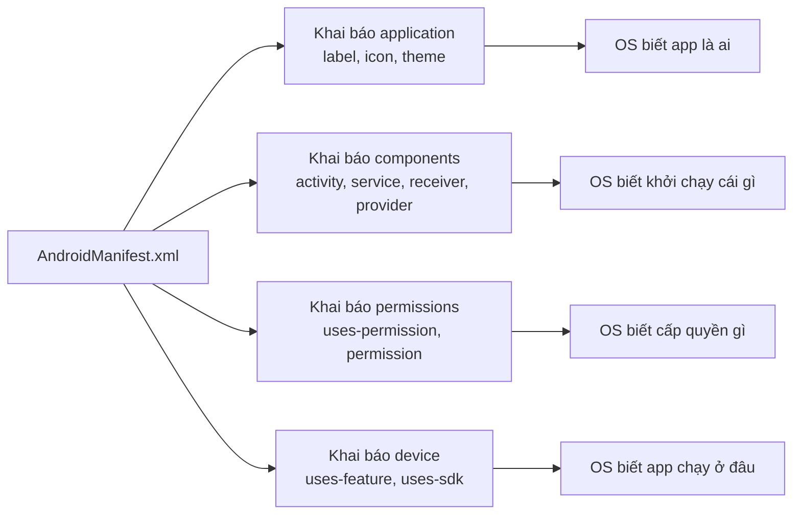
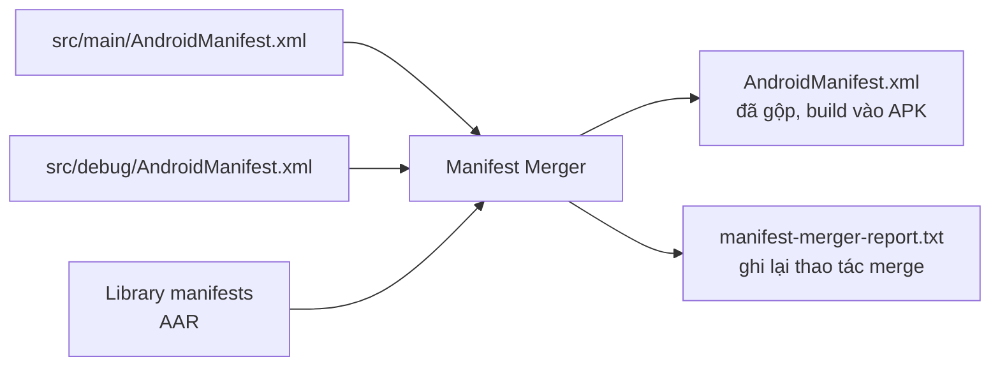
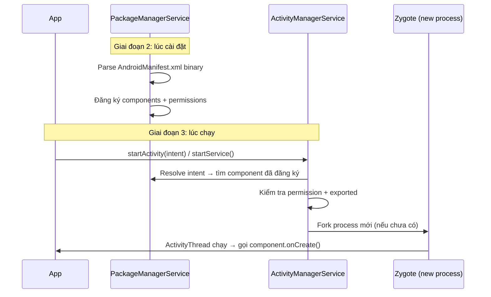
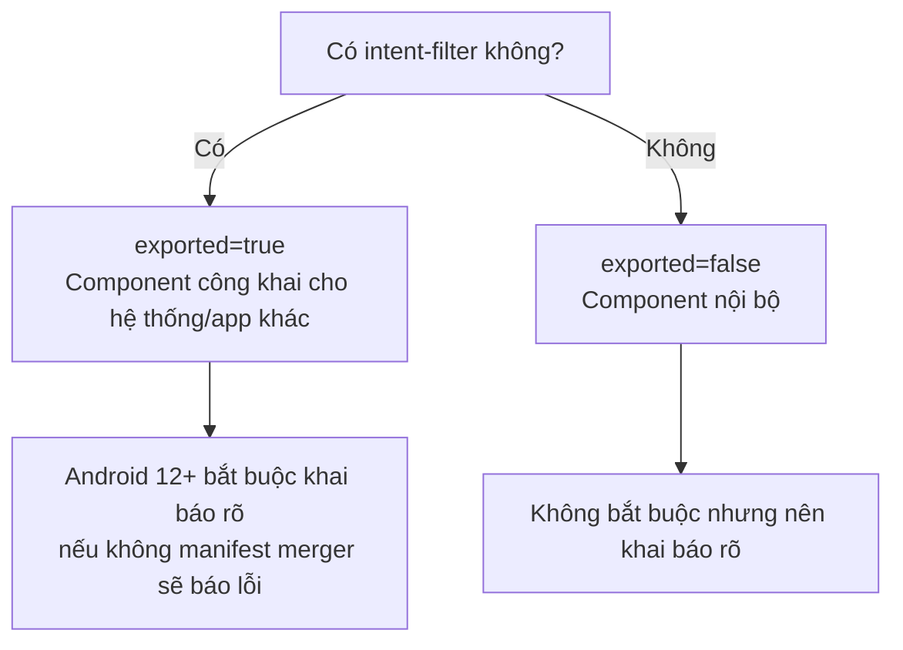
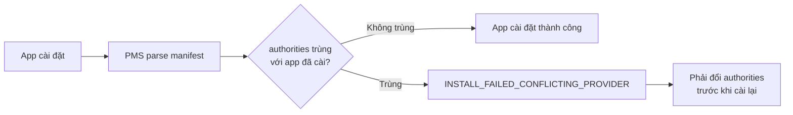
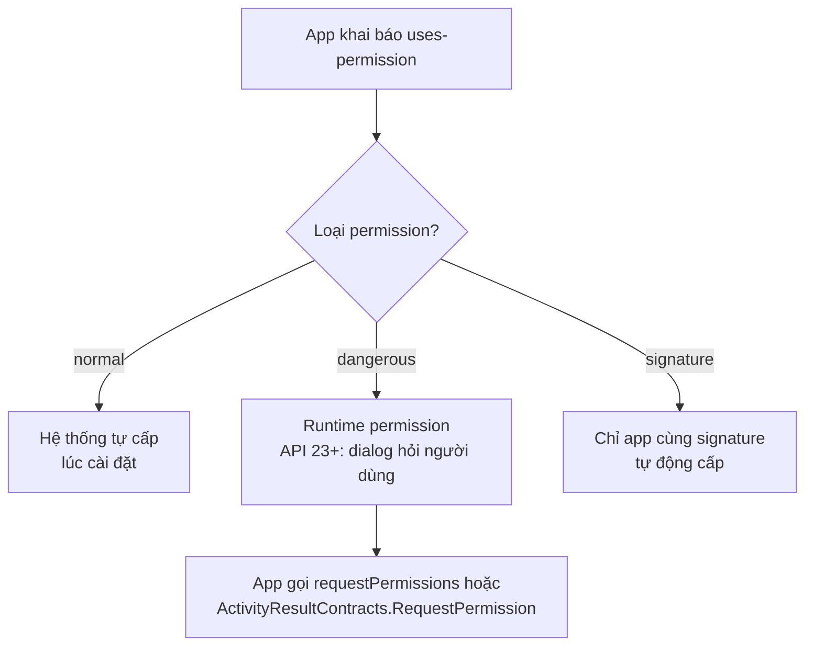
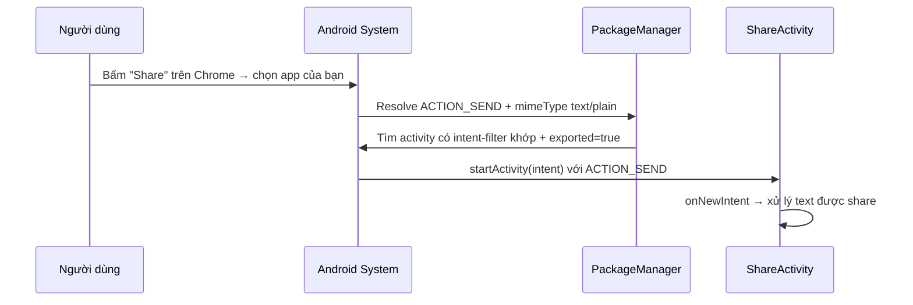
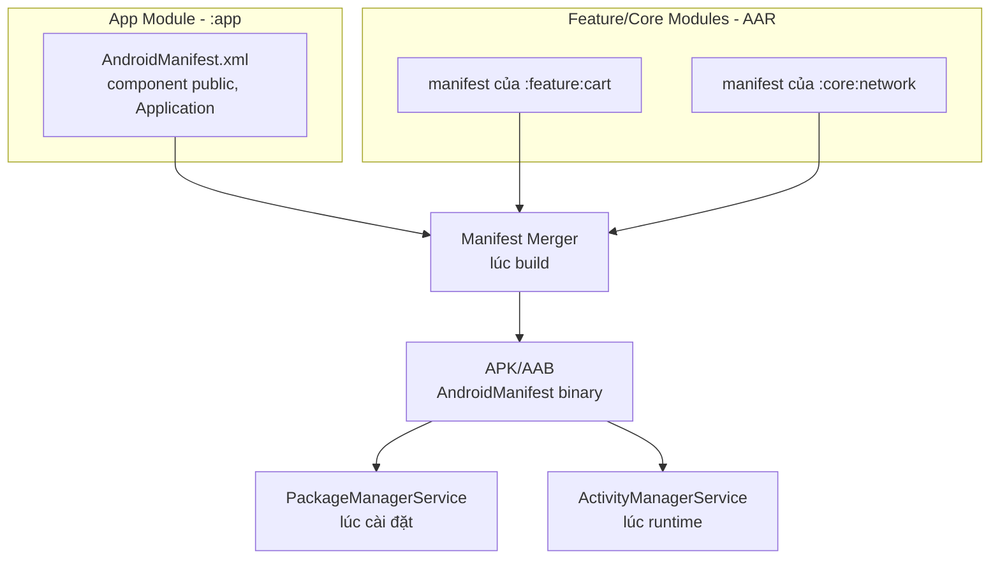

# Manifest Tags

## Vấn đề cần giải quyết

Mỗi ứng dụng Android, trước khi có thể chạy trên thiết bị, **bắt buộc** phải khai báo mình là ai và có thể làm gì với hệ điều hành. Nơi duy nhất chứa những khai báo này là file **`AndroidManifest.xml`** nằm ở root của module `app`.

Nếu không hiểu Manifest, bạn sẽ gặp những lỗi thực tế khó chịu:

- Viết xong một Activity nhưng **quên khai báo** trong Manifest → app crash ngay khi mở với `ActivityNotFoundException`.
- Nâng cấp lên **Android 12 (API 31)** thì app **crash ngay lập tức** vì thiếu `android:exported`.
- Khai báo `<provider>` trùng `authorities` với app khác → **không cài được app**.
- Đăng ký một Broadcast Receiver trong Manifest để lắng nghe `CONNECTIVITY_CHANGE` nhưng **không bao giờ nhận được sự kiện** (từ Android 8.0+).
- Khai báo quá nhiều permission → bị **Google Play từ chối** vì chính sách quyền riêng tư.
- Cấu hình `minifyEnabled = true` nhưng không khai báo `proguard-rules` → app crash chỉ ở bản release.

Bài này giúp bạn hiểu bản chất từng thẻ tag trong Manifest để biết **khai báo cái gì, vì sao, và khi nào**, thay vì mở file Manifest rồi đoán mò.

## Sau khi học xong

- Giải thích được vai trò của AndroidManifest.xml và vòng đời của nó từ lúc build, cài đặt đến runtime.
- Phân biệt được ý nghĩa và thuộc tính quan trọng của từng thẻ manifest: application, activity, service, receiver, provider, permission.
- Giải thích được cơ chế Manifest Merger và cách dùng tools: namespace để kiểm soát merge.
- Áp dụng được quy tắc android:exported cho từng component theo từng phiên bản Android.
- Triển khai được khai báo và kiểm tra permission đúng chuẩn, phân biệt normal, dangerous và signature.

## Nền tảng cần biết trước

Bài này giả định bạn đã nắm các kiến thức từ Session 01 và các topic 4.1.1:

- **APK / AAB** (Session 01) — Manifest là một trong những file được đóng gói vào APK, được biên dịch sang binary XML bằng AAPT2.
- **Build Types / Flavor / Plugin** (4.1.1) — Manifest của bạn không đứng một mình: nó bị **merge** với manifest của thư viện và của từng build variant trong lúc build.
- **Kotlin** (Session 01) — để đọc hiểu các ví dụ khai báo Application class, Service, Provider bằng code.

Nếu cần ôn lại, hãy đọc các topic nêu trên. Trong bài này, chúng ta tập trung vào **chính file Manifest** — hợp đồng giữa app và hệ điều hành.

## AndroidManifest.xml là gì?

**`AndroidManifest.xml`** là file mô tả metadata của ứng dụng. Nó khai báo với hệ điều hành Android:

- **Ứng dụng là ai** — package name, application ID, version code, version name.
- **Ứng dụng gồm những component nào** — Activity, Service, Broadcast Receiver, Content Provider.
- **Ứng dụng cần những quyền gì** — `<uses-permission>` và `<permission>` (tự định nghĩa).
- **Ứng dụng phù hợp với thiết bị nào** — `<uses-feature>`, `<uses-sdk>`.
- **Điểm vào của ứng dụng** — activity nào là launcher (màn hình khởi động).

Nói đơn giản: **Manifest là "giấy khai sinh" và "giấy phép hoạt động" của app.** Không có manifest, hệ điều hành không biết app tồn tại, không thể khởi chạy component nào, không cấp quyền gì cả.



> [!NOTE]
> Trước đây, thuộc tính `package` được khai báo trong thẻ `<manifest>`. Từ **AGP 7.3+** và đặc biệt là **AGP 8.0**, `package` trong manifest đã bị **loại bỏ** — package/namespace được khai báo trong `build.gradle.kts` qua thuộc tính `namespace`. Điều này tách biệt **namespace Java** (quản lý `R` class, BuildConfig) với **applicationId** (định danh trên Google Play).

## Cách hoạt động: Vòng đời của Manifest từ build đến runtime

Để hiểu các thẻ tag, trước tiên bạn cần biết manifest đi qua **3 giai đoạn** trong vòng đời:

### Giai đoạn 1: Build (Manifest Merger)

Khi build, AGP **không chỉ dùng một manifest**. Nó gộp (merge) tối đa **ba loại manifest** lại với nhau:

1. **Main manifest** — file `src/main/AndroidManifest.xml` của module app.
2. **Build variant manifest** — `src/debug/AndroidManifest.xml`, `src/release/AndroidManifest.xml`, hoặc `src/<flavor>/AndroidManifest.xml` (nếu có).
3. **Library manifest** — mỗi thư viện (AAR) bạn `implementation` đều kèm một manifest bên trong; các khai báo của chúng (permission, provider của library...) được merge vào.

Thứ tự ưu tiên khi xung đột: **build variant > main > library**.



> [!WARNING]
> Mỗi khi build, AGP sinh file báo cáo merge tại `app/build/outputs/logs/manifest-merger-report.txt`. Khi gặp khai báo "ma" không biết từ đâu ra, hãy mở file này để xem thao tác merge cụ thể. Đây là kỹ năng debug manifest quan trọng nhất.

### Giai đoạn 2: Cài đặt (PackageManagerService parse)

Khi app được cài đặt, **PackageManagerService (PMS)** — một service hệ thống nằm trong `system_server` — đọc binary AndroidManifest từ APK/AAB và **parse toàn bộ khai báo**:

- Đăng ký tất cả Activity, Service, Receiver, Provider vào cơ sở dữ liệu nội bộ của hệ thống.
- Kiểm tra và ghi nhận danh sách permission app yêu cầu.
- Kiểm tra xung đột: `authorities` trùng, signature conflict...

Từ lúc này, hệ thống "biết" app tồn tại và biết mỗi component nằm ở đâu.

### Giai đoạn 3: Runtime (AMS + PackageManager)

Lúc chạy, **ActivityManagerService (AMS)** và **PackageManager** sử dụng dữ liệu đã parse ở giai đoạn 2 để:

- **Resolve Intent** — khi bạn gọi `startActivity(intent)`, AMS tìm component phù hợp trong danh sách đã đăng ký.
- **Kiểm tra permission** — trước khi cho phép gọi, hệ thống kiểm tra quyền đã khai báo và được cấp.
- **Khởi chạy component** — tạo process, gọi `onCreate()` của Activity/Service/Provider...



## Cấu trúc tổng quan của Manifest

Một manifest điển hình có cấu trúc cây như sau:

```xml
<?xml version="1.0" encoding="utf-8"?>
<manifest xmlns:android="http://schemas.android.com/apk/res/android"
    xmlns:tools="http://schemas.android.com/tools">

    <uses-sdk android:minSdkVersion="24" android:targetSdkVersion="34" />
    <uses-permission android:name="android.permission.INTERNET" />

    <application
        android:label="@string/app_name"
        android:icon="@mipmap/ic_launcher"
        android:theme="@style/Theme.MyApp"
        android:name=".MyApplication"
        android:supportsRtl="true"
        android:allowBackup="true">

        <activity android:name=".MainActivity" android:exported="true">
            <intent-filter>
                <action android:name="android.intent.action.MAIN" />
                <category android:name="android.intent.category.LAUNCHER" />
            </intent-filter>
        </activity>

        <service android:name=".MyForegroundService"
            android:exported="false"
            android:foregroundServiceType="dataSync" />

        <receiver android:name=".BootReceiver"
            android:exported="false">
            <intent-filter>
                <action android:name="android.intent.action.BOOT_COMPLETED" />
            </intent-filter>
        </receiver>

        <provider android:name=".MyContentProvider"
            android:authorities="com.example.myapp.provider"
            android:exported="false" />
    </application>
</manifest>
```

> [!TIP]
> **Mental model:** thẻ `<manifest>` là gốc, thẻ `<application>` là "thân cây" chứa các component, và mỗi component là một "nhánh". Permission, uses-sdk, uses-feature là các khai báo độc lập ở cấp manifest.

## Thẻ <manifest>

Thẻ gốc chứa toàn bộ file. Hai khai báo **quan trọng nhất** ở thẻ này:

```xml
<manifest xmlns:android="http://schemas.android.com/apk/res/android"
    xmlns:tools="http://schemas.android.com/tools">
```

| Thuộc tính | Ý nghĩa |
|---|---|
| `xmlns:android` | Khai báo namespace Android. Không có namespace này, không thuộc tính `android:*` nào hoạt động. |
| `xmlns:tools` | Khai báo namespace `tools` — dùng riêng cho **Manifest Merger** (xem phần dưới), không ảnh hưởng runtime. |
| `android:versionCode` | Số nguyên tăng dần mỗi lần release (hiển thị không thấy, chỉ để hệ thống/Google Play so sánh). |
| `android:versionName` | Chuỗi hiển thị cho người dùng (ví dụ `1.2.0`). |
| `android:installLocation` | Nơi app được cài: `internalOnly`, `auto`, `preferExternal`. |

> [!NOTE]
> Thực tế hiện đại: `versionCode` và `versionName` **thường được khai báo trong `build.gradle.kts`** (khối `defaultConfig`), và AGP tự chèn vào manifest khi build. Vì vậy trong source manifest bạn hiếm khi thấy chúng — điều này cũng do `package` đã chuyển sang `namespace`.

### Khi nào cần thêm thuộc tính vào <manifest>?

- **Khi ứng dụng cần phiên bản/định danh cụ thể** được kiểm soát theo build variant (qua `buildConfigField` hoặc `manifestPlaceholders`).
- **Khi ứng dụng cần cài lên thẻ nhớ ngoài** (`installLocation`).
- Hầu hết trường hợp: bạn **không cần** đụng tới thẻ `<manifest>` ngoài 2 dòng namespace.

## Thẻ <application>

Thẻ `<application>` khai báo **cấu hình chung cho toàn bộ app**. Đây là thẻ cha chứa mọi component.

### Các thuộc tính quan trọng nhất

```xml
<application
    android:name=".MyApplication"
    android:label="@string/app_name"
    android:icon="@mipmap/ic_launcher"
    android:theme="@style/Theme.MyApp"
    android:supportsRtl="true"
    android:allowBackup="true"
    android:usesCleartextTraffic="false"
    android:fullBackupContent="@xml/backup_rules"
    android:networkSecurityConfig="@xml/network_security_config">
</application>
```

| Thuộc tính | Ý nghĩa | Khi nào dùng |
|---|---|---|
| `android:name` | Tên lớp `Application` (khởi tạo trước mọi component). | Khi cần init toàn cục (DI, analytics...) ngay khi process start. |
| `android:label` | Tên hiển thị của app (đặt dưới icon). | Luôn khai báo. Ưu tiên dùng resource `@string`. |
| `android:icon` | Icon của app. | Luôn khai báo. |
| `android:theme` | Theme mặc định cho mọi Activity không khai báo theme riêng. | Luôn khai báo. |
| `android:supportsRtl` | Hỗ trợ giao diện RTL (tiếng Ả Rập, Hebrew). | `true` nếu app hỗ trợ đa ngôn ngữ. |
| `android:allowBackup` | Cho phép hệ thống backup dữ liệu app lên cloud. | `false` nếu app chứa dữ liệu nhạy cảm (mặc định `true`). |
| `android:usesCleartextTraffic` | Cho phép HTTP (không mã hóa). | Mặc định `false` từ API 28. Chỉ bật khi dev/staging. |
| `android:networkSecurityConfig` | Cấu hình bảo mật network chi tiết. | Khi cần cho phép một số domain dùng HTTP. |
| `android:hardwareAccelerated` | Bật tăng tốc phần cứng cho vẽ UI. | Mặc định `true` từ API 14, hiếm khi cần sửa. |
| `android:largeHeap` | Xin heap lớn hơn từ hệ thống. | Chỉ khi app cần xử lý ảnh lớn; dùng sai dễ bị kill. |

> [!WARNING]
> `android:allowBackup="true"` là mặc định của hệ thống. Với app chứa dữ liệu nhạy cảm (token, dữ liệu cá nhân), Google Play **yêu cầu khai báo tường minh** `android:allowBackup="false"` hoặc cung cấp `android:fullBackupContent`/`android:dataExtractionRules`. Đây là một trong những lý do app bị từ chối hoặc bị yêu cầu cập nhật chính sách.

### Application class (`android:name`)

Khi app process được khởi tạo, hệ thống tạo instance của lớp `Application` **trước mọi Activity/Service/Receiver/Provider**. Đây là nơi lý tưởng để init Singleton, DI container, analytics:

```kotlin
class MyApplication : Application() {
    override fun onCreate() {
        super.onCreate()
        // Khởi tạo DI, Crashlytics, mặc định toàn cục...
        initializeDependencyInjection()
        initializeAnalytics()
    }
}
```

> [!NOTE]
> `Application.onCreate()` chạy trên **main thread**. Không làm việc nặng ở đây (network, đọc file lớn) — sẽ làm chậm thời điểm app bắt đầu hoạt động và dễ gây ANR.

## Thẻ <activity>

Activity là component **duy nhất có giao diện** (UI). Mỗi màn hình trong app đều là một Activity. **Mọi Activity bạn viết đều phải được khai báo** trong Manifest, nếu không app sẽ crash với `ActivityNotFoundException`.

### Khai báo cơ bản

```xml
<activity
    android:name=".MainActivity"
    android:exported="true"
    android:launchMode="singleTask"
    android:screenOrientation="portrait"
    android:configChanges="orientation|screenSize"
    android:windowSoftInputMode="adjustResize"
    android:theme="@style/Theme.MyApp.Splash"
    android:taskAffinity="com.example.special">

    <intent-filter>
        <action android:name="android.intent.action.MAIN" />
        <category android:name="android.intent.category.LAUNCHER" />
    </intent-filter>
</activity>
```

### Thuộc tính quan trọng

| Thuộc tính | Ý nghĩa | Lưu ý |
|---|---|---|
| `android:name` | Tên class Activity (dùng `.MainActivity` để ngắn — AGP tự nối với namespace). | Bắt buộc. |
| `android:exported` | Cho phép component khác (app khác/hệ thống) gọi Activity này không. | **Bắt buộc khai báo rõ từ Android 12 (API 31)** nếu có `<intent-filter>`. |
| `android:launchMode` | `standard`, `singleTop`, `singleTask`, `singleInstance`. | Quyết định Activity được tạo lại hay dùng lại. |
| `android:screenOrientation` | Ép hướng màn hình (`portrait`, `landscape`, `fullSensor`...). | Ép cứng `portrait` thường không được khuyến nghị với tablet/foldable. |
| `android:configChanges` | Liệt kê config mà app tự xử lý, không recreate. | Dùng sai dễ mất logic lifecycle. |
| `android:windowSoftInputMode` | Cách xử lý bàn phím ảo (`adjustResize`, `adjustPan`, `stateHidden`...). | Cần thiết khi màn hình có EditText. |
| `android:taskAffinity` | Nhóm task mà Activity thuộc về. | Dùng cho luồng singleTask đặc biệt (splash→main...). |
| `android:permission` | Yêu cầu caller phải có permission mới gọi được. | Bảo vệ Activity của app khác truy cập. |
| `android:process` | Chạy Activity trong process riêng (`:remote`). | Hiếm dùng; tăng chi phí bộ nhớ. |
| `android:noHistory` | Loại Activity khỏi back stack khi rời đi. | Dùng cho splash, login thành công. |
| `android:theme` | Theme riêng cho Activity (ghi đè theme application). | Dùng cho splash screen (theme với nền đúng màu). |

### android:exported — quy tắc quan trọng nhất từ Android 12

`android:exported` xác định **app khác hoặc hệ thống có được phép khởi chạy component này không**.

- **`exported="true"`**: bất kỳ app nào (có đủ permission) cũng có thể gọi. **Bắt buộc** cho Activity có `<intent-filter>` MAIN/LAUNCHER, hoặc component muốn nhận implicit intent từ hệ thống/app khác.
- **`exported="false"`**: chỉ app của mình (hoặc app cùng UID) gọi được. **Bắt buộc** cho component chỉ dùng nội bộ.



> [!WARNING]
> Từ **Android 12 (API 31)**, nếu một Activity/Service/Receiver có `<intent-filter>` mà **không khai báo `android:exported`**, quá trình build sẽ **fail** với lỗi: *"android:exported needs to be explicitly specified for element <activity>..."*. Đây là lỗi phổ biến nhất khi mọi người nâng `targetSdk` lên 31+.
>
> Về bảo mật: khai báo `exported="true"` cho component không cần thiết là **lỗ hổng** — app khác có thể khởi chạy màn hình của bạn, gọi service, gửi dữ liệu vào provider. Luôn đặt `exported="false"` trừ khi có lý do thực sự.

### Khi nào nên dùng launchMode nào?

| launchMode | Hành vi | Dùng khi |
|---|---|---|
| `standard` | Mỗi intent tạo Activity mới trong task hiện tại. | Mặc định, 95% trường hợp. |
| `singleTop` | Nếu Activity đã ở **đỉnh** stack thì dùng lại, không tạo mới. | Notification → mở đúng Activity đang hiển thị (tránh trùng lặp). |
| `singleTask` | Dùng lại Activity đã tồn tại trong task, hủy mọi Activity trên nó. | Launcher screen, main screen (tránh stack chồng nhiều bản). |
| `singleInstance` | Activity chạy trong task riêng, chỉ mình nó. | Rất hiếm (ví dụ alarm, call screen). |

> [!NOTE]
> Đừng dùng `launchMode` như "công cụ chống trùng Activity". Với project hiện đại, hãy ưu tiên **single-top declaration + Intent flags** (`FLAG_ACTIVITY_SINGLE_TOP`, `FLAG_ACTIVITY_CLEAR_TOP`) hoặc để **Jetpack Navigation** tự xử lý back stack. `launchMode` khai trong manifest là cấu hình tĩnh, khó kiểm soát theo luồng.

### Intent Filter — cách hệ thống tìm Activity

`<intent-filter>` khai báo **những implicit intent mà Activity này chấp nhận**. Hệ thống dùng nó để resolve khi có intent không chỉ định tường minh class.

```xml
<activity android:name=".ShareActivity" android:exported="true">
    <intent-filter>
        <action android:name="android.intent.action.SEND" />
        <category android:name="android.intent.category.DEFAULT" />
        <data android:mimeType="text/plain" />
    </intent-filter>
</activity>
```

Một intent-filter phải có **tối thiểu 1 `<action>`** và **1 `<category>`**. Để Activity trở thành launcher (màn hình chính), cần cặp:

```xml
<intent-filter>
    <action android:name="android.intent.action.MAIN" />
    <category android:name="android.intent.category.LAUNCHER" />
</intent-filter>
```

> [!TIP]
> Nếu Activity có `<intent-filter>` thì bắt buộc thêm `<category android:name="android.intent.category.DEFAULT" />` để hệ thống chấp nhận implicit intent (category DEFAULT là mặc định trong mọi `startActivity` ngầm). Nếu không, Activity không bao giờ được resolve từ implicit intent.

## Thẻ <service>

Service là component chạy **nền** (background), không có giao diện. Nó được dùng cho công việc dài hạn như phát nhạc, đồng bộ dữ liệu, theo dõi vị trí.

### Khai báo cơ bản

```xml
<service
    android:name=".MyForegroundService"
    android:exported="false"
    android:foregroundServiceType="dataSync"
    android:permission="android.permission.FOREGROUND_SERVICE_DATA_SYNC" />
```

| Thuộc tính | Ý nghĩa | Lưu ý |
|---|---|---|
| `android:name` | Tên class Service. | Bắt buộc. |
| `android:exported` | App khác có `bindService()`/`startService()` được không. | `false` khi chỉ nội bộ. |
| `android:foregroundServiceType` | Loại Foreground Service (`mediaPlayback`, `location`, `dataSync`, `camera`...). | **Bắt buộc từ Android 14 (API 34)** khi chạy Foreground Service. |
| `android:permission` | Permission yêu cầu khi app khác bind/start service này. | Bảo vệ service khỏi truy cập ngoài. |
| `android:process` | Chạy service trong process riêng. | Hiếm dùng. |
| `android:stopWithTask` | Service có bị stop khi user rời app không. | Mặc định `true`; đặt `false` nếu muốn tiếp tục. |
| `android:isolatedProcess` | Chạy service trong process cách ly, không có quyền app. | Bảo mật cao, hiếm dùng. |

### Intent Filter cho Service

Service có `<intent-filter>` khi muốn được **gọi ngầm** qua implicit intent (ví dụ media player xử lý `ACTION_PLAY`):

```xml
<service android:name=".MusicService" android:exported="false"
    android:foregroundServiceType="mediaPlayback">
    <intent-filter>
        <action android:name="androidx.media3.session.MediaSessionService" />
    </intent-filter>
</service>
```

> [!NOTE]
> Service thường được gọi bằng **explicit intent** (chỉ định class). Chỉ cần `<intent-filter>` khi bạn thực sự muốn service nhận implicit intent — thường là để service của bạn trở thành "provider" cho một API hệ thống (media, speech recognition...).

### Foreground Service và ràng buộc từng phiên bản

Foreground Service (FGS) là service chạy nền nhưng **phải hiển thị Notification** để người dùng biết. Ràng buộc ngày càng chặt:

- **Android 8 (API 26):** mọi service chạy nền phải là FGS nếu muốn chạy lâu; background service thuần bị giới hạn.
- **Android 14 (API 34):** bắt buộc khai báo `android:foregroundServiceType` + phải có permission tương ứng (`FOREGROUND_SERVICE_DATA_SYNC`, `FOREGROUND_SERVICE_LOCATION`...).
- **Android 15 (API 35):** giới hạn thời gian chạy tối đa 6 giờ cho FGS dataSync/mediaProcessing.

> [!WARNING]
> Từ Android 14, nếu Service chạy foreground mà **thiếu `android:foregroundServiceType`** trong manifest, hệ thống sẽ ném `MissingForegroundServiceTypeException` và crash. Luôn khai báo type + permission đi kèm.

## Thẻ <receiver>

Broadcast Receiver lắng nghe và phản ứng với **broadcast intent** từ hệ thống hoặc app khác (ví dụ: máy khởi động xong, mạng đổi, pin yếu).

### Khai báo cơ bản

```xml
<receiver
    android:name=".BootReceiver"
    android:exported="false"
    android:enabled="true">
    <intent-filter>
        <action android:name="android.intent.action.BOOT_COMPLETED" />
    </intent-filter>
</receiver>
```

| Thuộc tính | Ý nghĩa |
|---|---|
| `android:name` | Tên class Receiver. |
| `android:exported` | App khác/hệ thống gửi broadcast vào receiver này được không. |
| `android:enabled` | Receiver có được hệ thống instantiate không. |
| `android:permission` | Broadcast phải kèm permission mới được nhận. |

### Static Receiver (khai báo trong Manifest) — giới hạn từ Android 8

Có hai cách đăng ký receiver: **static** (trong Manifest) và **dynamic** (trong code qua `registerReceiver()`).

- **Static receiver**: được khởi động bởi hệ thống ngay cả khi app đang chạy nền. Nhưng từ **Android 8 (API 26)**, hầu hết **implicit broadcast** (không phải explicit) bị chặn với receiver static, nhằm tiết kiệm pin và tài nguyên.
- **Dynamic receiver**: đăng ký trong code, chỉ nhận broadcast khi app đang chạy (hoặc ở foreground), không bị giới hạn implicit nhưng phải `unregisterReceiver()` để tránh leak.

```kotlin
class MainActivity : AppCompatActivity() {
    private val receiver = object : BroadcastReceiver() {
        override fun onReceive(context: Context, intent: Intent) {
            // Xử lý broadcast khi app đang chạy
        }
    }

    override fun onStart() {
        super.onStart()
        registerReceiver(receiver, IntentFilter(ConnectivityManager.CONNECTIVITY_ACTION))
    }

    override fun onStop() {
        unregisterReceiver(receiver)  // Bắt buộc, tránh memory leak
        super.onStop()
    }
}
```

> [!WARNING]
> **Lỗi phổ biến nhất:** đăng ký static receiver trong Manifest để lắng nghe `CONNECTIVITY_CHANGE`, `BATTERY_CHANGED`, `SCREEN_ON`... rồi không bao giờ nhận được sự kiện trên Android 8+. Các broadcast này **bị hệ thống chặn** đối với receiver static. Giải pháp: dùng dynamic receiver khi app chạy, hoặc chuyển sang **WorkManager** cho công việc cần thực thi khi bị trigger bởi mạng/battery.

### Các broadcast vẫn được phép với static receiver (danh sách trắng)

Một số broadcast hệ thống vẫn được phép đăng ký static, ví dụ:

- `ACTION_BOOT_COMPLETED` — máy khởi động xong.
- `ACTION_PACKAGE_ADDED` / `ACTION_PACKAGE_REMOVED` — cài/gỡ app.
- `ACTION_MY_PACKAGE_REPLACED` — app được cập nhật.
- `ACTION_TIME_CHANGED`, `ACTION_TIMEZONE_CHANGED`.
- `ACTION_LOCALE_CHANGED`.
- `ACTION_BATTERY_LOW`, `ACTION_POWER_CONNECTED` / `DISCONNECTED`.
- `ACTION_HEADSET_PLUG`.

> [!NOTE]
> Để nhận `BOOT_COMPLETED`, app cần `<uses-permission android:name="android.permission.RECEIVE_BOOT_COMPLETED" />`. Ngoài ra, từ Android 11+ còn phải khai báo `<queries>` hoặc dùng explicit intent để nhìn thấy các package khác (Package Visibility).

## Thẻ <provider>

Content Provider là "cổng giao tiếp dữ liệu có kiểm soát" giữa các app và với hệ thống (Contacts, MediaStore, CallLog...). App của bạn triển khai provider để chia sẻ dữ liệu an toàn.

### Khai báo cơ bản

```xml
<provider
    android:name=".MyContentProvider"
    android:authorities="com.example.myapp.provider"
    android:exported="false"
    android:grantUriPermissions="true"
    android:readPermission="com.example.myapp.permission.READ_DATA"
    android:writePermission="com.example.myapp.permission.WRITE_DATA" />
```

| Thuộc tính | Ý nghĩa | Lưu ý |
|---|---|---|
| `android:name` | Tên class ContentProvider. | Bắt buộc. |
| `android:authorities` | **Định danh duy nhất** của provider, kiểu `com.example.app.provider`. | **Bắt buộc.** Không được trùng giữa các app. |
| `android:exported` | App khác có truy cập provider được không. | `false` = nội bộ, `true` = chia sẻ ra ngoài. |
| `android:grantUriPermissions` | Có thể tạm cấp quyền URI (via Intent grant) không. | `true` khi provider trả file/URI cho app khác. |
| `android:readPermission` / `writePermission` | Permission cần có để đọc/ghi. | Kiểm soát truy cập chi tiết. |
| `android:permission` | Permission chung cho mọi thao tác. | Dùng chung cho cả đọc và ghi. |

### Vì sao trùng authorities gây crash khi cài đặt?

`authorities` phải **duy nhất trên toàn hệ thống**. Khi cài đặt, PackageManagerService kiểm tra: nếu một app khác đã chiếm cùng `authorities`, quá trình cài đặt **thất bại** với lỗi:

> *"Package com.example.app: provider com.example.myapp.provider already registered"* hoặc *"INSTALL_FAILED_CONFLICTING_PROVIDER"*.



> [!WARNING]
> **Lỗi debug kinh điển:** bạn cài 2 app debug (debug & release) hoặc 2 flavor lên cùng thiết bị, cả hai đều khai báo cùng `authorities` → app thứ hai không cài được. **Giải pháp:** dùng `applicationId + ".provider"` làm authorities, hoặc dùng `manifestPlaceholders` để mỗi build variant có authorities riêng.

### Sử dụng manifestPlaceholders để tránh trùng authorities

Trong `build.gradle.kts`:

```kotlin
defaultConfig {
    applicationId = "com.example.myapp"
    manifestPlaceholders["providerAuthority"] = "${applicationId}.provider"
}
```

Trong Manifest:

```xml
<provider
    android:name=".MyContentProvider"
    android:authorities="${providerAuthority}"
    android:exported="false" />
```

> [!TIP]
> Nhờ placeholder, mỗi flavor/variant (debug, release, staging...) tự có `authorities` khác nhau vì `applicationId` khác nhau — hết cảnh trùng provider khi cài nhiều bản cùng lúc.

## Thẻ <uses-permission> và <permission>

### <uses-permission> — xin quyền từ hệ thống

Khai báo quyền mà app cần để truy cập tài nguyên được bảo vệ (Internet, camera, vị trí, danh bạ...):

```xml
<uses-permission android:name="android.permission.INTERNET" />
<uses-permission android:name="android.permission.ACCESS_FINE_LOCATION" />
<uses-permission android:name="android.permission.ACCESS_COARSE_LOCATION"
    android:maxSdkVersion="30" />
```

| Thuộc tính | Ý nghĩa |
|---|---|
| `android:name` | Tên permission (từ hệ thống hoặc từ app khác). |
| `android:maxSdkVersion` | Chỉ xin permission tối đa đến API nào (thường để xin legacy permission cho bản cũ). |

### Các loại permission (protection level)

| Loại | Cấp tự động | Ví dụ |
|---|---|---|
| **normal** | Hệ thống tự cấp lúc cài đặt, không hỏi người dùng. | `INTERNET`, `ACCESS_NETWORK_STATE`, `VIBRATE` |
| **dangerous** | Cần **runtime permission** (Android 6.0+/API 23+): hiện dialog hỏi người dùng lúc chạy. | `CAMERA`, `RECORD_AUDIO`, `ACCESS_FINE_LOCATION`, `READ_CONTACTS` |
| **signature** | Chỉ cấp cho app ký cùng signature. | Các API hệ thống, giao tiếp app cùng nhà phát hành. |



### Runtime permission — khai báo thôi chưa đủ

Với permission **dangerous**, khai báo trong Manifest là **điều kiện cần nhưng chưa đủ**. App phải **hỏi người dùng lúc chạy**:

```kotlin
private val locationPermissionLauncher =
    registerForActivityResult(ActivityResultContracts.RequestPermission()) { granted ->
        if (granted) {
            startLocationUpdates()
        } else {
            // Xử lý từ chối
        }
    }

fun requestLocationPermission() {
    if (ContextCompat.checkSelfPermission(this, Manifest.permission.ACCESS_FINE_LOCATION)
        == PackageManager.PERMISSION_GRANTED
    ) {
        startLocationUpdates()
    } else {
        locationPermissionLauncher.launch(Manifest.permission.ACCESS_FINE_LOCATION)
    }
}
```

> [!NOTE]
> **Best practice:** khai báo **đúng** permission cần dùng, không khai báo thừa. Mỗi permission thừa là một rào cản niềm tin với người dùng và là lý do Google Play từ chối/giới hạn app. Ví dụ: app chỉ đọc mạng thì dùng `ACCESS_NETWORK_STATE` + `INTERNET`, không cần `READ_PHONE_STATE`.

### <permission> — tự định nghĩa quyền

Khi app của bạn muốn bảo vệ component hoặc dữ liệu bằng **quyền do chính mình định nghĩa** (component trong app, hoặc chia sẻ cho app khác cùng signature):

```xml
<permission
    android:name="com.example.myapp.permission.READ_DATA"
    android:protectionLevel="signature"
    android:label="@string/perm_read_data_label"
    android:description="@string/perm_read_data_desc" />
```

Sau đó dùng trong provider/service/activity:

```xml
<provider
    android:name=".MyContentProvider"
    android:authorities="com.example.myapp.provider"
    android:exported="true"
    android:readPermission="com.example.myapp.permission.READ_DATA" />
```

> [!NOTE]
> Với quyền **signature**, chỉ những app ký cùng keystore mới được cấp. Đây là cách chuẩn để các app trong cùng một hệ sinh thái (cùng công ty) chia sẻ dữ liệu an toàn mà không để lọt ra app khác.

## <uses-feature> và <queries>

### <uses-feature> — khai báo yêu cầu phần cứng

Khai báo thiết bị cần có tính năng phần cứng gì thì app mới hoạt động đúng:

```xml
<uses-feature
    android:name="android.hardware.camera"
    android:required="true" />
<uses-feature
    android:name="android.hardware.location.gps"
    android:required="false" />
```

- `required="true"` → Google Play **không cho** thiết bị thiếu tính năng này cài app.
- `required="false"` → app vẫn cài được, nhưng phải tự kiểm tra tính năng lúc chạy.

> [!NOTE]
> Khai báo một số permission sẽ **ngầm đòi** uses-feature tương ứng (ví dụ `CAMERA` permission → ngầm yêu cầu camera). Nếu app chỉ dùng camera "nếu có", phải khai báo `<uses-feature android:name="android.hardware.camera" android:required="false" />` để Google Play không chặn thiết bị không có camera.

### <queries> — Package Visibility từ Android 11

Từ **Android 11 (API 30)**, app không "nhìn thấy" các package khác trừ khi khai báo. Nếu app cần `queryIntentActivities()` hoặc `resolveActivity()` để tìm app xử lý intent, phải khai báo `<queries>`:

```xml
<queries>
    <intent>
        <action android:name="android.intent.action.SEND" />
        <data android:mimeType="text/plain" />
    </intent>
    <package android:name="com.example.targetapp" />
</queries>
```

> [!WARNING]
> Không khai báo `<queries>` khi cần `resolveActivity()` → hàm **luôn trả về `null`** trên Android 11+, gây crash hoặc chặn luồng "share/chọn app". Lỗi này rất khó phát hiện vì chỉ xảy ra trên thiết bị Android 11+.

## Thẻ <meta-data>

Cho phép khai báo dữ liệu key-value tùy ý trong Manifest, được các **thư viện đọc lúc runtime** (Google Maps API key, Firebase, thư viện SDK...):

```xml
<application>
    <meta-data
        android:name="com.google.android.geo.API_KEY"
        android:value="${MAPS_API_KEY}" />
</application>
```

```xml
<activity android:name=".MainActivity">
    <meta-data
        android:name="android.nfc.meta_data"
        android:value="true" />
</activity>
```

Ứng dụng có thể đọc `<meta-data>` trong code:

```kotlin
val ai = packageManager.getApplicationInfo(packageName, PackageManager.GET_META_DATA)
val apiKey = ai.metaData?.getString("com.google.android.geo.API_KEY")
```

> [!TIP]
> Giá trị `${MAPS_API_KEY}` là **manifestPlaceholder** được thay lúc build — cho phép debug dùng key riêng, release dùng key khác mà không hardcode secret trong source code.

## Manifest Merger và tools: namespace

Đây là phần **quan trọng nhất để debug manifest**. Khi có xung đột giữa main manifest và library manifest, bạn dùng namespace `tools` để kiểm soát kết quả merge.

### tools:replace — ghi đè thuộc tính

Khi library khai báo `android:label` khác và bạn muốn main manifest ghi đè:

```xml
<application
    android:label="@string/app_name"
    android:icon="@mipmap/ic_launcher"
    tools:replace="android:label, android:icon" />
```

### tools:remove — xóa khai báo từ library

```xml
<uses-permission
    android:name="com.some.library.permission.UNNECESSARY"
    tools:remove="android:name" />
```

### tools:node — kiểm soát toàn bộ node

- `tools:node="merge"` — mặc định, gộp thuộc tính.
- `tools:node="replace"` — thay toàn bộ node từ library.
- `tools:node="remove"` — xóa node.

```xml
<application tools:node="replace">
    <!-- Toàn bộ application thay thế cấu hình từ library -->
</application>
```

### Lỗi merge điển hình

> *"Attribute application@label value=(@string/app_name) from AndroidManifest.xml is also present at [library] value=(...)"*

**Nguyên nhân:** thư viện khai báo cùng thuộc tính với main manifest. **Giải pháp:** thêm `tools:replace` cho thuộc tính đó.

```xml
<application
    android:label="@string/app_name"
    tools:replace="android:label" />
```

> [!NOTE]
> Khi gặp lỗi merge, AGP báo chính xác hai bên xung đột (main manifest vs library nào). Đừng vội xóa library — hãy đọc thông báo để xác định thuộc tính nào cần `tools:replace`.

## Khi nào không nên lạm dụng Manifest

Manifest giải quyết rất nhiều vấn đề, nhưng **không phải là nơi cho mọi thứ**:

| Việc | Nên làm ở Manifest? | Vì sao |
|---|---|---|
| Khai báo component | ✅ Bắt buộc | Hệ thống cần biết để khởi chạy. |
| Khai báo permission cần dùng | ✅ Bắt buộc | Hệ thống kiểm soát truy cập. |
| Version, package | ❌ Không nên | Đã chuyển sang `build.gradle.kts` (`namespace`, `versionCode`...). |
| Cấu hình môi trường theo flavor | ⚠️ Hạn chế | Ưu tiên `buildConfigField`/`resValue`/placeholder thay vì nhiều manifest. |
| Logic runtime, khởi tạo nặng | ❌ Không nên | Đưa vào `Application.onCreate()` hoặc DI container, không đặt cấu hình tĩnh ở manifest. |
| Chống trùng Activity | ⚠️ Hạn chế | Ưu tiên Intent flags / Navigation component thay vì `launchMode` cứng. |

> [!TIP]
> Quy tắc chung: **Manifest khai báo "app là gì"**, `build.gradle.kts` cấu hình "build như thế nào". Nếu thấy mình đang viết cấu hình biến môi trường vào manifest, hãy chuyển sang placeholder/buildConfigField.

## Ví dụ thực tế: Manifest hoàn chỉnh cho app multi-feature

Đây là ví dụ một manifest thực tế của app có: launcher, màn hình chi tiết nhận share, foreground service đồng bộ, receiver khởi động, provider chia sẻ dữ liệu, và runtime permission.

```xml
<?xml version="1.0" encoding="utf-8"?>
<manifest xmlns:android="http://schemas.android.com/apk/res/android"
    xmlns:tools="http://schemas.android.com/tools">

    <!-- Permission normal -->
    <uses-permission android:name="android.permission.INTERNET" />
    <uses-permission android:name="android.permission.ACCESS_NETWORK_STATE" />

    <!-- Permission dangerous → phải xin runtime -->
    <uses-permission android:name="android.permission.ACCESS_FINE_LOCATION" />
    <uses-permission android:name="android.permission.POST_NOTIFICATIONS" />

    <!-- Permission cần cho foreground service -->
    <uses-permission android:name="android.permission.FOREGROUND_SERVICE" />
    <uses-permission android:name="android.permission.FOREGROUND_SERVICE_DATA_SYNC" />

    <!-- Receiver BOOT_COMPLETED -->
    <uses-permission android:name="android.permission.RECEIVE_BOOT_COMPLETED" />

    <application
        android:name=".MyApplication"
        android:allowBackup="false"
        android:icon="@mipmap/ic_launcher"
        android:label="@string/app_name"
        android:supportsRtl="true"
        android:theme="@style/Theme.MyApp"
        tools:replace="android:label">

        <!-- Launcher -->
        <activity
            android:name=".MainActivity"
            android:exported="true"
            android:launchMode="singleTask">
            <intent-filter>
                <action android:name="android.intent.action.MAIN" />
                <category android:name="android.intent.category.LAUNCHER" />
            </intent-filter>
        </activity>

        <!-- Nhận chia sẻ văn bản từ app khác -->
        <activity
            android:name=".ShareActivity"
            android:exported="true"
            android:theme="@style/Theme.MyApp.Translucent">
            <intent-filter>
                <action android:name="android.intent.action.SEND" />
                <category android:name="android.intent.category.DEFAULT" />
                <data android:mimeType="text/plain" />
            </intent-filter>
        </activity>

        <!-- Foreground service đồng bộ -->
        <service
            android:name=".SyncService"
            android:exported="false"
            android:foregroundServiceType="dataSync" />

        <!-- Receiver khởi động -->
        <receiver
            android:name=".BootReceiver"
            android:enabled="true"
            android:exported="false">
            <intent-filter>
                <action android:name="android.intent.action.BOOT_COMPLETED" />
            </intent-filter>
        </receiver>

        <!-- Provider nội bộ, authorities theo applicationId -->
        <provider
            android:name=".DataProvider"
            android:authorities="${providerAuthority}"
            android:exported="false" />

        <!-- API key cho Maps library -->
        <meta-data
            android:name="com.google.android.geo.API_KEY"
            android:value="${MAPS_API_KEY}" />
    </application>
</manifest>
```

Với `build.gradle.kts` tương ứng:

```kotlin
android {
    namespace = "com.example.myapp"
    compileSdk = 34

    defaultConfig {
        applicationId = "com.example.myapp"
        minSdk = 24
        targetSdk = 34
        manifestPlaceholders["providerAuthority"] = "${applicationId}.provider"
        manifestPlaceholders["MAPS_API_KEY"] = project.findProperty("mapsApiKey") as String? ?: ""
    }
}
```

### Phân tích luồng: người dùng share link vào app



## Trade-offs và Common Mistakes (Sai lầm thường gặp)

1. **Quên khai báo component trong Manifest:** Activity/Service/Receiver/Provider không khai báo → crash khi gọi (`ActivityNotFoundException`). **Giải pháp:** luôn kiểm tra manifest sau khi tạo component mới.
2. **Thiếu `android:exported` trên Android 12+:** build fail. **Giải pháp:** khai báo rõ `exported` cho mọi component có intent-filter; `false` cho nội bộ.
3. **Khai báo `exported="true"` cho component nội bộ:** lỗ hổng bảo mật — app khác gọi được Activity/Service/Provider của bạn. **Giải pháp:** mặc định `false`, chỉ mở khi thực sự cần.
4. **Static receiver nghe broadcast bị chặn (API 26+):** receiver không bao giờ được gọi. **Giải pháp:** dùng dynamic receiver khi app chạy, hoặc WorkManager; chỉ đăng ký static cho broadcast thuộc danh sách trắng.
5. **Trùng `authorities` giữa các app/flavor:** không cài được app (`INSTALL_FAILED_CONFLICTING_PROVIDER`). **Giải pháp:** authorities theo `applicationId` qua manifestPlaceholder.
6. **Khai báo permission thừa:** app bị Google Play giới hạn/từ chối, người dùng mất niềm tin. **Giải pháp:** chỉ khai báo đúng permission cần; dùng `android:maxSdkVersion` cho permission chỉ cần ở bản cũ.
7. **`allowBackup="true"` cho app nhạy cảm:** dữ liệu bị backup lên cloud của Google. **Giải pháp:** đặt `false` hoặc cấu hình `dataExtractionRules`/`fullBackupContent`.
8. **Dùng `launchMode` để giải quyết vấn đề back stack:** cứng nhắc, khó theo luồng. **Giải pháp:** ưu tiên Intent flags + Navigation component.
9. **Không đọc `manifest-merger-report.txt` khi gặp khai báo "ma":** mất thời gian truy tìm nguồn gốc thẻ lạ. **Giải pháp:** mở file report để xem thao tác merge.
10. **Thiếu `<queries>` trên Android 11+:** `resolveActivity()` trả `null`, app không tìm được app xử lý intent. **Giải pháp:** khai báo `<queries>` với intent/package cần.
11. **Foreground Service thiếu `foregroundServiceType` (Android 14+):** crash `MissingForegroundServiceTypeException`. **Giải pháp:** khai báo type + permission tương ứng.
12. **Ép `screenOrientation="portrait"` cho mọi màn hình:** trải nghiệm kém trên tablet/foldable. **Giải pháp:** dùng `unset`/`fullSensor`, hoặc responsive layout.

## Kết nối hệ thống

### Vị trí của Manifest trong kiến trúc dự án

Trong một dự án Android thực tế (multi-module, Clean Architecture), Manifest nằm ở **tầng ứng dụng (app layer)** — nơi duy nhất giao tiếp trực tiếp với hệ điều hành:

- **App module (`:app`):** chứa manifest chính, khai báo launcher, Application class, các component public. Đây là nơi hệ thống "nhìn thấy" toàn bộ app.
- **Feature/Domain/Data module (`:feature:*`, `:core:*`):** mỗi module library có **manifest riêng bên trong AAR**, khai báo component và permission của riêng module. Những manifest này **tự động merge** vào manifest app khi build.
- **Hệ điều hành:** PMS (cài đặt) và AMS (runtime) là hai phía tiêu thụ dữ liệu manifest.



### Tương tác với các tầng khác

- **UI (Activity/Fragment):** Activity phải được khai báo, có `exported` đúng, intent-filter hợp lý thì navigation và deep link mới hoạt động.
- **Background (Service/WorkManager):** Service phải khai báo đúng `foregroundServiceType`; WorkManager tự đăng ký component của nó qua manifest của thư viện.
- **Data (Provider/Room):** Room tự khai báo provider của mình (dùng để lưu schema) — đó là lý do bạn thấy provider "lạ" trong manifest đã merge. `authorities` của Room cũng sinh theo applicationId.
- **Domain logic:** hoàn toàn không phụ thuộc manifest — Manifest là ranh giới giữa code nghiệp vụ và hệ điều hành.

> [!NOTE]
> **Room:** thư viện Room tự thêm một `<provider>` vào manifest để lưu schema database. Nếu bạn thấy `androidx.room.RoomOpenHelper` trong manifest đã merge, đó là từ thư viện — đừng xóa. Đây là minh chứng rõ nhất cho cơ chế Manifest Merger.

## Lịch sử phát triển

- **Android 1.0:** Manifest ra đời cùng platform, khai báo package, component, permission.
- **Android 6.0 (API 23, 2015):** giới thiệu **Runtime Permission** — permission dangerous không còn cấp tự động lúc cài mà hỏi người dùng lúc chạy. Khai báo manifest vẫn bắt buộc.
- **Android 7.0 (API 24):** `android:dataExtractionRules` phục vụ backup riêng theo version.
- **Android 8.0 (API 26, 2017):** giới hạn **implicit broadcast** cho static receiver; bắt buộc Foreground Service khi chạy nền lâu.
- **AGP 7.3 (2022):** `package` trong manifest bắt đầu deprecated, chuyển sang `namespace` trong build script.
- **Android 12 (API 31, 2021):** **bắt buộc `android:exported`** khi component có intent-filter; giới thiệu `android:exported` cho receiver như nhau.
- **AGP 8.0 (2023):** loại bỏ `package` khỏi manifest — chỉ còn `namespace`.
- **Android 14 (API 34, 2023):** bắt buộc `android:foregroundServiceType`; quy định quyền notification `POST_NOTIFICATIONS` là runtime permission.
- **Android 15 (API 35, 2024):** giới hạn thời gian chạy tối đa cho một số loại Foreground Service; siết thêm quyền riêng tư.

## Tổng kết

AndroidManifest.xml là **hợp đồng giữa app và hệ điều hành**: khai báo app là ai, gồm những component nào, cần quyền gì, và phù hợp với thiết bị nào.

Ba điều cốt lõi để làm việc tốt với Manifest:

1. **Khai báo đủ, đúng, ít:** mọi component phải có trong manifest; `exported` đặt `false` theo mặc định; permission chỉ khai báo cái thực sự dùng.
2. **Hiểu Manifest Merger:** manifest cuối cùng là kết quả gộp từ main + variant + library. Gặp khai báo lạ, mở `manifest-merger-report.txt`; kiểm soát xung đột bằng `tools:replace`/`tools:remove`.
3. **Cập nhật theo phiên bản:** quy tắc `exported` (Android 12+), implicit broadcast (Android 8+), `foregroundServiceType` (Android 14+) là những ràng buộc mà manifest phải tuân thủ theo từng API level.

Nắm được Manifest, bạn đọc được "giấy khai sinh" của mọi app Android — và biết chính xác hệ thống nhìn thấy gì ở app của mình.

### Lộ trình học tiếp

- **`4.2.1 Activity`** — lifecycle, task & back stack, hiểu sâu về component được khai báo ở manifest.
- **`4.2.3 Android Service`** — triển khai started/bound/foreground service, kết nối với `foregroundServiceType`.
- **`4.2.4 Broadcast Receiver`** — static vs dynamic receiver, giới hạn implicit broadcast.
- **`4.2.5 Content Provider`** — triển khai provider, quyền đọc/ghi, chia sẻ dữ liệu.
- **`4.2.6 Intent`** — explicit/implicit intent, intent filter, cách hệ thống resolve component.

## Nguồn tham khảo

- [Android Developers — App Manifest Overview](https://developer.android.com/guide/topics/manifest/manifest-intro)
- [Android Developers — Application element](https://developer.android.com/guide/topics/manifest/application-element)
- [Android Developers — Activity element](https://developer.android.com/guide/topics/manifest/activity-element)
- [Android Developers — Service element](https://developer.android.com/guide/topics/manifest/service-element)
- [Android Developers — Receiver element](https://developer.android.com/guide/topics/manifest/receiver-element)
- [Android Developers — Provider element](https://developer.android.com/guide/topics/manifest/provider-element)
- [Android Developers — Manifest Merger](https://developer.android.com/build/manage-manifests)
- [Android Developers — Manifest merger reference (tools: replace/remove)](https://developer.android.com/build/manifest-merger)
- [Android Developers — Permissions overview](https://developer.android.com/guide/topics/permissions/overview)
- [Android Developers — Runtime permissions](https://developer.android.com/guide/topics/permissions/navigation)
- [Android Developers — Foreground service types (Android 14+)](https://developer.android.com/develop/background-work/services/fgs)
- [Android Developers — Package visibility on Android 11+](https://developer.android.com/training/package-visibility)
- [Android Developers — android:exported requirement on Android 12+](https://developer.android.com/about/versions/12/behavior-changes-12#exported)
