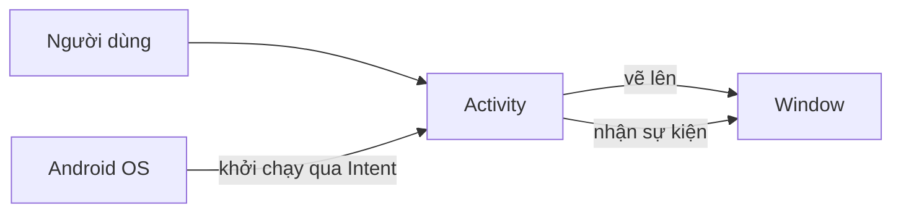
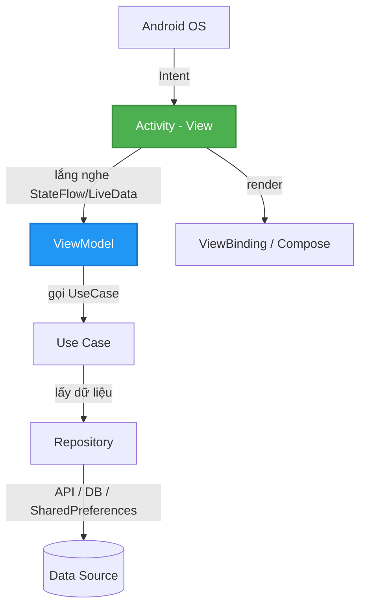
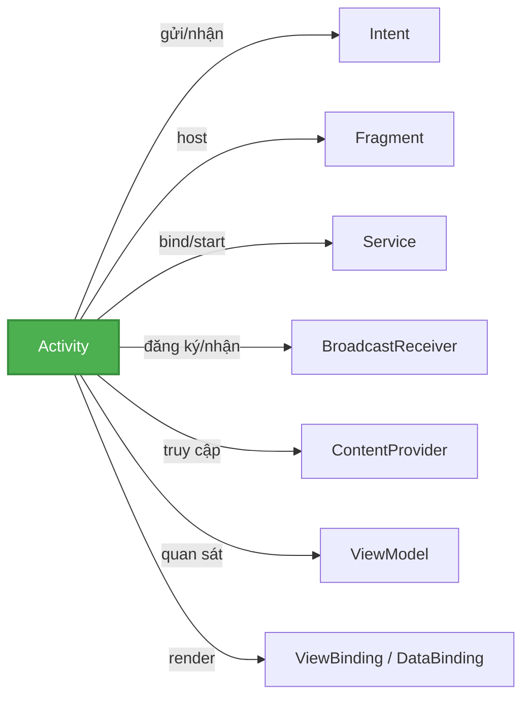
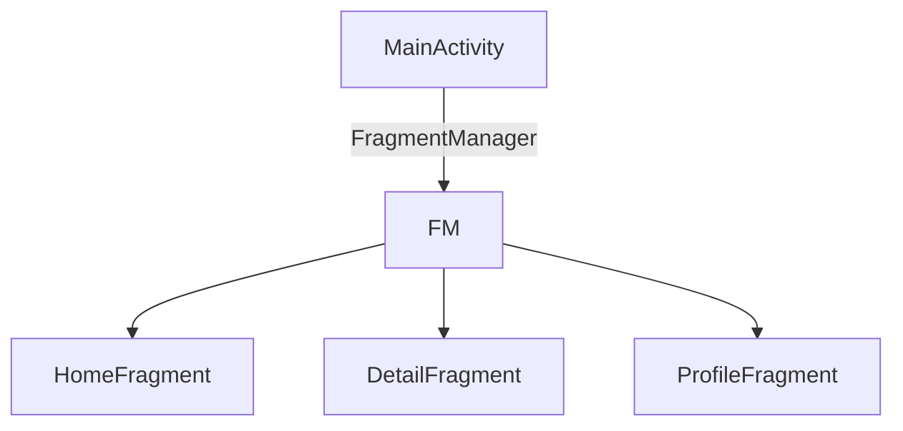
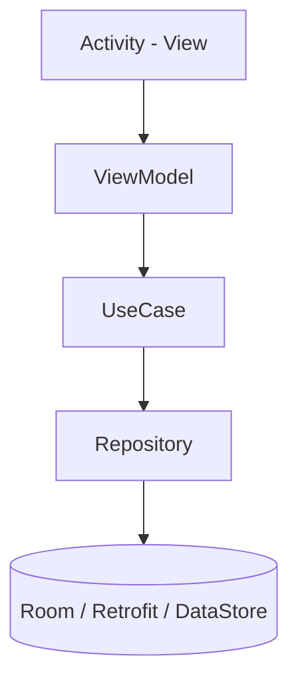

# Activity Overview

## Vấn đề cần giải quyết

Khi một Android developer bắt đầu làm quen với hệ sinh thái Android, câu hỏi đầu tiên gần như luôn là:

> "Activity là gì, và tại sao mọi app Android đều cần nó?"

Nhưng ngay sau đó là một loạt câu hỏi khó hơn nhiều:

- Nó khác gì so với một màn hình (Screen) đơn thuần?
- Vì sao tôi phải khai báo nó trong `AndroidManifest.xml`?
- Activity giữ vai trò gì khi app của tôi dùng MVVM, ViewModel, ViewBinding?
- Khi nào thì dùng Activity, khi nào dùng Fragment, khi nào dùng Compose?

Nếu chỉ trả lời bằng câu "Activity là một màn hình", bạn sẽ sớm gặp thất bại: nhồi nhét logic vào Activity cho đến khi nó trở thành một file hàng ngàn dòng không thể test, không hiểu vì sao Activity bị hệ điều hành giết, và không biết chia việc cho các component khác như Service, BroadcastReceiver, ContentProvider.

## Sau khi học xong

- Giải thích được bản chất Activity là gì và vì sao nó không chỉ là một "màn hình".
- Mô tả được vị trí của Activity trong kiến trúc MVVM và Clean Architecture.
- Phân biệt được cách Activity tương tác với từng component Android khác.
- Kết hợp được Activity với ViewModel, ViewBinding, DataBinding theo chuẩn thực chiến.
- Biết khi nào nên dùng Activity, khi nào nên dùng Single-Activity Architecture.

## Activity là gì?

Theo định nghĩa chính thức của hệ điều hành, **Activity là một entry point** (điểm bắt đầu) để hệ thống và người dùng tương tác với ứng dụng.



Khác với ứng dụng desktop/web có một hàm `main()` duy nhất, ứng dụng Android có thể được khởi chạy từ **nhiều điểm khác nhau**:

- Bấm icon app trên Launcher → mở `MainActivity`.
- Bấm vào một notification → mở trực tiếp `ChatActivity`.
- Bấm một link deep link → mở `ProductDetailActivity` trong app của bạn.

Mỗi điểm vào đó chính là một Activity. Activity cung cấp một **Window** (cửa sổ) để ứng dụng vẽ UI lên và nhận các sự kiện tương tác (touch, swipe, phím bấm).

> [!NOTE]
> **Cách hiểu đúng nhất:** Activity không phải là màn hình. Nó là một **điểm vào + một cửa sổ** do hệ điều hành điều phối. Màn hình mà bạn nhìn thấy được vẽ bởi View/Fragment/Compose bên trong Activity.

## Vì sao Activity tồn tại?

Activity giải quyết 3 bài toán mà hệ điều hành phải xử lý:

**1. Đa điểm vào (Multiple Entry Points)**

Ứng dụng không chỉ được mở từ một nơi. Launcher, notification, deep link, app khác gọi qua Intent đều cần một "địa chỉ" để khởi chạy đúng màn hình. Activity là địa chỉ đó.

**2. Quản lý tài nguyên hệ điều hành**

Hệ điều hành cần biết chính xác **màn hình nào đang hiển thị** để phân bổ tài nguyên (bộ nhớ, CPU) và giết app chạy ngầm khi thiếu RAM. Nó dùng Activity để theo dõi điều này — không phải dùng process hay service.

**3. Điều hướng có hệ thống (Task & Back Stack)**

Android cần một cơ chế để người dùng đi sâu, quay lại, và quay về màn hình chính một cách nhất quán. Activity được tổ chức trong **Task** và **Back Stack** để đảm bảo hành vi phím Back luôn hợp lý.

## Vị trí trong kiến trúc MVVM

Trong một ứng dụng thực chiến theo MVVM / Clean Architecture, Activity nằm ở **Presentation Layer**, đóng vai trò là **View**.



Vai trò cụ thể của Activity trong hệ thống:

1. **Host** — container chứa UI (Fragment/Compose) và Window.
2. **Lifecycle Owner** — cung cấp vòng đời để ViewModel và các thành phần khác biết khi nào cần hủy, dừng công việc.
3. **Context Provider** — cung cấp `Context` để truy cập tài nguyên, database, system service.
4. **Router** — nhận Intent từ hệ điều hành/app khác và quyết định hiển thị gì.

> [!TIP]
> Nguyên tắc quan trọng: **Activity càng mỏng càng tốt.** Activity chỉ nên nhận State từ ViewModel và render ra UI. Toàn bộ logic nghiệp vụ nằm trong ViewModel + UseCase + Repository.

## Activity tương tác với các component Android khác

Đây là phần cốt lõi của bài viết. Activity không hoạt động một mình — nó là trung tâm kết nối hầu hết các component của hệ sinh thái Android.



| Component | Quan hệ với Activity | Nhiệm vụ trong project |
|---|---|---|
| **Intent** | Khởi chạy Activity, truyền dữ liệu giữa Activity | Điều hướng màn hình, gọi app khác |
| **Fragment** | Được Activity host (chứa) | Chia UI thành module tái sử dụng |
| **Service** | Activity khởi động/liên kết để chạy tác vụ nền | Tải file, chơi nhạc, sync data |
| **BroadcastReceiver** | Activity đăng ký để nhận sự kiện | Lắng nghe battery low, network change |
| **ContentProvider** | Activity truy cập dữ liệu qua URI | Chia sẻ dữ liệu giữa các app |
| **ViewModel** | Activity quan sát state, sống sót qua config change | Giữ dữ liệu UI, tách logic khỏi View |
| **ViewBinding/DataBinding** | Activity dùng để truy cập View an toàn | Thay thế `findViewById` |

### 1. Activity và Intent

**Intent là "tấm vé" để hệ điều hành biết cần khởi chạy Activity nào.** Khi bạn gọi `startActivity(intent)`, hệ điều hành sẽ kiểm tra `AndroidManifest.xml`, khởi tạo Activity đích và đưa nó lên màn hình.

```kotlin
val intent = Intent(this, DetailActivity::class.java).apply {
    putExtra(DetailActivity.EXTRA_ID, itemId)
}
startActivity(intent)
```

Activity đích nhận dữ liệu qua `intent`:

```kotlin
val itemId = intent.getIntExtra(EXTRA_ID, -1)
```

Intent cũng là cơ chế để **app khác mở Activity của bạn** (deep linking, share, camera...). Chi tiết nằm trong topic về Intent.

### 2. Activity và Fragment

Activity là **host** của Fragment. Một Activity có thể chứa nhiều Fragment, và Fragment được quản lý bởi `FragmentManager` do Activity sở hữu.



Trong kiến trúc hiện đại, Fragment là đơn vị màn hình, Activity chỉ là khung chứa duy nhất.

### 3. Activity và Service

Activity **khởi động hoặc liên kết** Service để chạy công việc nền không cần UI:

- `startService()` — chạy tác vụ nền độc lập (tải file).
- `bindService()` — liên kết để gọi hàm và nhận kết quả (chơi nhạc, lấy vị trí).

Activity cần **ngừng công việc** khi lifecycle của nó kết thúc để tránh tốn tài nguyên. Đây là lý do nên dùng `WorkManager` cho tác vụ phải hoàn tất dù Activity bị hủy.

### 4. Activity và BroadcastReceiver

Activity **đăng ký** BroadcastReceiver để lắng nghe sự kiện hệ thống hoặc sự kiện nội bộ app:

```kotlin
val receiver = object : BroadcastReceiver() {
    override fun onReceive(context: Context, intent: Intent) {
        // Cập nhật UI khi có sự kiện
    }
}
registerReceiver(receiver, IntentFilter(ConnectivityManager.CONNECTIVITY_ACTION))
```

> [!WARNING]
> Receiver đăng ký trong Activity phải được hủy trong `onPause()` hoặc `onStop()`, nếu không sẽ gây **memory leak** và nhận sự kiện khi Activity không còn hiển thị.

### 5. Activity và ContentProvider

Activity truy cập dữ liệu chia sẻ (contact, media, hoặc dữ liệu app khác) qua ContentProvider bằng URI và `ContentResolver`:

```kotlin
val cursor = contentResolver.query(
    ContactsContract.Contacts.CONTENT_URI,
    projection, null, null, null
)
```

Trong kiến trúc MVVM, Activity không gọi ContentResolver trực tiếp — việc này nằm trong Repository, và Activity chỉ hiển thị kết quả qua ViewModel.

### 6. Activity và Jetpack (ViewModel, ViewBinding, DataBinding)

Đây là cách phối hợp chuẩn trong project thực tế hiện nay:

- **ViewModel** giữ dữ liệu và logic UI. Nó **sống sót qua xoay màn hình** (configuration change), trong khi Activity bị destroy và tạo lại.
- **ViewBinding** sinh class binding từ XML layout, giúp truy cập View an toàn, không cần `findViewById`.
- **DataBinding** nâng cấp ViewBinding bằng khả năng binding dữ liệu trực tiếp vào layout XML.

Xem cách phối hợp cụ thể trong phần "Triển khai thực chiến" dưới đây.

## Khi nào nên dùng, khi nào không?

### Nên dùng Activity

- Là **entry point** của ứng dụng — mọi app có UI đều cần ít nhất 1 Activity.
- Cần màn hình **độc lập, điều hướng qua Intent**, hoặc muốn app khác có thể mở (deep link, share).
- Cần một **Window riêng** — ví dụ Activity trong multi-window/split-screen.

### Không nên lạm dụng Activity

- **Không tạo 1 Activity cho mỗi màn hình** nếu các màn hình chia sẻ dữ liệu chung. Kiến trúc hiện đại dùng **Single-Activity Architecture**: 1 Activity duy nhất + Fragment/Navigation Compose.
- **Không nhồi logic nghiệp vụ** vào Activity — đẩy xuống ViewModel/UseCase/Repository.

> [!TIP]
> **Khi nào chọn gì?**
> - App mới, hiện đại → **Single-Activity** + Navigation Compose (hoặc Fragment).
> - Chức năng độc lập, phải gọi từ ngoài app → tách riêng **Activity** với Intent Filter.
> - UI phức tạp cần tái sử dụng theo màn hình → Fragment.
> - UI hoàn toàn theo dữ liệu, ít phụ thuộc lifecycle → Jetpack Compose.

## Trade-offs

| Tiêu chí | Nhiều Activity | Single-Activity |
|---|---|---|
| Chia sẻ dữ liệu giữa màn hình | Khó — phải truyền qua Intent/Bundle | Dễ — dùng chung ViewModel cấp Activity |
| Hiệu ứng chuyển màn hình | Phụ thuộc hệ thống | Kiểm soát tốt hơn |
| Quản lý lifecycle | Nhiều Activity, nhiều điểm phải theo dõi | 1 điểm duy nhất, tập trung |
| Chi phí khởi tạo | Mỗi Activity khởi tạo Window riêng | Chỉ 1 Window |
| Được gọi từ app khác | Dễ — Intent Filter | Cần xử lý routing thủ công |

Không có lựa chọn nào tuyệt đối đúng. Chọn dựa trên **nhu cầu chia sẻ dữ liệu** và **mức độ tích hợp với hệ thống** của ứng dụng.

## Sai lầm thường gặp

> [!WARNING]
> **Fat Activity (God Object):**
> Nhét toàn bộ logic (gọi API, lưu database, validate form, xử lý UI) vào Activity.
> **Hậu quả:** file dài hàng ngàn dòng, không thể unit test, dễ crash khi xoay màn hình vì Activity bị destroy và recreate.
> **Giải pháp:** đẩy logic vào `ViewModel`, giao tiếp qua `StateFlow`/`LiveData`. Activity chỉ nhận State và render.

> [!WARNING]
> **Memory Leak qua Context:**
> Truyền Activity Context (`this`) vào singleton, background thread, hoặc object sống lâu hơn Activity.
> **Hậu quả:** Activity bị destroy nhưng rác không thu hồi được vì vẫn bị giữ reference.
> **Giải pháp:** dùng `applicationContext` cho việc không liên quan UI.

> [!CAUTION]
> **Quên khai báo Activity trong Manifest:**
> Mọi Activity phải khai báo trong `AndroidManifest.xml`. Nếu quên, app crash ngay với `ActivityNotFoundException`.
> Kể từ Android 12 (API 31), bắt buộc khai báo rõ `android:exported`.

> [!CAUTION]
> **Xử lý trạng thái ngay trong Activity:**
> Lưu dữ liệu tạm trong Activity khiến dữ liệu mất khi xoay màn hình.
> **Giải pháp:** trạng thái UI nằm trong `ViewModel` (sống qua config change); dữ liệu cần khôi phục sau khi process bị kill dùng `SavedStateHandle` / `onSaveInstanceState`.

## Tư duy hệ thống

Trong một project thực tế theo Clean Architecture, Activity chỉ chiếm một phần rất nhỏ:



**Nguyên tắc phụ thuộc:** dữ liệu chảy một chiều từ Data → ViewModel → Activity. Activity **không bao giờ** gọi thẳng Repository hay API. Điều này giúp bạn:

- Test ViewModel độc lập, không cần Activity.
- Thay thế toàn bộ UI (ViewBinding → Compose) mà không đụng vào logic.
- Giữ Activity mỏng, dễ bảo trì, dễ mở rộng khi app phát triển.

## Học tiếp gì?

Activity Overview chỉ là điểm bắt đầu. Để hiểu sâu và làm chủ Activity, hãy học theo thứ tự:

1. **Activity Lifecycle** — nền tảng bắt buộc: vòng đời, từng callback, khi nào Activity bị hủy.
2. **Activity State Changes** — cách giữ trạng thái qua xoay màn hình, `onSaveInstanceState`.
3. **Task and Backstack** — cách Android điều phối Activity trong Task, Launch Mode, Intent Flags.
4. **Parcelables and Bundle** — cách truyền dữ liệu giữa Activity an toàn và hiệu quả.

## Nguồn tham khảo

- [Introduction to Activities - Android Developers](https://developer.android.com/guide/components/activities/intro-activities)
- [Activity API Reference](https://developer.android.com/reference/android/app/Activity)
- [Guide to App Architecture - Android Developers](https://developer.android.com/topic/architecture)
- [Activities and the system - Android Developers](https://developer.android.com/guide/components/activities/system-packages)
