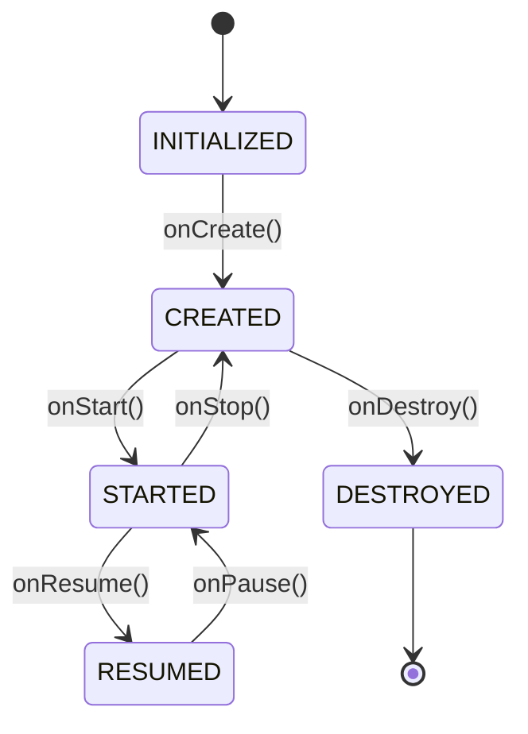
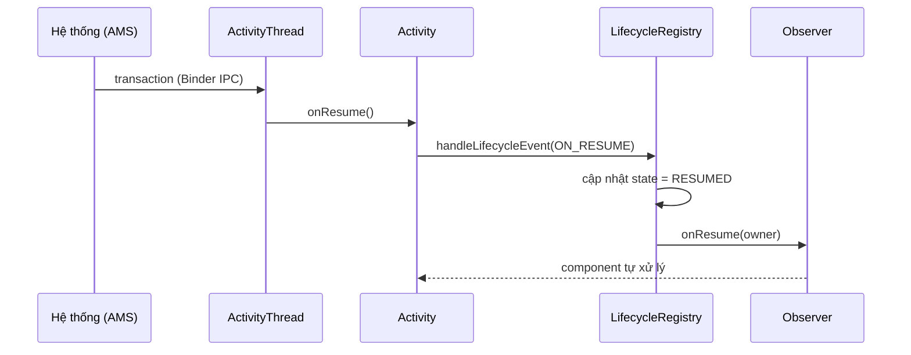
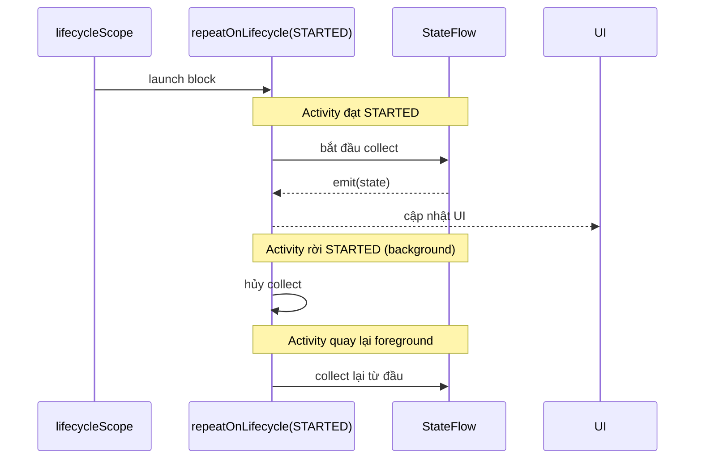
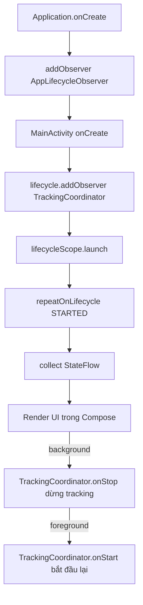
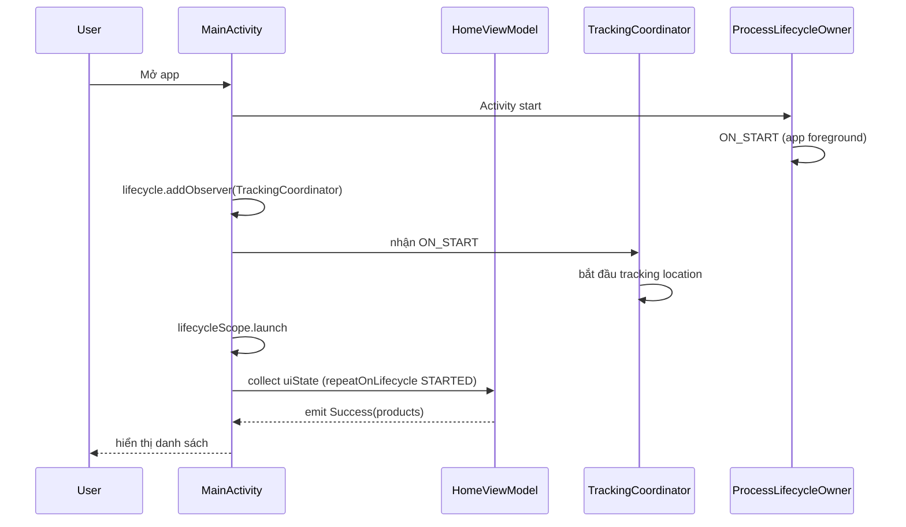

# Activity Lifecycle

## Vấn đề cần giải quyết

Android không cho phép app tự quyết định thời điểm tồn tại. Hệ thống có thể hủy Activity bất kỳ lúc nào để giải phóng bộ nhớ, và app phải phản ứng đúng theo từng giai đoạn vòng đời.

Nếu xử lý lifecycle sai, app sẽ gặp:

- **Memory leak** — giữ reference đến Activity đã destroy qua callback bất đồng bộ.
- **Crash** — cập nhật View khi Activity không còn tồn tại.
- **Lãng phí tài nguyên** — sensor, network, location vẫn hoạt động khi app ở background.
- **Logic lặp lại** — mỗi Activity phải tự đăng ký/hủy listener trong callback, dễ sót, khó test.

Vấn đề sâu hơn: logic lifecycle thường nằm rải rác trong `onResume()`/`onPause()` của Activity. Khi app có nhiều nguồn tài nguyên (location, analytics, camera), các callback trở nên khổng lồ và không thể tái sử dụng.

AndroidX Lifecycle Library ra đời để giải quyết đúng vấn đề này: **tách logic lifecycle khỏi Activity**, cho phép component tự quản lý vòng đời của chính nó.

## Sau khi học xong

- Giải thích được cơ chế LifecycleOwner, LifecycleRegistry và LifecycleObserver trong Jetpack Lifecycle.
- Phân biệt được Lifecycle.State và Lifecycle.Event cùng mối quan hệ với Activity callbacks.
- Áp dụng được lifecycleScope, repeatOnLifecycle và flowWithLifecycle để collect Flow an toàn.
- Triển khai được ProcessLifecycleOwner và LifecycleService để xử lý Application-level lifecycle.
- Thiết kế được lifecycle-aware components trong app one-activity MVVM/Clean.

## Activity Lifecycle là gì?

Activity Lifecycle là tập hợp các **callback method** hệ thống gọi khi Activity chuyển trạng thái: `onCreate`, `onStart`, `onResume`, `onPause`, `onStop`, `onDestroy`.

Ý nghĩa cốt lõi: **hệ thống điều khiển vòng đời, app chỉ phản ứng**. Developer không quyết định khi nào Activity bị hủy — developer quyết định làm gì ở từng thời điểm.

### Lifecycle States

Jetpack định nghĩa 5 trạng thái:

| State | Visible | Interactive | Ý nghĩa |
|-------|---------|-------------|----------|
| INITIALIZED | Không | Không | Object đã tạo, chưa gọi onCreate |
| CREATED | Không | Không | Đã khởi tạo, chưa visible |
| STARTED | Có | Không | Visible nhưng chưa foreground |
| RESUMED | Có | Có | Foreground, đang tương tác |
| DESTROYED | Không | Không | Bị hủy hoàn toàn |



### 7 Callbacks

| Callback | Đi từ → Đến | Vai trò chính |
|----------|-------------|---------------|
| onCreate | INITIALIZED → CREATED | Khởi tạo View, đọc Intent extras |
| onStart | CREATED → STARTED | Visible, đăng ký receiver liên quan UI |
| onResume | STARTED → RESUMED | Foreground, bắt đầu camera/sensor |
| onPause | RESUMED → STARTED | Mất focus, dừng thao tác nhẹ |
| onStop | STARTED → CREATED | Không visible, giải phóng tài nguyên |
| onRestart | — | Quay lại từ stopped state |
| onDestroy | CREATED → DESTROYED | Cleanup cuối cùng |

**Lưu ý:** `onPause()` phải chạy nhanh — Activity tiếp theo chỉ `onResume()` sau khi Activity hiện tại `onPause()` xong. Thao tác nặng (save database) phải để trong `onStop()`.

## Vì sao cần AndroidX Lifecycle Library?

Trước Jetpack, mọi logic lifecycle nằm trong Activity:

```kotlin
class LocationActivity : AppCompatActivity() {
    override fun onResume() {
        super.onResume()
        locationClient.startTracking()
        analytics.onScreenVisible()
        cameraSource.start()
    }

    override fun onPause() {
        super.onPause()
        locationClient.stopTracking()
        analytics.onScreenHidden()
        cameraSource.stop()
    }
}
```

Vấn đề:

- Activity phải biết chi tiết của **mọi** component → coupling cao.
- Thêm component mới → phải sửa Activity.
- Không tái sử dụng được logic giữa các màn hình.
- Khó test vì logic gắn chặt vào Activity.

Lifecycle Library giải quyết bằng mô hình **Observer**: Activity (hoặc Fragment) là `LifecycleOwner` phát event. Component đăng ký là `LifecycleObserver`, tự nhận event và tự xử lý. Activity không cần biết component làm gì.

## Cách hoạt động — Bộ ba cốt lõi

### LifecycleOwner, Lifecycle, LifecycleObserver

Ba interface tạo nên toàn bộ hệ thống:

| Interface | Vai trò |
|-----------|---------|
| `LifecycleOwner` | Đối tượng **có** vòng đời (Activity, Fragment). Trả về `Lifecycle` qua `getLifecycle()`. |
| `Lifecycle` | Đối tượng **mô tả** trạng thái hiện tại và phát event cho observer. |
| `LifecycleObserver` | Đối tượng **lắng nghe** event, được `addObserver()` đăng ký vào `Lifecycle`. |

Activity của bạn đã implement sẵn `LifecycleOwner`:

```kotlin
class MainActivity : AppCompatActivity() {
    override fun onCreate(savedInstanceState: Bundle?) {
        super.onCreate(savedInstanceState)
        lifecycle.addObserver(LocationTracker(this))
        // Không cần gọi start/stop thủ công — LocationTracker tự xử lý
    }
}
```

### Lifecycle.State vs Lifecycle.Event

- **State** là trạng thái hiện tại: `CREATED`, `STARTED`, `RESUMED`, `DESTROYED`.
- **Event** là sự kiện chuyển đổi: `ON_CREATE`, `ON_START`, `ON_RESUME`, `ON_PAUSE`, `ON_STOP`, `ON_DESTROY`, `ON_ANY`.

Event tạo ra State. Đây là điểm nhiều developer nhầm lẫn.

### LifecycleRegistry — Cơ chế dispatch bên trong

`LifecycleRegistry` là lớp triển khai `Lifecycle` dùng bởi `ComponentActivity` và `Fragment`. Khi Activity gọi `onResume()`, nội bộ nó gọi `handleLifecycleEvent(ON_RESUME)` trên registry, registry cập nhật state thành `RESUMED` rồi **duyệt danh sách observer đã đăng ký** và gọi method tương ứng.



Chính vì cơ chế này, khi bạn thêm observer trong `onCreate()`, observer sẽ **tự động** nhận `ON_START` và `ON_RESUME` ngay sau đó — Activity không cần gọi lại bằng tay.

### DefaultLifecycleObserver vs LifecycleEventObserver

- `DefaultLifecycleObserver` (khuyến nghị từ Lifecycle 2.4+): có sẵn method riêng cho từng event (`onStart`, `onResume`...).
- `LifecycleEventObserver` (trước đây `@OnLifecycleEvent`): nhận mọi event trong một callback `onStateChanged`, phải tự `when(event)`.

Dùng `DefaultLifecycleObserver` để code rõ ràng, dễ test.

```kotlin
class LocationTracker(
    private val locationClient: LocationClient
) : DefaultLifecycleObserver {

    override fun onStart(owner: LifecycleOwner) {
        locationClient.startTracking()
    }

    override fun onStop(owner: LifecycleOwner) {
        locationClient.stopTracking()
    }
}
```

## Cách hoạt động — Coroutines với Lifecycle

Thư viện `lifecycle-runtime-ktx` cung cấp công cụ chạy coroutine **gắn với vòng đời** — coroutine tự hủy khi lifecycle bị hủy, không cần `cancel()` thủ công.

### lifecycleScope

`lifecycleScope` là `CoroutineScope` mặc định của `LifecycleOwner`. Coroutine trong scope này **tự hủy khi lifecycle đạt `DESTROYED`** (tức Activity destroyed).

```kotlin
// MainActivity
lifecycleScope.launch {
    val data = repository.fetchData()   // Activity destroy → tự cancel
    textView.text = data.name           // Không bao giờ chạy sau destroy
}
```

**Vì sao không dùng `GlobalScope`?** `GlobalScope` không bao giờ tự hủy. Nếu Activity destroy mà coroutine vẫn chạy và sau đó cập nhật View → crash hoặc leak.

### repeatOnLifecycle

`repeatOnLifecycle(state)` chạy block **khi lifecycle đạt ít nhất state chỉ định**, và tự **hủy khi rời state đó**. Khi lifecycle quay lại state, block chạy lại.

Đây là pattern chuẩn để collect Flow — chỉ nhận dữ liệu khi màn hình đang visible:

```kotlin
lifecycleScope.launch {
    repeatOnLifecycle(Lifecycle.State.STARTED) {
        viewModel.uiState.collect { state ->
            render(state)   // Chỉ chạy khi Activity đang STARTED trở lên
        }
    }
    // Khi Activity về background → collect bị hủy, dữ liệu không phát
}
```



### flowWithLifecycle

`flowWithLifecycle(lifecycle, state)` là operator trên `Flow` — flow chỉ **emit khi lifecycle đạt ít nhất state**, tự dừng khi rời state:

```kotlin
lifecycleScope.launch {
    viewModel.uiState
        .flowWithLifecycle(lifecycle, Lifecycle.State.STARTED)
        .collect { state -> render(state) }
}
```

`repeatOnLifecycle` và `flowWithLifecycle` giải quyết cùng bài toán. `repeatOnLifecycle` linh hoạt hơn khi block có nhiều bước; `flowWithLifecycle` ngắn gọn khi chỉ cần filter một flow.

## Cách hoạt động — Application-level Lifecycle

Activity lifecycle chỉ bao phủ một màn hình. Khi cần biết **toàn bộ app** đang ở foreground hay background (ví dụ: chặn screenshot, cập nhật badge, đếm thời gian dùng app), dùng `lifecycle-process`.

### ProcessLifecycleOwner

`ProcessLifecycleOwner` là `LifecycleOwner` đại diện cho **toàn bộ process của app**. Nó phát `ON_START` khi app chuyển lên foreground, `ON_STOP` khi app xuống background.

```gradle
implementation("androidx.lifecycle:lifecycle-process:2.9.4")
```

```kotlin
// Application class hoặc component bất kỳ
ProcessLifecycleOwner.get().lifecycle.addObserver(object : DefaultLifecycleObserver {
    override fun onStart(owner: LifecycleOwner) {
        // App lên foreground
    }

    override fun onStop(owner: LifecycleOwner) {
        // App xuống background
    }
})
```

**Điểm mạnh:** hoạt động đúng với mọi trường hợp (chuyển app, nhận cuộc gọi, mở màn hình lock) vì nó theo dõi tất cả Activity trong process.

**Giới hạn:** `ProcessLifecycleOwner` chỉ phân biệt foreground/background, **không** phân biệt được Activity cụ thể nào đang hiển thị. Cần thông tin chi tiết từng màn hình → dùng Activity/Fragment lifecycle.

### LifecycleService

`LifecycleService` là `Service` được bọc thêm `LifecycleOwner`, giúp component trong Service cũng lifecycle-aware:

```gradle
implementation("androidx.lifecycle:lifecycle-service:2.9.4")
```

```kotlin
class UploadService : LifecycleService() {
    override fun onCreate() {
        super.onCreate()
        // Service lifecycle: ON_CREATE → ON_START (khi onStartCommand) → ON_DESTROY
        lifecycleScope.launch {
            // Coroutine tự hủy khi Service destroyed
        }
    }
}
```

**Khi nào dùng:** Service chạy nền dài (upload, sync) cần quản lý tài nguyên theo vòng đời của chính Service. Khi đó `lifecycleScope` và `repeatOnLifecycle` hoạt động bình thường như trong Activity.

### viewModelScope

`viewModelScope` (thư viện `lifecycle-viewmodel-ktx`) là scope của `ViewModel` — coroutine tự hủy khi ViewModel bị clear (Activity thực sự finish, không phải khi xoay màn hình):

```kotlin
class MainViewModel(
    private val repository: ProductRepository
) : ViewModel() {

    val products: StateFlow<UiState> = repository.products
        .map { UiState.Success(it) }
        .stateIn(viewModelScope, SharingStarted.WhileSubscribed(5000), UiState.Loading)
}
```

**Phân biệt scope:**

| Scope | Chủ sở hữu | Tự hủy khi | Dùng cho |
|-------|-----------|------------|----------|
| `lifecycleScope` | Activity/Fragment | Lifecycle bị DESTROYED | Thu thập dữ liệu vào UI |
| `viewModelScope` | ViewModel | ViewModel bị clear | Logic nghiệp vụ, lấy dữ liệu |
| `ProcessLifecycleOwner` | Toàn app | Không (process) | Theo dõi foreground/background |

## Cách hoạt động — Compose với Lifecycle

Trong Compose, dùng `collectAsStateWithLifecycle` thay vì `collectAsState` — flow **tự dừng khi app xuống background**, tiết kiệm tài nguyên:

```gradle
implementation("androidx.lifecycle:lifecycle-runtime-compose:2.9.4")
```

```kotlin
@Composable
fun ProductListScreen(
    viewModel: ProductViewModel = viewModel()
) {
    // Chỉ collect khi lifecycle >= STARTED, tự dừng khi background
    val uiState by viewModel.uiState.collectAsStateWithLifecycle()

    when (val state = uiState) {
        is UiState.Loading -> LoadingIndicator()
        is UiState.Success -> ProductList(state.products)
        is UiState.Error -> ErrorMessage(state.message)
    }
}
```

Ngoài ra `lifecycle-runtime-compose` (2.7.0+) cung cấp:

- `LifecycleEventEffect(ON_RESUME) { }` — chạy block đúng một event (analytics, logging).
- `LifecycleStartEffect(key) { onStopOrDispose { } }` — cặp start/stop cho tài nguyên cần dọn khi mất STARTED.
- `LifecycleResumeEffect` — tương tự nhưng gắn với `ON_RESUME`/`ON_PAUSE`, dùng cho camera, animation.

## Ví dụ thực tế — App One-Activity MVVM/Clean

Đây là cách một app one-activity MVVM/Clean tích hợp đầy đủ lifecycle libraries.

### Bước 1: Khai báo dependencies

```gradle
dependencies {
    implementation("androidx.lifecycle:lifecycle-runtime-ktx:2.9.4")
    implementation("androidx.lifecycle:lifecycle-viewmodel-ktx:2.9.4")
    implementation("androidx.lifecycle:lifecycle-process:2.9.4")
    implementation("androidx.lifecycle:lifecycle-service:2.9.4")
    implementation("androidx.lifecycle:lifecycle-runtime-compose:2.9.4")
}
```

### Bước 2: Component tự quản lý tài nguyên theo Activity lifecycle

`TrackingCoordinator` theo dõi location và analytics, **tự đăng ký/hủy** dựa trên lifecycle:

```kotlin
class TrackingCoordinator(
    private val locationClient: LocationClient,
    private val analytics: Analytics
) : DefaultLifecycleObserver {

    override fun onStart(owner: LifecycleOwner) {
        locationClient.startTracking()   // Chỉ khi màn hình visible
    }

    override fun onStop(owner: LifecycleOwner) {
        locationClient.stopTracking()    // App background → dừng, tiết kiệm pin
    }
}
```

```kotlin
class MainActivity : AppCompatActivity() {
    private val tracking by lazy {
        TrackingCoordinator(App.locationClient, App.analytics)
    }

    override fun onCreate(savedInstanceState: Bundle?) {
        super.onCreate(savedInstanceState)
        lifecycle.addObserver(tracking)
    }
}
```

### Bước 3: Collect StateFlow đúng lifecycle trong Compose

```kotlin
@Composable
fun HomeScreen(
    viewModel: HomeViewModel = viewModel()
) {
    val uiState by viewModel.uiState.collectAsStateWithLifecycle()

    // Cập nhật state ngay khi ViewModel phát — Compose tự quản lý lifecycle
    HomeContent(state = uiState, onRetry = viewModel::load)
}
```

### Bước 4: Detect app foreground/background ở Application level

```kotlin
class AppLifecycleObserver : DefaultLifecycleObserver {

    override fun onStart(owner: LifecycleOwner) {
        // App lên foreground: cập nhật badge, đổi trạng thái sẵn sàng
    }

    override fun onStop(owner: LifecycleOwner) {
        // App xuống background: chặn cập nhật UI không cần thiết
    }
}

class MyApplication : Application() {
    override fun onCreate() {
        super.onCreate()
        ProcessLifecycleOwner.get().lifecycle.addObserver(AppLifecycleObserver())
    }
}
```



### Luồng hoàn chỉnh khi người dùng mở app



## Khi nào nên dùng — Khi nào không nên dùng

### Nên dùng

- **`lifecycleScope`**: mọi coroutine cập nhật UI trong Activity/Fragment.
- **`repeatOnLifecycle(STARTED)` / `collectAsStateWithLifecycle`**: mọi Flow cần collect theo lifecycle.
- **`DefaultLifecycleObserver`**: component quản lý tài nguyên (location, camera, sensor, analytics).
- **`ProcessLifecycleOwner`**: cần biết app ở foreground/background.
- **`viewModelScope`**: mọi logic nghiệp vụ trong ViewModel.

### Không nên dùng

- **`ProcessLifecycleOwner`**: chỉ cần trạng thái của một màn hình — dùng Activity lifecycle.
- **`LifecycleService`**: Service không cần tài nguyên theo lifecycle — dùng Service thường cho đơn giản.
- **`repeatOnLifecycle`** thay cho `viewModelScope`: không nên để logic nghiệp vụ phụ thuộc lifecycle UI — ViewModel phải lấy dữ liệu độc lập.
- **`flowWithLifecycle`** cho dữ liệu cần update liên tục ở background (tracking upload): nếu app cần gửi dữ liệu khi background, phải dùng kênh khác (WorkManager), không dùng flow UI.

## Sai lầm thường gặp

### 1. Collect Flow bằng lifecycleScope.launch không có repeatOnLifecycle

```kotlin
// ❌ Sai — collect chạy liên tục kể cả khi Activity background
lifecycleScope.launch {
    viewModel.uiState.collect { state -> render(state) }
}

// ✅ Đúng — chỉ collect khi Activity STARTED
lifecycleScope.launch {
    repeatOnLifecycle(Lifecycle.State.STARTED) {
        viewModel.uiState.collect { state -> render(state) }
    }
}
```

`lifecycleScope` chỉ tự hủy khi DESTROYED, không tự dừng khi background. Dữ liệu vẫn chảy và cập nhật View khi app không hiển thị → lãng phí tài nguyên, thậm chí cập nhật UI nhảy loạn.

### 2. Dùng GlobalScope hoặc scope tự tạo cho UI

```kotlin
// ❌ Sai — coroutine không tự hủy, Activity destroy vẫn chạy
GlobalScope.launch {
    val data = api.fetchData()
    textView.text = data.name
}

// ✅ Đúng — lifecycleScope tự hủy khi destroy
lifecycleScope.launch {
    val data = api.fetchData()
    textView.text = data.name
}
```

### 3. Nhầm lẫn giữa lifecycleScope và viewModelScope

Đặt logic lấy dữ liệu trong `lifecycleScope` → data bị gọi lại mỗi lần Activity recreate (xoay màn hình). Dữ liệu phải nằm trong ViewModel (`viewModelScope`), UI chỉ thu thập.

### 4. Dùng launchWhenStarted (đã deprecated)

`launchWhenStarted` đã bị thay thế bởi `repeatOnLifecycle` vì behavior không đúng: coroutine vẫn **tồn tại** trong background, chỉ tạm dừng. `repeatOnLifecycle` hủy hẳn và chạy lại từ đầu khi quay lại — đúng semantic "bắt đầu thu thập mới".

### 5. Thêm observer sau khi lifecycle đã qua event

Nếu `addObserver` được gọi khi Activity đã ở `RESUMED`, registry sẽ **bù lại** bằng cách gọi observer lần lượt `ON_CREATE → ON_START → ON_RESUME` để đồng bộ trạng thái. Đừng cố đăng ký sớm trong `onResume()` — không cần thiết và gây nhầm lẫn.

### 6. Tin rằng ProcessLifecycleOwner có thể thay thế từng màn hình

`ProcessLifecycleOwner` chỉ nói "app foreground hay không". Nếu cần biết Activity nào đang hiển thị để đẩy event riêng → dùng lifecycle của Activity, không dùng process owner.

## Lịch sử phát triển

- **Android 1.0**: 7 callback Activity cơ bản ra đời cùng framework.
- **2017 — Architecture Components 1.0**: giới thiệu `LifecycleOwner`, `LifecycleObserver`, `LifecycleRegistry`, `@OnLifecycleEvent`.
- **2019 — Lifecycle 2.2**: thêm `lifecycleScope` (coroutine theo lifecycle).
- **2021 — Lifecycle 2.4**: `DefaultLifecycleObserver` thay thế `@OnLifecycleEvent` (deprecated); thêm `repeatOnLifecycle`; `launchWhenX` bắt đầu bị đánh dấu deprecated.
- **2023 — Lifecycle 2.7**: `collectAsStateWithLifecycle`, `LifecycleEventEffect`, `LifecycleStartEffect`, `LifecycleResumeEffect` trong `lifecycle-runtime-compose`.
- **Hiện tại (2.9.x)**: `repeatOnLifecycle` là pattern chuẩn; `launchWhenX` đã bị deprecated hoàn toàn.

## Kết nối hệ thống

- **Prerequisites**: Không có (Topic cơ bản của Android Components).
- **Related Topics**: `Activity State Changes` — cách Activity destroy/recreate và lưu state. `Fragment Lifecycle` — lifecycle tương tự nhưng có thêm View lifecycle. `Task and Backstack` — cách Activity xếp chồng trong task.
- **Downstream Topics**: `Activity State Changes` — khi nào state cần lưu/khôi phục.

## Nguồn tham khảo

- [Handling lifecycles with lifecycle-aware components — Android Developers](https://developer.android.com/topic/libraries/architecture/lifecycle)
- [Use Kotlin coroutines with lifecycle-aware components — Android Developers](https://developer.android.com/topic/libraries/architecture/coroutines)
- [Processes and app lifecycle — Android Developers](https://developer.android.com/guide/components/activities/process-lifecycle)
- [Lifecycle in Jetpack Compose — Android Developers](https://developer.android.com/develop/ui/compose/libraries/lifecycle)
- [Activity Lifecycle Overview — Android Developers](https://developer.android.com/guide/components/activities/activity-lifecycle)
- [ProcessLifecycleOwner — Android Developers Reference](https://developer.android.com/reference/androidx/lifecycle/ProcessLifecycleOwner)
- [LifecycleService — Android Developers Reference](https://developer.android.com/reference/androidx/lifecycle/LifecycleService)
- [LifecycleRegistry — Android Developers Reference](https://developer.android.com/reference/androidx/lifecycle/LifecycleRegistry)
