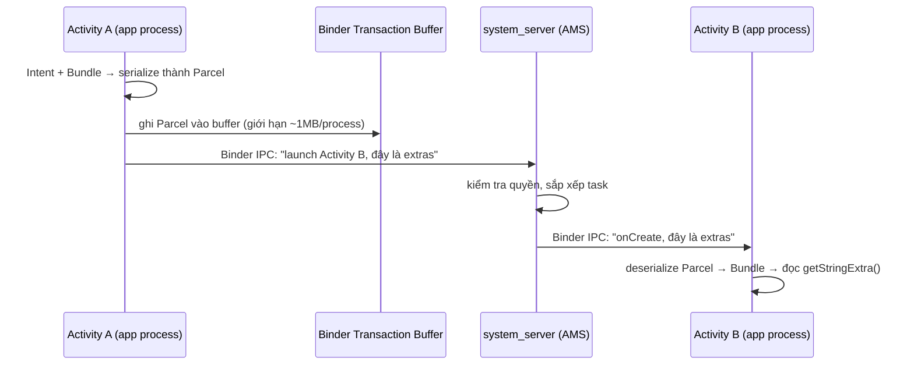
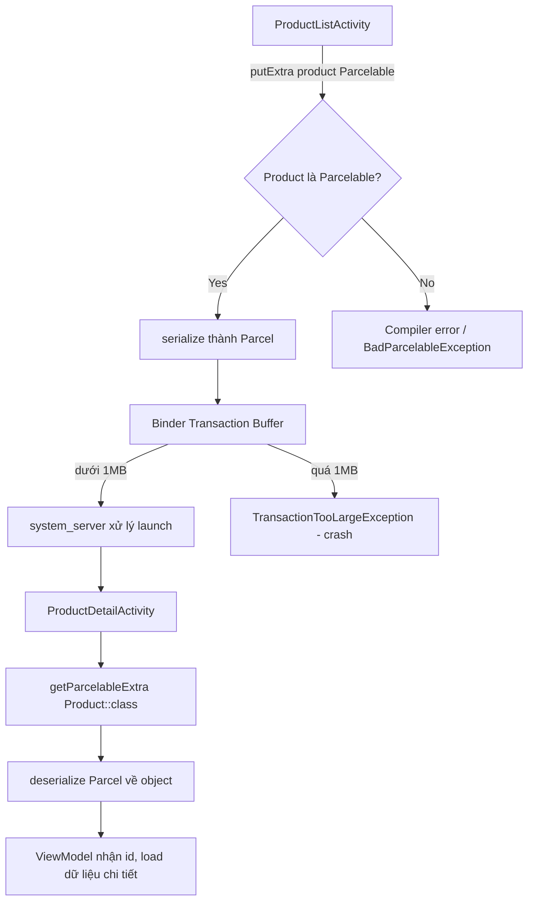

# Parcelables & Bundle

## Vấn đề cần giải quyết

Bạn có một Activity A cần đưa dữ liệu cho Activity B. Bạn viết:

```kotlin
startActivity(Intent(this, DetailActivity::class.java).apply {
    putExtra("product_id", productId)
})
```

Nó chạy. Nhưng nếu bạn đưa nguyên cả object `Product` thay vì chỉ `product_id`, bạn bắt đầu gặp:

- **TransactionTooLargeException** — app crash ngay lúc `startActivity()` hoặc lúc `onSaveInstanceState()`.
- **Chậm khó hiểu** — code vẫn chạy nhưng Activity mới mở lâu, máy giật.
- **BadParcelableException / ClassNotFoundException** — object không serialize được hoặc thay đổi sau khi cài đặt.
- **Data mất khi xoay màn hình / process bị kill** — lưu state sai chỗ.

Câu hỏi cốt lõi của bài này không phải "dùng hàm nào", mà là:

> Vì sao Android buộc phải serialize dữ liệu khi truyền giữa các component? Khi nào Bundle là lựa chọn đúng, và khi nào SharedViewModel mới là câu trả lời?

## Sau khi học xong

- Giải thích được bản chất Bundle và cơ chế Binder IPC.
- Quyết định được Bundle vs SharedViewModel theo đúng tình huống.
- Viết được Parcelable thủ công và dùng `@Parcelize`.
- Xác định và fix được TransactionTooLargeException.
- Áp dụng đúng luồng truyền dữ liệu trong app MVVM.

## Bundle là gì? — Bản chất

**Bundle** là một container key-value (`Map`), có khả năng tự **serialize** (đóng gói thành byte) toàn bộ nội dung của nó sang dạng **Parcel** để vượt qua biên giới giữa các thành phần.

Hai tính chất quyết định mọi thứ còn lại:

1. **Nó là bản sao (copy), không phải tham chiếu.** Bundle serialize dữ liệu thành byte rồi mới gửi đi. Activity B nhận một bản dữ liệu **độc lập** — sửa trong B không ảnh hưởng A, và ngược lại.
2. **Nó chỉ chấp nhận những kiểu đã được đăng ký.** Bạn không thể `putExtra()` một object bất kỳ — object đó phải implement `Parcelable` (hoặc `Serializable`).

Đây là lý do Android không cho truyền object trực tiếp như gọi hàm trong cùng process: nơi nhận dữ liệu **không đảm bảo nằm cùng process** với nơi gửi.

### Nơi Bundle xuất hiện trong thực tế

| Vị trí | Vai trò |
|--------|---------|
| `Intent.putExtra()` | Truyền tham số khi `startActivity()` / `startService()` / gửi Broadcast |
| `Fragment.arguments` | Truyền tham số khi tạo Fragment (bắt buộc qua Bundle, không có constructor kèm data) |
| `onSaveInstanceState(outState)` | Lưu UI state để khôi phục khi Activity bị destroy |
| `SavedStateHandle` | ViewModel lưu state, sống sót qua process death |

## Vì sao Android dùng Bundle để truyền dữ liệu?

Câu trả lời nằm ở cách các component giao tiếp với nhau: **qua Binder IPC**.

Khi bạn gọi `startActivity()`, Activity A không tự gọi hàm của Activity B. Nó gửi yêu cầu cho **`system_server`** (một process riêng của hệ điều hành), và `system_server` quyết định khởi chạy Activity B trong app. Trong chuyến đi A → system_server → B này, dữ liệu phải được **đóng gói thành byte** để đi qua biên giới process:



Chính vì phải đi qua biên giới này, dữ liệu:

- **Phải được serialize** — nên phải là kiểu đã biết cách serialize (`Parcelable`/`Serializable`).
- **Có giới hạn kích thước** — vì phải ghi vào buffer có giới hạn (~1MB cho toàn process).
- **Là bản sao** — byte được truyền đi, không phải reference.

Nếu Android đơn giản truyền reference như lời gọi hàm thông thường, nó sẽ phá vỡ mô hình "mỗi app là một process" — nền tảng bảo mật và ổn định của Android.

### Ưu điểm của Bundle so với cách truyền trực tiếp

- **Hoạt động cả khi 2 component khác process** (2 app, app ↔ system) — vốn là thiết kế mặc định của Android.
- **Không tạo reference ngầm** — Bundle không giữ Activity cũ trong bộ nhớ, tránh memory leak.
- **Sống sót qua process death** — dữ liệu trong Bundle có thể được hệ thống lưu lại và trao lại khi Activity được tạo lại.

## Bundle vs SharedViewModel — Khi nào dùng cái nào

Đây là lựa chọn kiến trúc quan trọng nhất khi truyền dữ liệu trong app MVVM. Không có "cái nào luôn đúng" — phụ thuộc quan hệ giữa 2 màn hình.

| Tiêu chí | Bundle / Intent extras | SharedViewModel |
|----------|------------------------|-----------------|
| Dữ liệu | Bản sao (copy) | Tham chiếu (shared instance) |
| Vòng đời | Theo Activity mục tiêu | Theo scope (Activity / Fragment) |
| Process death | Sống sót (nếu dùng đúng cách) | Mất (trừ khi SavedStateHandle) |
| Kích thước | Giới hạn ~1MB | Không giới hạn theo bundle (nhưng là bộ nhớ RAM) |
| Phụ thuộc | Component không cần biết nhau về lifecycle | Phải cùng một Activity/Fragment scope |
| Khi quay lại màn hình cũ | State cũ được giữ nguyên qua backstack | Shared VM vẫn giữ state |

### Khi nào dùng Bundle (Intent extras)

- **Màn hình B độc lập, không cần đồng bộ liên tục với A.** Ví dụ: mở màn hình chi tiết sản phẩm từ danh sách.
- **Dữ liệu là định danh (ID), query string, flag.** Nhỏ, đơn giản, không cần sống lâu.
- **Component có thể khác process** (gọi từ Notification, Shortcut, Deep Link) — lúc này SharedViewModel không tồn tại.

### Khi nào dùng SharedViewModel

- **Hai màn hình cùng chia sẻ một nguồn dữ liệu "sống"** (đang load, đang cập nhật), ví dụ: màn hình danh sách → màn hình lọc cùng đọc `ProductFilterState` trong một `ProductListViewModel` scoped theo Activity.
- **Dữ liệu lớn** (list, bitmap, kết quả xử lý) — đưa vào Bundle là mời `TransactionTooLargeException`.
- **Cần đồng bộ hai chiều** — màn hình B đổi dữ liệu, màn hình A phản ứng ngay khi quay lại.
- **Fragment ↔ Fragment trong cùng Activity** — dùng ViewModel scoped theo Activity là pattern chuẩn, không nên đẩy qua Bundle.

### Quyết định nhanh trong 30 giây

```
Dữ liệu nhỏ (ID/flag/query) và B độc lập với A?
  └── ✅ Bundle / Intent extras + @Parcelize

Dữ liệu lớn, cần đồng bộ, hoặc A và B là Fragment cùng Activity?
  └── ✅ SharedViewModel

Cần sống sót khi process bị kill?
  └── ✅ Bundle (via SavedStateHandle hoặc onSaveInstanceState)
```

## Bundle hỗ trợ những kiểu dữ liệu nào

| Nhóm | Method tương ứng |
|------|------------------|
| Primitive | `putInt`, `putLong`, `putBoolean`, `putFloat`, `putDouble`, `putByte`, `putChar`, `putShort` |
| String | `putString`, `putCharSequence` |
| Array primitive | `putIntArray`, `putStringArray`, `putLongArray`, `putParcelableArray`... |
| List | `putStringArrayList`, `putIntegerArrayList`, `putParcelableArrayList` |
| Object | `putParcelable`, `putSerializable` |
| Bundle | `putBundle` (bundle lồng nhau) |

**Điểm mấu chốt:** để đưa một object vào Bundle, object đó **bắt buộc** phải implement `Parcelable`. Đây chính là lý do Topic này có hai nửa: **Bundle** (container) và **Parcelable** (khả năng đóng gói của object).

## Parcelable là gì?

**Parcelable** là interface do Android thiết kế để một object tự biết cách "đóng gói" mình thành dữ liệu nhị phân (Parcel) và "mở gói" ngược lại. Nó tối ưu cho Binder IPC — không dùng reflection, không sinh object trung gian.

Hai khái niệm cần phân biệt:

- **`Parcel`** — vùng nhớ nhị phân chứa dữ liệu đã serialize. Là phương tiện vận chuyển.
- **`Parcelable`** — interface mà object implement để có khả năng tự viết/đọc vào/ra `Parcel`.

### Viết Parcelable thủ công (để hiểu bản chất)

Một class `Parcelable` cần 3 phần: `writeToParcel()` (đóng gói), `describeContents()` (mô tả content), và `CREATOR` (mở gói):

```kotlin
class Product(
    val id: Long,
    val name: String,
    val price: Double
) : Parcelable {

    override fun writeToParcel(dest: Parcel, flags: Int) {
        dest.writeLong(id)
        dest.writeString(name)
        dest.writeDouble(price)
    }

    override fun describeContents(): Int = 0

    companion object {
        @JvmField
        val CREATOR = object : Parcelable.Creator<Product> {
            override fun createFromParcel(parcel: Parcel): Product =
                Product(
                    id = parcel.readLong(),
                    name = parcel.readString() ?: "",
                    price = parcel.readDouble()
                )

            override fun newArray(size: Int): Array<Product?> = arrayOfNulls(size)
        }
    }
}
```

**Quy tắc vàng:** thứ tự trong `writeToParcel` **phải khớp tuyệt đối** với thứ tự trong `createFromParcel`. Đây là nguồn gốc của rất nhiều bug khó tìm khi sửa model — bạn thêm một field nhưng quên sửa cả hai chỗ.

Nhược điểm rõ ràng: mỗi class phải viết ~20 dòng boilerplate, và dễ sai khi model thay đổi. Giải pháp cho Kotlin là `@Parcelize`.

### @Parcelize — cách viết Parcelable hiện đại

```kotlin
// build.gradle.kts
plugins {
    id("kotlin-parcelize")
}
```

```kotlin
@Parcelize
data class Product(
    val id: Long,
    val name: String,
    val price: Double,
    val tags: List<String>
) : Parcelable
```

Compiler sinh toàn bộ `writeToParcel` và `CREATOR` lúc build — không reflection, hiệu năng tương đương viết tay, nhưng không còn lỗi lệch thứ tự.

`@Parcelize` tự xử lý được: primitive, `String`, `Enum`, các class `Parcelable` lồng nhau, `List`/`Set`/`Map`/`Array` (với element là kiểu hỗ trợ).

**Khi cần kiểu không hỗ trợ** (ví dụ `java.util.Date`), dùng `@TypeParceler`:

```kotlin
@Parcelize
data class Event(
    val name: String,
    @TypeParceler<Date, DateParceler>()
    val date: Date
) : Parcelable

object DateParceler : Parceler<Date> {
    override fun create(parcel: Parcel): Date = Date(parcel.readLong())
    override fun Date.write(parcel: Parcel, flags: Int) {
        parcel.writeLong(time)
    }
}
```

## Parcelable vs Serializable

`Serializable` là interface marker của Java — bạn chỉ cần `implements Serializable`, còn lại JVM dùng **reflection** để tự động quét toàn bộ field và serialize. Nghe có vẻ tiện, nhưng trên Android nó đắt:

| Tiêu chí | Serializable (Java) | Parcelable (Android) |
|----------|--------------------|----------------------|
| Cơ chế | Reflection (runtime) | Manual code / sinh lúc compile |
| Tốc độ | Chậm (~10x so với Parcelable) | Nhanh |
| Object tạm | Tạo nhiều object trung gian → GC pressure | Không |
| Boilerplate | Không cần | Nhiều nếu viết tay (nhưng @Parcelize xử lý) |
| Mục đích | Serialize để lưu trữ (disk, network) | Binder IPC giữa components |
| Kết quả serialize | Có versioning, nhiều metadata | Nhị phân gọn, không versioning |

```kotlin
// ❌ Đừng dùng Serializable để truyền giữa component — chậm, tạo GC pressure
data class User(val name: String) : Serializable

// ✅ Dùng Parcelable — nhanh, tối ưu cho IPC
@Parcelize
data class User(val name: String) : Parcelable
```

**Vậy Serializable dùng khi nào?** Khi cần lưu trữ lâu dài (ghi vào file, gửi qua mạng, cache) — ví dụ object đi qua Retrofit/Gson thường serialize bằng JSON, không phải Bundle. Trong truyền nội bộ Android, Parcelable luôn thắng.

## Giới hạn kích thước — Binder Transaction Buffer

Đây là giới hạn mà đa số crash ngoài đời thực đến từ. Binder transaction buffer có **giới hạn khoảng 1MB cho toàn bộ process** — không phải 1MB cho mỗi lần truyền.

### Hệ quả nghiêm trọng

Intent extras, `savedInstanceState`, Fragment arguments, và **mọi IPC khác trong cùng process đều chia sẻ buffer này**. Nghĩa là:

- Màn hình đang giữ một Bundle lớn trong `savedInstanceState` (chưa cần truyền đi), thì ngay cả `startActivity()` với dữ liệu nhỏ cũng có thể vượt ngưỡng.
- Crash thường bùng ra **không phải lúc bạn `putExtra()`**, mà lúc **một Activity khác đang nằm trong background gọi `onSaveInstanceState()`** — rất khó reproduce ở development.

```kotlin
// ❌ Crash tiềm tàng — list hàng nghìn item qua Intent
intent.putParcelableArrayListExtra("all_products", ArrayList(thousandProducts))
// TransactionTooLargeException

// ✅ Đúng — chỉ truyền định danh, màn hình đích tự query
intent.putExtra("product_id", productId)
```

### Cách phát hiện

Từ API 26+, hệ thống log warning khi transaction gần giới hạn:

```text
W/ActivityThread: Bundle stats: [total size: 524288 bytes]
```

Debug bằng cách đo trực tiếp kích thước Bundle:

```kotlin
override fun onSaveInstanceState(outState: Bundle) {
    super.onSaveInstanceState(outState)
    outState.putInt("scroll_position", scrollPosition)
    logBundleSize(outState) // helper debug
}

private fun logBundleSize(bundle: Bundle) {
    val parcel = Parcel.obtain()
    try {
        bundle.writeToParcel(parcel, 0)
        val size = parcel.dataSize()
        Log.d("BundleSize", "size = $size bytes")
    } finally {
        parcel.recycle()
    }
}
```

### Cách fix

| Tình huống | Giải pháp |
|------------|-----------|
| List lớn truyền qua Intent | Chỉ truyền ID/query → màn hình đích tự load lại từ database/API |
| Bitmap trong Bundle | Lưu ra file, truyền URI/file path |
| RecyclerView nhiều item | Chỉ lưu `scroll_position` + điều kiện query, không lưu dữ liệu |
| Fragment arguments chứa data lớn | SharedViewModel scoped theo Activity |
| Ứng dụng cần chuyển khối dữ liệu lớn giữa 2 màn hình | Cơ chế khác: Repository / singleton / SavedStateHandle — không qua Bundle |

## Triển khai thực tế trong app MVVM

Tình huống chuẩn: app mua sắm, màn hình `ProductListScreen` mở `ProductDetailScreen`. Ta thực hiện theo 3 bước.

### Bước 1: Model là @Parcelize

```kotlin
// data/model/Product.kt
@Parcelize
data class Product(
    val id: Long,
    val name: String,
    val price: Double,
    val imageUrl: String
) : Parcelable
```

### Bước 2: Activity A gửi dữ liệu

```kotlin
// ProductListActivity.kt
private fun openDetail(product: Product) {
    val intent = Intent(this, ProductDetailActivity::class.java).apply {
        putExtra(EXTRA_PRODUCT, product) // Parcelable → tự serialize
    }
    startActivity(intent)
}

companion object {
    const val EXTRA_PRODUCT = "extra_product"
}
```

### Bước 3: Activity B nhận dữ liệu (chú ý API version)

```kotlin
// ProductDetailActivity.kt
override fun onCreate(savedInstanceState: Bundle?) {
    super.onCreate(savedInstanceState)

    val product: Product? = if (Build.VERSION.SDK_INT >= Build.VERSION_CODES.TIRAMISU) {
        intent.getParcelableExtra(EXTRA_PRODUCT, Product::class.java)
    } else {
        @Suppress("DEPRECATION")
        intent.getParcelableExtra(EXTRA_PRODUCT)
    }

    product?.let { viewModel.loadDetail(it.id) }
}
```

> [!tip] `getParcelableExtra()` (không có class) bị deprecated ở API 33. Luôn dùng overload kèm `Class` khi `minSdk >= 33`, và giữ branch cũ cho máy thấp hơn.

### Flow mô phỏng toàn bộ luồng



## Khi nào nên dùng — Khi nào không nên dùng

### Nên dùng Bundle / Parcelable

- Truyền định danh, tham số nhỏ, flag khi mở Activity/Fragment/Service.
- Khởi tạo Fragment với `arguments` (luôn luôn — đây là cơ chế bắt buộc).
- Lưu state qua `onSaveInstanceState` / `SavedStateHandle` để sống sót qua process death.
- Component có thể được gọi từ ngoài app (Deep Link, Notification).

### Không nên dùng Bundle

- **Dữ liệu lớn** (> 500KB) — nguy cơ TransactionTooLargeException.
- **Dữ liệu cần đồng bộ hai chiều giữa các màn hình** — dùng SharedViewModel.
- **Dữ liệu quan trọng cần lưu lâu dài** — dùng Room/DataStore, không phải Bundle (Bundle có thể bị mất nếu hệ thống kill process mà không lưu state).
- **Object có tham chiếu vòng hoặc nguồn tài nguyên nặng** (Connection, Handler, View) — không thể serialize.

## Sai lầm thường gặp

### 1. Truyền nguyên cả object thay vì ID

Đúng là object `Product` nhỏ có thể truyền qua Parcelable. Nhưng nếu object là một "aggregate" chứa cả list con, bitmap, hoặc dữ liệu mà màn hình đích cần load tươi từ nguồn, thì truyền ID và load lại luôn đúng hơn — đảm bảo dữ liệu mới nhất và tránh vượt buffer.

### 2. Dùng Serializable thay vì Parcelable

```kotlin
// ❌ data class User(val name: String) : Serializable
// ✅ @Parcelize data class User(val name: String) : Parcelable
```

### 3. Lệch thứ tự write/read trong Parcelable thủ công

```kotlin
// writeToParcel: id → name
// createFromParcel: name → id  ← BUG! dữ liệu tráo ngược
```

Nếu bạn đang dùng manual Parcelable, hãy cân nhắc chuyển sang `@Parcelize` để loại bỏ hẳn lớp lỗi này.

### 4. Quên xử lý nullable trong Parcelable thủ công

`readString()` trả null, còn `readInt()`/`readLong()` không xử lý null. Với manual, cần flag đánh dấu null. Với `@Parcelize`, nullable được xử lý tự động.

### 5. Lưu dữ liệu lớn vào savedInstanceState

```kotlin
// ❌ Sai — lưu cả danh sách sản phẩm vào Bundle
outState.putParcelableArrayList("products", ArrayList(allProducts))

// ✅ Đúng — ViewModel giữ dữ liệu, Bundle chỉ lưu state UI
outState.putString("search_query", currentQuery)
outState.putInt("selected_tab", selectedTabIndex)
```

### 6. Tin rằng SharedViewModel giải quyết được process death

SharedViewModel mất trắng khi process bị kill. Nếu dữ liệu cần tồn tại qua process death, phải kết hợp `SavedStateHandle` (lưu qua Bundle nội bộ) hoặc Room. Hiểu đúng giới hạn này giúp bạn không ngạc nhiên khi app bị hệ thống kill ở background rồi khôi phục màn hình trống.

## Kết nối hệ thống

- **Prerequisites**: `Activity Lifecycle` và `Activity State Changes` — nơi Bundle được dùng để lưu/khôi phục state. `Task and Backstack` — ngữ cảnh Activity được tạo/hủy khi truyền Intent.
- **Related Topics**: `Explicit Intents` — Intent là phương tiện vận chuyển Bundle. `Push data and send event via Intent` — các cách đưa dữ liệu vào Intent.
- **Downstream Topics**: `ViewModel` — SavedStateHandle và cách dữ liệu Bundle đi vào ViewModel. `FragmentManager` — Fragment arguments.

## Nguồn tham khảo

- [Parcelable and Bundle — Android Developers](https://developer.android.com/guide/components/activities/parcelables-and-bundles)
- [Parcelable — Android Developers Reference](https://developer.android.com/reference/android/os/Parcelable)
- [Bundle — Android Developers Reference](https://developer.android.com/reference/android/os/Bundle)
- [TransactionTooLargeException — Android Developers Reference](https://developer.android.com/reference/android/os/TransactionTooLargeException)
- [Pass data between destinations (Navigation Safe Args) — Android Developers](https://developer.android.com/guide/navigation/use-graph/pass-data)
- [ViewModel overview — Android Developers](https://developer.android.com/topic/libraries/architecture/viewmodel)
- [Parceler & TypeParceler — Kotlin Parcelize Docs](https://kotlinlang.org/docs/parcelize.html)
