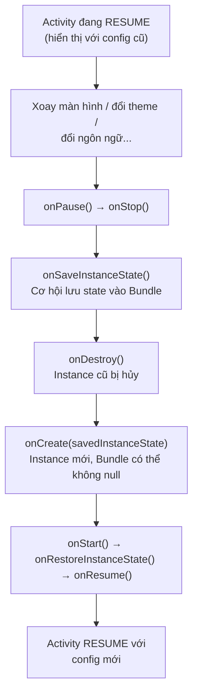
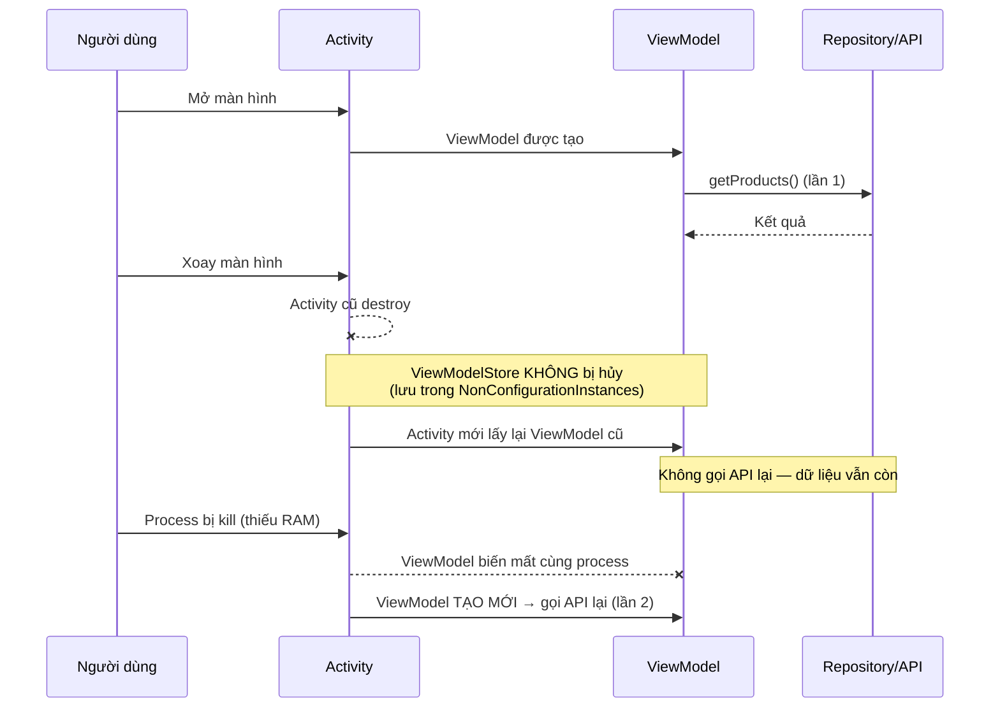
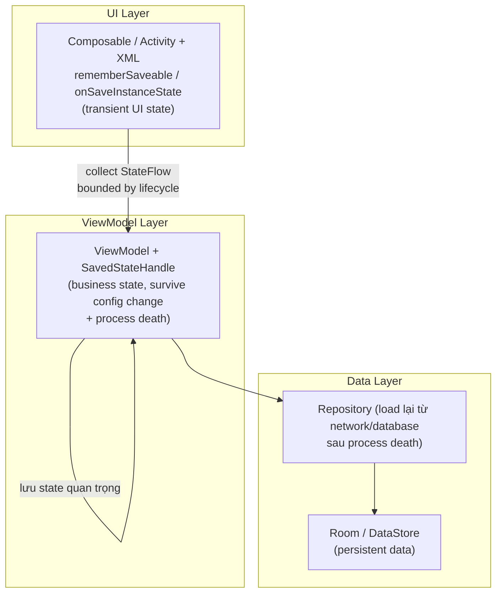

# Activity State Changes

## Vấn đề cần giải quyết

Bạn đang điền form đặt hàng: đã chọn 2 sản phẩm, nhập xong số điện thoại, chọn đúng giao hàng nhanh. Đang định bấm "Đặt hàng" thì xoay điện thoại sang ngang.

Kết quả:

- Toàn bộ form trống trơn, phải điền lại từ đầu
- Danh sách sản phẩm quay về đầu trang, mất vị trí scroll
- Giao diện flash trắng rồi load lại API từ con số 0

Nguyên nhân không phải "app lỗi". Đây là **hành vi mặc định của Android**: khi màn hình xoay, Activity bị **destroy hoàn toàn rồi tạo lại từ đầu**. Nếu bạn không chủ động lưu state thì mọi thứ trong Activity instance cũ đều biến mất.

Bài viết này dạy bạn: **hiểu vì sao điều đó xảy ra, phân biệt các tình huống mất dữ liệu, và chọn đúng công cụ lưu state cho từng loại dữ liệu trong project thực tế.**

## Sau khi học xong

- Giải thích được vì sao Android destroy/recreate Activity khi configuration change.
- Phân biệt được configuration change và process death.
- Chọn đúng ViewModel / SavedStateHandle / onSaveInstanceState / rememberSaveable cho từng loại dữ liệu.
- Triển khai được luồng lưu/khôi phục state trong app MVVM bằng cả XML và Compose.
- Tránh được fetch API lặp, TransactionTooLargeException, lạm dụng android:configChanges.

## Nó là gì? — Vì sao Activity bị destroy/recreate?

State Changes là tập hợp các sự kiện khiến Android **thay đổi trạng thái tồn tại của Activity**, trong đó quan trọng nhất là **Configuration Change** và **Process Death**.

### Configuration Change

Configuration Change là sự thay đổi cấu hình thiết bị mà Android cho rằng ảnh hưởng tới tài nguyên đang hiển thị (layout, drawable, string, theme...). Khi xảy ra, Android **bắt buộc** tải lại tài nguyên phù hợp với cấu hình mới.

| Configuration | Trigger | Ví dụ thực tế |
|--------------|---------|---------------|
| `orientation` | Xoay màn hình | Portrait → Landscape |
| `screenSize` | Thay đổi kích thước | Gập mở màn hình fold, multi-window |
| `locale` | Đổi ngôn ngữ | Tiếng Anh → Tiếng Việt |
| `uiMode` | Đổi theme | Light → Dark mode |
| `fontScale` | Đổi cỡ chữ | Normal → Large |
| `density` | Đổi DPI | Chuyển display settings |
| `keyboard` | Gắn/ngắt bàn phím ngoài | Kết nối bluetooth keyboard |

### Vì sao phải "destroy rồi tạo lại"?

Khi orientation thay đổi, hệ thống cần tải `layout-land/`, drawable theo density mới, string theo locale mới, theme theo uiMode mới. Cách đơn giản và chắc chắn nhất để mọi tài nguyên được reload đúng là **tạo lại Activity từ đầu bằng `onCreate()`**.



**Điểm mấu chốt:** `onSaveInstanceState()` là cơ hội DUY NHẤT để giữ lại dữ liệu xuyên qua cú destroy/recreate này. Những gì không lưu vào Bundle thì mất.

> **Lưu ý:** Từ API 28+, `onSaveInstanceState()` luôn được gọi **sau** `onStop()`. Trước API 28 thứ tự có thể khác. Với hầu hết app hiện tại (minSdk ≥ 21), hãy giả định thứ tự là `onPause → onStop → onSaveInstanceState`.

## Khi nào dữ liệu bị mất? — 3 tình huống cần phân biệt

Không phải lúc nào Activity biến mất cũng giống nhau. Bạn phải phân biệt **3 tình huống** vì mỗi loại đòi hỏi công cụ khác nhau:

### 1. Configuration Change — dữ liệu mất, app vẫn "sống"

- Activity destroy/recreate nhưng **process vẫn chạy**.
- ViewModel **sống sót** (được giữ lại qua `NonConfigurationInstances`).
- Bundle trong `onSaveInstanceState()` được khôi phục.
- Dữ liệu nào không thuộc ViewModel và không nằm trong Bundle thì mất.

### 2. Process Death — toàn bộ app chết

- System kill toàn bộ process (thiếu bộ nhớ, ép buộc dừng...).
- ViewModel **biến mất**, static/singleton **reset về 0**.
- Bundle đã lưu qua `onSaveInstanceState()` vẫn được hệ thống **giữ lại và khôi phục** khi người dùng quay lại app.
- `onDestroy()` **không đảm bảo** được gọi.

### 3. Người dùng thoát hẳn (bấm Back / finish)

- Activity finish vĩnh viễn, không ai cần khôi phục.
- `onSaveInstanceState()` **không được gọi**.
- Không nên lưu state — dữ liệu cần giữ lâu dài phải đi vào **Room / DataStore** (persistent), không phải state management.

| Tiêu chí | Configuration Change | Process Death | User quits (Back) |
|----------|---------------------|---------------|-------------------|
| Process có chết không? | ❌ | ✅ | ✅ |
| ViewModel | ✅ Sống | ❌ Mất | ❌ Mất |
| Bundle (savedState) | ✅ Khôi phục | ✅ Khôi phục | Không cần |
| onSaveInstanceState | ✅ Gọi | ✅ Gọi (nếu có cơ hội) | ❌ Không gọi |
| Cách phòng thủ | ViewModel + Bundle | Bundle / SavedStateHandle | Room / DataStore |

## Chọn công cụ nào? — Bản đồ quyết định

Trước khi vào code, ghi nhớ nguyên tắc lựa chọn sau:

```text
Dữ liệu cần xử lý
    │
    ├── Dữ liệu lâu dài (giỏ hàng, profile, settings)?
    │       └── ✅ Room / DataStore  ← KHÔNG phải state management
    │
    ├── Dữ liệu load từ network/database (danh sách sản phẩm)?
    │       └── ✅ ViewModel  ← sống qua config change, load lại nếu process death
    │
    ├── User input quan trọng (search query, filter, tab, step trong form)?
    │       └── ✅ SavedStateHandle (Compose) / onSaveInstanceState (XML)
    │
    └── Dữ liệu lớn (list, bitmap)?
            └── ✅ ViewModel + chỉ lưu ID vào Bundle để load lại sau process death
```

| Tiêu chí | ViewModel | SavedStateHandle | onSaveInstanceState |
|----------|-----------|------------------|---------------------|
| Survive config change | ✅ | ✅ | ✅ |
| Survive process death | ❌ | ✅ | ✅ |
| Giới hạn kích thước | Không | ~1MB Bundle | ~1MB Bundle |
| Cần Parcelable/Serializable | ❌ | ✅ | ✅ |
| Phù hợp cho | Business data, API response, dữ liệu lớn | State quan trọng, kích thước nhỏ | Transient UI state (XML) |

## Triển khai step-by-step trong project thực tế

Lấy bối cảnh cụ thể: một app **mua sắm** (giống các app thương mại điện tử thực tế). Màn hình chính là `ProductListScreen` — có ô **search**, **filter theo category**, danh sách sản phẩm load từ API, và **cart** hiển thị số lượng. Yêu cầu: xoay màn hình và process death đều không được làm mất trải nghiệm người dùng.

### Bước 1: ViewModel — giữ dữ liệu business qua configuration change

Loại dữ liệu nguy hiểm nhất khi xoay màn hình là **kết quả API**. Nếu fetch lại trong `onCreate`, mỗi lần xoay màn hình là một lần gọi lại mạng. ViewModel giải quyết điều này: nó sống sót qua config change nên dữ liệu được giữ nguyên, code chỉ gọi API **đúng một lần**.

```kotlin
class ProductListViewModel(
    private val repository: ProductRepository
) : ViewModel() {

    private val _products = MutableStateFlow<List<Product>>(emptyList())
    val products: StateFlow<List<Product>> = _products.asStateFlow()

    private val _isLoading = MutableStateFlow(false)
    val isLoading: StateFlow<Boolean> = _isLoading.asStateFlow()

    init {
        loadProducts() // Chỉ chạy 1 lần khi ViewModel được TẠO MỚI
    }

    private fun loadProducts() {
        viewModelScope.launch {
            _isLoading.value = true
            runCatching { repository.getProducts() }
                .onSuccess { _products.value = it }
                .onFailure { /* show error state */ }
            _isLoading.value = false
        }
    }
}
```

**Điều cốt lõi để hiểu:** ViewModel sống sót qua config change nhờ `ViewModelStore` được lưu vào `NonConfigurationInstances` — một object mà `ActivityThread` giữ lại khi recreate Activity. Khi Activity mới tạo, nó lấy lại chính `ViewModelStore` cũ. Vì vậy **`init` chỉ chạy một lần**, không chạy lại khi xoay màn hình.



### Bước 2: SavedStateHandle — lưu user input quan trọng, survive process death

ViewModel giải quyết config change nhưng **chết theo process**. Search query hay bước form đang nhập là dữ liệu người dùng đã đánh máy — để mất là trải nghiệm cực tệ. Đây là chỗ dùng **SavedStateHandle**: nó nằm trong ViewModel nhưng tự động serialize vào Bundle qua `onSaveInstanceState()`, nên **sống sót cả process death**.

```kotlin
class ProductListViewModel(
    private val repository: ProductRepository,
    private val savedStateHandle: SavedStateHandle
) : ViewModel() {

    // Auto-save/restore qua process death
    val searchQuery: StateFlow<String> =
        savedStateHandle.getStateFlow("search_query", "")

    val selectedCategory: StateFlow<String> =
        savedStateHandle.getStateFlow("selected_category", "all")

    fun onSearchQueryChanged(query: String) {
        savedStateHandle["search_query"] = query
    }

    fun onCategorySelected(category: String) {
        savedStateHandle["selected_category"] = category
    }
}
```

**Cơ chế:** SavedStateHandle dùng `onSaveInstanceState()` của Activity để lưu dữ liệu vào Bundle. Sau process death, hệ thống khôi phục Bundle, tạo ViewModel mới và **đổ lại dữ liệu vào SavedStateHandle** — dữ liệu trở về như chưa từng mất.

### Bước 3: onSaveInstanceState — transient UI state (View/XML)

Trong View system, ngoài ViewModel, bạn vẫn cần xử lý các **transient UI state** thuộc riêng Activity: vị trí scroll của `RecyclerView`, tab đang chọn, vị trí cursor. Công cụ là `onSaveInstanceState()` / `onRestoreInstanceState()`.

```kotlin
class ProductListActivity : AppCompatActivity() {

    private lateinit var binding: ActivityProductListBinding
    private var selectedTab = 0

    override fun onCreate(savedInstanceState: Bundle?) {
        super.onCreate(savedInstanceState)
        binding = ActivityProductListBinding.inflate(layoutInflater)
        setContentView(binding.root)

        selectedTab = savedInstanceState?.getInt("selected_tab") ?: 0
        binding.recyclerView.layoutManager = LinearLayoutManager(this)
        if (savedInstanceState != null) {
            binding.recyclerView.layoutManager
                ?.onRestoreInstanceState(savedInstanceState.getParcelable("recycler_scroll"))
        }
    }

    override fun onSaveInstanceState(outState: Bundle) {
        super.onSaveInstanceState(outState)
        outState.putInt("selected_tab", selectedTab)
        outState.putParcelable(
            "recycler_scroll",
            binding.recyclerView.layoutManager?.onSaveInstanceState()
        )
    }
}
```

**Khi nào được gọi:**
- Configuration change → **luôn gọi**
- User bấm Home (Activity có thể bị kill sau đó) → **luôn gọi**
- User bấm Back / finish → **không gọi**

> **Giới hạn Bundle (quan trọng):** Bundle được truyền qua Binder IPC, giới hạn ~1MB cho toàn bộ process. Không lưu Bitmap, danh sách lớn hay toàn bộ API response vào Bundle — sẽ dính `TransactionTooLargeException` và crash. Chỉ lưu ID/giá trị nhỏ, dữ liệu lớn để trong ViewModel hoặc load lại từ database.

### Bước 4: Compose — rememberSaveable thay cho Bundle

Trong Jetpack Compose, `rememberSaveable` tương đương `onSaveInstanceState` — dữ liệu sống qua cả config change lẫn process death, còn `remember` chỉ sống qua recomposition.

```kotlin
@Composable
fun ProductListScreen(viewModel: ProductListViewModel) {
    // ✅ Survive config change + process death (tự lưu vào Bundle)
    var searchQuery by rememberSaveable { mutableStateOf("") }

    // ✅ Cùng hiệu quả khi là thành viên của SavedStateHandle trong ViewModel
    val category by viewModel.selectedCategory.collectAsStateWithLifecycle()

    // ❌ Chỉ survive recomposition — mất ngay khi Activity recreate
    var scrollOffset by remember { mutableStateOf(0) }

    // Dữ liệu API — ViewModel giữ, KHÔNG dùng rememberSaveable
    val products by viewModel.products.collectAsStateWithLifecycle()

    Column(
        modifier = Modifier
            .fillMaxSize()
            .verticalScroll(rememberScrollState())
    ) {
        OutlinedTextField(
            value = searchQuery,
            onValueChange = { searchQuery = it },
            label = { Text("Tìm sản phẩm") }
        )
        products.forEach { product ->
            ProductRow(product = product)
        }
    }
}
```

> **Lưu ý với custom object:** `rememberSaveable` cũng giới hạn bởi Bundle. Với object tự định nghĩa, cần implement `Saver` hoặc `@Parcelize`. Nếu không, app sẽ crash khi cố lưu object không Serializable/Parcelable.

### Bước 5: Tránh fetch API lặp lại

Lỗi kinh điển: gọi API trong `onCreate` nhưng không kiểm tra, nên mỗi lần xoay màn hình là một lần gọi lại mạng.

```kotlin
// ❌ SAI — fetch lại mỗi lần config change
class ProductListActivity : AppCompatActivity() {
    override fun onCreate(savedInstanceState: Bundle?) {
        super.onCreate(savedInstanceState)
        // Mỗi lần xoay màn hình, Activity tạo mới → gọi lại API
        viewModel.loadProducts()
    }
}

// ✅ ĐÚNG — fetch 1 lần khi ViewModel được tạo
class ProductListViewModel(
    private val repository: ProductRepository
) : ViewModel() {
    init {
        loadProducts() // Chỉ chạy khi ViewModel TẠO MỚI (không chạy khi xoay màn hình)
    }
}
```

### Bước 6: android:configChanges — ngoại lệ cho trường hợp đặc biệt

Bạn có thể khai báo trong Manifest để **ngăn** Android destroy Activity khi một số configuration change nhất định xảy ra:

```xml
<activity
    android:name=".VideoPlayerActivity"
    android:configChanges="orientation|screenSize|screenLayout" />
```

Khi khai báo, Android gọi `onConfigurationChanged()` thay vì destroy/recreate:

```kotlin
override fun onConfigurationChanged(newConfig: Configuration) {
    super.onConfigurationChanged(newConfig)
    if (newConfig.orientation == Configuration.ORIENTATION_LANDSCAPE) {
        playerView.resizeMode = RESIZE_MODE_FIT  // tự xử lý layout
    }
}
```

**Khi nào nên dùng:**
- Video player — không muốn interrupt playback
- Game — không muốn mất game state
- Map — không muốn reset camera position

**Khi nào KHÔNG nên dùng:**
- App thông thường — bạn phải tự xử lý toàn bộ việc tải lại layout/string/drawable
- Khi cần layout riêng cho landscape

> **Cảnh báo:** `android:configChanges` chỉ "né" config change, KHÔNG giải quyết process death. Dùng nó như miếng vá cho mất state là **sai gốc rễ** — bạn vẫn phải làm đúng ViewModel + SavedStateHandle, và còn thêm gánh nặng tự quản lý resource. Hãy coi nó là ngoại lệ hiếm hoi, không phải thói quen.

## Process Death — hiểu và test

Cách duy nhất để biết app có sống sót qua process death hay không là **test thật**, vì xoay màn hình KHÔNG test được process death.

```bash
# Đưa app về background trước (bấm Home), sau đó:
adb shell am kill com.example.shoppingapp
```

Hoặc trong Android Studio: chạy app → bấm Home → **Logcat panel → Terminate Application** → mở lại app từ Recent Apps. App phải khôi phục về đúng màn hình và trạng thái trước khi bị kill.

**Quy tắc kiểm tra mọi màn hình:**
1. Điền dữ liệu / cuộn danh sách / mở tab.
2. Bấm Home → kill process → mở lại.
3. UI phải đúng như trước: search query, filter, scroll, dữ liệu đã load.

## Sai lầm thường gặp

> **1. Chỉ test xoay màn hình, bỏ qua process death** — ViewModel "che" lỗi khi xoay màn hình, nên mọi thứ có vẻ OK. Nhưng sau process death, ViewModel mất → mất search query, mất bước form. Luôn test bằng `am kill`.

> **2. Lưu dữ liệu lớn vào Bundle** — List sản phẩm vài trăm item hoặc Bitmap vào Bundle sẽ crash `TransactionTooLargeException`. Chỉ lưu ID, load lại từ database. Dữ liệu lớn để trong ViewModel.

> **3. Fetch API trong onCreate mỗi lần recreate** — Tạo ViewModel mới mỗi lần xoay màn hình, gọi mạng lại vô ích, làm UI flash và tốn băng thông. Fetch trong `init` của ViewModel.

> **4. Dùng android:configChanges để "fix" mất state** — Không giải quyết được process death, còn phá vỡ cơ chế resource reload của hệ thống. Xử lý đúng bản chất bằng ViewModel + SavedStateHandle.

> **5. Không phân biệt transient state và persistent data** — Search query đang gõ là transient (SavedStateHandle), còn giỏ hàng phải là persistent (Room/DataStore). Lẫn lộn hai loại này làm logic lưu trữ vừa thừa vừa thiếu.

## Tư duy hệ thống — vị trí trong MVVM/Clean Architecture



State Changes không phải việc của riêng UI. Trong kiến trúc đúng:

- **UI Layer** chỉ giữ transient UI state (scroll, input đang hiển thị) qua `rememberSaveable`/`onSaveInstanceState`.
- **ViewModel** là nơi duy nhất giữ business state, dùng `SavedStateHandle` cho dữ liệu quan trọng cần sống qua process death.
- **Data Layer** chịu trách nhiệm "load lại" dữ liệu bất cứ khi nào được hỏi — vì vậy sau process death, Repository chỉ việc đọc lại từ network/database.

## References

- [Android Developers — Save UI states](https://developer.android.com/topic/libraries/architecture/saving-states)
- [Android Developers — Activity lifecycle / state changes](https://developer.android.com/guide/components/activities/activity-lifecycle)
- [Android Developers — ViewModel overview](https://developer.android.com/topic/libraries/architecture/viewmodel)
- [Android Developers — Handle process death](https://developer.android.com/topic/libraries/architecture/saving-states#process_can_recreate_an_activity)
- [Android Developers — SavedStateHandle](https://developer.android.com/topic/libraries/architecture/viewmodel-savedstate)

## Học tiếp

- **Parcelables and Bundle** — cơ chế serialize dữ liệu qua Binder, giới hạn kích thước.
- **ViewModel** — chi tiết về `viewModelScope`, `SavedStateHandle`, factory.
- **Compose State Management** — `remember`, `rememberSaveable`, `mutableStateOf` và Saver.
- **Fragment State Changes** — cách Fragment lưu/khôi phục state riêng.
