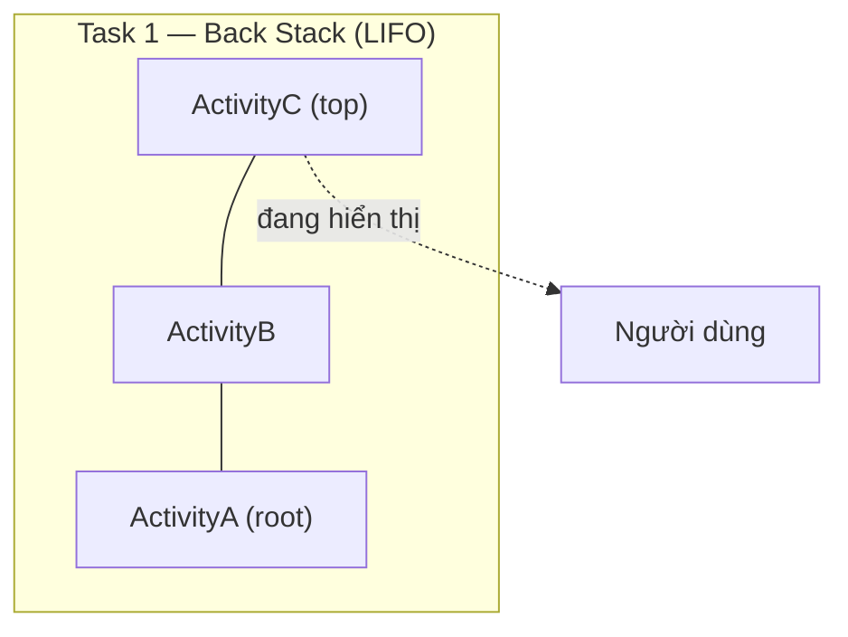
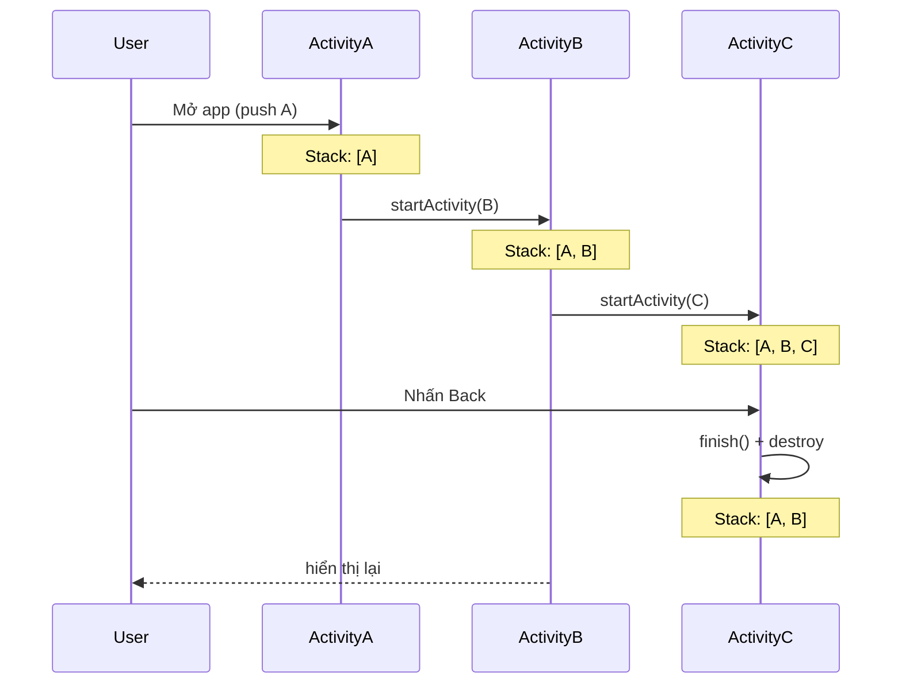
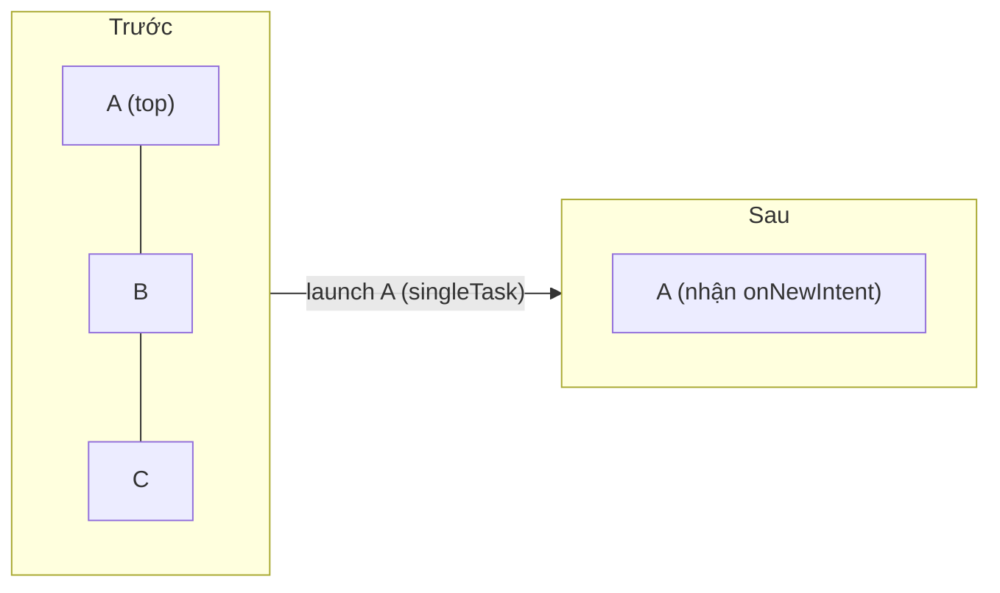
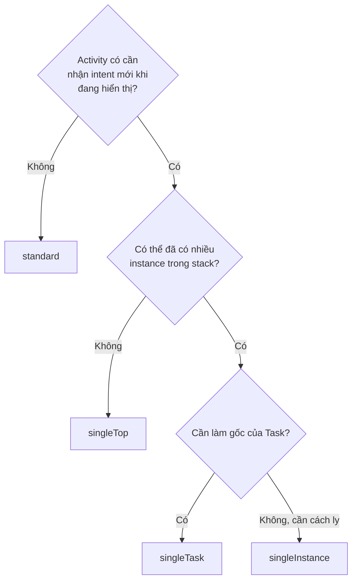
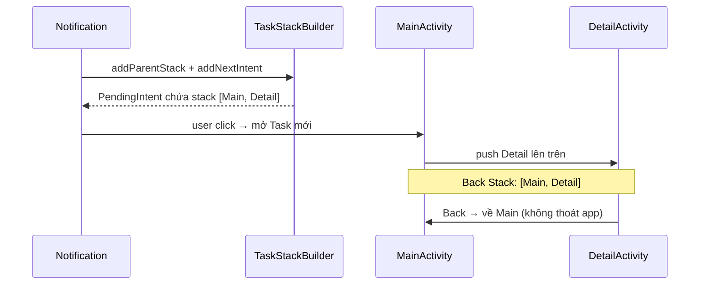
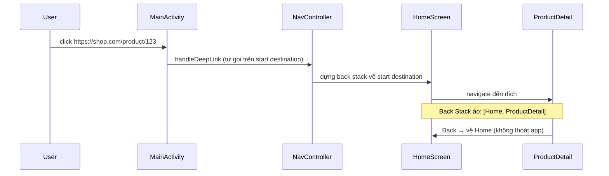
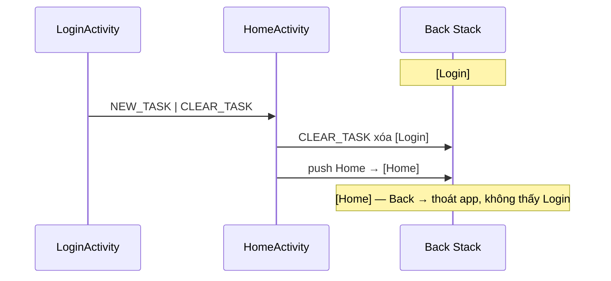
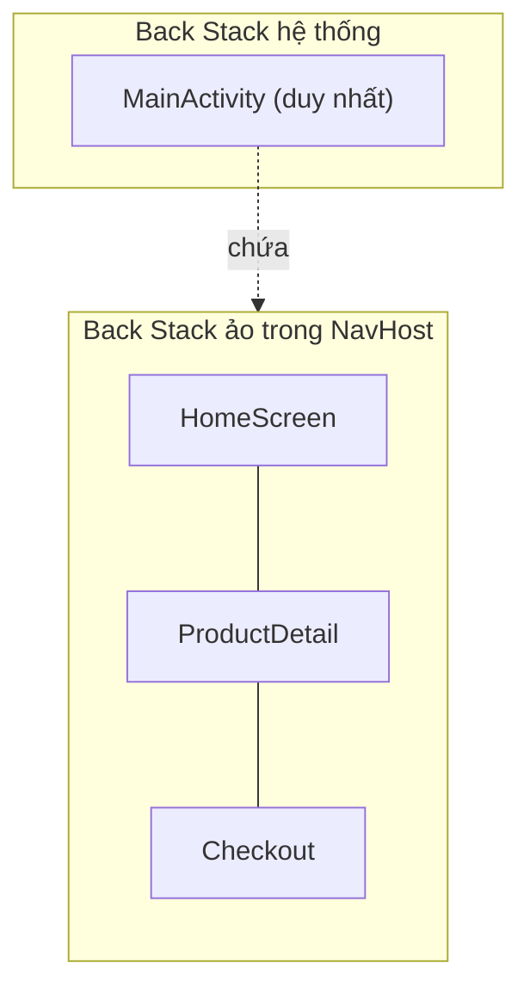

# Task and Back Stack

## Vấn đề cần giải quyết

Khi người dùng mở app, di chuyển giữa các màn hình, nhấn Back, mở notification hoặc click deep link — Android phải trả lời một loạt câu hỏi:

- Activity nào đang hiển thị?
- Nhấn Back thì quay về đâu, hay thoát app?
- Mở lại một Activity đã tồn tại — reuse hay tạo instance mới?
- Notification / deep link có phá vỡ luồng điều hướng hiện tại không?
- Khi nào một Activity bị loại khỏi bộ nhớ?

Nếu không hiểu cơ chế này, app sẽ gặp các lỗi điều hướng rất khó chịu:

- Nhấn notification 3 lần → có 3 màn giống hệt nhau chồng lên nhau.
- Mở deep link → nhấn Back lại ra ngoài app thay vì về Home.
- Sau login, nhấn Back → quay lại màn Login cũ đáng lẽ phải biến mất.
- Activity chồng chất trong stack → tốn RAM, giảm hiệu năng.

**Task và Back Stack chính là cơ chế hệ thống quản lý những câu hỏi này.** Hiểu nó, bạn không cần "thử nghiệm" để biết Back sẽ đi về đâu.

## Sau khi học xong

- Giải thích được khái niệm Task và Back Stack cùng luồng push/pop của Activity.
- Phân biệt được 5 Launch Modes và chọn đúng cho từng tình huống thực tế.
- Áp dụng được Intent Flags để kiểm soát navigation (clear stack, fresh start, no history).
- Xử lý được Notification và Deep Link mở Activity với Back Stack đúng.
- Nhận diện được các lỗi navigation phổ biến như duplicate Activity và Back button sai hướng.

## Task và Back Stack là gì?

**Task** là một tập hợp các Activity mà người dùng tương tác khi thực hiện một công việc (như: duyệt sản phẩm → xem chi tiết → thanh toán). Các Activity trong Task được xếp theo cấu trúc **stack** (LIFO — Last In, First Out) gọi là **Back Stack**.



Các quy tắc cốt lõi:

- **Mở Activity mới** → push lên đỉnh stack.
- **Nhấn Back** → pop Activity trên đỉnh và destroy nó, Activity phía dưới hiện lên.
- **Nhấn Home** → Task được đưa về background nhưng **không bị hủy**.
- **Chọn lại app từ Recents** → Task được đưa về foreground nguyên trạng.
- Mỗi Task xuất hiện như **một entry riêng trong Recents** (danh sách app gần đây).

> Một điểm dễ nhầm: **Back Stack chỉ chứa Activity, không phải Fragment hay Screen.** Trong app Single Activity, các màn hình là Fragment/Composable và có Back Stack *riêng* do thư viện Navigation quản lý — phần này sẽ rõ ở ví dụ cuối bài.

## Cách hoạt động — Activity di chuyển trong Back Stack



Hành vi với từng nút điều hướng:

| Hành động | Kết quả |
|-----------|---------|
| `startActivity()` | Push Activity mới lên top |
| Back (nút hệ thống) | Pop Activity top + destroy |
| Back ở root Activity | Task về background hoặc finish (tùy cấu hình) |
| Home | Task về background, giữ nguyên stack |
| Recents → chọn app | Đưa Task về foreground |
| System kill process | Activity bị destroy, **metadata stack được giữ** — khi mở lại, stack được phục hồi |

**Điểm mấu chốt:** Back Stack là dữ liệu hệ thống theo dõi được, còn Activity instance có thể bị destroy/recreate tùy bộ nhớ. Khi process bị kill, hệ thống vẫn nhớ *cấu trúc* của stack (Activity nào, intent gì) để khôi phục khi mở lại app.

## Cách hoạt động — 5 Launch Modes

Launch Mode quyết định cách Activity mới **được thêm vào Back Stack**: tạo mới hay tái sử dụng instance đã tồn tại. Khai báo trong `AndroidManifest.xml`:

```xml
<activity
    android:name=".DetailActivity"
    android:launchMode="singleTop" />
```

| Mode | Nhiều instance? | Tạo Task mới? | Clear stack? | onNewIntent? |
|------|----------------|---------------|-------------|-------------|
| `standard` | ✅ | Không | Không | Không |
| `singleTop` | ✅ (nếu không ở top) | Không | Không | Khi ở top |
| `singleTask` | ❌ | Có thể | ✅ | Khi đã tồn tại |
| `singleInstance` | ❌ | ✅ Luôn | N/A | Khi đã tồn tại |
| `singleInstancePerTask` (API 31+) | 1 per task | ✅ | ✅ | Khi đã tồn tại |

### standard (mặc định)

Mỗi lần launch → **tạo instance mới** và push lên top. Đây là lựa chọn an toàn nhất cho phần lớn màn hình.

```text
Launch A → [A]
Launch A → [A, A]
Launch B → [A, A, B]
```

### singleTop

Nếu Activity **đã ở top of stack** → không tạo mới, chỉ gọi `onNewIntent()`. Nếu không ở top → tạo mới bình thường.

```text
Stack: [A, B, C]
Launch C (singleTop) → [A, B, C]        ← C nhận onNewIntent()
Launch B (singleTop) → [A, B, C, B]     ← B không ở top → tạo mới
```

**Dùng khi:** Search screen, màn nhận notification, deep link vào chính màn đang hiển thị — giúp tránh duplicate.

### singleTask

**Một instance duy nhất trong hệ thống.** Nếu Activity đã tồn tại trong một Task:

1. Đưa Task chứa nó về foreground.
2. **Xóa toàn bộ Activity phía trên** nó trong stack.
3. Gọi `onNewIntent()` trên instance đó.



**Dùng khi:** Main/Home screen — luôn chỉ có một instance làm gốc Task.

> Cảnh báo: nếu Activity có `taskAffinity` khác mặc định, `singleTask` sẽ tạo **Task mới**. Hành vi phụ thuộc cả taskAffinity, không chỉ launchMode.

### singleInstance

Giống `singleTask`, nhưng Activity **chiếm riêng một Task** — không Activity nào khác được vào Task đó.

```text
Launch A (standard)      → Task 1: [A]
Launch B (singleInstance) → Task 2: [B]   ← Task riêng
Launch C (standard)      → Task 1: [A, C]  ← C vào Task 1, không vào Task 2
```

**Dùng khi:** Rất hiếm — app launcher, màn incoming call, hoặc màn cần cách ly hoàn toàn.

### singleInstancePerTask (API 31+)

Cho phép **một instance cho mỗi Task** (thay vì một instance toàn hệ thống). Phù hợp với multi-window, mỗi window/task có instance riêng.

### Quy tắc chọn nhanh



## Cách hoạt động — Intent Flags

Intent Flags kiểm soát hành vi navigation **tại thời điểm launch** — linh hoạt hơn launchMode cố định trong Manifest, vì quyết định nằm ở nơi gọi, không nằm trong cấu hình tĩnh.

### FLAG_ACTIVITY_NEW_TASK

Launch Activity trong **Task mới** (hoặc đưa Task chứa Activity đã tồn tại về foreground).

**Bắt buộc** khi `startActivity()` từ non-Activity context (Service, BroadcastReceiver, Application) — những context này không có Task để push Activity vào.

```kotlin
val intent = Intent(context, MainActivity::class.java).apply {
    flags = Intent.FLAG_ACTIVITY_NEW_TASK
}
context.startActivity(intent)
```

### FLAG_ACTIVITY_CLEAR_TOP

Nếu Activity đã tồn tại trong stack → **destroy tất cả Activity phía trên** nó, rồi đưa Activity đó lên top.

```kotlin
// Stack hiện tại: [A, B, C, D]
val intent = Intent(this, ActivityA::class.java).apply {
    flags = Intent.FLAG_ACTIVITY_CLEAR_TOP
}
startActivity(intent)
// Kết quả: [A]  ← B, C, D bị destroy
```

Mặc định Activity A cũng bị destroy rồi tạo lại. Kết hợp `FLAG_ACTIVITY_SINGLE_TOP` để **tái sử dụng instance** và nhận `onNewIntent()`:

```kotlin
flags = Intent.FLAG_ACTIVITY_CLEAR_TOP or Intent.FLAG_ACTIVITY_SINGLE_TOP
// Stack: [A] — A nhận onNewIntent(), không bị recreate
```

### FLAG_ACTIVITY_CLEAR_TASK

**Xóa toàn bộ Task** trước khi launch Activity mới. Phải kết hợp với `FLAG_ACTIVITY_NEW_TASK`.

```kotlin
// Sau khi login thành công — xóa toàn bộ login stack
val intent = Intent(this, HomeActivity::class.java).apply {
    flags = Intent.FLAG_ACTIVITY_NEW_TASK or Intent.FLAG_ACTIVITY_CLEAR_TASK
}
startActivity(intent)
```

### FLAG_ACTIVITY_SINGLE_TOP

Tương đương runtime của `launchMode="singleTop"`.

### FLAG_ACTIVITY_NO_HISTORY

Activity **không được lưu vào Back Stack** — khi rời đi, Activity bị destroy ngay.

```kotlin
// Splash screen — user không thể Back vào
val intent = Intent(this, SplashActivity::class.java).apply {
    flags = Intent.FLAG_ACTIVITY_NO_HISTORY
}
```

### Bảng kết hợp flags thường dùng

| Pattern | Flags | Use case |
|---------|-------|----------|
| Clear to root | `CLEAR_TOP or SINGLE_TOP` | Quay về Home, xóa màn trung gian |
| Fresh start | `NEW_TASK or CLEAR_TASK` | Sau login/logout |
| No back | `NO_HISTORY` | Splash, màn xác nhận thanh toán |
| Từ Service | `NEW_TASK` | Notification click (khi không dùng TaskStackBuilder) |

## Cách hoạt động — taskAffinity

`taskAffinity` quyết định Activity "thuộc về" Task có tên gì. Mặc định = `applicationId` — mọi Activity của app nằm cùng một Task.

```xml
<activity
    android:name=".settings.SettingsActivity"
    android:taskAffinity="com.example.app.settings"
    android:launchMode="singleTask" />
```

Khi `taskAffinity` khác mặc định **và** kết hợp `singleTask`/`FLAG_ACTIVITY_NEW_TASK`, Activity tạo **Task riêng** → xuất hiện thành **entry riêng trong Recents**.

**Dùng khi:** app có luồng độc lập muốn hiển thị riêng trong Recents (ví dụ: widget điều khiển, màn settings nổi). Đây là trường hợp hiếm — đa số app chỉ cần một Task.

## Ví dụ thực tế — từng bước tích hợp

### Bước 1: Notification mở Activity với đúng Back Stack

**Vấn đề:** user nhấn notification → mở `DetailActivity` trực tiếp. Nhấn Back → thoát hẳn app, không quay về Home như mong đợi.

**Giải pháp:** dùng `TaskStackBuilder` để tạo **synthetic back stack** — nói với hệ thống rằng `DetailActivity` nằm trên `MainActivity`, dù Main chưa hề được mở.

```kotlin
val resultIntent = Intent(context, DetailActivity::class.java).apply {
    putExtra("item_id", itemId)
}

val pendingIntent = TaskStackBuilder.create(context).apply {
    addParentStack(DetailActivity::class.java)  // tự thêm MainActivity (parent)
    addNextIntent(resultIntent)                 // thêm DetailActivity lên trên
}.getPendingIntent(
    0,
    PendingIntent.FLAG_UPDATE_CURRENT or PendingIntent.FLAG_IMMUTABLE
)

NotificationCompat.Builder(context, CHANNEL_ID)
    .setSmallIcon(R.drawable.ic_notification)
    .setContentTitle("Có đơn hàng mới")
    .setContentIntent(pendingIntent)
    .setAutoCancel(true)
    .build()
```



> `android:parentActivityName` khai báo trong Manifest là thứ `addParentStack` dựa vào để biết parent của Activity.

### Bước 2: Deep Link với Navigation Component

**Vấn đề:** deep link (`https://shop.com/product/123`) thường tạo Task mới với stack chỉ có một Activity → Back ra ngoài app.

**Giải pháp:** khai báo deep link trong Navigation Graph — Navigation **tự dựng back stack** về start destination trước khi đi đến đích.

```xml
<!-- navigation/nav_graph.xml -->
<navigation android:id="@+id/nav_graph" app:startDestination="@id/homeScreen">
    <fragment
        android:id="@+id/productDetailScreen"
        android:name="com.example.shop.ProductDetailFragment">
        <deepLink
            app:uri="https://shop.com/product/{productId}" />
    </fragment>
</navigation>
```

```kotlin
// Manifest: cho MainActivity (singleTask) nhận deep link
<activity
    android:name=".MainActivity"
    android:launchMode="singleTask">
    <intent-filter>
        <action android:name="android.intent.action.VIEW" />
        <category android:name="android.intent.category.DEFAULT" />
        <category android:name="android.intent.category.BROWSABLE" />
        <data android:scheme="https" android:host="shop.com" />
    </intent-filter>
</activity>
```



**Mẹo thực tế:** với App Links (verified), dùng `android:autoVerify="true"` trong intent-filter để mở trực tiếp bằng deep link; với deep link không verified, user được hỏi chọn app mở.

### Bước 3: Login / Logout — Fresh Start

**Vấn đề:** sau login thành công, nhấn Back phải thoát app, **không được quay lại màn Login**.

```kotlin
// LoginActivity → HomeActivity
fun onLoginSuccess() {
    val intent = Intent(this, HomeActivity::class.java).apply {
        flags = Intent.FLAG_ACTIVITY_NEW_TASK or Intent.FLAG_ACTIVITY_CLEAR_TASK
    }
    startActivity(intent)
    // Không cần finish() — CLEAR_TASK đã xóa toàn bộ stack cũ
}
```



### Bước 4: Single Activity + Compose/XML — Back Stack ảo

Trong app Single Activity, **Back Stack của hệ thống chỉ có 1 Activity**. Navigation giữ **Back Stack ảo** của riêng nó bên trong `NavHostFragment`.



Vì vậy trong app Single Activity:

- **Không cần (và không nên) đụng tới launchMode/intent flags** cho từng màn hình — Navigation lo toàn bộ.
- Nhấn Back hệ thống → Navigation pop screen trong NavHost; khi NavHost rỗng → hệ thống nhận lại Back và quyết định thoát app.
- **Ngoại lệ khi vẫn cần Task & Back Stack:** mở app từ Notification, deep link, hoặc mở Activity khác (dùng `singleTask` cho MainActivity) — chính là các Bước 1–3 ở trên.

```kotlin
// Compose — Navigation tự quản lý back stack ảo
@Composable
fun AppNavHost() {
    val navController = rememberNavController()
    NavHost(navController = navController, startDestination = "home") {
        composable("home") { HomeScreen(onOpenDetail = { id ->
            navController.navigate("product/$id")
        }) }
        composable(
            "product/{id}",
            deepLinks = listOf(
                navDeepLink { uriPattern = "https://shop.com/product/{id}" }
            )
        ) { ProductDetailScreen() }
    }
}

// Compose: Back → pop màn hình, hoặc tự quyết định khi không còn màn nào
BackHandler(enabled = navController.previousBackStackEntry != null) {
    navController.popBackStack()
}
```

## Khi nào nên dùng — Khi nào không nên dùng

### Nên dùng

- **`standard`** — mặc định cho hầu hết màn hình; mỗi navigation context độc lập.
- **`singleTop`** — màn nhận notification/deep link khi có thể đã mở (Search, Detail).
- **`singleTask`** — Main/Home làm gốc Task; kết hợp deep link vào app.
- **`CLEAR_TASK | NEW_TASK`** — sau login/logout để reset toàn bộ stack.
- **`TaskStackBuilder` / Navigation deep link** — mọi thứ mở app từ ngoài (notification, link).
- **Single Activity + Navigation** — chuẩn hiện đại cho toàn bộ luồng trong app.

### Không nên dùng

- **`singleInstance`** — hầu như không cần; gây quản lý Task phức tạp, khó dự đoán.
- **`singleTask` cho từng màn hình con** — chỉ dùng cho gốc Task, không dùng cho màn detail.
- **Intent flags thay cho Navigation** trong app Single Activity — trộn hai hệ thống back stack dễ tạo trạng thái khó debug.
- **`FLAG_ACTIVITY_NEW_TASK` khi đã có Activity context** — không cần thiết, chỉ bắt buộc từ non-Activity context.

## Sai lầm thường gặp

### 1. Lạm dụng singleTask / singleInstance

90% trường hợp `standard` là đủ. `singleTask`/`singleInstance` làm hành vi navigation khó đoán (Task chuyển foreground bất ngờ, clear stack không mong muốn). Dùng chúng chỉ khi thật sự cần "một instance duy nhất làm gốc".

### 2. Không xử lý onNewIntent

Khi Activity nhận intent mới qua `singleTop`/`singleTask`, nếu không cập nhật UI trong `onNewIntent()`, màn hình vẫn hiển thị dữ liệu cũ.

```kotlin
// ❌ Thiếu xử lý — intent mới bị bỏ qua
override fun onNewIntent(intent: Intent) {
    super.onNewIntent(intent)
}

// ✅ Đúng — cập nhật intent và load lại dữ liệu
override fun onNewIntent(intent: Intent) {
    super.onNewIntent(intent)
    setIntent(intent)  // để getIntent() trả đúng intent mới
    val itemId = intent.getLongExtra("item_id", -1L)
    loadItem(itemId)
}
```

### 3. Không tạo Back Stack cho notification / deep link

User mở notification → `DetailActivity`, nhấn Back → thoát app thay vì về Home. Luôn dùng `TaskStackBuilder` (XML) hoặc để Navigation dựng back stack (Compose/XML + Navigation).

### 4. Nhầm lẫn giữa finish() và Back

`finish()` destroy Activity hiện tại và quay về Activity dưới trong stack — giống Back. Nhưng nếu Activity là **root** của Task, finish → Task bị kết thúc. Dùng `CLEAR_TASK` khi cần xóa nhiều màn cùng lúc.

### 5. Nhầm lẫn Back Stack của hệ thống với Back Stack của Navigation

Khi đã chuyển sang Single Activity + Navigation, đừng thêm launchMode vào từng Fragment/composable — hai hệ thống back stack hoạt động khác nhau, trộn lẫn sẽ rất khó debug.

## Lịch sử phát triển

- **Android 1.0**: khái niệm Task & Back Stack xuất hiện cùng nền tảng; launchMode `standard`, `singleTop`, `singleTask`, `singleInstance`.
- **Android 1.6**: `android:taskAffinity`, `allowTaskReparenting` bổ sung để kiểm soát việc chuyển Task.
- **Android 5.0 (API 21)**: Recents chuyển sang **Document-centric** — mỗi Task là một document riêng; `FLAG_ACTIVITY_NEW_DOCUMENT` giới thiệu.
- **Android 12 (API 31)**: thêm `singleInstancePerTask`; tăng cường kiểm soát việc tạo Task từ deep link.
- **Hiện tại**: Navigation Component (Compose/XML) trở thành chuẩn, dịch chuyển phần lớn quản lý back stack từ Activity sang thư viện.

## Kết nối hệ thống

- **Prerequisites**: `Activity Lifecycle` — hiểu callback khi Activity push/pop. `Activity State Changes` — cách state được lưu/khôi phục khi Activity bị destroy.
- **Related Topics**: `Handle Intent` — cơ chế Intent dẫn đến việc launch Activity. `Explicit Intents` — startActivity mở Activity trong Task. `Pending Intent` — Intent đại diện được kích hoạt từ ngoài (notification).
- **Downstream Topics**: `FragmentManager` — back stack của Fragment, khái niệm tương tự ở mức Fragment.

## Nguồn tham khảo

- [Tasks and the back stack — Android Developers](https://developer.android.com/guide/components/activities/tasks-and-back-stack)
- [Activity launch modes — Android Developers](https://developer.android.com/guide/components/activities/launch-mode)
- [Navigation Component — Android Developers](https://developer.android.com/guide/navigation)
- [Create deep links to app content — Android Developers](https://developer.android.com/training/app-links/deep-linking)
- [TaskStackBuilder — Android Developers Reference](https://developer.android.com/reference/android/app/TaskStackBuilder)
- [PendingIntent — Android Developers Reference](https://developer.android.com/reference/android/app/PendingIntent)
- [AllowBackup / Recents & Documents — Android Developers](https://developer.android.com/guide/components/recents)
