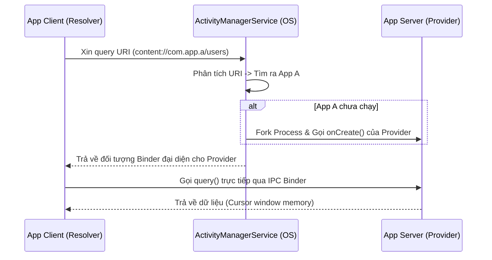

# 4.2.5 Content Provider

## 1. Nó là gì và vì sao nó tồn tại?

**Content Provider** là một trong 4 Application Component cốt lõi của Android (Activity, Service, Broadcast Receiver, Content Provider). Nó đóng vai trò **cổng giao tiếp dữ liệu có kiểm soát** giữa các ứng dụng và hệ thống.

### Vấn đề nó giải quyết

Android ứng dụng mô hình **sandbox bảo mật nghiêm ngặt**: mỗi app chạy trong một Linux process riêng với User ID riêng. Điều này có nghĩa là:

- App A **không thể đọc** file `.db` hay `SharedPreferences` của App B
- App của bạn **không thể trực tiếp** truy cập danh bạ, ảnh, lịch của hệ thống

Nếu không có cơ chế chuẩn hóa, việc chia sẻ dữ liệu yêu cầu các hack như: ghi file ra `external storage`, mở socket server nội bộ, hoặc hardcode path database — tất cả đều nguy hiểm và không nhất quán.

Content Provider giải quyết điều này bằng mô hình **client-server chuẩn hóa**:

- App sở hữu dữ liệu → triển khai **ContentProvider** (server), kiểm soát ai được đọc/ghi gì
- App cần dữ liệu → dùng **ContentResolver** (client), gửi request theo URI chuẩn

### Khi nào nên dùng Content Provider?

| Use case | Nên dùng Content Provider? |
|---|---|
| Đọc danh bạ/ảnh/lịch từ hệ thống | ✅ Bắt buộc |
| Chia sẻ data giữa 2 app cùng công ty | ✅ Phù hợp |
| Cung cấp Search Suggestions cho hệ thống | ✅ Phù hợp |
| Lưu data nội bộ trong một app | ❌ Dùng Room/DataStore |
| Truyền data nhỏ giữa các Activity | ❌ Dùng Intent/Bundle |

---

## 2. Các khái niệm cốt lõi

### Content URI — "địa chỉ" của dữ liệu

URI là địa chỉ để xác định dữ liệu cần truy cập. Cấu trúc:

```
content://com.android.contacts/contacts/42
  [scheme] [authority/package]  [path]  [id]
```

- **scheme**: Luôn là `content://`
- **authority**: Package name hoặc tên định danh duy nhất của Provider
- **path**: Tên bảng hoặc loại dữ liệu
- **id** (tuỳ chọn): ID của một bản ghi cụ thể

### ContentResolver — client giao tiếp với Provider

`ContentResolver` là proxy của hệ thống Android. Khi bạn gọi `contentResolver.query()`, hệ thống tự tìm đúng ContentProvider từ URI và route request đến đó. Bạn **không bao giờ** instantiate ContentProvider trực tiếp.

### Cursor — kết quả truy vấn

Cursor là con trỏ duyệt qua tập kết quả trả về, giống `ResultSet` trong JDBC. Cursor giữ tài nguyên hệ thống và **phải được đóng** sau khi dùng.

---

## 3. Cơ chế hoạt động bên trong (IPC Binder)

Đây là phần nhiều developer bỏ qua nhưng rất quan trọng để hiểu tại sao query Content Provider có thể chậm và tại sao phải dùng background thread.

```
App Client                 Android System               App Server
-----------               ----------------              ----------
ContentResolver.query()
        ↓
  Gửi Binder IPC  ──────► ActivityManagerService ──────► ContentProvider.query()
                                  │                              │
                          Tìm Provider từ URI               Xử lý query
                          Khởi động App Server               trả Cursor
                          nếu chưa chạy                        │
                                  ◄──────────────────────── Cursor data
        ◄─────────────────────────
  Cursor (shared memory)
```

**Tác động thực tế:**

1. IPC Binder có overhead — đặc biệt khi App Server chưa chạy, Android phải fork process mới
2. `query()` **block thread** cho đến khi nhận được response
3. **Không bao giờ gọi ContentResolver trên Main Thread** → ANR

---

## 4. Đọc dữ liệu từ System Provider (Client Side)

### Ví dụ thực chiến: Đọc danh sách ảnh từ MediaStore

**Bước 1: Khai báo permission trong AndroidManifest.xml**

```xml
<!-- Android ≤ 12 -->
<uses-permission android:name="android.permission.READ_EXTERNAL_STORAGE" />

<!-- Android 13+ (API 33+) — granular permissions -->
<uses-permission android:name="android.permission.READ_MEDIA_IMAGES" />
```

**Bước 2: Viết Repository tầng Data**

```kotlin
// data/media/MediaRepository.kt
class MediaRepository @Inject constructor(
    @ApplicationContext private val context: Context
) {
    // suspend fun → phải gọi từ coroutine scope
    suspend fun fetchImages(): List<MediaImage> = withContext(Dispatchers.IO) {
        val images = mutableListOf<MediaImage>()

        val projection = arrayOf(
            MediaStore.Images.Media._ID,
            MediaStore.Images.Media.DISPLAY_NAME,
            MediaStore.Images.Media.DATE_TAKEN,
            MediaStore.Images.Media.SIZE
        )

        context.contentResolver.query(
            MediaStore.Images.Media.EXTERNAL_CONTENT_URI,
            projection,
            null, // selection (WHERE)
            null, // selectionArgs
            "${MediaStore.Images.Media.DATE_TAKEN} DESC" // sortOrder
        )?.use { cursor -> // .use {} tự đóng Cursor ngay cả khi exception
            val idCol       = cursor.getColumnIndexOrThrow(MediaStore.Images.Media._ID)
            val nameCol     = cursor.getColumnIndexOrThrow(MediaStore.Images.Media.DISPLAY_NAME)
            val dateTakenCol= cursor.getColumnIndexOrThrow(MediaStore.Images.Media.DATE_TAKEN)
            val sizeCol     = cursor.getColumnIndexOrThrow(MediaStore.Images.Media.SIZE)

            while (cursor.moveToNext()) {
                val id = cursor.getLong(idCol)
                // Tạo content URI từ ID để dùng với Coil/Glide
                val contentUri = ContentUris.withAppendedId(
                    MediaStore.Images.Media.EXTERNAL_CONTENT_URI, id
                )
                images += MediaImage(
                    id = id,
                    uri = contentUri,
                    name = cursor.getString(nameCol),
                    dateTaken = cursor.getLong(dateTakenCol),
                    size = cursor.getLong(sizeCol)
                )
            }
        }

        images
    }
}

data class MediaImage(
    val id: Long,
    val uri: Uri,
    val name: String,
    val dateTaken: Long,
    val size: Long
)
```

> [!WARNING]
> **Bẫy phổ biến:** Khi truy vấn có filter (`selection`), **không bao giờ** nối thẳng string như `"name = '$userInput'"` — dễ bị SQL Injection. Dùng placeholder `?` và `selectionArgs` array.

```kotlin
// ❌ SQL Injection risk
query(uri, projection, "display_name = '$input'", null, null)

// ✅ Dùng selectionArgs
query(uri, projection, "${MediaStore.Images.Media.DISPLAY_NAME} = ?", arrayOf(input), null)
```

---

## 5. Lắng nghe thay đổi thời gian thực (ContentObserver + Flow)

Người dùng có thể chụp ảnh mới trong khi app đang chạy. Làm sao để gallery tự refresh?

**ContentObserver** là cơ chế của Android để theo dõi thay đổi trên một URI. Kết hợp với `callbackFlow` của Kotlin để tạo một reactive stream:

```kotlin
// data/media/MediaRepository.kt — thêm hàm observe
fun observeImages(): Flow<List<MediaImage>> = callbackFlow {
    // Gửi data lần đầu ngay khi collect
    trySend(fetchImages())

    val observer = object : ContentObserver(Handler(Looper.getMainLooper())) {
        override fun onChange(selfChange: Boolean) {
            // Mỗi khi MediaStore thay đổi → re-fetch
            trySend(runBlocking(Dispatchers.IO) { fetchImages() })
        }
    }

    context.contentResolver.registerContentObserver(
        MediaStore.Images.Media.EXTERNAL_CONTENT_URI,
        true, // notifyForDescendants
        observer
    )

    // Khi Flow bị cancel (scope hủy, màn hình đóng) → unregister để tránh leak
    awaitClose {
        context.contentResolver.unregisterContentObserver(observer)
    }
}
```

**Sử dụng trong ViewModel:**

```kotlin
@HiltViewModel
class GalleryViewModel @Inject constructor(
    private val mediaRepository: MediaRepository
) : ViewModel() {

    val images: StateFlow<List<MediaImage>> = mediaRepository
        .observeImages()
        .stateIn(
            scope = viewModelScope,
            started = SharingStarted.WhileSubscribed(5_000),
            initialValue = emptyList()
        )
}
```

**Luồng hoạt động:**

```
Người dùng chụp ảnh mới
        ↓
MediaStore.Images URI thay đổi
        ↓
ContentObserver.onChange() được gọi
        ↓
callbackFlow.trySend(fetchImages())
        ↓
Flow emit List<MediaImage> mới
        ↓
StateFlow cập nhật → UI tự re-render
```

---

## 6. Đọc danh bạ từ ContactsProvider

Một use case thực tế khác. ContactsProvider có schema phức tạp hơn MediaStore:

```kotlin
// data/contacts/ContactsRepository.kt
suspend fun searchContacts(query: String): List<Contact> = withContext(Dispatchers.IO) {
    val contacts = mutableListOf<Contact>()

    val projection = arrayOf(
        ContactsContract.Contacts._ID,
        ContactsContract.Contacts.DISPLAY_NAME_PRIMARY,
        ContactsContract.Contacts.HAS_PHONE_NUMBER
    )

    context.contentResolver.query(
        ContactsContract.Contacts.CONTENT_URI,
        projection,
        "${ContactsContract.Contacts.DISPLAY_NAME_PRIMARY} LIKE ?",
        arrayOf("%$query%"), // % là wildcard
        "${ContactsContract.Contacts.DISPLAY_NAME_PRIMARY} ASC"
    )?.use { cursor ->
        val idCol   = cursor.getColumnIndexOrThrow(ContactsContract.Contacts._ID)
        val nameCol = cursor.getColumnIndexOrThrow(ContactsContract.Contacts.DISPLAY_NAME_PRIMARY)
        val hasPhoneCol = cursor.getColumnIndexOrThrow(ContactsContract.Contacts.HAS_PHONE_NUMBER)

        while (cursor.moveToNext()) {
            if (cursor.getInt(hasPhoneCol) > 0) {
                contacts += Contact(
                    id = cursor.getLong(idCol),
                    name = cursor.getString(nameCol)
                )
            }
        }
    }

    contacts
}
```

---

## 7. Tự tạo Custom Content Provider (Server Side)

Kịch bản: Công ty bạn có **App A** (app chính) và **App B** (app companion). App B cần đọc profile user từ database của App A.

### Bước 1: Tạo ContentProvider trong App A

```kotlin
// provider/UserProvider.kt (App A)
class UserProvider : ContentProvider() {

    companion object {
        const val AUTHORITY = "com.company.appa.provider"

        // URI patterns
        val CONTENT_URI: Uri = Uri.parse("content://$AUTHORITY/users")

        private val uriMatcher = UriMatcher(UriMatcher.NO_MATCH).apply {
            addURI(AUTHORITY, "users", 1)       // content://authority/users
            addURI(AUTHORITY, "users/#", 2)     // content://authority/users/42
        }
    }

    // Khởi tạo nhẹ nhất có thể — đừng block ở đây
    override fun onCreate(): Boolean = true

    override fun query(
        uri: Uri,
        projection: Array<String>?,
        selection: String?,
        selectionArgs: Array<String>?,
        sortOrder: String?
    ): Cursor? {
        // Kiểm tra permission trước
        context?.checkCallingPermission("com.company.permission.READ_USER")
            ?.takeIf { it != PackageManager.PERMISSION_GRANTED }
            ?.let { throw SecurityException("Missing READ_USER permission") }

        val db = UserDatabase.getInstance(context!!).readableDatabase

        return when (uriMatcher.match(uri)) {
            1 -> db.query("users", projection, selection, selectionArgs, null, null, sortOrder)
            2 -> {
                val id = ContentUris.parseId(uri)
                db.query("users", projection, "_id = ?", arrayOf(id.toString()), null, null, null)
            }
            else -> throw IllegalArgumentException("Unknown URI: $uri")
        }
    }

    // Implement nếu cần write operations
    override fun getType(uri: Uri): String = when (uriMatcher.match(uri)) {
        1 -> "vnd.android.cursor.dir/vnd.com.company.appa.users"
        2 -> "vnd.android.cursor.item/vnd.com.company.appa.users"
        else -> throw IllegalArgumentException("Unknown URI: $uri")
    }

    override fun insert(uri: Uri, values: ContentValues?): Uri? = null
    override fun update(uri: Uri, values: ContentValues?, selection: String?, selectionArgs: Array<String>?): Int = 0
    override fun delete(uri: Uri, selection: String?, selectionArgs: Array<String>?): Int = 0
}
```

### Bước 2: Khai báo trong AndroidManifest.xml của App A

```xml
<!-- Khai báo custom permission -->
<permission
    android:name="com.company.permission.READ_USER"
    android:protectionLevel="signature" />
    <!-- signature: chỉ app cùng chữ ký mới được cấp quyền này -->

<provider
    android:name=".provider.UserProvider"
    android:authorities="com.company.appa.provider"
    android:exported="true"
    android:readPermission="com.company.permission.READ_USER" />
```

### Bước 3: App B khai báo và sử dụng

```xml
<!-- AndroidManifest.xml của App B -->
<uses-permission android:name="com.company.permission.READ_USER" />
```

```kotlin
// data/user/RemoteUserRepository.kt (App B)
suspend fun fetchUsersFromAppA(): List<User> = withContext(Dispatchers.IO) {
    val users = mutableListOf<User>()
    val uri = Uri.parse("content://com.company.appa.provider/users")

    context.contentResolver.query(uri, null, null, null, null)?.use { cursor ->
        while (cursor.moveToNext()) {
            // Parse cursor...
        }
    }

    users
}
```

> [!NOTE]
> `android:protectionLevel="signature"` nghĩa là chỉ app được ký cùng keystore với App A mới được cấp permission này tự động. Đây là cách bảo mật chuẩn cho các app cùng công ty.

---

## 8. Luồng hoàn chỉnh end-to-end

```
[App B - GalleryScreen]
        ↓ collect StateFlow
[App B - GalleryViewModel]
        ↓ observeImages() / fetchUsersFromAppA()
[App B - Repository]
        ↓ contentResolver.query()
[Android OS - ActivityManagerService]
        ↓ IPC Binder
[App A/System - ContentProvider.query()]
        ↓ SQLite / Room query
[Cursor - Shared Memory Window]
        ↑ trả về App B qua Binder
[App B - Repository parse Cursor]
        ↑ emit vào Flow
[App B - ViewModel StateFlow update]
        ↑ LazyColumn re-render
[App B - GalleryScreen hiển thị ảnh]
```

---

## 9. Sai lầm thường gặp

### 1. Query trên Main Thread

```kotlin
// ❌ Crash → StrictMode exception hoặc ANR
fun onClick() {
    val cursor = contentResolver.query(MediaStore.Images.Media.EXTERNAL_CONTENT_URI, ...)
}

// ✅ Dùng Coroutines
fun onClick() {
    viewModelScope.launch {
        val images = withContext(Dispatchers.IO) {
            repository.fetchImages()
        }
    }
}
```

### 2. Quên đóng Cursor

```kotlin
// ❌ Memory/resource leak — Cursor giữ file descriptor
val cursor = contentResolver.query(...)
cursor?.moveToFirst()
val name = cursor?.getString(0) // cursor không được đóng!

// ✅ .use {} tự động close()
contentResolver.query(...)?.use { cursor ->
    cursor.moveToFirst()
    val name = cursor.getString(0)
} // close() được gọi tự động ở đây
```

### 3. Dùng Content Provider để lưu data nội bộ

```kotlin
// ❌ Anti-pattern — dùng ContentProvider cho data chỉ dùng trong app
class InternalUserProvider : ContentProvider() { ... }

// ✅ Dùng Room + Repository
@Dao interface UserDao { @Query("SELECT * FROM users") fun getAll(): Flow<List<User>> }
```

### 4. exported="true" không có permission

```xml
<!-- ❌ Nguy hiểm — mọi app đều đọc được -->
<provider android:exported="true" />

<!-- ✅ Luôn kèm permission -->
<provider
    android:exported="true"
    android:readPermission="com.company.permission.READ_USER" />
```

---

## 10. Khi nào không dùng Content Provider

- **Data nội bộ**: Dùng Room + DataStore
- **Giao tiếp real-time**: Dùng SharedFlow/BroadcastChannel
- **File transfer lớn**: Dùng FileProvider + Intent chooser
- **API server**: Dùng Retrofit/Ktor

Content Provider phù hợp nhất khi cần **truy cập dữ liệu tabular có cấu trúc** từ system providers (MediaStore, ContactsProvider, CalendarProvider) hoặc chia sẻ data có kiểm soát giữa các app.

---

## References

- [Android Developers — Content Provider basics](https://developer.android.com/guide/topics/providers/content-provider-basics)
- [Android Developers — Creating a Content Provider](https://developer.android.com/guide/topics/providers/content-provider-creating)
- [Android Developers — MediaStore](https://developer.android.com/reference/android/provider/MediaStore)
- [Android Developers — ContactsContract](https://developer.android.com/reference/android/provider/ContactsContract)
- [Android Developers — FileProvider](https://developer.android.com/reference/androidx/core/content/FileProvider)


## Vấn đề cần giải quyết

Trong Android, mỗi ứng dụng (App) chạy trong một hộp cát (Sandbox) riêng biệt với Process và User ID riêng.
Điều này có nghĩa là App A không thể trực tiếp đọc file database (`.db`) hay `SharedPreferences` của App B.

**Bài toán đặt ra:**
1. Làm sao ứng dụng của bạn có thể lấy được danh bạ, tin nhắn, hoặc danh sách ảnh từ hệ điều hành (vốn thuộc các app khác nhau)?
2. Làm sao ứng dụng của bạn có thể chia sẻ một số dữ liệu nhất định cho các ứng dụng đối tác một cách an toàn mà không làm lộ toàn bộ database?

Nếu không có cơ chế chuẩn hóa, các app phải tự mở cổng server, dùng socket hoặc ghi file ra bộ nhớ ngoài rất nguy hiểm và không đồng nhất.

Đó là lý do **Content Provider** ra đời. Nó đóng vai trò như một "nhân viên hải quan" hoặc "REST API nội bộ" của hệ điều hành, cho phép các app giao tiếp và chia sẻ dữ liệu với nhau một cách an toàn qua một chuẩn chung (CRUD).

## Content Provider là gì?

Content Provider là một trong 4 thành phần cốt lõi của Android (cùng với Activity, Service, Broadcast Receiver).
Nó quản lý quyền truy cập vào một kho dữ liệu trung tâm và cung cấp dữ liệu đó cho các ứng dụng khác.

**Khái niệm cốt lõi:**
- **ContentProvider (Server):** Ứng dụng sở hữu dữ liệu sẽ tạo ra một lớp kế thừa `ContentProvider` để quyết định xem ai được phép đọc/ghi dữ liệu gì.
- **ContentResolver (Client):** Ứng dụng muốn lấy dữ liệu sẽ không bao giờ gọi trực tiếp `ContentProvider`. Thay vào đó, nó dùng `ContentResolver` (một trung gian của hệ điều hành) để gửi yêu cầu.
- **URI (Uniform Resource Identifier):** Giống như URL của website. Để biết cần lấy dữ liệu từ đâu, bạn phải gọi đúng địa chỉ URI. VD: `content://com.android.contacts/contacts`.
- **Cursor:** Giống như một con trỏ trỏ vào kết quả trả về từ database. Bạn sẽ dùng nó để duyệt qua từng dòng dữ liệu.

---

## 1. Sử dụng Content Provider (Client Side)

Hãy bắt đầu với trường hợp phổ biến nhất: Ứng dụng của bạn cần lấy danh bạ hoặc media từ hệ thống.

### Ví dụ thực tế: Đọc danh sách ảnh từ thư viện (Media) bằng Coroutine & Flow

Nếu dùng cách cũ với Thread thuần, code sẽ rất rối và dễ gây block Main Thread. Với Kotlin Coroutines, chúng্বা có thể đẩy tiến trình query xuống background thread (`Dispatchers.IO`).

**Bước 1: Khai báo quyền trong AndroidManifest.xml**
```xml
<uses-permission android:name="android.permission.READ_EXTERNAL_STORAGE" />
<!-- Từ Android 13 trở lên -->
<uses-permission android:name="android.permission.READ_MEDIA_IMAGES" />
```

**Bước 2: Viết hàm Query bất đồng bộ**

```kotlin
import android.content.ContentResolver
import android.provider.MediaStore
import kotlinx.coroutines.Dispatchers
import kotlinx.coroutines.withContext

data class ImageItem(val id: Long, val name: String, val path: String)

suspend fun fetchImagesFromGallery(contentResolver: ContentResolver): List<ImageItem> {
    return withContext(Dispatchers.IO) { // Chuyển sang IO Thread để không block UI
        val imageList = mutableListOf<ImageItem>()

        // 1. Xác định URI cần lấy (ở đây là ảnh từ bộ nhớ ngoài)
        val collectionUri = MediaStore.Images.Media.EXTERNAL_CONTENT_URI

        // 2. Chỉ định các cột muốn lấy (SELECT)
        val projection = arrayOf(
            MediaStore.Images.Media._ID,
            MediaStore.Images.Media.DISPLAY_NAME,
            MediaStore.Images.Media.DATA
        )

        // 3. Thực hiện Query thông qua ContentResolver
        val cursor = contentResolver.query(
            collectionUri,
            projection,
            null, // WHERE clause
            null, // WHERE arguments
            "${MediaStore.Images.Media.DATE_ADDED} DESC" // ORDER BY
        )

        // 4. Duyệt Cursor để lấy dữ liệu
        cursor?.use { // .use() tự động đóng Cursor để tránh Memory Leak
            val idColumn = it.getColumnIndexOrThrow(MediaStore.Images.Media._ID)
            val nameColumn = it.getColumnIndexOrThrow(MediaStore.Images.Media.DISPLAY_NAME)
            val dataColumn = it.getColumnIndexOrThrow(MediaStore.Images.Media.DATA)

            while (it.moveToNext()) {
                val id = it.getLong(idColumn)
                val name = it.getString(nameColumn)
                val path = it.getString(dataColumn)
                imageList.add(ImageItem(id, name, path))
            }
        }
        
        imageList
    }
}
```

> [!TIP]
> **Best Practice:** Luôn bọc `cursor` trong khối `.use { }` để đảm bảo Cursor được `close()` ngay cả khi có Exception xảy ra. Quên đóng Cursor là nguyên nhân hàng đầu gây sập app do cạn kiệt tài nguyên (OOM).

---

## 2. Tạo Content Provider chia sẻ dữ liệu (Server Side)

Bây giờ giả sử bạn làm cho công ty có 2 app: App A (Lưu thông tin User) và App B. App B cần lấy thông tin User từ App A mà không bắt người dùng đăng nhập lại.

Bạn sẽ tạo một Custom Content Provider ở App A.

**Bước 1: Tạo class kế thừa ContentProvider**

```kotlin
import android.content.ContentProvider
import android.content.ContentValues
import android.content.UriMatcher
import android.database.Cursor
import android.database.MatrixCursor
import android.net.Uri

class UserContentProvider : ContentProvider() {

    companion object {
        const val AUTHORITY = "com.company.appa.provider"
        const val PATH_USER = "users"
        const val CODE_USER = 1
        
        // Dùng UriMatcher để phân loại URI truyền vào
        val uriMatcher = UriMatcher(UriMatcher.NO_MATCH).apply {
            addURI(AUTHORITY, PATH_USER, CODE_USER)
        }
    }

    override fun onCreate(): Boolean {
        // Khởi tạo Database/Room ở đây nếu cần
        return true
    }

    override fun query(
        uri: Uri, projection: Array<String>?, selection: String?,
        selectionArgs: Array<String>?, sortOrder: String?
    ): Cursor? {
        when (uriMatcher.match(uri)) {
            CODE_USER -> {
                // Tạo một Cursor giả lập (Thực tế bạn sẽ lấy từ SQLite/Room)
                val cursor = MatrixCursor(arrayOf("id", "name", "email"))
                cursor.addRow(arrayOf(1, "Hazu", "hazu@example.com"))
                return cursor
            }
            else -> throw IllegalArgumentException("Unknown URI: $uri")
        }
    }

    // Các hàm bắt buộc khác phải override (trả về null/0 nếu không hỗ trợ)
    override fun getType(uri: Uri): String? = null
    override fun insert(uri: Uri, values: ContentValues?): Uri? = null
    override fun delete(uri: Uri, selection: String?, selectionArgs: Array<String>?): Int = 0
    override fun update(uri: Uri, values: ContentValues?, selection: String?, selectionArgs: Array<String>?): Int = 0
}
```

**Bước 2: Khai báo trong AndroidManifest.xml của App A**

```xml
<provider
    android:name=".UserContentProvider"
    android:authorities="com.company.appa.provider"
    android:exported="true" 
    android:readPermission="com.company.permission.READ_USER" />
```

> [!WARNING]
> Thuộc tính `android:exported="true"` cho phép **MỌI APP** trên điện thoại truy cập Provider này. Luôn kết hợp với `android:readPermission` để chỉ những app có chung chữ ký bảo mật hoặc được cấp quyền mới được đọc.

**Bước 3: Bên App B, gọi data giống hệt cách query ảnh ở trên, nhưng đổi URI thành:**
`content://com.company.appa.provider/users`

---

## 3. IPC Binder - Chuyện gì thực sự xảy ra dưới nền? (Cơ chế hoạt động)

Android ứng dụng kiến trúc Client-Server. App xin dữ liệu và App cho dữ liệu nằm ở 2 process khác nhau hoàn toàn.

Khi `ContentResolver` (Client) gọi `query()`, hệ thống Android thực hiện luồng sau:



**Sự thật về tốc độ & UI:**
1. IPC (Inter-Process Communication) rất tốn kém (chậm).
2. Nếu Server App chưa chạy, OS phải khởi động nó (Cold Start), gọi `Application.onCreate` rồi đến `Provider.onCreate`. Toàn bộ thời gian này, `query()` của Client **bị block**.
3. Do đó, **TUYỆT ĐỐI KHÔNG** gọi ContentResolver.query() trên Main Thread (UI Thread) vì nó sẽ gây giật lag hoặc ANR.

---

## 4. Lắng nghe thay đổi dữ liệu thời gian thực với Flow

Trong thực tế, danh bạ hoặc media có thể thay đổi (người dùng vừa chụp thêm 1 bức ảnh). Làm sao để UI tự động cập nhật mà không phải query lại thủ công?

Chúng ta dùng `ContentObserver` bọc lại bằng Kotlin Flow:

```kotlin
import android.database.ContentObserver
import android.net.Uri
import android.os.Handler
import android.os.Looper
import kotlinx.coroutines.channels.awaitClose
import kotlinx.coroutines.flow.Flow
import kotlinx.coroutines.flow.callbackFlow

fun observeUriChanges(contentResolver: ContentResolver, uri: Uri): Flow<Unit> = callbackFlow {
    val observer = object : ContentObserver(Handler(Looper.getMainLooper())) {
        override fun onChange(selfChange: Boolean) {
            // Gửi tín hiệu khi dữ liệu thay đổi
            trySend(Unit)
        }
    }
    
    // Đăng ký lắng nghe
    contentResolver.registerContentObserver(uri, true, observer)
    
    // Gửi tín hiệu khởi tạo lần đầu để query ban đầu
    trySend(Unit)

    // Khi Flow bị cancel (VD: màn hình đóng), tự động unregister để tránh Memory Leak
    awaitClose {
        contentResolver.unregisterContentObserver(observer)
    }
}
```

**Cách sử dụng trong ViewModel:**

```kotlin
class GalleryViewModel(private val contentResolver: ContentResolver) : ViewModel() {
    
    // Bất cứ khi nào Media URI thay đổi, nó sẽ trigger map và query lại dữ liệu mới nhất
    val images: Flow<List<ImageItem>> = observeUriChanges(
        contentResolver, 
        MediaStore.Images.Media.EXTERNAL_CONTENT_URI
    ).map { 
        fetchImagesFromGallery(contentResolver) // Hàm đã viết ở Phần 1
    }
}
```
*Đây là cách kết hợp hoàn hảo giữa cơ chế cổ điển của Android (ContentObserver) và kiến trúc hiện đại (Kotlin Flow).*

---

## 5. Khi nào KHÔNG nên dùng Content Provider?

Content Provider là một công cụ nặng nề (heavyweight). Đừng dùng nó nếu:
- Bạn chỉ muốn lưu dữ liệu nội bộ trong app của mình. Hãy dùng **Room Database** hoặc **DataStore**.
- Bạn muốn truyền một mảng dữ liệu nhỏ giữa 2 Activity. Hãy dùng **Intent/Bundle**.
- Bạn làm app nhỏ không có nhu cầu share data ra ngoài. (Trước đây Google khuyến khích bọc SQLite bằng Provider ngay cả dùng nội bộ, nhưng giờ đó là Anti-pattern. Architecture Components/Room đã thay thế nó).

## Tổng kết Trade-offs & Best Practices
- **Security:** Luôn dùng `android:readPermission` và `android:writePermission`. Không bao giờ `exported="true"` vô điều kiện.
- **Performance:** Luôn truy vấn qua Coroutines (`Dispatchers.IO`).
- **Memory Leak:** Luôn bọc cursor trong block `use {}` để giải phóng.
- **IPC Blocking:** Tránh thực hiện logic quá nặng trong `onCreate()` của Provider vì nó block quá trình khởi động của app và block cả app client đang chờ.
