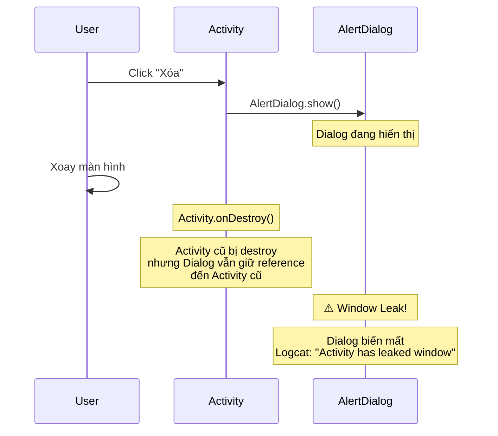
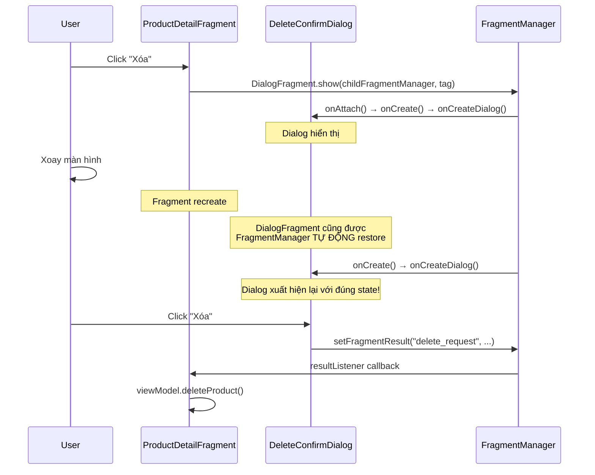
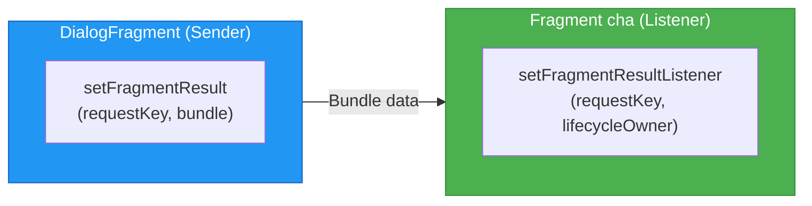

# Dialog and DialogFragment

## Vấn đề cần giải quyết

Dialog là UI element phổ biến: xác nhận xóa, chọn ngày, nhập thông tin, hiển thị lỗi. Nhưng trong Android, dialog có một vấn đề nghiêm trọng liên quan đến **lifecycle**.

Tình huống: User mở dialog xác nhận xóa → xoay màn hình → Activity bị recreate → **Dialog biến mất** hoặc tệ hơn, **app crash** vì dialog cố truy cập Activity cũ đã bị destroy.

Đây là lý do `DialogFragment` tồn tại: nó **gắn dialog vào Fragment lifecycle**, giúp dialog tự động được restore khi configuration change, và tự cleanup khi Fragment bị destroy.

## AlertDialog — Simple nhưng nguy hiểm

### Cách dùng cơ bản

```kotlin
// Trong Fragment hoặc Activity
AlertDialog.Builder(requireContext())
    .setTitle("Xác nhận xóa")
    .setMessage("Bạn có chắc muốn xóa sản phẩm này?")
    .setPositiveButton("Xóa") { _, _ ->
        viewModel.deleteProduct()
    }
    .setNegativeButton("Hủy", null)
    .show()
```

Code đơn giản, nhưng ẩn chứa nhiều vấn đề:

### Vấn đề 1: Window Leak khi Configuration Change



**Nguyên nhân:** `AlertDialog` giữ strong reference đến `Context` (Activity). Khi Activity bị destroy, dialog không tự dismiss → window leak. Trong một số trường hợp, dialog cố truy cập Activity cũ → crash.

### Vấn đề 2: Mất state

- User đang nhập text trong dialog → xoay màn hình → mất hết
- Dialog đang hiển thị → xoay → biến mất, user phải mở lại

### Khi nào vẫn chấp nhận dùng AlertDialog?

- Dialog **cực kỳ đơn giản** (chỉ hiển thị message + OK button)
- Không cần survive configuration change
- Không có user input
- Context an toàn (ví dụ: trong scope của `viewLifecycleOwner`)

> [!WARNING]
> **Quy tắc:** Nếu dialog có bất kỳ user interaction nào (button callbacks, input field, list selection) hoặc cần survive configuration change → dùng `DialogFragment`.

## DialogFragment — Lifecycle-safe Dialog

`DialogFragment` là Fragment chuyên biệt cho dialog. Nó thừa hưởng toàn bộ lifecycle management của Fragment:

- **Tự restore** khi configuration change (dialog không biến mất khi xoay)
- **Tự cleanup** khi host Fragment/Activity bị destroy (không window leak)
- **Có thể nhận arguments** qua Bundle
- **Có thể trả kết quả** về Fragment cha qua Fragment Result API

### Triển khai DialogFragment

```kotlin
class DeleteConfirmDialog : DialogFragment() {

    override fun onCreateDialog(savedInstanceState: Bundle?): Dialog {
        val productName = requireArguments().getString("product_name", "")
        
        return MaterialAlertDialogBuilder(requireContext())
            .setTitle("Xác nhận xóa")
            .setMessage("Bạn có chắc muốn xóa \"$productName\"?")
            .setPositiveButton("Xóa") { _, _ ->
                // Trả kết quả về Fragment cha
                setFragmentResult("delete_request", bundleOf("confirmed" to true))
            }
            .setNegativeButton("Hủy", null)
            .create()
    }

    companion object {
        fun newInstance(productName: String) = DeleteConfirmDialog().apply {
            arguments = bundleOf("product_name" to productName)
        }
    }
}
```

### Hiển thị DialogFragment

```kotlin
// Trong Fragment cha
class ProductDetailFragment : Fragment(R.layout.fragment_product_detail) {

    override fun onViewCreated(view: View, savedInstanceState: Bundle?) {
        super.onViewCreated(view, savedInstanceState)

        binding.btnDelete.setOnClickListener {
            DeleteConfirmDialog.newInstance("iPhone 15 Pro")
                .show(childFragmentManager, "delete_confirm")
        }

        // Lắng nghe kết quả từ Dialog
        childFragmentManager.setFragmentResultListener("delete_request", viewLifecycleOwner) { _, bundle ->
            val confirmed = bundle.getBoolean("confirmed")
            if (confirmed) {
                viewModel.deleteProduct()
            }
        }
    }
}
```

### Mô phỏng: DialogFragment survive Configuration Change



## DialogFragment với Custom Layout

Ngoài `onCreateDialog`, bạn có thể dùng `onCreateView` để tạo dialog có layout phức tạp:

```kotlin
class EditNoteDialog : DialogFragment() {

    private var _binding: DialogEditNoteBinding? = null
    private val binding get() = _binding!!

    override fun onCreateView(
        inflater: LayoutInflater,
        container: ViewGroup?,
        savedInstanceState: Bundle?
    ): View {
        _binding = DialogEditNoteBinding.inflate(inflater, container, false)
        return binding.root
    }

    override fun onViewCreated(view: View, savedInstanceState: Bundle?) {
        super.onViewCreated(view, savedInstanceState)

        // Restore text nếu đã nhập trước đó (survive config change)
        val savedText = savedInstanceState?.getString("note_text")
        if (savedText != null) {
            binding.etNote.setText(savedText)
        }

        binding.btnSave.setOnClickListener {
            val noteText = binding.etNote.text.toString()
            setFragmentResult("edit_note", bundleOf("note_text" to noteText))
            dismiss()
        }

        binding.btnCancel.setOnClickListener {
            dismiss()
        }
    }

    override fun onSaveInstanceState(outState: Bundle) {
        super.onSaveInstanceState(outState)
        // Lưu text đang nhập để survive config change
        if (_binding != null) {
            outState.putString("note_text", binding.etNote.text.toString())
        }
    }

    override fun onDestroyView() {
        _binding = null
        super.onDestroyView()
    }

    // Tùy chỉnh kích thước dialog
    override fun onStart() {
        super.onStart()
        dialog?.window?.setLayout(
            ViewGroup.LayoutParams.MATCH_PARENT,
            ViewGroup.LayoutParams.WRAP_CONTENT
        )
    }
}
```

> [!TIP]
> **onCreateDialog vs onCreateView:** Dùng `onCreateDialog` cho dialog đơn giản (AlertDialog, MaterialAlertDialog). Dùng `onCreateView` khi cần custom layout phức tạp với ViewBinding, RecyclerView, hoặc nhiều input field.

## BottomSheetDialogFragment

`BottomSheetDialogFragment` là DialogFragment hiển thị từ dưới lên, theo Material Design guideline. Thường dùng cho: menu hành động, filter, picker.

```kotlin
class ProductActionSheet : BottomSheetDialogFragment() {

    private var _binding: SheetProductActionsBinding? = null
    private val binding get() = _binding!!

    override fun onCreateView(
        inflater: LayoutInflater,
        container: ViewGroup?,
        savedInstanceState: Bundle?
    ): View {
        _binding = SheetProductActionsBinding.inflate(inflater, container, false)
        return binding.root
    }

    override fun onViewCreated(view: View, savedInstanceState: Bundle?) {
        super.onViewCreated(view, savedInstanceState)

        binding.btnEdit.setOnClickListener {
            setFragmentResult("product_action", bundleOf("action" to "edit"))
            dismiss()
        }

        binding.btnShare.setOnClickListener {
            setFragmentResult("product_action", bundleOf("action" to "share"))
            dismiss()
        }

        binding.btnDelete.setOnClickListener {
            setFragmentResult("product_action", bundleOf("action" to "delete"))
            dismiss()
        }
    }

    override fun onDestroyView() {
        _binding = null
        super.onDestroyView()
    }
}
```

### Tùy chỉnh BottomSheet behavior

```kotlin
class FilterBottomSheet : BottomSheetDialogFragment() {

    override fun onViewCreated(view: View, savedInstanceState: Bundle?) {
        super.onViewCreated(view, savedInstanceState)

        // Tùy chỉnh behavior
        val bottomSheet = dialog?.findViewById<View>(
            com.google.android.material.R.id.design_bottom_sheet
        )
        bottomSheet?.let {
            val behavior = BottomSheetBehavior.from(it)
            behavior.state = BottomSheetBehavior.STATE_EXPANDED
            behavior.isDraggable = true
            behavior.skipCollapsed = true
        }
    }
}
```

## Fragment Result API — Giao tiếp Dialog ↔ Fragment

Trước đây, developer thường dùng interface callback hoặc shared ViewModel để giao tiếp giữa DialogFragment và Fragment cha. Từ Fragment 1.3.0, **Fragment Result API** là cách chuẩn:



### Pattern hoàn chỉnh

```kotlin
// FRAGMENT CHA — Đăng ký listener
class OrderFragment : Fragment(R.layout.fragment_order) {

    override fun onViewCreated(view: View, savedInstanceState: Bundle?) {
        super.onViewCreated(view, savedInstanceState)

        // Listener tự động cleanup theo viewLifecycleOwner
        childFragmentManager.setFragmentResultListener(
            "date_selected",
            viewLifecycleOwner
        ) { _, bundle ->
            val selectedDate = bundle.getString("date")
            binding.tvDeliveryDate.text = selectedDate
        }

        binding.btnPickDate.setOnClickListener {
            DatePickerDialog.newInstance()
                .show(childFragmentManager, "date_picker")
        }
    }
}

// DIALOG — Gửi kết quả
class DatePickerDialog : DialogFragment() {

    override fun onCreateDialog(savedInstanceState: Bundle?): Dialog {
        return MaterialDatePicker.Builder.datePicker()
            .setTitleText("Chọn ngày giao hàng")
            .build()
            .apply {
                addOnPositiveButtonClickListener { timestamp ->
                    val date = SimpleDateFormat("dd/MM/yyyy", Locale.getDefault())
                        .format(Date(timestamp))
                    setFragmentResult("date_selected", bundleOf("date" to date))
                }
            }
    }
}
```

### Lưu ý quan trọng về FragmentManager

Khi dùng Fragment Result API, **đăng ký listener trên cùng FragmentManager đã show dialog**:

| Dialog show bằng | Listener đăng ký trên |
|---|---|
| `childFragmentManager` | `childFragmentManager` |
| `parentFragmentManager` | `parentFragmentManager` |

```kotlin
// ✅ ĐÚNG — cùng FragmentManager
dialog.show(childFragmentManager, "tag")
childFragmentManager.setFragmentResultListener(...)

// ❌ SAI — khác FragmentManager → listener không nhận được result
dialog.show(childFragmentManager, "tag")
parentFragmentManager.setFragmentResultListener(...)
```

## So sánh các loại Dialog

| Tiêu chí | AlertDialog | DialogFragment | BottomSheetDialogFragment |
|---|---|---|---|
| Survive Config Change | ❌ | ✅ | ✅ |
| Window Leak | Có nguy cơ | ✅ An toàn | ✅ An toàn |
| Custom Layout | Có, nhưng không có ViewBinding | ✅ ViewBinding | ✅ ViewBinding |
| Arguments | Không | ✅ Bundle | ✅ Bundle |
| Trả kết quả | Callback (unsafe) | ✅ Fragment Result API | ✅ Fragment Result API |
| Lifecycle-aware | ❌ | ✅ | ✅ |
| Material Design | AlertDialog | Tùy chỉnh | ✅ Built-in |
| Use case | Toast-like confirm | Complex dialog | Menu, filter, picker |

## Trade-offs & Pitfalls

> [!CAUTION]
> **Duplicate dialog khi click nhanh:**
> User click nhanh 2 lần → 2 DialogFragment được show → crash `IllegalStateException: Fragment already added`.
> **Fix:** Kiểm tra trước khi show:
> ```kotlin
> if (childFragmentManager.findFragmentByTag("delete_confirm") == null) {
>     DeleteConfirmDialog.newInstance(name)
>         .show(childFragmentManager, "delete_confirm")
> }
> ```

> [!WARNING]
> **Dismiss dialog khi Fragment cha đã destroy:**
> Nếu dialog đang hiển thị và bạn navigate đi (Fragment cha bị destroy), gọi `dismiss()` sẽ crash.
> **Fix:** `DialogFragment` tự dismiss khi host bị destroy. Không cần gọi `dismiss()` thủ công trong `onDestroyView` của Fragment cha.

> [!WARNING]
> **Dùng `requireActivity()` thay vì `requireContext()` trong DialogFragment:**
> `requireActivity()` trả về host Activity, không phải context an toàn cho dialog. Trên multi-window hoặc embedded scenarios, Activity context có thể sai.
> **Fix:** Dùng `requireContext()` cho `MaterialAlertDialogBuilder`.

> [!TIP]
> **Full-screen DialogFragment:**
> Để tạo dialog chiếm toàn màn hình (common cho form nhập liệu phức tạp):
> ```kotlin
> override fun onCreate(savedInstanceState: Bundle?) {
>     super.onCreate(savedInstanceState)
>     setStyle(STYLE_NORMAL, R.style.Theme_App_FullScreenDialog)
> }
> ```
> Với style:
> ```xml
> <style name="Theme.App.FullScreenDialog" parent="ThemeOverlay.MaterialComponents.Dialog">
>     <item name="android:windowIsFloating">false</item>
>     <item name="android:windowBackground">@android:color/white</item>
> </style>
> ```

## Nguồn tham khảo

- [Dialogs - Android Developers](https://developer.android.com/guide/fragments/dialogs)
- [DialogFragment - Android Reference](https://developer.android.com/reference/androidx/fragment/app/DialogFragment)
- [BottomSheetDialogFragment - Material Components](https://developer.android.com/reference/com/google/android/material/bottomsheet/BottomSheetDialogFragment)
- [Communicating with fragments - Fragment Result API](https://developer.android.com/guide/fragments/communicate#fragment-result)
- [Material Dialogs - Material Design 3](https://m3.material.io/components/dialogs)
