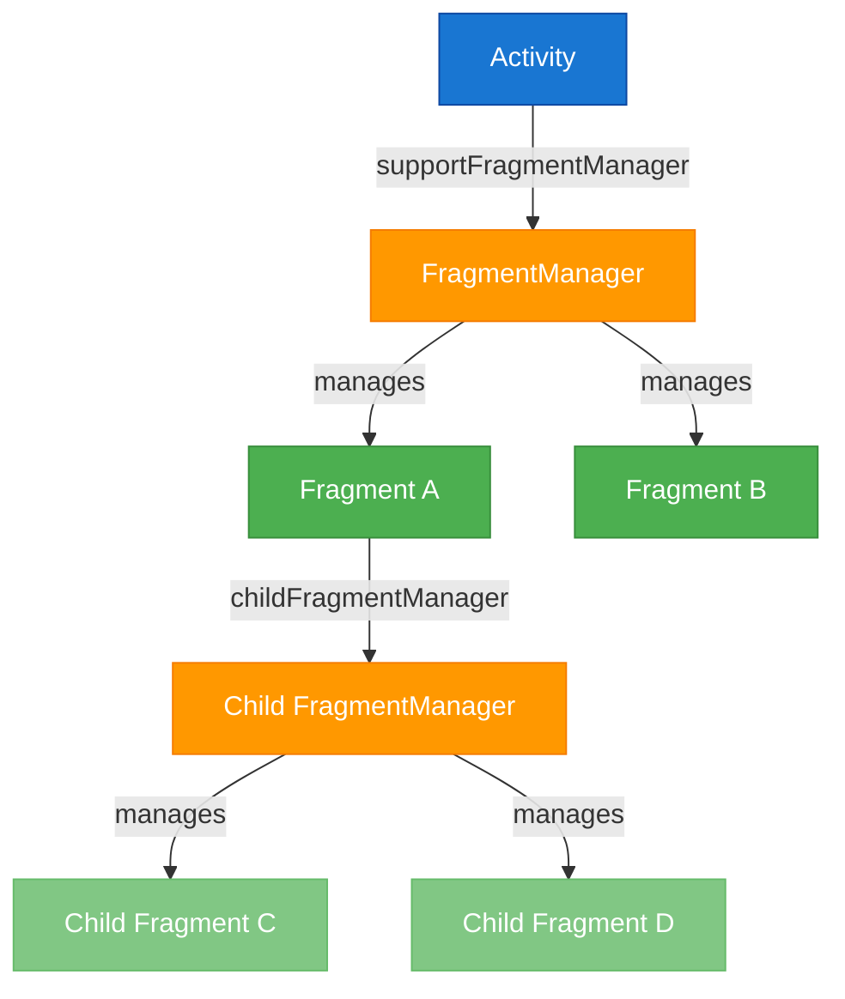
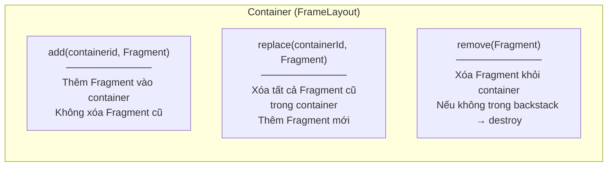
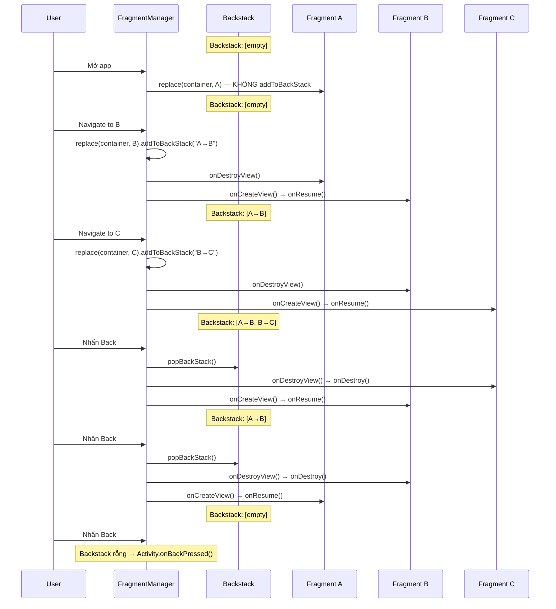
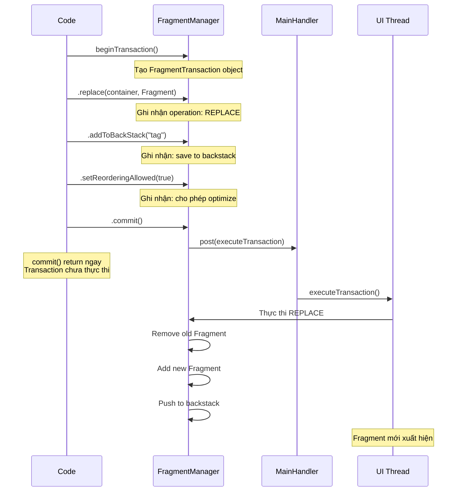

# FragmentManager

## Vấn đề cần giải quyết

Fragment không tự quản lý chính mình. Nó không thể tự thêm vào UI, tự thay thế Fragment khác, hay tự quay lại Fragment trước. Tất cả những thao tác này đều cần một "người quản lý" — đó chính là **FragmentManager**.

Nếu Fragment là nhân viên, FragmentManager là quản lý nhân sự:
- Quyết định Fragment nào được hiển thị
- Quản lý lịch sử điều hướng (backstack)
- Xử lý lifecycle của Fragment
- Điều phối việc lưu/restore state

Hiểu FragmentManager là nền tảng để hiểu tại sao Jetpack Navigation Component hoạt động được — bởi Navigation Component là abstraction layer phía trên FragmentManager.

## FragmentManager — Bản chất

Mỗi `FragmentActivity` (hoặc `AppCompatActivity`) đều có một FragmentManager. Và mỗi Fragment cũng có thể có FragmentManager riêng cho các child fragments.



### supportFragmentManager vs childFragmentManager

| Thuộc tính | `supportFragmentManager` | `childFragmentManager` |
|---|---|---|
| Thuộc về | Activity | Fragment |
| Truy cập từ | `activity.supportFragmentManager` | `fragment.childFragmentManager` |
| Quản lý | Fragment cấp 1 (trực tiếp trong Activity) | Fragment lồng nhau (nested fragment) |
| Backstack | Backstack cấp Activity | Backstack riêng cho Fragment cha |
| Khi nào dùng | Navigate giữa các màn hình chính | ViewPager, BottomNavigation bên trong Fragment, dialog |

> [!WARNING]
> **Sai lầm phổ biến:** Dùng `parentFragmentManager` (hoặc `requireActivity().supportFragmentManager`) để thêm child fragment. Điều này tạo Fragment ở level sai, gây lifecycle không đồng bộ.
> **Quy tắc:** Fragment lồng trong Fragment → luôn dùng `childFragmentManager`.

### parentFragmentManager

Ngoài hai loại trên, Fragment còn có `parentFragmentManager` — đây là FragmentManager đã quản lý Fragment hiện tại:
- Nếu Fragment được add bởi Activity → `parentFragmentManager` = `activity.supportFragmentManager`
- Nếu Fragment được add bởi Fragment khác → `parentFragmentManager` = Fragment cha's `childFragmentManager`

## FragmentTransaction — Thao tác trên Fragment

Mọi thay đổi Fragment đều thông qua **Transaction** — một nhóm thao tác được thực thi nguyên tử (atomic).

### Các operation cơ bản



### add vs replace — Khi nào dùng cái nào?

```kotlin
// add: Fragment cũ VẪN CÒN dưới Fragment mới (stacking)
supportFragmentManager.beginTransaction()
    .add(R.id.container, FragmentB())
    .addToBackStack(null)
    .commit()
// Kết quả: Fragment A + Fragment B cùng tồn tại trong container
// Fragment A vẫn STARTED (nếu B không full-screen thì A vẫn visible)

// replace: Fragment cũ BỊ XÓA, Fragment mới thay thế
supportFragmentManager.beginTransaction()
    .replace(R.id.container, FragmentB())
    .addToBackStack(null)
    .commit()
// Kết quả: Fragment A bị remove, chỉ Fragment B trong container
// Fragment A.onDestroyView() được gọi (nếu trong backstack, instance vẫn sống)
```

| Đặc điểm | `add` | `replace` |
|---|---|---|
| Fragment cũ | Vẫn sống trong container | Bị remove khỏi container |
| Memory | Tốn hơn (nhiều Fragment tồn tại) | Tiết kiệm hơn |
| Lifecycle Fragment cũ | Không thay đổi | `onDestroyView` (backstack) hoặc `onDestroy` |
| Use case | Overlay, multi-pane | Navigation giữa các màn hình |
| Thực tế | Ít dùng cho navigation | **Phổ biến nhất cho navigation** |

> [!TIP]
> **Quy tắc thực tế:** Trong 95% trường hợp navigation, dùng `replace` + `addToBackStack`. Dùng `add` chỉ khi bạn cần multiple Fragment visible đồng thời (ví dụ: multi-pane layout trên tablet).

## Backstack — Lịch sử điều hướng

Backstack là ngăn xếp (stack) lưu trữ lịch sử các FragmentTransaction. Khi user nhấn Back, transaction gần nhất được **đảo ngược** (pop).

### Mô phỏng luồng Backstack



### addToBackStack — Khi nào cần?

```kotlin
// CÓ addToBackStack: User có thể Back về Fragment trước
supportFragmentManager.beginTransaction()
    .replace(R.id.container, DetailFragment())
    .addToBackStack(null)  // hoặc addToBackStack("detail")
    .commit()

// KHÔNG addToBackStack: Không thể Back về Fragment trước
// Fragment cũ bị DESTROY hoàn toàn
supportFragmentManager.beginTransaction()
    .replace(R.id.container, LoginFragment())
    .commit()
```

**Quy tắc:**
- Navigation giữa các màn hình → `addToBackStack`
- Thay thế vĩnh viễn (login → home, splash → main) → không `addToBackStack`

### popBackStack nâng cao

```kotlin
// Pop 1 entry (tương đương Back button)
supportFragmentManager.popBackStack()

// Pop về một tag cụ thể (bỏ qua các entry ở giữa)
// Ví dụ: Từ Checkout Step 3, quay thẳng về Home
supportFragmentManager.popBackStack("home", 0)

// Pop về tag cụ thể VÀ xóa cả entry đó (inclusive)
supportFragmentManager.popBackStack("checkout", FragmentManager.POP_BACK_STACK_INCLUSIVE)
```

## Commit Strategies — Chọn đúng cách commit

FragmentManager cung cấp nhiều cách commit transaction. Chọn sai sẽ gây crash hoặc mất state.

### commit() — Mặc định, an toàn nhất

```kotlin
supportFragmentManager.beginTransaction()
    .replace(R.id.container, HomeFragment())
    .commit()
```

- **Asynchronous:** Transaction được schedule và thực thi trong lần `Handler.post()` tiếp theo
- **Ném exception** nếu gọi sau `onSaveInstanceState()` (state loss)
- **Dùng khi:** Hầu hết mọi trường hợp

### commitNow() — Đồng bộ, tức thì

```kotlin
supportFragmentManager.beginTransaction()
    .replace(R.id.container, HomeFragment())
    .commitNow()
```

- **Synchronous:** Thực thi ngay lập tức trên main thread
- **Không hỗ trợ** `addToBackStack()` — ném exception nếu dùng
- **Dùng khi:** Cần Fragment sẵn sàng ngay lập tức (ví dụ: test, hoặc cần `findFragmentById` ngay sau commit)

### commitAllowingStateLoss() — Chấp nhận mất state

```kotlin
supportFragmentManager.beginTransaction()
    .replace(R.id.container, HomeFragment())
    .commitAllowingStateLoss()
```

- **Không ném exception** nếu gọi sau `onSaveInstanceState()`
- **Nguy hiểm:** Nếu system kill app sau commit này, transaction có thể bị mất
- **Dùng khi:** Analytics fragment, non-critical UI update mà crash tệ hơn mất state

### Ma trận quyết định

| Câu hỏi | Có | Không |
|---|---|---|
| Cần addToBackStack? | `commit()` | `commit()` hoặc `commitNow()` |
| Cần Fragment tức thì? | `commitNow()` | `commit()` |
| Gọi sau onSaveInstanceState? | `commitAllowingStateLoss()` | `commit()` |
| Transaction quan trọng? | `commit()` | `commitAllowingStateLoss()` |

> [!CAUTION]
> **IllegalStateException: Can not perform this action after onSaveInstanceState**
> Đây là crash phổ biến nhất liên quan FragmentManager. Xảy ra khi bạn gọi `commit()` sau khi Activity đã gọi `onSaveInstanceState()` (ví dụ: trong callback từ network request trả về khi app ở background).
> **Fix:** Kiểm tra `isStateSaved` trước khi commit, hoặc dùng `commitAllowingStateLoss()` cho non-critical updates. Tốt nhất: dùng `Lifecycle.State` để đảm bảo chỉ commit khi STARTED/RESUMED.

## setReorderingAllowed(true) — Tối ưu Transaction

```kotlin
supportFragmentManager.beginTransaction()
    .setReorderingAllowed(true)  // Luôn thêm dòng này
    .replace(R.id.container, DetailFragment())
    .addToBackStack(null)
    .commit()
```

`setReorderingAllowed(true)` cho phép FragmentManager **tối ưu hóa** các transaction liên tiếp:
- Gộp nhiều transaction thành một
- Tránh intermediate states (Fragment xuất hiện rồi biến mất trong 1 frame)
- **Bắt buộc** khi dùng Fragment Transitions (animation)
- Google khuyến nghị **luôn bật** flag này

## Triển khai thực tế — Navigation thủ công chuẩn

```kotlin
class MainActivity : AppCompatActivity() {

    override fun onCreate(savedInstanceState: Bundle?) {
        super.onCreate(savedInstanceState)
        setContentView(R.layout.activity_main)

        // Chỉ thêm Fragment ban đầu khi lần đầu tạo
        if (savedInstanceState == null) {
            supportFragmentManager.beginTransaction()
                .setReorderingAllowed(true)
                .add(R.id.nav_container, HomeFragment(), "home")
                .commit()
        }
    }

    // Helper function navigate
    fun navigateTo(fragment: Fragment, tag: String) {
        supportFragmentManager.beginTransaction()
            .setReorderingAllowed(true)
            .replace(R.id.nav_container, fragment, tag)
            .addToBackStack(tag)
            .commit()
    }
}
```

```kotlin
// Trong Fragment — navigate sang màn hình khác
class HomeFragment : Fragment(R.layout.fragment_home) {

    override fun onViewCreated(view: View, savedInstanceState: Bundle?) {
        super.onViewCreated(view, savedInstanceState)
        
        binding.btnProductDetail.setOnClickListener {
            val detailFragment = ProductDetailFragment.newInstance("SKU-12345")
            (requireActivity() as MainActivity).navigateTo(detailFragment, "product-detail")
        }
    }
}
```

### Mô phỏng: Transaction Flow



## findFragmentById / findFragmentByTag

```kotlin
// Tìm Fragment đang hiển thị trong container
val currentFragment = supportFragmentManager.findFragmentById(R.id.nav_container)

// Tìm Fragment theo tag
val homeFragment = supportFragmentManager.findFragmentByTag("home") as? HomeFragment

// Kiểm tra Fragment đã tồn tại chưa trước khi add
if (supportFragmentManager.findFragmentByTag("dialog") == null) {
    MyDialogFragment().show(supportFragmentManager, "dialog")
}
```

> [!TIP]
> **Dùng tag cho Fragment:** Khi add/replace Fragment, truyền thêm `tag` parameter. Điều này giúp bạn tìm lại Fragment sau này mà không cần giữ reference (tránh memory leak).

## Trade-offs & Pitfalls

> [!CAUTION]
> **Fragment overlapping sau Configuration Change:**
> Nếu bạn **không kiểm tra** `savedInstanceState == null` trước khi add Fragment ban đầu, mỗi lần xoay màn hình sẽ add thêm một Fragment mới **chồng lên** Fragment đã được system restore. Kết quả: UI bị chồng, click events bị ảnh hưởng.
> **Fix:** Luôn wrap initial fragment add trong `if (savedInstanceState == null)`.

> [!WARNING]
> **executePendingTransactions() blocking UI:**
> Gọi `executePendingTransactions()` buộc tất cả pending transactions thực thi đồng bộ trên main thread. Nếu có nhiều transaction phức tạp, UI sẽ bị jank.
> **Fix:** Chỉ dùng khi thực sự cần Fragment sẵn sàng ngay (testing). Trong production, để `commit()` async tự nhiên.

> [!TIP]
> **Jetpack Navigation thay thế manual FragmentManager:**
> Trong project thực tế, bạn hiếm khi cần gọi `beginTransaction()` trực tiếp. Jetpack Navigation Component xử lý tất cả: transaction, backstack, animation, SafeArgs. Hiểu FragmentManager giúp bạn debug khi Navigation gặp vấn đề, nhưng không nên dùng trực tiếp cho navigation.

## Nguồn tham khảo

- [FragmentManager - Android Developers](https://developer.android.com/guide/fragments/fragmentmanager)
- [Fragment Transactions - Android Developers](https://developer.android.com/guide/fragments/transactions)
- [Fragment Back Stack - Android Developers](https://developer.android.com/guide/fragments/navigate)
- [setReorderingAllowed - Android Reference](https://developer.android.com/reference/androidx/fragment/app/FragmentTransaction#setReorderingAllowed(boolean))
