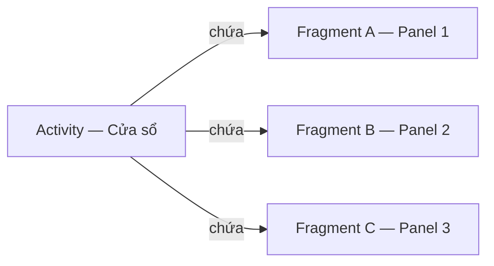
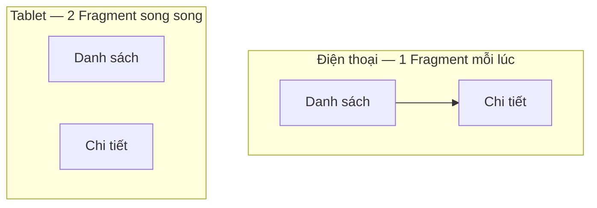
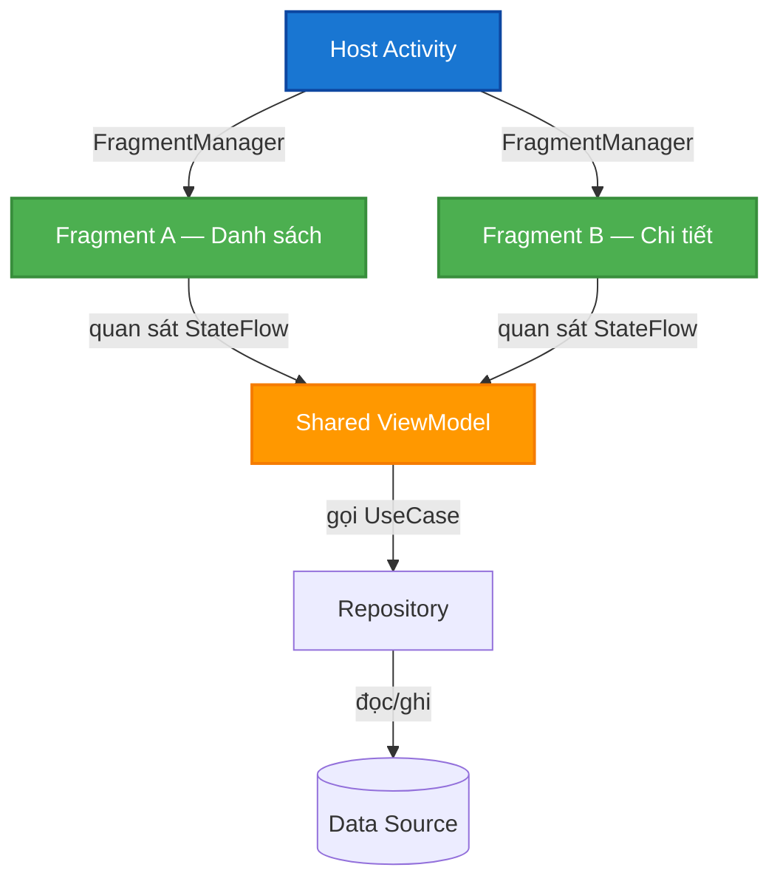
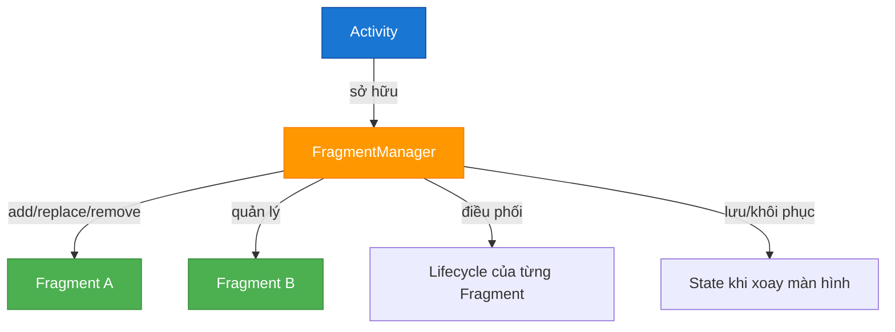
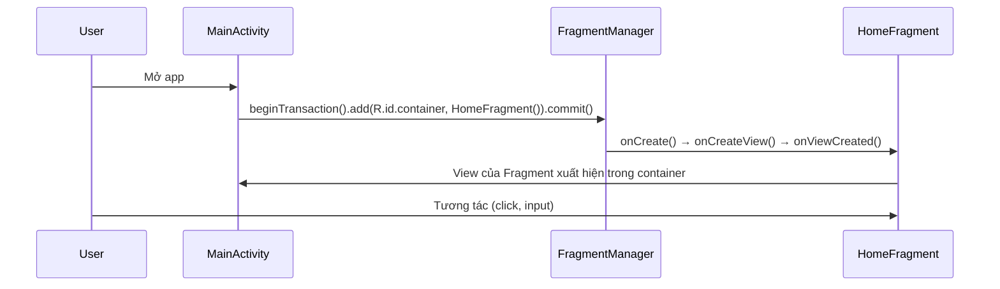
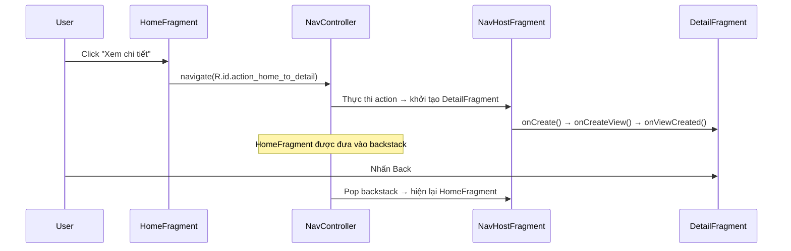
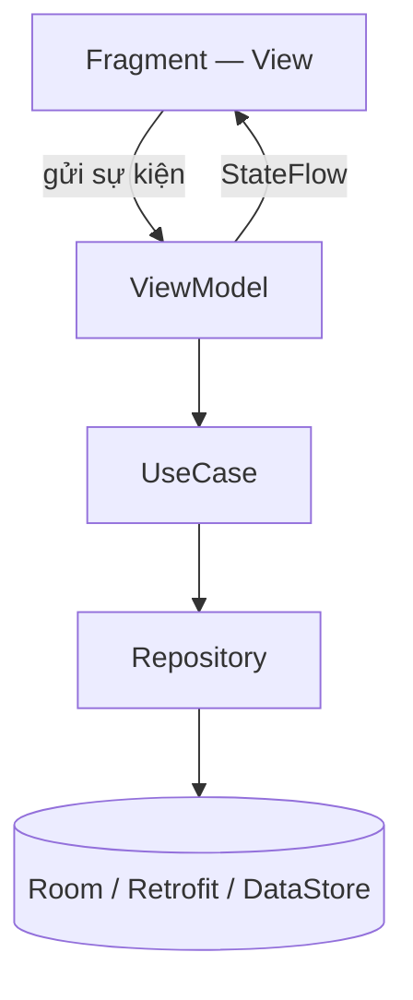

# Fragment Overview

## Vấn đề cần giải quyết

Bạn đang xây dựng một ứng dụng Android theo mô hình **Single Activity + nhiều Fragment**. Câu hỏi đầu tiên gần như luôn là:

> "Fragment là gì, và vì sao tôi phải chia màn hình ra thành từng Fragment thay vì tạo nhiều Activity?"

Ngay sau đó là một loạt câu hỏi khó hơn:

- Trách nhiệm của Activity và Fragment khác nhau thế nào?
- Làm sao để thêm Fragment vào màn hình, điều hướng qua lại giữa chúng?
- Fragment kết hợp với ViewModel, ViewBinding trong MVVM ra sao cho chuẩn?
- Khi nào dùng `FragmentManager` thủ công, khi nào dùng Jetpack Navigation?

Nếu không hiểu bản chất, bạn sẽ nhồi logic vào Fragment, quản lý chuyển trang thủ công lộn xộn, và app dễ crash khi xoay màn hình hoặc rò rỉ bộ nhớ.

## Sau khi học xong

- Giải thích được bản chất Fragment là gì và vì sao nó là đơn vị màn hình trong Single-Activity Architecture.
- Phân biệt được trách nhiệm giữa Activity (khung chứa) và Fragment (UI module).
- Triển khai được Fragment với ViewBinding đúng chuẩn, không gây memory leak.
- Biết khi nào dùng FragmentManager thủ công và khi nào dùng Jetpack Navigation Component.
- Nhận diện được các lỗi phổ biến khi quản lý Fragment trong project thực tế.

## Fragment là gì?

**Fragment** là một khối UI và logic độc lập, có **vòng đời riêng**, được "nhúng" (host) vào bên trong một `Activity` (hoặc một Fragment khác).

Một cách hình dung trực quan:

> Nếu Activity là một **cái cửa sổ** (Window), thì Fragment là những **tấm panel** có thể tháo lắp, ghép vào cửa sổ đó. Bạn có thể thay panel này bằng panel khác mà không cần đóng cửa sổ.



Ba đặc điểm cốt lõi:

- **Không thể sống độc lập:** Fragment bắt buộc phải nằm trong một Activity/Fragment khác. Nó không có entry point như Activity.
- **Có vòng đời riêng:** Fragment sở hữu vòng đời riêng, được hệ thống điều phối theo vòng đời của Activity host, và phức tạp hơn Activity vì còn tách riêng vòng đời của View.
- **Có thể tái sử dụng:** Cùng một Fragment có thể được dùng ở nhiều Activity, hoặc hiển thị nhiều lần trong một màn hình (multi-pane trên tablet).

> [!NOTE]
> **Cách hiểu đúng nhất:** Fragment không phải là một "màn hình" độc lập. Nó là một **đơn vị UI có vòng đời, được host trong Activity**. Trong kiến trúc hiện đại, mỗi màn hình của app là một Fragment, và Activity chỉ là khung chứa duy nhất.

## Vì sao Fragment tồn tại?

### 1. Giải quyết bài toán màn hình lớn (Tablet, Foldable)

Fragment ra đời từ Android 3.0 (Honeycomb) để xử lý UI trên tablet. Một màn hình tablet có thể hiển thị song song **Danh sách (trái)** và **Chi tiết (phải)**. Với Activity, bạn phải viết 2 Activity riêng cho 2 trường hợp (phone vs tablet). Với Fragment, bạn chỉ cần 2 Fragment dùng chung, và ghép chúng lại trên tablet.



### 2. Là nền tảng của Single-Activity Architecture

Việc tạo một Activity rất đắt đỏ (Window riêng, khởi tạo hệ thống). Chuyển đổi giữa các Fragment thì nhẹ và mượt hơn nhiều. Google khuyến nghị các app hiện đại chỉ dùng **1 Activity duy nhất** làm container, mọi màn hình là Fragment.

### 3. Quản lý vòng đời và điều hướng có hệ thống

Fragment được quản lý bởi `FragmentManager`, giúp hệ thống xử lý tự động việc tạo/hủy UI, lưu/khôi phục trạng thái khi xoay màn hình, và quản lý backstack khi điều hướng.

## Phân biệt trách nhiệm Activity và Fragment

| Tiêu chí | Activity | Fragment |
|---|---|---|
| Vai trò | **Khung chứa** (container) cấu hình toàn cục | **UI module** của từng màn hình/tính năng |
| Entry point | Có — được khai báo trong Manifest | Không — phải được host |
| Vòng đời | 1 vòng đời duy nhất | 2 vòng đời (Fragment + View) |
| Điều hướng | Qua `Intent`, quản lý bởi Task/Back Stack | Qua `FragmentManager`/Navigation, backstack riêng |
| Tái sử dụng | Khó | Dễ — dùng lại ở nhiều nơi |
| Trong Single-Activity | Chỉ 1 cái duy nhất | Nhiều cái — mỗi màn hình một Fragment |

> [!TIP]
> **Nguyên tắc thực chiến:** Activity càng **mỏng** càng tốt — chỉ cấu hình Theme, Window insets, xử lý back chung. Toàn bộ giao diện và logic của từng màn hình nằm trong Fragment + ViewModel.

## Khi nào nên dùng, khi nào không?

### Nên dùng Fragment

- Xây app theo **Single-Activity Architecture** — gần như mọi app UI hiện đại.
- Giao diện cần điều hướng: **Bottom Navigation**, **ViewPager/Tabs**, **Navigation Drawer**.
- Cần **tái sử dụng UI** giữa nhiều màn hình hoặc giữa phone/tablet (adaptive layout).
- Cần màn hình con có vòng đời riêng như dialog, bottom sheet (`DialogFragment`, `BottomSheetDialogFragment`).

### Không nên lạm dụng Fragment

- App viết hoàn toàn bằng **Jetpack Compose** — đã có `@Composable` thay thế, không cần Fragment.
- Màn hình quá đơn giản, không tái sử dụng, không cần quản lý lifecycle riêng.
- Fragment **quá lớn** (hàng ngàn dòng) — khi đó cần tách thành nhiều Fragment nhỏ hơn, không phải nhồi thêm.

### Giải pháp thay thế

| Nhu cầu | Lựa chọn |
|---|---|
| UI theo dữ liệu, ít lifecycle, hiện đại | Jetpack Compose |
| Màn hình độc lập, gọi từ app khác | Activity + Intent |
| Chỉ cần 1 khối UI nhỏ, không điều hướng | `View` / custom view |
| Điều hướng nhiều màn hình, cần backstack | Fragment + Navigation Component |

## Fragment trong kiến trúc MVVM

Trong kiến trúc MVVM / Clean Architecture, Fragment nằm ở **Presentation Layer**, đóng vai trò là **View**:

- **Fragment:** render UI, gửi sự kiện người dùng lên ViewModel, quan sát `StateFlow`/`LiveData`.
- **ViewModel:** giữ trạng thái và logic UI, **sống sót qua xoay màn hình**.
- **Shared ViewModel (scoped theo Activity):** chia sẻ dữ liệu giữa các Fragment mà không cần truyền qua Bundle phức tạp.



## Cách hoạt động bên trong: Ai quản lý Fragment?

Fragment không tự quản lý chính mình. Mọi việc thêm, thay thế, remove, xử lý lifecycle và backstack đều do **FragmentManager** đảm nhiệm.



Khi bạn gọi `supportFragmentManager.beginTransaction()...commit()` (hoặc Navigation Component làm giùm), FragmentManager sẽ:

1. Khởi tạo Fragment instance.
2. Gọi lifecycle callbacks theo thứ tự (`onCreate` → `onCreateView` → `onViewCreated` → ...).
3. Nhúng View của Fragment vào container trong Activity.
4. Lưu trạng thái vào backstack nếu bạn yêu cầu.

> [!TIP]
> **Jetpack Navigation Component là abstraction trên FragmentManager.** Nó tự động quản lý transaction, backstack, truyền argument (SafeArgs) và animation. Hiểu FragmentManager giúp bạn hiểu vì sao Navigation hoạt động được.

## Triển khai thực chiến

Có hai cách dùng Fragment trong project thực tế. Hãy đi từ **FragmentManager** để hiểu bản chất, rồi chuyển sang **Jetpack Navigation** — chuẩn production.

### Con đường 1: FragmentManager — hiểu bản chất

#### Bước 1: Chuẩn bị container trong Activity

`activity_main.xml` chỉ cần một thẻ `FragmentContainerView` trống làm chỗ chứa:

```xml
<?xml version="1.0" encoding="utf-8"?>
<androidx.fragment.app.FragmentContainerView xmlns:android="http://schemas.android.com/apk/res/android"
    android:id="@+id/fragment_container"
    android:layout_width="match_parent"
    android:layout_height="match_parent" />
```

#### Bước 2: Tạo Fragment với ViewBinding

Khác với Activity (`setContentView` trong `onCreate`), Fragment vẽ UI ở `onCreateView` và bind logic ở `onViewCreated`:

```kotlin
class HomeFragment : Fragment(R.layout.fragment_home) {

    private var _binding: FragmentHomeBinding? = null
    private val binding get() = _binding!!

    override fun onViewCreated(view: View, savedInstanceState: Bundle?) {
        super.onViewCreated(view, savedInstanceState)
        _binding = FragmentHomeBinding.bind(view)

        binding.tvTitle.text = "Màn hình Home"
        binding.btnNext.setOnClickListener {
            // Điều hướng sang màn hình khác
        }
    }

    override fun onDestroyView() {
        super.onDestroyView()
        _binding = null // Bắt buộc để tránh memory leak
    }
}
```

#### Bước 3: Nhúng Fragment bằng transaction

```kotlin
class MainActivity : AppCompatActivity() {
    override fun onCreate(savedInstanceState: Bundle?) {
        super.onCreate(savedInstanceState)
        setContentView(R.layout.activity_main)

        // Chỉ thêm khi savedInstanceState == null để tránh thêm đè khi xoay màn hình
        if (savedInstanceState == null) {
            supportFragmentManager.beginTransaction()
                .setReorderingAllowed(true)
                .add(R.id.fragment_container, HomeFragment())
                .commit()
        }
    }
}
```

#### Mô phỏng luồng nhúng Fragment



### Con đường 2: Jetpack Navigation — chuẩn production

#### Bước 1: Khai báo dependency trong `build.gradle.kts`

```kotlin
dependencies {
    implementation("androidx.navigation:navigation-fragment-ktx:2.8.9")
    implementation("androidx.navigation:navigation-ui-ktx:2.8.9")
}
```

#### Bước 2: Tạo `nav_graph.xml` — bản đồ các màn hình

Mỗi màn hình là một `<fragment>` trong graph, liên kết với nhau bằng `<action>`:

```xml
<navigation xmlns:android="http://schemas.android.com/apk/res/android"
    xmlns:app="http://schemas.android.com/apk/res-auto"
    android:id="@+id/nav_graph"
    app:startDestination="@id/homeFragment">

    <fragment
        android:id="@+id/homeFragment"
        android:name="com.example.shop.ui.home.HomeFragment"
        android:label="Trang chủ">

        <action
            android:id="@+id/action_home_to_detail"
            app:destination="@id/detailFragment" />
    </fragment>

    <fragment
        android:id="@+id/detailFragment"
        android:name="com.example.shop.ui.detail.DetailFragment"
        android:label="Chi tiết" />
</navigation>
```

#### Bước 3: Gắn NavHostFragment vào Activity

```xml
<androidx.fragment.app.FragmentContainerView
    xmlns:android="http://schemas.android.com/apk/res/android"
    xmlns:app="http://schemas.android.com/apk/res-auto"
    android:id="@+id/nav_host_fragment"
    android:name="androidx.navigation.fragment.NavHostFragment"
    android:layout_width="match_parent"
    android:layout_height="match_parent"
    app:defaultNavHost="true"
    app:navGraph="@navigation/nav_graph" />
```

#### Bước 4: Điều hướng từ Fragment

```kotlin
class HomeFragment : Fragment(R.layout.fragment_home) {

    override fun onViewCreated(view: View, savedInstanceState: Bundle?) {
        super.onViewCreated(view, savedInstanceState)
        _binding = FragmentHomeBinding.bind(view)

        binding.btnNext.setOnClickListener {
            // Navigation tự lo transaction + backstack + animation
            findNavController().navigate(R.id.action_home_to_detail)
        }
    }
}
```

#### Mô phỏng luồng điều hướng với Navigation



## Trade-offs

### FragmentManager vs Jetpack Navigation

| Tiêu chí | FragmentManager | Jetpack Navigation |
|---|---|---|
| Độ phức tạp | Thủ công từng transaction | Khai báo bằng XML, tự động |
| Backstack | Tự quản lý, dễ sai | Tự động, an toàn |
| Truyền dữ liệu | `arguments` thủ công | **SafeArgs** — kiểm tra kiểu lúc compile |
| Animation chuyển cảnh | Tự viết | Khai báo trong graph |
| Dùng khi nào | Hiểu bản chất, trường hợp đặc biệt | **Mặc định cho app thực tế** |

### Fragment vs Compose

| Tiêu chí | Fragment + View | Jetpack Compose |
|---|---|---|
| UI khai báo | XML | Kotlin `@Composable` |
| Đường cong học | Dài, nhiều khái niệm cũ | Hiện đại, ít boilerplate |
| Tái sử dụng | Tốt, đã kiểm chứng nhiều năm | Tốt, đang là tương lai |
| Dùng khi nào | Codebase hiện có, cần View-based libs | App mới, ưu tiên hiện đại |

## Sai lầm thường gặp

> [!WARNING]
> **ViewBinding Memory Leak:**
> Vòng đời View của Fragment có thể bị hủy và tạo lại (đưa vào backstack, xoay màn hình) trong khi instance Fragment vẫn sống.
> **Hậu quả:** Không gán `_binding = null` trong `onDestroyView()` → GC không dọn được View cũ, rò rỉ bộ nhớ.
> **Giải pháp:** Luôn gán `_binding = null` trong `onDestroyView()`, và gán `binding.recyclerView.adapter = null` khi có RecyclerView.

> [!CAUTION]
> **Truyền dữ liệu bằng Constructor thay vì Arguments:**
> `HomeFragment(val id: Int)` sẽ **crash** khi hệ điều hành tự khôi phục Fragment (sau khi process bị kill hoặc xoay màn hình) vì nó gọi constructor rỗng.
> **Giải pháp:** Truyền dữ liệu qua `Bundle` (arguments) hoặc dùng **SafeArgs** (Navigation) hoặc **Shared ViewModel**.

> [!CAUTION]
> **Thêm đè Fragment khi xoay màn hình:**
> Nếu gọi `beginTransaction().add(...)` không kiểm tra `savedInstanceState`, mỗi lần xoay màn hình sẽ thêm một bản Fragment chồng lên nhau.
> **Giải pháp:** Chỉ add khi `savedInstanceState == null`, hoặc dùng Navigation Component (đã xử lý sẵn).

> [!WARNING]
> **Nhồi logic vào Fragment (Fat Fragment):**
> Để toàn bộ logic (gọi API, lưu DB, validate) trong Fragment.
> **Hậu quả:** Khó test, dễ crash khi xoay màn hình.
> **Giải pháp:** Đẩy logic xuống ViewModel/Repository. Fragment chỉ nhận State và render.

## Tư duy hệ thống

Trong một dự án Clean Architecture, Fragment chỉ là một lớp mỏng ở Presentation Layer:



**Nguyên tắc phụ thuộc:** dữ liệu chảy một chiều `Data → ViewModel → Fragment`. Fragment **không bao giờ** gọi thẳng Repository hay API. Nhờ đó:

- ViewModel test được độc lập, không cần Fragment.
- Thay toàn bộ UI (View → Compose) mà không đụng logic.
- Fragment luôn mỏng, dễ bảo trì.

## Học tiếp gì?

Fragment Overview là điểm vào của module Fragment. Để làm chủ, hãy học theo thứ tự:

1. **Fragment Lifecycle** — nền tảng bắt buộc: phân biệt Fragment Lifecycle và View Lifecycle, dùng đúng `viewLifecycleOwner`.
2. **Fragment State Changes** — giữ trạng thái qua xoay màn hình, `onSaveInstanceState`, `SavedStateHandle`.
3. **FragmentManager** — hiểu sâu transaction, add/replace/remove, backstack, commit strategy.
4. **Dialog and DialogFragment** — màn hình dialog/bottom sheet có vòng đời riêng.

## Nguồn tham khảo

- [Fragments - Android Developers](https://developer.android.com/guide/fragments)
- [Create a fragment - Android Developers](https://developer.android.com/guide/fragments/create)
- [Get started with Jetpack Navigation - Android Developers](https://developer.android.com/guide/navigation/get-started)
- [Guide to App Architecture - Android Developers](https://developer.android.com/topic/architecture)
