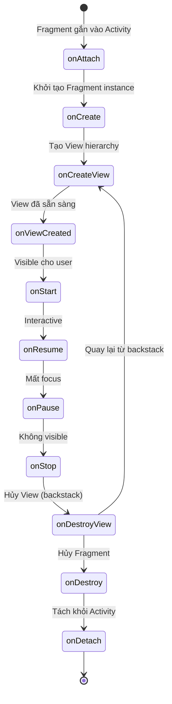
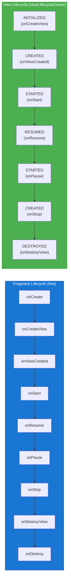
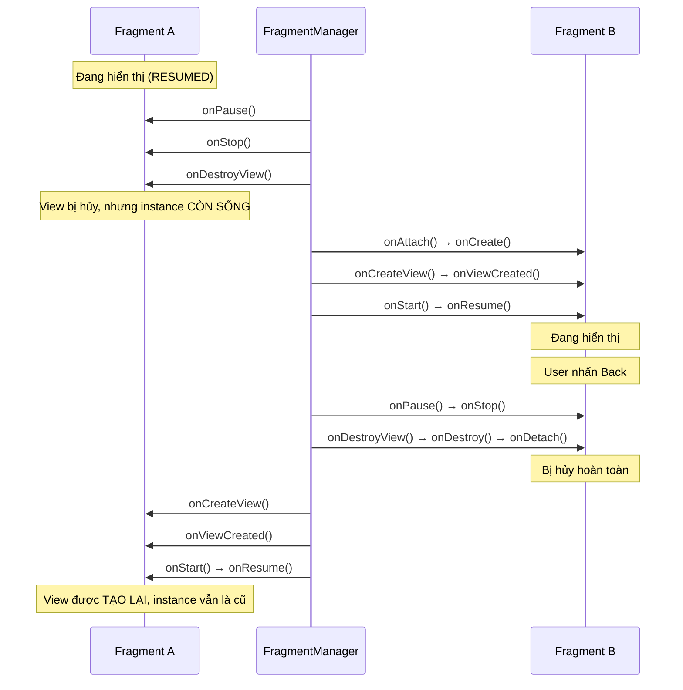
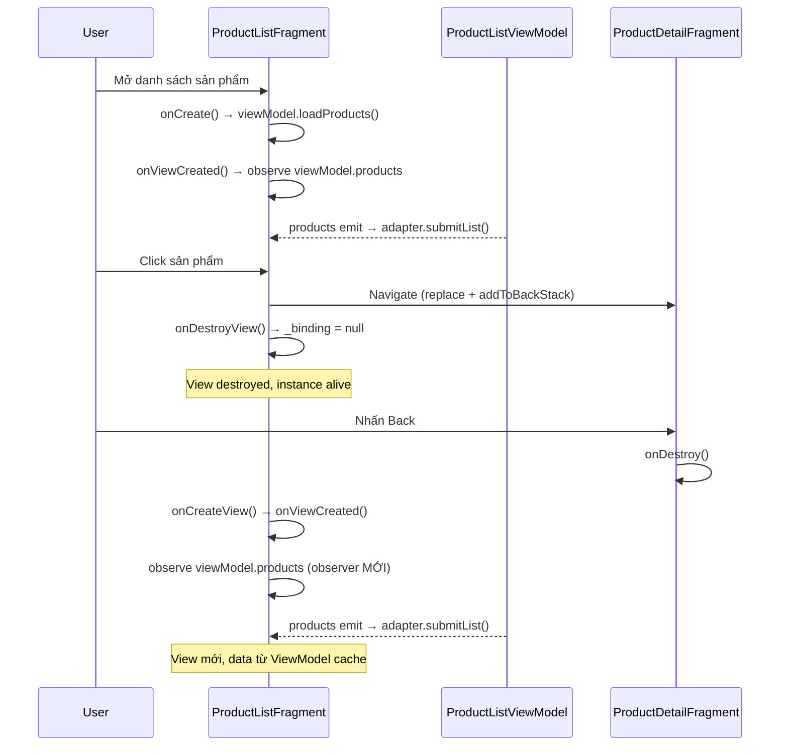
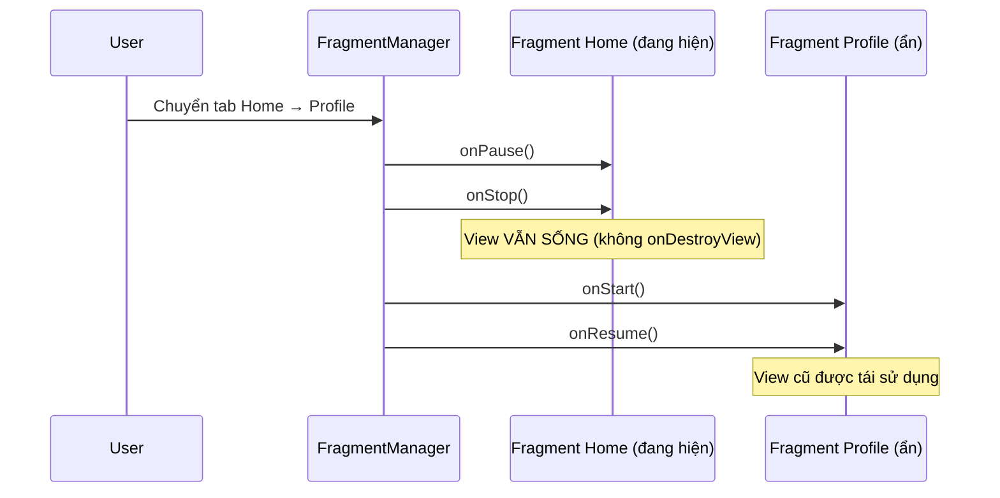

# Fragment Lifecycle

## Vấn đề cần giải quyết

Activity có **một vòng đời duy nhất**: từ `onCreate` đến `onDestroy`. Khi Activity bị destroy, toàn bộ UI đi theo.

Fragment thì khác. Fragment **tách biệt sự tồn tại của chính nó** (Fragment instance) và **sự tồn tại của giao diện** (View). Đây là điểm khác biệt cốt lõi tạo ra phần lớn bug và memory leak trong Android development.

Tình huống điển hình:
- Bạn mở Fragment A → navigate sang Fragment B → Fragment A bị đưa vào **backstack**
- **View của Fragment A bị destroy** (để giải phóng bộ nhớ), nhưng **Fragment A instance vẫn sống** trong backstack
- Khi nhấn Back, Fragment A được khôi phục → View được tạo lại, nhưng Fragment instance vẫn là cái cũ

Nếu không hiểu cơ chế này, bạn sẽ:
- Observe LiveData bằng `this` → duplicate observer mỗi lần quay lại
- Truy cập `binding` sau `onDestroyView` → crash
- Không cleanup resource → memory leak

## Fragment Lifecycle Callbacks — Toàn cảnh

Fragment có nhiều callback hơn Activity vì phải xử lý thêm quá trình tạo/hủy View riêng biệt.



### Ý nghĩa từng Callback

| Callback | Khi nào được gọi | Nên làm gì |
|---|---|---|
| `onAttach(context)` | Fragment gắn vào Activity/parent | Lấy reference đến Activity nếu cần (hiếm khi dùng) |
| `onCreate(savedInstanceState)` | Khởi tạo Fragment instance | Khởi tạo ViewModel, nhận arguments, restore saved state |
| `onCreateView(inflater, container, savedInstanceState)` | Tạo View hierarchy | Inflate layout (hoặc truyền layout qua constructor) |
| `onViewCreated(view, savedInstanceState)` | View đã được tạo xong | **Callback quan trọng nhất**: Bind data, setup listeners, observe LiveData/Flow |
| `onStart()` | Fragment visible | Hiếm khi cần override |
| `onResume()` | Fragment interactive (có focus) | Bắt đầu animation, camera, sensor |
| `onPause()` | Mất focus (dialog overlay...) | Tạm dừng animation, camera |
| `onStop()` | Không còn visible | Dừng heavy operations |
| `onDestroyView()` | View bị hủy (backstack hoặc remove) | **Bắt buộc**: Cleanup binding, adapter references |
| `onDestroy()` | Fragment instance bị hủy | Cleanup final resources |
| `onDetach()` | Tách khỏi Activity | Hiếm khi cần override |

> [!TIP]
> **Quy tắc 80/20:** Trong thực tế, bạn chỉ cần override 3 callbacks: `onCreate` (ViewModel), `onViewCreated` (UI logic), và `onDestroyView` (cleanup binding). Các callback còn lại rất hiếm khi cần.

## View Lifecycle — Điểm khác biệt cốt lõi

Đây là khái niệm **không tồn tại trong Activity** và là nguồn gốc của phần lớn bug Fragment.

### Hai Lifecycle trong một Fragment



**Fragment Lifecycle (`this`):** Kéo dài từ `onAttach` đến `onDetach`. Fragment instance tồn tại trong bộ nhớ suốt khoảng này.

**View Lifecycle (`viewLifecycleOwner`):** Chỉ tồn tại từ `onCreateView` đến `onDestroyView`. Mỗi lần Fragment quay lại từ backstack, một View Lifecycle mới được tạo, nhưng Fragment Lifecycle không thay đổi.

### Tại sao cần phân biệt?

Khi bạn observe LiveData hoặc collect Flow, bạn cần chọn đúng LifecycleOwner:

```kotlin
// ❌ SAI — Dùng Fragment lifecycle (this)
// Observer KHÔNG bị remove khi view bị destroy (backstack)
// → Mỗi lần quay lại, thêm 1 observer mới → duplicate updates
viewModel.users.observe(this) { users ->
    binding.recyclerView.adapter = UsersAdapter(users)
}

// ✅ ĐÚNG — Dùng View lifecycle (viewLifecycleOwner)
// Observer tự động bị remove khi view destroy
// → Quay lại từ backstack, observer mới được tạo, không duplicate
viewModel.users.observe(viewLifecycleOwner) { users ->
    binding.recyclerView.adapter = UsersAdapter(users)
}
```

Tương tự cho Flow:

```kotlin
// ✅ ĐÚNG — collect trong viewLifecycleOwner scope
viewLifecycleOwner.lifecycleScope.launch {
    viewLifecycleOwner.repeatOnLifecycle(Lifecycle.State.STARTED) {
        viewModel.uiState.collect { state ->
            updateUI(state)
        }
    }
}
```

> [!WARNING]
> **Quy tắc vàng:** Bất kỳ operation nào liên quan đến **View** (observe, bind, click listener, adapter) đều phải dùng `viewLifecycleOwner`. Chỉ dùng `this` (Fragment lifecycle) cho những thứ không liên quan đến View (ví dụ: log analytics event).

## Lifecycle khi Fragment trong Backstack

Khi Fragment bị đưa vào backstack (ví dụ: navigate từ A sang B bằng `replace` + `addToBackStack`), chuỗi callback xảy ra khác với khi Fragment bị remove hoàn toàn.



**Điểm mấu chốt:**
- Fragment A chỉ gọi đến `onDestroyView` (không gọi `onDestroy`, `onDetach`)
- Khi quay lại, Fragment A **không gọi** `onAttach`, `onCreate` (vì instance vẫn sống)
- Fragment A gọi lại `onCreateView` → `onViewCreated` (View mới hoàn toàn)
- `savedInstanceState` trong `onViewCreated` là `null` khi quay lại từ backstack (khác với configuration change)

## Triển khai thực tế — Fragment chuẩn Production

### Pattern hoàn chỉnh

```kotlin
class ProductListFragment : Fragment(R.layout.fragment_product_list) {

    // ViewModel — khởi tạo bằng delegate, tồn tại theo Fragment lifecycle
    private val viewModel: ProductListViewModel by viewModels()

    // ViewBinding — phải nullable vì View lifecycle ngắn hơn Fragment lifecycle
    private var _binding: FragmentProductListBinding? = null
    private val binding get() = _binding!!

    override fun onCreate(savedInstanceState: Bundle?) {
        super.onCreate(savedInstanceState)
        // Chỉ thực hiện 1 lần khi Fragment instance được tạo
        // Không liên quan đến View
        val categoryId = arguments?.getString("category_id")
        viewModel.loadProducts(categoryId)
    }

    override fun onViewCreated(view: View, savedInstanceState: Bundle?) {
        super.onViewCreated(view, savedInstanceState)
        _binding = FragmentProductListBinding.bind(view)

        // Setup UI components
        val adapter = ProductAdapter { product ->
            // Navigate to detail
        }
        binding.recyclerView.adapter = adapter

        // Observe data — PHẢI dùng viewLifecycleOwner
        viewLifecycleOwner.lifecycleScope.launch {
            viewLifecycleOwner.repeatOnLifecycle(Lifecycle.State.STARTED) {
                viewModel.products.collect { products ->
                    adapter.submitList(products)
                }
            }
        }

        viewLifecycleOwner.lifecycleScope.launch {
            viewLifecycleOwner.repeatOnLifecycle(Lifecycle.State.STARTED) {
                viewModel.isLoading.collect { isLoading ->
                    binding.progressBar.isVisible = isLoading
                }
            }
        }
    }

    override fun onDestroyView() {
        // Cleanup TRƯỚC khi gọi super
        // Tránh memory leak từ RecyclerView adapter giữ reference đến views
        binding.recyclerView.adapter = null
        _binding = null
        super.onDestroyView()
    }
}
```

### Mô phỏng luồng: Navigate và Back



## Ứng dụng đa tab / Single-Activity — show/hide giữ View sống

Trong app Single-Activity, Bottom Navigation chứa nhiều tab, mỗi tab là một Fragment. Khi chuyển tab bạn có **hai cách**, và chúng kích hoạt lifecycle **khác nhau hoàn toàn**:

| Hành vi | `replace` | `show` / `hide` |
|---|---|---|
| Fragment cũ nhận callback đến đâu? | `onDestroyView` | `onStop` (dừng ở đó) |
| View cũ | Bị hủy | Giữ nguyên |
| Quay lại tab | `onCreateView` → `onViewCreated` lại từ đầu | Chỉ `onStart` → `onResume` |
| State UI (scroll, input) | Mất → phải lưu/restore | Giữ nguyên |
| Observer trong `viewLifecycleOwner` | Bị remove | Vẫn hoạt động |
| Khi nào dùng | Điều hướng sâu (list → detail) | Bottom nav / tab cố định |



```kotlin
// MainActivity — Single-Activity với Bottom Navigation
class MainActivity : AppCompatActivity() {

    private lateinit var currentTab: Fragment

    override fun onCreate(savedInstanceState: Bundle?) {
        super.onCreate(savedInstanceState)
        setContentView(R.layout.activity_main)

        // System tự restore các Fragment khi quay lại — đừng add lại nếu đã có state
        if (savedInstanceState == null) {
            currentTab = HomeFragment()
            supportFragmentManager.beginTransaction()
                .add(R.id.fragment_container, currentTab, "home")
                .commit()
        }
    }

    // Chuyển tab dùng show/hide để GIỮ View sống
    private fun switchTab(target: Fragment) {
        supportFragmentManager.beginTransaction().apply {
            if (target == currentTab) return
            hide(currentTab)
            if (!target.isAdded) {
                add(R.id.fragment_container, target)
            } else {
                show(target)
            }
        }.commit()
        currentTab = target
    }
}
```

> [!TIP]
> **Vì sao show/hide giữ được state?** Vì `hide()` chỉ đưa Fragment về mức `STARTED`/`STOPPED`, không phải `DESTROYED`. View và instance đều sống → `viewLifecycleOwner` vẫn hoạt động, observer không bị remove, scroll position của RecyclerView được giữ nguyên.

> [!WARNING]
> **Đừng nhầm hai tình huống:**
> - **Điều hướng sâu** (list → detail): dùng `replace` — View cũ nên bị hủy để tiết kiệm bộ nhớ.
> - **Chuyển tab cố định** (Bottom Nav): dùng `show`/`hide` — View nên sống để không load lại data mỗi lần đổi tab.
>
> Dùng sai chiều sẽ gây: `replace` cho tab → app lag + mất state mỗi lần đổi; `show`/`hide` cho điều hướng sâu → nhiều Fragment chồng lên nhau, tốn bộ nhớ.

## So sánh Fragment Lifecycle vs Activity Lifecycle

| Đặc điểm | Activity | Fragment |
|---|---|---|
| Số lượng Lifecycle | 1 | 2 (Fragment + View) |
| LifecycleOwner cho observe | `this` | `viewLifecycleOwner` |
| View có thể bị hủy riêng? | Không | Có (backstack) |
| Callback tạo View | `setContentView` trong `onCreate` | `onCreateView` / `onViewCreated` |
| Cleanup binding | Không cần | **Bắt buộc** trong `onDestroyView` |
| Tồn tại khi view bị hủy? | Không áp dụng | Có (trong backstack) |

## Trade-offs & Pitfalls

> [!CAUTION]
> **Memory Leak — observe bằng `this`:**
> Đây là lỗi phổ biến nhất. Nếu bạn gọi `viewModel.data.observe(this, observer)`, observer **không bị remove** khi view bị destroy (backstack). Mỗi lần `onViewCreated` được gọi lại, bạn thêm thêm một observer mới. Kết quả: UI update nhiều lần, memory leak, và có thể crash.
> **Fix:** Luôn dùng `viewLifecycleOwner`.

> [!WARNING]
> **Truy cập binding sau onDestroyView:**
> Nếu bạn có callback bất đồng bộ (delay, network callback) trả về sau khi view đã bị destroy, `binding` sẽ là `null` (vì bạn đã gán `_binding = null`). Nếu dùng `binding!!` → crash `NullPointerException`.
> **Fix:** Dùng `viewLifecycleOwner.lifecycleScope` — coroutine tự cancel khi view destroy. Hoặc kiểm tra `_binding != null` trước khi truy cập.

> [!WARNING]
> **RecyclerView Adapter leak:**
> RecyclerView giữ strong reference đến Adapter, Adapter giữ reference đến ViewHolder, ViewHolder giữ reference đến View. Nếu không set `recyclerView.adapter = null` trong `onDestroyView`, toàn bộ chuỗi này sẽ không được GC thu hồi khi Fragment trong backstack.
> **Fix:** Gán `binding.recyclerView.adapter = null` trong `onDestroyView()`, **trước** `_binding = null`.

> [!TIP]
> **Khi nào dùng `onCreate` vs `onViewCreated`:**
> - `onCreate`: Logic không liên quan View — khởi tạo ViewModel, parse arguments, setup analytics.
> - `onViewCreated`: Mọi thứ liên quan View — bind data, click listeners, observe LiveData/Flow, setup RecyclerView.
> Quy tắc: Nếu code cần `binding` hoặc `view`, nó thuộc `onViewCreated`.

## Nên học tiếp

Fragment Lifecycle là nền tảng. Hai chủ đề kế tiếp đào sâu vào các khía cạnh bạn cần khi xây app thực tế:

- **[Fragment State Changes](state_changes.md)** — lưu & khôi phục state khi xoay màn hình, Process Death: `arguments`, ViewModel, `SavedStateHandle`. Đây là phần bạn cần sau khi nắm rõ lifecycle vì recreate luôn đi kèm lifecycle.
- **[FragmentManager](fragment_manager.md)** — transaction (`add`/`replace`/`remove`), backstack, commit strategy. Nguồn gốc của cách `show`/`hide` ở trên vận hành.

## Nguồn tham khảo

- [Fragment Lifecycle - Android Developers](https://developer.android.com/guide/fragments/lifecycle)
- [Handling Lifecycles with Lifecycle-Aware Components](https://developer.android.com/topic/libraries/architecture/lifecycle)
- [ViewLifecycleOwner - Android Developers](https://developer.android.com/reference/androidx/fragment/app/Fragment#getViewLifecycleOwner())
- [A Deep Dive into Fragment Lifecycle - Google I/O](https://www.youtube.com/watch?v=Q2sH93cQ3YI)
