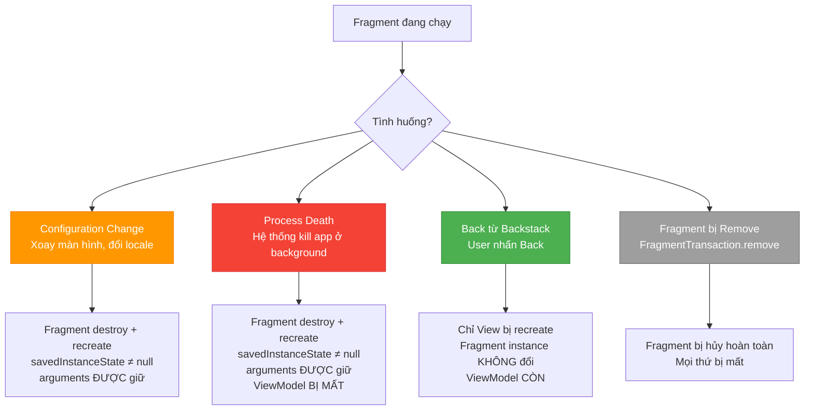
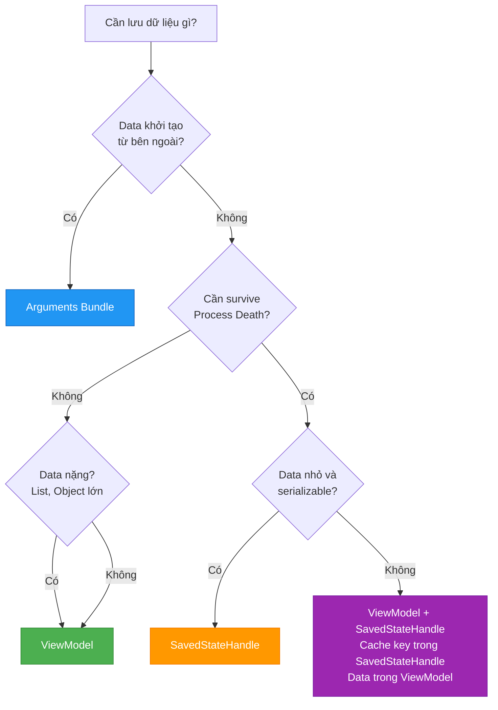
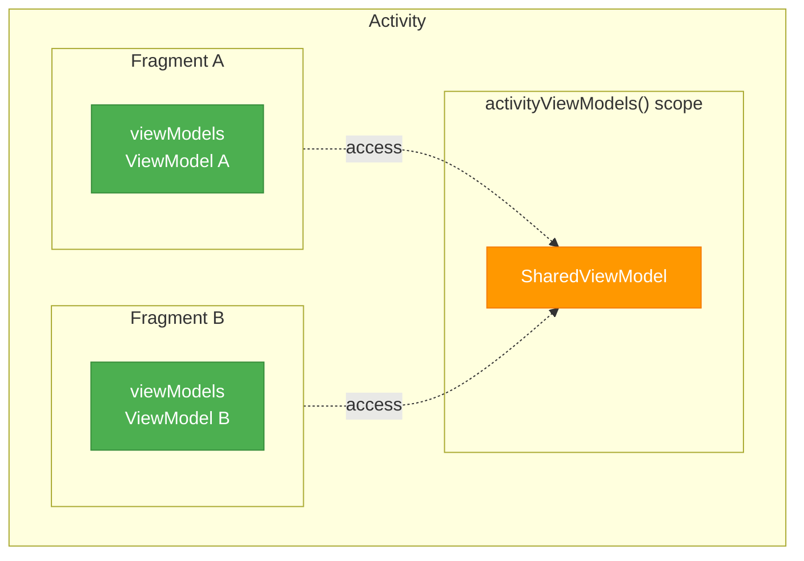

# Fragment State Changes

## Vấn đề cần giải quyết

Fragment thừa hưởng vấn đề Configuration Change từ Activity: **khi xoay màn hình, đổi ngôn ngữ, hoặc thay đổi font size — Fragment bị destroy và tạo lại**.

Nhưng Fragment có thêm những tình huống phức tạp hơn Activity:
- Fragment bị destroy view nhưng instance vẫn sống (backstack)
- Fragment có `arguments` Bundle tồn tại xuyên suốt vòng đời
- Fragment có thể dùng ViewModel scope theo Activity hoặc scope theo chính nó
- `setRetainInstance(true)` từng là giải pháp phổ biến nhưng đã **deprecated**

Nếu không hiểu rõ những cơ chế này, bạn sẽ:
- Mất dữ liệu form khi xoay màn hình
- Gọi network request trùng lặp sau mỗi configuration change
- Crash khi process bị kill vì không lưu state quan trọng

## Sau khi học xong

- Phân biệt được các tình huống Fragment bị recreate và hành vi tương ứng.
- Giải thích được sự khác biệt giữa Arguments, onSaveInstanceState và ViewModel trong Fragment.
- Áp dụng được SavedStateHandle để survive process death.
- Phân biệt được viewModels() vs activityViewModels() và chọn đúng scope.
- Nhận diện được setRetainInstance đã deprecated và giải pháp thay thế.

## Các tình huống Fragment bị Recreate



### Chi tiết từng tình huống

| Tình huống | Fragment instance | View | Arguments | savedInstanceState | ViewModel |
|---|---|---|---|---|---|
| **Configuration Change** | Destroy → New | Destroy → New | ✅ Giữ | ✅ Có data | ✅ Giữ |
| **Process Death** | Destroy → New | Destroy → New | ✅ Giữ | ✅ Có data | ❌ Mất |
| **Back từ Backstack** | Giữ nguyên | Destroy → New | ✅ Giữ | null | ✅ Giữ |
| **Remove** | Destroy | Destroy | Mất | Mất | Mất |

> [!IMPORTANT]
> **Arguments luôn được bảo toàn** qua mọi tình huống recreate (Configuration Change, Process Death). Đây là lý do bạn phải truyền dữ liệu khởi tạo qua `arguments` Bundle thay vì constructor parameter.

## Ba công cụ lưu State

### 1. Arguments (Bundle khởi tạo)

Arguments là Bundle gắn vào Fragment **trước khi** Fragment được add vào FragmentManager. Nó tồn tại xuyên suốt vòng đời Fragment.

```kotlin
// Tạo Fragment với Arguments
val fragment = ProductDetailFragment().apply {
    arguments = Bundle().apply {
        putString("product_id", "SKU-12345")
        putString("source", "search")
    }
}

// Hoặc dùng companion object pattern
class ProductDetailFragment : Fragment(R.layout.fragment_product_detail) {
    
    companion object {
        fun newInstance(productId: String) = ProductDetailFragment().apply {
            arguments = Bundle().apply {
                putString("product_id", productId)
            }
        }
    }
    
    // Đọc arguments — an toàn, tồn tại xuyên recreate
    private val productId: String by lazy {
        requireArguments().getString("product_id")!!
    }
}
```

**Khi nào dùng:** Truyền dữ liệu khởi tạo (ID, filter params, config) khi tạo Fragment. Tương tự Intent extras của Activity.

**Giới hạn:** Chỉ chứa data serializable, giới hạn ~1MB cho toàn bộ transaction buffer.

### 2. ViewModel (In-memory state)

ViewModel tồn tại qua Configuration Change nhưng **mất khi Process Death**.

```kotlin
class ProductDetailFragment : Fragment(R.layout.fragment_product_detail) {

    // Scope theo Fragment — mỗi instance Fragment có ViewModel riêng
    private val viewModel: ProductDetailViewModel by viewModels()

    override fun onCreate(savedInstanceState: Bundle?) {
        super.onCreate(savedInstanceState)
        val productId = requireArguments().getString("product_id")!!
        viewModel.loadProduct(productId)
    }
}
```

**Khi nào dùng:** Mọi dữ liệu UI cần survive qua configuration change: network responses, processed lists, UI state.

### 3. SavedStateHandle (Survive Process Death)

SavedStateHandle kết hợp ưu điểm của ViewModel (reactive) và savedInstanceState (survive process death).

```kotlin
class ProductDetailViewModel(
    private val savedStateHandle: SavedStateHandle
) : ViewModel() {

    // Tự động restore khi process death
    val searchQuery = savedStateHandle.getStateFlow("query", "")

    fun updateQuery(query: String) {
        savedStateHandle["query"] = query
    }
}
```

```kotlin
// Trong Fragment — SavedStateHandle tự động được inject
private val viewModel: ProductDetailViewModel by viewModels()
```

**Khi nào dùng:** Dữ liệu người dùng nhập (search query, form input, scroll position, selected tab) cần survive cả process death.

## Ma trận quyết định — Chọn đúng công cụ



| Loại dữ liệu | Công cụ | Ví dụ |
|---|---|---|
| ID, config, filter params | **Arguments** | `product_id`, `category`, `isEditing` |
| Network response, processed data | **ViewModel** | Danh sách sản phẩm, user profile |
| User input, UI state nhỏ | **SavedStateHandle** | Search query, selected tab, scroll position |
| Large data + cần survive process death | **ViewModel + SavedStateHandle** | Cache key trong SavedStateHandle, data trong ViewModel, re-fetch khi null |

## ViewModel Scoping — viewModels() vs activityViewModels()

Fragment có thể chọn scope cho ViewModel:

```kotlin
class FragmentA : Fragment() {
    // Scope theo Fragment — ViewModel riêng cho Fragment này
    private val viewModel: MyViewModel by viewModels()
    
    // Scope theo Activity — chia sẻ với tất cả Fragment trong Activity
    private val sharedViewModel: SharedViewModel by activityViewModels()
    
    // Scope theo Navigation Graph — chia sẻ trong cùng nav graph
    private val navViewModel: NavViewModel by navGraphViewModels(R.id.main_nav_graph)
}
```



**Quy tắc chọn scope:**
- `viewModels()` — Dữ liệu thuộc riêng Fragment (product detail, form data)
- `activityViewModels()` — Dữ liệu chia sẻ giữa các Fragment (selected item, auth state)
- `navGraphViewModels()` — Dữ liệu chia sẻ trong một luồng navigation cụ thể (checkout flow)

## setRetainInstance — Deprecated và thay thế

Trước đây, `setRetainInstance(true)` cho phép Fragment instance tồn tại qua configuration change (Activity bị recreate nhưng Fragment instance giữ nguyên). Cách này đã **deprecated từ API 28**.

**Lý do deprecated:**
- Gây rối loạn lifecycle: Fragment instance sống nhưng host Activity mới, context cũ bị leak
- Không tương thích với Navigation Component
- ViewModel đã giải quyết hoàn toàn nhu cầu retain data qua configuration change

**Thay thế:** Dùng `ViewModel` cho mọi trường hợp cần retain data.

## Triển khai thực tế — Fragment với đầy đủ State Management

```kotlin
class EditProfileFragment : Fragment(R.layout.fragment_edit_profile) {

    // ViewModel với SavedStateHandle — survive cả process death
    private val viewModel: EditProfileViewModel by viewModels()

    private var _binding: FragmentEditProfileBinding? = null
    private val binding get() = _binding!!

    override fun onViewCreated(view: View, savedInstanceState: Bundle?) {
        super.onViewCreated(view, savedInstanceState)
        _binding = FragmentEditProfileBinding.bind(view)

        // Restore UI state từ ViewModel (survive config change)
        // SavedStateHandle bên trong ViewModel giữ draft data (survive process death)
        viewLifecycleOwner.lifecycleScope.launch {
            viewLifecycleOwner.repeatOnLifecycle(Lifecycle.State.STARTED) {
                viewModel.uiState.collect { state ->
                    binding.etName.setText(state.name)
                    binding.etEmail.setText(state.email)
                    binding.btnSave.isEnabled = state.isValid
                }
            }
        }

        // Lưu user input vào ViewModel (auto-save draft)
        binding.etName.doAfterTextChanged { text ->
            viewModel.updateName(text.toString())
        }

        binding.etEmail.doAfterTextChanged { text ->
            viewModel.updateEmail(text.toString())
        }
    }

    override fun onDestroyView() {
        _binding = null
        super.onDestroyView()
    }
}
```

```kotlin
class EditProfileViewModel(
    private val savedStateHandle: SavedStateHandle
) : ViewModel() {

    // Draft data — survive process death
    val uiState: StateFlow<EditProfileState> = combine(
        savedStateHandle.getStateFlow("name", ""),
        savedStateHandle.getStateFlow("email", "")
    ) { name, email ->
        EditProfileState(
            name = name,
            email = email,
            isValid = name.isNotBlank() && email.contains("@")
        )
    }.stateIn(viewModelScope, SharingStarted.WhileSubscribed(5000), EditProfileState())

    fun updateName(name: String) { savedStateHandle["name"] = name }
    fun updateEmail(email: String) { savedStateHandle["email"] = email }
}
```

## Trade-offs & Pitfalls

> [!CAUTION]
> **Không dùng constructor parameter để truyền data:**
> `class MyFragment(val userId: String)` sẽ crash khi system recreate Fragment vì system gọi **no-args constructor**.
> **Fix:** Dùng `arguments` Bundle hoặc SafeArgs (Jetpack Navigation).

> [!WARNING]
> **activityViewModels() leak concern:**
> ViewModel scope theo Activity tồn tại cho đến khi Activity bị destroy. Nếu Fragment chỉ cần data tạm thời mà dùng `activityViewModels()`, data sẽ chiếm bộ nhớ suốt vòng đời Activity.
> **Fix:** Chỉ dùng `activityViewModels()` cho data thực sự cần chia sẻ. Dùng `viewModels()` cho data riêng.

> [!WARNING]
> **SavedStateHandle giới hạn size:**
> SavedStateHandle lưu qua `onSaveInstanceState` → giới hạn ~1MB cho toàn bộ Bundle. Không lưu bitmap, large list, hoặc complex object.
> **Fix:** Lưu key/ID trong SavedStateHandle, re-fetch data khi restore.

> [!TIP]
> **Test Process Death dễ dàng:**
> Android Studio → "Don't Keep Activities" (Developer Options) mô phỏng một phần process death. Để test chính xác hơn: mở app → nhấn Home → chạy `adb shell am kill <package_name>` → mở lại app từ Recent.

## So sánh với Activity State Changes

Cơ chế cốt lõi giống nhau: cả Activity lẫn Fragment đều bị destroy/recreate khi Configuration Change, đều dùng `onSaveInstanceState` / `SavedStateHandle` để survive Process Death, đều dựa vào ViewModel để giữ dữ liệu qua xoay màn hình. Bạn đã học phần này ở topic **4.2.1.2 Activity State Changes**.

| Đặc điểm | Activity (4.2.1.2) | Fragment (4.2.2.2) |
|---|---|---|
| Số vòng đời | 1 (Activity) | 2 (Fragment + View) |
| View có bị destroy riêng? | Không | Có — vào backstack thì View destroy, instance sống |
| Dữ liệu khởi tạo | Intent extras | `arguments` Bundle |
| LifecycleOwner để observe | `this` | `viewLifecycleOwner` |
| ViewModel scope | Scope theo Activity | `viewModels()` (theo Fragment) / `activityViewModels()` (theo Activity) |
| Ai lưu state khi recreate | Hệ thống | FragmentManager lưu & khôi phục từng Fragment + backstack |
| Survive process death | SavedStateHandle / Bundle | SavedStateHandle / Bundle (giống) |
| Giải pháp cũ đã deprecated | Không có | `setRetainInstance` (deprecated từ API 28) |

**Điểm thực chiến quan trọng nhất:** với Activity, hệ thống quản lý `savedInstanceState` của Activity; với Fragment, **FragmentManager** chịu trách nhiệm lưu/khôi phục state của mọi Fragment đang quản lý (kể cả Fragment nằm trong backstack). Khi xoay màn hình, FragmentManager tự khôi phục đúng Fragment đang hiển thị — bạn chỉ cần lo phần dữ liệu (`arguments`, ViewModel, `SavedStateHandle`), không cần tự tay khôi phục Fragment instance.

## Nên học tiếp

- **[FragmentManager](fragment_manager.md)** — transaction (`add`/`replace`/`remove`), backstack, và cách FragmentManager lưu/khôi phục state của từng Fragment.
- **[Dialog and DialogFragment](dialog_and_dialogfragment.md)** — màn hình dialog có vòng đời riêng và cách lưu state khi rotate.
- **[Activity State Changes](../activity/state_changes.md)** — nền tảng mà Fragment State Changes thừa hưởng.

## Nguồn tham khảo

- [Save UI States - Android Developers](https://developer.android.com/topic/libraries/architecture/saving-states)
- [ViewModel Overview - Android Developers](https://developer.android.com/topic/libraries/architecture/viewmodel)
- [SavedStateHandle - Android Developers](https://developer.android.com/topic/libraries/architecture/viewmodel/viewmodel-savedstate)
- [Fragment Arguments - Android Developers](https://developer.android.com/guide/fragments/communicate#fragment-result)
- [Activity lifecycle / state changes - Android Developers](https://developer.android.com/guide/components/activities/activity-lifecycle)
