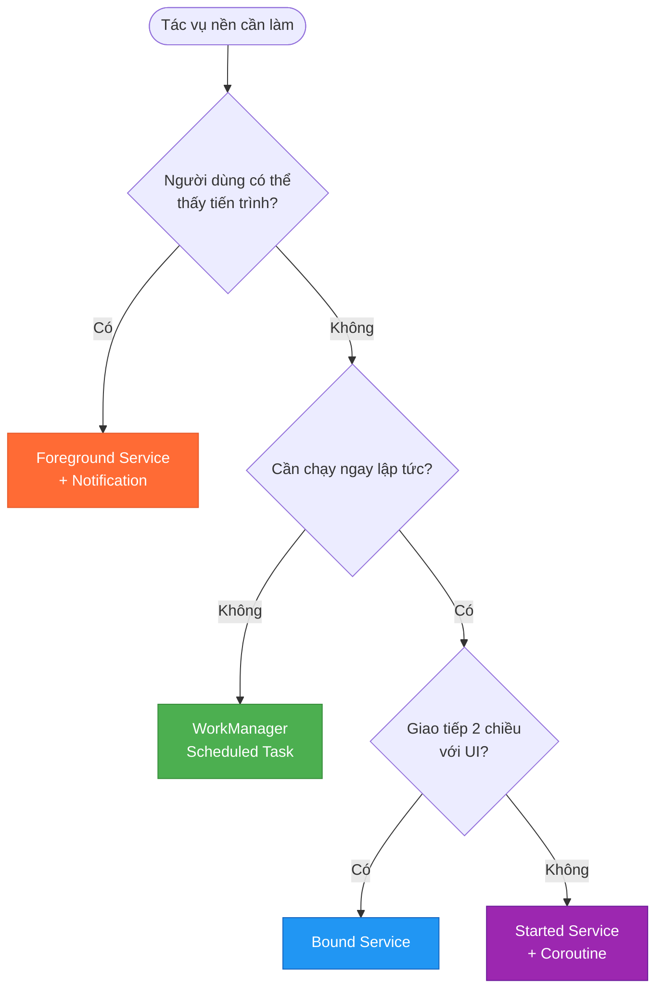
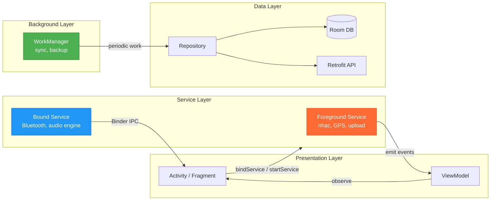
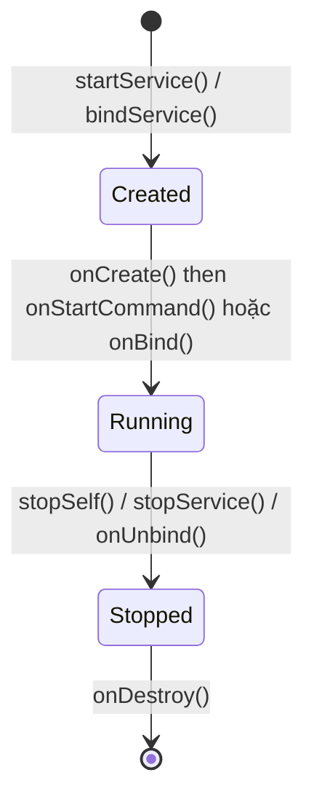
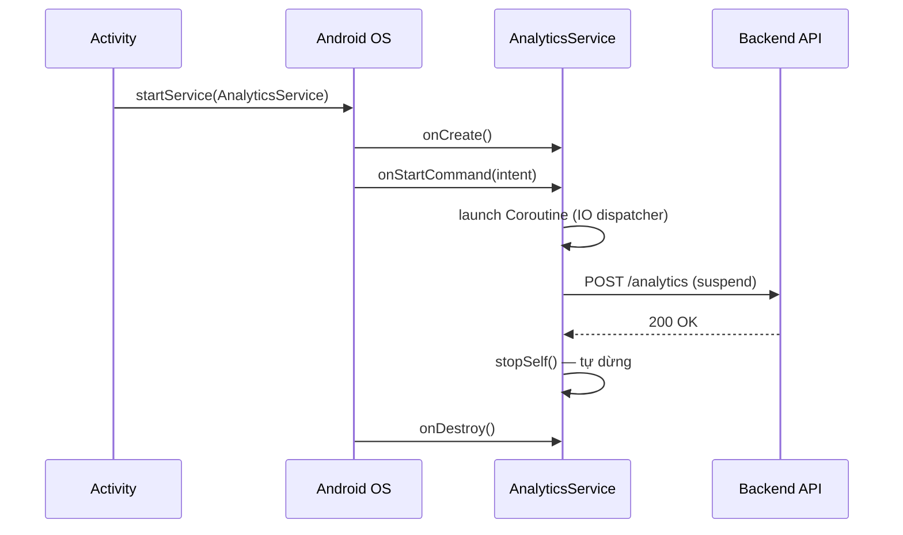
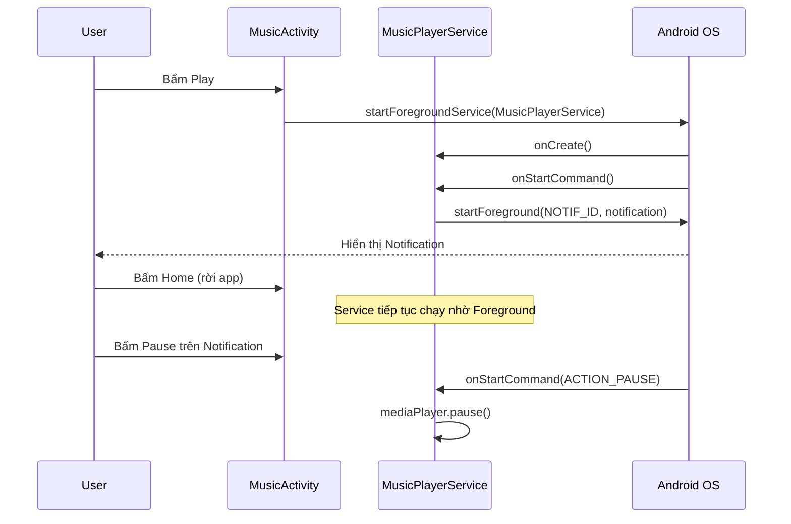
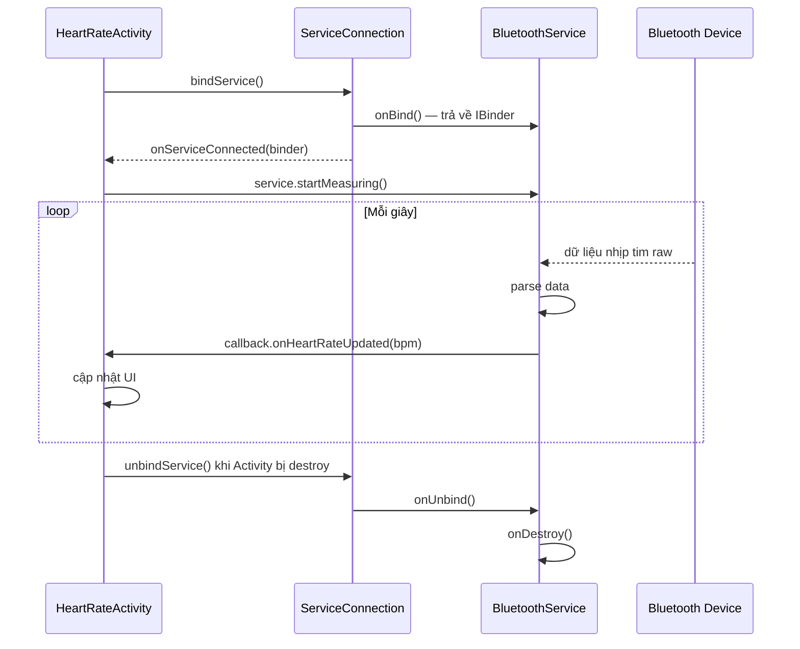

# Android Service

## 1. Nó là gì? (What is it?)

**Android Service** là một **Application Component** chạy **không có giao diện người dùng (UI)**. Nó được thiết kế để thực thi các tác vụ chạy nền hoặc phục vụ các component khác trong ứng dụng.

Một điều quan trọng cần hiểu ngay từ đầu:

> Service **không tự động chạy trên một thread riêng**. Mặc định, Service chạy trên **Main Thread (UI Thread)** của ứng dụng. Nếu bạn làm tác vụ nặng (gọi network, đọc file lớn) trực tiếp trong Service mà không dùng Coroutine hoặc Thread, ứng dụng sẽ bị ANR (Application Not Responding).

## 2. Khi nào dùng & Vấn đề giải quyết? (Why & When to use?)

### Vấn đề Service giải quyết

Có những tác vụ cần tiếp tục thực thi **ngay cả khi người dùng rời khỏi màn hình**:

| Tình huống | Ví dụ thực tế |
|---|---|
| Phát nhạc nền | Spotify, YouTube Music |
| Tải file / Upload ảnh | Google Photos sync |
| Theo dõi vị trí liên tục | Google Maps navigation |
| Đồng bộ dữ liệu định kỳ | Email, Calendar sync |
| Kết nối thiết bị ngoại vi | Bluetooth heart rate monitor |

### Khi nào KHÔNG nên dùng Service thuần?

- **Tác vụ một lần, không cần ngay lập tức:** Dùng **WorkManager** (đảm bảo hoàn thành dù app bị kill, hỗ trợ Doze mode, constraint như có WiFi).
- **Tác vụ ngắn do người dùng trigger:** Dùng **Coroutine trong ViewModel/Activity** (tác vụ sẽ bị hủy khi người dùng thoát app — đây là hành vi đúng đắn).
- **Giao tiếp giữa các phần của cùng một app:** Dùng **Shared ViewModel** hoặc **SharedFlow** thay vì Bound Service.

### Bản đồ quyết định: Nên dùng gì?



## 3. Tư duy hệ thống (System Thinking in Application)

### Service trong kiến trúc MVVM / Clean Architecture



**Nguyên tắc quan trọng:** Service không được biết đến UI. Service chỉ thực thi tác vụ và emit kết quả (qua BroadcastReceiver, EventBus, Flow, hoặc Binder callback). UI quyết định cách hiển thị kết quả đó.

---

## 4. Ba loại Service — So sánh tổng quan

| Đặc điểm | Started Service | Foreground Service | Bound Service |
|---|---|---|---|
| **Khởi động bằng** | `startService()` | `startForeground()` | `bindService()` |
| **Lifecycle** | Chạy đến khi `stopSelf()` / `stopService()` | Chạy đến khi dừng | Chạy khi có ít nhất 1 client bind |
| **Notification** | Không | **Bắt buộc** | Không |
| **Giao tiếp 2 chiều** | Không | Không | **Có (Binder)** |
| **Bị kill khi thiếu RAM?** | Có thể | **Ưu tiên cao, khó bị kill** | Có thể |
| **Ví dụ thực tế** | Xử lý upload 1 lần | Phát nhạc, navigation | Audio engine, Bluetooth |

---

## 5. Vòng đời Service (Lifecycle)



### `onStartCommand()` — Return value quan trọng

```kotlin
override fun onStartCommand(intent: Intent?, flags: Int, startId: Int): Int {
    // Quyết định hành vi khi Service bị kill bởi hệ thống:
    return START_STICKY        // Tái tạo Service, intent = null
    // return START_NOT_STICKY // KHÔNG tái tạo Service (tốt cho tác vụ 1 lần)
    // return START_REDELIVER_INTENT // Tái tạo Service, gửi lại intent cũ
}
```

> [!NOTE]
> **START_STICKY** phù hợp cho Media Player (muốn Service sống lại sau khi bị kill).
> **START_NOT_STICKY** phù hợp cho tác vụ một lần như upload file (không cần chạy lại nếu bị kill giữa chừng).

---

## 6. Triển khai thực chiến

### 6.1 Started Service với Coroutine

**Tình huống:** Gửi log analytics lên server sau khi người dùng hoàn thành một session mà không chặn UI.



**AndroidManifest.xml**
```xml
<service
    android:name=".service.AnalyticsService"
    android:exported="false" />
```

**AnalyticsService.kt**
```kotlin
import android.app.Service
import android.content.Intent
import android.os.IBinder
import kotlinx.coroutines.*

class AnalyticsService : Service() {

    // Job riêng để có thể cancel khi Service bị destroy
    private val serviceJob = SupervisorJob()
    private val serviceScope = CoroutineScope(Dispatchers.IO + serviceJob)

    override fun onBind(intent: Intent?): IBinder? = null

    override fun onStartCommand(intent: Intent?, flags: Int, startId: Int): Int {
        val sessionId = intent?.getStringExtra(EXTRA_SESSION_ID) ?: run {
            stopSelf(startId)
            return START_NOT_STICKY
        }

        serviceScope.launch {
            try {
                uploadSessionData(sessionId)
            } catch (e: Exception) {
                // Log lỗi, retry hoặc lưu local để retry sau
            } finally {
                stopSelf(startId) // Báo OS tác vụ này đã xong
            }
        }

        return START_NOT_STICKY
    }

    private suspend fun uploadSessionData(sessionId: String) {
        // analyticsRepository.uploadSession(sessionId)
    }

    override fun onDestroy() {
        super.onDestroy()
        serviceJob.cancel() // Hủy tất cả Coroutine khi Service bị destroy
    }

    companion object {
        const val EXTRA_SESSION_ID = "extra_session_id"

        fun buildIntent(context: android.content.Context, sessionId: String): Intent {
            return Intent(context, AnalyticsService::class.java).apply {
                putExtra(EXTRA_SESSION_ID, sessionId)
            }
        }
    }
}
```

---

### 6.2 Foreground Service — Phát nhạc nền

**Tình huống:** Music Player — cần tiếp tục phát nhạc khi người dùng khóa màn hình, hiển thị notification với control (play/pause).

> [!IMPORTANT]
> Từ **Android 8 (API 26)**, Background Service bị giới hạn nghiêm ngặt. Nếu app chạy ngầm và cần tiếp tục làm việc lâu dài, **bắt buộc** phải dùng Foreground Service với Notification.
> Từ **Android 14 (API 34)**, phải khai báo rõ `foregroundServiceType` trong Manifest.



**AndroidManifest.xml**
```xml
<uses-permission android:name="android.permission.FOREGROUND_SERVICE" />
<uses-permission android:name="android.permission.FOREGROUND_SERVICE_MEDIA_PLAYBACK" />

<service
    android:name=".service.MusicPlayerService"
    android:foregroundServiceType="mediaPlayback"
    android:exported="false" />
```

**MusicPlayerService.kt**
```kotlin
import android.app.*
import android.content.Intent
import android.os.Build
import android.os.IBinder
import androidx.core.app.NotificationCompat

class MusicPlayerService : Service() {

    companion object {
        const val CHANNEL_ID = "music_player_channel"
        const val NOTIFICATION_ID = 1001
        const val ACTION_PLAY = "action_play"
        const val ACTION_PAUSE = "action_pause"
        const val ACTION_STOP = "action_stop"
    }

    override fun onCreate() {
        super.onCreate()
        createNotificationChannel()
    }

    override fun onStartCommand(intent: Intent?, flags: Int, startId: Int): Int {
        when (intent?.action) {
            ACTION_PLAY -> {
                startForeground(NOTIFICATION_ID, buildNotification(isPlaying = true))
                playMusic()
            }
            ACTION_PAUSE -> {
                pauseMusic()
                updateNotification(isPlaying = false)
            }
            ACTION_STOP -> {
                stopMusic()
                stopForeground(STOP_FOREGROUND_REMOVE)
                stopSelf()
            }
        }
        return START_STICKY
    }

    private fun buildNotification(isPlaying: Boolean): Notification {
        val pauseIntent = PendingIntent.getService(
            this, 0,
            Intent(this, MusicPlayerService::class.java).apply { action = ACTION_PAUSE },
            PendingIntent.FLAG_IMMUTABLE
        )

        return NotificationCompat.Builder(this, CHANNEL_ID)
            .setContentTitle("Đang phát: Shape of You")
            .setContentText("Ed Sheeran • Divide")
            .setSmallIcon(android.R.drawable.ic_media_play)
            .addAction(android.R.drawable.ic_media_pause, if (isPlaying) "Tạm dừng" else "Phát", pauseIntent)
            .setOngoing(true)
            .build()
    }

    private fun createNotificationChannel() {
        if (Build.VERSION.SDK_INT >= Build.VERSION_CODES.O) {
            val channel = NotificationChannel(CHANNEL_ID, "Trình phát nhạc", NotificationManager.IMPORTANCE_LOW)
            getSystemService(NotificationManager::class.java).createNotificationChannel(channel)
        }
    }

    private fun updateNotification(isPlaying: Boolean) {
        getSystemService(NotificationManager::class.java).notify(NOTIFICATION_ID, buildNotification(isPlaying))
    }

    private fun playMusic() { /* MediaPlayer logic */ }
    private fun pauseMusic() { /* MediaPlayer logic */ }
    private fun stopMusic() { /* MediaPlayer logic */ }

    override fun onBind(intent: Intent?): IBinder? = null
}
```

**Cách gọi từ Activity:**
```kotlin
val intent = Intent(this, MusicPlayerService::class.java).apply {
    action = MusicPlayerService.ACTION_PLAY
}
if (Build.VERSION.SDK_INT >= Build.VERSION_CODES.O) {
    startForegroundService(intent)
} else {
    startService(intent)
}
```

---

### 6.3 Bound Service — Kết nối Bluetooth Real-time

**Tình huống:** App đo nhịp tim kết nối với thiết bị Bluetooth. UI cần nhận dữ liệu nhịp tim liên tục, real-time, trong khi app đang mở.



**BluetoothHeartRateService.kt**
```kotlin
import android.app.Service
import android.content.Intent
import android.os.Binder
import android.os.IBinder

class BluetoothHeartRateService : Service() {

    interface HeartRateCallback {
        fun onHeartRateUpdated(bpm: Int)
        fun onConnectionStateChanged(connected: Boolean)
    }

    inner class LocalBinder : Binder() {
        fun getService(): BluetoothHeartRateService = this@BluetoothHeartRateService
    }

    private val binder = LocalBinder()
    private var callback: HeartRateCallback? = null

    override fun onBind(intent: Intent?): IBinder = binder

    fun setCallback(callback: HeartRateCallback) {
        this.callback = callback
    }

    fun startMeasuring() {
        // Kết nối Bluetooth GATT và bắt đầu nhận dữ liệu
        simulateHeartRateData()
    }

    private fun simulateHeartRateData() {
        callback?.onHeartRateUpdated(bpm = 75)
    }

    fun stopMeasuring() {
        callback = null
    }

    override fun onUnbind(intent: Intent?): Boolean {
        stopMeasuring()
        return false
    }
}
```

**HeartRateActivity.kt**
```kotlin
import android.content.ComponentName
import android.content.Context
import android.content.Intent
import android.content.ServiceConnection
import android.os.IBinder
import androidx.appcompat.app.AppCompatActivity

class HeartRateActivity : AppCompatActivity(), BluetoothHeartRateService.HeartRateCallback {

    private var heartRateService: BluetoothHeartRateService? = null
    private var isServiceBound = false

    private val serviceConnection = object : ServiceConnection {
        override fun onServiceConnected(name: ComponentName?, binder: IBinder?) {
            val localBinder = binder as BluetoothHeartRateService.LocalBinder
            heartRateService = localBinder.getService()
            heartRateService?.setCallback(this@HeartRateActivity)
            heartRateService?.startMeasuring()
            isServiceBound = true
        }

        override fun onServiceDisconnected(name: ComponentName?) {
            heartRateService = null
            isServiceBound = false
        }
    }

    override fun onStart() {
        super.onStart()
        Intent(this, BluetoothHeartRateService::class.java).also { intent ->
            bindService(intent, serviceConnection, Context.BIND_AUTO_CREATE)
        }
    }

    override fun onStop() {
        super.onStop()
        if (isServiceBound) {
            unbindService(serviceConnection)
            isServiceBound = false
        }
    }

    override fun onHeartRateUpdated(bpm: Int) {
        runOnUiThread {
            // binding.tvHeartRate.text = "$bpm BPM"
        }
    }

    override fun onConnectionStateChanged(connected: Boolean) { }
}
```

---

### 6.4 WorkManager — Lựa chọn hiện đại cho background task

**Tình huống:** Backup ảnh lên server mỗi đêm khi có WiFi và đang sạc pin.

> [!TIP]
> **WorkManager** là thư viện Jetpack được Google khuyến nghị cho hầu hết background tasks. Nó hoạt động được trên mọi API level, tôn trọng Doze mode, battery saver, và đảm bảo task hoàn thành ngay cả khi app bị kill hoặc thiết bị restart.

**BackupWorker.kt**
```kotlin
import android.content.Context
import androidx.work.*
import kotlinx.coroutines.Dispatchers
import kotlinx.coroutines.withContext

class BackupWorker(
    context: Context,
    params: WorkerParameters
) : CoroutineWorker(context, params) {

    override suspend fun doWork(): Result {
        return withContext(Dispatchers.IO) {
            try {
                val userId = inputData.getString(KEY_USER_ID)
                    ?: return@withContext Result.failure(workDataOf("error" to "Missing user ID"))

                // uploadPhotos(userId)
                val uploadedCount = 42

                Result.success(workDataOf(KEY_UPLOADED_COUNT to uploadedCount))
            } catch (e: Exception) {
                if (runAttemptCount < 3) Result.retry()
                else Result.failure(workDataOf("error" to e.message))
            }
        }
    }

    companion object {
        const val KEY_USER_ID = "key_user_id"
        const val KEY_UPLOADED_COUNT = "key_uploaded_count"
    }
}
```

**Đặt lịch và quan sát:**
```kotlin
fun scheduleNightlyBackup(context: Context, userId: String) {
    val constraints = Constraints.Builder()
        .setRequiredNetworkType(NetworkType.UNMETERED) // Chỉ chạy khi có WiFi
        .setRequiresCharging(true)
        .build()

    val backupRequest = PeriodicWorkRequestBuilder<BackupWorker>(24, TimeUnit.HOURS)
        .setConstraints(constraints)
        .setInputData(workDataOf(BackupWorker.KEY_USER_ID to userId))
        .setBackoffCriteria(BackoffPolicy.EXPONENTIAL, WorkRequest.MIN_BACKOFF_MILLIS, TimeUnit.MILLISECONDS)
        .build()

    WorkManager.getInstance(context).enqueueUniquePeriodicWork(
        "nightly_photo_backup",
        ExistingPeriodicWorkPolicy.KEEP,
        backupRequest
    )
}
```

---

## 7. Bảng so sánh tổng hợp: Nên dùng gì?

| Kịch bản | Giải pháp tốt nhất | Lý do |
|---|---|---|
| Phát nhạc nền | Foreground Service | Cần UI (Notification) + chạy liên tục |
| Upload file lớn 1 lần | Foreground Service | Cần progress notification |
| Sync data mỗi ngày | WorkManager (Periodic) | Không cần ngay, cần đảm bảo completion |
| Sync data khi có WiFi | WorkManager + Constraints | WorkManager xử lý constraint tốt nhất |
| Nhận dữ liệu sensor real-time | Bound Service | Cần giao tiếp 2 chiều, vòng đời gắn với Activity |
| Tác vụ ngắn do user trigger | Coroutine trong ViewModel | Không cần Service, đơn giản hơn nhiều |
| GPS tracking nền | Foreground Service | Cần chạy dù người dùng thoát app |

---

## 8. Trade-offs & Pitfalls (Lưu ý quan trọng)

> [!WARNING]
> **Background Execution Limits (Android 8+):**
> Từ Android 8 (Oreo), app trong background chỉ có **vài phút** để chạy Service trước khi bị system kill. Cố tình bypass giới hạn này vi phạm Play Store policy.
> **Giải pháp:** Dùng Foreground Service nếu cần chạy lâu, hoặc WorkManager cho tác vụ deferrable.

> [!CAUTION]
> **Service không phải thread riêng — ANR rình rập:**
> Code trong `onStartCommand()` chạy trên Main Thread. Bất kỳ thao tác blocking nào sẽ freeze UI trong 5 giây → ANR.
> **Giải pháp:** Luôn launch Coroutine với `Dispatchers.IO` cho các tác vụ blocking trong Service.

> [!CAUTION]
> **Memory Leak với Bound Service:**
> Nếu bind trong `onStart()` nhưng quên `unbindService()` trong `onStop()`, Activity context sẽ bị rò rỉ bộ nhớ.
> **Giải pháp:** Luôn đối xứng: bind ↔ unbind trong cùng cặp lifecycle callback.

> [!WARNING]
> **Foreground Service Type bắt buộc (Android 14+):**
> Từ Android 14, phải khai báo `android:foregroundServiceType` trong Manifest và request permission tương ứng. Không khai báo sẽ gây `SecurityException`.
> Các type phổ biến: `mediaPlayback`, `location`, `dataSync`, `camera`, `microphone`.

---

## 9. Nguồn tham khảo

- [Services overview — Android Developers](https://developer.android.com/guide/components/services)
- [Foreground services — Android Developers](https://developer.android.com/develop/background-work/services/foreground-services)
- [Bound services overview — Android Developers](https://developer.android.com/guide/components/bound-services)
- [Background work overview — Android Developers](https://developer.android.com/develop/background-work/background-tasks)
- [WorkManager guide — Android Developers](https://developer.android.com/topic/libraries/architecture/workmanager)
- [Background execution limits (Android 8+)](https://developer.android.com/about/versions/oreo/background)
