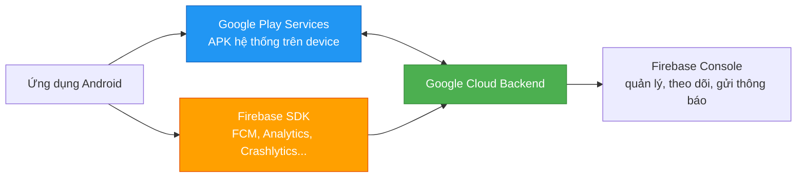
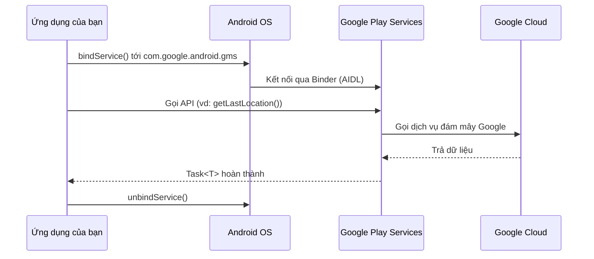
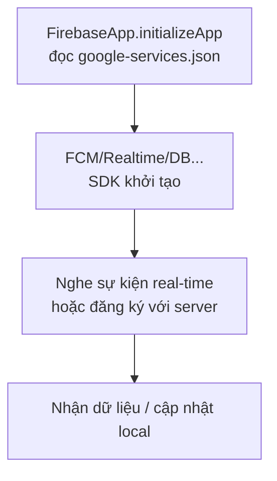
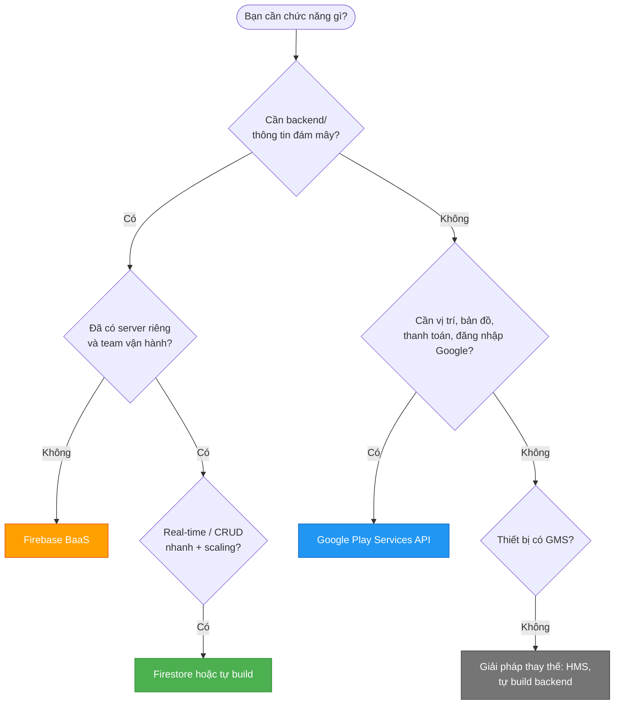
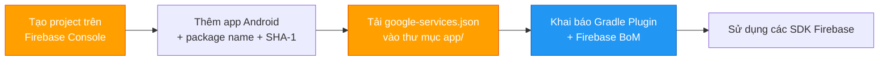
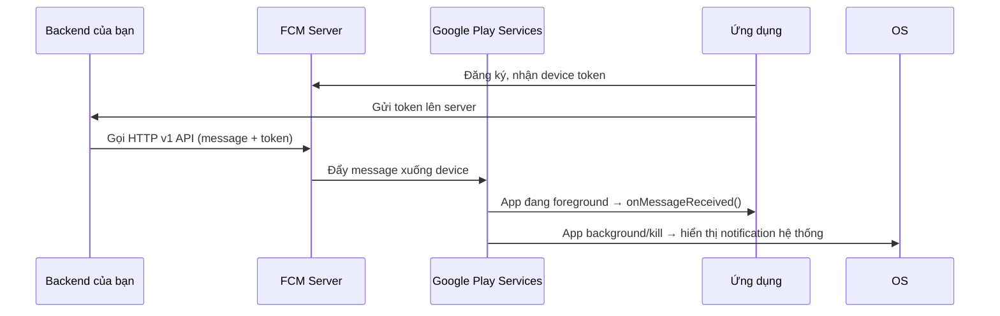
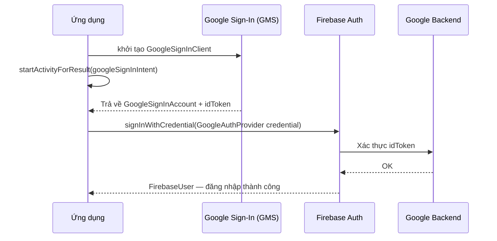
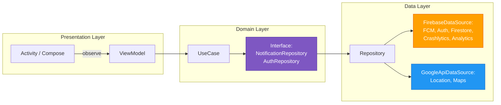

# Google Service

## 1. Nó là gì? (What is it?)

**Google Service** trong phạm vi Android thường được hiểu theo **hai tầng** khác nhau nhưng gắn bó chặt chẽ:

### 1.1 Google Play Services (GMS)

**Google Play Services** là một **framework hệ thống cài sẵn trên thiết bị** (một APK riêng, thường tên gói `com.google.android.gms`). Nó cung cấp các API nền cho vô số tính năng của Google:

- Google Maps
- Location (vị trí)
- Google Sign-In / OAuth
- In-app Billing (thanh toán trong app)
- **Nền tảng để các Firebase SDK chạy trên đó**

GMS **không phải phần của AOSP** (Android mã nguồn mở). Nó là phần mềm độc quyền của Google, được cấp phép cho các nhà sản xuất (OEM) và tự cập nhật qua Google Play Store — không cần người dùng nâng cấp hệ điều hành.

### 1.2 Firebase

**Firebase** là một **Backend-as-a-Service (BaaS)** của Google. Phía client là các **SDK** (thư viện) bạn thêm vào project, phía server là hạ tầng đám mây Google đã quản lý sẵn.

| Sản phẩm Firebase | Vai trò |
|---|---|
| Firebase Cloud Messaging (FCM) | Gửi push notification |
| Firebase Analytics | Theo dõi hành vi người dùng |
| Firebase Crashlytics | Báo cáo crash |
| Firebase Authentication | Đăng nhập (email, Google, phone...) |
| Cloud Firestore | Database NoSQL real-time |
| Firebase Storage | Lưu trữ file |
| Firebase Remote Config | Cấu hình app từ xa |
| Firebase App Distribution | Phân phối build test |

### 1.3 Mối quan hệ GMS ↔ Firebase

> Firebase SDK chạy **trên nền tảng Google Play Services**. Hầu hết các Firebase SDK (đặc biệt FCM, Dynamic Links, App Check) **yêu cầu thiết bị phải có GMS** mới hoạt động. Cả hai được cấu hình chung qua một file `google-services.json`.



---

## 2. Vì sao tồn tại? Nó giải quyết vấn đề gì? (Why & What problem?)

### Android thuần (AOSP) thiếu gì?

Android mã nguồn mở (AOSP) chỉ cung cấp cơ chế lõi: Activity, Service, Broadcast... Nó **không có** dịch vụ vị trí chính xác, bản đồ, danh bạ đám mây, hay hạ tầng push notification đa nền tảng.

Nếu mỗi nhà sản xuất tự làm một bộ dịch vụ riêng, ứng dụng sẽ chạy khác nhau trên từng máy. GMS ra đời để:

- **Thống nhất API** — nhà phát triển viết một lần, chạy trên mọi máy có GMS.
- **Tự cập nhật** — Google cập nhật dịch vụ nền qua Play Store, không cần chờ OEM phát hành bản vá hệ điều hành.
- **Là điều kiện để có Play Store** — các OEM muốn cài Google Play Store bắt buộc phải đi kèm GMS.

### Firebase giải quyết nỗi đau backend

Trước Firebase, mọi app muốn có push notification, analytics, hay crash report đều phải **tự xây backend**: viết server, quản lý socket, mở rộng hạ tầng. Firebase loại bỏ toàn bộ phần đó:

- Không phải quản lý server.
- Tự mở rộng quy mô.
- Client SDK đã được tối ưu sẵn cho Android.

---

## 3. Cách hoạt động bên trong (How does it work?)

### 3.1 Google Play Services: một "system app" giao tiếp qua IPC

GMS được cài như một **application component hệ thống**. Khi app của bạn gọi `GoogleApiClient` (hoặc API mới qua `Task`), thực chất app **bind tới Service của GMS** qua Binder IPC (giống Bound Service trong bài [Android Service](./android_service.md)), và GMS thực thi tác vụ rồi trả kết quả về.



Vì GMS tự cập nhật, **version GMS trên máy có thể mới hơn hoặc cũ hơn** so với version mà app bạn biên dịch. Đây là nguồn gốc của lỗi `Google Play services is not compatible with your app` nếu bạn không xử lý đúng.

### 3.2 Firebase SDK: client kết nối backend Google

Firebase SDK chạy **trong chính process app** của bạn. Nó dùng file `google-services.json` để biết app thuộc project Firebase nào, sau đó mở kết nối (REST/WebSocket) tới backend:



Khi app bị kill, FCM vẫn có thể hiển thị notification nhờ **cơ chế của hệ điều hành** (qua Google Play Services) — không cần app chạy. Đây là điểm khác biệt cốt lõi so với tự mở socket.

---

## 4. Khi nào nên dùng / không nên dùng? (When to use / avoid?)

### Bản đồ quyết định



### Nên dùng

| Tình huống | Giải pháp |
|---|---|
| Gửi push notification tới hàng triệu user | FCM |
| Theo dõi crash, session, hành vi user | Crashlytics + Analytics |
| Xác thực đăng nhập nhanh, không tự build OAuth | Firebase Auth / Google Sign-In |
| App cần real-time dữ liệu, tối ưu thời gian phát triển | Cloud Firestore |
| Bản đồ, định vị, thanh toán trong app | Google Play Services |

### Không nên dùng

- **Thiết bị không có GMS** (Huawei mới, một số máy Trung Quốc): FCM, Maps, Location của Google **không hoạt động**. Cần dùng Huawei HMS hoặc tự build giải pháp thay thế.
- **Yêu cầu kiểm soát dữ liệu chặt chẽ** (GDPR, dữ liệu nhạy cảm nội bộ): Firebase lưu dữ liệu trên cloud của Google, không thể tự host.
- **Đã có backend team mạnh + nhu cầu tùy biến sâu**: tự build có thể rẻ và linh hoạt hơn về lâu dài.
- **Chỉ cần 1 chức năng đơn giản**: đừng kéo cả Firebase vào, mỗi SDK đều tăng dung lượng APK và số lượng dependency.

---

## 5. Tích hợp vào project (Setup chuẩn)

### Luồng tích hợp



### Bước 1 — Tạo project trên Firebase Console

Vào [console.firebase.google.com](https://console.firebase.google.com), tạo project, thêm app Android với:

- **Package name** khớp 100% với `applicationId` trong `build.gradle`.
- **SHA-1** của keystore (dùng cho Google Sign-In và một số tính năng).

> [!IMPORTANT]
> **Package name phải khớp chính xác.** Nếu khai báo sai, app sẽ crash ngay khi khởi động với lỗi: *"Default FirebaseApp is not initialized"* hoặc *"google-services.json is missing"*.

### Bước 2 — Thêm plugin vào Gradle

**Project-level `build.gradle.kts` (hoặc `settings.gradle.kts`):**
```kotlin
plugins {
    id("com.google.gms.google-services") version "4.4.2" apply false
}
```

**App-level `build.gradle.kts`:**
```kotlin
plugins {
    id("com.android.application")
    id("org.jetbrains.kotlin.android")
    id("com.google.gms.google-services")   // Bắt buộc để sinh FirebaseApp từ json
}
```

> [!NOTE]
> Plugin `com.google.gms.google-services` đọc `google-services.json` và **tự động sinh** code khởi tạo `FirebaseApp`. Bạn không cần gọi `FirebaseApp.initializeApp()` trong code.

### Bước 3 — Thêm dependency với Firebase BoM

**Firebase BoM (Bill of Materials)** giúp tất cả SDK Firebase **cùng một version** — tránh lỗi xung đột version (conflict):

```kotlin
dependencies {
    // BoM: quản lý version tập trung
    implementation(platform("com.google.firebase:firebase-bom:33.5.1"))

    // Các SDK — KHÔNG ghi version
    implementation("com.google.firebase:firebase-analytics")
    implementation("com.google.firebase:firebase-messaging")
    implementation("com.google.firebase:firebase-crashlytics")
    implementation("com.google.firebase:firebase-auth")
    implementation("com.google.firebase:firebase-firestore")
    implementation("com.google.firebase:firebase-storage")
    implementation("com.google.firebase:firebase-config-ktx")
    implementation("com.google.android.gms:play-services-location:21.3.0")
    implementation("com.google.android.gms:play-services-maps:19.0.0")
    implementation("com.google.android.libraries.places:places:3.5.0")
}
```

> [!TIP]
> Không ghi version riêng cho từng SDK Firebase khi đã dùng BoM. BoM sẽ chọn version tương thích với nhau, hạn chế tối đa `Dependency conflict` khi build.

### Bước 4 — Đảm bảo minSdk

Firebase yêu cầu **minSdk ≥ 21** (Android 5.0). Kiểm tra trong `build.gradle.kts`:
```kotlin
defaultConfig {
    minSdk = 21
}
```

---

## 6. Thực chiến Firebase

### 6.1 FCM — Push Notification

**Tình huống:** Gửi thông báo đơn hàng mới tới người dùng, hiển thị notification cả khi app đang mở lẫn bị kill.



**FirebaseMessagingService** — nhận message:

```kotlin
class OrderMessagingService : FirebaseMessagingService() {

    override fun onNewToken(token: String) {
        // Token mới được cấp (đăng nhập lại, cài lại app...)
        // Gửi lên server: apiService.uploadFcmToken(token)
    }

    override fun onMessageReceived(remoteMessage: RemoteMessage) {
        // Khi app ĐANG foreground — notification hệ thống KHÔNG tự hiện
        val title = remoteMessage.notification?.title ?: "Thông báo"
        val body = remoteMessage.notification?.body ?: remoteMessage.data["body"] ?: ""
        showNotification(title, body)
    }
}
```

**Khai báo trong AndroidManifest.xml:**
```xml
<service
    android:name=".data.notification.OrderMessagingService"
    android:exported="false">
    <intent-filter>
        <action android:name="com.google.firebase.MESSAGING_EVENT" />
    </intent-filter>
</service>
```

> [!WARNING]
> **Foreground vs Background:** Khi app ở foreground, `onMessageReceived()` được gọi và bạn **tự hiển thị notification**. Khi app ở background hoặc bị kill, GMS **tự hiển thị** notification từ payload `notification` — `onMessageReceived()` **không được gọi**. Muốn luôn nhận data ở background, gửi **data message** (không có field `notification`) và để client xử lý trong `onMessageReceived()`.

### 6.2 Firebase Analytics & Event Log

**Tình huống:** Theo dõi sự kiện "add_to_cart" để đo hiệu quả chiến dịch.

**Gửi sự kiện:**
```kotlin
// FirebaseAnalytics là Singleton — lấy qua Application context
private val analytics: FirebaseAnalytics =
    FirebaseAnalytics.getInstance(applicationContext)

fun trackAddToCart(productId: String, price: Double, currency: String) {
    val bundle = Bundle().apply {
        putString(FirebaseAnalytics.Param.ITEM_ID, productId)
        putDouble(FirebaseAnalytics.Param.PRICE, price)
        putString(FirebaseAnalytics.Param.CURRENCY, currency)
    }
    analytics.logEvent(FirebaseAnalytics.Event.ADD_TO_CART, bundle)
}
```

**User property** (thuộc tính người dùng, dùng để phân khúc):
```kotlin
analytics.setUserProperty("user_tier", "premium")
```

**Xem Event Log trong quá trình debug:**
- Bật **DebugView** trên Firebase Console.
- Xem trực tiếp trong logcat bằng filter:
  ```bash
  adb shell setprop debug.firebase.analytics.app <package_name>
  ```
  Khi đó trong logcat hiện các dòng: `I/FA: Event received...` với đầy đủ tên sự kiện và tham số.

> [!NOTE]
> Event log của Analytics là **chìa khóa debug**. Nếu sự kiện bạn gửi không xuất hiện, kiểm tra: đã tắt **data saver**? đã set prop `debug.firebase.analytics.app`? đã gửi đúng package name khi set prop?

### 6.3 Crashlytics — Báo cáo crash

**Tình huống:** Bắt crash tự động, kèm log và thông tin người dùng để fix nhanh.

**Cấu hình:** Plugin `com.google.firebase.crashlytics` trong Gradle (thêm dòng `id("com.google.firebase.crashlytics")` vào `plugins`).

**Tùy biến crash log trong code:**
```kotlin
class App : Application() {
    override fun onCreate() {
        super.onCreate()
        // Đăng ký handler crash toàn cục (bắt cả lỗi không gây crash app)
        Thread.setDefaultUncaughtExceptionHandler { thread, throwable ->
            FirebaseCrashlytics.getInstance().recordException(throwable)
        }
    }
}

fun reportUserAction(userId: String) {
    val crashlytics = FirebaseCrashlytics.getInstance()
    crashlytics.setUserId(userId)            // Ai gặp crash
    crashlytics.setCustomKey("last_screen", "checkout") // Đang ở màn nào
    crashlytics.log("User bấm nút 'Thanh toán'")        // Log trước crash
    // → Khi crash xảy ra, các dòng log() này hiện trong báo cáo
}
```

> [!TIP]
> Bật **Crashlytics NDK** và **Crashlytics debug** để xem crash ngay trên máy test: trong logcat filter `Crashlytics`. Bản build debug thường hiện log đầy đủ hơn.

### 6.4 Firebase Auth + Google Sign-In

**Tình huống:** Người dùng đăng nhập bằng tài khoản Google.



**Code trong ViewModel + Activity (luồng thực chiến):**

```kotlin
// --- data/remote/GoogleAuthDataSource.kt ---
class GoogleAuthDataSource(
    private val firebaseAuth: FirebaseAuth
) {
    fun currentUser(): String? = firebaseAuth.currentUser?.uid

    suspend fun signInWithGoogle(idToken: String): Result<String> = runCatching {
        val credential = GoogleAuthProvider.getCredential(idToken, null)
        firebaseAuth.signInWithCredential(credential).await()
        firebaseAuth.currentUser?.uid ?: throw IllegalStateException("Login failed")
    }

    suspend fun signOut() = firebaseAuth.signOut()
}

// --- UI: Activity xử lý luồng Google Sign-In ---
private lateinit var googleSignInClient: GoogleSignInClient

override fun onCreate(savedInstanceState: Bundle?) {
    val gso = GoogleSignInOptions.Builder(GoogleSignInOptions.DEFAULT_SIGN_IN)
        .requestIdToken(getString(R.string.default_web_client_id)) // từ google-services.json
        .requestEmail()
        .build()
    googleSignInClient = GoogleSignIn.getClient(this, gso)
}

fun startGoogleSignIn() {
    startActivityForResult(googleSignInClient.signInIntent, RC_SIGN_IN)
}

override fun onActivityResult(requestCode: Int, resultCode: Int, data: Intent?) {
    super.onActivityResult(requestCode, resultCode, data)
    if (requestCode == RC_SIGN_IN) {
        val task = GoogleSignIn.getSignedInAccountFromIntent(data)
        handleSignInResult(task)
    }
}

private fun handleSignInResult(task: Task<GoogleSignInAccount>) {
    val account = task.getResult(ApiException::class.java)
    val idToken = account.idToken
    if (idToken != null) {
        viewModel.signInWithGoogle(idToken)   // gọi data layer, lưu session
    }
}
```

> [!CAUTION]
> `R.string.default_web_client_id` được **tự sinh bởi plugin** `google-services` từ `google-services.json`. Nếu bạn xóa `google-services.json` hoặc không apply plugin, resource này không tồn tại → build lỗi ngay.

### 6.5 Remote Config — Cấu hình từ xa

**Tình huống:** Bật/tắt tính năng "gợi ý bạn bè" cho một phần người dùng mà không cần phát hành bản update.

```kotlin
// Domain: giao diện đọc config
interface FeatureFlags {
    val showFriendSuggestion: Boolean
}

// Data: RemoteConfigDataSource
class RemoteConfigDataSource : FeatureFlags {
    override val showFriendSuggestion: Boolean
        get() = remoteConfig.getBoolean(KEY_SHOW_FRIEND_SUGGESTION)

    suspend fun fetchAndActivate() {
        val remoteConfig = FirebaseRemoteConfig.getInstance()
        remoteConfig.setDefaultsAsync(
            mapOf(KEY_SHOW_FRIEND_SUGGESTION to false) // giá trị mặc định local
        )
        val settings = FirebaseRemoteConfigSettings.Builder()
            .setMinimumFetchIntervalInSeconds(3600) // fetch tối đa 1h/lần
            .build()
        remoteConfig.setConfigSettingsAsync(settings)
        // fetch + activate: áp dụng giá trị mới từ server
        remoteConfig.fetchAndActivate().await()
    }
}
```

> [!NOTE]
> Luôn khai báo **default value local** (`setDefaultsAsync`) để app không bị null/crash khi chưa kịp fetch hoặc mất mạng.

### 6.6 Firestore & Storage — Tổng quan

**Tình huống:** Lưu giỏ hàng real-time, đồng bộ offline khi mất mạng.

**Firestore (database NoSQL real-time):**
```kotlin
// Structure: users/{userId}/cart/{itemId}
data class CartItem(val productId: String, val qty: Int)

// Ghi dữ liệu
val docRef = FirebaseFirestore.getInstance()
    .collection("users")
    .document(userId)
    .collection("cart")
    .document(itemId)

docRef.set(CartItem(productId, qty))

// Lắng nghe real-time + tự động offline persistence
docRef.addSnapshotListener { snapshot, error ->
    if (error != null) return@addSnapshotListener
    // snapshot.toObject(CartItem::class.java) → cập nhật UI
}
```

**Storage (lưu file, ảnh):**
```kotlin
// Upload ảnh avatar
val ref = FirebaseStorage.getInstance().reference
    .child("avatars/$userId.jpg")

ref.putFile(uri)
    .addOnSuccessListener { task ->
        // Lấy URL để lưu vào Firestore
    }
    .addOnFailureListener { /* xử lý lỗi */ }
```

> [!WARNING]
> **Security Rules là bắt buộc.** Mặc định Firestore/Storage chặn toàn bộ truy cập (đúng, an toàn). Khi deploy rules, đừng mở kiểu `if true` (cho phép tất cả) — đó là lỗ hổng bảo mật nghiêm trọng, hacker có thể đọc/xóa toàn bộ dữ liệu của bạn.

### 6.7 App Distribution & Emulator Suite

**Firebase App Distribution** phân phối build test (`.apk`/`.aab`) tới tester nhanh, không cần qua Play Console:

- Upload qua **Gradle plugin** (`com.google.firebase.appdistribution`) hoặc CLI.
- Tester nhận link cài, gửi **feedback** (screenshot, crash log) ngay trong app.
- Quản lý tester theo nhóm (QA, team leader, khách hàng demo...).

**Khác biệt so với Play Console:**

| Tiêu chí | App Distribution | Play Console (Internal/Closed testing) |
|---|---|---|
| Mục đích | Phân phối build test nhanh | Phê duyệt trước khi public |
| Tốc độ | Giây, không cần review | Cần review của Google |
| Feedback từ tester | Có (screenshot, crash) | Không |
| Phiên bản lưu giữ | Mặc định giữ gần đây | Không giới hạn |

**Firebase Emulator Suite** — chạy toàn bộ Firebase (Auth, Firestore, Storage, Functions...) **trên máy local** trong lúc phát triển:

```bash
firebase emulators:start   # khởi động emulators từ thư mục dự án
```

```kotlin
// Khởi tạo app dùng emulator khi debug
if (BuildConfig.DEBUG) {
    FirebaseFirestore.getInstance()
        .useEmulator("10.0.2.2", 8080)   // 10.0.2.2 = host machine từ emulator Android
}
```

> [!TIP]
> Dùng Emulator Suite trong quá trình phát triển để **không tốn quota thật** và không làm bẩn dữ liệu production. Chỉ chuyển sang dữ liệu thật khi test tích hợp với backend thật.

---

## 7. Thực chiến Google Play Services

### 7.1 Location — FusedLocationProvider

**Tình huống:** Lấy vị trí hiện tại một lần (nhất) để hiển thị trên màn hình chính.

**Cấu hình Manifest:**
```xml
<uses-permission android:name="android.permission.ACCESS_COARSE_LOCATION" />
<uses-permission android:name="android.permission.ACCESS_FINE_LOCATION" />
```

**Kotlin:**
```kotlin
class LocationDataSource(
    private val fusedLocation: FusedLocationProviderClient
) {
    suspend fun getCurrentLocation(): Location? {
        return try {
            val request = LocationRequest.Builder(
                Priority.PRIORITY_HIGH_ACCURACY, 10_000L
            ).build()
            // getCurrentLocation: lấy 1 lần, không cần location listener
            fusedLocation.getCurrentLocation(request, CancellationTokenSource().token).await()
        } catch (e: SecurityException) {
            null // Chưa có quyền — UI phải request permission trước
        }
    }
}
```

> [!CAUTION]
> Bắt buộc **request runtime permission** (`ACCESS_FINE_LOCATION`) trước khi gọi API, và **khai báo cả hai permission** trong Manifest. Nếu thiếu, app sẽ ném `SecurityException`.

### 7.2 Google Maps — Hiển thị bản đồ

**Tình huống:** Hiển thị vị trí cửa hàng trên bản đồ.

**Bước 1 — Tạo API Key** trên [Google Cloud Console](https://console.cloud.google.com), enable **Maps SDK for Android**, giới hạn key theo **package name + SHA-1** (best practice).

**Bước 2 — Khai báo trong Manifest:**
```xml
<meta-data
    android:name="com.google.android.geo.API_KEY"
    android:value="AIza...YOUR_KEY" />
```

**Bước 3 — Hiển thị MapFragment trong Compose hoặc Fragment truyền thống:**
```kotlin
// XML: <fragment class="com.google.android.gms.maps.SupportMapFragment" />

override fun onMapReady(map: GoogleMap) {
    map.uiSettings.isZoomControlsEnabled = true
    map.addMarker(
        MarkerOptions()
            .position(LatLng(21.0285, 105.8542))
            .title("Hà Nội")
    )
    map.moveCamera(
        CameraUpdateFactory.newLatLngZoom(LatLng(21.0285, 105.8542), 15f)
    )
}
```

> [!WARNING]
> **API Key lộ trong source = rủi ro lớn.** Nếu không giới hạn key theo package + SHA-1, kẻ khác có thể trích xuất key từ APK (dễ dàng bằng các công cụ decompile) và sử dụng trục lợi → key bị khóa, chi phí tăng. Luôn giới hạn key trong Cloud Console.

### 7.3 AdMob — Quảng cáo (dẫn dắt)

AdMob hiển thị quảng cáo (banner, interstitial, rewarded) qua Google Mobile Ads SDK. Đây là chủ đề riêng có nhiều quy định của Google (policy quảng cáo, hợp đồng) — sẽ được trình bày chi tiết ở topic **4.2.3.3 Advertisements**.

---

## 8. Vị trí trong Clean Architecture / MVVM (Tư duy hệ thống)

Google Service và Firebase nằm ở **Data Layer** (tầng dữ liệu), bên trong các `*DataSource`. **Domain Layer chỉ biết interface** — không được biết Firebase là gì. Điều này giúp thay thế Firebase (vd sang HMS hoặc backend riêng) không đụng vào UI.



**Nguyên tắc:**
- ViewModel gọi `UseCase` (Domain), không gọi Firebase trực tiếp.
- `DataSource` (Data) bọc mọi API của Firebase/GMS, trả về **model thuần** của app.
- Thay đổi Firebase ↔ HMS chỉ cần viết lại `DataSource` + đổi DI binding, UI/Domain không đổi.

---

## 9. Lỗi thường gặp & Best Practices (Pitfalls)

> [!WARNING]
> **Version mismatch / Dependency conflict:** Khi dùng nhiều SDK Firebase với version khác nhau → build lỗi `Dependency conflict` hoặc crash runtime.
> **Giải pháp:** Luôn dùng **Firebase BoM** và không ghi version riêng lẻ.

> [!WARNING]
> **Thiếu `google-services.json` hoặc sai package name:** App crash ngay khi khởi động: *"Default FirebaseApp is not initialized in this process"*.
> **Giải pháp:** Đặt đúng file vào `app/`, khớp `package name` giữa Console và `applicationId`.

> [!CAUTION]
> **API Key sai hoặc không giới hạn:** Maps/Location trả về lỗi "API key not authorized" hoặc bị trục lợi.
> **Giải pháp:** Restrict key theo package name + SHA-1 trong Cloud Console.

> [!CAUTION]
> **Quên permission runtime:** Location, Camera, Microphone... không request quyền → `SecurityException`.
> **Giải pháp:** Dùng thư viện permission (vd Accompanist) và kiểm tra `checkSelfPermission` trước mỗi call.

> [!CAUTION]
> **minSdk < 21:** Firebase SDK yêu cầu minSdk 21 trở lên, build sẽ fail.
> **Giải pháp:** Set `minSdk = 21` trong `build.gradle.kts`.

> [!TIP]
> **Debug nhanh:** Bật `debug.firebase.analytics.app` để xem event log; filter `Crashlytics` trong logcat để xem crash chi tiết; dùng **Firebase Emulator** khi phát triển để không đụng dữ liệu thật.

> [!TIP]
> **Best practice về dữ liệu:** Luôn giới hạn Security Rules; không gửi dữ liệu nhạy cảm (password, token) lên Analytics/Crashlytics; bật **App Check** cho dữ liệu nhạy cảm.

---

## 10. Trade-offs, chi phí & Security

| Khía cạnh | Lợi ích | Đánh đổi / Lưu ý |
|---|---|---|
| **Tốc độ phát triển** | Không phải tự build backend, SDK sẵn sàng | Phụ thuộc Google, ít kiểm soát |
| **Chi phí** | Gói miễn phí hào phóng (Spark/Blaze) | Vượt quota → tốn phí theo usage (Firestore reads/writes, Storage, Functions) |
| **Khả năng mở rộng** | Tự scale, không cần quản lý server | Khó chuyển provider khi dữ liệu lớn |
| **Security** | Auth + Security Rules có sẵn | Rules cấu hình sai = lộ dữ liệu; dữ liệu trên cloud Google |
| **Độ phụ thuộc GMS** | GMS phổ biến trên thiết bị có Play Store | Máy không có GMS (Huawei, Trung Quốc) → cần HMS/thay thế |
| **Dung lượng APK** | — | Mỗi SDK Firebase tăng vài trăm KB → cân nhắc chỉ thêm cần thiết |

> [!NOTE]
> **Chi phí dự đoán:** Firestore tính tiền theo số lượt đọc/ghi — một app chat có thể đọc/ghi rất nhiều. Theo dõi **Usage** trên Firebase Console thường xuyên để tránh hóa đơn bất ngờ.

---

## 11. Nguồn tham khảo

- [Google Play Services overview — Android Developers](https://developer.android.com/develop/connectivity/play-services)
- [Firebase Documentation](https://firebase.google.com/docs)
- [Firebase Cloud Messaging — Android](https://firebase.google.com/docs/cloud-messaging/android/client)
- [Firebase Analytics — Android](https://firebase.google.com/docs/analytics/get-started)
- [Firebase Crashlytics — Android](https://firebase.google.com/docs/crashlytics/get-started?platform=android)
- [Firebase Authentication — Google Sign-In](https://firebase.google.com/docs/auth/android/google-signin)
- [Firebase Remote Config — Android](https://firebase.google.com/docs/remote-config/get-started?platform=android)
- [Cloud Firestore — Android](https://firebase.google.com/docs/firestore/quickstart)
- [Firebase App Distribution](https://firebase.google.com/docs/app-distribution)
- [Firebase Emulator Suite](https://firebase.google.com/docs/emulator-suite)
- [Google Play services — get current location](https://developer.android.com/develop/sensors-and-location/location/current-location)
- [Google Maps SDK for Android](https://developers.google.com/maps/documentation/android-sdk/start)
