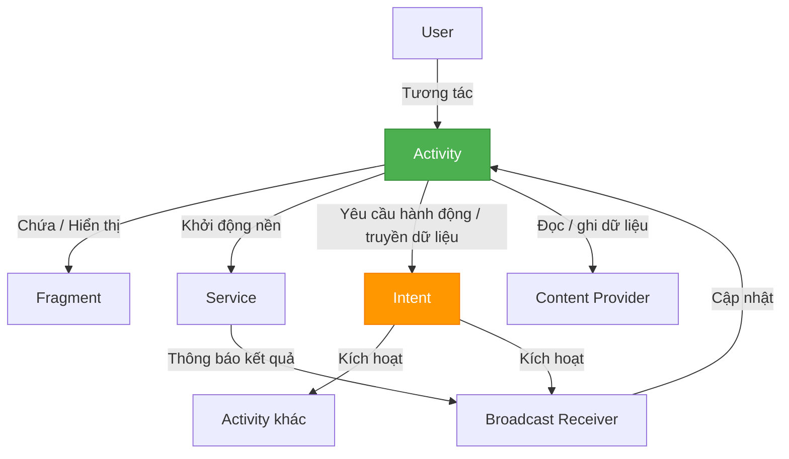

# Session 04: Android Manifest & Application Components

## Session này cung cấp những gì?

Session 04 là **trái tim của Android development**. Trước session này, bạn đã biết ngôn ngữ (Session 01), hệ điều hành (Session 02), phần cứng và kernel (Session 03). Session 04 kết nối tất cả lại: nó dạy bạn cách **khai báo** một ứng dụng với hệ điều hành và cách xây dựng ứng dụng từ các **khối thành phần (Components)** mà Android cung cấp sẵn.

Session 04 được chia thành **2 mảng lớn**:

| Mảng | Mô tả | Bạn học được gì |
|---|---|---|
| **4.1 Android Manifest** | Khai báo ứng dụng với hệ điều hành + cách đóng gói | Manifest Tags, Build Types, Flavor, Plugin |
| **4.2 Application Components** | Các khối xây dựng nên ứng dụng | Activity, Fragment, Services, Broadcast Receiver, Content Provider, Intent |

## 4.1 Android Manifest — Khai báo và đóng gói ứng dụng

**Vấn đề:** Hệ điều hành Android cần biết ứng dụng của bạn gồm những gì (màn hình nào, quyền gì, dịch vụ nào) trước khi cho phép nó chạy. Bạn cũng cần biết cách tạo ra các phiên bản app cho các môi trường khác nhau.

### 4.1.1 Package, build, gradle

- **4.1.1.1 Build Types** — Cấu hình các phiên bản build (debug, staging, release) qua Gradle: URL server khác nhau, bật/tắt log, ký khóa nào. Đây là kiến thức bắt buộc cho mọi dự án thực tế có nhiều môi trường.
- **4.1.1.2 Flavor** — Tạo nhiều biến thể sản phẩm (Free/Paid, khách hàng khác nhau) từ cùng một mã nguồn.
- **4.1.1.3 Plugin** — Hiểu cách AGP và các plugin Gradle được khai báo, nạp và mở rộng khả năng build.

### 4.1.2 Manifest Tags

Học cách khai báo các thành phần trong `AndroidManifest.xml`: `<application>`, `<activity>`, `<service>`, `<receiver>`, `<provider>`, `<permission>` — và vì sao khai báo đúng là điều kiện tiên quyết để component hoạt động.

## 4.2 Application Components — Các khối xây dựng ứng dụng

**Vấn đề:** Một ứng dụng Android không phải là một khối code duy nhất. Nó được tạo nên từ các **component** do hệ điều hành quản lý. Mỗi loại component có một mục đích, vòng đời và cách giao tiếp riêng. Session này dạy bạn sử dụng đúng từng loại.

### Các loại component chính

| Component | Vai trò | Ví dụ thực tế |
|---|---|---|
| **Activity** | Màn hình UI mà người dùng tương tác | Màn hình đăng nhập, màn hình chi tiết sản phẩm |
| **Fragment** | Phần UI tái sử dụng bên trong Activity | Panel danh sách + panel chi tiết trên tablet |
| **Service** | Xử lý nền không có giao diện | Phát nhạc, tải file, đồng bộ dữ liệu |
| **Broadcast Receiver** | Lắng nghe sự kiện toàn hệ thống | Nhận tin nhắn, báo pin yếu, sự kiện mạng |
| **Content Provider** | Chia sẻ dữ liệu giữa các ứng dụng | Đọc danh bạ, lịch, chia sẻ dữ liệu với app khác |
| **Intent** | "Tin nhắn" để yêu cầu hành động và truyền dữ liệu giữa các component | Mở màn hình, gọi điện, mở link |

### Chi tiết từng mảng con

- **4.2.1 Activity** — Nền tảng của UI: lifecycle (4.2.1.1), cách phản ứng với state change (4.2.1.2), Task & Back Stack (4.2.1.3), truyền dữ liệu qua Parcelables/Bundle (4.2.1.4).
- **4.2.2 Fragment** — UI tái sử dụng và linh hoạt: lifecycle (4.2.2.1), state changes (4.2.2.2), quản lý bằng FragmentManager (4.2.2.3), Dialog và DialogFragment (4.2.2.4).
- **4.2.3 Android Services** — Android Service (4.2.3.1), Google Service (4.2.3.2), Advertisements (4.2.3.3).
- **4.2.4 Broadcast Receiver** — Lắng nghe và phản hồi sự kiện hệ thống.
- **4.2.5 Content Provider** — Chia sẻ và truy cập dữ liệu giữa các ứng dụng.
- **4.2.6 Intent** — Ngôn ngữ giao tiếp giữa các component: Explicit (4.2.6.1), Implicit (4.2.6.2), Intent Filters (4.2.6.3), xử lý Intent (4.2.6.4), truyền dữ liệu (4.2.6.5), Pending Intent (4.2.6.6).

## Các thành phần tương tác với nhau như thế nào?

Trong một ứng dụng thực tế, các component phối hợp với nhau liên tục:

**Tóm tắt luồng:** Người dùng tương tác với `Activity` → Activity dùng `Fragment` để dựng UI phức tạp → khi cần giao tiếp, mọi component đều thông qua `Intent` → `Service` làm việc nền và báo kết quả qua `Broadcast Receiver` → dữ liệu được truy cập qua `Content Provider`.

## Nên học theo thứ tự nào?

Để tránh bị rối, hãy học Session 04 theo thứ tự sau:

1. **4.1.1.1 Build Types** — bắt đầu nhẹ nhàng, học cách build app ở nhiều môi trường.
2. **4.1.2 Manifest Tags** — hiểu cách khai báo trước khi học từng component.
3. **4.2.1 Activity** — nền tảng UI, học trước tiên.
4. **4.2.6 Intent** — học ngay sau Activity vì mọi giao tiếp đều cần Intent.
5. **4.2.2 Fragment** — sau khi đã rõ Activity.
6. **4.2.3 Services, 4.2.4 Broadcast Receiver, 4.2.5 Content Provider** — các component nền và chia sẻ dữ liệu.
7. **4.1.1.2 Flavor, 4.1.1.3 Plugin** — nâng cao, học cuối cùng khi đã quen với build.

## Kiến thức nền cần chuẩn bị

- **Kotlin cơ bản** (Session 01) — đọc hiểu code component.
- **Cách hệ điều hành quản lý tiến trình** (Session 02) — hiểu vì sao component có lifecycle.
- **Kiến thức về APK/AAB** (Session 01, phần Output Packages) — hiểu đầu ra của quá trình build.

## Tổng kết

Session 04 cung cấp **toàn bộ bộ khung (framework) để xây dựng một ứng dụng Android hoàn chỉnh**: từ khai báo ứng dụng với hệ điều hành (Manifest), quản lý các phiên bản build (Build Types/Flavor/Plugin), đến 6 loại component và cách chúng giao tiếp qua Intent. Đây là session quan trọng nhất để chuyển từ "biết ngôn ngữ" sang "biết xây app".

## Học tiếp

Sau khi nắm vững các Application Components, bạn sẽ chuyển sang lưu trữ dữ liệu và networking trong Session 05.

## Nguồn tham khảo

- [Android Developers — Application Fundamentals](https://developer.android.com/guide/components/fundamentals)
- [Android Developers — App Manifest Overview](https://developer.android.com/guide/topics/manifest/manifest-intro)
- [Android Developers — Configure build variants](https://developer.android.com/build/build-variants)
- [Android Developers — Intent and intent filters](https://developer.android.com/guide/components/intents-filters)
