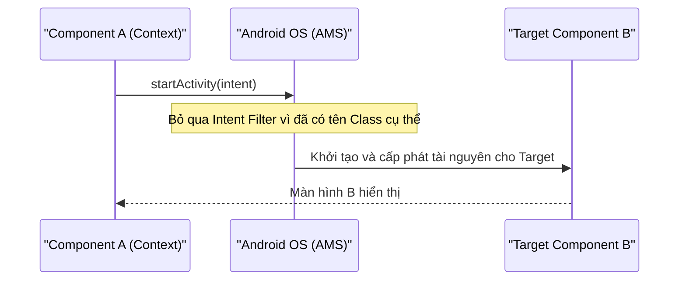

# Explicit Intents

## Vấn đề cần giải quyết

Trong Android, một ứng dụng không phải là một khối monolithic chạy từ hàm `main()` duy nhất. Nó là một tập hợp các Component (Activity, Service, BroadcastReceiver). 

Làm thế nào để Component A yêu cầu hệ thống khởi chạy Component B một cách chính xác tuyệt đối? Làm sao để truyền ngữ cảnh (Context) từ chỗ này sang chỗ khác một cách an toàn mà không bị hệ thống nhầm lẫn với Component của app khác?

**Explicit Intent** sinh ra để giải quyết vấn đề: **"Tôi biết chính xác đích đến là ai, hãy đưa tôi đến đó ngay lập tức."**

## Sau khi học xong

- Giải thích được bản chất và cơ chế hoạt động của Explicit Intent.
- Triển khai được Explicit Intent trong XML/View truyền thống và Jetpack Compose.
- Thiết kế được mô hình điều hướng chuẩn MVVM sử dụng Event-driven navigation.

## Explicit Intent là gì?

**Explicit Intent (Intent tường minh)** là loại Intent mà bạn chỉ định **chính xác tên class** (component) sẽ xử lý nó.

- **Đặc điểm:** Không thông qua bộ lọc (Intent Filter) của hệ thống.
- **Phạm vi:** Thường được sử dụng để điều hướng **bên trong cùng một ứng dụng** (vì bạn biết rõ tên class của mình).
- **Mục đích:** Khởi chạy Activity khác, start một Service, hoặc gửi một Broadcast đến một Receiver cụ thể.

## Cách hoạt động



1. **Khởi tạo:** Cung cấp `Context` hiện tại và `Class` đích.
2. **Yêu cầu OS:** Gọi hàm (ví dụ `startActivity()`). OS (cụ thể là ActivityManagerService - AMS) nhận lệnh.
3. **Thực thi ngay:** Do đã biết đích danh class, AMS không cần dò tìm trong danh sách các app cài đặt, nó trực tiếp khởi tạo (hoặc đem lên foreground) Component B.

## Khi nào nên dùng?

- **NÊN:** Khi bạn muốn mở một màn hình khác trong chính app của mình (ví dụ: từ `HomeActivity` sang `ProfileActivity`).
- **NÊN:** Khi bạn muốn khởi chạy một Background Service của riêng app (ví dụ: `DownloadService`).
- **KHÔNG NÊN:** Khi bạn muốn thực hiện một hành động mở (ví dụ: mở camera, chia sẻ file). Lúc này hãy dùng Implicit Intent.

## Ví dụ thực tế

### 1. Cách dùng cơ bản (Môi trường View/XML)

Nếu bạn code theo phong cách truyền thống (XML + Activity/Fragment):

```kotlin
// Khởi tạo Explicit Intent
// Tham số 1: Context (thường là 'this' trong Activity, hoặc 'requireContext()' trong Fragment)
// Tham số 2: Tên Class của Component đích
val intent = Intent(this, ProfileActivity::class.java)

// (Tuỳ chọn) Gửi kèm dữ liệu
intent.putExtra("USER_ID", 12345)

// Yêu cầu OS khởi chạy
startActivity(intent)
```

### 2. Sử dụng trong Jetpack Compose

Jetpack Compose tập trung vào UI, do đó việc gọi Intent cần lấy `Context` từ CompositionLocal.

```kotlin
@Composable
fun ProfileButton(userId: Int) {
    // Lấy Context an toàn trong Compose
    val context = LocalContext.current

    Button(onClick = {
        // Tạo và chạy Explicit Intent như bình thường
        val intent = Intent(context, ProfileActivity::class.java).apply {
            putExtra("USER_ID", userId)
        }
        context.startActivity(intent)
    }) {
        Text("Mở Profile")
    }
}
```

> [!NOTE]
> **Nhắc nhở:** Trong Compose thuần, người ta thường dùng **Navigation Compose** để chuyển màn hình thay vì dùng Intent mở Activity mới. Explicit Intent trong Compose thường dùng khi bạn cần **rẽ nhánh** sang một luồng legacy (Activity cũ chưa chuyển sang Compose) hoặc gọi một Service.

### 3. Tư duy hệ thống: Gọi Intent trong MVVM

**Câu hỏi phổ biến:** *Ai là người tạo và gọi Intent? ViewModel hay View (Activity/Fragment)?*

**Best Practice:** **ViewModel KHÔNG bao giờ chứa Context (trừ ApplicationContext nhưng cũng nên hạn chế). Do đó, ViewModel KHÔNG bao giờ tạo hay gọi Intent trực tiếp.**

**Luồng chuẩn:**
1. UI (Button) gửi sự kiện click cho ViewModel.
2. ViewModel xử lý logic (nếu có), sau đó đẩy một `State` hoặc `Event` (thường dùng `SharedFlow` hoặc `Channel`) báo cho UI biết "Hãy chuyển sang màn hình B".
3. View (Activity/Fragment/Compose) observe sự kiện này, lấy Context của chính nó và gọi `startActivity(Intent(...))`.

```kotlin
// 1. ViewModel: Chỉ phát ra sự kiện, KHÔNG biết về Intent
class HomeViewModel : ViewModel() {
    private val _navigationEvent = Channel<NavigationEvent>()
    val navigationEvent = _navigationEvent.receiveAsFlow()

    fun onProfileClicked() {
        viewModelScope.launch {
            _navigationEvent.send(NavigationEvent.NavigateToProfile(userId = 123))
        }
    }
}

// 2. UI (Fragment): Đọc sự kiện và thực thi Intent
viewLifecycleOwner.lifecycleScope.launch {
    viewModel.navigationEvent.collect { event ->
        when (event) {
            is NavigationEvent.NavigateToProfile -> {
                val intent = Intent(requireContext(), ProfileActivity::class.java)
                intent.putExtra("ID", event.userId)
                startActivity(intent)
            }
        }
    }
}
```

## Sai lầm thường gặp

### 1. Quên khai báo Target Activity trong `AndroidManifest.xml`

Đây là lỗi phổ biến nhất của người mới học. Nếu gọi Explicit Intent đến một Activity chưa khai báo, ứng dụng sẽ crash ngay lập tức với lỗi `ActivityNotFoundException`.

```xml
<!-- ❌ THIẾU KHAI BÁO NÀY SẼ GÂY CRASH -->
<activity android:name=".ProfileActivity" />
```

### 2. Truyền Activity Context vào ViewModel để gọi `startActivity`

Để dễ dàng chuyển màn hình, một số developer truyền `Activity` hoặc `Context` vào ViewModel. Điều này vi phạm nghiêm trọng kiến trúc MVVM và gây rò rỉ bộ nhớ (Memory Leak) vì ViewModel sống lâu hơn Activity.

- **Giải pháp:** Sử dụng Event-driven navigation như hướng dẫn ở phần MVVM.

### 3. Nhầm lẫn giữa Explicit và Implicit Intent khi mở ứng dụng ngoài

Khi muốn mở một trang web hoặc ứng dụng camera, việc cố gắng chỉ định chính xác class name của Chrome hay Camera mặc định của máy sẽ gây lỗi nếu thiết bị của user không cài app đó hoặc dùng app hãng khác (như Samsung Camera thay vì Google Camera).

- **Giải pháp:** Sử dụng Implicit Intent với Action và Data để OS tự phân giải.

## Lịch sử phát triển

- **Android 1.0 (API 1):** Cơ chế Explicit Intent được giới thiệu ngay từ phiên bản đầu tiên của Android, định hình kiến trúc component rời rạc (decoupled components) thông qua Binder IPC.
- **Android 8.0 (API 26):** Giới hạn nghiêm ngặt Implicit Broadcast để tiết kiệm pin. Hệ thống khuyến khích chuyển sang dùng Explicit Intent (chỉ định rõ class) đối với các Broadcast Receiver đăng ký trong Manifest để đảm bảo hiệu năng.
- **Android 14 (API 34):** Thắt chặt bảo mật. Các ứng dụng khi gửi Explicit Intent đến ứng dụng khác phải đảm bảo ứng dụng đích xuất (export) component đó một cách an toàn, hạn chế các cuộc tấn công tấn công giả mạo component (Component Hijacking).

## Kết nối hệ thống

- **Prerequisites**: `Activity Lifecycle` — hiểu vòng đời Activity để gọi Intent đúng thời điểm.
- **Related Topics**: `Implicit Intents` — giải pháp thay thế khi không biết component đích, `Pending Intent` — ủy quyền thực thi Intent.
- **Downstream Topics**: `Push data and send event via Intent` — cách truyền nhận dữ liệu nâng cao qua Intent.
