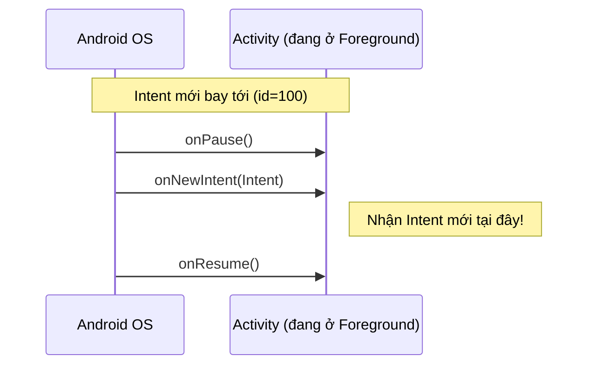

# Xử lý Intent và onNewIntent

## Vấn đề cần giải quyết

Khi một Component (Activity/Fragment) được khởi chạy bởi một Intent, nó cần làm 2 việc chính:
1. Đọc dữ liệu (Data/Extras) mà người gọi gửi đến.
2. (Tùy chọn) Gửi trả lại kết quả (Result) cho người gọi khi nó làm xong việc.

Đặc biệt, nếu Activity **đang chạy sẵn** và bất ngờ nhận thêm một Intent mới (thay vì bị tạo mới hoàn toàn), chuyện gì sẽ xảy ra? Đó là lúc `onNewIntent()` xuất hiện và thường gây ra rất nhiều lỗi khó hiểu (bug logic) cho các lập trình viên.

## 1. Đọc dữ liệu từ Intent

Trong `onCreate()` của Activity, bạn dùng biến `intent` (tương đương `getIntent()`) để lấy dữ liệu.

```kotlin
override fun onCreate(savedInstanceState: Bundle?) {
    super.onCreate(savedInstanceState)
    
    // Đọc Primitive Type
    val productId = intent.getIntExtra("PRODUCT_ID", -1) // -1 là giá trị mặc định nếu ko tìm thấy key
    val productName = intent.getStringExtra("PRODUCT_NAME")
    
    // Đọc Object (Parcelable) - Từ Android 13 (API 33) trở lên cần truyền Class type
    val product = if (Build.VERSION.SDK_INT >= Build.VERSION_CODES.TIRAMISU) {
        intent.getParcelableExtra("EXTRA_PRODUCT", Product::class.java)
    } else {
        @Suppress("DEPRECATION")
        intent.getParcelableExtra("EXTRA_PRODUCT")
    }
}
```

## 2. Nhận kết quả trả về (Activity Result API)

Ngày xưa, chúng ta dùng `startActivityForResult()` và `onActivityResult()`. Cách này hiện đã bị **Deprecated** vì nó khiến code lộn xộn và dễ gây crash khi Activity bị recreate (System kill).

Chuẩn mới hiện nay là **Activity Result API**.

### Trong môi trường View (XML / Fragment)

Quy trình chuẩn: Đăng ký một "hợp đồng" (Contract) **trước khi** Activity được STARTED.

```kotlin
class ProfileActivity : AppCompatActivity() {

    // 1. Đăng ký Contract: Muốn khởi chạy một Activity khác và đợi kết quả
    private val getAvatarLauncher = registerForActivityResult(
        ActivityResultContracts.StartActivityForResult()
    ) { result ->
        if (result.resultCode == Activity.RESULT_OK) {
            val data: Intent? = result.data
            val imageUri = data?.data
            // Cập nhật UI với imageUri
        }
    }

    override fun onCreate(savedInstanceState: Bundle?) {
        super.onCreate(savedInstanceState)
        
        btnChangeAvatar.setOnClickListener {
            // 2. Kích hoạt launcher
            val intent = Intent(Intent.ACTION_PICK, MediaStore.Images.Media.EXTERNAL_CONTENT_URI)
            getAvatarLauncher.launch(intent)
        }
    }
}
```

### Trong môi trường Jetpack Compose

Compose cung cấp hàm `rememberLauncherForActivityResult` vô cùng tiện lợi:

```kotlin
@Composable
fun AvatarPicker() {
    val context = LocalContext.current
    var avatarUri by remember { mutableStateOf<Uri?>(null) }

    // 1. Đăng ký Launcher
    val launcher = rememberLauncherForActivityResult(
        contract = ActivityResultContracts.StartActivityForResult()
    ) { result ->
        if (result.resultCode == Activity.RESULT_OK) {
            avatarUri = result.data?.data
        }
    }

    Button(onClick = {
        // 2. Kích hoạt
        val intent = Intent(Intent.ACTION_PICK, MediaStore.Images.Media.EXTERNAL_CONTENT_URI)
        launcher.launch(intent)
    }) {
        Text("Chọn Ảnh")
    }
}
```

---

## 3. Bí ẩn của onNewIntent() và Launch Modes

### Sự cố thường gặp
Giả sử bạn có màn hình `NotificationActivity`. Khi người dùng đang mở app và đứng sẵn ở màn hình này, có một thông báo Push Notification bắn tới. Họ bấm vào thông báo (chứa Intent đẩy data id=100) -> OS điều hướng họ đến `NotificationActivity`.

**Lỗi:** Bạn debug và thấy màn hình không cập nhật nội dung của id=100. Nó vẫn hiển thị nội dung cũ. Khi bạn gọi `intent.getIntExtra("id", -1)`, nó vẫn trả về ID của thông báo cũ từ hôm qua!

### Tại sao lại như vậy?

Do cấu hình **Launch Mode** trong Manifest, nếu Activity của bạn là `singleTop`, `singleTask`, hoặc `singleInstance`:
Khi Component B **đang hiển thị trên cùng** (top of stack) và một Intent mới gọi đến B, hệ điều hành sẽ **KHÔNG tạo ra instance mới** (không gọi `onCreate()`).

Thay vào đó, nó tái sử dụng instance cũ và chuyển Intent mới vào hàm `onNewIntent(intent)`.



### Cái bẫy của getIntent()

Khi `onNewIntent(intent)` được gọi, biến `intent` gốc của Activity (được trả về bởi hàm `getIntent()`) **KHÔNG tự động cập nhật**. Nó vẫn trỏ vào cái Intent khai sinh ra Activity từ lúc `onCreate()`.

**Cách xử lý ĐÚNG CHUẨN:**
Bạn BẮT BUỘC phải gọi `setIntent(intent)` bên trong `onNewIntent` để ghi đè Intent cũ.

```kotlin
class NotificationActivity : AppCompatActivity() {

    override fun onCreate(savedInstanceState: Bundle?) {
        super.onCreate(savedInstanceState)
        // Lần đầu tạo Activity, đọc Intent gốc
        handleIntentData(intent)
    }

    // Hàm này CHỈ gọi khi Activity ĐANG SỐNG và nhận Intent mới
    override fun onNewIntent(intent: Intent?) {
        super.onNewIntent(intent)
        
        // 1. CẬP NHẬT LẠI INTENT GỐC CỦA ACTIVITY (Cực kỳ quan trọng)
        setIntent(intent) 
        
        // 2. Xử lý dữ liệu mới
        intent?.let { handleIntentData(it) }
    }

    private fun handleIntentData(intent: Intent) {
        val notifId = intent.getIntExtra("NOTIF_ID", -1)
        // Load data từ API hoặc hiển thị ra UI theo notifId
    }
}
```

### Phân tích nhanh các Launch Mode ảnh hưởng đến onNewIntent

- **standard (mặc định):** Mỗi lần gọi Intent là tạo ra instance mới, gọi `onCreate()`. Cứ gọi là xếp chồng lên nhau. Khỏi quan tâm `onNewIntent`.
- **singleTop:** Nếu B đang ở **trên cùng** stack -> GỌI `onNewIntent()`. Nếu B ở dưới A -> Tạo B mới, gọi `onCreate()`.
- **singleTask:** Chỉ có duy nhất 1 B trong toàn bộ Task. Nếu gọi B, mọi Activity nằm trên B bị pop ra khỏi stack (xóa sạch), đưa B lên đỉnh và GỌI `onNewIntent()`. Cực kỳ hữu dụng cho màn hình Home/Dashboard.

## Tổng kết

Việc hiểu luồng dữ liệu (vào qua `onCreate` hoặc `onNewIntent`, ra qua `Activity Result API`) là cốt lõi để làm chủ ứng dụng Android. Luôn nhớ nguyên tắc vàng: **Nếu dùng Launch Mode để tái sử dụng Activity, bạn phải override `onNewIntent()` và nhớ gọi `setIntent(intent)`.**
