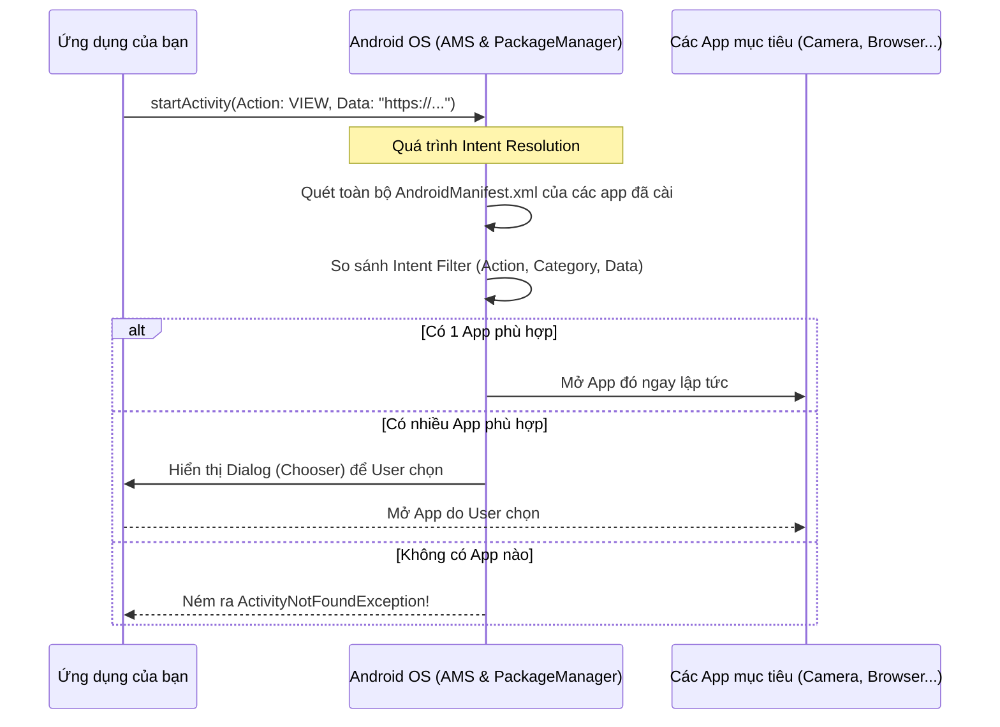

# Implicit Intents

## Vấn đề cần giải quyết

Giả sử ứng dụng của bạn cần chụp một bức ảnh để làm avatar người dùng. Bạn có hai lựa chọn:
1. Tự viết toàn bộ giao diện Camera, tự giao tiếp với phần cứng Camera, tự xử lý lưu file. (Quá tốn thời gian, dễ sinh bug).
2. "Nhờ" một ứng dụng Camera đã có sẵn trong máy chụp ảnh giùm và trả kết quả về.

Nhưng làm sao bạn biết thiết bị của người dùng đang cài app Camera nào? (Họ dùng app mặc định của Samsung, Xiaomi, hay tải B612 từ Store?). Bạn không thể biết **tên class** của app đích để dùng Explicit Intent.

**Implicit Intent (Intent không tường minh)** ra đời để giải quyết vấn đề: **"Tôi cần một ai đó thực hiện việc này (chụp ảnh), tôi không quan tâm ai làm, miễn là làm được."**

## Implicit Intent là gì?

**Implicit Intent** là loại Intent mà bạn không truyền tên Component (Class) cụ thể, thay vào đó, bạn khai báo một **Hành động (Action)** và loại **Dữ liệu (Data)** mà hành động đó cần thực thi.

Hệ điều hành Android (cụ thể là `PackageManager` và `ActivityManagerService`) sẽ đứng ra làm trung gian: dò tìm toàn bộ các app trong máy xem app nào có khả năng xử lý hành động này, và đưa ra danh sách cho người dùng chọn (hoặc mở ngay nếu chỉ có 1 app xử lý được).

## Cơ chế OS Resolve Implicit Intent

Khi bạn gọi `startActivity(implicitIntent)`, quá trình sau sẽ diễn ra dưới hệ thống:



Đây gọi là quá trình **Intent Resolution** (Phân giải Intent). Hệ thống so sánh 3 thành phần chính:
1. **Action:** (VD: `ACTION_VIEW`, `ACTION_SEND`, `ACTION_DIAL`).
2. **Data (URI & MIME Type):** (VD: URL web `https://...`, số điện thoại `tel:123`, kiểu file `image/jpeg`).
3. **Category:** (Thường mặc định là `CATEGORY_DEFAULT`).

## Hướng dẫn triển khai thực tế

### 1. Mở một trang Web (Browser)

**Vấn đề:** Ứng dụng muốn mở link điều khoản sử dụng.

```kotlin
fun openWebPage(url: String, context: Context) {
    val webpage: Uri = Uri.parse(url)
    val intent = Intent(Intent.ACTION_VIEW, webpage)
    
    // RẤT QUAN TRỌNG: Luôn kiểm tra xem có app nào xử lý được không trước khi start
    // Từ Android 11 (API 30), cần khai báo <queries> trong Manifest để check resolveActivity
    if (intent.resolveActivity(context.packageManager) != null) {
        context.startActivity(intent)
    } else {
        // Hiển thị Toast thông báo người dùng cài trình duyệt
    }
}
```

### 2. Chia sẻ Text (Share Action)

**Vấn đề:** Muốn người dùng chia sẻ một đoạn văn bản (mã giới thiệu) qua Zalo, Messenger, Email...

```kotlin
fun shareText(textToShare: String, context: Context) {
    val sendIntent = Intent().apply {
        action = Intent.ACTION_SEND
        putExtra(Intent.EXTRA_TEXT, textToShare)
        type = "text/plain" // Rất quan trọng để OS biết loại dữ liệu
    }

    // Luôn luôn tạo một "Chooser" để hiển thị danh sách app đẹp mắt, 
    // thay vì tin tưởng vào app mặc định của người dùng.
    val shareIntent = Intent.createChooser(sendIntent, "Chia sẻ mã qua...")
    context.startActivity(shareIntent)
}
```

### 3. Gửi Email

```kotlin
fun composeEmail(addresses: Array<String>, subject: String, context: Context) {
    val intent = Intent(Intent.ACTION_SENDTO).apply {
        data = Uri.parse("mailto:") // Chỉ các app email mới xử lý được
        putExtra(Intent.EXTRA_EMAIL, addresses)
        putExtra(Intent.EXTRA_SUBJECT, subject)
    }
    if (intent.resolveActivity(context.packageManager) != null) {
        context.startActivity(intent)
    }
}
```

## Các lưu ý / Lỗi thường gặp (Pitfalls)

> [!CAUTION]
> **Crash `ActivityNotFoundException`**
> Lỗi phổ biến nhất khi dùng Implicit Intent là app bị văng khi không có ứng dụng nào trên thiết bị xử lý được Intent đó (Ví dụ: gọi `ACTION_DIAL` trên máy tính bảng không có tính năng nghe gọi). **Luôn bọc trong try-catch hoặc dùng `resolveActivity` trước khi gọi `startActivity`.**

> [!WARNING]
> **Package Visibility (Android 11+)**
> Từ Android 11 (API level 30), Google siết chặt quyền riêng tư. Hàm `resolveActivity()` sẽ luôn trả về `null` trừ khi bạn khai báo những package hoặc intent mà bạn muốn "nhìn thấy" trong file `AndroidManifest.xml` qua thẻ `<queries>`.

**Ví dụ sửa lỗi Package Visibility:**
Trong `AndroidManifest.xml`:
```xml
<queries>
    <!-- Cho phép dò tìm các app có khả năng mở URL web -->
    <intent>
        <action android:name="android.intent.action.VIEW" />
        <data android:scheme="https" />
    </intent>
</queries>
```

## Tổng kết

Implicit Intent giúp hệ sinh thái Android trở nên linh hoạt và liên kết mạnh mẽ giữa các ứng dụng với nhau. Khi sử dụng, hãy chú ý cung cấp đúng Action và Data/MIME Type, đồng thời luôn có phương án fallback (xử lý lỗi) trong trường hợp thiết bị người dùng không có ứng dụng phù hợp.
