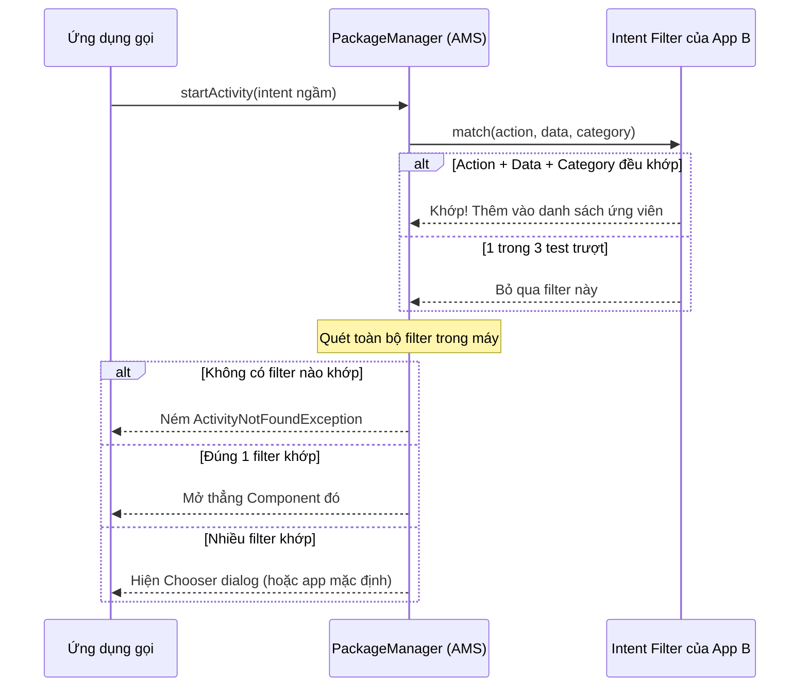

# Intent Filters (Matching Rules Deep-dive)

## Vấn đề cần giải quyết

Ở bài trước ([Implicit Intents](implicit_intents.md)), hệ điều hành có thể dò tìm app nào "đủ khả năng" xử lý một Intent ngầm (mở link, share text, quét mã...). Câu hỏi đặt ra là: **Làm sao OS biết được app của bạn có khả năng làm những việc đó?**

Giả sử bạn làm app thương mại điện tử, user bấm vào link `https://shop.com/promo/2026` từ tin nhắn Zalo. Ai sẽ mở link này?

- Nếu app của bạn **không khai báo gì** → trình duyệt mặc định mở, app bạn biến mất.
- Nếu app của bạn **khai báo Intent Filter đúng** → OS liệt kê cả app bạn lẫn trình duyệt để user chọn.

**Intent Filter (Bộ lọc Intent)** chính là "tấm biển quảng cáo" bạn treo trước mỗi Component để nói với OS: *"Tôi có thể xử lý dạng việc này!"* Hiểu sâu cơ chế khớp (matching) của nó quyết định app của bạn có **được liệt kê đúng chỗ** hay **hiện ra lung tung gây khó chịu** cho user.

## Intent Filter là gì?

**Intent Filter** là thẻ `<intent-filter>` khai báo **bên trong** các Component (`<activity>`, `<service>`, `<receiver>`) trong file `AndroidManifest.xml`. Nó quy định tập hợp các **Implicit Intent** mà Component đó chấp nhận.

> [!NOTE]
> Component **không** khai báo Intent Filter (chỉ có tên class) thì **chỉ có thể** được gọi bằng Explicit Intent (gọi đích danh class).

> [!WARNING]
> Intent Filter **KHÔNG phải tường lửa bảo mật**. Nó chỉ giới hạn Implicit Intent. App khác vẫn có thể dùng Explicit Intent để khởi chạy Component **exported** của bạn nếu biết tên package + class.

## Khi nào nên / không nên dùng

| Tình huống | Dùng Intent Filter? |
| --- | --- |
| App nhận dữ liệu từ app khác/hệ thống (Share, View file/link, Scan QR, Dial...) | ✅ Nên |
| App đăng ký thành handler mặc định cho một loại link (Deep Link / App Links) | ✅ Nên |
| Điều hướng nội bộ trong app (màn hình A → màn hình B) | ❌ Không — dùng Explicit Intent hoặc Navigation Component |
| Nhận dữ liệu nhạy cảm / riêng tư | ❌ Không — dùng Explicit Intent + Signature Permission |
| "Tôi muốn app hiện ra mọi lúc" | ❌ Không — filter càng rộng càng gây rác UX và rủi ro bảo mật |

## Cấu trúc Intent Filter

Một `<intent-filter>` chứa 3 nhóm thành phần + thuộc tính priority:

| Thành phần | Mô tả | Ví dụ |
| --- | --- | --- |
| `<action>` | Hành động Component thực hiện được | `android.intent.action.VIEW`, `android.intent.action.SEND` |
| `<category>` | Ngữ cảnh bổ sung | `android.intent.category.DEFAULT`, `BROWSABLE` |
| `<data>` | Định dạng dữ liệu chấp nhận | scheme `https`, host `shop.com`, mimeType `text/plain` |
| `android:priority` | Độ ưu tiên khi nhiều filter cùng match (chỉ áp dụng implicit) | `-1000`..`1000`, mặc định `0` |

## Cơ chế khớp (Matching Rules) — Deep-dive

Để một Implicit Intent kích hoạt được Component, nó phải vượt qua **CẢ 3 bài test** của filter: **Action → Data → Category** (đúng thứ tự kiểm tra trong `IntentFilter.match()`).



### 1. Test Action

Filter khai báo **0 hoặc nhiều** `<action>`. Luật:

- **Action trong Intent phải nằm trong danh sách action của filter** thì mới qua.
- ⚠️ **Edge case:** Filter **không khai báo action nào** → mọi Intent (có action) đều trượt bài test này. Đây là lỗi "filter chết" cổ điển.
- ⚠️ **Edge case ngược:** Intent **không mang action** → vẫn qua được test action **miễn là filter có ít nhất 1 action**.

```xml
<intent-filter>
    <action android:name="android.intent.action.VIEW" />
    <action android:name="android.intent.action.EDIT" />
</intent-filter>
```

### 2. Test Category

Luật ngược với action:

- **MỌI category trong Intent phải nằm trong filter.** Filter có thể khai báo **nhiều category hơn** Intent, nhưng **không được thiếu** cái nào Intent có.
- Intent **không có category nào** → luôn pass, bất kể filter khai báo gì.

> [!IMPORTANT]
> Hệ thống **tự động thêm** `android.intent.category.DEFAULT` vào mọi Implicit Intent gửi qua `startActivity()`/`startActivityForResult()`. Vì vậy filter muốn nhận implicit intent **BẮT BUỘC** phải khai báo `android.intent.category.DEFAULT`. Ngoại lệ duy nhất là Launcher Activity (màn hình chính) dùng `CATEGORY_LAUNCHER`.

### 3. Test Data (phức tạp nhất)

`<data>` có thể chứa: `scheme`, `host`, `port`, `path` / `pathPrefix` / `pathPattern`, `mimeType`, `ssp` (scheme specific part). Có hai mặt: **so khớp URI** và **so khớp MIME type**.

**So khớp URI** — chỉ so sánh đúng phần filter khai báo:

| Filter khai báo | Intent khớp khi |
| --- | --- |
| Chỉ `scheme` | URI có cùng scheme (bất kể host/path) |
| `scheme` + `host` | URI cùng scheme + host (bất kể path) |
| `scheme` + `host` + `path` | URI khớp cả 3 (path có thể dùng wildcard `*`) |

**So khớp MIME type** — hỗ trợ wildcard subtype: `text/*` khớp `text/plain`, `text/html`; `*/*` khớp mọi loại.

> [!WARNING]
> Scheme, host, path và MIME type đều so khớp **CASE-SENSITIVE** (khác với chuẩn RFC). Luôn dùng **chữ thường**: `https`, `shop.com`, `text/plain`. Dùng chữ hoa là lỗi tinh vi khó debug.

**4 luật chính thức quyết định match/trượt** (từ Official Docs):

1. Intent **không URI, không MIME** → pass **chỉ khi** filter cũng không khai báo URI/MIME nào.
2. Intent **có URI, không MIME** → pass **chỉ khi** URI khớp filter **VÀ** filter **không** khai báo MIME type.
3. Intent **có MIME, không URI** → pass **chỉ khi** filter khai báo đúng MIME đó **VÀ không** khai báo URI format.
4. Intent **có cả URI + MIME** → phần MIME phải khớp type trong filter; phần URI khớp khi: URI khớp URI trong filter, **HOẶC** URI là `content:`/`file:` và filter chỉ khai báo MIME (hệ thống mặc định cho rằng Component hỗ trợ `content:`/`file:` khi filter chỉ có MIME).

> [!TIP]
> **Hệ quả thực tế:** Nếu bạn muốn app mở được cả 2 loại dữ liệu "link web" và "file cục bộ", đừng dồn chung một filter. Tạo **nhiều filter riêng** — mỗi filter một bộ (action + category + data) khác nhau. Một filter với nhiều `<data>` nghĩa là "nhận **bất kỳ tổ hợp nào**" của chúng.

### Priority & Resolution

Khi **nhiều filter** cùng khớp, OS sắp xếp theo `android:priority` (cao hơn thắng, chỉ áp dụng cho implicit intent):

- **0 filter khớp** → `ActivityNotFoundException`.
- **1 filter khớp** → mở thẳng Component.
- **n filter khớp** → hiện **Chooser** (hoặc mở thẳng app mặc định nếu user đã chọn "Luôn luôn").

## Hướng dẫn triển khai thực tế

### Bài toán 1: Nhận "Chia sẻ Text" (Share Target)

App ghi chú muốn hiện ra khi user Share văn bản từ Chrome/Zalo.

**Manifest:**

```xml
<activity
    android:name=".CreateNoteActivity"
    android:exported="true">

    <intent-filter>
        <action android:name="android.intent.action.SEND" />
        <category android:name="android.intent.category.DEFAULT" />
        <data android:mimeType="text/plain" />
    </intent-filter>
</activity>
```

> [!WARNING]
> Từ **Android 12 (API 31)**, Component có `<intent-filter>` phải khai báo **`android:exported="true"`** nếu muốn app khác gọi được. Không khai báo → app bị văng `SecurityException` khi cài/nhận intent.

**Xử lý trong Activity (theo luật Data rule 3):**

```kotlin
class CreateNoteActivity : AppCompatActivity() {

    override fun onCreate(savedInstanceState: Bundle?) {
        super.onCreate(savedInstanceState)
        handleSharedText(intent)
    }

    private fun handleSharedText(intent: Intent?) {
        if (intent?.action != Intent.ACTION_SEND) return
        val sharedText = intent.getStringExtra(Intent.EXTRA_TEXT)
        if (sharedText.isNullOrBlank()) {
            showError()
            return
        }
        viewModel.saveNote(sharedText)
    }
}
```

### Bài toán 2: Deep Link — mở App từ URL

User bấm `https://shop.com/promo/2026` → mở thẳng màn hình khuyến mãi của app.

**Manifest:**

```xml
<activity
    android:name=".PromoActivity"
    android:exported="true">
    <intent-filter>
        <action android:name="android.intent.action.VIEW" />
        <category android:name="android.intent.category.DEFAULT" />
        <category android:name="android.intent.category.BROWSABLE" />
        <data
            android:scheme="https"
            android:host="shop.com"
            android:pathPrefix="/promo" />
    </intent-filter>
</activity>
```

`BROWSABLE` cho phép intent đến từ trình duyệt web. Lưu ý luật URI: filter khai báo đủ scheme + host + pathPrefix nên chỉ URL `https://shop.com/promo/...` mới khớp.

### Bài toán 3: App Links — mở thẳng, không hiện chooser

Deep Link vẫn hiện hộp thoại "Chọn app hay Browser". **App Links** (Android 6.0+) loại bỏ bước này bằng cách **xác minh quyền sở hữu domain**.

**Bước 1 — Manifest bật autoVerify:**

```xml
<activity android:name=".PromoActivity" android:exported="true">
    <intent-filter android:autoVerify="true">
        <action android:name="android.intent.action.VIEW" />
        <category android:name="android.intent.category.DEFAULT" />
        <category android:name="android.intent.category.BROWSABLE" />
        <data android:scheme="https" android:host="shop.com" />
    </intent-filter>
</activity>
```

> [!NOTE]
> Chỉ có **`https` (và `http`)** mới được auto-verify. `autoVerify` đặt trên **mỗi** `<intent-filter>` muốn xác minh.

**Bước 2 — Host file `assetlinks.json` trên server** tại `https://shop.com/.well-known/assetlinks.json`:

```json
[
  {
    "relation": ["delegate_permission/common.handle_all_urls"],
    "target": {
      "namespace": "android_app",
      "package_name": "com.yourshop.app",
      "sha256_cert_fingerprints": [
        "14:6D:E9:83:C5:73:06:50:D8:EE:B9:95:2F:34:FC:64:AD:A6:92:4B:AD:5E:10:0C:7A:98:3C:CD:1A:8D:2F"
      ]
    }
  }
]
```

Lấy `sha256_cert_fingerprints` (signing certificate, không phải SHA-1) bằng:

```bash
keytool -list -v -keystore release.jks -alias your_alias
```

Sau khi verify thành công, link mở thẳng vào app **không hiện chooser**, và trong `dumpsys` trạng thái `android:autoVerify="true"` hiển thị là **"verified"**. Nếu server chưa có file hoặc fingerprint sai → tự động hạ cấp về Deep Link (vẫn hiện chooser).

### Bài toán 4: Tích hợp MVVM + Deep Link vào project thực tế

**Luồng dữ liệu:** Deep Link → Activity (Presentation) → ViewModel (UI State) → Repository (Data).

**Activity xử lý cả 2 đường (cold start + warm start):**

```kotlin
class PromoActivity : AppCompatActivity() {

    private val viewModel: PromoViewModel by viewModels()

    override fun onCreate(savedInstanceState: Bundle?) {
        super.onCreate(savedInstanceState)
        // Lần đầu tạo: đọc từ onCreate
        handleDeepLink(intent)
    }

    override fun onNewIntent(intent: Intent) {
        super.onNewIntent(intent)
        // Activity đang sống: PHẢI setIntent lại để intent mới nhất
        setIntent(intent)
        handleDeepLink(intent)
    }

    private fun handleDeepLink(intent: Intent?) {
        val promoId = intent?.data?.getQueryParameter("promoId")
            ?: intent?.data?.lastPathSegment
        if (promoId != null) viewModel.loadPromo(promoId)
    }
}
```

```kotlin
class PromoViewModel(private val repository: PromoRepository) : ViewModel() {

    private val _uiState = MutableStateFlow<PromoUiState>(PromoUiState.Loading)
    val uiState: StateFlow<PromoUiState> = _uiState

    fun loadPromo(promoId: String) {
        viewModelScope.launch {
            _uiState.value = PromoUiState.Loading
            _uiState.value = repository.getPromo(promoId)
                .fold(
                    onSuccess = { PromoUiState.Success(it) },
                    onFailure = { PromoUiState.Error(it.message) }
                )
        }
    }
}
```

## Các lỗi thường gặp (Pitfalls)

> [!DANGER]
> **Quên `CATEGORY_DEFAULT`** — Filter có đủ action + data chuẩn nhưng `startActivity()` vẫn ném `ActivityNotFoundException`. Hệ thống luôn nhét ngầm `CATEGORY_DEFAULT` vào implicit intent, filter thiếu nó là trượt test category.

> [!DANGER]
> **Khai báo `mimeType="*/*"`** — App hiện ra ở **mọi** hộp thoại Share của máy, gây rác trải nghiệm. Càng tệ hơn, app nhận cả video/ảnh mà bạn không code xử lý → crash lúc runtime.

> [!DANGER]
> **Quên `android:exported` (Android 12+)** — App bị văng ngay khi hệ thống cài/intent đầu tiên tới, kèm log `SecurityException`.

> [!WARNING]
> **Filter quá rộng** — Khai `scheme="http"` trần (không host) nghĩa là app bạn xuất hiện khi mở **mọi** link http trên máy. Luôn kèm `host` (và lý tưởng là `pathPrefix`).

> [!WARNING]
> **Nhầm Deep Link với App Links** — Không có `autoVerify` + `assetlinks.json` thì link vẫn hiện chooser, user phải chọn "Luôn luôn" thủ công.

> [!TIP]
> **MIME chỉ `text/plain` thì đừng mong mở file cục bộ** — Theo rule 4, filter chỉ có MIME mới ngầm hỗ trợ `content:`/`file:`. Nếu muốn nhận link https + file PDF, tách **2 filter riêng**.

## Testing Intent Filter

```bash
# 1. Test Deep Link: giả lập user bấm link
adb shell am start -a android.intent.action.VIEW \
    -d "https://shop.com/promo/2026" com.yourshop.app

# 2. Test Share Target: gửi text như app khác
adb shell am start -a android.intent.action.SEND \
    --es android.intent.extra.TEXT "Xin chào" -t "text/plain" \
    com.yourshop.app

# 3. Xem danh sách filter của package (kiểm tra sau khi verify App Links)
adb shell dumpsys package com.yourshop.app | grep -A 20 "Intent Filter"

# 4. Hỏi hệ thống app nào nhận một intent cụ thể
adb shell cmd package query-activities \
    -a android.intent.action.VIEW -d "https://shop.com/promo/1"
```

**Unit test filter thuần** (không cần thiết bị):

```kotlin
@Test
fun filterMatchesShareTextIntent() {
    val filter = IntentFilter(Intent.ACTION_SEND).apply {
        addCategory(Intent.CATEGORY_DEFAULT)
        addDataType("text/plain")
    }
    val intent = Intent(Intent.ACTION_SEND).setType("text/plain")

    // Mỗi thành phần phải match (khác hằng số NO_MATCH_*)
    assertNotEquals(IntentFilter.NO_MATCH_ACTION, filter.matchAction(intent.action))
    assertNotEquals(IntentFilter.NO_MATCH_TYPE, filter.matchData(
        intent.type, intent.scheme, intent.data
    ))
    assertTrue(filter.matchCategories(intent.categories) == null)
}
```

> [!NOTE]
> Từ **Android 11 (API 30)**, để `resolveActivity()`/`queryIntentActivities()` nhìn thấy filter của app khác, phải khai báo `<queries>` trong manifest của app gọi. Đây là cơ chế Package Visibility.

## Tư duy hệ thống

Intent Filter nằm ở **tầng Manifest / Presentation** của kiến trúc — nó chỉ là "cửa ngõ" nhận Intent, **không** chứa logic nghiệp vụ. Pattern chuẩn trong project MVVM / Single-Activity:

1. **Manifest:** khai báo filter (cửa ngõ đón implicit intent).
2. **Activity:** tối giản — chỉ trích xuất dữ liệu từ `intent.data`/extras và đẩy xuống ViewModel (`onCreate` + `onNewIntent` + `setIntent`).
3. **ViewModel:** biến dữ liệu thô thành UI State; chịu trách nhiệm gọi Repository.
4. **Repository/Data:** nguồn dữ liệu thật sự (API, Room...).

Giữ filter hẹp, Activity mỏng, logic nghiệp vụ ở ViewModel/Repository — đây là điểm khác biệt giữa code "chạy được" và code "dễ bảo trì".

## Tổng kết

Intent Filter là cơ chế phân loại implicit intent của Android: **Action** (làm gì), **Category** (trong ngữ cảnh nào), **Data** (trên dữ liệu gì). Nắm vững 3 bài test — đặc biệt 4 luật Data test và việc so khớp case-sensitive — giúp bạn khai báo filter **đủ hẹp để đúng chỗ, đủ rộng để không sót**, và biết khi nào dùng Deep Link hay nâng cấp lên App Links để trải nghiệm mượt mà hơn.

## Nguồn tham khảo

- Android Developers — [Intents and intent filters](https://developer.android.com/guide/components/intents-filters)
- Android Developers — [IntentFilter API reference](https://developer.android.com/reference/android/content/IntentFilter)
- Android Developers — [Handle Android app links](https://developer.android.com/training/app-links)
- Android Developers — [Verify Android App Links](https://developer.android.com/training/app-links/verify-android-applinks)
