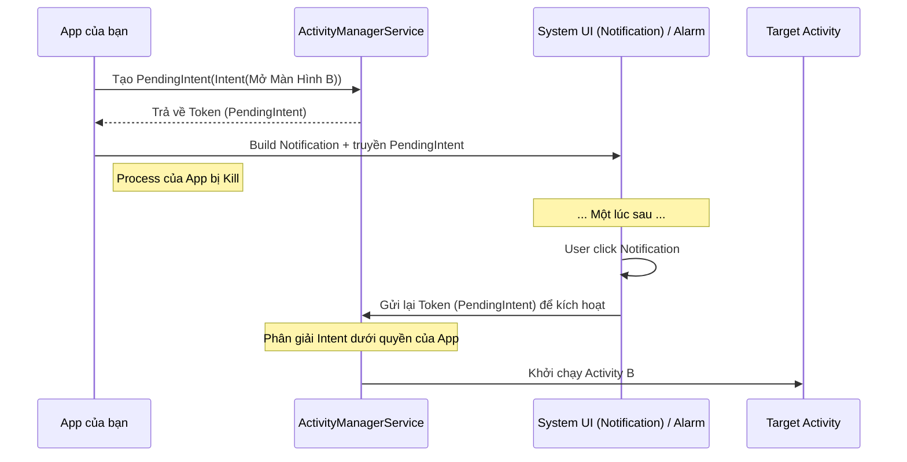

# Pending Intent: Cơ chế Ủy quyền (Delegation)

## Vấn đề cần giải quyết

Khi bạn hiển thị một thông báo (Notification) lên thanh trạng thái của điện thoại, và người dùng bấm vào đó, bạn muốn mở một màn hình trong app của mình.

**Câu hỏi:** Ai là người lắng nghe sự kiện click đó và kích hoạt Intent? Có phải app của bạn không?

**Trả lời:** KHÔNG. Ứng dụng của bạn có thể đã bị hệ thống kill (tắt hoàn toàn) từ đời nào rồi. Thanh thông báo (Status Bar) thuộc quyền quản lý của **System UI** (Một process riêng biệt của Hệ điều hành).

Vậy làm sao một process của OS (System UI) có thể gọi một Intent mở Activity của app bạn, **dưới tư cách và quyền hạn của chính app bạn** (ngay cả khi app đang không chạy)?

Đó là lý do **PendingIntent** ra đời.

## PendingIntent là gì?

**PendingIntent** thực chất là một "tờ giấy ủy quyền".

Bạn đóng gói một Intent bình thường vào trong PendingIntent, sau đó đưa nó cho một ứng dụng khác (thường là System OS). Bạn bảo hệ thống rằng: *"Hãy cầm tờ giấy ủy quyền này. Khi nào sự kiện X xảy ra (user bấm thông báo, hoặc đến đúng 7h sáng), hãy thực thi cái Intent bên trong tờ giấy này. Và quan trọng nhất: Hãy thực thi nó bằng **chính danh tính và quyền (permissions)** của tôi, chứ không phải của anh."*

## Cơ chế hoạt động



## Khi nào phải dùng PendingIntent?

1. **Notification:** Khi người dùng click vào thông báo (System UI process).
2. **AlarmManager:** Hẹn giờ chạy một tác vụ trong tương lai (ví dụ báo thức). OS sẽ giữ PendingIntent và kích hoạt nó khi đồng hồ điểm.
3. **AppWidget (Home Screen Widget):** Khi người dùng tương tác với widget trên màn hình chính (Launcher process).

## Hướng dẫn triển khai (Ví dụ Notification)

```kotlin
// 1. Tạo Intent bình thường muốn kích hoạt
val intent = Intent(context, NotificationDetailActivity::class.java).apply {
    putExtra("NOTIF_ID", 100)
    // Nếu app đang đóng, intent này sẽ mở app.
    // Nếu app đang mở, cần cờ để tránh tạo 2 màn hình giống nhau (hoặc xử lý ở onNewIntent)
    flags = Intent.FLAG_ACTIVITY_NEW_TASK or Intent.FLAG_ACTIVITY_CLEAR_TASK
}

// 2. Đóng gói vào PendingIntent
// RequestCode (ví dụ: 0) dùng để phân biệt các PendingIntent khác nhau
val pendingIntent: PendingIntent = PendingIntent.getActivity(
    context,
    0, // requestCode
    intent,
    PendingIntent.FLAG_IMMUTABLE or PendingIntent.FLAG_UPDATE_CURRENT
)

// 3. Đưa PendingIntent cho System UI qua NotificationCompat
val builder = NotificationCompat.Builder(context, CHANNEL_ID)
    .setSmallIcon(R.drawable.ic_notification)
    .setContentTitle("Tin nhắn mới")
    .setContentText("Bạn có 1 tin nhắn chưa đọc.")
    .setPriority(NotificationCompat.PRIORITY_DEFAULT)
    // Ủy quyền cho System UI kích hoạt pendingIntent khi click
    .setContentIntent(pendingIntent) 
    .setAutoCancel(true)
```

## Bảo mật và Flags (Cực kỳ quan trọng từ Android 12)

Kể từ Android 12 (API 31), Google **BẮT BUỘC** bạn phải khai báo rõ ràng một PendingIntent là **MUTABLE** (có thể bị sửa đổi) hay **IMMUTABLE** (bất biến). Nếu quên, app sẽ crash ngay lập tức.

### Tại sao lại quan trọng? (Vấn đề bảo mật)
Khi bạn đưa PendingIntent cho một app thứ 3 (không phải OS), app thứ 3 đó có thể cố tình lôi cái Intent bên trong ra, thay đổi Data/Action của nó để làm việc xấu (dưới danh nghĩa app của bạn).

### 1. `PendingIntent.FLAG_IMMUTABLE` (Nên dùng 99% các trường hợp)
- **Ý nghĩa:** Intent bên trong bị "đóng băng". Không ai có quyền thêm, bớt, sửa đổi data (`extras`) của nó trước khi nó được kích hoạt.
- **Sử dụng:** Cho Notification mở màn hình bình thường, AlarmManager chạy Service.

### 2. `PendingIntent.FLAG_MUTABLE` (Chỉ dùng khi bắt buộc)
- **Ý nghĩa:** Cho phép app nhận PendingIntent có quyền "nhét thêm" dữ liệu vào trước khi kích hoạt.
- **Ví dụ bắt buộc dùng:** Chức năng **Direct Reply Notification** (Trả lời tin nhắn trực tiếp ngay trên thanh thông báo). System UI cần nhét cái đoạn text người dùng vừa gõ vào Intent của bạn trước khi bắn về app của bạn. Nếu bạn đặt `IMMUTABLE`, System UI không thể nhét text vào được.

### 3. Cờ cập nhật
Thường dùng kèm với IMMUTABLE/MUTABLE:
- `FLAG_UPDATE_CURRENT`: Nếu đã có một PendingIntent giống hệt tồn tại, hãy giữ nguyên nó nhưng thay thế cái `extras` bên trong bằng cái mới nhất. Rất hay dùng cho Notification để khi có thông báo mới (cùng ID) thì data truyền đi không bị cũ.

## Tổng kết

Nhắc đến PendingIntent, hãy nhớ ngay từ khóa **"Ủy quyền"**. Nó là cầu nối an toàn giúp các tiến trình hệ thống (OS, Launcher) có thể thực thi các hành động giùm ứng dụng của bạn ngay cả khi ứng dụng không còn tồn tại trên RAM. Hãy luôn tuân thủ nguyên tắc bảo mật: Mặc định luôn sử dụng `FLAG_IMMUTABLE` trừ khi có lý do thực sự chính đáng.
