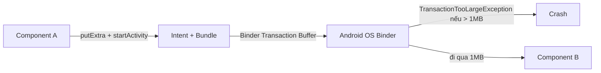
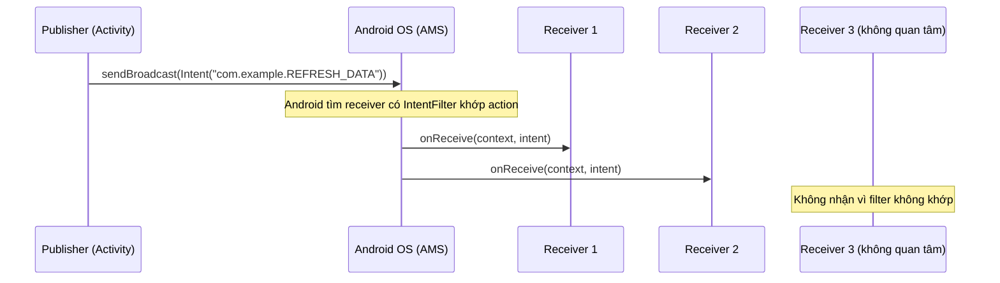

# Truyền dữ liệu và gửi sự kiện qua Intent

## Vấn đề cần giải quyết

Intent trong Android làm hai nhiệm vụ quan trọng:

1. **Push Data** — Chở dữ liệu từ Component A (Activity/Fragment/Service) sang Component B.
2. **Send Event** — Gửi tín hiệu báo "một sự kiện đã xảy ra" đến các Component quan tâm, để chúng phản ứng.

Hai nhiệm vụ này có bản chất khác nhau:

- **Push Data** hướng tới một đối tượng cụ thể (`startActivity`, `startService`). Bạn biết *ai* sẽ nhận.
- **Send Event** hướng tới một nhóm không xác định (broadcast). Bạn gửi đi một tín hiệu, và bất kỳ ai đang lắng nghe kênh đó đều nhận được. Sender không cần biết *ai* sẽ nhận.

Nếu bạn nhầm lẫn hai mục đích này, bạn sẽ viết code đúng cú pháp nhưng sai về thiết kế: dùng `startActivity` để "gửi sự kiện" cho cả hệ thống, hoặc dùng broadcast để "chở một object lớn" từ màn hình này sang màn hình kia.

> [!NOTE]
> **Vị trí trong Knowledge Graph:** Topic này nằm giữa **4.2.6.4 Handle Intent** (đọc dữ liệu + nhận kết quả) và **4.2.6.6 Pending Intent** (ủy quyền kích hoạt). Phần Send Event liên quan trực tiếp đến **Broadcast Receiver** (4.2.4.1).

## 1. Push Data — Truyền dữ liệu qua Bundle

### 1.1 Bản chất: Intent + Bundle

Dữ liệu gửi qua Intent không nằm trực tiếp trên Intent. Nó được chứa trong một đối tượng **Bundle** — một chiếc hộp lưu dữ liệu dạng **Key-Value (Khóa-Giá trị)**.

Khi bạn gọi `intent.putExtra(key, value)`, Intent sẽ tự động đẩy cặp key-value này vào Bundle bên trong nó:

```kotlin
val intent = Intent(context, ProductDetailActivity::class.java)
intent.putExtra("PRODUCT_ID", 101)     // → Bundle: { "PRODUCT_ID" : 101 }
intent.putExtra("PRODUCT_NAME", "MacBook Pro")  // → Bundle: { ..., "PRODUCT_NAME" : "MacBook Pro" }
startActivity(intent)
```

Ở phía nhận, màn hình B lấy dữ liệu ra bằng `getIntExtra(key, defaultValue)`, `getStringExtra(key)`, v.v.

### 1.2 Truyền Primitive Types

Int, Long, Float, Boolean, String, Char, Double... được hệ thống hỗ trợ mặc định, không cần bất kỳ khai báo nào:

```kotlin
// Sender — Activity A
val intent = Intent(this, ProductDetailActivity::class.java).apply {
    putExtra("PRODUCT_ID", 101)
    putExtra("PRODUCT_NAME", "MacBook Pro")
    putExtra("PRICE", 4299.99)
    putExtra("IS_DISCOUNTED", true)
}
startActivity(intent)
```

```kotlin
// Receiver — Activity B
val id = intent.getIntExtra("PRODUCT_ID", -1)        // -1 nếu không tìm thấy
val name = intent.getStringExtra("PRODUCT_NAME")      // null nếu không tìm thấy
val price = intent.getDoubleExtra("PRICE", 0.0)
val isDiscounted = intent.getBooleanExtra("IS_DISCOUNTED", false)
```

**Best Practice:** Khi truyền giá trị cần giá trị mặc định an toàn (ví dụ `-1`, `null`, `0`) để tránh crash khi key không tồn tại hoặc Intent rỗng.

### 1.3 Truyền Object: Serializable vs Parcelable

Khi bạn muốn truyền một đối tượng phức tạp (ví dụ `data class User`), bạn không thể nhét trực tiếp nó vào Intent. Bạn phải **Serialization** — "phân rã" object thành chuỗi byte, rồi tái tạo lại ở phía nhận.

Trong Android có 2 giao thức chính:

| Tiêu chí | Serializable (Java) | Parcelable (Android) |
|---|---|---|
| Cách dùng | Thêm `implements Serializable` | Kế thừa `Parcelable` + viết logic ghi/đọc từng thuộc tính |
| Cơ chế | Reflection (phân tích object lúc runtime) | Tự tay ghi/đọc từng field vào Parcel |
| Tốc độ | Chậm | Nhanh (gấp ~10 lần) |
| Boilerplate | Không | Nhiều (nếu không dùng `@Parcelize`) |
| Dùng khi | Object nhỏ, ít truyền, không quan tâm hiệu năng | Truyền thường xuyên, data lớn, cần nhanh |

> [!WARNING]
> **Không dùng Serializable cho object phức tạp.** Reflection tạo ra rất nhiều rác bộ nhớ (Garbage), khiến app bị jank nếu truyền liên tục. Trong các project Android thực tế, **Parcelable** là chuẩn.

#### Kotlin `@Parcelize` — Giải pháp tốt nhất

Kotlin giải quyết hoàn toàn nhược điểm boilerplate của Parcelable bằng plugin `kotlin-parcelize`:

*Cài đặt (build.gradle.kts):*
```kotlin
plugins {
    id("kotlin-parcelize")
}
```

*Code:*
```kotlin
import android.os.Parcelable
import kotlinx.parcelize.Parcelize

// 1. Tạo Model
@Parcelize
data class Product(
    val id: Int,
    val name: String,
    val price: Double
) : Parcelable

// 2. Push qua Intent
val product = Product(1, "Bàn phím cơ", 1500.0)
val intent = Intent(context, DetailActivity::class.java)
intent.putExtra("EXTRA_PRODUCT", product)
startActivity(intent)
```

> [!TIP]
> `@Parcelize` tự sinh toàn bộ code `writeToParcel()` và `CREATOR` cho bạn. Bạn có tốc độ của Parcelable với sự nhàn nhã của Serializable.

### 1.4 Giới hạn bộ nhớ IPC — TransactionTooLargeException

Khi bạn truyền Intent từ Component A sang Component B, Intent đó không chạy trực tiếp trong RAM của ứng dụng. Nó phải đi qua **Binder IPC** (Cơ chế giao tiếp liên tiến trình của Android OS).



> [!WARNING]
> **Giới hạn 1MB:** Android OS cấp một bộ đệm (Binder Transaction Buffer) kích thước **~1MB** cho tất cả các tiến trình chạy đồng thời. Nếu bạn nhét một List 10.000 user, hoặc Base64 của tấm hình 5MB vào Intent, hệ thống ném ra `TransactionTooLargeException` và app crash.

**Cách xử lý khi dữ liệu quá lớn:**

1. **Chỉ truyền `id`:** Màn hình B dùng `id` đó query lại database (Room/SQLite) hoặc cache (Repository/ViewModel).
2. **Dùng Singleton / Repository Cache:** Lưu object trong memory ở phía A, màn hình B lấy ra. (Lưu ý: phải xử lý khi System Kill Process — singleton bị mất, phải load lại từ đĩa.)
3. **Chia nhỏ payload:** Nếu bắt buộc phải chuyển nhiều dữ liệu, xem xét chuyển qua file tạm + đường dẫn, hoặc dùng SharedPreferences/Room.

## 2. Send Event — Gửi sự kiện qua Broadcast Intent

### 2.1 Bản chất: Mô hình Pub/Sub

**Send Event via Intent** nghĩa là gửi một **Broadcast Intent** — tín hiệu báo "sự kiện X đã xảy ra" — để tất cả các Component đang lắng nghe hành động đó (action) được thông báo và phản ứng.

Đây là mô hình **Publish/Subscribe (Pub/Sub)**:

- **Publisher** gọi `sendBroadcast(intent)` — không biết ai sẽ nhận, không đợi phản hồi.
- **Subscriber** đăng ký lắng nghe qua `BroadcastReceiver` với một `IntentFilter` chứa action cụ thể.



> [!NOTE]
> **Phân biệt với Push Data:** Push Data dùng `startActivity`/`startService` (điểm-điểm, một receiver duy nhất). Send Event dùng `sendBroadcast` (một-nhiều, mọi receiver đăng ký đều nhận).

### 2.2 Triển khai: sendBroadcast + BroadcastReceiver

*Sender — phát sự kiện:*
```kotlin
// Định nghĩa action (đặt trong companion object để tái sử dụng)
const val ACTION_REFRESH_DATA = "com.example.ACTION_REFRESH_DATA"

// Phát sự kiện (có thể kèm data)
val intent = Intent(ACTION_REFRESH_DATA).apply {
    setPackage(packageName)      // Chỉ gửi trong app (explicit to app) — chống lộ ra ngoài
    putExtra("SOURCE", "MainActivity")
}
context.sendBroadcast(intent)
```

*Receiver — lắng nghe sự kiện:*
```kotlin
class DataReceiver : BroadcastReceiver() {
    override fun onReceive(context: Context, intent: Intent) {
        if (intent.action != ACTION_REFRESH_DATA) return
        val source = intent.getStringExtra("SOURCE")
        // Phản ứng với sự kiện: reload data, cập nhật UI...
    }
}
```

*Đăng ký (Dynamic Receiver — khuyến nghị cho in-app event):*
```kotlin
class MainActivity : AppCompatActivity() {
    private val dataReceiver = DataReceiver()

    override fun onStart() {
        super.onStart()
        registerReceiver(dataReceiver, IntentFilter(ACTION_REFRESH_DATA))
    }

    override fun onStop() {
        super.onStop()
        unregisterReceiver(dataReceiver)  // ← Bắt buộc, tránh memory leak
    }
}
```

### 2.3 Explicit Broadcast vs Implicit Broadcast

| Tiêu chí | Implicit Broadcast | Explicit Broadcast |
|---|---|---|
| Cách khai báo | Chỉ định `action` | Chỉ định `action` + `setPackage()`/ComponentName |
| Ai nhận được | Bất kỳ app nào đăng ký action | Chỉ app của bạn |
| Static receiver (Android 8+) | **Bị chặn** | Vẫn hoạt động |
| Dùng khi | Sự kiện hệ thống (BOOT_COMPLETED, CONNECTIVITY) | Sự kiện nội bộ app |
| Rủi ro bảo mật | Cao — app khác có thể nhận | Thấp |

> [!WARNING]
> **Từ Android 8.0 (API 26), hầu hết Implicit Broadcast bị chặn với Static Receiver** (khai báo trong Manifest). Nếu bạn cần gửi sự kiện nội bộ, luôn dùng **Explicit Broadcast** (`setPackage(packageName)`) hoặc **Dynamic Receiver** (đăng ký trong code). Chi tiết → xem Topic **4.2.4.1 Broadcast Receiver**.

### 2.4 Ordered Broadcast — Gửi sự kiện theo thứ tự

Khi bạn cần nhiều receiver xử lý theo thứ tự ưu tiên (và có thể hủy bỏ sự kiện), dùng `sendOrderedBroadcast()`:

```kotlin
context.sendOrderedBroadcast(intent, null)  // null = không yêu cầu permission
```

Receiver có `android:priority` cao hơn sẽ nhận trước, có thể gọi `abortBroadcast()` để chặn các receiver phía sau.

### 2.5 Send Event trả kết quả: Activity Result API

Trường hợp "gửi sự kiện" cần nhận lại kết quả từ Component khác (ví dụ chọn ảnh, nhập text) thuộc **Activity Result API** — đã được trình bày đầy đủ ở Topic **4.2.6.4 Handle Intent**. Tóm tắt nhanh:

```kotlin
// Sender — đăng ký contract trước
private val pickImageLauncher = registerForActivityResult(
    ActivityResultContracts.StartActivityForResult()
) { result ->
    if (result.resultCode == Activity.RESULT_OK) {
        val uri = result.data?.data
        // Xử lý kết quả
    }
}

// Kích hoạt
pickImageLauncher.launch(Intent(Intent.ACTION_PICK, MediaStore.Images.Media.EXTERNAL_CONTENT_URI))
```

## 3. Trade-offs & Khi nào dùng gì

| Nhu cầu | Giải pháp | Ghi chú |
|---|---|---|
| Chuyển màn hình, mang theo vài ID/flag | `startActivity` + `putExtra` (primitive) | Nhanh, đơn giản |
| Chuyển màn hình, mang theo object | `@Parcelize` + `putExtra` (Parcelable) | Chuẩn, hiệu năng tốt |
| Gửi sự kiện cho 1 Component cụ thể (biết rõ ai) | Explicit Intent (startActivity/startService) | Điểm-điểm |
| Gửi sự kiện cho nhiều Component (không biết ai) | `sendBroadcast` + Dynamic Receiver | Pub/Sub |
| Cần nhận kết quả trả về | Activity Result API | Contract-based |
| Giao tiếp nội bộ type-safe, reactive | **Flow / SharedFlow / LiveData** (không qua Intent) | Khuyến nghị hiện đại |

> [!TIP]
> **Quy tắc vàng:** Đừng dùng Broadcast Intent để giao tiếp giữa các thành phần *trong cùng một app và cùng một process*. `LocalBroadcastManager` đã deprecated; hãy dùng `SharedFlow`/`LiveData` (chi tiết ở Topic Broadcast Receiver). Broadcast chỉ nên dùng cho **sự kiện hệ thống** hoặc **giao tiếp cross-app**.

## 4. Sai lầm thường gặp

### Lỗi 1: Quên `setPackage()` khi gửi broadcast nội bộ
```kotlin
// ❌ App khác cũng có thể lắng nghe action này
context.sendBroadcast(Intent(ACTION_REFRESH_DATA))

// ✅ Chỉ app của mình nhận
context.sendBroadcast(Intent(ACTION_REFRESH_DATA).apply { setPackage(packageName) })
```

### Lỗi 2: Dùng broadcast để chở object/dữ liệu lớn
```kotlin
// ❌ Tốn kém + không type-safe + có thể crash
context.sendBroadcast(Intent(ACTION_UPDATE).apply {
    putExtra("BIG_LIST", hugeList)   // Vượt 1MB → TransactionTooLargeException
})
```

### Lỗi 3: Quên `unregisterReceiver` → Memory Leak
```kotlin
// ❌ Đăng ký ở onCreate nhưng không hủy → leak
override fun onCreate(...) { registerReceiver(receiver, filter) }

// ✅ Luôn unregister ở lifecycle đối ứng
override fun onStop() { unregisterReceiver(receiver) }
```

### Lỗi 4: Truyền đối tượng không được tái tạo đúng kiểu
```kotlin
// ❌ Sender dùng Parcelable, Receiver lấy bằng getSerializableExtra → ClassCastException
// ✅ Sender/Receiver phải dùng CÙNG giao thức (Parcelable ↔ getParcelableExtra)
```

### Lỗi 5: Đặt dữ liệu nhạy cảm trong broadcast
```kotlin
// ❌ Token/SECRET bị app khác intercept (nếu implicit)
context.sendBroadcast(Intent(ACTION_LOGIN).apply {
    putExtra("token", jwtToken)
})
// ✅ Chỉ báo hiệu sự kiện, dữ liệu lấy qua secure channel (hoặc setPackage)
```

## 5. Kết nối hệ thống

```
UiEvent (navigate, show snackbar)  →  SharedFlow   (trong app)
        ↕
Intent Push Data                    →  startActivity + Bundle (điểm-điểm)
        ↕
Intent Send Event                   →  sendBroadcast  (một-nhiều)
        ↕
PendingIntent                       →  4.2.6.6 (ủy quyền cho OS/Notification kích hoạt)
        ↕
System Event (BOOT_COMPLETED...)    →  Broadcast Receiver  (4.2.4.1)
```

- **Push Data** là cơ chế vận chuyển dữ liệu điểm-điểm (Intent + Bundle).
- **Send Event** là cơ chế thông báo sự kiện một-nhiều (Broadcast Intent).
- Khi cần bên thứ ba (OS, System UI, Launcher) thay bạn kích hoạt Intent trong tương lai → **PendingIntent**.

## Tổng kết

Hãy nhớ sự khác biệt cốt lõi:

- **Push Data:** `startActivity` + `putExtra` (Bundle). Dữ liệu nhỏ, primitive hoặc `@Parcelize`. Không chở quá 1MB.
- **Send Event:** `sendBroadcast` + `BroadcastReceiver`. Tín hiệu một-nhiều. Nội bộ app → Explicit/Dynamic, không nhét dữ liệu nhạy cảm.
- Nếu giao tiếp trong cùng process và cần type-safe → **Flow/SharedFlow** thay vì broadcast.

Luôn ưu tiên giải pháp đơn giản nhất: primitive types hoặc ID qua Intent, Parcelable khi buộc phải truyền object, và không bao giờ dùng Intent để chở dữ liệu lớn.

## Tham khảo

- Android Developers — [Intent](https://developer.android.com/guide/components/intents-filters)
- Android Developers — [Pass data between screens](https://developer.android.com/training/basics/intents/result)
- Android Developers — [Broadcasts overview](https://developer.android.com/guide/components/broadcasts)
- Android Developers — [Broadcast Receiver](https://developer.android.com/reference/android/content/BroadcastReceiver)
- Android Developers — [Implicit Broadcast Exceptions (Android 8+)](https://developer.android.com/guide/components/broadcast-exceptions)
- Android Developers — [LocalBroadcastManager (deprecated)](https://developer.android.com/reference/androidx/localbroadcastmanager/content/LocalBroadcastManager)
- Android Developers — [Parcelable / Parcelize](https://developer.android.com/kotlin/parcelize)
