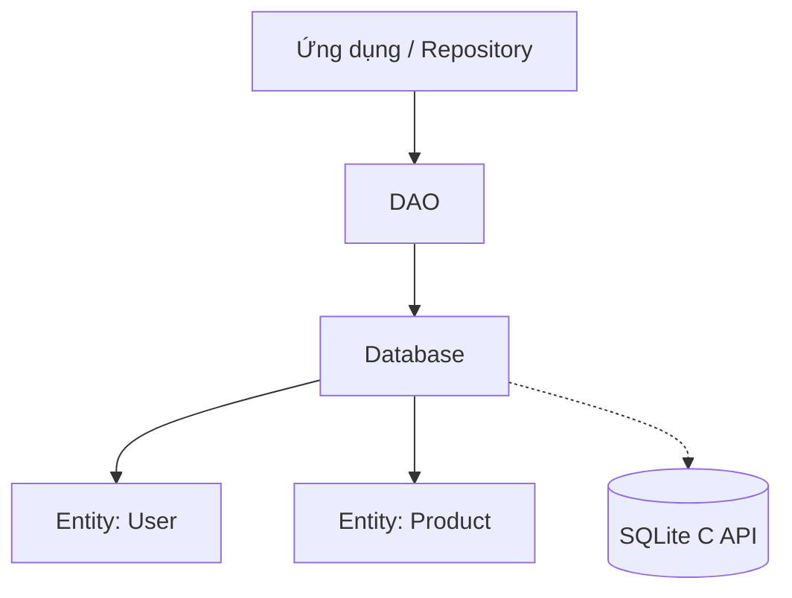

# Room Database: Kiến trúc & Bản chất

## Vấn đề cần giải quyết

DataStore (Key-Value) chỉ dành cho cấu hình đơn giản. Nhưng khi ứng dụng của bạn làm việc với dữ liệu có cấu trúc phức tạp và số lượng lớn: Danh sách 10,000 tin nhắn chat, giỏ hàng thương mại điện tử với hàng chục sản phẩm, hay lưu cache danh sách bài báo để đọc offline.

Để làm được việc này, thiết bị di động cần một Hệ quản trị cơ sở dữ liệu quan hệ (RDBMS). Android đã tích hợp sẵn **SQLite** (viết bằng C) trực tiếp vào nhân hệ điều hành.

Tuy nhiên, sử dụng SQLite API thuần trên Android là một ác mộng:
- Bạn phải tự viết câu query SQL dạng `String` (dễ gõ sai, chỉ biết lỗi khi chạy app - runtime error).
- Phải tự map (chuyển đổi) từ con trỏ `Cursor` sang Object của Java/Kotlin vô cùng dài dòng.
- Không hỗ trợ lắng nghe sự thay đổi của Database (Observability) một cách dễ dàng.

**Room Database** sinh ra để giải quyết nỗi đau này.

## Room Database thực chất là gì?

Room **KHÔNG PHẢI** là một database mới. Nó là một lớp **Abstraction Layer** (Lớp trừu tượng) bọc bên ngoài SQLite. 

Nói cách khác, dữ liệu cuối cùng vẫn được lưu vào file `.db` bằng SQLite C API. Nhưng thay vì bạn phải nói chuyện trực tiếp với SQLite bằng những câu lệnh thô sơ, bạn nói chuyện với Room bằng các Object Kotlin (ORM - Object Relational Mapping). Room sẽ tự động dịch các Object đó thành câu query SQL và ngược lại.

### Vì sao Room an toàn hơn SQLite thuần?
- **Compile-time verification:** Nếu bạn gõ sai tên cột trong câu query `@Query("SELECT * FROM uses")` (sai chữ user), Room sẽ báo lỗi **ngay lúc bạn ấn nút Build app**. Bạn không bao giờ bị dính crash khi đem lên Production.
- **Tự động Map:** Nó tự động biến kết quả từ DB thành `List<User>`.
- **Hỗ trợ Coroutines/Flow:** Truy vấn bất đồng bộ chỉ với từ khóa `suspend`, hoặc lắng nghe thay đổi tự động với `Flow`.

## 3 Thành phần cốt lõi của Room

Kiến trúc Room chia làm 3 lớp rất rõ ràng:

1. **Entity (Thực thể):** Các Data Class định nghĩa cấu trúc bảng (Table).
2. **DAO (Data Access Object):** Interface chứa các hàm để tương tác (CRUD) với dữ liệu. (Lớp mapping).
3. **Database:** Lớp abstract kết nối Entities và DAOs lại với nhau, quản lý kết nối xuống file SQLite dưới đĩa.



## Tư duy hệ thống: Single Source of Truth (SSOT)

Trong kiến trúc hiện đại, Room thường được dùng làm **Nguồn chân lý duy nhất (Single Source of Truth)**.

Nghĩa là: Khi UI yêu cầu dữ liệu, Repository sẽ **KHÔNG** trả data từ API về thẳng cho UI. Thay vào đó:
1. Repository fetch data từ API.
2. Lưu thẳng data đó vào Room Database.
3. UI chỉ `collect` một cái `Flow` đang lắng nghe từ Room Database.

**Lợi ích khổng lồ:**
- Ứng dụng **tự động có chế độ Offline**. Nếu mất mạng, UI vẫn hiển thị data đang có trong Room.
- Có mạng lại, API load xong ghi vào Room, Flow tự động "bắn" data mới lên UI mượt mà.

## Hướng dẫn triển khai thực tế (MVVM + Flow)

### 1. Định nghĩa Entity (Table)
```kotlin
@Entity(tableName = "articles")
data class ArticleEntity(
    @PrimaryKey val id: String, // Khóa chính
    val title: String,
    val content: String,
    val timestamp: Long
)
```

### 2. Định nghĩa DAO (Query)
Trọng tâm: Sử dụng `Flow` cho truy vấn đọc để UI tự động cập nhật, dùng `suspend` cho thao tác Ghi để chạy ngầm không block Main Thread.

```kotlin
@Dao
interface ArticleDao {
    // Trả về Flow -> Bất cứ khi nào bảng articles có sự thay đổi, 
    // Flow sẽ tự động emit List mới. UI không cần gọi lại hàm này!
    @Query("SELECT * FROM articles ORDER BY timestamp DESC")
    fun getAllArticles(): Flow<List<ArticleEntity>>

    // Insert một list. REPLACE nghĩa là nếu trùng ID thì ghi đè bản mới
    @Insert(onConflict = OnConflictStrategy.REPLACE)
    suspend fun insertArticles(articles: List<ArticleEntity>)
    
    @Query("DELETE FROM articles")
    suspend fun clearAll()
}
```

### 3. Khởi tạo Database
Dùng Singleton (qua Hilt/Dagger) để đảm bảo chỉ có 1 instance mở kết nối (kết nối DB rất tốn tài nguyên).

```kotlin
@Database(entities = [ArticleEntity::class], version = 1, exportSchema = false)
abstract class AppDatabase : RoomDatabase() {
    abstract fun articleDao(): ArticleDao
    
    // Khởi tạo bằng Builder thường đặt trong Dependency Injection module
    // Room.databaseBuilder(context, AppDatabase::class.java, "my_database.db").build()
}
```

### 4. Repository: Mảnh ghép SSOT (Offline First)

```kotlin
class ArticleRepository(
    private val api: ArticleApi,
    private val dao: ArticleDao
) {
    // UI Lắng nghe luồng này
    val articles: Flow<List<ArticleEntity>> = dao.getAllArticles()

    // Hàm gọi khi user vuốt pull-to-refresh hoặc mở app
    suspend fun syncDataFromApi() {
        try {
            // 1. Lấy từ mạng
            val networkArticles = api.fetchArticles()
            
            // 2. Chuyển đổi DTO -> Entity (nếu cần)
            val entities = networkArticles.map { /* mapping */ }
            
            // 3. Ghi vào Room. 
            // Vừa ghi xong, biến 'articles' Flow ở trên sẽ lập tức chớp data mới lên UI!
            dao.insertArticles(entities)
            
        } catch (e: Exception) {
            // Lỗi mạng, không sao cả, UI vẫn đang hiển thị data cũ từ Room
        }
    }
}
```

## Tổng kết

Room Database không phải để thay thế SQLite, mà nó **nâng cấp trải nghiệm** sử dụng SQLite. Việc kết hợp Room với Kotlin Flow và mô hình **Single Source of Truth** là "tiêu chuẩn vàng" để xây dựng một ứng dụng Android mượt mà, phản hồi nhanh và hoạt động trơn tru cả khi không có kết nối mạng.
